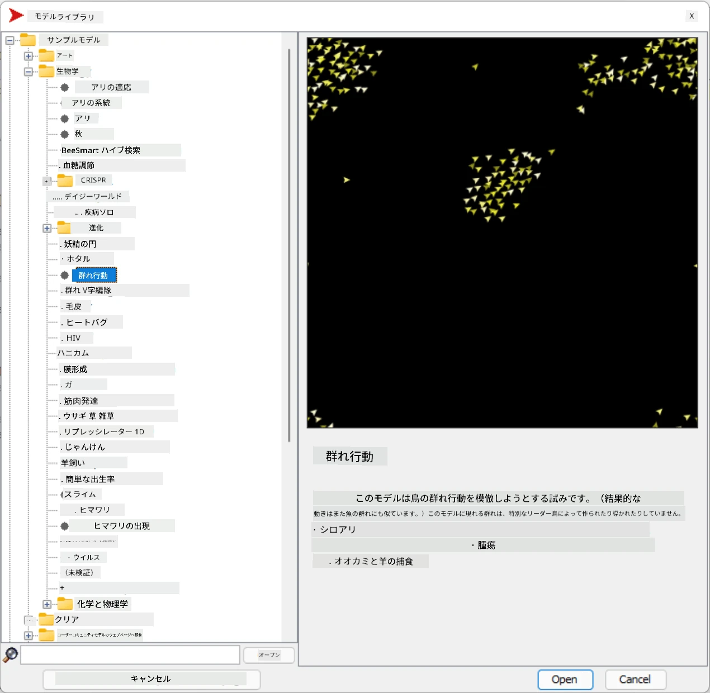

# マルチエージェントシステム

知能を実現する方法の一つとして、**創発的**（または**相乗的**）アプローチがあります。このアプローチは、多くの比較的単純なエージェントの組み合わせた行動が、システム全体としてより複雑（または知的）な行動を生み出す可能性があるという事実に基づいています。理論的には、[集合知](https://en.wikipedia.org/wiki/Collective_intelligence)、[創発主義](https://en.wikipedia.org/wiki/Global_brain)、[進化的サイバネティクス](https://en.wikipedia.org/wiki/Global_brain)の原則に基づいており、これらは、低レベルのシステムを適切に組み合わせることで高レベルのシステムが付加価値を得る（いわゆる*メタシステム移行の原則*）と述べています。

## [講義前のクイズ](https://ff-quizzes.netlify.app/en/ai/quiz/45)

**マルチエージェントシステム**の方向性は、1990年代にインターネットと分散システムの成長に応じてAIの分野で登場しました。古典的なAIの教科書の一つである[Artificial Intelligence: A Modern Approach](https://en.wikipedia.org/wiki/Artificial_Intelligence:_A_Modern_Approach)は、マルチエージェントシステムの観点から古典的なAIを捉えています。

マルチエージェントアプローチの中心となるのは**エージェント**という概念です。エージェントは、ある**環境**に存在し、その環境を認識し、行動を起こすことができる存在です。この定義は非常に広範であり、エージェントにはさまざまな種類や分類があります。

* 推論能力による分類:
   - **反応型**エージェントは通常、単純なリクエストとレスポンスの行動を持つ
   - **熟慮型**エージェントは論理的な推論や計画能力を使用する
* コードの実行場所による分類:
   - **静的**エージェントは専用のネットワークノードで動作する
   - **移動型**エージェントはネットワークノード間でコードを移動できる
* 行動による分類:
   - **受動型エージェント**は特定の目標を持たない。外部刺激に反応することはできるが、自ら行動を起こすことはない。
   - **能動型エージェント**は追求する目標を持つ
   - **認知型エージェント**は複雑な計画や推論を含む

現在、マルチエージェントシステムは多くのアプリケーションで使用されています。

* ゲームでは、多くのノンプレイヤーキャラクターが何らかのAIを使用しており、知的エージェントと見なすことができる
* 映像制作では、群衆を含む複雑な3Dシーンのレンダリングは通常、マルチエージェントシミュレーションを使用して行われる
* システムモデリングでは、マルチエージェントアプローチを使用して複雑なモデルの行動をシミュレートする。例えば、マルチエージェントアプローチはCOVID-19の世界的な感染拡大を予測するために成功裏に使用された。同様のアプローチは都市の交通をモデル化し、交通規則の変更に対する反応を観察するためにも使用できる。
* 複雑な自動化システムでは、各デバイスが独立したエージェントとして機能し、システム全体をよりモノリシックでなく、より堅牢にする。

私たちはマルチエージェントシステムについて深く掘り下げることはしませんが、**マルチエージェントモデリング**の一例を考えてみましょう。

## NetLogo

[NetLogo](https://ccl.northwestern.edu/netlogo/)は、[Logo](https://en.wikipedia.org/wiki/Logo_(programming_language))プログラミング言語の改良版に基づいたマルチエージェントモデリング環境です。この言語は子供たちにプログラミングの概念を教えるために開発され、**タートル**と呼ばれるエージェントを制御することができます。このタートルは移動しながら後ろに軌跡を残すことができ、複雑な幾何学的図形を作成することができます。これにより、エージェントの行動を視覚的に理解することができます。

NetLogoでは、`create-turtles`コマンドを使用して多くのタートルを作成できます。その後、すべてのタートルに対して何らかのアクションを命令することができます（以下の例では、10ポイント前進する）。

```
create-turtles 10
ask turtles [
  forward 10
]
```

もちろん、すべてのタートルが同じことをするのは面白くありません。そのため、特定のポイント付近にいるタートルのグループに`ask`コマンドを使用して命令することができます。また、`breed [cats cat]`コマンドを使用して異なる*種類*のタートルを作成することもできます。ここで`cat`は種類の名前であり、単数形と複数形の両方を指定する必要があります。これは、異なるコマンドが明確さのために異なる形を使用するためです。

> ✅ NetLogo言語自体を学ぶことはしませんが、興味がある場合は素晴らしい[Beginner's Interactive NetLogo Dictionary](https://ccl.northwestern.edu/netlogo/bind/)リソースを訪れてください。

NetLogoを[ダウンロード](https://ccl.northwestern.edu/netlogo/download.shtml)してインストールし、試してみることができます。

### モデルライブラリ

NetLogoの素晴らしい点は、試すことができる動作するモデルのライブラリが含まれていることです。**File &rightarrow; Models Library**に移動すると、多くのカテゴリのモデルを選択できます。



> Dmitry Soshnikovによるモデルライブラリのスクリーンショット

モデルの一つを開くことができます。例えば、**Biology &rightarrow; Flocking**を選択してください。

### 主な原則

モデルを開くと、NetLogoのメイン画面に移動します。ここでは、有限の資源（草）を考慮した狼と羊の個体数を記述するサンプルモデルを見てみましょう。


> Dmitry Soshnikovによるスクリーンショット

この画面では以下が確認できます。

* **インターフェース**セクションには以下が含まれます:
  - エージェントが存在するメインフィールド
  - ボタンやスライダーなどのさまざまなコントロール
  - シミュレーションのパラメータを表示するためのグラフ
* **コード**タブにはNetLogoプログラムを入力するエディタが含まれています

ほとんどの場合、インターフェースには**Setup**ボタン（シミュレーション状態を初期化する）と**Go**ボタン（実行を開始する）が含まれています。これらはコード内の対応するハンドラーによって処理され、以下のように見えます。

```
to go [
...
]
```

NetLogoの世界は以下のオブジェクトで構成されています。

* **エージェント**（タートル）はフィールドを移動し、何かを行うことができます。`ask turtles [...]`構文を使用してエージェントに命令し、角括弧内のコードはすべてのエージェントによって*タートルモード*で実行されます。
* **パッチ**はフィールドの正方形の領域で、エージェントが存在します。同じパッチ上のすべてのエージェントを参照したり、パッチの色やその他のプロパティを変更することができます。また、`ask patches`を使用してパッチに何かを行わせることもできます。
* **オブザーバー**は世界を制御するユニークなエージェントです。すべてのボタンハンドラーは*オブザーバーモード*で実行されます。

> ✅ マルチエージェント環境の魅力は、タートルモードやパッチモードで実行されるコードがすべてのエージェントによって同時に並行して実行されることです。そのため、少しのコードを書いて個々のエージェントの行動をプログラムすることで、シミュレーションシステム全体の複雑な行動を作り出すことができます。

### 群れ行動

マルチエージェント行動の例として、**[群れ行動](https://en.wikipedia.org/wiki/Flocking_(behavior))**を考えてみましょう。群れ行動は、鳥の群れが飛ぶ様子に非常に似た複雑なパターンです。鳥が飛ぶ様子を見ていると、何らかの集団的なアルゴリズムに従っているように見えたり、*集合知*を持っているように思えるかもしれません。しかし、この複雑な行動は、各個体のエージェント（この場合は*鳥*）が近距離にいる他のエージェントを観察し、以下の3つの単純なルールに従うことで生じます。

* **整列** - 近隣のエージェントの平均的な進行方向に向かって進む
* **結束** - 近隣の平均位置に向かって進む（*長距離の引力*）
* **分離** - 他の鳥に近づきすぎた場合、離れるように動く（*短距離の反発*）

群れ行動の例を実行してその動作を観察することができます。また、*分離の度合い*や*視野範囲*などのパラメータを調整することもできます。視野範囲を0に減らすと、すべての鳥が盲目になり、群れ行動が停止します。分離を0に減らすと、すべての鳥が一直線に集まります。

> ✅ **コード**タブに切り替えて、群れ行動の3つのルール（整列、結束、分離）がコード内でどのように実装されているかを確認してください。視界内にいるエージェントのみを参照している点に注目してください。

### 他のモデルの例

以下のような興味深いモデルをいくつか試してみることができます。

* **Art &rightarrow; Fireworks**は、花火が個々の火の流れの集合的な行動として考えられる様子を示します
* **Social Science &rightarrow; Traffic Basic**および**Social Science &rightarrow; Traffic Grid**は、交通信号の有無にかかわらず、1Dおよび2Dグリッドでの都市交通のモデルを示します。シミュレーション内の各車両は以下のルールに従います:
   - 前方のスペースが空いている場合 - 加速（一定の最大速度まで）
   - 前方に障害物が見える場合 - ブレーキ（運転者がどれだけ遠くまで見えるかを調整可能）
* **Social Science &rightarrow; Party**は、カクテルパーティ中に人々がどのように集まるかを示します。グループの幸福度が最も速く増加するパラメータの組み合わせを見つけることができます。

これらの例からわかるように、マルチエージェントシミュレーションは、同じまたは類似の論理に従う個々の個体で構成される複雑なシステムの行動を理解するための非常に有用な方法となり得ます。また、コンピュータゲーム内の[NPC](https://en.wikipedia.org/wiki/NPC)や3Dアニメーションの世界内のエージェントなど、仮想エージェントを制御するためにも使用できます。

## 熟慮型エージェント

上記で説明したエージェントは非常に単純で、環境の変化に対して何らかのアルゴリズムを使用して反応します。このようなエージェントは**反応型エージェント**と呼ばれます。しかし、時にはエージェントが推論し、行動を計画することがあり、その場合は**熟慮型**と呼ばれます。

典型的な例として、人間からの指示を受けて休暇ツアーを予約する個人エージェントがあります。インターネット上に存在する多くのエージェントがそれを助けることができると仮定します。このエージェントは他のエージェントに連絡し、利用可能なフライトや異なる日付のホテル料金を確認し、最良の価格を交渉しようとします。休暇計画が完了し、所有者によって確認されると、予約を進めることができます。

これを実現するために、エージェントは**通信**する必要があります。通信を成功させるためには以下が必要です。

* [Knowledge Interchange Format](https://en.wikipedia.org/wiki/Knowledge_Interchange_Format) (KIF)や[Knowledge Query and Manipulation Language](https://en.wikipedia.org/wiki/Knowledge_Query_and_Manipulation_Language) (KQML)などの**知識を交換するための標準言語**。これらの言語は[発話行為理論](https://en.wikipedia.org/wiki/Speech_act)に基づいて設計されています。
* **交渉のためのプロトコル**を含む必要があり、さまざまな**オークション形式**に基づいています。
* **共通のオントロジー**を使用し、同じ概念を参照してその意味を理解できるようにする
* さまざまなエージェントが何をできるかを**発見**する方法も必要であり、これも何らかのオントロジーに基づいています

熟慮型エージェントは反応型エージェントよりもはるかに複雑です。環境の変化に反応するだけでなく、*行動を開始*することもできなければなりません。熟慮型エージェントの提案されているアーキテクチャの一つに、Belief-Desire-Intention (BDI)エージェントがあります。

* **Beliefs**はエージェントの環境に関する知識のセットを形成します。知識ベースやルールのセットとして構造化され、エージェントが環境内の特定の状況に適用することができます。
* **Desires**はエージェントが何をしたいか、つまりその目標を定義します。例えば、上記の個人アシスタントエージェントの目標はツアーを予約することであり、ホテルエージェントの目標は利益を最大化することです。
* **Intentions**はエージェントが目標を達成するために計画する具体的な行動です。行動は通常、環境を変化させ、他のエージェントとの通信を引き起こします。

マルチエージェントシステムを構築するためのプラットフォームとして[JADE](https://jade.tilab.com/)などがあります。[この論文](https://arxiv.org/ftp/arxiv/papers/2007/2007.08961.pdf)には、マルチエージェントプラットフォームのレビュー、マルチエージェントシステムの簡単な歴史、およびそのさまざまな使用シナリオが含まれています。

## 結論

マルチエージェントシステムは非常に多様な形を取り、多くの異なるアプリケーションで使用される可能性があります。
これらはすべて、個々のエージェントの単純な行動に焦点を当て、**相乗効果**によってシステム全体のより複雑な行動を実現する傾向があります。

## 🚀 チャレンジ

このレッスンを

---

