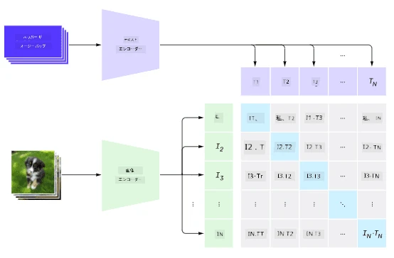
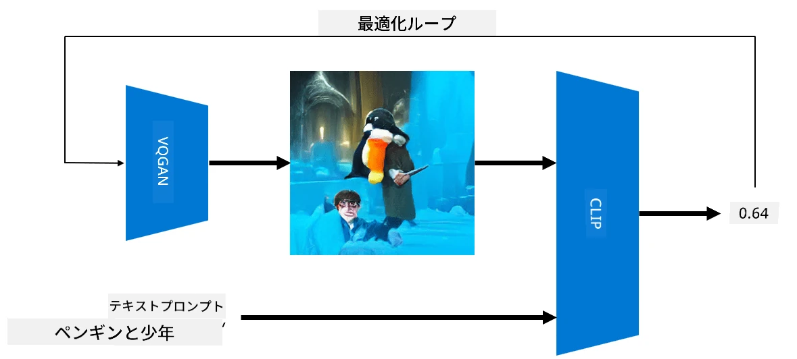

# マルチモーダルネットワーク

トランスフォーマーモデルがNLPタスクで成功を収めた後、同様のアーキテクチャがコンピュータビジョンタスクにも適用されるようになりました。視覚と言語の能力を*組み合わせる*モデルを構築することへの関心が高まっています。その試みの一つがOpenAIによるCLIPやDALL.Eです。

## Contrastive Image Pre-Training (CLIP)

CLIPの主なアイデアは、テキストプロンプトと画像を比較し、画像がプロンプトにどれだけ対応しているかを判断できるようにすることです。

> *画像は[このブログ記事](https://openai.com/blog/clip/)から引用*

このモデルは、インターネットから取得した画像とそのキャプションを用いてトレーニングされます。各バッチでは、N組の(画像、テキスト)ペアを取り、それらをベクトル表現に変換します。そして、それらの表現をマッチングさせます。損失関数は、1つのペア（例: IとT）に対応するベクトル間のコサイン類似度を最大化し、他のすべてのペア間のコサイン類似度を最小化するように定義されます。このアプローチが**コントラスト学習**と呼ばれる理由です。

CLIPモデル/ライブラリは[OpenAI GitHub](https://github.com/openai/CLIP)から利用可能です。このアプローチは[このブログ記事](https://openai.com/blog/clip/)で説明されており、さらに詳細は[この論文](https://arxiv.org/pdf/2103.00020.pdf)に記載されています。

このモデルを事前学習した後、画像のバッチとテキストプロンプトのバッチを与えると、確率のテンソルを返します。CLIPは以下のようなタスクに使用できます：

**画像分類**

例えば、画像を猫、犬、人間に分類する必要があるとします。この場合、モデルに画像と一連のテキストプロンプト（例: "*a picture of a cat*"、"*a picture of a dog*"、"*a picture of a human*"）を与えます。結果として得られる3つの確率のベクトルの中で、最も高い値を持つインデックスを選択すればよいのです。

> *画像は[このブログ記事](https://openai.com/blog/clip/)から引用*

**テキストベースの画像検索**

逆のことも可能です。画像のコレクションがある場合、このコレクションをモデルに渡し、テキストプロンプトを与えると、指定されたプロンプトに最も類似した画像を返します。

## ✍️ 例: [CLIPを使った画像分類と画像検索](../../../../../lessons/X-Extras/X1-MultiModal/Clip.ipynb)

[Clip.ipynb](../../../../../lessons/X-Extras/X1-MultiModal/Clip.ipynb)ノートブックを開いて、CLIPの動作を確認してください。

## VQGAN+CLIPを使った画像生成

CLIPはテキストプロンプトからの**画像生成**にも使用できます。このためには、ベクトル入力に基づいて画像を生成できる**生成モデル**が必要です。その一つが[VQGAN](https://compvis.github.io/taming-transformers/)（Vector-Quantized GAN）と呼ばれるモデルです。

VQGANが通常の[GAN](../../4-ComputerVision/10-GANs/README.md)と異なる主な点は以下の通りです：
* 自己回帰型トランスフォーマーアーキテクチャを使用して、画像を構成する文脈豊かな視覚的パーツのシーケンスを生成します。これらの視覚的パーツは[CNN](../../4-ComputerVision/07-ConvNets/README.md)によって学習されます。
* サブイメージ判別器を使用して、画像の一部が「本物」か「偽物」かを検出します（従来のGANの「全体か無か」のアプローチとは異なります）。

VQGANの詳細については、[Taming Transformers](https://compvis.github.io/taming-transformers/)のウェブサイトをご覧ください。

VQGANと従来のGANの重要な違いの一つは、後者が任意の入力ベクトルから適切な画像を生成できるのに対し、VQGANは一貫性のない画像を生成する可能性が高いことです。そのため、画像生成プロセスをさらに誘導する必要があり、それがCLIPを使用して行われます。

テキストプロンプトに対応する画像を生成するには、まずランダムなエンコーディングベクトルを用意し、それをVQGANに通して画像を生成します。その後、CLIPを使用して、画像がテキストプロンプトにどれだけ対応しているかを示す損失関数を生成します。その損失を最小化することを目指し、逆伝播を使用して入力ベクトルのパラメータを調整します。

VQGAN+CLIPを実装した優れたライブラリとして[Pixray](http://github.com/pixray/pixray)があります。

 |   | 
----|----|----
プロンプト *a closeup watercolor portrait of young male teacher of literature with a book* から生成された画像 | プロンプト *a closeup oil portrait of young female teacher of computer science with a computer* から生成された画像 | プロンプト *a closeup oil portrait of old male teacher of mathematics in front of blackboard* から生成された画像

> 画像は[Dmitry Soshnikov](http://soshnikov.com)による**Artificial Teachers**コレクションから引用

## DALL-E
### [DALL-E 1](https://openai.com/research/dall-e)
DALL-Eは、プロンプトから画像を生成するようにトレーニングされたGPT-3のバージョンです。120億のパラメータでトレーニングされています。

CLIPとは異なり、DALL-Eはテキストと画像の両方を、画像とテキストのトークンの単一ストリームとして受け取ります。そのため、複数のプロンプトからテキストに基づいて画像を生成できます。

### [DALL-E 2](https://openai.com/dall-e-2)
DALL-E 1と2の主な違いは、よりリアルな画像やアートを生成できる点です。

DALL-Eによる画像生成の例：
 |   | 
----|----|----
プロンプト *a closeup watercolor portrait of young male teacher of literature with a book* から生成された画像 | プロンプト *a closeup oil portrait of young female teacher of computer science with a computer* から生成された画像 | プロンプト *a closeup oil portrait of old male teacher of mathematics in front of blackboard* から生成された画像

## 参考文献

* VQGAN論文: [Taming Transformers for High-Resolution Image Synthesis](https://compvis.github.io/taming-transformers/paper/paper.pdf)
* CLIP論文: [Learning Transferable Visual Models From Natural Language Supervision](https://arxiv.org/pdf/2103.00020.pdf)

**免責事項**:  
この文書は、AI翻訳サービス [Co-op Translator](https://github.com/Azure/co-op-translator) を使用して翻訳されています。正確性を追求しておりますが、自動翻訳には誤りや不正確な部分が含まれる可能性があることをご承知おきください。元の言語で記載された文書が公式な情報源とみなされるべきです。重要な情報については、専門の人間による翻訳を推奨します。この翻訳の使用に起因する誤解や誤認について、当方は一切の責任を負いません。