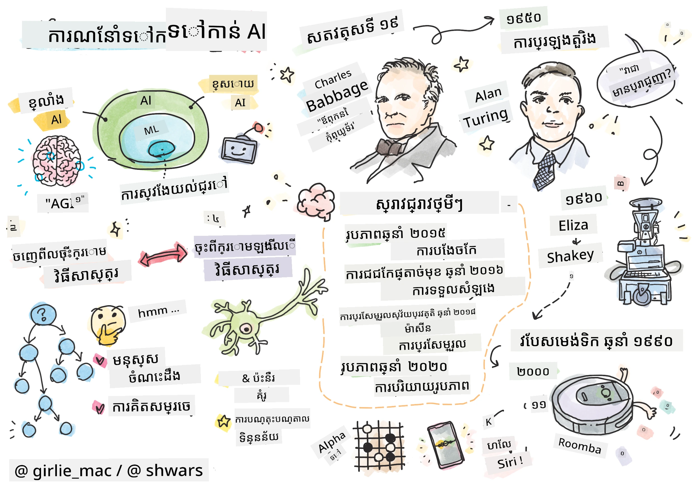
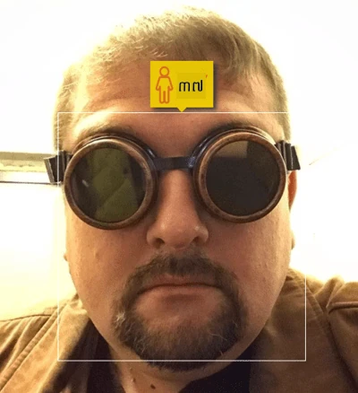
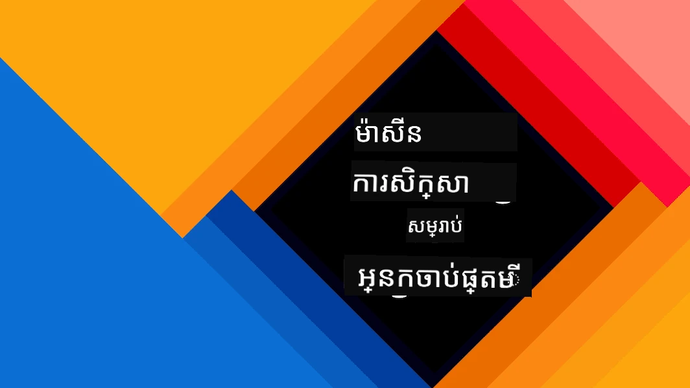
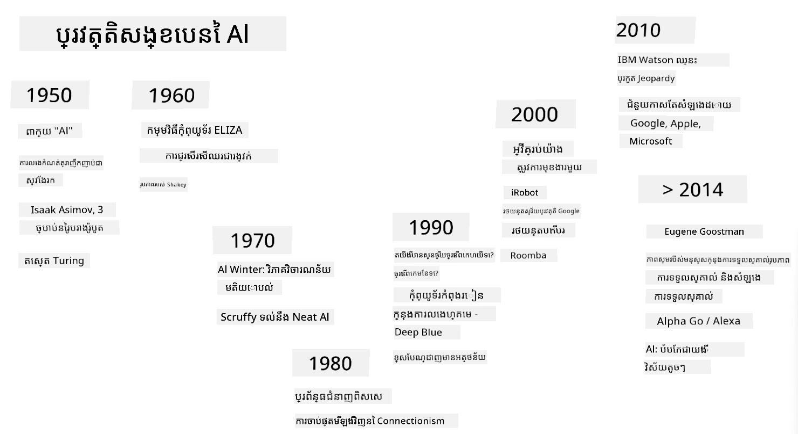
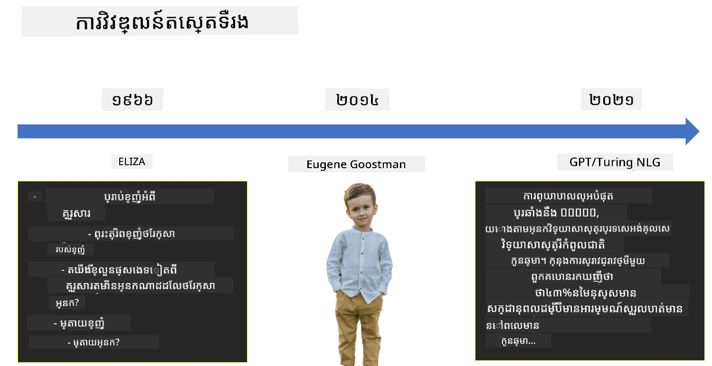
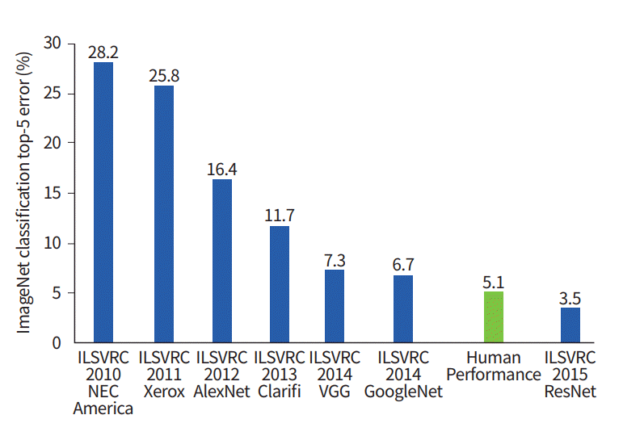

# បំណើតនៃ AI

> ស្កេតឈូសដោយ [Tomomi Imura](https://twitter.com/girlie_mac)

## [សំណួរប្រលងមុខមុខបង្រៀន](https://ff-quizzes.netlify.app/en/ai/quiz/1)

**បញ្ញាសិប្បនិម្មិត** គឺជាវិស័យវិទ្យាសាស្រ្តដ៏រំភើបមួយដែលសិក្សាថាតើយើងអាចធ្វើឱ្យកុំព្យូទ័របង្ហាញអាកប្បកិរិយាដូចមានបញ្ញាបានយ៉ាងដូចម្តេច ឧ. ធ្វើរឿងទាំងនេះដែលមនុស្សបានល្អក្នុងការធ្វើ។

ភាគចំបង កុំព្យូទ័រត្រូវបានបង្កើតដោយ [Charles Babbage](https://en.wikipedia.org/wiki/Charles_Babbage) ដើម្បីប្រតិបត្តិលើលេខតាមនីតិវិធីបញ្ជាក់បានល្អ - គឺអាល់គុណ។ កុំព្យូទ័រពិចារណា ស្ថិតក្នុងសម័យសព្វវេលា ទោះបីច្រើនជាងគំរូដើមនៅសតវត្សទី១៩យ៉ាងខ្លាំងក៏ដោយ ក៏នៅតែអនុវត្តន៍គំនិតដូចគ្នា នៃការគណនា តាមបណ្តាដំណាក់កាលបានគ្រប់គ្រង។ ដូច្នេះ អាចកំណត់កម្មវិធីឱ្យកុំព្យូទ័រធ្វើអ្វីមួយបាន ប្រសិនបើយើងដឹងលំអិតលំអាំងរបៀបដំណើរការដើម្បីសម្រេចគោលដៅ។

> រូបថតដោយ [Vickie Soshnikova](http://twitter.com/vickievalerie)

> ✅ ការកំណត់អាយុមនុស្សពីរូបថតរបស់គេជាការងារដែលមិនអាចចាត់តាមកម្មវិធីបានយ៉ាងច្បាស់ ព្រោះយើងមិនដឹងបែបណាដើម្បីយកលេខមួយនៅក្នុងក្បាលពេលធ្វើការងារនេះឡើយ។

---

មានការងារមួយចំនួន ដែលយើងមិនដឹងច្បាស់ពីរបៀបដោះស្រាយ។ គិតពីការកំណត់អាយុមនុស្សពីរូបថតរបស់គេ។ យើងយ៉ាងណាមានការរៀនធ្វើបាន ព្រោះឃើញឧទាហរណ៍មនុស្សអាយុផ្សេងៗជាច្រើន ប៉ុន្ដែមិនអាចពន្យល់ច្បាស់បានជាគោលការណ៍ មិនអាចកម្មវិធីកុំព្យូទ័រធ្វើបានផង។ នេះជាបញ្ហាប្រភេទដែលមានចំណាប់អារម្មណ៍ចំពោះ **បញ្ញាសិប្បនិម្មិត** (AI សម្រាប់ខ្លី)។

✅ សូមគិតពីកិច្ចការមួយចំនួនដែលអ្នកអាចផ្តាច់បន្ទុកទៅកុំព្យូទ័រដែលអាចទទួលបានអត្ថប្រយោជន៍ពី AI។ គិតពីវិស័យហិរញ្ញវត្ថុ វេជ្ជសាស្រ្ត និងសិល្បៈ - តើវិស័យទាំងនេះទទួលបានអត្ថប្រយោជន៍ពី AI ដូចម្តេចខ្លះនៅសព្វថ្ងៃ?

## AI ខ្សោយ និង AI ខ្លាំង

AI ខ្សោយ | AI ខ្លាំង
---------------------------------------|-------------------------------------
AI ខ្សោយ ជាប្រព័ន្ធ AI ដែលបុគ្គលិកដើម្បីបំពេញបេសកកម្មជាក់លាក់ឬកិច្ចការត្រឹមតែបន្ថែមបន្តិចបន្តួច។ | AI ខ្លាំង ឬ បញ្ញាសិប្បនិម្មិតទូទៅ (AGI) ជាប្រព័ន្ធ AI ដែលមានបញ្ញាថ្នាក់មនុស្ស និងការយល់ដឹង។
ប្រព័ន្ធ AI ទាំងនេះមិនមានបញ្ញាទូលំទូលាយទេ; ពួកវាសំខាន់ក្នុងការបំពេញកិច្ចការដែលបានកំណត់ខ្លួន តែកម្រិតនៃការយល់ដឹង ឬ ភាពជារូបចរិតគឺគ្មាន។ | ប្រព័ន្ធ AI ទាំងនេះមានសមត្ថភាពធ្វើកិច្ចការនៃបញ្ញាណាមួយដែលមនុស្សអាចធ្វើបាន ប្តូរតួបានប្រភេទ ផងមានរូបរាងនៃការយល់ដឹង ឬ មានសក្ដានុពលការចេះដឹងខ្លួនឯង។
ឧទាហរណ៍ AI ខ្សោយ រួមមានជំនួយផ្ទាល់ខ្លួនដូចជា Siri ឬ Alexa, អាល់ហ្គរីធម៍ផ្តល់អនុសាសន៍ដែលប្រើប្រាស់ដោយសេវាកម្មផ្សាយផ្ទាល់អេឡិចត្រូនិច និង ប្ដូរគណនីសម្រាប់បំរើអតិថិជនជាក់លាក់។ | ការសម្រេចបាន AI ខ្លាំង ជាគោលបំណងរយៈពេលវែងនៃការស្រាវជ្រាវ AI ហើយត្រូវការការអភិវឌ្ឍប្រព័ន្ធ AI ដែលអាច ហែកហូត រៀន យល់ និងប្តូរតាមបរិបទ និងកិច្ចការផ្សេងៗ។
AI ខ្សោយមានជំនាញជាក់លាក់ខ្ពស់ ហើយមិនមានសមត្ថភាពគិតមនុស្សដូច ឬ ជំនាញដោះស្រាយបញ្ហាទូលំទូលាយក្រៅពីវិស័យតូចៗរបស់វា។ | AI ខ្លាំងគឺជាគំនិតទ្រឹស្តី នៅឡើយទេ មានប្រព័ន្ធ AI មួយណាដែលបានចូលដល់កម្រិតបញ្ញាទូលំទូលាយនេះ។

សម្រាប់ព័ត៌មានបន្ថែម សូមយោងទៅ **[បញ្ញាសិប្បនិម្មិតទូទៅ](https://en.wikipedia.org/wiki/Artificial_general_intelligence)** (AGI)។

## ការបកស្រាយនៃបញ្ញា និងសាកល្បង Turing

បញ្ហាមួយក្នុងការដោះស្រាយពាក្យ **[បញ្ញា](https://en.wikipedia.org/wiki/Intelligence)** គឺថាគ្មានការបកស្រាយច្បាស់លាស់សម្រាប់ពាក្យនេះទេ។ អ្នកម្នាក់អាចតវ៉ាថាបញ្ញាទាក់ទងនឹង **ការគិតអប្សរាហ៍** ឬ **ការយល់ដឹងខ្លួនឯង** ប៉ុន្តែយើងមិនអាចកំណត់វាយ៉ាងត្រឹមត្រូវបានទេ។

> [រូបថត](https://unsplash.com/photos/75715CVEJhI) ដោយ [Amber Kipp](https://unsplash.com/@sadmax) ពី Unsplash

ដើម្បីមើលភាពមិនច្បាស់លាស់នៃពាក្យ *បញ្ញា* សូមព្យាយាមឆ្លើយសំណួរ៖ "តើឆ្មាមានបញ្ញាទេ?"។ មនុស្សជាច្រើនប្រាកដជាផ្តល់ចម្លើយខុសគ្នា សម្រាប់សំណួរនេះពីព្រោះគ្មានការសាកល្បងទន្ទេញទស្សន៍ទូលាយសំរាប់បញ្ជាក់ថាអត្ថន័យនេះត្រឹមត្រូវ ឬមិនត្រឹមត្រូវឡើយ។ ហើយប្រសិនបើអ្នកគិតថាមាន សូមជួយផាត់ឆ្មារបស់អ្នកតាមសាកល្បង IQ មួយបានទេ...

✅ សូមគិតរយៈពេលមួយ នៃរបៀបដែលអ្នកកំណត់បញ្ញា។ តើកកណ្តុរ ដែលអាចដោះស្រាយបន្ទាត់ឬរកម្ហូបបាន មានបញ្ញាថែមទៀតទេ? តើកុមារមានបញ្ញាទេ?

---

ពេលនិយាយអំពី AGI យើងត្រូវការបទបង្ហាញមួយសម្រាប់បញ្ជាក់ថាយើងបានបង្កើតប្រព័ន្ធដែលមានបញ្ញារបស់ពិតប្រាកដ។ [Alan Turing](https://en.wikipedia.org/wiki/Alan_Turing) បានណែនាំវិធីមួយហៅថា **[សាកល្បង Turing](https://en.wikipedia.org/wiki/Turing_test)** ដែលក៏ដើរតួជាការបកស្រាយនៃបញ្ញា។ ការសាកល្បងប្រៀបធៀបប្រព័ន្ធមួយទៅនឹងអ្វីដែលមានបញ្ញាខ្ទង់មនុស្សពិតប្រាកដ ហើយដោយសារការប្រៀបធៀបដោយស្វ័យប្រវត្តិអាចត្រូវបានល្បួងដោយកម្មវិធីកុំព្យូទ័រ យើងប្រើអ្នកសួរសំណួរមនុស្ស។ ដូច្នេះ ប្រសិនបើមនុស្សម្នាក់មិនអាចបង្កប់ចន្លោះមនុស្សពិត និង ប្រព័ន្ធកុំព្យូទ័រពាក្យសម្រាប់ជជែកដោយអក្សរ - ប្រព័ន្ធនោះត្រូវបានគេចាត់ទុកថាមានបញ្ញា។

> បូតជជែកមួយហៅថា [Eugene Goostman](https://en.wikipedia.org/wiki/Eugene_Goostman) ដែលអភិវឌ្ឍនៅ St.Petersburg បានឈានច្រើនដល់ការឆ្លងការសាកល្បង Turing ក្នុងឆ្នាំ 2014 ដោយប្រើទេពកោសល្យជាប់ចិត្តនៃអត្តសញ្ញាណ។ វាប្រកាសជាមុនថាវាជាកុមារវ័យ 13 ឆ្នាំ មកពីអ៊ុយក្រែន ធ្វើឲ្យពន្យល់បានពីការខ្វះចំណេះដឹង និងភាពខុសគ្នាខ្លះក្នុងអត្ថបទ។ បូតបានហេដ្ឋារចនាអ្នកវិនិច្ឆ័យ 30% ថាវាជាមនុស្ស បន្ទាប់ពីជជែករយៈពេល 5 នាទី គឺគន្លងមួយដែល Turing ជឿថា ឧបករណ៍អាចឆ្លងតាមបានឆាប់ៗនៅឆ្នាំ 2000។ ទោះជាយ៉ាងណា គេគួរយល់ថា វានៅមិនប្រហែលបានបញ្ជាក់ថាយើងបានបង្កើតប្រព័ន្ធមានបញ្ញា ឬថាប្រព័ន្ធកុំព្យូទ័របោកអ្នកសួរសំណួរមនុស្ស។ ប្រព័ន្ធមិនបានបោកមនុស្សទេ តែជាមនុស្សបង្កើតប្រាត់ចិត្ត​ប៉ុណ្ណោះ!

✅ តើអ្នកដែលធ្លាប់ត្រូវបានបោកដោយបូតជជែក ដូចជាគិតថាអ្នកកំពុងនិយាយនឹងមនុស្សទេ? វាប៉ុន្មានដល់អ្នកយ៉ាងដូចម្តេច?

## វិធីសាស្ត្រផ្សេងៗទៅ AI

បើជាចង់ឲ្យកុំព្យូទ័រប្រុងប្រយ័ត្នដូចមនុស្ស យើងត្រូវបានត្រឹមតែគំរូដឺកបែបគិតនៅក្នុងកុំព្យូទ័រ។ ដូច្នេះយើងត្រូវព្យាយាមយល់ពីអ្វីដែលធ្វើឲ្យមនុស្សមានបញ្ញា។

> ដើម្បីអាចកំណត់កម្មវិធីបញ្ញាទៅ機械មួយ យើងត្រូវយល់ពីវិធីនៃដំណើរការអ្នកជ្រើសរើសសេចក្តីសម្រេចចិត្តរបស់ខ្លួន។ ប្រសិនបើអ្នកពិចារណាគ្រប់ខ្លួន អ្នកនឹងសង្កេតឃើញថាមានដំណើរការខ្លះដែលកើតឡើងដោយដោយស្វ័យ (subconscious) មិនចាំបាច់គិត - ឧ. យើងអាចបំភ្លឺឆ្មាចេញពីឆ្កែដោយមិនគិតអំពីវា ខណៈដែលការចាប់អារម្មណ៍ផ្សេងៗទៀតពាក់ព័ន្ធនឹងហេតុផល។

មានវិធីទាំងពីរ​ដើម្បីដោះស្រាយបញ្ហានេះ៖

វិធីខ្ពស់ទៅទាប (កំណត់ត្រាសមួង) | វិធីទាបទៅខ្ពស់ (បណ្តាញប្រសាទ)
---------------------------------------|-------------------------------------
វិធីខ្ពស់ទៅទាបគំរូរបៀបគិតរបស់មនុស្សដើម្បីដោះស្រាយបញ្ហា។ វាពាក់ព័ន្ធនឹងការដកស្រង់ **ចំណេះដឹង** ពីមនុស្ស និងតំណាងវាទៅជាទម្រង់ដែលកុំព្យូទ័រអាចអានបាន។ យើងក៏ត្រូវអភិវឌ្ឍវិធីសាស្ត្រមួយក្នុងការគំរូ **ការគិត** នៅក្នុងកុំព្យូទ័រផងដែរ។ | វិធីទាបទៅខ្ពស់គំរូរាងសមាសភាគខួរក្បាលមនុស្ស មានសមាសភាគតិចមួយចំនួនហៅថា **ប្រសាទ**។ ប្រសាទនីមួយៗប្រតិបត្តិដូចជាមធ្យមភាពទំងន់នៃវាសព្វសំរបសំរួល, ហើយយើងអាចបណ្តុះបណ្តាលបណ្តាញប្រសាទដើម្បីដោះស្រាយបញ្ហាមានប្រយោជន៍ដោយផ្តល់ **ទិន្នន័យបណ្តុះបណ្តាល**។

នៅមានវិធីផ្សេងទៀតសម្រាប់បញ្ញា៖

* វិធីសាស្ត្រនៃ **ការលេចមក**, **ស៊ុមសេរី** ឬ **វិធីជាមួយតួអង្គច្រើន** សហការណ៍ផ្អែកលើការប្រតិកម្មរបស់តួអង្គសាមញ្ញជាច្រើនចំនួន។ យោងតាម [evolutionary cybernetics](https://en.wikipedia.org/wiki/Global_brain#Evolutionary_cybernetics), បញ្ញាអាច *លេចឡើង* ពីសកម្មភាពសាមញ្ញ ឆ្លើយតបក្នុងដំណើរនៃ *ការផ្លាស់ប្តូរប្រព័ន្ធកម្រិត*។

* វិធីសាស្ត្រនៃ **កំណើតវិកល**, ឬ **អាល់ហ្គរីធម៍អូសត្រូវបានកំណត់** គឺជាដំណើរការបង្កើតប្រសើរឡើង មួយផ្អែកទៅលើគោលការណ៍នៃការវិវឌ្ឍ។

យើងនឹងពិចារណាវិធីទាំងនេះនៅពេលក្រោយនៅក្នុងវគ្គនេះ ប៉ុន្តែពេលនេះយើងនឹងផ្ដោតសំខាន់ទៅលើទិសដៅសំខាន់ទាំងពីរ៖ ខ្ពស់ទៅទាប និង ទាបទៅខ្ពស់។

### វិធីខ្ពស់ទៅទាប

ក្នុង **វិធីខ្ពស់ទៅទាប** យើងព្យាយាមគំរូការគិតរបស់យើង។ ពីព្រោះយើងអាចតាមដានគំនិតពេលគិត យើងអាចបង្ហាញវិធីនេះជារូបមន្ត និងកំណត់កម្មវិធីវានៅក្នុងកុំព្យូទ័រ។ វាសម្ពោធឈ្មោះថា **ការគិតសញ្ញា**។

មនុស្សជាទូទៅមានច្បាប់ក្នុងក្បាលដែលនាំឲ្យដំណើរការសេចក្តីសម្រេចចិត្ត។ ឧទាហរណ៍ ពេលអ្នកគ្រូពេទ្យបញ្ជាក់ជំងឺអ្នកជម្ងឺ គាត់អាចសង្កេតឃើញថា មនុស្សមានកាំជម្រាល ហើយវាអាចបណ្តាលឲ្យមានការរលាកខ្លះនៅក្នុងរាងកាយ។ ដោយអនុវត្តច្បាប់ជាច្រើនទៅកាន់ករណីជាក់លាក់ អ្នកគ្រូពេទ្យអាចរកបានការបញ្ជាក់ចុងក្រោយ។

វិធីសាស្ត្រនេះពឹងផ្អែកខ្លាំងលើ **តំណាងចំណេះដឹង** និង **ការគិត**។ ការដកចំណេះដឹងពីអ្នកជំនាញអាចជាផ្នែកលំបាកបំផុត ពីព្រោះអ្នកគ្រូពេទ្យជាច្រើនករណីមិនដឹងថាអំពីហេតុអ្វីបានជាគាត់រកឃើញការបញ្ជាក់ប្លែកៗមួយ។ នៅពេលខ្លះដំណោះស្រាយបង្ហាញនូវមកក្នុងក្បាលគាត់ដោយមិនចាំបាច់គិតច្បាស់លាស់ឡើយ។ ការងារផ្សេងៗដូចជាការកំណត់អាយុមនុស្សពីរូបថត មិនអាចបង្រួមទៅការរំលាយចំណេះដឹងបានទេ។

### វិធីទាបទៅខ្ពស់

វាគឺជាគំនិតផ្សេងពីវីធីខ្ពស់ទៅទាប។ យើងអាចព្យាយាមគំរូធាតុសាមញ្ញបំផុតខាងក្នុងខួរក្បាលយើង គឺប្រសាទមួយ។ យើងអាចបង្កើតអ្វីហៅថា **បណ្តាញប្រសាទសិប្បនិម្មិត** នៅក្នុងកុំព្យូទ័រ ហើយសាកល្បងបង្រៀនវាដោះស្រាយបញ្ហាដោយផ្តល់ឧទាហរណ៍។ ដំណើរការនេះប្រហែលដូចបុត្របង្កើតថ្មីរៀនអំពីពិភពជុំវិញវាតាមរយៈការបង្កើតសំគាល់។

✅ សូមស្រាវជ្រាវពីរបៀបកុមាររៀន។ ធាតុសំខាន់ៗនៃខួរក្បាលកុមារមិនអី?

> | តើអ្វីអំពី ML?         |      |
> |--------------|-----------|
> | ផ្នែកមួយនៃបញ្ញាសិប្បនិម្មិត ដែលផ្អែកលើការសិក្សាកុំព្យូទ័រដើម្បីដោះស្រាយបញ្ហាម្ដងទៀតដោយផ្អែកលើទិន្នន័យហៅថា **ការរៀនម៉ាស៊ីន**។ យើងមិនទាក់ទងនៅវគ្គនេះទេ - យើងគឺផ្ដល់អ្នកទៅសៀវភៅរៀន **Machine Learning for Beginners** ផ្សេងទៀត។ |       |

## ប្រវត្តិសង្ខេបនៃ AI

បញ្ញាសិប្បនិម្មិតចាប់ផ្តើមក្នុងស្រុកវិស័យនៅកណ្តាលសតវត្សទី ២០។ គំរូការគិតសញ្ញាគឺជា វិធីធំមួយ ហើយនាំឲ្យមានជោគជ័យសំខាន់ជាច្រើន ដូចជាប្រព័ន្ធអ្នកជំនាញ - កម្មវិធីកុំព្យូទ័រដែលអាចមានតួនាទីជាអ្នកជំនាញក្នុងវិស័យកំណត់មួយចំនួន។ ប៉ុន្តែវាបានដំណឹងឲ្យយើងឃើញថាវិធីនេះមិនអាចពង្រីកបានល្អទេ។ ការដកចំណេះដឹងពីអ្នកជំនាញ ការតំណាងវាគ្នា ក្នុងកុំព្យូទ័រ និងការថែរក្សាការចងចាំចំណេះដឹងបញ្ចាក់ថាជាការលំបាក និងមានតម្លៃថ្លៃសម្រាប់ភាពជាក់លាក់ជាច្រើន។ នេះបាននាំឲ្យមាន [រដូវរងារ AI](https://en.wikipedia.org/wiki/AI_winter) ក្នុងទសវត្សទី ៧០ ។

> រូបភាពដោយ [Dmitry Soshnikov](http://soshnikov.com)

ពេលកន្លងមក ធនធានកុំព្យូទ័រតម្លៃថោកចុះ ហើយទិន្នន័យបានមានច្រើនរំពេច ចំណុចគំរូប្រសាទបានបង្ហាញទម្រង់ល្អក្នុងការប្រកួតជាមួយមនុស្សនៅក្នុងវិស័យជាច្រើន ដូចជា ការយល់ដឹងពីរូបភាព ឬការយល់ពីសំឡេង។ ក្នុងទសវត្សចុងក្រោយ ពាក្យបញ្ញាសិប្បនិម្មិតត្រូវបានប្រើប្រាស់ជាសមីការជាមួយបណ្តាញប្រសាទ ព្រោះចំាងជោគជ័យ AI ដែលយើងបានដឹងអំពីភាគច្រើនមានមូលដ្ឋានលើវា។

យើងអាចមើលឃើញការប្រែប្រួលនៃវិធីសាស្ត្រចំពោះកម្មវិធីលេងស៊ុតចៀក៖

* កម្មវិធីលេងស៊ុតចៀកដំបូងៗផ្អែកលើការស្វែងរក - កម្មវិធីព្យាយាមប៉ាន់ស្មានចលនាសមត្ថភាពរបស់សត្រូវសម្រាប់ចលនាដ៏អាចធ្វើបានមួយចំនួន ហើយជ្រើសរើសចលនាល្អបំផុតដើម្បីទទួលការតាំងរូបភាពល្អ។ វានាំឲ្យមានអាល់ហ្គរីធម៍ស្វែងរកហៅថា [alpha-beta pruning](https://en.wikipedia.org/wiki/Alpha%E2%80%93beta_pruning)។
* យុទ្ធសាស្ត្រស្វែងរកដំណើរការល្អនៅចុងហ្គេម ដែលមូលដ្ឋានលើចំនួនចលនាអាចធ្វើបានមានកំណត់។ ទោះជា ពីការចាប់ផ្តើមហ្គេម ចន្លោះស្វែងរកធំធេង ហើយអាល់ហ្គរីធម៍អាចត្រូវបានបង្កើតឡើងល្អជាងនេះដោយសិក្សាពីការប្រកួតរវាងកីឡាករមនុស្ស។ ការវាយតម្លៃបន្ទាប់បានប្រើ [case-based reasoning](https://en.wikipedia.org/wiki/Case-based_reasoning) ដើម្បីស្វែងរកករណីនៅក្នុងខ្នាតចំណេះដឹងជិតស្និទនឹងទីតាំងបច្ចុប្បន្ននៅក្នុងហ្គេម។
* កម្មវិធីសម័យទំនើបដែលឈ្នះលើកីឡាករមនុស្សផ្អែកលើបណ្តាញប្រសាទ និង [reinforcement learning](https://en.wikipedia.org/wiki/Reinforcement_learning) ដែលកម្មវិធីរៀនលេងដោយខ្លួនឯងជាច្រើននៅពេលណាមួយ ហើយរៀនពីកំហុសផ្ទាល់ខ្លួន - ដូចមនុស្សរៀនលេងស៊ុតចៀក។ ទោះជាយ៉ាងណា កម្មវិធីកុំព្យូទ័រអាចលេងហ្គេមច្រើនជាងយ៉ាងខ្លាំងក្នុងពេលតិច ជាបណ្ដាលឲ្យវាអាចរៀនបានលឿនជាង។

✅ សូមស្រាវជ្រាវពីហ្គេមផ្សេងៗដែល AI បានលេង។

ដូចគ្នា អាចឃើញការផ្លាស់ប្តូររបៀបនៅក្នុងការបង្កើតកម្មវិធី "និយាយ" (ដែលអាចឆ្លងតេស្ត Turing) :

* កម្មវិធីដំបូងៗដូចជា [Eliza](https://en.wikipedia.org/wiki/ELIZA) ផ្អែកលើច្បាប់វេយ្យាករណ៍សាមញ្ញបំផុត និងកែប្រែប្រយោគបញ្ចូលទៅជាសំណួរ។
* ជំនួយការសម័យថ្មីៗដូច Cortana, Siri ឬ Google Assistant ជាប្រព័ន្ធផ្សំ ផ្ទុកប្រើបណ្តាញប្រសាទ ដើម្បីបំលែងសំឡេងទៅអត្ថបទ និងរៀបរាប់ចេតនារបស់យើង បន្ទាប់ហេតុផល ឬ កម្មវិធីច្បាស់លាស់ក្នុងការអនុវត្តន៍សកម្មភាពចាំបាច់។
* អនាគត យើងអាចរំពឹងបានគំរូបណ្តាញប្រសាទពេញលេញមួយ សម្រាប់ដោះស្រាយការជជែកដោយខ្លួនឯង។ GPT និង [Turing-NLG](https://www.microsoft.com/research/blog/turing-nlg-a-17-billion-parameter-language-model-by-microsoft) ជាលំនាំមួយរបស់បណ្តាញប្រសាទថា របួសនៃជោគជ័យ។

> រូបភាពដោយ Dmitry Soshnikov, [រូបថត](https://unsplash.com/photos/r8LmVbUKgns) ដោយ [Marina Abrosimova](https://unsplash.com/@abrosimova_marina_foto), Unsplash

## ការស្រាវជ្រាវ AI ថ្មីៗ

កំណើនធំទូលាយចុងក្រោយក្នុងការស្រាវជ្រាវបណ្តាញប្រសាទបានចាប់ផ្តើមជុំវិញឆ្នាំ 2010 នៅពេលដែលឯកសារសាធារណៈធំៗបានចាប់ផ្តើមមានស្រេច។ អំពីការប្រមូលរូបភាពជាច្រើនហៅថា [ImageNet](https://en.wikipedia.org/wiki/ImageNet) ដែលមានរូបភាពបម្រាស់ប្រហែល 14លានបានបង្កើតជាច្រកចូលសម្រាប់ [ImageNet Large Scale Visual Recognition Challenge](https://image-net.org/challenges/LSVRC/)។

> រូបភាពដោយ [Dmitry Soshnikov](http://soshnikov.com)

នៅឆ្នាំ 2012, [បណ្តាញប្រសាទ Convolutional Neural Networks](../4-ComputerVision/07-ConvNets/README.md) ត្រូវបានប្រើលើកដំបូងសម្រាប់ចាត់ថ្នាក់រូបភាពដែលនាំឲ្យកំហុសចាត់ថ្នាក់ធ្លាក់យ៉ាងគាប់ចិត្ត (ចាប់ពីបង្គោល 30% ទៅកាន់16.4%)។ នៅឆ្នាំ 2015, រចនាសម្ព័ន្ធ ResNet ពី Microsoft Research [បានទទួលភាពត្រឹមត្រូវនៅកម្រិតមនុស្ស](https://doi.org/10.1109/ICCV.2015.123)។

ចាប់តាំងពីពេលនោះ បណ្តាញប្រសាទបានបង្ហាញនូវសមត្ថភាពជោគជ័យខ្ពស់ក្នុងភារកិច្ចជាច្រើន៖

---

ឆ្នាំ | ទទួលបានភាពស្មើមនុស្ស
-----|--------
2015 | [ចាត់ថ្នាក់រូបភាព](https://doi.org/10.1109/ICCV.2015.123)
2016 | [ការទទួលសម្លេងបែបសន្ទនាគ្នា](https://arxiv.org/abs/1610.05256)
2018 | [ការបកប្រែយានយន្តស្វ័យប្រវត្តិ](https://arxiv.org/abs/1803.05567) (ចិនទៅអង់គ្លេស)
2020 | [ការរៀបរាប់រូបភាព](https://arxiv.org/abs/2009.13682)

ក្នុងរយៈពេលប៉ុន្មានឆ្នាំចុងក្រោយនេះ យើងបានឃើញជោគជ័យដ៏ធំធេងជាមួយម៉ូដែលភាសាធំៗ ដូចជា BERT និង GPT-3។ នេះកើតឡើងចម្បងដោយសារតែមានទិន្នន័យអត្ថបទទូទៅច្រើនដែលអាចអនុញ្ញាតឲ្យយើងបណ្តុះបណ្តាលម៉ូដែល ដើម្បីចាប់យករចនាសម្ព័ន្ធ និងអត្ថន័យនៃអត្ថបទ បណ្តុះបណ្តាលពួកវា លើការប្រមូលអត្ថបទទូទៅ ហើយបន្ទាប់មកពិសេសអោយម៉ូដែលទាំងនោះសម្រាប់ភារកិច្ចជាក់លាក់ជាងនេះ។ យើងនឹងរៀនបន្ថែមអំពី [ការបដិសេធភាសាធម្មជាតិ](../5-NLP/README.md) បន្ដទៀតនៅវគ្គនេះ។

## 🚀 챌린지

ធ្វើដំណើរស្វែងរកអ៊ីនធឺណិតដើម្បីកំណត់ថា នៅតាមមើលរបស់អ្នក AI ត្រូវបានប្រើប្រាស់យ៉ាងមានប្រសិទ្ធភាពនៅឯណា។ តើវាជាកម្មវិធីរៀបចំផែនទី បច្ចេកវិទ្យាសំឡេងទៅអត្ថបទ ឬហ្គេមវីដេអូវ៉ា? ស្រាវជ្រាវពីរបៀបដែលប្រព័ន្ធត្រូវបានបង្កើតឡើង។

## [សំណួរបន្ទាប់មកជប់](https://ff-quizzes.netlify.app/en/ai/quiz/2)

## ពិនិត្យឡើងវិញ និង សិក្សាផ្ទាល់ខ្លួន

ពិនិត្យប្រវត្តិការរបស់ AI និង ML ដោយអានតាមរយៈ [មេរៀននេះ](https://github.com/microsoft/ML-For-Beginners/tree/main/1-Introduction/2-history-of-ML)។ ជ្រើសរើសធាតុមួយពីសកេតណូតនៅចំណុចខាងលើនៃមេរៀននោះ ឬនេះ ហើយស្រាវជ្រាវវាឱ្យជ្រាលជ្រៅឡើង ដើម្បីយល់ពីបរិបទវប្បធម៌ដែលជំរុញអោយវាកើតមានចំណែក។

**កិច្ចការងារ**: [Game Jam](assignment.md)

---

<!-- CO-OP TRANSLATOR DISCLAIMER START -->
**ការធ្វើច្បាប់**៖  
ឯកសារនេះត្រូវបានបកប្រែដោយប្រើសេវាកម្មបកប្រែ AI [Co-op Translator](https://github.com/Azure/co-op-translator)។ ខណៈពេលដែលយើងខិតខំបំពាក់ភាពត្រឹមត្រូវ សូមយល់ដឹងថាការបកប្រែដោយស្វ័យប្រវត្តិអាចមានកំហុសឬភាពមិនត្រឹមត្រូវខ្លះ។ ឯកសារដើមក្នុងភាសាដើមគួរត្រូវបានគិតថាជា ប្រភពផ្លូវការជាចម្បង។ សម្រាប់ព័ត៌មានសំខាន់ៗ ភាសាបកប្រែដោយមនុស្សជំនាញគឺត្រូវបានណែនាំ។ យើងមិនមានកាតព្វកិច្ចចំពោះការយល់ច្រឡំ ឬការប្រែរូបន័យខុសពីការប្រើប្រាស់ការបកប្រែនេះឡើយ។
<!-- CO-OP TRANSLATOR DISCLAIMER END -->