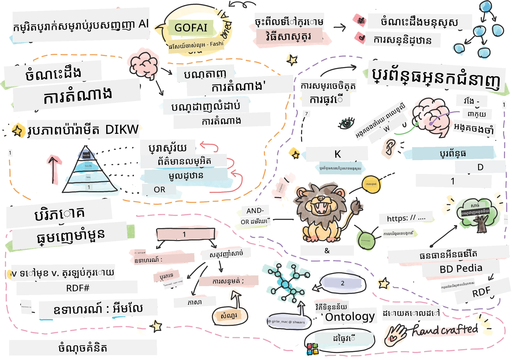
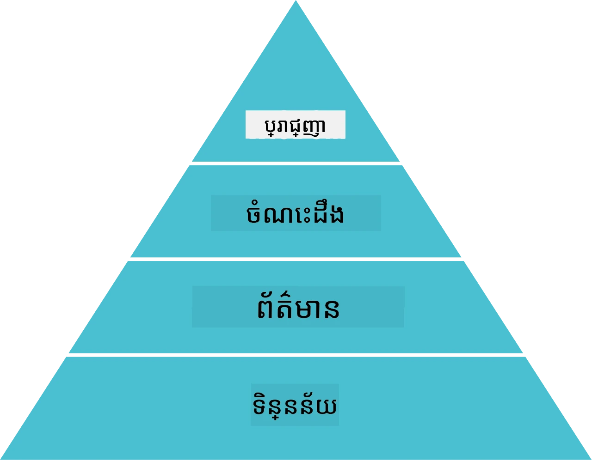
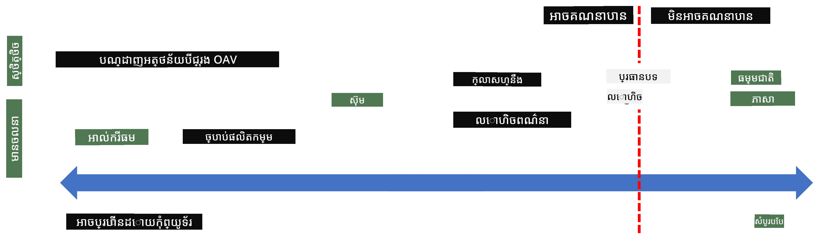
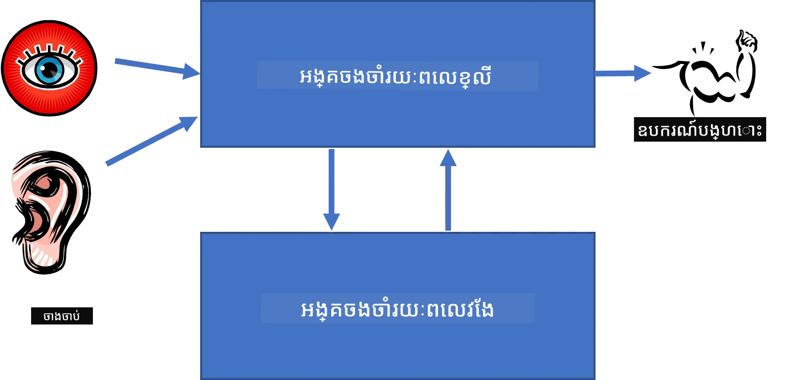
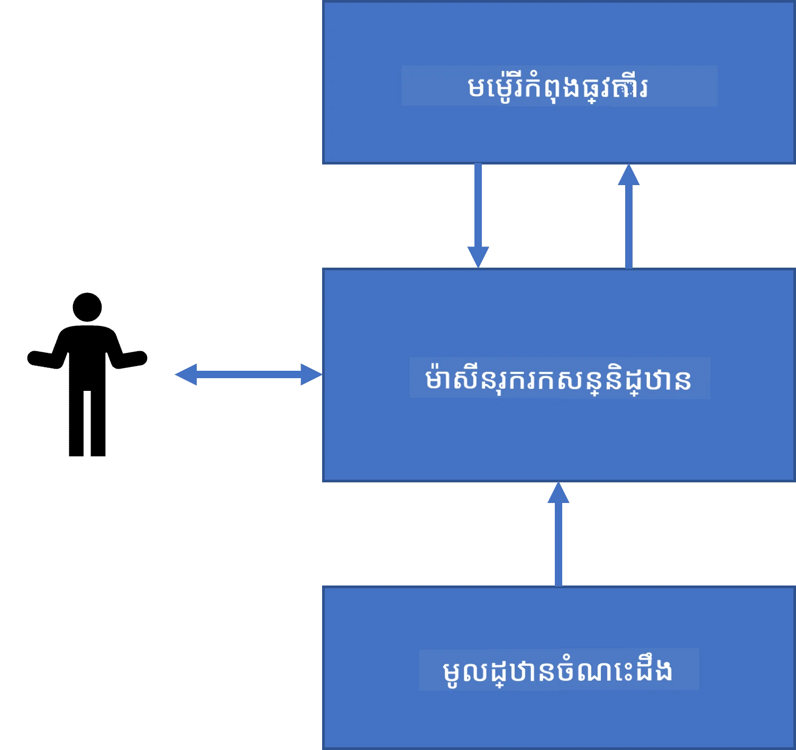
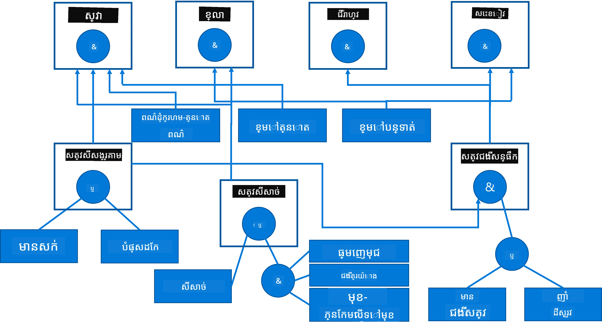
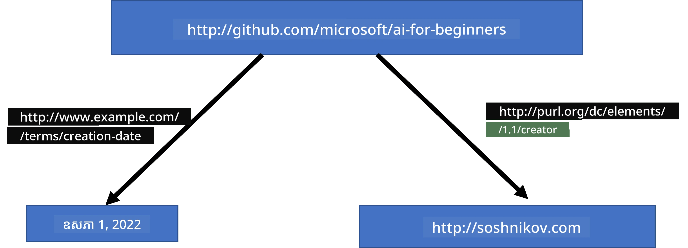
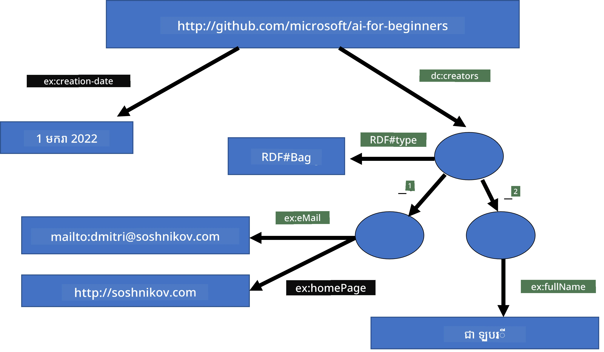
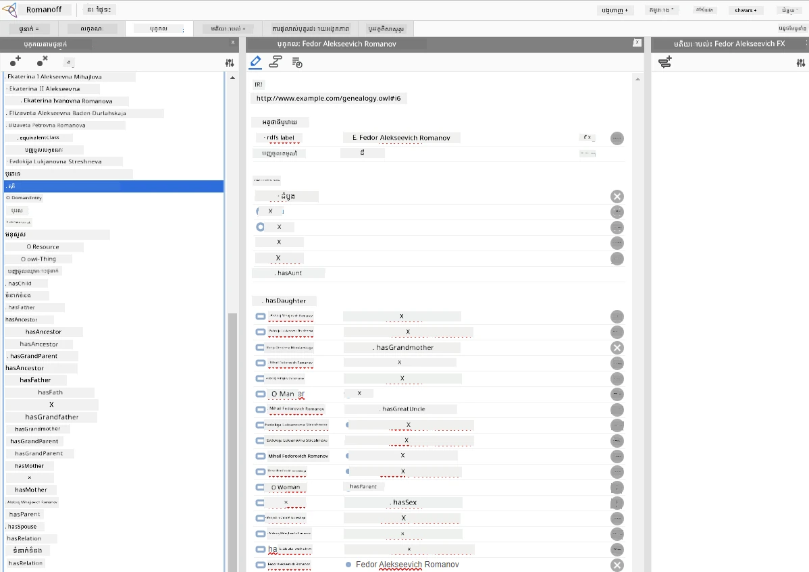

# ការបញ្ជូនតំណាងចំណេះដឹង និងប្រព័ន្ធឯកទេស



> ស្គេតសំគាល់ដោយ [Tomomi Imura](https://twitter.com/girlie_mac)

ការស្វែងរកប្រាជ្ញាសិប្បនិម្មិតមានមូលដ្ឋានលើការស្វែងរកចំណេះដឹង ដើម្បីឲ្យយល់ពីពិភពលោក ដូចរបៀបដែលមនុស្សធ្វើ។ តែតើអ្នកអាចធ្វើដូចម្តេចបាន?

## [ប្រលងមុនមេរៀន](https://ff-quizzes.netlify.app/en/ai/quiz/3)

នៅពេលដំបូងនៃ AI វិធីសាស្រ្តពីលើចុះក្រោមក្នុងការបង្កើតប្រព័ន្ធឆ្លាតវាង (ដែលបានពិភាក្សានៅមេរៀនមុន) បានពេញនិយម។ គំនិតគឺពន្លឿនចំណេះដឹងពីមនុស្សទៅក្នុងទ្រង់ទ្រាយអាចអានបញ្ចូលម៉ាស៊ីនបាន ហើយបន្ទាប់មកប្រើវាដើម្បីដោះស្រាយបញ្ហាអូតូម៉ាទិច។ វិធីនេះមានមូលដ្ឋានលើគំនិតធំពីរយ៉ាង៖

* ការបញ្ជូនតំណាងចំណេះដឹង
* ការអោយហRaz

## ការបញ្ជូនតំណាងចំណេះដឹង

មួយក្នុងចំណោមគំនិតសំខាន់ៗក្នុង Symbolic AI គឺ **ចំណេះដឹង**។ វាសំខាន់ក្នុងការផ្សេងបែកចំណេះដឹងពី *ព័ត៌មាន* ឬ *ទិន្នន័យ*។ ឧទាហរណ៍ អ្នកអាចនិយាយថាសៀវភៅមានចំណេះដឹង ព្រោះអ្នកអាចសិក្សាសៀវភៅហើយក្លាយជាឧទិ្ឋជជាញ។ ទោះយ៉ាងណា អ្វីដែលសៀវភៅមានគឺត្រូវបានគេហៅថា *ទិន្នន័យ* ហើយដោយការអានសៀវភៅនិងបញ្ចូលទិន្នន័យនេះក្នុងគំរូពិភពលោករបស់យើងយើងបំលែងទិន្នន័យនេះទៅជាចំណេះដឹង។

> ✅ **ចំណេះដឹង** គឺជាអ្វីដែលមាននៅក្នុងខួរក្បាលរបស់យើង ហើយបង្ហាញពីការយល់ដឹងរបស់យើងអំពីពិភពលោក។ វាត្រូវបានទទួលបានដោយដំណើរការសិក្សាដោយសកម្ម ដែលបញ្ចូលរបស់ពត៌មានដែលយើងទទួលបានទៅក្នុងគំរូសកម្មនៃពិភពលោករបស់យើង។

ភាគច្រើន យើងមិនតែងតែកំណត់ចំណេះដឹងយ៉ាងតឹងរឹងទេ ប៉ុន្តែយើងត្បិតវាជាមួយគំនិតផ្សេងទៀតដោយប្រើ [DIKW Pyramid](https://en.wikipedia.org/wiki/DIKW_pyramid)។ វាមានគំនិតដូចខាងក្រោម៖

* **ទិន្នន័យ** គឺជាអ្វីដែលត្រូវបានបង្ហាញនៅលើបរិមាណរូបមន្តពហុ និងគ្រើនដូចជា អត្ថបទសរសេរ ឬពាក្យនិយាយ។ ទិន្នន័យមានអត្តសញ្ញាណដោយឯករាជ្យពីមនុស្ស ហើយអាចបញ្ជូនពីមនុស្សម្នាក់ទៅម្នាក់បាន។
* **ព័ត៌មាន** គឺជាវិធីដែលយើងបកស្រាយទិន្នន័យនៅក្នុងខួរក្បាលរបស់យើង។ ឧទាហរណ៍ ពេលយើងស្តាប់ពាក្យ *កុំព្យូទ័រ* យើងមានការយល់ដឹងខ្លះអំពីវា។
* **ចំណេះដឹង** គឺជាព័ត៌មានដែលបានបញ្ចូលទៅក្នុងគំរូពិភពលោករបស់យើង។ ឧទាហរណ៍ បន្ទាប់ពីយើងរៀនថាគុំព្យូទ័រជាអ្វី យើងចាប់ផ្តើមមានគំនិតអំពីរបៀបដែលវាធ្វើការ តម្លៃរបស់វា និងអ្វីដែលវាអាចប្រើបាន។ បណ្ដាញគំនិតទាំងនេះបង្កើតចំណេះដឹងរបស់យើង។
* **ប្រាជ្ញា** គឺជាកម្រិតបន្ថែមមួយទៀតនៃការយល់ដឹងរបស់យើងអំពីពិភពលោក ហើយវាបង្ហាញពី *ចំណេះដឹងលើចំណេះដឹង* ឧ. គំនិតមួយអំពីរបៀប និងពេលដែលចំណេះដឹងគួរត្រូវបានប្រើ។



*រូបភាព [ពីវិគីភីឌា](https://commons.wikimedia.org/w/index.php?curid=37705247), ដោយ Longlivetheux - ឯកម្មារបស់ខ្លួន, CC BY-SA 4.0*

ដូច្នេះ បញ្ហានៃ **ការបញ្ជូនតំណាងចំណេះដឹង** គឺស្វែងរកវិធីមានប្រសិទ្ធិភាពក្នុងការបង្ហាញចំណេះដឹងនៅក្នុងកុំព្យូទ័រជាទ្រង់ទ្រាយទិន្នន័យ ដើម្បីឲ្យវាអាចប្រើបានដោយស្វ័យប្រវត្តិ។ វាអាចត្រូវបានមើលឃើញជាផ្ទៃពណ៌៖



> រូបភាពដោយ [Dmitry Soshnikov](http://soshnikov.com)

* នៅខាងខាងឆ្វេង មានប្រភេទបញ្ជូនតំណាងចំណេះដឹងសាមញ្ញដែលអាចប្រើប្រាស់បានយ៉ាងមានប្រសិទ្ធភាពដោយកុំព្យូទ័រ។ ប្រភេទសាមញ្ញជាងគេគឺអាល់ហ្គោរីធមិក ដែលចំណេះដឹងត្រូវបានបង្ហាញដោយកម្មវិធីកុំព្យូទ័រ។ ទោះយ៉ាងណា វាមិនមែនជាវិធីល្អបំផុតសម្រាប់បង្ហាញចំណេះដឹងទេ ព្រោះវាមិនបត់បែន។ ចំណេះដឹងនៅក្នុងខួរក្បាលយើងជាច្រើនជាបណ្តាលអាល់ហ្គោរីធមិកមិនឈរជាក់។
* នៅខាងស្ដាំ មានការបង្ហាញដូចជអត្ថបទធម្មជាតិ។ វាអំណាចបំផុត ប៉ុន្តែមិនអាចប្រើសម្រាប់ការរាំរានស្វ័យប្រវត្តិបានទេ។

> ✅ សូមគិតមួយនាទីអំពីរបៀបដែលអ្នកបង្ហាញចំណេះដឹងនៅក្នុងខួរក្បាលរបស់អ្នក ហើយបំលែងវាទៅជាកំណត់ត្រា។ តើមានទ្រង់ទ្រាយពិសេសណារឺទេដែលមានប្រសិទ្ធភាពសម្រាប់អ្នកក្នុងការជួយរក្សាទុក?

## ការប្រើប្រាស់ចំណេះដឹងតំណាងកុំព្យូទ័រ

យើងអាចចាត់ថ្នាក់វិធីសាស្រ្តលំដាប់ចំណេះដឹងនៅក្នុងកុំព្យូទ័រជាក្រុមខាងក្រោម៖

* **ការបង្ហាញបណ្តាញ** មានមូលដ្ឋានលើការពិតថាយើងមានបណ្តាញគំនិតដែលពាក់ព័ន្ធគ្នានៅក្នុងខួរក្បាល។ យើងអាចព្យាយាមបង្កើតបណ្តាញដូចគ្នាជាក្រាបក្នុងកុំព្យូទ័រ - ឈ្មោះថា **បណ្តាញសមនិយម**។

1. **Object-Attribute-Value triplets** ឬ **attribute-value pairs**។ ព្រោះក្រាបអាចត្រូវបានបង្ហាញនៅក្នុងកុំព្យូទ័រជារាយនាមនៃចំណុចនិងរន្ធ យើងអាចបញ្ចេញបណ្តាញសមនិយមដោយបញ្ជី triplets ដែលមានវត្ថុ សម្បត្តិ និងតម្លៃ។ ឧទាហរណ៍ យើងបង្កើត triplets ខាងក្រោមអំពីភាសាស្វាគមន៍៖

Object | Attribute | Value
-------|-----------|------
Python | គឺជា | Untyped-Language
Python | បង្កើតដោយ | Guido van Rossum
Python | ផ្នែករាងកូដ | indentation
Untyped-Language | មិនមាន | ការបញ្ជាក់ប្រភេទ

> ✅ សូមគិតពីរបៀបដែល triplets អាចប្រើសម្រាប់បង្ហាញចំណេះដឹងប្រភេទផ្សេងៗបាន។

2. **ការបង្ហាញជាដំបូល** ផ្តោតលើការពិតដែលយើងជាញឹកញាប់បង្កើតដំបូលនៃវត្ថុនៅក្នុងខួរក្បាល។ ឧទាហរណ៍ យើងដឹងថាគានារីគឺជា បក្សី ហើយបក្សីទាំងអស់មានប្រចាញ់ និងយើងក៏មានគំនិតខ្លះអំពីពណ៌ដែលគានារីភាគច្រើនមាន និងល្បឿនហោះរបស់វា។

   - **ការ​បង្ហាញ​បែបផែន (Frame representation)** មានមូលដ្ឋានលើការបង្ហាញរាល់វត្ថុឬថ្នាក់វត្ថុជា **បែបផែន** ដែលមាន **ផ្នែក[slots]**។ ផ្នែកនីមួយៗមានតម្លៃលំនាំដើម ជម្រើសតម្លៃ កំណត់តម្លៃ ឬនីតិវិធីដែលអាចហៅបានដើម្បីទទួលបានតម្លៃផ្នែកនោះ។ បែបផែនទាំងអស់បង្កើតដំបូលដូចដំបូលវត្ថុជាភាសាស្វាគមន៍ដែលផ្អែកលើវត្ថុ។
   - **សេចក្ដីស្ថានភាព** គឺជាបែបផែនពិសេសមួយដែលបង្ហាញពីស្ថានភាពស្មុគស្មាញដែលអាចប៉ុនប៉ងឡើងវិញនៅពេលវេលា។

**Python**

Slot | Value | Default value | Interval |
-----|-------|---------------|----------|
Name | Python | | |
Is-A | Untyped-Language | | |
Variable Case | | CamelCase | |
Program Length | | | 5-5000 បន្ទាត់ |
Block Syntax | Indent | | |

3. **ការបង្ហាញនីតិវិធី** មានមូលដ្ឋានលើការបង្ហាញចំណេះដឹងជាបញ្ជីសកម្មភាពដែលអាចដំណើរការប្រារព្ធនៅពេលមានលក្ខខណ្ឌណាមួយកើតឡើង។
   - ច្បាប់ផលិតកម្មគឺជាសេចក្ដីថ្លែងការណ៍បើ-ដូច្នេះ ដែលអនុញ្ញាតិឲ្យយើងធ្វើការសន្និដ្ឋាន។ ឧទាហរណ៍ វេជ្ជបណ្ឌិតអាចមានច្បាប់ថា **បើ** អ្នកជំងឺមានកម្តៅខ្ពស់ **ឬ** កម្រិត C-reactive protein ខ្ពស់ក្នុងការធ្វើតេស្តឈាម **ដូច្នេះ** លោកអ្នកមានការរលាក។ ពេលដែលយើងជួបលក្ខខណ្ឌមួយយើងអាចទាញយកសន្និដ្ឋានអំពីការរលាក ហើយបន្ទាប់មកប្រើវានៅក្នុងការយល់ដឹងបន្ថែម។
   - អាល់ហ្គរីធម​ក៏អាចត្រូវបានគេចាត់ទុកជាទ្រង់ទ្រាយនីតិវិធីមួយទៀត ក៏ប៉ុន្តែវាកាត់បន្តិចមិនត្រូវបានប្រើជាប្រភេទផ្ទាល់ក្នុងប្រព័ន្ធផ្អែកលើចំណេះដឹង។

4. **លូហ្សិក** ត្រូវបានបញ្ចប់ដោយ Aristotle ក្នុងដំណើរបង្ហាញចំណេះដឹងមនុស្សទូទៅ។
   - លូហ្សិកបំពេញកិច្ចការជាទ្រឹស្តីគណិតវិទ្យាមានភាពសម្បូរបែបលើសមើលប្រាកដចំពោះកុំព្យូទ័រ ដូច្នេះសំណុំតិចតួចមួយត្រូវបានប្រើជាទូទៅដូចជា Horn clauses ដែលប្រើនៅក្នុង Prolog។
   - លូហ្សិកពិពណ៌នាគឺជាគ្រួសារប្រព័ន្ធលូហ្សិកដែលប្រើក្នុងការបង្ហាញនិងរៀបចំស្របគ្នារវាងដំបូលវត្ថុ និងការបញ្ជូនចំណេះដឹងដូចជា *បណ្តាញសមនិយម*។

## ប្រព័ន្ធឯកទេស

មួយក្នុងចំណោមជោគជ័យដំបូងនៃ AI សញ្ញាសិទ្ធិគឺប្រព័ន្ធឯកទេសដែលហៅថា **expert systems** - ប្រព័ន្ធកុំព្យូទ័រ ដែលបានរចនាឡើងដើម្បីដំណើរការជាអ្នកជំនាញនៅក្នុងដែនកំណត់បញ្ហាមួយ។ វាត្រូវបានខ្ចាប់យកផ្អែកលើ **មូលដ្ឋានចំណេះដឹង** ពីអ្នកជំនាញម្នាក់ឬច្រើន ហើយមាន **ម៉ាស៊ីនសន្និដ្ឋាន** ដែលអនុវត្តការយល់ដឹងលើវា។

 | 
---------------------------------------------|------------------------------------------------
រចនាសម្ព័ន្ធសាមញ្ញនៃប្រព័ន្ធសរសៃប្រសាទមនុស្ស | រចនាសម្ព័ន្ធប្រព័ន្ធផ្អែកលើចំណេះដឹង

ប្រព័ន្ធឯកទេសត្រូវបានកសាងដូចប្រព័ន្ធយល់ដឹងមនុស្ស ដែលមាន **ចងចាំខ្លីរយៈ** និង **ចងចាំបណ្តោះអាសន្ន**។ ដូចគ្នាពីរក្នុងប្រព័ន្ធផ្អែកលើចំណេះដឹង យើងចាត់ចែងថា៖

* **ចងចាំបញ្ហា**៖ រួមបញ្ចូលចំណេះដឹងអំពីបញ្ហាដែលកំពុងបានដោះស្រាយ ម៉ាតាបូកកម្តៅ ឬសម្ពាធឈាមរបស់អ្នកជំងឺ ថាតើមានការរលាក ឬមិនមាន។ ចំណេះដឹងនេះហៅថា **ចំណេះដឹងស្ថិតស្ថេរ** ព្រោះវាមានរូបភាពស្ថានភាពបញ្ហាបច្ចុប្បន្នហៅថា *problem state*។
* **មូលដ្ឋានចំណេះដឹង**៖ តំណាងឲ្យចំណេះដឹងរយៈពេលវែងអំពីដែនកំណត់បញ្ហា។ វាត្រូវបានដកចេញដោយដៃពីអ្នកជំនាញមនុស្ស ហើយមិនប្រែប្រួលក្នុងការពិគ្រោះយោបល់នីមួយៗទេ។ ព្រោះវាអនុញ្ញាតិឲ្យយើងរុករកពីស្ថានភាពបញ្ហាមួយទៅមួយទៀត វាត្រូវបានហៅថា **ចំណេះដឹងរស្មី**។
* **ម៉ាស៊ីនសន្និដ្ឋាន**៖ គ្រប់គ្រងដំណើរការស្វែងរកក្នុងលំហស្ថានភាពបញ្ហា​ សួរព័ត៌មានពីអ្នកប្រើនៅពេលចាំបាច់។ វាក៏ទទួលខុសត្រូវសំរាប់រកច្បាប់ត្រឹមត្រូវដើម្បីអនុវត្តលើគ្រប់ស្ថានភាព។

ឧទាហរណ៍ មកមើលប្រព័ន្ធឯកទេសមួយសម្រាប់កំណត់សត្វដោយផ្អែកលើលក្ខណៈរាងកាយ៖



> រូបភាពដោយ [Dmitry Soshnikov](http://soshnikov.com)

រូបភាពនេះហៅថា **ដើមឈើ AND-OR** ហើយវាជាការតំណាងក្រាហ្វិកនៃសំណុំច្បាប់ផលិតកម្ម។ ការគូរដើមឈើមានប្រយោជន៍នៅដើមក្នុងការទាញយកចំណេះដឹងពីអ្នកជំនាញ។ ដើម្បីបង្ហាញចំណេះដឹងក្នុងកុំព្យូទ័ររូបរាងសម្រួលជាងនេះជាការប្រើច្បាប់៖

```
IF the animal eats meat
OR (animal has sharp teeth
    AND animal has claws
    AND animal has forward-looking eyes
) 
THEN the animal is a carnivore
```
  
អ្នកអាចមើលឃើញថា លក្ខខណ្ឌមួយៗនៅផ្នែកឆ្វេងនៃច្បាប់ និងសកម្មភាព អាចត្រូវបានមើលឃើញជាផ្នែក object-attribute-value (OAV) triplets។ **ចងចាំការងារ** មានចំណុច OAV ដែលសមស្របនឹងបញ្ហាដែលកំពុងត្រូវបានដោះស្រាយ។ **ម៉ាស៊ីនច្បាប់** ស្វែងរកច្បាប់ដែលលក្ខខណ្ឌត្រូវបានបំពេញ ហើយអនុវត្តពួកវា បន្ថែម triplet មួយទៀតទៅក្នុងចងចាំការងារ។

> ✅ សរសេរដើមឈើ AND-OR លើប្រធានបទដែលអ្នកចូលចិត្ត!

### ការសន្និដ្ឋានមុខក្រោយ និងពីក្រោយ

ដំណើរការដែលបានពិពណ៌នាខាងលើហៅថា **សន្និដ្ឋានមុខក្រោយ**។ វាចាប់ផ្តើមជាមួយទិន្នន័យដើមអំពីបញ្ហាដែលមាននៅក្នុងចងចាំការងារ ហើយបន្ទាប់បង្កើតរង្វិលគិតបែបនេះ៖

1. ប្រសិនបើបែបបទគោលដៅមាននៅក្នុងចងចាំការងារ - បញ្ឈប់ ហើយផ្តល់លទ្ធផល  
2. ស្វែងរកច្បាប់ទាំងអស់ដែលលក្ខខណ្ឌបច្ចុប្បន្នត្រូវបានបំពេញ - ទទួលបាន **សំណុំជម្លោះ** នៃច្បាប់  
3. ប្រតិបត្តិ **ដោះស្រាយជម្លោះ** - ជ្រើសច្បាប់មួយច្បាប់ដែលត្រូវអនុវត្តនៅជំហាននេះ។ អាចមានយុទ្ធសាស្រ្តផ្សេងៗក្នុងការដោះស្រាយជម្លោះ៖  
   - ជ្រើសច្បាប់ដំបូងដែលអាចអនុវត្តបានក្នុងមូលដ្ឋានចំណេះដឹង  
   - ជ្រើសច្បាប់ដោយចៃដន្យ  
   - ជ្រើសច្បាប់ដែល *ពិសេសជាង* គឺជាច្បាប់ដែលបំពេញលក្ខខណ្ឌច្រើនជាងគេនៅផ្នែកឆ្វេង (LHS)  
4. អនុវត្តច្បាប់ដែលជ្រើស ហើយបញ្ចូលចំណេះដឹងថ្មីទៅក្នុងស្ថានភាពបញ្ហា  
5. ធ្វើម្តងទៀតចាប់ពីជំហាន 1។  

ទោះជាយ៉ាងណា ក្នុងករណីខ្លះ យើងអាចចាប់ផ្តើមដោយគ្មានចំណេះដឹងអំពីបញ្ហា ហើយសួរចម្លើយដែលជួយឲ្យយើងដល់កំណត់ចុងក្រោយ។ ឧទាហរណ៍ នៅពេលធ្វើវេជ្ជសាស្ត្រ យើងមិនធ្វើតេស្តវេជ្ជសាស្ត្រទាំងអស់ជាមុនមុនចាប់ផ្តើមផ្តល់វេជ្ជៈទេសក្នុងអ្នកជំងឺទេ។ យើងល្អប្រសើរចាប់ផ្តើមធ្វើតេស្តនៅពេលចាំបាច់។

ដំណើរការនេះអាចត្រូវបានគំរូដោយប្រើ **សន្និដ្ឋានពីក្រោយ**។ វាត្រូវបានគ្រប់គ្រងដោយ **គោលដៅ** - តម្លៃសម្បត្តិដែលយើងស្វែងរក៖

1. ជ្រើសច្បាប់ទាំងអស់ដែលអាចផ្តល់តម្លៃមួយនៃគោលដៅ (ឧ. ជាមួយគោលដៅនៅលើ RHS ("ផ្នែកស្តាំ")) - សំណុំជម្លោះ  
2. ប្រសិនបើមិនមានច្បាប់សម្រាប់សម្បត្តិនេះ ឬមានច្បាប់មួយដែលបញ្ជាឲ្យសួរតម្លៃពីអ្នកប្រើ - សូមថ្លែងបែបនេះ ប្រសិនជាអត់ពីនេះ៖  
3. ប្រើយុទ្ធសាស្រ្តដោះស្រាយជម្លោះជ្រើសច្បាប់មួយដែលយើងនឹងប្រើជា *សន្និដ្ឋាន* - យើងនឹងព្យាយាមបញ្ជាក់វា  
4. ធ្វើម្ដងទៀតបែបជាបន្តបន្ទាប់ចំពោះអាគុយម៉ង់ទាំងអស់នៅក្នុង LHS របស់ច្បាប់ ដើម្បីព្យាយាមបញ្ជាក់ពួកគេជាគោលដៅ  
5. ប្រសិនបើនៅដំណាក់កាលណាមួយខ្ទេចខ្ទី - ប្រើច្បាប់ផ្សេងនៅជំហាន 3។

> ✅ តើក្នុងស្ថានការណ៍ណាដែលសន្និដ្ឋានមុខក្រោយសាកសមជាង? និយាយពីសន្និដ្ឋានពីក្រោយដូចម្តេច?

### ការអនុវត្តប្រព័ន្ធឯកទេស

ប្រព័ន្ធឯកទេសអាចត្រូវអនុវត្តដោយប្រើឧបករណ៍ផ្សេងៗ៖

* កម្មវិធីសរសេរផ្ទាល់ជាភាសាកម្មវិធីកម្រិតខ្ពស់មួយ។ នេះមិនមែនជាគំនិតល្អបំផុតទេ ពីព្រោះអត្ថប្រយោជន៍សំខាន់នៃប្រព័ន្ធផ្អែកលើចំណេះដឹងគឺចំណេះដឹងត្រូវបានបំបែកពីសន្និដ្ឋាន ហើយពួកអ្នកជំនាញដែនកំណត់អាចសរសេរច្បាប់ឲ្យបានដោយគ្មានការយល់ដឹងជ្រាបជាក់ទាក់ទងនឹងដំណើរការសន្និដ្ឋាន។
* ប្រើ **ក្រដាសប្រព័ន្ធឯកទេស** ដែលគឺជាប្រព័ន្ធដែលរចនាឡើងជាពិសេសសម្រាប់បញ្ចូលចំណេះដឹងដោយប្រើភាសា​តំណាង​ចំណេះដឹង។

## ✍️ លំហាត់៖ សន្និដ្ឋានសត្វ

សូមមើល [Animals.ipynb](https://github.com/microsoft/AI-For-Beginners/blob/main/lessons/2-Symbolic/Animals.ipynb) សម្រាប់ឧទាហរណ៍នៃការអនុវត្តសន្និដ្ឋានមុខក្រោយ និងពីក្រោយក្នុងប្រព័ន្ធឯកទេស។

> **កំណត់សំគាល់**៖ ឧទាហរណ៍នេះសាមញ្ញ បង្ហាញគំនិតនៃរបៀបដែលប្រព័ន្ធឯកទេសស្របៗគ្នាដូចម្តេច។ បន្ទាប់ពីអ្នកចាប់ផ្តើមបង្កើតប្រព័ន្ធដូចនេះ អ្នកនឹងសម្គាល់ភាព *ឆ្លាត* ជាច្រើន ពីវា នៅពេលច្បាប់ច្រើនជាង ២០០+។ នៅពេលនេះ ច្បាប់ចោទដំណើរការលំបាកក្នុងការចងចាំ ហើយអ្នកអាចចាប់ផ្តើមចាប់អារម្មណ៍ថាហេតុអ្វីប្រព័ន្ធបង្កើតការសម្រេចចិត្តមួយៗ។ ទោះយ៉ាងណា លក្ខណៈសំខាន់នៃប្រព័ន្ធផ្អែកលើចំណេះដឹងគឺអ្នកអាច *ពន្យល់* ដោយដូចម្តេចដែលបណ្ដាលឲ្យកើតមានសម្រេចចិត្តណាមួយ។

## អ៊ុងតូឡូស៊ី និង បណ្តាញសមនិយម (Semantic Web)

នៅចុងសតវត្សទី២០ មានការចាប់ផ្តើមឱ្យប្រើការបញ្ជូនតំណាងចំណេះដឹងដើម្បីអញ្ញាតធនធានអ៊ិនធឺណិត ដើម្បីអាចស្វែងរកធនធានដែលសមស្របនឹងសំណួរពិសេស។ ចលនានេះហៅថា **បណ្តាញសមនិយម (Semantic Web)** ហើយវាអាស្រ័យលើគំនិតជាច្រើន៖

- ការបញ្ជូនតំណាងចំណេះដឹងពិសេសមួយផ្អែកលើ **[លូហ្សិកពិពណ៌នា](https://en.wikipedia.org/wiki/Description_logic)** (DL)។ វាដូចជាការបង្ហាញបែបបែបផែន ព្រោះវាបង្កើតដំបូលអត់ធ្មត៍នៃវត្ថុជាមួយលក្ខណៈពិសេស ប៉ុន្តែវាមានសេម៉ង់ទីកវិទ្យាផ្លូវការនិងសន្និដ្ឋាន។ មានគ្រួសារពេញលេញនៃ DL ដែលតម្រងការវិវឌ្ឍន៍រវាងភាពសម្បូរបែប និងស្មុគស្មាញអាល់ហ្គរីធម៍នៃការសន្និដ្ឋាន។
- ការបញ្ជូនតំណាងចំណេះដឹងចែកចាយ ដែលគំនិតទាំងអស់ត្រូវបានតំណាងដោយលេខសម្គាល់ URI ពិភពលោកធ្វើឲ្យអាចបង្កើតដំបូលចំណេះដឹងដែលរំលាយនៅលើអ៊ិនធឺណិត។
- គ្រួសារភាសាដូចជា XML សម្រាប់ការពិពណ៌នាចំណេះដឹង៖ RDF (Resource Description Framework), RDFS (RDF Schema), OWL (Ontology Web Language)។
មាជារបស់ Semantic Web គឺជា ឧបាយកា្រណ៍នៃ **Ontology**។ វាបញ្ជាក់អំពីការបញ្ជាក់ជាក់លាក់នៃដែនបញ្ហាមួយដោយប្រើការដំណិញ្ញាតដឹកនាំចំណេះដឹងមួយ។ Ontology សាមញ្ញបំផុតអាចជាសំណុំតំណក់នៃវត្ថុក្នុងដែនបញ្ហា ប៉ុន្តែ ontology ស្មុគស្មាញជាងនេះនឹងរួមបញ្ចូលនូវច្បាប់ដែលអាចប្រើសម្រាប់ប្រមូលហេតុ។

នៅក្នុង semantic web ការចំណាំទាំងអស់គឺផ្អែកលើ triplets។ វត្ថុ និង ទំនាក់ទំនងនីមួយៗត្រូវបានកំណត់ដោយ URI ឯកត្ត។ ឧទាហរណ៍ ប្រសិនបើយើងចង់សំដែងពីការពិតថា AI Curriculum នេះត្រូវបានបង្កើតឡើងដោយ Dmitry Soshnikov នៅថ្ងៃទី 1 ខែមករា ឆ្នាំ 2022 – នេះគឺជាកំណត់ត្រា triplets ដែលយើងអាចប្រើបាន៖



```
http://github.com/microsoft/ai-for-beginners http://www.example.com/terms/creation-date “Jan 1, 2022”
http://github.com/microsoft/ai-for-beginners http://purl.org/dc/elements/1.1/creator http://soshnikov.com
```

> ✅ នៅទីនេះ `http://www.example.com/terms/creation-date` និង `http://purl.org/dc/elements/1.1/creator` គឺជាអាសយដ្ឋាន URI ដែលល្បីនិងទទួលបានការទទួលស្គាល់យ៉ាងទូលំទូលាយ សម្រាប់បង្ហាញមនោសញ្ចេតនារបស់ *creator* និង *creation date*។

នៅក្នុងករណីស្មុគស្មាញជាងនេះ ប្រសិនបើយើងចង់កំណត់បញ្ជីអ្នកបង្កើត អាចប្រើរចនាសម្ព័ន្ធទិន្នន័យមួយចំនួនដែលបានកំណត់ក្នុង RDF។



> សៀវភៅគំនូរខាងលើ កំណត់ដោយ [Dmitry Soshnikov](http://soshnikov.com)

ការរីកចម្រើននៃការសាងសង់ Semantic Web ត្រូវបានយឺតជាងមុនដោយសារជោគជ័យនៃម៉ាស៊ីនស្វែងរក និង វិធីសាស្រ្តដំណើរការភាសាធម្មជាតិ ដែលអនុញ្ញាតឲ្យដកយកទិន្នន័យដែលមានរចនាសម្ព័ន្ធពីអត្ថបទជាដំណើរ។ ទោះយ៉ាងណា នៅក្នុងតំបន់ជាក់លាក់មួយចំនួន មានការខំប្រឹងយ៉ាងខ្លាំងនៅតែមានដើម្បីថែរក្សា ontology និងមូលដ្ឋានចំណេះដឹង។ មានគម្រោងខ្លះគួរឲ្យចាប់អារម្មណ៍៖

* [WikiData](https://wikidata.org/) ជាសំណុំមូលដ្ឋានចំណេះដឹងអាចអានដោយម៉ាស៊ីនដែលភ្ជាប់ជាមួយ Wikipedia។ ព័ត៌មានភាគច្រើនត្រូវបានដកចេញពី Wikipedia *InfoBoxes* ដែលជាគ្រឿងចម្បងកំណត់រចនាសម្ព័ន្ធនៅក្នុងទំព័រ Wikipedia។ អ្នកអាច [query](https://query.wikidata.org/) wikidata ដោយប្រើ SPARQL ដែលជាភាសាស្វែងរកពិសេសមួយសម្រាប់ Semantic Web។ នេះគឺជាគំរូស្វែងរកដែលបង្ហាញពីពណ៌ភ្នែកពេញនិយមបំផុតនៅក្នុងមនុស្ស៖

```sparql
#defaultView:BubbleChart
SELECT ?eyeColorLabel (COUNT(?human) AS ?count)
WHERE
{
  ?human wdt:P31 wd:Q5.       # human instance-of homo sapiens
  ?human wdt:P1340 ?eyeColor. # human eye-color ?eyeColor
  SERVICE wikibase:label { bd:serviceParam wikibase:language "en". }
}
GROUP BY ?eyeColorLabel
```

* [DBpedia](https://www.dbpedia.org/) គឺជាការខិតខំផ្សេងទៀតដែលស្រដៀងនឹង WikiData។

> ✅ ប្រសិនបើអ្នកចង់សាកល្បងបង្កើត ontology របស់ខ្លួនឯង ឬបើក ontology ដែលមានស្រាប់ មានកម្មវិធីចងក្រង ontology មួយដែលអស្ចារ្យហៅថា [Protégé](https://protege.stanford.edu/)។ ទាញយកវា ឬប្រើវាតាមអនឡាញបាន។



*កម្មវិធីចងក្រង Web Protégé បើកជាមួយ ontology របស់ក្រុមគ្រួសារ Romanov។ រូបថតដោយ Dmitry Soshnikov*

## ✍️ លំហាត់៖ Ontology គ្រួសារ


មើល [FamilyOntology.ipynb](https://github.com/Ezana135/AI-For-Beginners/blob/main/lessons/2-Symbolic/FamilyOntology.ipynb) សម្រាប់ឧទាហរណ៍នៃការប្រើប្រាស់បច្ចេកវិទ្យា Semantic Web ដើម្បីសន្មតលទ្ធផលអំពីទំនាក់ទំនងក្នុងគ្រួសារ។ យើងនឹងយកដើមឈើគ្រួសារដែលផ្តល់ដោយទ្រង់ទ្រាយ GEDCOM សម្បូរបែប និង ontology នៃទំនាក់ទំនងក្រុមគ្រួសារ ហើយបង្កើតក្រាបនៃទំនាក់ទំនងគ្រួសារទាំងអស់សម្រាប់ជនរើសជាមនុស្សខ្លះ។

## Microsoft Concept Graph

នៅភាគច្រើនករណី ontology ត្រូវបានបង្កើតយ៉ាងប្រុងប្រយ័ត្នដោយដៃ។ ទោះយ៉ាងណា វាក៏អាចធ្វើបានដែរ ដើម្បី **ស្រាវជ្រាវយក** ontology ពីទិន្នន័យដែលមិនមានរចនាសម្ព័ន្ធ ដូចជាពីអត្ថបទភាសាធម្មជាតិ។

ការសាកល្បងដូចនេះត្រូវបានអនុវត្តដោយ Microsoft Research ហើយបង្កើតជាលទ្ធផលជា [Microsoft Concept Graph](https://blogs.microsoft.com/ai/microsoft-researchers-release-graph-that-helps-machines-conceptualize/?WT.mc_id=academic-77998-cacaste)។

វាជាការប្រមូលវត្ថុយ៉ាងធំដែលបានក្រុមជាគ្នាតាមរយៈទំនាក់ទំនង `is-a` inheritance។ វាអនុញ្ញាតឲ្យឆ្លើយសំណួរដូចជា "Microsoft ជាអ្វី?" – ពីលទ្ធផលរើសបាន "ក្រុមហ៊ុនមានស(Collections probability 0.87, និងម៉ាកទំនិញមានស(Collections probability 0.75)"។

Graph នេះអាចប្រើទាំងជា REST API ឬជាឯកសារសរសេរមួយធំបញ្ជីគូវត្ថុទាំងអស់។

## ✍️ លំហាត់៖ Concept Graph

សាកល្បង [MSConceptGraph.ipynb](https://github.com/microsoft/AI-For-Beginners/blob/main/lessons/2-Symbolic/MSConceptGraph.ipynb) ដើម្បីមើលរបៀបដែលយើងអាចប្រើ Microsoft Concept Graph ដាក់ពាណិជ្ជកម្មព័ត៌មានព័ត៌មានជាចំណាត់ថ្នាក់ជាច្រើន។

## សេចក្តីសន្និដ្ឋាន

សព្វថ្ងៃ AI ត្រូវបានគេចាត់ទុកជាស្មើរនឹង *Machine Learning* ឬ *Neural Networks*។ ប៉ុន្តែមនុស្សម្នាក់ក៏បង្ហាញពីការសន្មតច្បាស់លាស់ ដែលគឺជារឿងមួយដែលបច្ចុប្បន្នវ៉េលាពេលនេះ neural networks មិនអាចដោះស្រាយបាន។ នៅក្នុងគម្រោងពិភពលោកពិត ការសន្មតច្បាស់លាស់ត្រូវបានប្រើនៅសម្រាប់អនុវត្តភារកិច្ចដែលត្រូវការពន្យល់ ឬអាចកែប្រែឥរិយាបថរបស់ប្រព័ន្ធក្នុងវិធីគ្រប់គ្រងបាន។

## 🚀 ការប្រលែង

នៅក្នុងកំណត់ត្រា Family Ontology តភ្ជាប់ជាមួយមេរៀននេះ មានឱកាសសាកល្បងជាមួយទំនាក់ទំនងគ្រួសារផ្សេងៗទៀត។ ព្យាយាមស្វែងរកការតភ្ជាប់ថ្មីរវាងមនុស្សនៅក្នុងដើមឈើគ្រួសារ។

## [Resident-lecture quiz](https://ff-quizzes.netlify.app/en/ai/quiz/4)

## ការត្រួតពិនិត្យ និងអនុវត្តដោយខ្លួនឯង

ស្រាវជ្រាវតាមអ៊ីនធឺណិត ដើម្បីរកមើលដែនកំណត់ដែលមនុស្សបានព្យាយាមវាស់វែងនិងកំណត់ចំណេះដឹង។ មើលទៅ Bloom’s Taxonomy និងត្រឡប់ក្រោយទៅក្នុងប្រវត្តិសាស្ត្រដើម្បីរៀនពីរបៀបមនុស្សព្យាយាមយល់អំពីពិភពលោករបស់ពួកគេ។ ស្រាវជ្រាវកិច្ចការរបស់ Linnaeus ក្នុងការបង្កើត taxonomie សត្វស្មៅ និងព្យួរការបង្កើតរបៀបដែល Dmitri Mendeleev បានបង្កើតវិធីសាស្រ្តសម្រាប់ធាតុគីមីអាចពិពណ៌នានិងចាក់ជាក្រុម។ តើអ្នកអាចរកឃើញឧទាហរណ៍ចំណុចគួរឱកាសផ្សេងទៀតទេ?

**ការបង្រៀន**: [បង្កើត Ontology](assignment.md)

---

<!-- CO-OP TRANSLATOR DISCLAIMER START -->
**ការបដិសេធ**:  
ឯកសារនេះត្រូវបានបកប្រែដោយប្រើសេវាកម្មបកប្រែ AI [Co-op Translator](https://github.com/Azure/co-op-translator)។ ក្នុងពេលដែលយើងខំប្រឹងប្រែងដើម្បីភាពត្រឹមត្រូវ សូមយល់ព្រមថាការបកប្រែដោយស្វ័យប្រវត្តិអាចមានកំហុស ឬភាពមិនត្រឹមត្រូវ។ ឯកសារដើមនៅក្នុងភាសាគេហដ្ឋានរបស់វាត្រូវបានអនុគ្រោះថាជាមូលដ្ឋានដ៏សម្បទា។ សម្រាប់ព័ត៌មានដែលមានសារៈសំខាន់ សូមផ្ដល់អាទិភាពការបកប្រែដោយអ្នកជំនាញមនុស្សវិជ្ជាជីវៈ។ យើងមិនទទួលខុសត្រូវចំពោះការយល់ច្រឡំ ឬការបកស្រាយខុសពីការប្រើប្រាស់បកប្រែនេះទេ។
<!-- CO-OP TRANSLATOR DISCLAIMER END -->