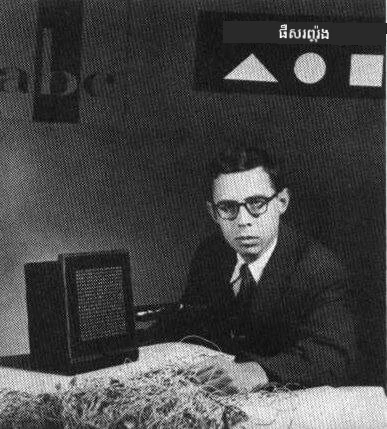
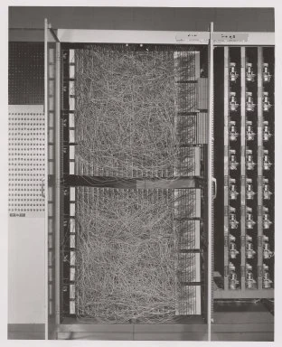
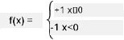

# ការណែនាំអំពីបណ្តាញប្រសាទ: Perceptron

## [មេរៀនមុនការសំរេចចិត្ត](https://ff-quizzes.netlify.app/en/ai/quiz/5)

មួយក្នុងចំណោមព្យាយាមដំបូងៗក្នុងការអនុវត្តអ្វីដែលស្រដៀងនឹងបណ្តាញប្រសាទសម័យទំនើប ត្រូវបានធ្វើឡើងដោយ Frank Rosenblatt ពីមន្ទីរសហគ្រាស Cornell Aeronautical Laboratory នៅឆ្នាំ ១៩៥៧។ វាជាការអនុវត្តនៅលើឧបករណ៍ហា៊ដវែរដែលគេហៅថា "Mark-1", ដែលរចនាឡើងដើម្បីស្គាល់រូបរាង Geometry ដំបូងៗ ដូចជាត្រីកោណ, មូលបត់ និងចតុកោណ។

|      |      |
|--------------|-----------|
| | |

> រូបភាព [ចេញពី Wikipedia](https://en.wikipedia.org/wiki/Perceptron)

រូបភាពដែលបញ្ចូលត្រូវបានតំណាងដោយចំណុចរូបភាព ២០x២០ ដូច្នេះបណ្តាញប្រសាទមានចំណុចបញ្ចូលចំនួន ៤០០ និងចេញលទ្ធផលធ្ងន់តែ១។ បណ្តាញសាមញ្ញមានកោណម៉ាណ័រមួយដែលហៅថា **threshold logic unit**។ ទម្ងន់បណ្តាញប្រសាទដូចជាតិចនីយបរមាអ្នកប្រើដែលត្រូវការការកែសម្រួលដោយដៃក្នុងដំណាក់កាលបណ្តុះបណ្តាល។

> ✅ តិចនីយបូម៉ែតឺ (potentiometer) គឺជាឧបករណ៍ដែលអនុញ្ញាតឲ្យអ្នកប្រើកែប្រែការជ្រាបរបស់សៀគ្វីមួយ។

> The New York Times បានសរសេរអំពី perceptron នៅពេលនោះថា: *ជាកូនពូជនៃកុំព្យូទ័រអេឡិចត្រូនិចមួយដែល [ទ័ពជើងទឹក] យល់ថា វាអាចដើរ និយាយ មើល សរសេរ ផលិតខ្លួនឯង និងមានភាពទំនុកចិត្តអំពីការបង្កើតរបស់វា។*

## ម៉ូដែល Perceptron

កំណត់ថាយើងមានលក្ខណៈ N ក្នុងម៉ូដែលរបស់យើង ដែលនៅក្នុងករណីនេះ វ៉ិចទ័របញ្ចូលគឺជាវ៉ិចទ័រមានទំហំ N។ Perceptron គឺជាម៉ូដែល **ចាត់ថ្នាក់ពីរភាគ** មានន័យថាវាអាចបំបែកចន្លោះពីរប្រភេទទិន្នន័យដែលបញ្ចូលបាន។ យើងនឹងប៉ាន់ស្មានថាសម្រាប់វ៉ិចទ័របញ្ចូល x ហើយលទ្ធផលជាបុព្វបទនៃ perceptron យើងគឺ +1 ឬ -1, អាស្រ័យទៅលើថ្នាក់។ លទ្ធផលនឹងត្រូវគណនាដោយគាំទ្រតាមរូបមន្ត៖

y(x) = f(w<sup>T</sup>x)

ដែល f គឺជាឧបករណ៍សកម្មភាពជំហាន

<!-- img src="http://www.sciweavers.org/tex2img.php?eq=f%28x%29%20%3D%20%5Cbegin%7Bcases%7D%0A%20%20%20%20%20%20%20%20%20%2B1%20%26%20x%20%5Cgeq%200%20%5C%5C%0A%20%20%20%20%20%20%20%20%20-1%20%26%20x%20%3C%200%0A%20%20%20%20%20%20%20%5Cend%7Bcases%7D%20%5C%5C%0A&bc=White&fc=Black&im=jpg&fs=12&ff=arev&edit=0" align="center" border="0" alt="f(x) = \begin{cases} +1 & x \geq 0 \\ -1 & x < 0 \end{cases} \\" width="154" height="50" / -->


## បណ្ដុះបណ្ដាល Perceptron

ដើម្បីបណ្ដុះបណ្ដាល perceptron យើងត្រូវរកវ៉ិចទ័រ w ដែលចាត់ថ្នាក់តង់គិតភាគច្រើនត្រឹមត្រូវ គឺមានន័យថាបញ្ជូនលទ្ធផល **កំហុស** តិចបំផុត។ កំហុស E ត្រូវបានកំណត់ដោយស្តង់ដារ **perceptron criterion** ដូចខាងក្រោម៖

E(w) = -&sum;w<sup>T</sup>x<sub>i</sub>t<sub>i</sub>

ដែល៖

* ផ្សំសរុបគឺយកតែករណីទិន្នន័យបណ្ដុះបណ្ដាល i ដែលបំបែកថ្នាក់ខុស
* x<sub>i</sub> គឺទិន្នន័យបញ្ចូល ហើយ t<sub>i</sub> គឺ -1 ឬ +1 សម្រាប់ឧទាហរណ៍ដ៏អវិជ្ជមាន និងវិជ្ជមានតាមលំដាប់។

ស្តង់ដារនេះត្រូវបានគេពិចារណាថាជាអនុគមន៍នៃវ៉ិចទ័រ w ហើយយើងត្រូវបង្រួមវា។ ជាញឹកញាប់មានវិធីហៅថា **gradient descent** ដែលគេចាប់ផ្តើមជាមួយវ៉ិចទ័រចាប់ផ្តើម w<sup>(0)</sup> ហើយនៅក្នុងជំហាននីមួយៗធ្វើបច្ចុប្បន្នភាពវ៉ិចទ័រតាមរូបមន្ត៖

w<sup>(t+1)</sup> = w<sup>(t)</sup> - &eta;&nabla;E(w)

នៅទីនេះ &eta; គឺជាអត្រាសិក្សាដែលហៅថា **learning rate**, &nabla;E(w) ជា **កំណែនៃ** E។ បន្ទាប់ពីគណនាកំណែនហើយ គេបាន

w<sup>(t+1)</sup> = w<sup>(t)</sup> + &sum;&eta;x<sub>i</sub>t<sub>i</sub>

អាល់ករីធម៍ជាភាសា Python មានរូបរាងដូចខាងក្រោម៖

```python
def train(positive_examples, negative_examples, num_iterations = 100, eta = 1):

    weights = [0,0,0] # ចាប់ផ្តើមបាក់តទម្ងន់ (ប្រហែលជាដោយចៃដន្យ :)
        
    for i in range(num_iterations):
        pos = random.choice(positive_examples)
        neg = random.choice(negative_examples)

        z = np.dot(pos, weights) # គណនា​ផលប៉ះពាល់​ទ្រង់ទ្រាយ
        if z < 0: # ឧទាហរណ៍វិជ្ជមានត្រូវបានចាត់ថ្នាក់ជាអវិជ្ជមាន
            weights = weights + eta*weights.shape

        z  = np.dot(neg, weights)
        if z >= 0: # ឧទាហរណ៍អវិជ្ជមានត្រូវបានចាត់ថ្នាក់ជាវិជ្ជមាន
            weights = weights - eta*weights.shape

    return weights
```

## សេចក្ដីសន្និដ្ឋាន

ក្នុងមេរៀននេះ អ្នកបានសិក្សាអំពី perceptron ដែលជាម៉ូដែលចាត់ថ្នាក់ពីរភាគ ហើយរបៀបបណ្ដុះបណ្ដាលវាដោយប្រើវ៉ិចទ័រទម្ងន់។

## 🚀 thle

បើអ្នកចង់សាកល្បងបង្កើត perceptron របស់អ្នកផ្ទាល់ សូមសាកល្បង [មន្ទីរពិសោធន៍នេះនៅ Microsoft Learn](https://docs.microsoft.com/en-us/azure/machine-learning/component-reference/two-class-averaged-perceptron?WT.mc_id=academic-77998-cacaste) ដែលប្រើ [Azure ML designer](https://docs.microsoft.com/en-us/azure/machine-learning/concept-designer?WT.mc_id=academic-77998-cacaste)។

## [មេរៀនបន្ទាប់](https://ff-quizzes.netlify.app/en/ai/quiz/6)

## សិក្សាទៅ និង ពិនិត្យឡើងវិញ

ដើម្បីមើលពីរបៀបដែលយើងអាចប្រើ perceptron ដើម្បីដោះស្រាយបញ្ហាបែបលេងក្មេង និងបញ្ហាជីវិតពិត ដូច្នេះអាចបន្តសិក្សាបាន - សូមទៅកាន់ទាស៍ [Perceptron](Perceptron.ipynb) notebook។

មានអត្ថបទមួយគួរឲ្យចាប់អារម្មណ៍ [អំពី perceptrons](https://towardsdatascience.com/what-is-a-perceptron-basics-of-neural-networks-c4cfea20c590) ផងដែរ។

## [ផែនការងារ](lab/README.md)

ក្នុងមេរៀននេះ យើងបានអនុវត្ត perceptron សម្រាប់បេសកកម្មចាត់ថ្នាក់ពីរភាគ ហើយយើងបានប្រើវា ដើម្បីចាត់ថ្នាក់ចំនួនសរសេរដៃពីរប្រភេទ។ នៅក្នុងមន្ទីរពិសោធន៍នេះ អ្នកត្រូវដោះស្រាយបញ្ហាចាត់ថ្នាក់លេខឲ្យបានចប់ ពោលគឺកំណត់ថាលេខណាមានសក្ដានុពលថាជារូបភាពមួយ។

* [បទបញ្ជា](lab/README.md)
* [សៀវភៅកំណត់ហេតុ](lab/PerceptronMultiClass.ipynb)

---

<!-- CO-OP TRANSLATOR DISCLAIMER START -->
**ការបដិសេធ**៖  
ឯកសារនេះត្រូវបានបកប្រែដោយប្រើសេវា​បកប្រែ AI [Co-op Translator](https://github.com/Azure/co-op-translator)។ កាលណាយើងខិតខំការពារ​ពត៌មានឱ្យមានភាពត្រឹមត្រូវ សូមដឹងថា ការបកប្រែដោយស្វ័យប្រវត្តិ​អាចមានកំហុសឬខុសត្រូវប_some។ ឯកសារដើមក្នុងភាសាដើមគួរត្រូវបានពិចារណាជាផ្លូវការនៃព័ត៌មាន។ សម្រាប់ព័ត៌មានមានសារៈសំខាន់ ការបកប្រែ​ដោយមនុស្សវិជ្ជាជីវៈគឺត្រូវបានផ្តល់អាទិភាព។ យើងមិនទទួលខុសត្រូវចំពោះការយល់ច្រឡំឬការបកប្រែខុសដែលកើតមានពីការប្រើប្រាស់ការបកប្រែនេះឡើយ។
<!-- CO-OP TRANSLATOR DISCLAIMER END -->