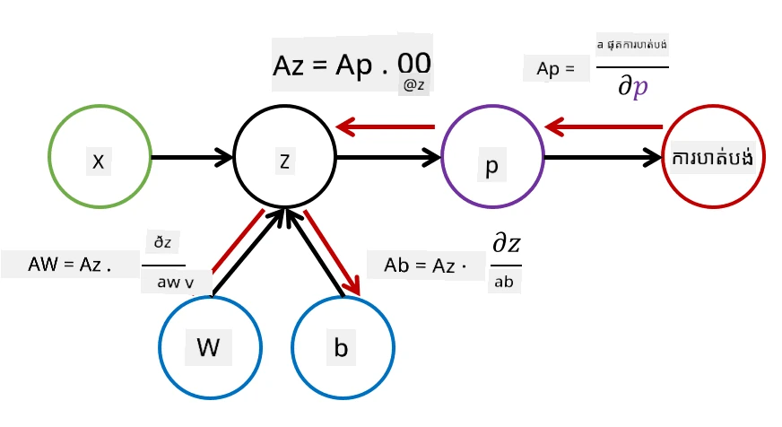

# សេចក្តីផ្តើមអំពីបណ្តាញប្រសាទ. Multi-Layered Perceptron

នៅក្នុងផ្នែកមុន អ្នកបានរៀនអំពីម៉ូដែលបណ្តាញប្រសាទដ៏សាមញ្ញបំផុត - one-layered perceptron ដែលជាម៉ូដែលកម្រាស់បែងចែកពីរប្រភេទដោយបន្ទាត់។

នៅក្នុងផ្នែកនេះ យើងនឹងពង្រីកម៉ូដែលនេះទៅជាស៊ុមប្រព័ន្ធបណ្តាញដែលអាចបត់បែនបានច្រើនជាងនេះ ដើម្បីឲ្យយើងអាច:

* បង្កើតការបែងចែកនៃជាច្រើនថ្នាក់ **multi-class classification** លើសពីការបែងចែកពីរថ្នាក់
* ដោះស្រាយបញ្ហា **regression problems** លើសពីការបែងចែក
* បំបែកថ្នាក់ដែលមិនអាចបំបែកដោយបន្ទាត់បាន

យើងនឹងបង្កើតស៊ុមប្រព័ន្ធតាមផ្នែកផ្នែកផ្ទាល់ខ្លួនក្នុងភាសា Python ដែលនឹងអនុញ្ញាតឲ្យយើងសង់ស្ថាបត្យកម្មបណ្តាញប្រសាទចម្រុះ។

## [សំណួរជម្រាបមុនថ្នាក់](https://ff-quizzes.netlify.app/en/ai/quiz/7)

## ការបញ្ជាក់ច្បាស់នៃការសិក្សាម៉ាស៊ីន

មកដើមដោយកំណត់បញ្ហាសិក្សាម៉ាស៊ីនយ៉ាងច្បាស់។ សន្មត់ថាយើងមានឈុតទិន្នន័យបណ្តុះបណ្តាល **X** ជាមួយស្លាក **Y** ហើយយើងត្រូវតែបង្កើតម៉ូដែល *f* ដែលនឹងទាយបានយ៉ាងត្រឹមត្រូវបំផុត។ គុណភាពនៃការទាយវាស់ដោយ **Loss function** &lagran;. Loss functions ខាងក្រោមត្រូវបានប្រើប្រាស់ជាញឹកញាប់៖

* សម្រាប់បញ្ហា regression នៅពេលដែលយើងត្រូវទាយចំនួនមួយ អាចប្រើ **absolute error** &sum;i|f(x(i))-y(i)|, ឬ **squared error** &sum;i(f(x(i))-y(i))2
* សម្រាប់បញ្ហាបែងចែក ថយម៉ៃយើងប្រើ **0-1 loss** (ដែលគឺដូចនឹង **accuracy** នៃម៉ូដែល), ឬ **logistic loss**

សម្រាប់ perceptron មួយកម្រិត មុខងារ *f* ត្រូវបានកំណត់ជាមុខងារបន្ទាត់ *f(x)=wx+b* (នៅទីនេះ *w* ជាម៉ាទ្រីសទំយោល, *x* ជាវ៉ិចទ័រពិសេសបញ្ចូល, និង *b* ជាវ៉ិចទ័រជម្រុះ)។ សម្រាប់ស្ថាបត្យកម្មបណ្តាញប្រសាទផ្សេងៗ មុខងារនេះអាចមានរាងកាយស្មុគស្មាញជាងនេះ។

> ក្នុងករណីបែងចែក វាជាការគួរឱ្យចង់បានក្នុងការទទួលបានប្រូបាបូលហ្គី (probabilities) នៃថ្នាក់ដែលផ្គូផ្គងជាចេញពីបណ្តាញ។ ដើម្បីបម្លែងលេខដែលណាមួយទៅប្រូបាបូលហ្គី (ឧ​ត្ដ​ហរណ៍ ដើម្បីធ្វើការធម្មតារ output) យើងជាញឹកញាប់ប្រើមុខងារ **softmax** &sigma;, ហើយមុខងារ *f* ក្លាយជា *f(x)=&sigma;(wx+b)*

ក្នុងការកំណត់ *f* ខាងលើ, *w* និង *b* ត្រូវបានហៅថា **parameters** &theta;=⟨*w,b*⟩។ បើបានផ្តល់ឈុតទិន្នន័យ ⟨**X**,**Y**⟩ យើងអាចគណនាកំហុសសរុបនៅលើទិន្នន័យទាំងមូលជាមុខងារនៃ parameters &theta;។

> ✅ **គោលបំណងនៃការបណ្តុះបណ្តាលបណ្តាញប្រសាទ គឺដើម្បីបង្រួមកំហុសដោយផ្លាស់ប្តូរ parameters &theta;**

## ការរកល្បឿន Gradient Descent

មានវិធីសាស្រ្តល្បីល្បាញមួយសម្រាប់ធ្វើអុបទីមមា​មុខងារ ដែលហៅថា **gradient descent**។ គំនិតគឺថាយើងអាចគណនាអេរកាំបន្ទាត់ (derivative) (សម្រាប់ករណីច្រើនវិមាត្រហៅថា **gradient**) នៃ loss function ទៅលើ parameters ហើយផ្លាស់ប្តូរ parameters ដោយផ្លូវមួយដែលធ្វើឲ្យកំហុសតិចបញ្ចុះ។ វាអាចកំណត់ច្បាស់បានដូចខាងក្រោម៖

* ចាប់ផ្តើម parameters ជាមួយតម្លៃចៃដន្យ w(0), b(0)
* ចម្លងជំហានខាងក្រោមនេះច្រើនដង៖
    - w(i+1) = w(i)-&eta;&part;&lagran;/&part;w
    - b(i+1) = b(i)-&eta;&part;&lagran;/&part;b

ក្នុងខណៈពេលបណ្តុះបណ្តាល ជំហានអុបទីមមា​ត្រូវគណនាលើទិន្នន័យទាំងមូល (ចងចាំថា loss គណនាជាមាឌតាមគំរូបណ្ដុះបណ្ដាលទាំងអស់)។ ទោះបីជាយ៉ាងណា ជីវិតពិតយើងយកផ្នែកតូចៗនៃទិន្នន័យហៅថា **minibatches** ហើយគណនាអេរកាំបន្ទាត់ផ្អែកលើផ្នែកតូចនោះ។ ដោយសារផ្នែកតូចស្រូវបានយកដោយចៃដន្យរាល់ពេល វិធីសាស្រ្តនេះហៅថា **stochastic gradient descent** (SGD)។

## Multi-Layered Perceptrons និង Backpropagation

បណ្តាញមួយកម្រិត ដូចដែលយើងបានឃើញខាងលើ អាចបែងចែកថ្នាក់ដែលអាចបំបែកដោយបន្ទាត់បាន។ ដើម្បីបង្កើតម៉ូដែលខុសគ្នាជាងនេះ យើងអាចផ្គុំបណ្ដាលជាមួយស្រទាប់នៃបណ្តាញច្រើន។ គណិតវិទ្យាមានន័យថា មុខងារ *f* នឹងមានរាងស្មុគស្មាញជាងនេះ ហើយនឹងត្រូវគណនាតាមជំហានច្រើន៖
* z1=w1x+b1
* z2=w2&alpha;(z1)+b2
* f = &sigma;(z2)

នៅទីនេះ &alpha; ជា **មុខងារបើកប្រតិកម្មមិនបន្ទាត់** (non-linear activation function) &sigma; ជាមុខងារ softmax និង parameters &theta;=<*w1,b1,w2,b2*>។

អាល់ហ្គូរីថึម gradient descent នឹងនៅដូចគ្នា ប៉ុន្តែវារីករាជ្យញឹកញាប់ក្នុងការគណនាអេរកាំបន្ទាត់។ អាស្រ័យលើច្បាប់ការប្រមាណខ្សែ សូមគណនាអេរកាំបន្ទាត់ជា៖

* &part;&lagran;/&part;w2 = (&part;&lagran;/&part;&sigma;)(&part;&sigma;/&part;z2)(&part;z2/&part;w2)
* &part;&lagran;/&part;w1 = (&part;&lagran;/&part;&sigma;)(&part;&sigma;/&part;z2)(&part;z2/&part;&alpha;)(&part;&alpha;/&part;z1)(&part;z1/&part;w1)

> ✅ ច្បាប់ការប្រមាណខ្សែត្រូវបានប្រើដើម្បីគណនាអេរកាំបន្ទាត់នៃមុខងារ loss ទៅលើ parameters។

ចំណាំថា ផ្នែកខាងឆ្វេងបំផុតនៃសមីការទាំងនេះដូចគ្នា ដូច្នោះយើងអាចគណនាអេរកាំបន្ទាត់ជាប្រសិទ្ធិភាពចាប់ពីមុខងារ loss ហើយត្រឡប់ក្រោយតាមតப்பារមខ្យល់គណនា។ ដូចនេះវិធីសាស្រ្តបណ្តុះបណ្តាល multi-layered perceptron ត្រូវបានហៅថា **backpropagation** ឬ 'backprop'។

> TODO: image citation

> ✅ យើងនឹងពិនិត្យរឿង backprop ជាច្រើនលម្អិតនៅក្នុងឧទាហរណ៍សៀវភៅកំណត់ត្រារៀន។

## សន្និដ្ឋាន

នៅក្នុងមេរៀននេះ យើងបានបង្កើតបណ្ណាល័យបណ្តាញប្រសាទផ្ទាល់ខ្លួន និងបានប្រើវាសម្រាប់បញ្ហាបែងចែកពីរគោលខ្នាតពីរសាមញ្ញមួយ។

## 🚀 thách thức

ក្នុងសៀវភៅកំណត់ត្រារួមមាន អ្នកនឹងអនុវត្តស៊ុមប្រព័ន្ធផ្ទាល់ខ្លួនសម្រាប់សង់និងបណ្តុះបណ្តាល multi-layered perceptrons។ អ្នកនឹងអាចមើលឃើញលម្អិតពីរៀបរាប់របៀបដំណើរការរបស់បណ្តាញប្រសាទទំនើប។

បន្តទៅសៀវភៅកំណត់ត្រា [OwnFramework](OwnFramework.ipynb) ហើយអនុវត្តវា។

## [សំណួរបន្ទាប់ថ្នាក់](https://ff-quizzes.netlify.app/en/ai/quiz/8)

## រៀនឡើងវិញ និងសិក្សាផ្ទាល់ខ្លួន

Backpropagation គឺជាអាល់ហ្គូរីធម៍ទូទៅមួយដែលប្រើនៅក្នុង AI និង ML ដែលគួរឱ្យសិក្សា [លម្អិតបន្ថែម](https://wikipedia.org/wiki/Backpropagation)

## [ការប្រឡង](lab/README.md)

នៅក្នុងមន្ទីរពិសោធន៍នេះ អ្នកត្រូវប្រើស៊ុមប្រព័ន្ធដែលបានសង់ក្នុងមេរៀននេះ ដើម្បីដោះស្រាយបញ្ហាបែងចែកលេខគំនូរ MNIST។

* [ការណែនាំ](lab/README.md)
* [សៀវភៅកំណត់ត្រា](lab/MyFW_MNIST.ipynb)

---

<!-- CO-OP TRANSLATOR DISCLAIMER START -->
**ការព្រមាន**៖  
ឯកសារនេះត្រូវបានបปลែរប្រែដោយសេវាកម្មបកប្រែ AI [Co-op Translator](https://github.com/Azure/co-op-translator)។ ខណៈពេលដែលយើងព្យាយាមសំរាប់ភាពត្រឹមត្រូវ សូមយល់ថាការបកប្រែដោយស្វ័យប្រវត្តិអាចមានកំហុស ឬការខកខាន។ ឯកសារដើមក្នុងភាសាដើមគួរត្រូវបានពិចារណាថាជាអ្នកផ្គត់ផ្គង់ព័ត៌មានដែលមានតុល្យភាព។ សម្រាប់ព័ត៌មានសំខាន់ៗ ការបកប្រែដោយមនុស្សជំនាញគឺបានណែនាំ។ យើងមិនទទួលខុសត្រូវចំពោះការយល់ច្រឡំ ឬការយល់ខុសដែលកើតមានពីការប្រើប្រាស់ការបកប្រែនេះឡើយ។
<!-- CO-OP TRANSLATOR DISCLAIMER END -->