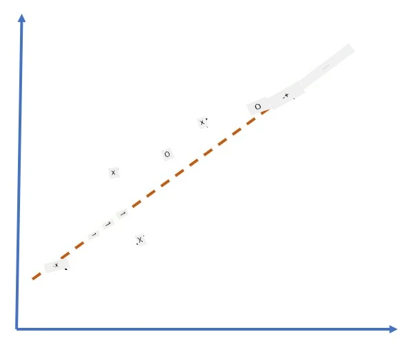
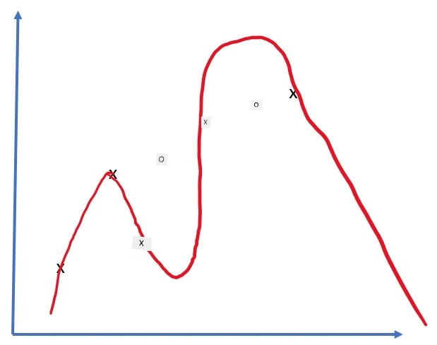
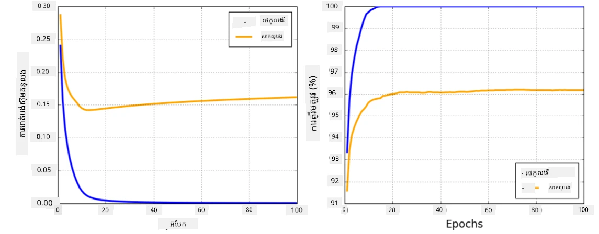

# ស៊ី្ទឹមបណ្តាញប្រព័ន្ធប្រឧត្តិ

ដូចដែលយើងបានរៀនរួចហើយ ដើម្បីអាចបណ្តុះបណ្តាលស៊ី្ទឹមបណ្តាញប្រព័ន្ធប្រឧត្តិបានយ៉ាងមានប្រសិទ្ធភាព យើងត្រូវតែធ្វើពីររឿង៖

* ដើម្បីប្រតិបត្តិបើលលើ tensor, ឧទាហរណ៍ ដើម្បីគុណ, បូក និងគណនាអនុគមន៍មួយចំនួនដូចជា sigmoid រឺ softmax
* ដើម្បីគណនាភាពត្រឹមត្រូវនៃសមីការទាំងអស់ ដើម្បីអនុវត្តន៍ការបន្ថយដោយគ្រាប់ជ្រៅ (gradient descent)

## [សំណួរពិសោធន៍មុនមេរៀន](https://ff-quizzes.netlify.app/en/ai/quiz/9)

ក្នុងខណៈដែលបណ្ណាល័យ `numpy` អាចធ្វើផ្នែកដំបូងបាន យើងត្រូវតែប្រើមុខងារមួយសម្រាប់គណនាភាពត្រឹមត្រូវ។ នៅក្នុង [ស៊ី្ទឹមរបស់យើង](../04-OwnFramework/OwnFramework.ipynb) ដែលយើងបានអភិវឌ្ឍនៅផ្នែកមុន យើងត្រូវបានកម្មង់ដោយដៃសម្រាប់មុខងារច្របាច់ទាំងអស់នៅក្នុងវិធីសាស្រ្ត `backward` ដែលអនុវត្តបន្សល់ត្រឡប់ក្រោយ (backpropagation)។ ដោយល្អបំផុត ស៊ី្ទឹមគួរតែផ្តល់ឱកាសឲ្យយើងអាចគណនាភាពត្រឹមត្រូវនៃ *សមីការណ៍ណាមួយ* ដែលយើងអាចកំណត់បាន។

រឿងសំខាន់មួយផ្សេងទៀតគឺអាចអនុវត្តន៍ការគណនានៅលើ GPU រឺឧបករណ៍កំព្យូទ័រពិសេសផ្សេងទៀត ដូចជា [TPU](https://en.wikipedia.org/wiki/Tensor_Processing_Unit)។ ការបណ្តុះបណ្តាលស៊ី្ទឹមបណ្តាញប្រព័ន្ធ (deep neural network) តម្រូវឲ្យមាន *ការគណនាច្រើន* ហើយអាចធ្វើការបែងចែកគណនានេះលើ GPU គឺមានសារៈសំខាន់ខ្លាំង។

> ✅ ពាក្យ 'parallelize' មានន័យថាផ្សព្វផ្សាយការគណនាឲ្យមាននៅលើឧបករណ៍ច្រើន។

បច្ចុប្បន្ន គ្រប់គ្រងស៊ី្ទឹមបណ្តាញប្រព័ន្ធពេញនិយមពីរប្រភេទគឺ: [TensorFlow](http://TensorFlow.org) និង [PyTorch](https://pytorch.org/)។ ពួកវាផ្ដល់ API ដល់កម្រិតទាបសម្រាប់ប្រតិបត្តិការ tensor លើ CPU និង GPU ទាំងឡាយ។ លើសពី API កម្រិតទាប មាន API កម្រិតខ្ពស់ ផ្អែកលើគ្នា ដែលហៅថា [Keras](https://keras.io/) និង [PyTorch Lightning](https://pytorchlightning.ai/) តាមលំដាប់។

API កម្រិតទាប | [TensorFlow](http://TensorFlow.org) | [PyTorch](https://pytorch.org/)
--------------|-------------------------------------|--------------------------------
API កម្រិតខ្ពស់    | [Keras](https://keras.io/)          | [PyTorch Lightning](https://pytorchlightning.ai/)

**API កម្រិតទាប** សម្រាប់ទាំងពីរស៊ី្ទឹមអនុញ្ញាតឲ្យអ្នកកសាងអ្វីដែលហៅថា **ក្រាបការគណនា** ។ ក្រាបនេះកំណត់របៀបគណនាផលបស់ (ជាធម្មតាគឺត្រូវគណនាអំពី loss function) ជាមួយប៉ារ៉ាម៉ែត្រចូលដែលបានផ្តល់ ហើយអាចបង្ខំឲ្យធ្វើការគណនាលើ GPU ប្រសិនបើមាន។ មានមុខងារសម្រាប់បូកគ្នាគណនាភាពត្រឹមត្រូវរបស់ក្រាបនេះ ហើយបានប្រើសម្រាប់បង្កើនគុណភាពប៉ារ៉ាម៉ែត្ររបស់គំរូ។

**API កម្រិតខ្ពស់** ចាត់ទុកស៊ី្ទឹមបណ្តាញប្រព័ន្ធប្រឧត្តិជាក្រុម **ជាន់នៃបន្ទាប់បន្សំ** និងធ្វើឲ្យការបង្កើតស៊ី្ទឹមបណ្តាញប្រព័ន្ធភាគច្រើនកាន់តែងាយស្រួល។ ការបណ្តុះបណ្តាលគំរូភាគច្រើនត្រូវតែត្រៀមទិន្នន័យ ហើយបន្ទាប់មកហៅមុខងារ `fit` សម្រាប់ធ្វើការងារ។

API កម្រិតខ្ពស់អនុញ្ញាតឲ្យអ្នកបង្កើតស៊ី្ទឹមបណ្តាញប្រព័ន្ធជាទម្រង់រងលឿនដោយមិនចាំបាច់ចាប់អារម្មណ៍អំពីព័ត៌មានលម្អិតជាច្រើន។ នៅខណៈពេលមួយ API កម្រិតទាបផ្តល់ការគ្រប់គ្រងបន្ថែមលើដំណើរការបណ្តុះបណ្តាល ហើយគេប្រើដើម្បីស្រាវជ្រាវពិសេសនៅពេលអ្នកកំពុងដំណើរការជាមួយបុណ្យស៊ី្ទឹមបណ្តាញប្រព័ន្ធថ្មី។

វាក៏មានសារៈសំខាន់ក្នុងការយល់ថាអ្នកអាចប្រើ API ពីរប្រភេទគ្នា តាមរយៈការអភិវឌ្ឍរចនាសម្ព័ន្ធជាន់បណ្ដាញរបស់អ្នកដោយប្រើ API កម្រិតទាប ហើយបន្ទាប់មកប្រើវានៅក្នុងបណ្តាញធំដែលបានបង្កើតនិងបណ្តុះបណ្តាលដោយ API កម្រិតខ្ពស់។ ឬអ្នកអាចកំណត់បណ្តាញដោយប្រើ API កម្រិតខ្ពស់ជាជួរបន្ទាប់បន្សំ ហើយប្រើលំហូរបណ្តុះបណ្តាលកម្រិតទាបរបស់ខ្លួន ដើម្បីអនុវត្តការបង្កើនគុណភាព។ API ទាំងពីរប្រើគំនិតមូលដ្ឋានដូចគ្នា ហើយបានរចនាឡើងសម្រាប់ការធ្វើការល្អជាមួយគ្នា។

## ការសិក្សា

នៅក្នុងវគ្គនេះ យើងផ្ដល់មាតិកាច្រើនសម្រាប់ទាំង PyTorch និង TensorFlow។ អ្នកអាចជ្រើសរើសស៊ី្ទឹមដែលអ្នកចូលចិត្ត ហើយរត់តាមសៀវភៅបញ្ជាក់ដែលសមរម្យបានគត់។ ប្រសិនបើអ្នកមិនប្រាកដថាត្រូវជ្រើសរើសស៊ី្ទឹមណា អាចអានការពិភាក្សាដែលមាននៅលើអ៊ីនធឺណិតអំពី **PyTorch និង TensorFlow**។ អ្នកក៏អាចសាកល្បងទាំងពីរដើម្បីយល់ឲកាន់តែច្បាស់ពីស៊ី្ទឹមទាំងពីរ។

នៅកន្លែងដែលអាចបាន យើងនឹងប្រើ API កម្រិតខ្ពស់សម្រាប់ភាពសាមញ្ញ។ ទោះជាយ៉ាងណា យើងជឿថាសំខាន់ក្នុងការយល់ពីរបៀបដំណើរការរបស់ស៊ី្ទឹមបណ្តាញប្រព័ន្ធពីដីដើម ដូច្នេះនៅដើមវគ្គ យើងចាប់ផ្តើមធ្វើការជាមួយ API កម្រិតទាប និង tensor។ ប៉ុន្តែ ប្រសិនអ្នកចង់ចាប់ផ្តើមយ៉ាងលឿន ហើយមិនចង់ប្រើពេលច្រើនក្នុងការរៀនព័ត៌មានលម្អិតទាំងនេះ អ្នកអាចរំពឹងខ្លាចរូបខ្លួននិងចូលទៅកាន់សៀវភៅ API កម្រិតខ្ពស់ភ្លាម។

## ✍️ ការអនុវត្ត: ស៊ី្ទឹមបណ្តាញប្រព័ន្ធ

បន្តការសិក្សារបស់អ្នកនៅក្នុងសៀវភៅបញ្ជាក់ខាងក្រោម៖

API កម្រិតទាប | [TensorFlow+Keras Notebook](IntroKerasTF.ipynb) | [PyTorch](IntroPyTorch.ipynb)
--------------|-------------------------------------|--------------------------------
API កម្រិតខ្ពស់    | [Keras](IntroKeras.ipynb) | *PyTorch Lightning*

បន្ទាប់ពីជំនាញក្នុងស៊ី្ទឹមហើយ អ្នកមកវិលត្រឡប់មើលចំណុចនៃ overfitting ម្តងទៀត។

# Overfitting

Overfitting គឺជាគំនិតសំខាន់ណា នៅក្នុងការរៀនម៉ាស៊ីន ហើយវាចាំបាច់ត្រូវបានយល់ឲ្យបានត្រឹមត្រូវ!

ពិចារណាបញ្ហាដែលបរសាក្សីរវាងចំណុច5 (ដែលតំណាងដោយ `x` នៅលើក្រាហ្វខាងក្រោម):

 | 
-------------------------|--------------------------
**ម៉ូដែលបន្ទាត់ស្រស់ មានប៉ារ៉ាម៉ែត្រ 2** | **ម៉ូដែលមិនបន្ទាត់ស្រស់ មានប៉ារ៉ាម៉ែត្រ 7**
បញ្ហាបណ្តុះបណ្តាល = 5.3 | பញ្ហាបណ្តុះបណ្តាល = 0
បញ្ហា Scan ដើម្បីផ្ទៀងផ្ទាត់ = 5.1 | បញ្ហា Scan ដើម្បីផ្ទៀងផ្ទាត់ = 20

* នៅខាងឆ្វេង យើងឃើញបន្ទាត់ស្រស់ល្អ។ ព្រោះចំនួនប៉ារ៉ាម៉ែត្រត្រឹមត្រូវ ម៉ូដែលយល់ច្បាស់ពីដំណាក់កាលចែកចាយចំណុច។
* នៅខាងស្ដាំ ម៉ូដែលមានកម្លាំងខ្លាំងពេក។ ព្រោះយើងមានតែប្រាំចំណុច ហើយម៉ូដែលមានប្រាំបីប៉ារ៉ាម៉ែត្រ វាអាចកំណត់តម្លៃឲ្យឆ្លងកាត់ចំណុចទាំងអស់បាន ធ្វើឲ្យកំហុសបណ្តុះបណ្តាលក្លាយជាសូន្យ។ ប៉ុន្តែវាបំប៉នម៉ូដែលមិនឲ្យយល់ឆ្គើយពីបាំងកូដខាងក្រោយទិន្នន័យ អ្វីដែលធ្វើឲ្យកំហុសផ្ទៀងផ្ទាត់ខ្ពស់។

វាមានសារៈសំខាន់យ៉ាងខ្លាំងក្នុងការរកតុល្យភាពត្រឹមត្រូវរវាងភាពសម្បូរបែបរបស់ម៉ូដែល (ចំនួនប៉ារ៉ាម៉ែត្រ) និងចំនួនគំរូបណ្តុះបណ្តាល។

## ហេតុអ្វីបានជា overfitting កើតឡើង

  * ទិន្នន័យបណ្តុះបណ្តាលមិនគ្រប់គ្រាន់
  * ម៉ូដែលមានអំណាចលើស
  * មានសំឡេងរំខានជាច្រើននៅក្នុងទិន្នន័យចូល

## របៀបរកឃើញ overfitting

ដូចដែលអ្នកឃើញពីក្រាហ្វខាងលើ អាចរកឃើញ overfitting ដោយកំហុសបណ្តុះបណ្តាលទាបណាស់ និងកំហុសផ្ទៀងផ្ទាត់ខ្ពស់។ ជាទូទៅ ក្នុងដំណាក់កាលបណ្តុះបណ្តាល យើងនឹងឃើញកំហុសបណ្តុះបណ្តាល និងកំហុសផ្ទៀងផ្ទាត់បញ្ចុះចុះទាំងពីរ ហើយបន្ទាប់មកនៅពេលណាមួយ កំហុសផ្ទៀងផ្ទាត់អាចឈប់បន្ថយ ហើយចាប់ផ្ដើមកើនឡើង។ នេះជាសញ្ញានៃ overfitting និងសញ្ញាថាយើងគួរតែបញ្ឈប់ការបណ្តុះបណ្តាលនៅពេលនេះ (ឬយ៉ាងហោចណាស់ថតចម្លងម៉ូដែលនៅពេលនេះ)។

## របៀបការពារកុំឲ្យ overfitting កើតឡើង

ប្រសិនបើអ្នកឃើញថា overfitting កើតឡើង អ្នកអាចធ្វើពីរបៀបដូចតទៅ៖

 * បន្ថែមចំនួនទិន្នន័យបណ្តុះបណ្តាល
 * បន្ថយស្មុគស្មាញរបស់ម៉ូដែល
 * ប្រើបច្ចេកវិទ្យា [regularization technique](../../4-ComputerVision/08-TransferLearning/TrainingTricks.md) មួយចំនួន ដូចជា [Dropout](../../4-ComputerVision/08-TransferLearning/TrainingTricks.md#Dropout) ដែលយើងនឹងពិចារណានៅពេលក្រោយ។

## Overfitting និងការជជែកចែករវាង Bias-Variance

Overfitting ជាករណីមួយនៃបញ្ហាទូទៅក្នុងស្ថិតិហៅថា [Bias-Variance Tradeoff](https://en.wikipedia.org/wiki/Bias%E2%80%93variance_tradeoff)។ ប្រសិនបើយើងពិចារណាពីប្រភពកំហុសក្នុងម៉ូដែល យើងអាចមើលឃើញកំហុសពីរប្រភេទ៖

* កំហុស **Bias** បង្កឡើងដោយអាល្គូរីធម៍បណ្តុំរបស់យើងមិនអាចចាប់យកទំនាក់ទំនងរវាងទិន្នន័យបណ្តុះបណ្តាលបានត្រឹមត្រូវ។ វាអាចបណ្តាលមកពីម៉ូដែលរបស់យើងមិនមានអំណាចគ្រប់គ្រាន់ (**underfitting**)។
* កំហុស **Variance** បណ្តាលមកពីម៉ូដែលស៊ើបអង្កេតសំឡេងរំខានក្នុងទិន្នន័យចូល ជំនួសអោយទំនាក់ទំនងមានអត្ថន័យ (**overfitting**)។

ក្នុងដំណាក់កាលបណ្តុះបណ្តាល កំហុស bias កាត់បន្ថយ (ដោយសារតែម៉ូដែលរៀនចាប់យកទិន្នន័យ) ខណៈកំហុស variance កើនឡើង។ វាមានសារៈសំខាន់ក្នុងការបញ្ឈប់ការបណ្តុះបណ្តាល – ហើយអាចធ្វើដោយដៃ (នៅពេលយើងរកឃើញ overfitting) ឬដោយស្វ័យប្រវត្តិ (ដោយណែនាំ regularization) – ដើម្បីការពារការកើតឡើងនៃ overfitting។

## សេចក្តីសន្និដ្ឋាន

នៅក្នុងមេរៀននេះ អ្នកបានរៀនអំពីការបម្លែងជាច្រើនរវាង API នានារបស់ស៊ី្ទឹម AI សំខាន់ៗពីរដូចជា TensorFlow និង PyTorch។ លើសពីនេះ អ្នកបានរៀនអំពីប្រធានបទសំខាន់ណាស់មួយ គឺ overfitting។

## 🚀 ជំហាន thách thức

នៅក្នុងសៀវភៅបញ្ជាក់ជាប់នឹងរូបរាង អ្នកនឹងឃើញ 'ភារកិច្ច' នៅខាងក្រោម; សូមធ្វើការតាមសៀវភៅបញ្ជាក់ ហើយបញ្ចប់ភារកិច្ច។

## [សំណួរពិសោធន៍បន្ទាប់មក](https://ff-quizzes.netlify.app/en/ai/quiz/10)

## ពិនិត្យឡើងវិញ និង សិក្សាផ្ទាល់ខ្លួន

សូមស្រាវជ្រាវអំពីប្រធានបទខាងក្រោម៖

- TensorFlow
- PyTorch
- Overfitting

សួរខ្លួនឯងសំណួរខាងក្រោម៖

- តើអ្វីទៅជាការបំផុសគ្នារវាង TensorFlow និង PyTorch?
- តើអ្វីទៅជាការបំផុសគ្នារវាង overfitting និង underfitting?

## [ភារកិច្ច](lab/README.md)

នៅក្នុងមន្ទីរប្រឡងនេះ អ្នកត្រូវបានស្នើឲ្យដោះស្រាយបញ្ហាកំណាត់ចំណាត់ថ្នាក់ពីរមានការតភ្ជាប់គ្នាពីរបន្តផ្នែក ដោយប្រើបណ្តាញតែមួយ និងមានច្រើនជាន់ប្រើ PyTorch ឬ TensorFlow ។

* [សំណើ](lab/README.md)
* [សៀវភៅបញ្ជាក់](lab/LabFrameworks.ipynb)

---

<!-- CO-OP TRANSLATOR DISCLAIMER START -->
**ការបដិសេធ**៖
ឯកសារនេះត្រូវបានបកប្រែដោយប្រើសេវាបកប្រែ AI [Co-op Translator](https://github.com/Azure/co-op-translator)។ ទោះបីយើងខិតខំថែរក្សាការត្រឹមត្រូវក៏ដោយ សូមជ្រាបថាប្រែប្រួលដោយស្វ័យប្រវត្តិក្នុងការបកប្រែអាចមានកំហុស ឬភាពមិនមានភាពត្រឹមត្រូវ។ ឯកសារដើមក្នុងភាសាទំនើបរបស់វាគួរត្រូវបានគេចាត់ទុកជាអ្នកផ្តល់ព័ត៌មានឯកទេស។ សម្រាប់ព័ត៌មានសំខាន់ៗ សូមផ្តល់ការបកប្រែដោយមនុស្សដែលមានជំនាញជំនាញ។ យើងមិនទទួលខុសត្រូវចំពោះការយល់ច្រឡំ ឬការបកស្រាយខុសពីការប្រើប្រាស់ការបកប្រែនេះឡើយ។
<!-- CO-OP TRANSLATOR DISCLAIMER END -->