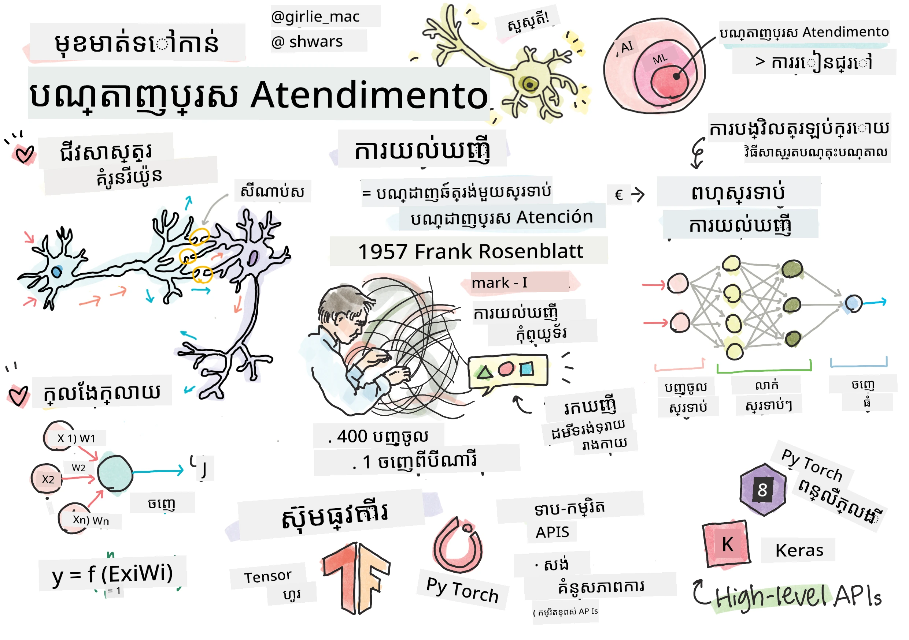
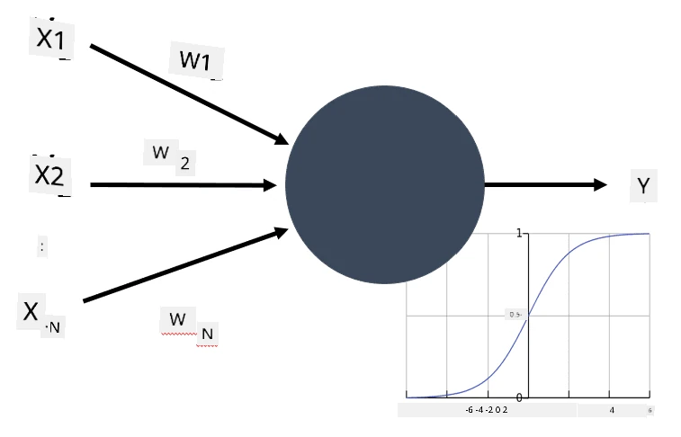
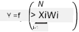

# ការណែនាំអំពីបណ្ដាញប្រសាទៈ

ដូចដែលយើងបានពិភាក្សានៅក្នុងការណែនាំ មធ្យោបាយមួយក្នុងការសម្រេចបានប្រសិទ្ធភាពគឺការបណ្តុះបណ្តាល **ម៉ូដែលកុំព្យូទ័រ** ឬ **ខួរក្បាលខ្លោងប្រព័ន្ធ**។ ចាប់ពីកណ្ដាលជួរឆ្នាំ២០ ពិភពរូបមន្ត គណិតវិទ្យានានាអ្នកស្រាវជ្រាវបានព្យាយាមម៉ូដែលគណិតវិទ្យាផ្សេងៗ រហូតដល់ក្នុងរយៈពេលថ្មីៗនេះទិសដៅនេះបានបង្ហាញពីភាពជោគជ័យយ៉ាងខ្លាំង។ ម៉ូដែលគណិតវិទ្យាបែបនេះគឺត្រូវបានហៅថា **បណ្ដាញប្រសាទ**។

> ម្តងម្ដងបណ្ដាញប្រសាទត្រូវបានហៅថា *បណ្ដាញប្រសាទខ្លោងប្រព័ន្ធ* សញ្ញា ANNs ដើម្បីបញ្ជាក់ថាយើងកំពុងនិយាយអំពីម៉ូដែល មិនមែនបណ្ដាញប្រសាទពិតទេ។

## ការសិក្សាម៉ាស៊ីន

បណ្ដាញប្រសាទជាផ្នែកមួយនៃវិស័យធំមួយហៅថា **ការសិក្សាម៉ាស៊ីន** ដែលមានគោលបំណងប្រើទិន្នន័យក្នុងការបណ្តុះបណ្តាលម៉ូដែលកុំព្យូទ័រដែលអាចដោះស្រាយបញ្ហា។ ការសិក្សាម៉ាស៊ីនគឺជាផ្នែកមួយដ៏ធំនៃបញ្ញាសិប្បនិម្មិត ប៉ុន្តែយើងមិនដាក់បញ្ចូលការសិក្សាម៉ាស៊ីនបែបចាស់នោះក្នុងកម្មវិធីនេះ។

> សូមចូលទៅកាន់កម្មវិធីដាច់ខាត **[ការសិក្សាម៉ាស៊ីនសម្រាប់អ្នកចាប់ផ្តើម](http://github.com/microsoft/ml-for-beginners)** ដើម្បីរៀនបន្ថែមអំពីការសិក្សាម៉ាស៊ីនបែបចាស់។

ក្នុងការសិក្សាម៉ាស៊ីន យើងគិតថាយើងមានសំណុំទិន្នន័យជាគំរូ **X** និងតម្លៃចេញផ្សេងៗគ្នា **Y**។ គំរូជាច្រើនជាអ្វីដែលជាវិចទ័រពហុវដ្ត (N-dimensional vectors) ដែលមាន **លក្ខណៈ** ហើយតម្លៃចេញហៅថា **ស្លាក**។

យើងនឹងពិចារណាពីបញ្ហាសិក្សាម៉ាស៊ីនទាំងពីរដែលធម្មតាបំផុត៖

* **ការបែងចែកចំណាត់ថ្នាក់**, ដែលយើងត្រូវបែងចែកវត្ថុចូលទៅក្នុងពីរឬច្រើនថ្នាក់។
* **ការវិលតម្លៃ**, ដែលយើងត្រូវទាយរកលេខគណនាលេខសម្រាប់គំរូចូលនីមួយៗ។

> នៅពេលបង្ហាញទិន្នន័យចូល និងចេញជាទិន្នន័យប្រភេទ tensor សំណុំទិន្នន័យចូលគឺជាម៉ាទ្រីសដែលមានទំហំ M&times;N ដែល M ជាចំនួនគំរូ និង N ជាចំនួនលក្ខណៈ។ ស្លាកចេញ Y ជាវិចទ័រទំហំ M។

ក្នុងកម្មវិធីនេះ យើងផ្ដោតសំខាន់លើម៉ូដែលបណ្ដាញប្រសាទតែប៉ុណ្ណោះ។

## ម៉ូដែលនៃអណឺរ៉ូន

ចេញពីជីវវិទ្យា យើងដឹងថា ខួរក្បាលរបស់យើងមានពីសសរបស់ប្រសាទ (neurons) រៀងរាល់អណឺរ៉ូនមាន "ចូល" ច្រើន (dendrites) និង "ចេញ" មួយ (axon)។ ការចូល និងចេញទាំងពីរអាចបញ្ជូនសញ្ញាអគ្គិសនី ហើយការតភ្ជាប់រវាងពួកវា — ដែលគេហៅថា synapses — អាចបង្ហាញកំរិតនៃការបញ្ជូនភ្លើងខុសៗគ្នា ដែលត្រូវបានគ្រប់គ្រងដោយ neurotransmitters​។

 | 
----|----
អណឺរ៉ូនពិត *([រូបភាព](https://en.wikipedia.org/wiki/Synapse#/media/File:SynapseSchematic_lines.svg) ពីវិគីភីឌា)* | អណឺរ៉ូនសិប្បនិម្មិត *(រូបភាពដោយអ្នកនិពន្ធ)*

ដូចនេះ ម៉ូដែលគណិតវិទ្យា​ធម្មតា​បំផុត​នៃអណឺរ៉ូនមានចូលច្រើន X1, ..., XN និងចេញ Y រួមជាមួយស៊េរីនៃប៉ារ៉ាម៉ែត្រ W1, ..., WN។ ចេញ Y ត្រូវបានគណនាដូចជា៖

ដែល f ជា **អនុគមន៍សកម្មភាព** មួយដែលមិនមែនជាលីនេអាល់។

> ម៉ូដែលដើមនៃអណឺរ៉ូនត្រូវបានពិពណ៌នានៅក្នុងឯកសារចាស់ [A logical calculus of the ideas immanent in nervous activity](https://www.cs.cmu.edu/~./epxing/Class/10715/reading/McCulloch.and.Pitts.pdf) ដោយ Warren McCullock និង Walter Pitts ឆ្នាំ 1943. Donald Hebb ក្នុងសៀវភៅរបស់គាត់ "[The Organization of Behavior: A Neuropsychological Theory](https://books.google.com/books?id=VNetYrB8EBoC)" បានណែនាំពីវិធីដែលបណ្ដាញទាំងនោះអាចត្រូវបានបណ្តុះបណ្តាល។

## នៅផ្នែកនេះ

នៅផ្នែកនេះ យើងនឹងរៀនអំពី៖
* [Perceptron](03-Perceptron/README.md), មួយក្នុងចំណោមម៉ូដែលបណ្ដាញប្រសាទដំបូងសម្រាប់ការបែងចែកចំណាត់ថ្នាក់ពីរថ្នាក់
* [បណ្ដាញជាច្រើនស្រទាប់](04-OwnFramework/README.md) ជាមួយកំណត់ចំណាំគូសynchronized [របៀបកសាងស៊ុមផ្ទាល់ខ្លួន](04-OwnFramework/OwnFramework.ipynb)
* [ស៊ុមបណ្ដាញប្រសាទ](05-Frameworks/README.md), ជាមួយកំណត់ចំណាំទាំងនេះ៖ [PyTorch](05-Frameworks/IntroPyTorch.ipynb) និង [Keras/Tensorflow](05-Frameworks/IntroKerasTF.ipynb)
* [ការទទួលផ្លូវពេក](../../../../lessons/3-NeuralNetworks/05-Frameworks)

---

<!-- CO-OP TRANSLATOR DISCLAIMER START -->
**ការបដិសេធ**៖  
ឯកសារនេះត្រូវបានបកប្រែដោយប្រើសេវាបកប្រែ AI [Co-op Translator](https://github.com/Azure/co-op-translator)។ ខណៈពេលយើងព្យាយាមរក្សាការត្រឹមត្រូវ សូមជ្រាបថាការបកប្រែដោយស្វ័យប្រវត្តិអាចមានកំហុស ឬការមិនត្រឹមត្រូវមួយចំនួន។ ឯកសារដើមនៅភាសាប្រភពគួរត្រូវបានចាត់ទុកថាជា ប្រភពដែលមានអំណាចបំផុត។ សម្រាប់ព័ត៌មានសំខាន់ៗ គួរតែប្រើការបកប្រែដោយមនុស្សដែលជាមនុស្សជំនាញ។ យើងមិនទទួលខុសត្រូវចំពោះការយល់ច្រឡំណាមួយ ឬការប្រែប្រួលមិនត្រឹមត្រូវណាមួយដែលកើតឡើងពីការប្រើប្រាស់ការបកប្រែនេះទេ។
<!-- CO-OP TRANSLATOR DISCLAIMER END -->