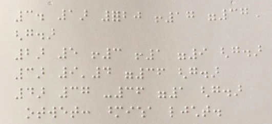
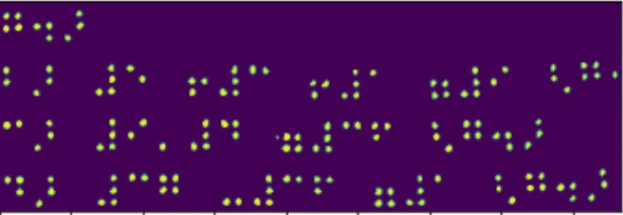
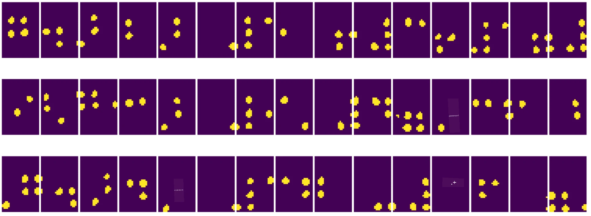
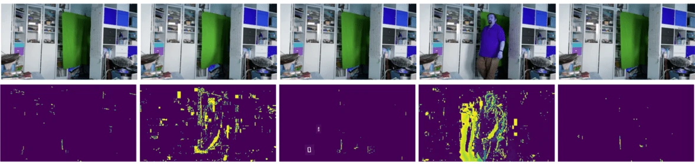
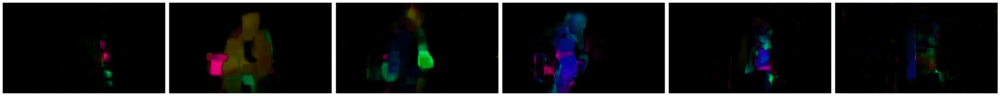

# ការណែនាំអំពី គំនិតវិចារណាអំពីរូបភាព

[គំនិតវិចារណាអំពីរូបភាព](https://wikipedia.org/wiki/Computer_vision) គឺជាវិជ្ជាមួយគោលបំណងអោយកុំព្យូទ័រអាចយល់ដឹងជាឡូយល្វីលពីរូបភាពឌីជីថល។ នេះជាការពិពណ៌នាធំទូលាយណាស់ ព្រោះ *ការយល់ដឹង* អាចមានន័យជាច្រើនប្រភេទ រួមមានការស្វែងរកវត្ថុក្នុងរូបភាព (**ការប្រើបញ្ជាក់វត្ថុ**), ការយល់ដឹងអំពីអ្វីកន្ល="{ល្ទ}"ន (\*\*ការសម្គាល់ព្រឹត្តិការណ៍\*\*), ការពិពណ៌នារូបភាពជាអត្ថបទ ឬការធ្វើឡើងវិញសีนារច្នៃជាបីវិមាត្រ។ មានការងារពិសេសខ្លះទាក់ទងនឹងរូបភាពមនុស្ស ដូចជា ការប៉ាន់ប្រមាណអាយុ និងអារម្មណ៍ ការសម្គាល់មុខ និងការបញ្ជាក់មុខ និងការប៉ាន់ប្រមាណទីតាំង3D ពីរបៀបមួយចំនួន។

## [សំណួរពិនិត្យមុនមេរៀន](https://ff-quizzes.netlify.app/en/ai/quiz/11)

មួយក្នុងចំណោមការងារងាយៗបំផុតនៃគំនិតវិចារណាអំពីរូបភាពគឺ **ចំណាត់ថ្នាក់រូបភាព**។

គំនិតវិចារណាអំពីរូបភាពត្រូវបានគេចាត់ទុកជាផ្នែកមួយនៃ AI។ ថ្ងៃនេះ ភាគច្រើននៃការងារជាមួយខ្នាតនេះត្រូវបានដោះស្រាយដោយបណ្តាញប្រសាទ។ យើងនឹងរៀនបន្ថែមអំពីប្រភេទពិសេសនៃបណ្តាញប្រសាទដែលប្រើសម្រាប់គំនិតវិចារណាអំពីរូបភាព, [បណ្តាញប្រសាទសំឡឹក](../07-ConvNets/README.md), តាមពេលផ្នែកនេះ។

ទោះយ៉ាងណា មុនពេលអ្នកផ្ញើរូបភាពទៅកាន់បណ្តាញប្រសាទ នៅក្នុងជាច្រើនករណី វាអាចមានអត្ថប្រយោជន៍ក្នុងការប្រើបច្ចេកវិទ្យាគណិតវិធីមួយចំនួនដើម្បីបង្កើនគុណភាពរូបភាព។

មានបណ្ណាល័យ Python ជាច្រើនសម្រាប់ដំណើរការរូបភាព៖

* **[imageio](https://imageio.readthedocs.io/en/stable/)** អាចប្រើសម្រាប់អាន/សរសេរទ្រង់ទ្រាយរូបភាពខុសៗគ្នា។ វាក៏គាំទ្រថ្មី ffmpeg ដែលជាកម្មវិធីមានប្រយោជន៍សម្រាប់បម្លែងចំណុចវីដេអូទៅជារូបភាពផងដែរ។
* **[Pillow](https://pillow.readthedocs.io/en/stable/index.html)** (ដែលគេស្គាល់ថា PIL) មានខ្លះខ្លាំងជាង ហើយក៏គាំទ្រការផ្លាស់ប្តូររូបភាពមួយចំនួន ដូចជាការបំលែង ប្រែប្រួលពណ៌ និងផ្សេងៗទៀត។
* **[OpenCV](https://opencv.org/)** ជាបណ្ណាល័យដំណើរការរូបភាពដែលមានកម្លាំងសរសេរឡើងក្នុងភាសា C++ ដែលបានក្លាយជាមាត្រ​ដែលគេប្រើសម្រាប់ដំណើរការរូបភាព។ វាមានចំណុចប្រទាក់ Python ដែលងាយស្រួលប្រើ។
* **[dlib](http://dlib.net/)** ជាបណ្ណាល័យ C++ ដែលអនុវត្តន៍លទ្ធវិធីរៀនម៉ាស៊ីនជាច្រើន រួមមានលទ្ធវិធីមួយចំនួននៃគំនិតវិចារណាអំពីរូបភាព។ វាក៏មានចំណុចប្រទាក់ Python ផងដែរ ហើយអាចប្រើសម្រាប់ការងារលំបាកដូចជាការសម្គាល់មុខ និងសម្គាល់សញ្ញាមុខ។

## OpenCV

[OpenCV](https://opencv.org/) ត្រូវបានគេចាត់ទុកជាមាត្រ​ដដែលនៃការដំណើរការរូបភាព។ វាមានលទ្ធវិធីនានាដែលមានប្រយោជន៍ ជួយដោយភាសា C++។ អ្នកអាចហៅ OpenCV ពី Python បានផងដែរ។

កន្លែងល្អសម្រាប់រៀន OpenCV គឺ [មេកូសិក្សា Learn OpenCV នេះ](https://learnopencv.com/getting-started-with-opencv/។ នៅក្នុងកម្មវិធីសិក្សារបស់យើង គោលបំណងរបស់យើងមិនមែនទៀន OpenCV ទេ ប៉ុន្តែចង់បង្ហាញឲ្យអ្នកមើលឧទាហរណ៍ខ្លះពេលដែលវាអាចប្រើបាន និងរបៀបប្រើវា។

### ការផ្ទុករូបភាព

រូបភាពនៅក្នុង Python អាចតំណាងដោយអារេ NumPy បានយ៉ាងងាយស្រួល។ ឧទាហរណ៍ រូបភាពពណ៌ប្រផេះដែលមានទំហំ 320x200 ពិចសែល ត្រូវបានរក្សាទុកនៅក្នុងអារេ 200x320 ហើយរូបភាពពណ៌ដែលមានទំហំដូចគ្នា នឹងមានរាង 200x320x3 (សម្រាប់បោះពណ៌ចំនួន 3)។ ដើម្បីផ្ទុករូបភាព អ្នកអាចប្រើកូដដូចខាងក្រោម៖

```python
import cv2
import matplotlib.pyplot as plt

im = cv2.imread('image.jpeg')
plt.imshow(im)
```

តាមប្រពៃណី OpenCV ប្រើការអង្កត់ BGR (ខៀវ-បៃតង-ក្រហម) សម្រាប់រូបភាពពណ៌ ខណៈដែលឧបករណ៍ Python ផ្សេងៗប្រើការអង្កត់ RGB (ក្រហម-បៃតង-ខៀវ) ដែលជារបៀបផ្លូវការផ្សេងទៀត។ ដើម្បីឲ្យរូបភាពមើលបានត្រឹមត្រូវ អ្នកត្រូវបំលែងវាទៅជាអង្កត់ RGB ដោយប្រើការបត់ផ្លាស់ទីវិមាត្រ ក្នុងអារេ NumPy ឬហៅមុខងារ OpenCV ក៏បាន៖

```python
im = cv2.cvtColor(im,cv2.COLOR_BGR2RGB)
```

មុខងារ `cvtColor` ដូចគ្នានេះអាចប្រើសម្រាប់បម្លែងអង្កត់ពណ៌ផ្សេងៗដូចជាការបម្លែងរូបភាពទៅជាពណ៌ប្រផេះ ឬទៅ HSV (Hue-Saturation-Value)។

អ្នកក៏អាចប្រើ OpenCV ដើម្បីផ្ទុកចំណុចវីដេអូច្រើនជាកំណត់ត្រា តាមឧទាហរណ៍ដែលបានផ្តល់ក្នុងសមាហរណកម្ម [OpenCV Notebook](OpenCV.ipynb)។

### ដំណើរការរូបភាព

មុនពេលផ្តល់រូបភាពទៅបណ្តាញប្រសាទ អ្នកអាចចង់អនុវត្តជំហានក្រោយក្រោយមួយចំនួនសម្រាប់បង្កើនប្រសិទ្ធភាព។ OpenCV អាចធ្វើបានជាច្រើនរួមមាន៖

* **កំណត់ទំហំ** រូបភាពដោយប្រើ `im = cv2.resize(im, (320,200),interpolation=cv2.INTER_LANCZOS)`
* **ធ្វើអោយរលោង** រូបភាពដោយប្រើ `im = cv2.medianBlur(im,3)` ឬ `im = cv2.GaussianBlur(im, (3,3), 0)`
* ការផ្លាស់ប្តូរកំរិតភ្លឺ និងភាពខុសគ្នារបស់រូបភាពអាចធ្វើបានដោយការបំប្លែងអារេ NumPy ដូចបានពិពណ៌នានៅ [សេចក្ដីសម្គាល់ Stackoverflow នេះ](https://stackoverflow.com/questions/39308030/how-do-i-increase-the-contrast-of-an-image-in-python-opencv)។
* ប្រើ [thresholding](https://docs.opencv.org/4.x/d7/d4d/tutorial_py_thresholding.html) ដោយហៅមុខងារ `cv2.threshold`/`cv2.adaptiveThreshold` ដែលជាជម្រើសល្អជាងការកែប្រែភ្លឺឬភាពខុសគ្នា។
* អនុវត្តន៍ការបម្លែងផ្សេងៗ [transformations](https://docs.opencv.org/4.5.5/da/d6e/tutorial_py_geometric_transformations.html) ទៅលើរូបភាព៖
    - **[Affine transformations](https://docs.opencv.org/4.5.5/d4/d61/tutorial_warp_affine.html)** អាចមានប្រយោជន៍បើអ្នកចង់បញ្ចូលការបង្វិល ការកំណត់ទំហំ និងការបន្តួចឡើងទៅលើរូបភាព ហើយអ្នកដឹងទីតាំងដើមនិងទីតាំងចង់បានរបស់ចំណុចបីក្នុងរូបភាព។ Affine transformations រក្សាបន្ទាត់ផ្នែកដូចចាស់។
    - **[Perspective transformations](https://medium.com/analytics-vidhya/opencv-perspective-transformation-9edffefb2143)** មានប្រយោជន៍បើអ្នកដឹងទីតាំងដើមនិងទីតាំងចង់បានរបស់ចំណុច 4 ក្នុងរូបភាព។ ឧទាហរណ៍ ប្រសិនបើអ្នកថតរូបឯកសារមួយដែលមានរាងជាត្រីកោណត្រង់តាមមួយកាមេរ៉ាស្មាតហ្វូនពីមุมមួយ ហើយអ្នកចង់បង្កើតរូបភាពសម្រាប់ឯកសារនោះ។
* យល់ដឹងអំពីចលនានៅក្នុងរូបភាពដោយប្រើ **[optical flow](https://docs.opencv.org/4.5.5/d4/dee/tutorial_optical_flow.html)**។

## ឧទាហរណ៍នៃការប្រើប្រាស់គំនិតវិចារណាអំពីរូបភាព

នៅក្នុង [OpenCV Notebook](OpenCV.ipynb), យើងផ្តល់ឧទាហរណ៍ខ្លះពេលដែលគំនិតវិចារណាអំពីរូបភាពអាចប្រើសម្រាប់ការងារពិសេស៖

* **ការប្រើប្រាស់ជាលំនាំមុនរូបថតនៃសៀវភៅ Braille**។ យើងផ្តោតលើរបៀបដែលអាចប្រើ thresholding, ការស្កេនលក្ខណៈពិសេស, ការបម្លែងពហុវិមាត្រ និងការបំប្លែង NumPy ដើម្បីបំបែកសញ្ញាប្រៃលីមួយៗសម្រាប់ចំណាត់ថ្នាក់បន្ថែមដោយបណ្តាញប្រសាទ។

 |  | 
----|-----|-----

> រូបភាពពី [OpenCV.ipynb](OpenCV.ipynb)

* **ការសម្គាល់ចលនាក្នុងវីដេអូដោយការប្រៀបធៀបផ្សេងគ្នារវាងចំណុចវីដេអូ**។ ប្រសិនបើកាមេរ៉ាត្រូវបានកំណត់ឲ្យថេរ ផែនទីពីកាមេរ៉ាគួរតែស្រដៀងគ្នា។ ដោយសារចំណុចវីដេអូត្រូវបានតំណាងជា អារេ ដោយគ្រាន់តែដកអារេទាំងនោះដែលសម្រាប់ចំណុចវីដេអូពីរគ្នា ការផ្សេងគ្នាផ្គត់ផ្គង់នឹងមានតម្លៃទាបសម្រាប់រូបភាពថេរ ហើយកើនឡើងនៅពេលមានចលនាប្រហែល។



> រូបភាពពី [OpenCV.ipynb](OpenCV.ipynb)

* **ការសម្គាល់ចលនាដោយប្រើ Optical Flow**។ [Optical flow](https://docs.opencv.org/3.4/d4/dee/tutorial_optical_flow.html) អនុញ្ញាតឲ្យយើងយល់ពីរបៀបដែលចំណុចវីដេអូចល័ត។ មានប្រភេទ Optical flow ពីរប្រភេទ៖

   - **Dense Optical Flow** គណនារូបភាពវ៉ិចទ័រដែលបង្ហាញចំពោះចំណុចវីដេអូនីមួយៗកំពុងបានចល័តទៅណា
   - **Sparse Optical Flow** ស្ថិតនៅលើការយកលក្ខណៈមួយចំនួនដែលផ្ដាច់មុខក្នុងរូបភាព (ឧទាហរណ៍។ លក្ខណៈគន្លង) ហើយកំណត់ខ្សែកោងរបស់ពួកវាពីចំណុចមួយទៅទីតាំងបន្ទាប់។



> រូបភាពពី [OpenCV.ipynb](OpenCV.ipynb)

## ✍️ សៀវភៅណូតប៊ុកឧទាហរណ៍៖ OpenCV [សាកល្បង OpenCV ក្នុងសកម្មភាព](OpenCV.ipynb)

មកធ្វើតេស្តជាមួយ OpenCV ដោយស្វែងយល់ពី [OpenCV Notebook](OpenCV.ipynb)

## សេចក្ដីសន្និដ្ឋាន

ពេលខ្លះ ការងារលំបាកជាងមធ្យមដូចជាការសម្គាល់ចលនា ឬការសម្គាល់ចំណុចម្រាមដៃអាចដោះស្រាយដោយគំនិតវិចារណាអំពីរូបភាពទេ។ ដូចនេះ វាមានប្រយោជន៍ខ្លាំងក្នុងការដឹងបច្ចេកវិទ្យាមូលដ្ឋាននៃគំនិតវិចារណាអំពីរូបភាព និងបណ្ណាល័យដូចជា OpenCV អាចធ្វើអ្វីបាន។

## 🚀 챌ెនជ

មើល [វីដេអូនេះ](https://docs.microsoft.com/shows/ai-show/ai-show--2021-opencv-ai-competition--grand-prize-winners--cortic-tigers--episode-32?WT.mc_id=academic-77998-cacaste) ពីកម្មវិធី AI show ដើម្បីរៀនអំពីគម្រោង Cortic Tigers និងរបៀបដែលពួកគេបានបង្កើតដំណោះស្រាយជារបៀបប្លុក ដើម្បីអនុញ្ញាតឱ្យការងារគំនិតវិចារណាអំពីរូបភាពក្លាយទៅជាអ្នកគ្រប់គ្រងដោយរូបភាពរ៉ូបូត។ សូមធ្វើការស្រាវជ្រាវអំពីគម្រោងផ្សេងទៀតដែលជួយអ្នកចាប់ផ្តើមថ្មីចូលក្នុងវិស័យនេះ។

## [សំណួរពិនិត្យបន្ទាប់មេរៀន](https://ff-quizzes.netlify.app/en/ai/quiz/12)

## ការត្រួតពិនិត្យ និងសិក្សាឯកឡើយ

អានបន្ថែមអំពី optical flow [នៅក្នុងមេរៀនល្អនេះ](https://learnopencv.com/optical-flow-in-opencv/)។

## [ចាត់តាំង](lab/README.md)

ក្នុងពិធីសិក្សានេះ អ្នកនឹងថតវីដេអូជាមួយចលនាជាទម្រង់ ឆ្ពោះ លើក ក្រោម ឬច្រោះទៅខាងឆ្វេង/ស្តាំ ដោយប្រើ optical flow។


---

<!-- CO-OP TRANSLATOR DISCLAIMER START -->
**ការបដិសេធ**:  
ឯកសារនេះត្រូវបានបកប្រែដោយប្រើសេវាបកប្រែ AI [Co-op Translator](https://github.com/Azure/co-op-translator)។ ខណៈពេលយើងខិតខំប្រឹងប្រែងដើម្បីភាពត្រឹមត្រូវ សូមជ្រាបថាការបកប្រែដោយស្វ័យប្រវត្តិក្នុងព័ត៌មាននេះអាចមានកំហុសឬភាពមិនត្រឹមត្រូវ។ ឯកសារដើមនៅភាសាតំបន់ដើមគួរត្រូវបានគេស្គាល់ថាជា​មូលដ្ឋានមានសុពលភាព។ សម្រាប់ព័ត៌មានសំខាន់ៗ ត្រូវបានណែនាំឲ្យប្រើការបកប្រែដោយអ្នកជំនាញមនុស្ស។ យើងមិនទទួលខុសត្រូវចំពោះការយល់ច្រឡំ ឬការបកប្រែពុំត្រឹមត្រូវណាមួយដែលកើតមានពីការប្រើប្រាស់ការបកប្រែនេះឡើយ។
<!-- CO-OP TRANSLATOR DISCLAIMER END -->