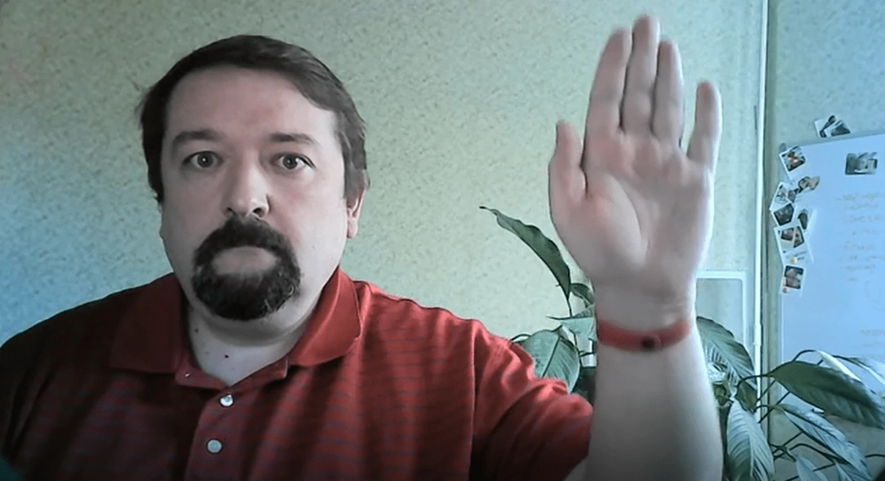

# ការធ្វើឲ្យត្រូវចលនា ដោយប្រើ Optical Flow

ការប្រឡងមេរៀនពី [មេរៀន AI សម្រាប់អ្នកចាប់ផ្តើម](https://aka.ms/ai-beginners).

## ភារកិច្ច

ពិចារណា [វីដេអូនេះ](../../../../../../lessons/4-ComputerVision/06-IntroCV/lab/palm-movement.mp4) ដែលនៅក្នុងវីដេអូនោះ ដៃគេចល័តទៅឆ្វេង/ស្តាំ/លើ/ក្រោម លើផ្ទៃខាងក្រោយដែលមានស្ថេរភាព។

**គោលបំណងរបស់អ្នក** គឺអាចប្រើ Optical Flow ដើម្បីកំណត់ ថាតើផ្នែកណានៃវីដេអូមានចលនាឡើង/ចុះ/ឆ្វេង/ស្តាំ។

**គោលបំណងបន្ថែម** គឺតាមដានចលនាដៃ ហេតុតាមពណ៌ស្បែក ដូចដែលបានរៀបរាប់ [នៅក្នុងប្លកនេះ](https://dev.to/amarlearning/finger-detection-and-tracking-using-opencv-and-python-586m) ឬ [នៅទីនេះ](http://www.benmeline.com/finger-tracking-with-opencv-and-python/)។

## សៀវភៅកំណត់ត្រាចាប់ផ្តើម

ចាប់ផ្តើមមេរៀនដោយបើក [MovementDetection.ipynb](MovementDetection.ipynb)

## អ្វីដែលទទួលបាន

ពេលខ្លះ ការងារដែលស្មុគស្មាញដូចការស្វែងរកចលនាឬកំណត់ដងម្រាមដៃអាចដោះស្រាយបានតាមរយៈការមើលឃើញកុំព្យូធ័រតែប៉ុណ្ណោះ។ ដូចនេះ វាមានប្រយោជន៍ខ្លាំងក្នុងការដឹងថា បណ្ណាល័យដូចជា OpenCV អាចធ្វើអ្វីបានខ្លះ។

---

<!-- CO-OP TRANSLATOR DISCLAIMER START -->
**ការបម្លែងបំភ្លឺ**:  
ឯកសារនេះត្រូវបានបម្លែងដោយប្រើសេវាកម្មបកប្រែ AI [Co-op Translator](https://github.com/Azure/co-op-translator)។ បើទោះបីយើងខិតខំរក្សាលំនាំត្រឹមត្រូវ ក៏សូមយល់ពីភាពអាចមានកំហុស ឬមិនត្រឹមត្រូវក្នុងបកប្រែដោយស្វ័យប្រវត្តិ។ ឯកសារដើមនៅក្នុងភាសាមូលដ្ឋាន គួรถูกគេចាត់ទុកជាប្រភពប្រកបដោយអធិបតេយ្យ។ សម្រាប់ព័ត៌មានសំខាន់ៗ ការបកប្រែមនុស្សជំនាញគឺត្រូវបានផ្តល់អនុសាសន៍។ យើងមិនមានលទ្ធជាប់ខ្សែច្បាប់ចំពោះការយល់ច្រឡំហ ឬការបំភ្លឺខុសដែលកើតមានពីការប្រើបកប្រែនេះឡើយ។
<!-- CO-OP TRANSLATOR DISCLAIMER END -->