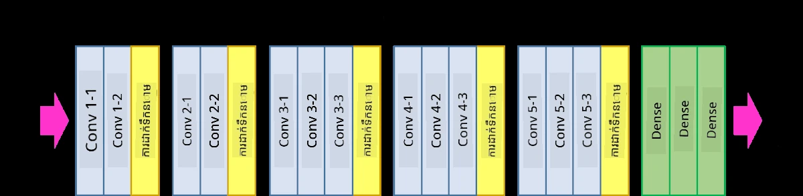
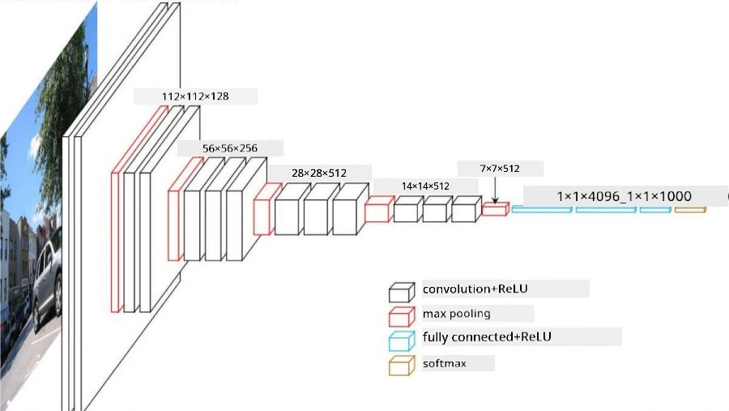
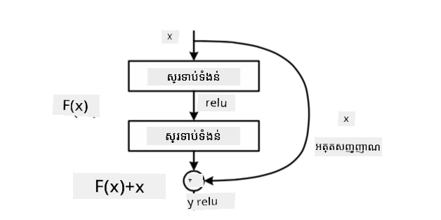
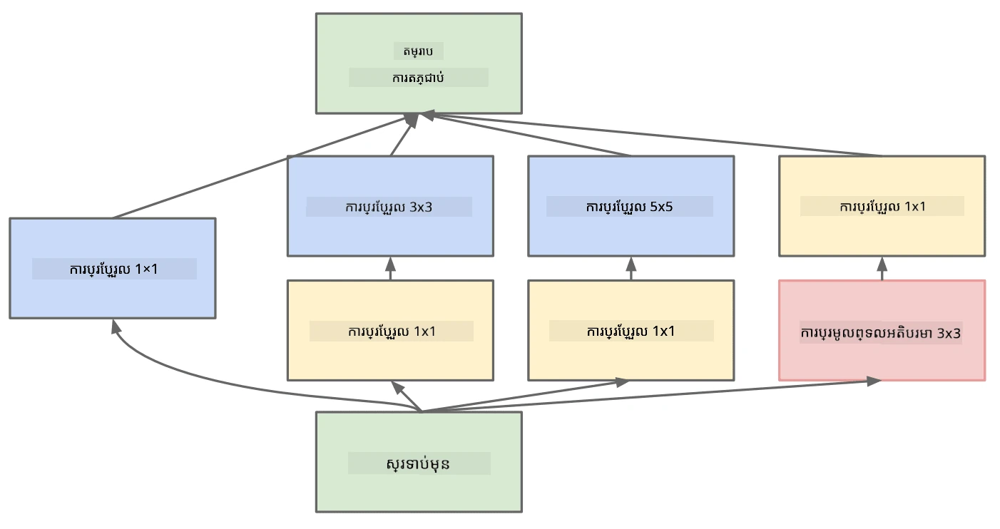

# វិ្ថិសាស្ត្រដែលល្បីល្បាញ CNN

### VGG-16

VGG-16 គឺជា បណ្ដាញមួយ ដែលបានទទួលបានភាពត្រឹមត្រូវ ៩២.៧% ក្នុងការបែងចែក ImageNet top-5 classification ក្នុងឆ្នាំ ២០១៤។ វាមានរចនាសម្ព័ន្ធស្រទាប់ដូចខាងក្រោម៖

ដូចដែលអ្នកអាចមើលឃើញ VGG សំរាប់បែបផែនរង្វាស់ពហុជ្រុងធម្មតា ដែលជាលំដាប់នៃស្រទាប់កុងវូលូសិន-បូលីង។

> រូបភាពពី [Researchgate](https://www.researchgate.net/figure/Vgg16-model-structure-To-get-the-VGG-NIN-model-we-replace-the-2-nd-4-th-6-th-7-th_fig2_335194493)

### ResNet

ResNet គឺជាគ្រួសារម៉ូដែលដែលបានណែនាំដោយ Microsoft Research ក្នុងឆ្នាំ ២០១៥។ គំនិតសំខាន់នៃ ResNet គឺការប្រើប្រាស់ **ប្លុកអចិន្រ្តៃយ៍ (residual blocks)**៖

> រូបភាពពី [កឋិននេះ](https://arxiv.org/pdf/1512.03385.pdf)

ហេតុផលក្នុងការប្រើ identity pass-through គឺដើម្បីឲ្យស្រទាប់របស់យើងអាចទាយទ្រង់ប្រាក់ **ភាពខុសគ្នា** រវាងលទ្ធផលនៃស្រទាប់មុន និងលទ្ធផលនៃប្លុកអចិន្រ្តៃយ៍ – ដូច្នេះហៅថា *residual*។ ប្លុកទាំងនេះងាយស្រួលបណ្តុះបណ្តាល, ហើយអាចសាងសង់បណ្តាញមានប្លុកចំនួនរយរាប់បាន (វែរីយ៉ង់ដែលពេញនិយមជាងគេគឺ ResNet-52, ResNet-101 និង ResNet-152)។

អ្នកក៏អាចគិតបណ្ដាញនេះថាជាអាចកែសម្រួលភាពស្មុគស្មាញរបស់វា​តាមទិន្នន័យដូចជា។ នៅដើមពេលដែលអ្នកចាប់ផ្ដើមបណ្តុះបណ្តាលបណ្ដាញនេះ តម្លៃទម្ងន់តូច ហើយសញ្ញាពិសេសភាគច្រើនទៅតាមស្រទាប់អត្តសញ្ញាណផុតកាត់តែម្តង។ ពេលបណ្តុះបណ្តាលបន្តទៅ ប្រការ អាទិភាពនៃប៉ារ៉ាម៉ែត្របណ្ដាញកើនឡើង ហើយបណ្ដាញកែសម្រួលតាមតម្រូវការថាមពលបង្ហាញត្រឹមត្រូវដើម្បីចាត់ថ្នាក់រូបភាពបណ្តុះបណ្តាលត្រឹមត្រូវ។

### Google Inception

រចនាសម្ព័ន្ធ Google Inception បន្តដំណើរការរបស់គំនិតនេះមួយជំហានទៀត ហើយសាងសង់ស្រទាប់បណ្ដាញមួយជា ការប្រមួលផ្លូវផ្សេងៗគ្នាច្រើន៖

> រូបភាពពី [Researchgate](https://www.researchgate.net/figure/Inception-module-with-dimension-reductions-left-and-schema-for-Inception-ResNet-v1_fig2_355547454)

នៅទីនេះ យើងត្រូវតែរំលេចតួនាទីនៃ 1x1 convolutions ព្រោះដំបូងវាមិនមានអត្ថន័យទេ។ ហេតុអ្វីយើងត្រូវដំណើរការតាមរូបភាពជាមួយតម្រៀប 1x1? ទោះយ៉ាងណា អ្នកត្រូវចងចាំថា ឆានែលកុងវូលូសិនក៏ដំណើរការជាមួយឆានែលជម្រៅច្រើនផងដែរ (ដើម - ពណ៌ RGB, ក្នុងស្រទាប់បន្ទាប់មក - ឆានែលនៃតម្រៀបផ្សេងៗ), ហើយ 1x1 convolution ត្រូវបានប្រើដើម្បីច្របាច់ឆានែលបញ្ចូលទាំងនេះជាមួយទម្ងន់បណ្តុះបណ្តាល ផ្សេងៗគ្នា។ វាក៏អាចមើលឃើញថាជាការបន្ថយទំហំ (pooling) នៅលើវិមាត្រឆានែល។

នេះគឺជា [បទប្លុកល្អមួយ](https://medium.com/analytics-vidhya/talented-mr-1x1-comprehensive-look-at-1x1-convolution-in-deep-learning-f6b355825578) លើប្រធានបទនេះ និង [សារព័ត៌មានដើម](https://arxiv.org/pdf/1312.4400.pdf)។

### MobileNet

MobileNet គឺជាគ្រួសារម៉ូដែលដែលមានទំហំតូច ជម្រើសសមរម្យសម្រាប់ឧបករណ៍ចល័ត។ ប្រើវានៅពេលអ្នកមានធនធានកំណត់ ហើយអាចបង់បង់ភាពត្រឹមត្រូវបានបន្តិច។ គំនិតសំខាន់ពីក្រោយវាគឺ៖ **depthwise separable convolution** ដែលអនុញ្ញាតឲ្យតំណាងគ្រប់តម្រៀបកុងវូលូសិនដោយកោតគ្នារវាងកុងវូលូសិនលំហឈរ និង 1x1 convolution លើឆានែលជម្រៅ។ វាធ្វើអោយចំនួនប៉ារ៉ាម៉ែត្រក្នុងបណ្ដាញបានបន្ថយយ៉ាងខ្លាំង ធ្វើអោយបណ្តាញតូច ប្រាប្រសើរបណ្តុះបណ្តាលដោយដាតាបានងាយស្រួលជាងកាលពីមុន។

នេះគឺជា [បទប្លុកល្អមួយលើ MobileNet](https://medium.com/analytics-vidhya/image-classification-with-mobilenet-cc6fbb2cd470)។

## សេចក្តីសន្និដ្ឋាន

នៅក្នុងអយកល័យនេះ អ្នកបានរៀនពីគំនិតសំខាន់ជារបស់បណ្តាញខ្សែប្រវាត់ខួរក្បាលសម្រាប់ការមើលឃើញកុំព្យូទ័រ - បណ្ដាញកុងវូលូសិន។ វិាំងងការរាល់ជីវិតដែលជាគ្រឿងផ្សំសំខាន់នៃការបែងចែករូបភាព ការបង្ការរូបធាតុ និងបណ្តាញបង្កើតរូបភាព ពេញលេញគឺបង្កើតលើមូលដ្ឋាន CNN គឺតែមានបន្ថែមស្រទាប់ និងបច្ចុប្បន្នភាពបណ្តុះបណ្តាលបន្ថែម។

## 🚀 ជំនួញបញ្ហា

នៅក្នុងសៀវភៅកំណត់ចំណាំដាក់ជាមួយ មានកំណត់សំគាល់នៅខាងក្រោមអំពីវិធីទទួលបានភាពត្រឹមត្រូវខ្ពស់ជាងនេះ។ សូមធ្វើការប្រមាញ់ខ្លះៗដើម្បីមើលថាអ្នកអាចទទួលបានភាពត្រឹមត្រូវល្អជាងនេះបានទេ។

## [សំណួរប្រលងបន្ទាប់ម៉ាស្សាសិក្សា](https://ff-quizzes.netlify.app/en/ai/quiz/14)

## ការពិចារណារួម និងការសិក្សាដោយខ្លួនឯង

ខណៈយោងក្នុងការប្រើប្រាស់ CNNs ជាញឹកញាប់សម្រាប់ភារកិច្ចមើលឃើញកុំព្យូទ័រ ពួកវាជាទូទៅល្អសម្រាប់ការដកស្រង់ប៉ាទនឡាញដែលមានទំហំថេរ។ ឧទាហរណ៍ បើយើង ដំណើរការជាមួយសម្លេង យើងក៏អាចចង់ប្រើ CNN ដើម្បីស្វែងរកប៉ាទនឡាញជាក់លាក់នៅក្នុងសញ្ញាសម្លេង - ក្នុងករណីនេះ តម្រៀបនៃតម្រៀបគឺមានទំហំ ១ ( និង CNN នេះហៅថា 1D-CNN)។ ព្រមទាំងមានពេលខ្លះ 3D-CNN គឺប្រើសម្រាប់ដកស្រង់លក្ខណះនៅក្នុងលំហមួយច្រើនវិមាត្រ ដូចជាសកម្មភាពជាក់លាក់ដែលកើតឡើងនៅលើវីដេអូ - CNN អាចចាប់យកប៉ាទននៃលក្ខណស្សំខាន់ដែលប្រែប្រួលតាមពេលវេលា។ សូមធ្វើការពិនិត្យមើល និងសិក្សាដោយខ្លួនឯងអំពីភារកិច្ចផ្សេងទៀតដែលអាចធ្វើបានជាមួយ CNNs។

## [កិច្ចការផ្ទះ](lab/README.md)

នៅក្នុងមណ្ឌលខាងលើ អ្នកត្រូវបានចាត់ការរក្សា ប្រភេទឆ្កែ និងឆ្មាក្នុងរូបភាព។ រូបភាពទាំងនេះជាស្មុគស្មាញជាងសំណុំទិន្នន័យ MNIST និងមានវិមាត្រខ្ពស់ជាង មានច្រើនជាង ១០ ភេទ។

---

<!-- CO-OP TRANSLATOR DISCLAIMER START -->
**ការបដិសេធ**៖  
ឯកសារនេះត្រូវបានបម្លែងភាសារដោយប្រើសេវាកម្មបកប្រែ AI [Co-op Translator](https://github.com/Azure/co-op-translator)។ ខណៈដែលយើងខិតខំរកភាពត្រឹមត្រូវ សូមចាប់អារម្មណ៍ថាការបកប្រែដោយស្វ័យប្រវត្តិអាចមានកំហុសឬភាពមិនត្រឹមត្រូវ។ ឯកសារដើមក្នុងភាសាមូលដ្ឋានគួរត្រូវបានគេចាត់ទុកជាឈុតដែនធ្វើការយោងដ៏មានសុពលភាព។ សម្រាប់ព័ត៌មានសំខាន់ៗ សូមផ្ដល់អាទិភាពប្រើការបកប្រែដោយមនុស្សវិជ្ជាជីវៈ។ យើងមិនទទួលខុសត្រូវចំពោះការយល់ច្រឡំ ឬការបកប្រែចរចារផ្សេងៗដែលកើតមានពីការប្រើប្រាស់ការបកប្រែនេះទេ។
<!-- CO-OP TRANSLATOR DISCLAIMER END -->