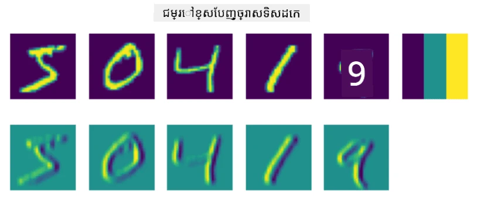
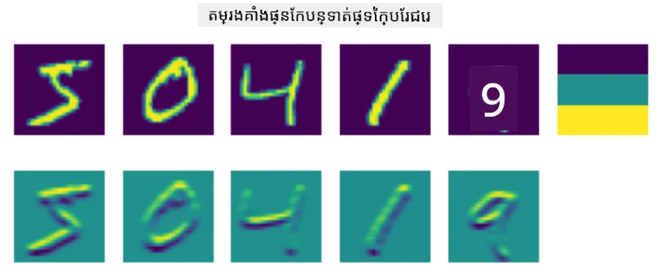
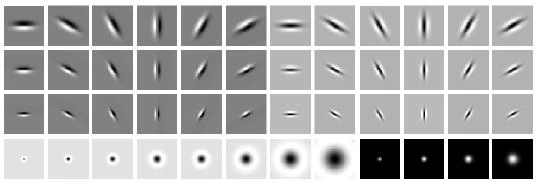
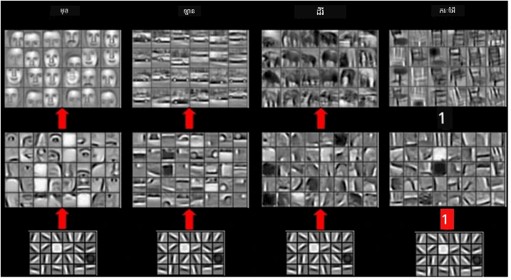

# បណ្តាញប្រសាទប្រើកំណត់ (Convolutional Neural Networks)

យើងបានឃើញមុននេះថាបណ្តាញប្រសាទគឺល្អក្នុងការដោះស្រាយរូបភាព ហើយបណ្តាញ Perceptron ទ្រង់ទ្រាយមួយស្រទាប់ក៏អាចស្គាល់លេខដុតដោយដៃពីឯកសារទិន្នន័យ MNIST ដោយភាពត្រឹមត្រូវដែលគួរឱ្យព្រាងព្រោះ។ ទោះយ៉ាងណា ឯកសារទិន្នន័យ MNIST គឺពិសេសណាស់ ហើយលេខទាំងអស់ត្រូវបានដាក់នៅកណ្តាលក្នុងរូបភាព ដែលធ្វើឱ្យការងារជាងសាមញ្ញ។

## [សំណួរជំនួញមុនបង្រៀន](https://ff-quizzes.netlify.app/en/ai/quiz/13)

នៅជីវិតពិត យើងចង់អាចស្គាល់វត្ថុក្នុងរូបភាពដោយមិនគិតពីទីតាំងត្រឹមត្រូវរបស់វាក្នុងរូបភាពនោះទេ។ ការមើលឃើញតាមកុំព្យូទ័រត្រូវខុសពីការបែងចែកទូទៅ ពីព្រោះពេលយើងកំពុងស្វែងរកវត្ថុណាមួយក្នុងរូបភាព យើងត្រូវស្កេនរូបភាព ដើម្បីស្វែងរក **លំនាំ** ហើយការបង្កប់របស់វា។ ឧទាហរណ៍ ពេលស្វែងរកឆ្មា យើងអាចមើលអប្បបរមាលេខបន្ទាត់ដេក ដែលអាចបង្កើតចង្កេះឆ្មា ហើយបន្ទាប់មកការបង្កប់កាចង្កេះណាមួយអាចប្រាប់ថាវាជារូបភាពឆ្មា។ ទីតាំងសាមញ្ញ និងការមានវត្ថុជាលំនាំមានសារៈសំខាន់ មិនមែនទីតាំងត្រឹមត្រូវនៃវា ក្នុងរូបភាពនោះទេ។

ដើម្បីដកយកលំនាំ យើងនឹងប្រើគំនិតនៃ **តម្រងកំណត់**។ ដូចដែលអ្នកបានដឹងរួចរូបភាពត្រូវបានតំណាងដោយម៉ាទ្រីក 2D ឬតង់ស័រ 3D ជាមួយជម្រៅពណ៌។ ការដាក់តម្រងមានន័យថាយើងយកម៉ាទ្រីកគឺមូលដ្ឋានតម្រងតូចៗ ហើយសំរាប់ពិក្សែលក្នុងរូបភាពដើម យើងគណនាមធ្យមភាគទល់នឹងវាជាមួយចំណុចជិតខាង។ យើងអាចមើលវា ដូចជាពីបង្អួចតូចឆ្លងតាមរូបភាពទាំងមូល ហើយបំបែកឲ្យស្តើងនូវពិក្សែលទាំងអស់តាមអន្ធរគ្រាប់ចំណុចក្នុងម៉ាទ្រីកតម្រង។

 | 
----|----

> រូបភាពដោយ Dmitry Soshnikov

ឧទាហរណ៍ ប្រសិនបើយើងដាក់តម្រងគែម 3x3 គែមដេក និងគែមបញ្ឈរចូលក្នុងលេខ MNIST យើងអាចទទួលបានចំណុចសំរាប់រង្វាស់តម្លៃខ្ពស់នៅកន្លែងមានគែមដេក និងគែមបញ្ឈរនៅក្នុងរូបភាពដើម។ ដូច្នេះតម្រងទាំងពីរនេះអាចប្រើសម្រាប់ "ស្វែងរក" គែម។ ដូចគ្នាណាស់ យើងអាចបង្កើតតម្រងផ្សេងៗ ដើម្បីស្វែងរកលំនាំទាបផ្សេងទៀត៖

> រូបភាពគម្រោង [ធនាគារតម្រង Leung-Malik](https://www.robots.ox.ac.uk/~vgg/research/texclass/filters.html)

ទោះ​យ៉ាង​ណា ចំពោះ​ការរចនា​តម្រង​ដើម្បី​ដក​យក​លំនាំ​ដោយ​ដៃ យើង​អាច​រចនា​បណ្តាញ​​ជា​របៀបដែល​វា​ស្វែង​រក​លំនាំ​ផ្ទាល់ខ្លួន។ នេះ​ជា​មូលដ្ឋាន​សំខាន់​មួយ​នៅក្រោយ CNN។

## គំនិតសំខាន់ៗ​នៅពីក្រោយ CNN

របៀបការងាររបស់ CNN អាស្រ័យលើគំនិតសំខាន់ៗដូចខាងក្រោម៖

* តម្រងកំណត់អាចដកយកលំនាំ
* យើងអាចរចនាបណ្តាញដែលតម្រងត្រូវបណ្ដុះបណ្ដាលដោយស្វ័យប្រវត្តិ
* យើងអាចប្រើវិធីសាស្រ្តដូចគ្នានេះសម្រាប់រកលំនាំនៅលើមុខងារថ្នាក់ខ្ពស់ មិនត្រឹមតែផ្នែករូបភាពដើមទេ។ ដូច្នេះការដកលក្ខណៈ CNN អនុវត្តលើជួរមុខងារ ចាប់ពីលំនាំពិក្សែលកម្រិតទាប ដល់ការបង្កប់ផ្នែករូបភាពកម្រិតខ្ពស់។

> រូបភាពពី [អត្ថបទ Hislop-Lynch](https://www.semanticscholar.org/paper/Computer-vision-based-pedestrian-trajectory-Hislop-Lynch/26e6f74853fc9bbb7487b06dc2cf095d36c9021d), មូលដ្ឋានលើ [ការស្រាវជ្រាវរបស់ពួកគេ](https://dl.acm.org/doi/abs/10.1145/1553374.1553453)

## ✍️ ផ្នែកហាត់ប្រាណ៖ បណ្តាញប្រសាទប្រើកំណត់

សូមបន្តស្វែងយល់ពីរបៀបកំណត់បណ្តាញប្រសាទប្រើកំណត់ និងរបៀបយើងអាចសម្រេចបានតម្រងដែលអាចបណ្ដុះបណ្ដាល ដោយធ្វើតាមកំណត់តាបណ្ដាញខាងក្រោមនេះ៖

* [បណ្តាញប្រសាទប្រើកំណត់ - PyTorch](ConvNetsPyTorch.ipynb)
* [បណ្តាញប្រសាទប្រើកំណត់ - TensorFlow](ConvNetsTF.ipynb)

## រចនាសម្ព័ន្ធមឿនរ៉ាយ (Pyramid Architecture)

ភាគច្រើននៃ CNN ដែលប្រើសម្រាប់កែច្នៃរូបភាព អនុវត្តរចនាសម្ព័ន្ធមឿនរ៉ាយ។ ស្រទាប់កំណត់ដំបូងដែលមានទៅលើរូបភាពដើមភាគច្រើនមានតម្រងតិច (8-16) ដែលសម្របសម្រួលការបង្កប់ពិក្សែលផ្សេងៗ ដូចជាជួរដេក/បញ្ឈរនៃខ្ទង់។ នៅជាន់បន្ទាប់ យើងកាត់បន្ថយវិមាត្រជាចំណុចចន្លោះ ហើយបន្ថែមចំនួនតម្រង ដែលបង្ហាញពីការបង្កប់លក្ខណៈសាមញ្ញភាគច្រើន។ ជាមួយនឹងស្រទាប់រាបរាបនៅក្នុងបណ្តាញនោះ ជាមួយនឹងបណ្តោយទៅជាម៉ាស៊ីនចំណាត់ថ្នាក់ចុងក្រោយ, វិមាត្រឆ្លើយតបរបស់រូបភាពក្រលឹក ត្រឹមត្រូវលឿនឡើង ហើយចំនួនតម្រងក៏បន្ថែមឡើង។

ជាឧទាហរណ៍ មកមើលរចនាសម្ព័ន្ធ VGG-16 ដែលបានទទួលបានភាពត្រឹមត្រូវ 92.7% ក្នុងពិន្ទុ Top-5 នៃការបែងចែក in ImageNet ឆ្នាំ 2014៖

> រូបភាពពី [Researchgate](https://www.researchgate.net/figure/Vgg16-model-structure-To-get-the-VGG-NIN-model-we-replace-the-2-nd-4-th-6-th-7-th_fig2_335194493)

## រចនាសម្ព័ន្ធ CNN ដែលមានឈ្មោះល្បី

[បន្តសិក្សាអំពីរចនាសម្ព័ន្ធ CNN ដ៏ល្បី](CNN_Architectures.md)

---

<!-- CO-OP TRANSLATOR DISCLAIMER START -->
**ការបោះបង់ពីការទទួលខុសត្រូវ**៖  
ឯកសារនេះត្រូវបានបកប្រែដោយប្រើសេវាកម្មបកប្រែ AI [Co-op Translator](https://github.com/Azure/co-op-translator)។ ខណៈពេលដែលយើងខិតខំបំពានសុពលភាព សូមជ្រាបថាការបកប្រែដោយស្វ័យប្រវត្តិអាចមានកំហុស ឬភាពមិនត្រឹមត្រូវ។ ឯកសារដើមក្នុងភាសាដើមគួรถูกចាត់ទុកថាជាភស្តុតាងសម្របសម្រួល។ សម្រាប់ព័ត៌មានសំខាន់ៗ ការបកប្រែដោយមនុស្សវិជ្ជាជីវៈគឺត្រូវបានផ្តល់អនុសាសន៍។ យើងមិនទទួលខុសត្រូវចំពោះការយល់ច្រឡំ ឬកិច្ចមិនយល់គ្នាណាមួយដែលកើតឡើងពីការប្រើប្រាស់ការបកប្រែនេះឡើយ។
<!-- CO-OP TRANSLATOR DISCLAIMER END -->