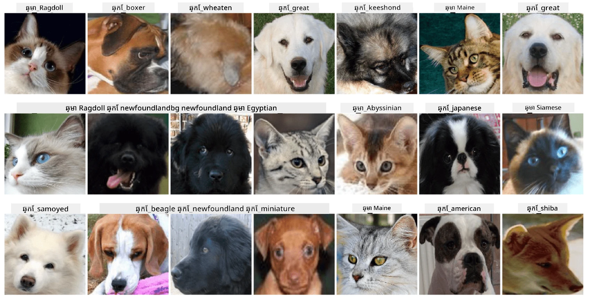

# ការធ្វើចំណាត់ថ្នាក់មុខសត្វចិញ្ចឹម

ការប្រលងមន្ទីរពី [កថិរូប AI សម្រាប់អ្នកដំបូង](https://github.com/microsoft/ai-for-beginners)។

## ភារកិច្ច

សូមសន្និដ្ឋានថា អ្នកត្រូវបង្កើតកម្មវិធីសម្រាប់ដ Nursery សត្វចិញ្ចឹម ដើម្បីធ្វើកំណត់ត្រាសត្វទាំងអស់។ មួយក្នុងនូវលក្ខណះល្អនៃកម្មវិធីដូចនេះគឺ អាចរកប្រភេទសត្វដោយស្វ័យប្រវត្តិពីរូបថត។ នេះអាចធ្វើបានដោយជោគជ័យដោយប្រើបណ្តាញប្រព័ន្ធប្រតិទិនសរសៃប្រសាទ។

អ្នកត្រូវបណ្តុះបណ្តាលបណ្តាញប្រព័ន្ធប្រតិទិនសរសៃប្រសាទប្រភេទកុងវុលូសិន ដើម្បីចំណាត់ថ្នាក់ប្រភេទខុសៗគ្នានៃឆ្មា និងឆ្កែ ដោយប្រើ **កំណត់ត្រាមុខសត្វ**។

## កំណត់ត្រា

យើងនឹងប្រើ [កំណត់ត្រាសត្វ Oxford-IIIT](https://www.robots.ox.ac.uk/~vgg/data/pets/), ដែលមានរូបភាពនៃសត្វឆ្កែ និងឆ្មា ៣៧ ប្រភេទខុសៗគ្នា។



ដើម្បីទាញយកកំណត់ត្រា និយាយប្រើកូដខាងក្រោម៖

```python
!wget https://thor.robots.ox.ac.uk/~vgg/data/pets/images.tar.gz
!tar xfz images.tar.gz
!rm images.tar.gz
```

**ព័ត៌មាន៖** រូបភាពក្នុងកំណត់ត្រាសត្វ Oxford-IIIT ត្រូវបានរៀបចំតាមឈ្មោះឯកសារ (ដូចជា `Abyssinian_1.jpg`, `Bengal_2.jpg`)។ សៀវភៅសម្ថិទញនេះរួមបញ្ចូលកូដដើម្បីរៀបចំរូបភាពទាំងនេះទៅក្នុងថតរងតាមប្រភេទសត្វ សម្រាប់ការចំណាត់ថ្នាក់កាន់តែងាយស្រួល។

## សៀវភៅសម្ថិទញចាប់ផ្តើម

ចាប់ផ្តើមមន្ទីរពីការបើក [PetFaces.ipynb](PetFaces.ipynb)

## អត្ថប្រយោជន៍ទទួលបាន

អ្នកបានដោះស្រាយបញ្ហាចំណាត់ថ្នាក់រូបភាពដែលស្មុគស្មាញមួយពីគន្លងចាប់ផ្តើម! មានបណ្តាប្រភេទជាច្រើន ហើយអ្នកមិនថែមទាំងទទួលបានភាពត្រឹមត្រូវដែលសមរម្យទេ! វានៅតែមានន័យក្នុងការវាស់វែងភាពត្រឹមត្រូវ top-k ពីព្រោះងាយក្នុងការច្រឡំប្រភេទខ្លះៗដែលមិនខុសរវាងគ្នាក្បាលតែសំណាក់មនុស្សផងដែរ។

---

<!-- CO-OP TRANSLATOR DISCLAIMER START -->
**ការបដិសេធ**៖  
ឯកសារនេះត្រូវបានបកប្រែដោយប្រើសេវាកម្មបកប្រែ AI [Co-op Translator](https://github.com/Azure/co-op-translator)។ ខណៈពេលដែលយើងខិតខំប្រឹងប្រែងក្នុងការធ្វើឲ្យបានត្រឹមត្រូវ សូមចំណាំថាការបកប្រែដោយស្វ័យប្រវត្តអាចមានកំហុស ឬភាពមិនត្រឹមត្រូវ។ ឯកសារដើមក្នុងភាសាទូទៅគួរត្រូវបានគិតថាជាតំណוקចោលជាផ្លូវការជាមូលដ្ឋាន។ សម្រាប់ព័ត៌មានសំខាន់ៗ សូមប្រើការបកប្រែមនុស្សជំនាញវិជ្ជាជីវៈ។ យើងមិនទទួលខុសត្រូវចំពោះការយល់ច្រឡំ ឬការបកប្រែខុសផ្សេងៗ ដោយសារការប្រើប្រាស់ការបកប្រែនេះឡើយ។
<!-- CO-OP TRANSLATOR DISCLAIMER END -->