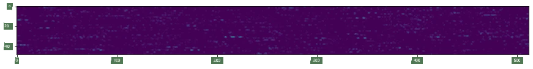
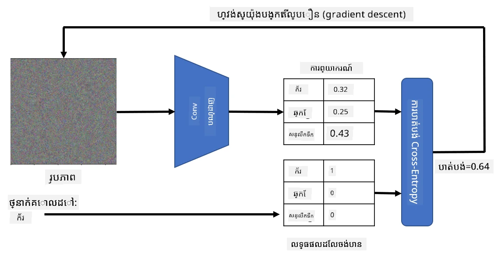
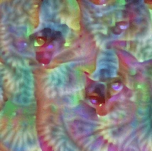
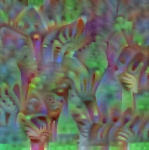
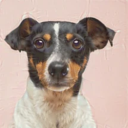

# បណ្តាញដែលបានបណ្តុះបណ្តាលជាមុន និងការរៀនផ្ទេរ

ការបណ្តុះបណ្តាល CNNs អាចចំណាយពេលយូរជាច្រើន ហើយតម្រូវឱ្យមានទិន្នន័យច្រើនសម្រាប់ភារកិច្ចនោះ។ ទោះជាយ៉ាងណា ភាគច្រើននៃពេលវេលាត្រូវបានចំណាយក្នុងការរៀនរើសចម្រាញ់ត្រង់តិចទាបដែលបណ្តាញអាចប្រើសម្រាប់ទាញយកលំនាំពីរូបភាព។ សំណួរធម្មជាតិមួយកើតឡើង - តើយើងអាចប្រើបណ្តាញប្រព័ន្ធប្រសាទដែលបានបណ្តុះបណ្តាលលើទិន្នន័យមួយ និងប្តូរវាឱ្យសមរម្យក្នុងការបែងចែករូបភាពខុសគ្នារហើយដោយមិនចាំបាច់បណ្តុះបណ្តាលពេញលេញម្ដងទៀត?

## [សំណួរសាកល្បងមុនមេរៀន](https://ff-quizzes.netlify.app/en/ai/quiz/15)

វិធីសាស្រ្តនេះហៅថា **ការរៀនផ្ទេរ**, ព្រោះយើងផ្ទេរចំណេះដឹងពីម៉ូដែលបណ្តាញប្រព័ន្ធប្រសាទមួយទៅម៉ូដែលផ្សេងទៀត។ ក្នុងការរៀនផ្ទេរ យើងជាទូទៅចាប់ផ្ដើមជាមួយម៉ូដែលដែលបានបណ្តុះបណ្តាលជាមុនដែលបានត្រៀមលើឃ្លាំងរូបភាពធំមួយ ដូចជា **ImageNet**។ ម៉ូដែលទាំងនោះអាចធ្វើការបែងចែកលក្ខណៈផ្សេងៗពីរូបភាពទូទៅបានយ៉ាងល្អ ហើយនៅក្នុងករណីជាច្រើនគ្រាន់តែបង្កើតកម្មវិធីបែងចែកលើលក្ខណៈដែលទាញយកបានទើបអាចទទួលបានលទ្ធផលល្អ។

> ✅ ការរៀនផ្ទេរជាពាក្យដែលអ្នកប្រទះឃើញនៅក្នុងវិស័យសិក្សាផ្សេងទៀត ដូចជាការអប់រំ។ វាសំដៅលើដំណើរការនាំយកចំណេះដឹងពីដែនណាមួយ ហើយអនុវត្តទៅដែនផ្សេងទៀត។

## ម៉ូដែលដែលបានបណ្តុះបណ្តាលជាមុនជាឧបករណ៍ទាញយកលក្ខណៈ

បណ្តាញកុងវុលូសិនដែលយើងបានពិភាក្សានៅផ្នែកមុនមានជាន់ជាច្រើន ដែលនិទស្សន៍ថាចង់ទាញយកលក្ខណៈពីរូបភាព ដំបូងពីការបញ្ចូលបិទភីក្សែលទាប (ដូចជារបារ(horizontal)/បន្ទាត់ត្រង់(vertical) ឬគំនូស) រហូតដល់កម្រិតខ្ពស់ជាងនៃលក្ខណៈដែលបញ្ចូលគ្នា ដូចជាតួអាំងភ្លើង។ ប្រសិនបើយើងបណ្តុះបណ្តាល CNN លើឃ្លាំងរូបភាពធំនិងចម្រុះគ្រប់គ្រាន់ បណ្តាញគួរតែនាំយកលក្ខណៈទូទៅទាំងនោះបាន។

ទាំង Keras និង PyTorch មានមុខងារដែលងាយស្រួលក្នុងការទាញយកបញ្ចប់ទំងន់នៃបណ្តាញប្រព័ន្ធប្រសាទដែលបានបណ្តុះបណ្តាលជាមុនសម្រាប់រចនាសម្ព័ន្ធទូទៅមួយចំនួន ដែលភាគច្រើនត្រូវបានបណ្តុះលើរូបភាព ImageNet។ ការប្រើប្រាស់ធម្មតាជាញឹកញាប់ត្រូវបានពិពណ៌នានៅលើទំព័រ [CNN Architectures](../07-ConvNets/CNN_Architectures.md) ពីមេរៀនមុន។ ជាក់លាក់ អ្នកប្រហែលជាចង់ពិចារណាការប្រើប្រាស់មួយក្នុងចំណោមដូចខាងក្រោម៖

* **VGG-16/VGG-19** គឺជាម៉ូដែលតូចៗ ដែលនៅតែផ្តល់ភាពត្រឹមត្រូវល្អ។ ជាច្រើនជំហានការប្រើ VGG ជាការសាកល្បងដំបូងជាជម្រើសល្អដើម្បីមើលថាការរៀនផ្ទេរដំណើរការយ៉ាងដូចម្តេច។
* **ResNet** គឺជាជតាំងម៉ូដែលដែលបានណែនាំដោយ Microsoft Research ក្នុងឆ្នាំ 2015។ វាមានជាន់ច្រើនជាង ហើយត្រូវការប្រាក់ចំណាយធនធានច្រើនជាង។
* **MobileNet** គឺជាជតាំងម៉ូដែលដែលមានទំហំតូចសមរម្យសម្រាប់ឧបករណ៍ចល័ត។ ប្រើពួកវាប្រសិនបើធនធានរបស់អ្នកមានកម្រិតតិច ហើយអាចបោះបង់ភាពត្រឹមត្រូវបន្តិច។

នេះជាលក្ខណៈគំរូដែលត្រូវបានទាញយកពីរូបភាពឆ្មា ដោយបណ្តាញ VGG-16៖

## ឃ្លាំងទិន្នន័យឆ្មានិងសត្វឆ្កែ

ក្នុងឧទាហរណ៍នេះ យើងនឹងប្រើឃ្លាំងទិន្នន័យ [ឆ្មា និងសត្វឆ្កែ](https://www.microsoft.com/download/details.aspx?id=54765&WT.mc_id=academic-77998-cacaste) ដែលស្ថិតនៅជិតស្ថានភាពបែងចែករូបភាពជារឿងពិត។

## ✍️ លំហាត់: ការរៀនផ្ទេរ

ចង់មើលការរៀនផ្ទេរដំណើរការជាក់ស្តែងក្នុងកំណត់ត្រាសរសេរដូចខាងក្រោម៖

* [ការរៀនផ្ទេរ - PyTorch](TransferLearningPyTorch.ipynb)
* [ការរៀនផ្ទេរ - TensorFlow](TransferLearningTF.ipynb)

## ការមើលឃើញឆ្មាសម្រួល

បណ្តាញប្រព័ន្ធប្រសាទដែលបានបណ្តុះបណ្តាលជាពិសេស មានលំនាំផ្សេងៗជាច្រើននៅក្នុង *ខួរក្បាល*, រួមបញ្ចូលទស្សនៈអំពី **ឆ្មាដែលល្អបំផុត** (រួមទាំងឆ្កែល្អបំផុត គោលនិយមសត្វដូងល្អបំផុត ហ وغيرها)។ វានឹងគួរឱ្យចាប់អារម្មណ៍ក្នុងការចង់ **បង្ហាញរូបភាពនេះ**។ ទោះជាយ៉ាងណា វាមិនសាមញ្ញឡើយ ព្រោះលំនាំត្រូវបានចែករំលែកនៅក្នុងទំងន់នៃបណ្តាញសុទ្ធៗ និងរៀបចំជាសំណុំបែបបទជាបណ្តាសម្ព័ន្ធ។

វិធីសាស្រ្តមួយដែលយើងអាចយកដំណើរការមកគឺចាប់ផ្ដើមជាមួយរូបភាពឯករាជ្យមួយ ហើយបន្ទាប់ពីនោះព្យាយាមប្រើបច្ចេកទេស **ផ្តោតអាំងតង់ស៊ីតេតំពួត(superior gradient descent)** ដើម្បីកែប្រែរូបភាពដូច្នេះ ដើម្បីឲ្យបណ្តាញចាប់ផ្តើមគិតថាវាជាឆ្មា។

ទោះជាយ៉ាងណា ប្រសិនបើយើងធ្វើបែបនេះ យើងនឹងទទួលបានអ្វីមួយស្រដៀងនឹងសម្លេងរំខានចៃដន្យ។ វាមកពី *មានវិធីជាច្រើនដែលធ្វើឲ្យបណ្តាញគិតថារូបភាពដែលបញ្ចូលជាឆ្មា* រួមទាំងមួយចំនួនដែលមិនមានអត្ថន័យផ្នែកមើលឃើញ។ នៅពេលរូបភាពទាំងនោះមានលំនាំជាច្រើនដែលធម្មតាសម្រាប់ឆ្មា ក៏គ្មានអ្វីដើម្បីដាក់កំណត់មិនឲ្យវាជាផ្សេងទៀតពីរូបភាពមើលឃើញ។

ដើម្បីធ្វើឲ្យលទ្ធផលប្រសើរជាងមុន អាចបន្ថែមពាក្យមួយទៀតនៅក្នុងអនុគមន៍ខាត ដែលហៅថា **variation loss**។ វាជាឧបមាធមណិតំណាស់បង្ហាញពីភាពស្រដៀងគ្នានៃភីក្សែលជិតៗរូបភាព។ ការបន្ថយvariation loss ធ្វើឲ្យរូបភាពរលោង និងកំចាត់សម្លេងរំខាន – ដូច្នេះបង្ហាញលំនាំដែលគួរឱ្យមើលឃើញ។ នេះជាឧទាហរណ៍រូបភាព "ល្អបំផុត" ដូចដែលត្រូវបានចាត់ថ្នាក់ជាឆ្មា និងជាសត្វដូងស្ត្រីជាមួយប្រហែលខ្ពស់៖

 | 
-----|-----
 *ឆ្មាល្អបំផុត* | *សត្វដូងស្ត្រីល្អបំផុត*

វិធីសាស្រ្តស្រដៀងនេះអាចប្រើសម្រាប់ការធ្វើការវាយប្រហារជាផ្លូវការ (known as **adversarial attacks**) លើបណ្តាញប្រព័ន្ធប្រសាទ។ សន្និដ្ឋានថាយើងចង់ល្បួងបណ្តាញប្រព័ន្ធប្រសាទ ហើយធ្វើឲ្យសត្វឆ្កែកាន់តែជាឆ្មា។ ប្រសិនបើយើងយករូបភាពសត្វឆ្កែ ដែលបណ្តាញកំណត់ថាជាសត្វឆ្កែ យើងអាចកែប្រែវាបន្តិចដោយប្រើផ្តោតអាំងតង់ស៊ីតេតំពួត រាល់ពេលរហូតបណ្តាញចាប់ផ្តើមចាត់ថ្នាក់វាជាឆ្មា៖

 | 
-----|-----
*រូបដើមនៃសត្វឆ្កែ* | *រូបសត្វឆ្កែដែលចាត់ថ្នាក់ជាឆ្មា*

មើលកូដដើម្បីបង្កើតលទ្ធផលខាងលើនៅក្នុងកំណត់ត្រាដូចខាងក្រោម៖

* [ឆ្មាល្អបំផុត និងឆ្មាវាយប្រហារ - TensorFlow](AdversarialCat_TF.ipynb)

## សេចក្ដីសន្និដ្ឋាន

ដោយប្រើការរៀនផ្ទេរ អ្នកអាចបង្កើតកម្មវិធីបែងចែកសម្រាប់ភារកិច្ចបែងចែកវត្ថុផ្ទាល់ខ្លួនបានយ៉ាងឆាប់រហ័ស និងទទួលផលបានភាពត្រឹមត្រូវខ្ពស់។ អ្នកអាចមើលឃើញថា ភារកិច្ចស្មុគស្មាញជាងមុនដែលយើងកំពុងដោះស្រាយ តម្រូវឲ្យមានថាមពលគណនា​ធំជាង ហើយមិនអាចដោះស្រាយបានយ៉ាងងាយស្រួលលើ CPU ទេ។ នៅឯកជនបន្ទាប់ យើងនឹងព្យាយាមប្រើកូដបង្កើតដែលមានទម្ងន់ស្រាលជាងដើម្បីបណ្តុះម៉ូដែលដដែលដោយប្រើធនធានគណនាខ្ពស់តិចជាង ដែលបង្កើតភាពត្រឹមត្រូវបន្តបន្តិចប៉ុណ្ណោះ។

## 🚀 챌린지

នៅក្នុងកំណត់ត្រាដែលភ្ជាប់មកមានកំណត់ចំណាំនៅផ្នែកក្រោមអំពីរបៀបដែលចំណេះដឹងផ្ទេរបានល្អជាមួយទិន្នន័យបណ្តុះប្រកបដោយស្រដៀងគ្នា (ប្រហែលជាប្រភេទសត្វថ្មីមួយ)។ សូមធ្វើការប្រតិបត្តិការជាមួយរូបភាពប្រភេទថ្មីៗមួយចំនួន ដើម្បីមើលថា តើម៉ូដែលចំណេះដឹងផ្ទេររបស់អ្នកអាចដំណើរការបានល្អឬអត់។

## [សំណួរសាកល្បងបន្ទាប់មេរៀន](https://ff-quizzes.netlify.app/en/ai/quiz/16)

## ការសិក្សាខ្លួនឯងនិងការពិនិត្យឡើងវិញ

អានតាម [TrainingTricks.md](TrainingTricks.md) ដើម្បីបន្ថែមចំណេះដឹងរបស់អ្នកអំពីវិធីផ្សេងទៀតក្នុងការបណ្តុះបណ្តាលម៉ូដែលរបស់អ្នក។

## [ភារកិច្ច](lab/README.md)

នៅក្នុងមន្ទីរបណ្ដុះបណ្ដាលនេះ យើងនឹងប្រើឃ្លាំងទិន្នន័យជាក់លាក់ក្នុងជីវិតប្រចាំថ្ងៃ [Oxford-IIIT](https://www.robots.ox.ac.uk/~vgg/data/pets/) ដែលមានប្ដូររាជ្យចំណាំលោកឆ្មានិងសត្វឆ្កែចំនួន ៣៥ ប្រភេទ ហើយយើងនឹងបង្កើតកម្មវិធីបែងចែកដោយការរៀនផ្ទេរ។

---

<!-- CO-OP TRANSLATOR DISCLAIMER START -->
**ការបដិសេធ**៖  
ឯកសារនេះត្រូវបានបកប្រែដោយប្រើសេវាកម្មបកប្រែ AI [Co-op Translator](https://github.com/Azure/co-op-translator)។ ខណៈដែលយើងខំប្រឹងប្រែងសម្រាប់ភាពត្រឹមត្រូវ សូមជ្រាបថាការបកប្រែដោយស្វ័យប្រវត្តិនោះអាចមានកំហុសឬមិនមានភាពត្រឹមត្រូវបាន។ ឯកសារដើមនៅភាសារដើមគួរត្រូវបានគេយកជាអត្ថប្រយោជន៍ដ៏មានអំណាច។ សម្រាប់ព័ត៌មានសំខាន់ៗ គួរតែប្រើការបកប្រែដោយអ្នកជំនាញមនុស្ស។ យើងមិនមានការទទួលខុសត្រូវចំពោះការយល់ច្រឡំ ឬការបកស្រាយខុសៗគ្នាដែលកើតឡើងពីការប្រើប្រាស់ការបកប្រែនេះទេ។
<!-- CO-OP TRANSLATOR DISCLAIMER END -->