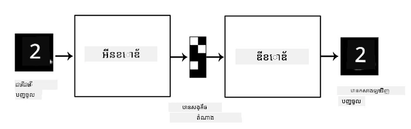
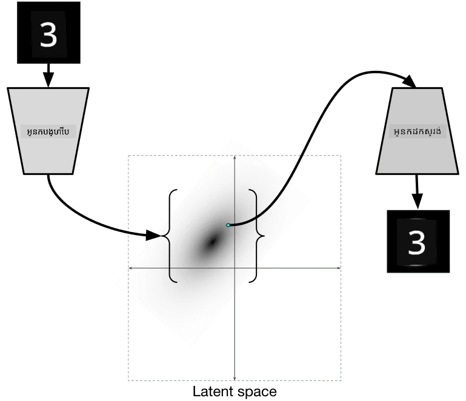
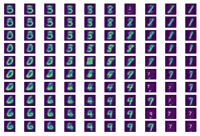
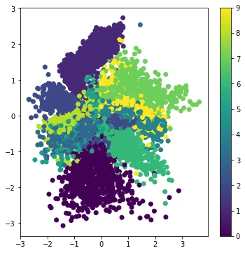

# Autoencoders

នៅពេលបណ្ដុះបណ្ដាល CNNs មួយក្នុងចំណោមបញ្ហាគឺថា យើងត្រូវការទិន្នន័យមានស្លាកច្រើន។ ក្នុងករណីចាត់ថ្នាក់រូបភាព យើងត្រូវបំបែករូបភាពទៅជាចំណាត់ថ្នាក់ផ្សេងៗ ដែលជាការខិតខំដាក់ទៅដៃ។

## [ប្រឡងមុនវគ្គបង្រៀន](https://ff-quizzes.netlify.app/en/ai/quiz/17)

ទោះយ៉ាងណា យើងអាចចង់ប្រើទិន្នន័យដើម (គ្មានស្លាក) សម្រាប់បណ្ដុះបណ្ដាលម៉ូដែល CNN ដល់ការដកស្រង់លក្ខណ: ដែលហៅថា **ការសិក្សាដោយខ្លួនឯង**។ ជំនួសស្លាក យើងនឹងប្រើរូបភាពបណ្ដុះបណ្ដាលទាំងជាការបញ្ចូលនិងចេញនៃបណ្តាញ។ គំនិតសំខាន់នៃ **autoencoder** គឺយើងនឹងមាន **បណ្តាញ encoder** ដែលបម្លែងរូបភាពបញ្ចូលទៅជាផ្លូវចំណុចកំណត់មួយ (latant space) (ធម្មតាជាវ៉ិកទ័រមានទំហំតូចជាង) បន្ទាប់មកជាបណ្តាញ **decoder** ដែលមានគោលបំណងបង្កើតឡើងវិញរូបភាពដើម។

> ✅ [autoencoder](https://wikipedia.org/wiki/Autoencoder) គឺជាប្រភេទបណ្តាញប្រព័ន្ធប្រសាទសិប្បនិម្មិត នាដែលប្រើដើម្បីសិក្សាកូដ៖ទិន្នន័យគ្មានស្លាកយ៉ាងមានប្រសិទ្ធភាព។

ដោយសារ​យើងបណ្ដុះបណ្ដាល autoencoder ដើម្បីចាប់យកព័ត៌មានពីរូបភាពដើមជា​ច្រើនមួយសម្រាប់ការបង្កើតឡើងវិញបានត្រឹមត្រូវបំផុត ដូច្នេះបណ្តាញព្យាយាមស្វែងរក **embedding** ល្អបំផុត សម្រាប់ចាប់យកន័យរបស់រូបភាព។

> រូបភាពពី [Keras blog](https://blog.keras.io/building-autoencoders-in-keras.html)

## សេណារីយ៉ូសម្រាប់ការប្រើ Autoencoders

ក្នុងពេលបង្កើតឡើងវិញរូបភាពដើមមើលទៅមិនមានប្រយោជន៍ដោយខ្លួនវាទេ មានសេណារីយ៉ូខ្លះៗដែល autoencoders មានប្រយោជន៍ខ្លាំង:

* **បន្ថយវិមាត្ររូបភាពសម្រាប់ការមើលមុខងារ** ឬ **បណ្តុះបណ្តាល embedding រូបភាព**។ ជាទូទៅ autoencoders ផ្តល់លទ្ធផលល្អជាង PCA ពីព្រោះវាគិតគ្រោងដល់លក្ខណៈលំហរប្រសាទ និងលក្ខណៈមានជាលំដាប់ជាន់។
* **ការដកសំឡេងរំខាន (Denoising)** គឺជាការដកសំឡេងរំខានចេញពីរូបភាព។ ពីព្រោះសំឡេងរំខានពេញនិយមផ្ទុកព័ត៌មានមិនទាន់ប្រយោជន៍ជាច្រើន autoencoder មិនអាចដាក់វាទាំងអស់នាពេលចំណុច latant តូចបានទេ ដូច្នេះវាចាប់យកតែផ្នែកសំខាន់ៗនៃរូបភាពតែប៉ុណ្ណោះ។ ពេលបណ្ដុះបណ្ដាល denoiser យើងចាប់ផ្ដើមពីរូបភាពដើម ហើយប្រើរូបភាពដែលបន្ថែមសំឡេងរំខានវិជ្ជមានជាការបញ្ចូលសម្រាប់ autoencoder។
* **Super-resolution** ការបង្កើនមាត្រូបភាព។ យើងចាប់ផ្ដើមពីរូបភាពមាន resolution ខ្ពស់ ហើយប្រើរូបភាពមាន resolution ទាបជាការបញ្ចូល។
* **ម៉ូដែលបង្កើតថ្មីបន្ទាន់ (Generative models)** កាលណាយើងបានបណ្ដុះបណ្ដាល autoencoder រួច បណ្តាញ decoder អាចប្រើសម្រាប់បង្កើតវត្ថុថ្មីពីវ៉ិកទ័រលាតង់បែបចៃដន្យ។

## Variational Autoencoders (VAE)

autoencoders ប្រពៃណីបន្ថយវិមាត្រទិន្នន័យបញ្ចូលមួយវិធីណាមួយ ដើម្បីស្វែងរកលក្ខណ:សំខាន់ៗនៃរូបភាពបញ្ចូល។ ប៉ុន្តែវ៉ិកទ័រលាតង់ភាគច្រើនមិនមានអត្ថន័យច្បាស់ទេ។ ក្នុងពាក្យផ្សេង ការយក dataset MNIST ជាគំរូ ការស្វែងរកឥណទានថាតើលេខណាដែលតំណាងឲ្យវ៉ិកទ័រលាតង់នេះគ្មានភាពងាយស្រួលទេ ពីព្រោះវ៉ិកទ័រលាតង់ជិតគ្នាមិនចាំបាច់តំណាងឲ្យលេខដូចគ្នា។ 

ផ្សេងពីនេះ ដើម្បីបណ្ដុះម៉ូដែល *បង្កើត* វាល្អជាងក្នុងការមានចំនេះដឹងពីលាតង់ស្ពេស។ គំនិតនេះនាំយើងទៅកាន់ **variational auto-encoder** (VAE)។

VAE គឺជា autoencoder ដែលរៀនព្យាករណ៍ *ចែកចាយស្ថិតិ* នៃប៉ារ៉ាម៉ែត្រលាតង់ ឬហៅថា **បម្រែបម្រួលលាតង់**។ ឧទាហរណ៍ យើងចង់ឲ្យវ៉ិកទ័រលាតង់ចែកចាយធម្មតាជាមួយមធ្យម zmean និងស្ដង់ដារបំបែក zsigma (ទាំងមធ្យម និងស្ដង់ដារបំបែកជាវ៉ិកទ័រមានវិមាត្រមួយ d)។ Encoder នៅក្នុង VAE រៀនព្យាករណ៍ប៉ារ៉ាម៉ែត្រទាំងនេះ ហើយ decoder ទទួលតម្លៃវ៉ិកទ័រចៃដន្យពីចែកចាយនេះដើម្បីបង្កើតឡើងវិញវត្ថុ។

សង្ខេប:

 * ពីវ៉ិកទ័របញ្ចូល យើងព្យាករណ៍ `z_mean` និង `z_log_sigma` (ជំនួសការព្យាករណ៍ស្ដង់ដារបំបែកដោយផ្ទាល់ យើងព្យាករណ៍លោករីធម៌វា)
 * យើងគំនូរវ៉ិកទ័រ `sample` មួយពីចែកចាយ N(zmean,exp(zlog_sigma))
 * decoder ព្យាយាមដកស្រង់រូបភាពដើមជាមួយ `sample` ជាវ៉ិកទ័របញ្ចូល

 

> រូបភាពពី [this blog post](https://ijdykeman.github.io/ml/2016/12/21/cvae.html) ដោយ Isaak Dykeman

Variational auto-encoders ប្រើមុខងារខាតខាតស្មុគស្មាញមានពីរផ្នែក៖

* **Reconstruction loss** ខាតខាតបង្ហាញពីភាពជិតស្និទ្ធរវាងរូបភាពដែលបានបង្កើតឡើងវិញនិងគោលដៅ (អាចជា Mean Squared Error ឬ MSE)។ វាគឺជាផ្នែកខាតដដែលនឹងក្នុង autoencoders ប្រពៃណី។
* **KL loss** ដែលធានាថាចែកចាយអថេរលាតង់នៅជិតចែកចាយធម្មតា។ វា dựa trên khái niệm [Kullback-Leibler divergence](https://www.countbayesie.com/blog/2017/5/9/kullback-leibler-divergence-explained) - មាត្រយក្សប៉ាន់ស្មានភាពដូចគ្នារវាងចែកចាយស្ថិតិពីរដែលខុសគ្នា។

អត្ថប្រយោជន៍សំខាន់នៃ VAEs គឺវាអនុញ្ញាតឲ្យយើងបង្កើតរូបភាពថ្មីៗបានរសាយថាគោល ដោយសារយើងដឹងថាចែកចាយណាដែលយើងគួរតែគំនូរវ៉ិកទ័រលាតង់ពីវា។ ឧទាហរណ៍ ប្រសិនបើយើងបណ្ដុះបណ្ដាល VAE ជាមួយវ៉ិកទ័រលាតង់ 2D លើ MNIST គេអាចប្ដូរប្រភេទសមាសធាតុរបស់វ៉ិកទ័រលាតង់ ដើម្បីទទួលបានលេខខុសៗគ្នា៖

> រូបភាពដោយ [Dmitry Soshnikov](http://soshnikov.com)

មើលពីរបៀបរូបភាពរួមបញ្ចូលគ្នា ខណៈពេលយើងចាប់ផ្ដើមទទួលបានវ៉ិកទ័រលាតង់ពីផ្នែកខុសៗគ្នានៃលាតង់ស្ពេស។ យើងក៏អាចមើលមុខងារនេះក្នុង 2D ផងដែរ៖

 

> រូបភាពដោយ [Dmitry Soshnikov](http://soshnikov.com)

## ✍️ លំហាត់៖ Autoencoders

ស្វែងយល់បន្ថែមអំពី autoencoders នៅក្នុង notebook ដូចតទៅ៖

* [Autoencoders នៅក្នុង TensorFlow](AutoencodersTF.ipynb)
* [Autoencoders នៅក្នុង PyTorch](AutoEncodersPyTorch.ipynb)

## លក្ខណៈសម្បត្តិរបស់ Autoencoders

* **ទិន្នន័យជាក់លាក់** - វាដំណើរការល្អតែជាមួយប្រភេទរូបភាពដែលវាបានបណ្ដុះបណ្ដាល។ ឧទាហរណ៍ ប្រសិនបើយើងបណ្ដុះបណ្ដាលបណ្តាញ super-resolution លើ ផ្កា វានឹងមិនល្អសម្រាប់ រូបភាពថតបុរសនារីទេ ព្រោះបណ្តាញអាចផលិតរូបភាពមាន resolution ខ្ពស់ដោយយកព័ត៌មានលម្អិតពីលក្ខណៈដែលបានរៀនពីទិន្នន័យបណ្ដុះបណ្ដាល។
* **បាត់បង់** - រូបភាពដែលបានបង្កើតឡើងវិញមិនដូចនឹងរូបភាពដើមទេ។ សេចក្តីធម្មជាតិនៃការបាត់បង់ត្រូវបានកំណត់ដោយ *មុខងារខាតខាត* ដែលបានប្រើក្នុងពេលបណ្ដុះបណ្ដាល។
* ដំណើរការជាមួយ **ទិន្នន័យគ្មានស្លាក**

## [ប្រឡងបន្ទាប់វគ្គបង្រៀន](https://ff-quizzes.netlify.app/en/ai/quiz/18)

## សេចក្តីសន្និដ្ឋាន

ក្នុងមេរៀននេះ អ្នកបានរៀនអំពីប្រភេទ autoencoders ដែលមានស្រាប់សម្រាប់វិទ្យាសាស្ត្រអោយ ។ អ្នកបានរៀនរបៀបបង្កើតវា និងរបៀបប្រើវា ដើម្បីបង្កើតឡើងវិញរូបភាព។ អ្នកក៏បានរៀនអំពី VAE និងរបៀបប្រើវា ដើម្បីបង្កើតរូបភាពថ្មី។

## 🚀 thách thức

ក្នុងមេរៀននេះ អ្នកបានរៀនអំពីការប្រើ autoencoders សម្រាប់រូបភាព។ តែក៏អាចប្រើសម្រាប់តន្ត្រីបានដែរ! សូមពិនិត្យមើលគម្រោង MusicVAE របស់ Magenta [MusicVAE](https://magenta.tensorflow.org/music-vae) ដែលប្រើ autoencoders ដើម្បីរៀនបង្កើតឡើងវិញតន្ត្រី។ សូមធ្វើ [ការប្រឡង](https://colab.research.google.com/github/magenta/magenta-demos/blob/master/colab-notebooks/Multitrack_MusicVAE.ipynb) ជាមួយបណ្ណាល័យនេះ ដើម្បីមើលថាអ្នកអាចបង្កើតអ្វីបានខ្លះ។

## [ប្រឡងបន្ទាប់វគ្គបង្រៀន](https://ff-quizzes.netlify.app/en/ai/quiz/16)

## ការពិនិត្យឡើងវិញ និង សិក្សាឯករាជ្យ

សម្រាប់យោង អានបន្ថែមអំពី autoencoders នៅក្នុងធនធានទាំងនេះ៖

* [Building Autoencoders in Keras](https://blog.keras.io/building-autoencoders-in-keras.html)
* [Blog post on NeuroHive](https://neurohive.io/ru/osnovy-data-science/variacionnyj-avtojenkoder-vae/)
* [Variational Autoencoders Explained](https://kvfrans.com/variational-autoencoders-explained/)
* [Conditional Variational Autoencoders](https://ijdykeman.github.io/ml/2016/12/21/cvae.html)

## ការចាត់តួនាទី

នៅចុង [notebook នេះប្រើ TensorFlow](AutoencodersTF.ipynb) អ្នកនឹងឃើញ 'task' - ប្រើវាជាការចាត់តួនាទីរបស់អ្នក។

---

<!-- CO-OP TRANSLATOR DISCLAIMER START -->
**ការបដិសេធ**៖  
ឯកសារនេះត្រូវបានបកប្រែដោយប្រើសេវាកម្មបកប្រែ AI [Co-op Translator](https://github.com/Azure/co-op-translator)។ ខណៈពេលយើងខិតខំរកភាពត្រឹមត្រូវ សូមយល់ថាការបកប្រែដោយស្វ័យប្រវត្តិអាចមានកំហុសឬគ្មានភាពត្រឹមត្រូវ។ ឯកសារដើមនៅក្នុងភាសាមូលដ្ឋានគួរត្រូវបានយកជាអក្សរ​ដើម​ដោយផ្លូវការជាចម្បង។ សម្រាប់ព័ត៌មានសំខាន់ៗ សូមណែនាំឱ្យប្រើការបកប្រែដោយមនុស្សជំនាញវិជ្ជាជីវៈ។ យើងមិនទទួលខុសត្រូវចំពោះការយល់ច្រឡំ ឬការបកប្រែខុសពីការប្រើប្រាស់បកប្រែនេះឡើយ។
<!-- CO-OP TRANSLATOR DISCLAIMER END -->