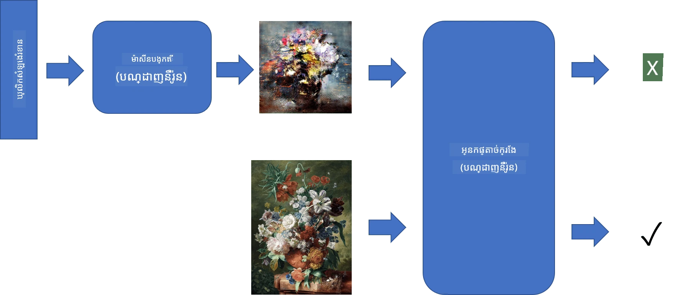
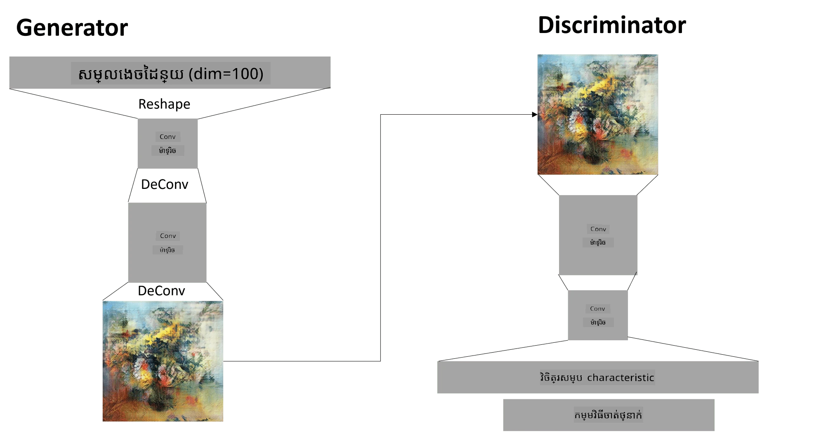

# បណ្តាញរូបស្ទុះផ្សងប្រកួត

នៅក្នុងផ្នែកមុន យើងបានរៀនអំពី **ម៉ូដែលរូប**: ម៉ូដែលដែលអាចបង្កើតរូបភាពថ្មីៗដែលស្រដៀងនឹងរូបភាពនៅក្នុងឈុតទិន្នន័យបណ្ដុះបណ្ដាល។ VAE គឺជាឧទាហរណ៍ល្អមួយនៃម៉ូដែលរូប។

## [សំណួរមុនវគ្គ](https://ff-quizzes.netlify.app/en/ai/quiz/19)

យ៉ាងណាក៏ដោយ ប្រសិនបើយើងព្យាយាមបង្កើតអ្វីឡើយមានអត្ថន័យជាក់លាក់ ដូចជាផ្សឹកនៅកម្រិតផ្ដល់ម៉ូដែលសមស្រួល ពី VAE យើងនឹងឃើញថា ការបណ្ដុះបណ្ដាលមិនត្រូវបានបញ្ចប់បានល្អទេ។ សម្រាប់ករណីនេះ យើងត្រូវរៀនអំពីស្ថាបัตិកម្មមួយផ្សេងទៀតដែលមានគោលបំណងច្បាស់លាស់សម្រាប់ម៉ូដែលរូប - **បណ្តាញរូបស្ទុះផ្សងប្រកួត** ឬ GAN។

គំនិតសំខាន់នៃ GAN គឺ មានបណ្តាញសរសៃសួរពីរដែលនឹងត្រូវបានបណ្ដុះប្រឆាំងគ្នា៖

> រូបភាពដោយ [Dmitry Soshnikov](http://soshnikov.com)

> ✅ វប្បធម៌តិចតួច៖
> * **ម៉ូឌឺរេត** គឺជាបណ្តាញ ដែលទទួលវ៉ិចទ័របែបចៃដន្យ មួយចំនួន ហើយបង្កើតរូបភាពជា​លទ្ធផល
> * **អ្នកបំបែក** គឺជាបណ្តាញដែលទទួលរូបភាពមួយហើយវាគួរតែប្រាប់ថាតើវាជារូបភាពពិត (ពីឈុតទិន្នន័យបណ្ដុះបណ្ដាល) ឬវាត្រូវបានបង្កើតដោយម៉ូឌឺរេត។ វាមានន័យមួយជាស្ដែងថាជាអ្នកចាត់ថ្នាក់រូបភាពមួយ។

### អ្នកបំបែក

ស្ថាបាតិកម្មរបស់អ្នកបំបែក មិនខុសពីបណ្តាញចាត់ថ្នាក់រូបភាពធម្មតាទេ។ ក្នុងករណីសាមញ្ញ វាអាចជាអ្នកចាត់ថ្នាក់ Fully-connected ប៉ុន្តែភាគច្រើនវានឹងជាបណ្តាញ [Convolutional](../07-ConvNets/README.md)។

> ✅ GAN ដែលផ្អែកលើបណ្តាញ convolutional ហៅថា [DCGAN](https://arxiv.org/pdf/1511.06434.pdf)

CNN Discriminator រួមមានស្រទាប់ដូចតទៅ៖ ខ្សែបង្វិលជាច្រើន និង អង្គុយស្លាប (poolings) ដោយមានទំហំដែនលក្ខណៈកាត់បន្ថយ ហើយមានពីរឬច្រើនស្រទាប់ fully-connected ដើម្បីទទួលបាន "វ៉ិចទ័រឡักษณะ", ហើយចុងក្រោយជាអ្នកចាត់ថ្នាក់ឌីហ្សាញប៊ីណារីមួយ។

> ✅ ការអង្គុយស្លាប (pooling) ក្នុងសារៈបច្ចេកទេសនេះគឺជាបច្ចេកទេសកាត់បន្ថយទំហំរូបភាព។ "ស្រទាប់ pooling កាត់បន្ថយវិមាត្រទិន្នន័យ ដោយបញ្ចូលលទ្ធផលនៃក្រុមណឺរ៉ូននៅស្រទាប់មួយ ទៅជា នឺរ៉ូនតែមួយនៅស្រទាប់បន្ទាប់។" - [ប្រភព](https://wikipedia.org/wiki/Convolutional_neural_network#Pooling_layers)

### ម៉ូឌឺរេត

ម៉ូឌឺរេតមានភាពលំបាកបន្តិច។ អ្នកអាចយល់ថាវាអាចមានរៀបរាប់ជាម៉ូឌឺរេតមុខងារក្រឡាផ្ទួន។ ចាប់ផ្តើមពីវ៉ិចទ័រលាក់ (latent vector) (ជំនួសវ៉ិចទ័រឡក្ខណៈ) វាមានស្រទាប់ fully-connected មួយដើម្បីបម្លែងវាទៅទំហំ/រាងត្រូវការ បន្ទាប់មកជាគ្រឿងបន្ថែម deconvolutions និងកំណត់ទំហំឡើងវិញ។ វាស្រដៀងនឹងផ្នែក *decoder* របស់ [autoencoder](../09-Autoencoders/README.md)។

> ✅ ព្រោះស្រទាប់ convolution ត្រូវបានអនុវត្តជាគ្រឿងត្រង់បន្ទាត់មួយក្នុងការស្ទួចរូបភាព ការបន្សល់ត្រូវស្រដៀងនឹង convolution ហើយអាចអនុវត្តបានដោយប្រើលទ្ធផលស្រទាប់ដូចគ្នា។

> រូបភាពដោយ [Dmitry Soshnikov](http://soshnikov.com)

### ការបណ្ដុះបណ្ដាល GAN

GAN ត្រូវបានហៅថា **ប្រឆាំងគ្នា** ព្រោះមានការប្រកួតប្រជែងជាបន្តរវាងម៉ូឌឺរេត និងអ្នកបំបែក។ ក្នុងការប្រកួតនេះ ទាំងម៉ូឌឺរេត និងអ្នកបំបែក ធ្វើការកែលម្អខ្លួន ដូច្នេះបណ្តាញរៀនបង្កើតរូបភាពល្អប្រសើរឡើងបន្តិចៗ។

ការបណ្ដុះបណ្ដាលប្រព្រឹត្តទៅក្នុងពីរដំណាក់កាល៖

* **បណ្ដុះបណ្ដាលអ្នកបំបែក**។ បេសកកម្មនេះគឺច្បាស់លាស់៖ យើងបង្កើតកុងតែម្យ៉ាងនៃរូបភាពដោយម៉ូឌឺរេត ប្រើស្លាកលេខ 0 សម្រាប់រូបភាពក្លែងបន្លំ ហើយយកកុងតែកមួយនៃរូបភាពពីឈុតទិន្នន័យបញ្ចូល (មានស្លាក 1 រូបភាពពិត)។ យើងទទួលបាន *ការបាត់បង់អ្នកបំបែក* មួយ ហើយអនុវត្តការផ្ទុះត្រឡប់ក្រោយ។
* **បណ្ដុះបណ្ដាលម៉ូឌឺរេត**។ វាត្រូវការលំបាកបន្តិច ព្រោះយើងមិនដឹងលទ្ធផលដែលចាំបាច់សម្រាប់ម៉ូឌឺរេតដោយផ្ទាល់ទេ។ យើងយកបណ្តាញ GAN ទាំងមូល ដែលរួមមានម៉ូឌឺរេត និងអ្នកបំបែក បញ្ចូលវ៉ិចទ័រចៃដន្យមួយចំនួន ហើយរំពឹងលទ្ធផលជា 1 (តំណាងឲ្យរូបភាពពិត)។ បន្ទាប់មក យើងប៊ិចបន្តិចបង្ហាប់ប៉ារ៉ាម៉ែត្រ của អ្នកបំបែក (មិនចង់ឲ្យវាបណ្ដុះនៅជំហាននេះ) ហើយអនុវត្តការផ្ទុះត្រឡប់ក្រោយ។

រយៈពេលនេះ ការបាត់បង់របស់ទាំងម៉ូឌឺរេត និងអ្នកបំបែកមិនចុះចាញ់យ៉ាងមានន័យសំខាន់ទេ។ នៅក្នុងលក្ខខណ្ឌអ идеល ពួកវាគួរតែបង្វិលមកវិញ ការសម្របសម្រួលនៃទាំងពីរបណ្តាញប្រសើរឡើង។

## ✍️ លំហាត់៖ GANs

* [កំណត់ត្រារបស់ GAN ក្នុង TensorFlow/Keras](GANTF.ipynb)
* [កំណត់ត្រារបស់ GAN ក្នុង PyTorch](GANPyTorch.ipynb)

### បញ្ហាក្នុងការបណ្ដុះ GAN

GAN ត្រូវបានគេចាត់ទុកថាលំបាកពិសេសក្នុងការបណ្ដុះ។ មានបញ្ហាខ្លះៗ៖

* **ការធ្លាក់បាត់មូដ** (Mode Collapse)។ ពាក្យនេះមានន័យថា ម៉ូឌឺរេតរៀនបង្កើតរូបភាពជោគជ័យមួយដែលបញ្ឆោតអ្នកបំបែកបាន តែមិនបង្កើតជារូបភាពច្រើនផ្សេងៗគ្នា។
* **ការពឹងផ្អែកលើប៉ារ៉ាម៉ែត្រលេខកំណត់**។ ជាញឹកញាប់ អ្នកអាចឃើញ GAN មិនបញ្ចប់ទេ ហើយបន្ទាប់មកអត្រា រៀនធ្លាក់ធំទូលៃរហូតដល់បញ្ចប់។
* គ្រប់គ្រង **សមតុល្យ** រវាងម៉ូឌឺរេត និងអ្នកបំបែក។ ជាលក្ខណៈភាគច្រើន ការបាត់បង់អ្នកបំបែកអាចធ្លាក់ចុះទៅសូន្យយ៉ាងលឿន ដែលធ្វើឲ្យម៉ូឌឺរេតមិនអាចបណ្ដុះបណ្ដាលបន្ថែមបានទៀត។ ដើម្បីដោះស្រាយនេះ យើងអាចព្យាយាមកំណត់អត្រាររៀនខុសគ្នា សម្រាប់ម៉ូឌឺរេត និងអ្នកបំបែក ឬលាតត្រដាងការបណ្ដុះអ្នកបំបែក ប្រសិនបើការបាត់បង់ចុះខ្លាំងរួចហើយ។
* ការបណ្ដុះសម្រាប់ **កម្រិតផ្ដល់ខ្ពស់**។ វា phản ánh បញ្ហាដូចគ្នាជាមួយ autoencoders ដែលបញ្ហានេះកើតឡើង ព្រោះការស្តារបណ្តាស្រទាប់សាច់ញាតិ convolutional network ច្រើនពេក បង្កើតអត្ថិភាពមិនល្អ។ បញ្ហានេះតែងតែដោះស្រាយជាមួយ **ការលូតលាស់ដំបូងពីតិចទៅច្រើន** (progressive growing), ដែលជារៀបចំស្រទាប់ជាច្រើននៅតិចកម្រិត នៅពេលដំបូង ហើយបន្ទាប់មក "ដោះបិទ" ឬ បន្ថែមស្រទាប់សរសើរ។ ផ្លូវដោះស្រាយមួយផ្សេងទៀតគឺបន្ថែមការតភ្ជាប់បន្ថែមរវាងស្រទាប់ និងបណ្ដុះនៅកម្រិតជាច្រើនពេលមួយ - មើល [Multi-Scale Gradient GANs paper](https://arxiv.org/abs/1903.06048) សម្រាប់ព័ត៌មានលម្អិត។

## ការបម្លែងរចនាបថ (Style Transfer)

GANs ជាវិធីដ៏ល្អសម្រាប់បង្កើតរូបភាពសិល្បៈមួយ។ បច្ចេកទេសមួយទៀតគឺហៅថា **ការ​បម្លែងរចនាបថ** ដែលយករូបភាពមួយ **រូបភាពមាតិកា** ហើយគូរឡើងវិញក្នុងរចនាបថផ្សេងទៀតដោយប្រើតម្រង់ពី **រូបភាពរចនាបថ**។

វិធីសាស្ត្រដែលវាធ្វើការនោះគឺដូចខាងក្រោម៖
* យើងចាប់ផ្តើមពីរូបភាពសំពាធសំឡេងចៃដន្យ (ឬរូបភាពមាតិកា ប៉ុន្តេល្មត់ដែលយល់មានងាយ សម្រាប់រៀនគឺចាប់ពីសំពាធសំឡេងចៃដន្យ)
* គោលដៅរបស់យើងគឺបង្កើតរូបភាពដែលនៅជិតរូបភាព​ពីរដូចជា រូបភាពមាតិកា និង រូបភាពរចនាបថ។ វាត្រូវបានវាយតម្លៃដោយមុខងារបាត់បង់ពីរដូចជា៖
   - **ការបាត់បង់មាតិកា** គណនាពីលក្ខណៈដែលបានដកស្រង់ដោយ CNN នៅស្រទាប់មួយចំនួន ពីរូបភាពបច្ចុប្បន្ន និងរូបភាពមាតិកា
   - **ការបាត់បង់រចនាបថ** គណនារវាងរូបភាពបច្ចុប្បន្ន និង រូបភាពរចនាបថ នៅលើវិធីឆ្លាតវៃ ដោយប្រើម៉ាទ្រីស Gram (ព័ត៌មានបន្ថែមនៅក្នុង [កំណត់ត្រាឧទាហរណ៍](StyleTransfer.ipynb))
* ដើម្បីធ្វើឲ្យរូបភាពរលោង និងយកសំឡេងចេញ យើងបញ្ចូលមុខងារ **Variation loss** ដែលគណនាដាច់ដោយឡែកមធ្យមភាពរវាងភិចសែលជិតៗគ្នា
* វដ្តកែតម្រូវសំខាន់កែប្រែរូបភាពបច្ចុប្បន្នដោយប្រើលំហ៍ព្រំ (gradient descent) ឬអាល់ករីធម៍បំបាត់បាត់ផ្សេងៗ ដើម្បីបន្ថយការបាត់បង់សរុប ដែលជាចំនួនបំណុលទម្រង់ទម្រង់ជាការសរុបនៃបីការបាត់បង់។

## ✍️ ឧទាហរណ៍៖ [ការបម្លែងរចនាបថ](StyleTransfer.ipynb)

## [សំណួរបន្ទាប់វគ្គ](https://ff-quizzes.netlify.app/en/ai/quiz/20)

## 결론

នៅក្នុងមេរៀននេះ អ្នកបានរៀនអំពី GAN និងរបៀបបណ្ដុះវា។ អ្នកក៏បានស្គាល់ពីបញ្ហាពិសេសដែលបណ្តាញសរសៃសួរប្រភេទនេះអាចប្រឈមមុខ និងយុទ្ធសាស្ត្រខ្លះៗដើម្បីដោះស្រាយវា។

## 🚀 챌린지

រត់តាម [កំណត់ត្រាបម្លែងរចនាបថ](StyleTransfer.ipynb) ដោយប្រើរូបភាពខ្លួនឯង។

## ការត្រួតពិនិត្យ & រៀនដោយខ្លួនឯង

សម្រាប់យោង សូមអានបន្ថែមអំពី GAN នៅក្នុងធនធានទាំងនេះ៖

* Marco Pasini, [10 មេរៀនដែលខ្ញុំបានរៀនពីការបណ្ដុះ GANs តួ​រៀលមួយឆ្នាំ](https://towardsdatascience.com/10-lessons-i-learned-training-generative-adversarial-networks-gans-for-a-year-c9071159628)
* [StyleGAN](https://en.wikipedia.org/wiki/StyleGAN), ស្ថាបតិកម្ម GAN *de facto* ដែលគួរតែជៀសជាត
* [បង្កើតសិល្បៈរូបដោយ GANs នៅលើ Azure ML](https://soshnikov.com/scienceart/creating-generative-art-using-gan-on-azureml/)

## ការបំពេញការងារ

ចូលមកមើលកំណត់ត្រាតែមួយក្នុងពីរកំណត់ត្រាដែលទាក់ទងទៅមេរៀននេះ ហើយបណ្ដុះ GAN លើរូបភាពរបស់អ្នក។ អ្នកអាចបង្កើតអ្វីបាន?

---

<!-- CO-OP TRANSLATOR DISCLAIMER START -->
**ការបញ្ជាក់**៖  
ឯកសារនេះបានបំលែងជាភាសាខ្មែរ ដោយប្រើសេវាកម្មបកប្រែ AI [Co-op Translator](https://github.com/Azure/co-op-translator)។ ខណៈពេលដែលយើងខិតខំដល់ភាពត្រឹមត្រូវ សូមយល់ព្រមថាការបកប្រែដោយស្វ័យប្រវត្តិអាចមានកំហុស ឬភាពមិនត្រឹមត្រូវ។ ឯកសារដើមនៅភាសាបុរាណគួរត្រូវបានគេជាឯកសារដែលមានអំណាច។ សម្រាប់ព័ត៌មានសំខាន់ សូមណែនាំឲ្យប្រើការបកប្រែដោយអ្នកជំនាញមនុស្ស។ យើងមិនទទួលខុសត្រូវចំពោះការយល់ច្រឡំ ឬការបកបញ្ចេញមេនខុសពីការប្រើប្រាស់ការបកប្រែនេះឡើយ។
<!-- CO-OP TRANSLATOR DISCLAIMER END -->