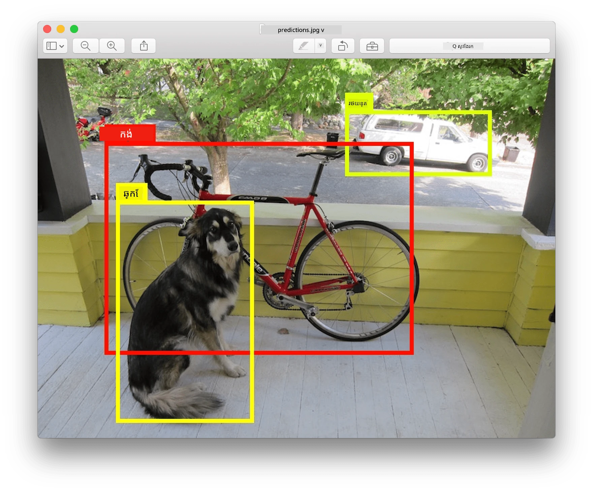
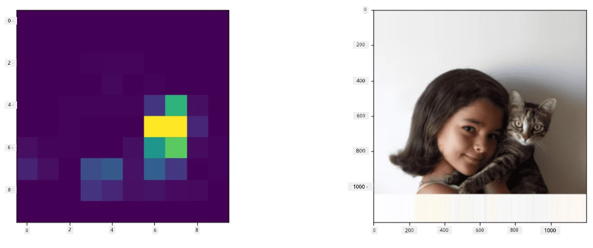
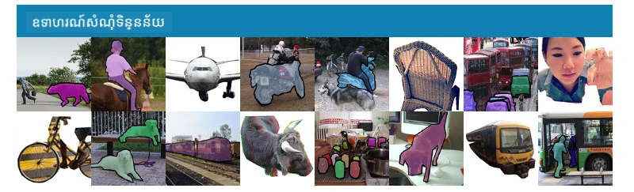
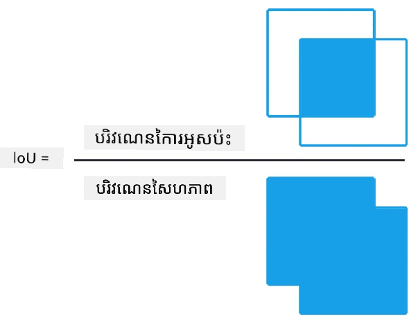
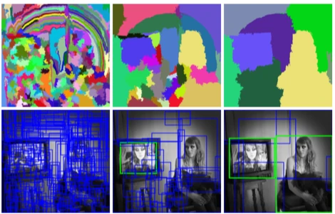
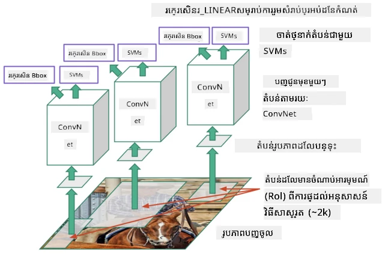
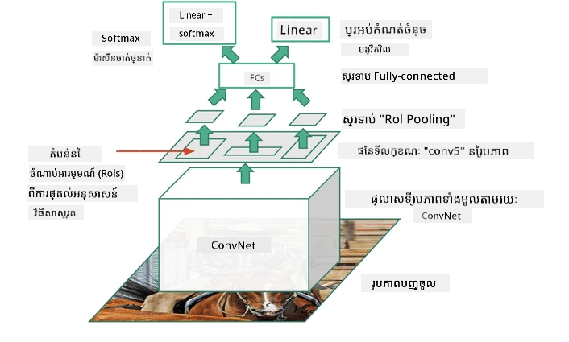
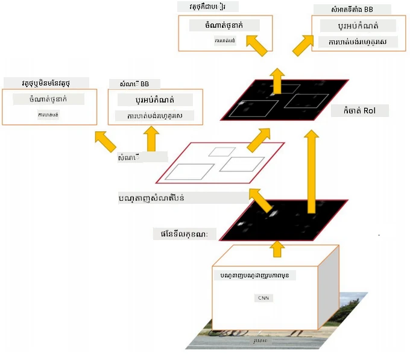
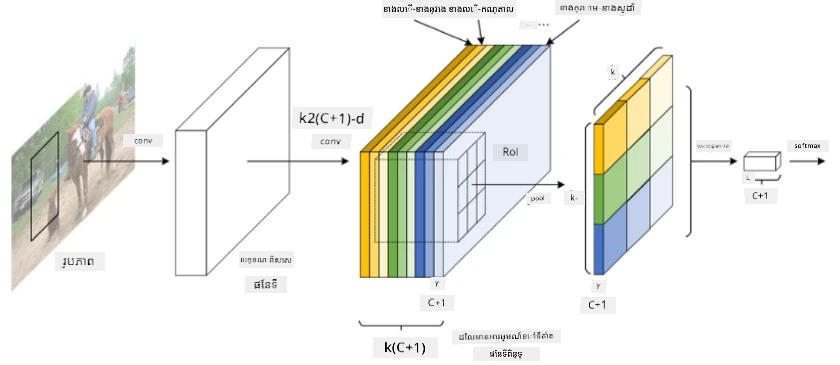
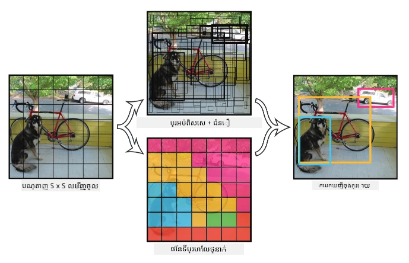

# ការរកឃើញវត្ថុ

ម៉ូដែលចាត់ថ្នាក់រូបភាព ដែលយើងបានប្រើរហូតមកដល់ឡើយ បានយករូបភាពមួយ ហើយបង្កើតលទ្ធផលជាក្រុមវិនិច្ឆ័យមួយ ដូចជា ចំណាត់ថ្នាក់ 'លេខ' ក្នុងបញ្ហា MNIST។ ទោះបីជាយ៉ាងណាក៏ដោយ នៅក្នុងករណីជាច្រើន យើងមិនត្រឹមតែចង់ដឹងថារូបភាព នោះបង្ហាញវត្ថុទេ - យើងចង់អាចកំណត់ទីតាំងពេញលេញរបស់វា។ នេះគឺជាចំណុចដ៏សំខាន់នៃ **ការរកឃើញវត្ថុ**។

## [សំណួរមុខបង្ហាត់](https://ff-quizzes.netlify.app/en/ai/quiz/21)

> រូបពី [គេហទំព័រ YOLO v2](https://pjreddie.com/darknet/yolov2/)

## វិធីសាស្រ្តសាមញ្ញសម្រាប់ការរកឃើញវត្ថុ

ហ្មត់ដើម្បីស្វែងរកចម្លែកនៅលើរូបភាពមួយ វិធីសាស្រ្តសាមញ្ញសម្រាប់ការរកឃើញវត្ថុអាចមានដូចខាងក្រោម៖

1. បំបែករូបភាពទៅជាចំនួនផ្ទៃតូចៗ
2. ប្រតិបត្តិចាត់ថ្នាក់រូបភាពលើផ្ទៃតូចនីមួយៗ។
3. ផ្ទៃតូចដែលបង្កើតអាស៊ីវ២០១យស័គ្នាថាប់ខ្ពស់គួរត្រូវបានគិតថាមានវត្ថុដែលត្រូវបានស្នើសុំ។

> *រូបពី [សៀវភៅកិច្ចវាយតម្លៃ](ObjectDetection-TF.ipynb)*

ទោះជាក៏ដោយ វិធីសាស្រ្តនេះមិនមែនល្អទេ ព្រោះវាគ្រាន់តែអនុញ្ញាតឲ្យកម្មវិធីកំណត់ប្រអប់ដែកដោះថ្លៃរបស់វត្ថុបានយ៉ាងមិនច្បាស់លាស់។ សម្រាប់ទីតាំងពិតប្រាកដជាងនេះ យើងត្រូវបើកការប៉ាន់ស្មានចំនួន **ចុះបញ្ជាក់** ដើម្បីទាយទ្រង់ទ្រាយនៃប្រអប់ដែកដោះថ្លៃ - ហើយសម្រាប់វា យើងត្រូវការបណ្ដុំទិន្នន័យជាក់លាក់។

## ការចុះបញ្ជាក់សម្រាប់ការរកឃើញវត្ថុ

[បទបង្ហាញនេះ](https://towardsdatascience.com/object-detection-with-neural-networks-a4e2c46b4491) មានការណែនាំយ៉ាងល្អបំព្រងសម្រាប់រកឃើញរាងកាយ។

## ឯកសារទិន្នន័យសម្រាប់ការរកឃើញវត្ថុ

អ្នកប្រហែលជាគួរបានជួបប្រទៈឯកសារទិន្នន័យដូចខាងក្រោមសម្រាប់ការងារនេះ៖

* [PASCAL VOC](http://host.robots.ox.ac.uk/pascal/VOC/) - 20 ចំណាត់ថ្នាក់
* [COCO](http://cocodataset.org/#home) - វត្ថុទូទៅនៅក្នុងបរិបទ។ មាន 80 ចំណាត់ថ្នាក់ ប្រអប់ដែកដោះថ្លៃ និងម៉ាសបំបែក

## គោលដៅសម្រាប់ការរកឃើញវត្ថុ

### ការបន្តិតគ្នានៃការចូលគ្នា

ពេលសម្រាប់ចាត់ថ្នាក់រូបភាព វាប្រសើរងាយស្រួលវាស់ថាតើកម្មវិធីបញ្ចប់ល្អទេ ក្រោយមកសម្រាប់ការរកឃើញវត្ថុ យើងត្រូវវាស់ទាំងត្រឹមត្រូវនៃចំណាត់ថ្នាក់ ក៏ដូចជាការច្បាស់លាស់នៃទីតាំងប្រអប់ដែកដោះថ្លៃ។ សម្រាប់ចំណុចចុងក្រោយនេះ យើងប្រើអ្វីដែលហៅថា **ការបន្តិតគ្នានៃការចូលគ្នា** (IoU), ដែលវាស់ថាតើប្រអប់ពីរឬផ្ទៃពីរប្រហែលគ្នាពីរប៉ុណ្ណា។

> *រូប 2 ពី [បទបង្ហាញល្អឥតខ្ចោះលើ IoU](https://pyimagesearch.com/2016/11/07/intersection-over-union-iou-for-object-detection/)*

គំនិតគឺងាយៗ - យើងចែកផ្ទៃនៃការបន្តិតគ្នារវាងរូបរាងពីរដោយផ្ទៃនៃសមាសធាតុរបស់ពួកវា។ សម្រាប់ផ្ទៃដូចគ្នា ពិតប្រាកដថា IoU នឹងស្មើ 1 ខណៈដែលសម្រាប់ផ្ទៃមិនរំលោភគ្នា យ៉ាងស្រឡះវានឹងស្មើ 0។ គ្រាន់តែវានឹងប្រែប្រួលពី 0 ទៅ 1។ យើងធម្មតាទៅគិតលទ្ធផលតែប្រអប់ដែកដែលមាន IoU មួយលើសតម្លៃណាមួយ។

### Precision ធៀបមធ្យម

សន្មតថា យើងចង់វាស់ថាសម្គាល់បានល្អប៉ុណ្ណាដល់ចំណាត់ថ្នាក់វត្ថុមួយ $C$។ ដើម្បីវាស់វា យើងប្រើគោលដៅ **Precision ធៀបមធ្យម** ដែលគណនាដូចខាងក្រោម៖

1. គិតតួតម្លៃ Precision-Recall ដែលបង្ហាញភាពត្រឹមត្រូវដោយផ្អែកលើតម្លៃសម្ងាត់នៃការរកឃើញ (ពី 0 ទៅ 1)។
2. ភាពយោងទៅលើកម្រិតសម្ងាត់ យើងនឹងទទួលបានចំនួនវត្ថុគ្រប់គ្រាន់ ឬទាបក្នុងរូបភាព មិនដូចគ្នានៃតម្លៃ precision និង recall។
3. កោងនឹងដូចនេះ៖

> *រូបពី [NeuroWorkshop](http://github.com/shwars/NeuroWorkshop)*

Precision ធៀបមធ្យមសម្រាប់ចំណាត់ថ្នាក់មួយ $C$ គឺជាផ្ទៃក្រោមកោងនេះ។ យ៉ាងច្បាស់លាស់, ឈានចុះមាត្រដ្ឋាន Recall ត្រូវបានចែកជាមូលដ្ឋាន 10 និង Precision ត្រូវបានគណនារួមលើចំណុចទាំងនោះ៖

$$
AP = {1\over11}\sum_{i=0}^{10}\mbox{Precision}(\mbox{Recall}={i\over10})
$$

### AP និង IoU

យើងនឹងគិតតែវត្ថុដែលបានរកឃើញ ដែល IoU មានតម្លៃលើសចំណុចណាមួយ។ ឧទាហរណ៍ នៅក្នុង PASCAL VOC dataset មានការអនុម័តថា $\mbox{IoU Threshold} = 0.5$, ខណៈនៅក្នុង COCO AP ត្រូវបានវាស់សម្រាប់តម្លៃ $\mbox{IoU Threshold}$ ប្រែប្រួល។

> *រូបពី [NeuroWorkshop](http://github.com/shwars/NeuroWorkshop)*

### Precision ធៀបមធ្យមមធ្យម - mAP

គោលដៅសំខាន់សម្រាប់ការរកឃើញវត្ថុ ហៅថា **Precision ធៀបមធ្យមមធ្យម** ឬ **mAP**។ វាជាតម្លៃ Precision ធៀបមធ្យម មធ្យមបង្ហាញច្រេសចេញពីចំណាត់ថ្នាក់ទាំងអស់របស់វត្ថុ ហើយពេលខ្លះផងដែរតាម $\mbox{IoU Threshold}$។ ក្នុងសេចក្ដីលម្អិត ការគណនា **mAP** ត្រូវបានពិពណ៌នានៅ
[ក្នុងបទបង្ហាញនេះ](https://medium.com/@timothycarlen/understanding-the-map-evaluation-metric-for-object-detection-a07fe6962cf3)), និង [នៅទីនេះជាមួយឧទាហរណ៍កូដ](https://gist.github.com/tarlen5/008809c3decf19313de216b9208f3734)។

## វិធីសាស្រ្តផ្សេងៗសម្រាប់ការរកឃើញវត្ថុ

មានឈ្នះទាំងពីរប្រភេទធំសំខាន់នៃវីធីសាស្រ្តរកឃើញវត្ថុ៖

* **Region Proposal Networks** (R-CNN, Fast R-CNN, Faster R-CNN)។ គំនិតសំខាន់គឺបង្កើត **តំបន់ចំណាប់អារម្មណ៍** (ROI) ហើយបើក CNN លើពួកវា ដើម្បីស្វែងរកការបញ្ចេញអតិបរមា។ វាដូចជាវិធីសាស្រ្តសាមញ្ញ បើទេថា ROI ត្រូវបានបង្កើតដោយវិធីសាស្រ្តខ្ពស់ជាង។ ខុសត្រូវធំមួយនៃវិធីសាស្រ្តដូចនេះ គឺពួកវាដំណើរការជាអាចយឺត ព្រោះយើងត្រូវការបង្ហោះ CNN ម៉ូដែលជាច្រើនលើរូបភាព។
* វិធីសាស្រ្ត **មួយដំណើរ** (YOLO, SSD, RetinaNet)។ នៅក្នុងស្ថាបត្យកម្មទាំងនេះ យើងរចនាបណ្ដាញឲ្យទាយក្លៈនិង ROI ទាំងពីរនៅក្នុងមួយដំណើរ។

### R-CNN: Region-Based CNN

[R-CNN](http://islab.ulsan.ac.kr/files/announcement/513/rcnn_pami.pdf) ប្រើ [Selective Search](http://www.huppelen.nl/publications/selectiveSearchDraft.pdf) ដើម្បីបង្កើតរចនាសម្ព័ន្ធជាស្រទាប់នៃតំបន់ ROI ដែលបន្ទាប់មកត្រូវបានបញ្ជូនតាមរយៈ CNN feature extractors និង SVM-classifiers ដើម្បីកំណត់ចំណាត់ថ្នាក់វត្ថុ ហើយក៏ប្រើការចុះបញ្ជាក់ស៊ុមខ្សែដើម្បីកំណត់ *ទ្រង់ទ្រាយប្រអប់ដែកដោះថ្លៃ* ។ [អត្ថបទផ្លូវការជាភាសាអង់គ្លេស](https://arxiv.org/pdf/1506.01497v1.pdf)

> *រូបពី van de Sande et al. ICCV’11*

> *រូបភាពពី [បទបង្ហាញនេះ](https://towardsdatascience.com/r-cnn-fast-r-cnn-faster-r-cnn-yolo-object-detection-algorithms-36d53571365e)*

### F-RCNN - Fast R-CNN

វិធីសាស្រ្តនេះស្រដៀងនឹង R-CNN ប៉ុន្តែតំបន់ ត្រូវបានកំណត់ក្រោយពីស្រទាប់កំណត់បង្រួមត្រូវបានអនុវត្ត។

> រូបពី [អត្ថបទផ្លូវការ](https://www.cv-foundation.org/openaccess/content_iccv_2015/papers/Girshick_Fast_R-CNN_ICCV_2015_paper.pdf), [arXiv](https://arxiv.org/pdf/1504.08083.pdf), 2015

### Faster R-CNN

គំនិតសំខាន់នៃវិធីសាស្រ្តនេះ គឺប្រើបណ្តាញសរសៃប្រព័ន្ធសរសៃប្រព័ន្ធក្នុងការទាយ ROI - ហៅថា *Region Proposal Network*។ [អត្ថបទ](https://arxiv.org/pdf/1506.01497.pdf), 2016

> រូបពី [អត្ថបទផ្លូវការ](https://arxiv.org/pdf/1506.01497.pdf)

### R-FCN: Region-Based Fully Convolutional Network

អាល់គ្រុិធីមនេះលឿនជាង Faster R-CNN ផងដែរ។ គំនិតសំខាន់មានដូចខាងក្រោម៖

1. យើងដកលក្ខណៈប្រើ ResNet-101
1. លក្ខណៈត្រូវបានកែប្រែដោយ **Position-Sensitive Score Map**។ គ្រប់វត្ថុពីចំណាត់ថ្នាក់ $C$ ត្រូវបានបែងចែកជាតំបន់ $k\times k$, ហើយយើងបណ្តុះដើម្បីទាយផ្នែកនៃវត្ថុ។
1. សម្រាប់មួយផ្នែកពីតំបន់ $k\times k$ បណ្ដាញទាំងមូលបោះឆ្នោតសម្រាប់ចំណាត់ថ្នាក់វត្ថុ ហើយចំណាត់ថ្នាក់វត្ថុដែលមានការបោះឆ្នោតអតិបរមាត្រូវបានជ្រើស។

> រូបពី [អត្ថបទផ្លូវការ](https://arxiv.org/abs/1605.06409)

### YOLO - You Only Look Once

YOLO គឺជាអាល់គ្រុិធីមមួយដំណើរដំណើរការនៅពេលជាក់ស្តែង។ គំនិតសំខាន់បានដូចខាងក្រោម៖

 * រូបភាពត្រូវបានបំបែកទៅជាតំបន់ $S\times S$
 * សម្រាប់តំបន់នីមួយៗ **CNN** ទាយ $n$ វត្ថុដែលអាចមាន, *រង្វង់ប្រអប់ដែកដោះថ្លៃ* និង *ជំនឿជោះ=ប្រហែល* * IoU

 

> រូបពី [អត្ថបទផ្លូវការ](https://arxiv.org/abs/1506.02640)

### អាល់គ្រុិធីមផ្សេងទៀត

* RetinaNet: [អត្ថបទផ្លូវការ](https://arxiv.org/abs/1708.02002)
   - [ការអនុវត្ត PyTorch នៅក្នុង Torchvision](https://pytorch.org/vision/stable/_modules/torchvision/models/detection/retinanet.html)
   - [ការអនុវត្ត Keras](https://github.com/fizyr/keras-retinanet)
   - [ការរកឃើញវត្ថុជាមួយ RetinaNet](https://keras.io/examples/vision/retinanet/) ក្នុងនំៀងគំរូ Keras
* SSD (Single Shot Detector): [អត្ថបទផ្លូវការ](https://arxiv.org/abs/1512.02325)

## ✍️ វិជ្ជាសកម្ម៖ ការរកឃើញវត្ថុ

បន្តការសិក្សារបស់អ្នកនៅក្នុងកំណត់ហេតុបន្ទាប់៖

[ObjectDetection.ipynb](ObjectDetection.ipynb)

## សញ្ញាប្រុងប្រយ័ត្ន

នៅក្នុងមេរៀននេះ អ្នកបានធ្វើដំណើរយ៉ាងឆាប់រហ័សលើវិធីសាស្រ្តផ្សេងៗទាំងស្រុងដែលអាចរកឃើញវត្ថុបាន!

## 🚀 챌린지

អានអត្ថបទ និងកំណត់ហេតុនេះអំពី YOLO ហើយសាកល្បងវាជាមួយខ្លួនអ្នកផ្ទាល់

* [អត្ថបទល្អ](https://www.analyticsvidhya.com/blog/2018/12/practical-guide-object-detection-yolo-framewor-python/) ពិពណ៌នាអំពី YOLO
 * [គេហទំព័រផ្លូវការ](https://pjreddie.com/darknet/yolo/)
 * Yolo: [អនុវត្ត Keras](https://github.com/experiencor/keras-yolo2), [កំណត់ហេតុចំណាត់ថ្នាក់ជាជំហាន](https://github.com/experiencor/basic-yolo-keras/blob/master/Yolo%20Step-by-Step.ipynb)
 * Yolo v2: [អនុវត្ត Keras](https://github.com/experiencor/keras-yolo2), [កំណត់ហេតុចំណាត់ថ្នាក់ជាជំហាន](https://github.com/experiencor/keras-yolo2/blob/master/Yolo%20Step-by-Step.ipynb)

## [សំណួរផុតមុខបង្ហាត់](https://ff-quizzes.netlify.app/en/ai/quiz/22)

## សង្ខេប & សិក្សាផ្ទាល់ខ្លួន

* [ការរកឃើញវត្ថុ](https://tjmachinelearning.com/lectures/1718/obj/) ដោយ Nikhil Sardana
* [ការប្រៀបធៀបល្អនៃអាល់គ្រិទឹមរកឃើញវត្ថុ](https://lilianweng.github.io/lil-log/2018/12/27/object-detection-part-4.html)
* [ការត្រួតពិនិត្យអាល់គ្រីទឹមរៅជ្រៅសម្រាប់ការរកឃើញវត្ថុ](https://medium.com/comet-app/review-of-deep-learning-algorithms-for-object-detection-c1f3d437b852)
* [ការណែនាំជាជំហានទៅអាល់គ្រីទឹមរកឃើញវត្ថុមូលដ្ឋាន](https://www.analyticsvidhya.com/blog/2018/10/a-step-by-step-introduction-to-the-basic-object-detection-algorithms-part-1/)
* [ការអនុវត្ត Faster R-CNN ក្នុង Python សម្រាប់ការរកឃើញវត្ថុ](https://www.analyticsvidhya.com/blog/2018/11/implementation-faster-r-cnn-python-object-detection/)

## [កិច្ចការផ្ទះ៖ ការរកឃើញវត្ថុ](lab/README.md)

---

<!-- CO-OP TRANSLATOR DISCLAIMER START -->
**ការបដិសេធ**៖  
ឯកសារនេះបានបកប្រែដោយប្រើសេវាកម្មបកប្រែ AI [Co-op Translator](https://github.com/Azure/co-op-translator)។ ខណៈពេលដែលយើងខិតខំស្វែងរកភាពត្រឹមត្រូវ សូមយល់ព្រមថាការបកប្រែអotomatically អាចមានកំហុសឬភាពមិនត្រឹមត្រូវ។ ឯកសារដើមនៅភាសាទីសាស្ត្រគួរត្រូវបានគេយកទៅជាអ្នកប្រើប្រាស់អំណាច។ សម្រាប់ព័ត៌មានសំខាន់ៗ សូមណែនាំឱ្យប្រើការបកប្រែដោយអ្នកជំនាញមនុស្ស។ យើងមិនទទួលខុសត្រូវចំពោះការយល់ច្រឡំ ឬការបកប្រែវែកញែកណាមួយដែលកើតឡើងដោយការប្រើប្រាស់ការបកប្រែនេះឡើយ។
<!-- CO-OP TRANSLATOR DISCLAIMER END -->