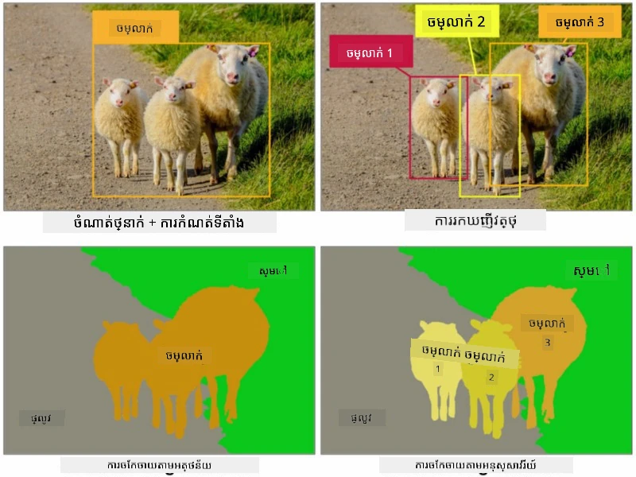
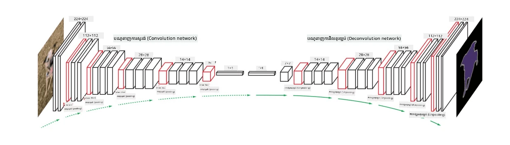
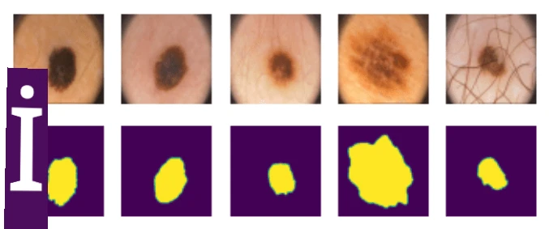

# ការបែងចែក

យើងបានរៀនអំពី ការកំណត់វត្ថុ មុននេះ ដើម្បីអាចកំណត់ទីតាំងវត្ថុផ្សេងៗនៅក្នុងរូបភាពដោយប៉ាន់ប្រមាណប្រអប់រាក់ទំាងខ្លួនរបស់វា។ ទោះយ៉ាងណា សម្រាប់បេសកកម្មខ្លះ យើងមិនត្រឹមតែត្រូវការប្រអប់រាក់ទំនងទេ តែត្រូវការចំណុចឆ្លុះត្រង់ប្រាកដពាក់ព័ន្ធនឹងវត្ថុ។ បេសកកម្មនេះហៅថា **ការបែងចែក**។

## [សំណួរពីមុនវគ្គសិក្សា](https://ff-quizzes.netlify.app/en/ai/quiz/23)

ការបែងចែកអាចមើលឃើញជាការចាត់ថ្នាក់ពិជ័យបិទ (pixel classification) ដែលសម្រាប់ **ពិជ័យបិទ** រាល់ចំណុចក្នុងរូបភាព យើងត្រូវប៉ាន់ប្រមាណចំណាត់ថ្នាក់របស់វា (ជាមួយនឹង *ផ្ទៃខាងក្រោយ* ជាកំណាត់ថ្នាក់មួយ)។ មានអាល់គោរីធម៍បែងចែកចម្បងពីរប្រភេទ៖

* **ការបែងចែកវាបញ្ញាតិ (Semantic segmentation)** ប្រាប់តែចំណាត់ថ្នាក់ពីពិជ័យបិទ ហើយមិនបំបែកចេញពីវត្ថុផ្សេងៗដែលមានចំណាត់ថ្នាក់ដូចគ្នាសោះទេ
* **ការបែងចែកអវត្តមាន (Instance segmentation)** បំបែកចំណាត់ថ្នាក់ជាច្រើនអវត្តមានផ្សេងៗ។

សម្រាប់ការបែងចែកអវត្តមាន ចិញ្ចើមទាំងនេះគឺជាវត្ថុខុសៗគ្នា ប៉ុន្តសម្រាប់ការបែងចែកវាបញ្ញាតិ ចិញ្ចើមទាំងអស់ត្រូវបានតំណាងដោយចំណាត់ថ្នាក់តែមួយ។

> រូបភាពពី [វិប្បដិសារមួយនេះ](https://nirmalamurali.medium.com/image-classification-vs-semantic-segmentation-vs-instance-segmentation-625c33a08d50)

មានសំណុំរចនាសម្ព័ន្ធណឺរចម្រាស់នានាសម្រាប់ការបែងចែក ប៉ុន្តាឧបករណ៍ទាំងអស់មានរចនាសម្ព័ន្ធដូចគ្នា។ មួយវិធីវិញ វាស្រដៀងនឹង autoencoder ដែលអ្នកបានរៀនមុននេះ ប៉ុន្តែជំនួសការបំបែករូបភាពដើម គោលបំណងរបស់យើងគឺបំបែក **ម៉ាស**។ ដូច្នេះ បណ្តាញបែងចែកមានផ្នែកដូចខាងក្រោម៖

* **Encoder** យកលក្ខណៈពីរូបភាពបញ្ចូល
* **Decoder** បម្លែងលក្ខណៈនោះទៅជារੂបម៉ាស ដែលមានទំហំដូចគ្នា និងចំនួនឆានែលស្របទៅនឹងចំនួនចំណាត់ថ្នាក់

> រូបភាពពី [ការចេញផ្សាយនេះ](https://arxiv.org/pdf/2001.05566.pdf)

យើងគួរតែល្បែងអំពីមុខងារបាត់បង់ដែលប្រើសម្រាប់ការបែងចែក។ នៅពេលប្រើ autoencoder ត្រងចាស់ មុននេះ យើងត្រូវតែមិនចាំបាច់វាយតម្លៃភាពស្រដៀងរវាងរូបភាពពីរដោយប្រើ mean square error (MSE)។ សម្រាប់ការបែងចែក រាល់ចំណុចនៅក្នុងរូបភាពម៉ាសគោលតំណាងឲ្យលេខចំណាត់ថ្នាក់ (one-hot-encoded ក្នុងទិសដៅទីបី) ដូច្នេះយើងត្រូវប្រើមុខងារបាត់បង់ដែលជាចម្បងសម្រាប់ចាត់ថ្នាក់ ជា cross-entropy loss ដែលគិតជាមធ្យមលើពិជ័យបិទទាំងអស់។ ប្រសិនបើម៉ាសជាប៊ីណារី នោះប្រើ **binary cross-entropy loss** (BCE)។

> ✅ One-hot encoding គឺជាវិធី encoding ចំណាត់ថ្នាក់ទៅជាវិកទ័រដែលមានប្រវែងស្មើនឹងចំនួនចំណាត់ថ្នាក់។ សូមមើល [អត្ថបទនេះ](https://datagy.io/sklearn-one-hot-encode/) ស្តីពីបច្ចេកទេសនេះ។

## ការបែងចែកសម្រាប់រូបភាពវេជ្ជសាស្ត្រ

ក្នុងមេរៀននេះ យើងនឹងឃើញការបែងចែកក្នុងសកម្មភាព ដោយហ្វឹកហាត់បណ្តាញក្នុងការទទួលស្គាល់ nevi មនុស្ស (ដែលហៅថា moles) នៅក្នុងរូបភាពវេជ្ជសាស្ត្រ។ យើងនឹងប្រើ <a href="https://www.fc.up.pt/addi/ph2%20database.html">PH2 Database</a> សម្រាប់រូបភាព dermoscopy ។ សំណុំទិន្នន័យនេះមានរូបភាពចំនួន ២០០ រូបភាព ពីបីចំណាត់ថ្នាក់៖ nevus ទូទៅ, nevus ផ្សេងទៀងបន្តិច, និង melanoma។ រូបភាពទាំងអស់ក៏មាន **ម៉ាស** ផ្សេងសម្រាប់បង្ហាញសភាព nevi ដែរ។

> ✅ បច្ចេកវិទ្យានេះសមរម្យយ៉ាងខ្លាំងសម្រាប់ក្របខណ្ឌវេជ្ជសាស្ត្រ ប៉ុន្តអ្នកអាចគិតថានឹងមានកម្មវិធីផ្សេងទៀតអ្វីខ្លះនៅក្នុងពិភពពិត?

> រូបភាពពី PH2 Database

យើងនឹងហ្វឹកហាត់ម៉ូដែលដើម្បីបែងចែក nevi ពីផ្ទៃខាងក្រោយរបស់វា។

## ✍️ រៀនប្រាកដ៖ Semantic Segmentation

បើកកំណត់ត្រាខាងក្រោម ដើម្បីរៀនបន្ថែមអំពីរចនាសម្ព័ន្ធ semantic segmentation ផ្សេងៗ សម្លឹងលើការអនុវត្តន៍ និងមើលវាផ្ទាល់។

* [Semantic Segmentation Pytorch](SemanticSegmentationPytorch.ipynb)
* [Semantic Segmentation TensorFlow](SemanticSegmentationTF.ipynb)

## [សំណួរបន្ទាប់វគ្គសិក្សា](https://ff-quizzes.netlify.app/en/ai/quiz/24)

## សេចក្ដីសន្និដ្ឋាន

ការបែងចែកជាបច្ចេកវិទ្យាដ៏មានឥទ្ធិពលខ្លាំងសម្រាប់ចាត់ថ្នាក់រូបភាព ដំណើរការលើសពីប្រអប់រាក់ទំនងទៅកាន់ការចាត់ថ្នាក់ជាទម្រង់ចំណុចមួយៗ។ វាជាបច្ចេកវិទ្យាមួយដែលប្រើនៅក្នុងរូបភាពវេជ្ជសាស្ត្រ និងកម្មវិធីដទៃទៀត។

## 🚀 챌린지

ការបែងចែករាងកាយគឺជាបេសកកម្មទូទៅមួយសម្រាប់រូបភាពមនុស្ស។ បេសកកម្មសំខាន់ផ្សេងទៀតរួមមាន **ការរកព្រំដែនឆ្អឹង** និង **ការរកទីតាំងរូបរាង**។ សាកល្បងប្រើបណ្ណាល័យ [OpenPose](https://github.com/CMU-Perceptual-Computing-Lab/openpose) ដើម្បីមើលថាតើការរកទីតាំងរូបរាងអាចប្រើបានយ៉ាងដូចម្តេច។

## សិក្សាដោយខ្លួនឯង និងពិនិត្យវិញ

អត្ថបទ [វិគីភីឌា](https://wikipedia.org/wiki/Image_segmentation) នេះផ្ដល់ទិដ្ឋភាពទូទៅល្អអំពីកម្មវិធីផ្សេងៗនៃបច្ចេកវិទ្យានេះ។ សូមស្វែងយល់បន្ថែមដោយខ្លួនឯងអំពីផ្នែករងនៃការបែងចែកអវត្តមាន និង Panoptic segmentation ក្នុងវិស័យនេះ។

## [ភារកិច្ច](lab/README.md)

ក្នុងមន្ទីរពិសោធន៍នេះ សូមសាកល្បង **ការបែងចែករាងកាយមនុស្ស** ដោយប្រើ [Segmentation Full Body MADS Dataset](https://www.kaggle.com/datasets/tapakah68/segmentation-full-body-mads-dataset) ពី Kaggle។

---

<!-- CO-OP TRANSLATOR DISCLAIMER START -->
**ការព្រមាន**៖  
ឯកសារនេះត្រូវបានបកប្រែដោយប្រើសេវាកម្មបកប្រែកម្មវិធី AI [Co-op Translator](https://github.com/Azure/co-op-translator)។ បើទោះបីយើងខិតខំប្រឹងប្រែងក្នុងការធ្វើឱ្យបានត្រឹមត្រូវក៏ដោយ សូមយល់ព្រមថាការបកប្រែដោយស្វ័យប្រវត្តិនេះអាចមានកំហុស ឬការខ្វះខាតមួយចំនួន។ ឯកសារដើមក្នុងភាសាមាតុភាសា គួរត្រូវបានរាប់បញ្ចូលជាអ្នកផ្តល់ព័ត៌មានដែលគួរជឿទុកចិត្ត។ សម្រាប់ព័ត៌មានសំខាន់ៗ ការបកប្រែមនុស្សដែលមានជំនាញគឺជាការផ្ដល់អនុសាសន៍។ យើងមិនទទួលខុសត្រូវចំពោះការយល់ច្រឡំ ឬការបកប្រែខុសប្លែកណាមួយដោយសារការប្រើប្រាស់ការបកប្រែនេះនោះទេ។
<!-- CO-OP TRANSLATOR DISCLAIMER END -->