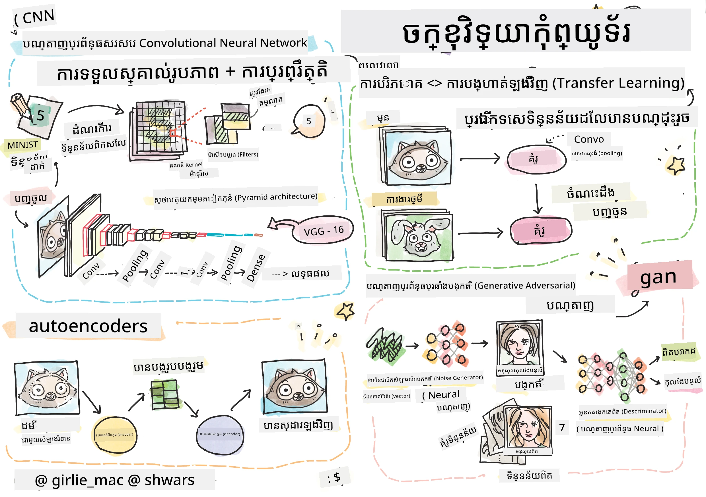

# ការមើលឃើញរបស់កុំព្យូទ័រ

នៅក្នុងផ្នែកនេះយើងនឹងរៀនអំពី៖

* [ការណែនាំអំពីការមើលឃើញរបស់កុំព្យូទ័រ និង OpenCV](06-IntroCV/README.md)
* [បណ្តាញប្រសាទបង្រួម](07-ConvNets/README.md)
* [បណ្តាញដែលបានបណ្តុះបណ្តាលមុន និងការសិក្សាបម្រុងចុះ](08-TransferLearning/README.md) 
* [Autoencoders](09-Autoencoders/README.md)
* [បណ្តាញប្រកួតប្រែងបង្កើត](10-GANs/README.md)
* [ការស្គាល់វត្ថុ](11-ObjectDetection/README.md)
* [ការបែងចែកមានអត្ថន័យ](12-Segmentation/README.md)

---

<!-- CO-OP TRANSLATOR DISCLAIMER START -->
**ការបដិសេធ**៖
ឯកសារនេះត្រូវបានបកប្រែដោយប្រើសេវាបកប្រែ AI [Co-op Translator](https://github.com/Azure/co-op-translator)។ ខណៈ​ពេល​យើងខិតខំ​សម្រាប់ភាពត្រឹមត្រូវ សូមចាប់អារម្មណ៍ថាការបកប្រែ​ដោយស្វ័យ​ប្រវត្តិ​អាចមានកំហុស ឬ ភាពមិនត្រឹមត្រូវ។ ឯកសារដើម​នៅក្នុងភាសាទៅតាមដើមគួរត្រូវបានចាត់ទុកជាអ្នកផ្តល់ព័ត៌មានសំខាន់ជាចម្បង។ សម្រាប់ព័ត៌មានសំខាន់ខ្លាំងៗ ការបកប្រែពីមនុស្សអ្នកជំនាញត្រូវបានផ្ដល់អនុសាសន៍។ យើងមិនទទួលខុសត្រូវចំពោះការយល់ច្រឡំ ឬការបកប្រែខុសប្រសិនបើបានបន្ទាប់ពីការប្រើប្រាស់ការបកប្រែនេះឡើយ។
<!-- CO-OP TRANSLATOR DISCLAIMER END -->