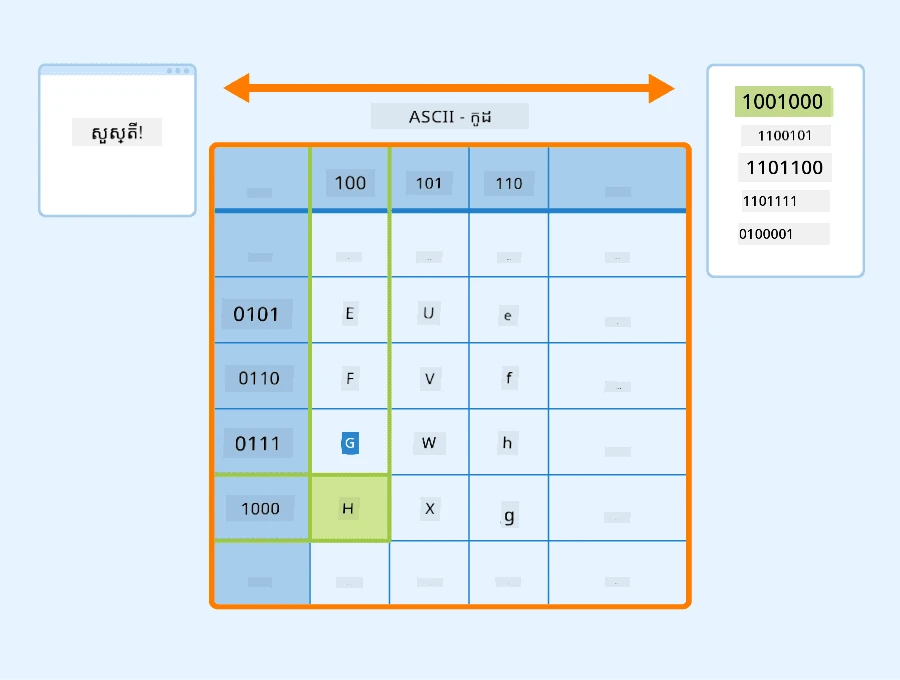
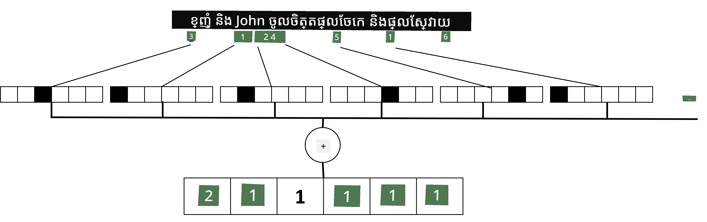

# បង្ហាញអត្ថបទជាទង់ស័រ

## [ប្រឡងមុនម៉ោងសិក្សា](https://ff-quizzes.netlify.app/en/ai/quiz/25)

## ការបែងចែកប្រភេទអត្ថបទ

នៅ Throughout ផ្នែកដំបូងនៃផ្នែកនេះ យើងនឹងផ្តោតលើភារកិច្ច **ការបែងចែកប្រភេទអត្ថបទ**។ យើងនឹងប្រើប្រភេទទិន្នន័យ [AG News](https://www.kaggle.com/amananandrai/ag-news-classification-dataset) ដែលមានអត្ថបទពហុមេរៀនដូចតទៅ៖

* ប្រភេទ៖ Sci/Tech
* ចំណងជើង៖ ក្រុមហ៊ុននៅរដ្ឋ Ky. ឈ្នះជំនួយសិក្សាអំពី Peptides (AP)
* រូបមន្ត៖ AP - ក្រុមហ៊ុនមួយដែលបានបង្កើតឡើងដោយអ្នកស្រាវជ្រាវគីមីនៅសាកលវិទ្យាល័យ Louisville ឈ្នះជំនួយដើម្បីអភិវឌ្ឍ...

គោលដៅរបស់យើងគឺបែងចែកអត្ថបទនោះទៅក្នុងប្រភេទមួយដែលផ្អែកលើអត្ថបទ។

## ការបង្ហាញអត្ថបទ

បើយើងចង់ដោះស្រាយភារកិច្ចក្នុងវិស័យក្រុមហ៊ុនមនុស្ស (NLP) ជាមួយបណ្តាញប្រសាទ យើងត្រូវការពិធីមួយសម្រាប់បង្ហាញអត្ថបទជាទង់ស័រ។ កុំព្យូទ័របានតំណាងឲ្យតួអក្សរឬតួអក្សរជាលេខដែលតំណាងឲ្យពុម្ពអក្សរនៅលើអេក្រង់របស់អ្នកដោយប្រើកូដដូចជា ASCII ឬ UTF-8។

> [ប្រភពរូបភាព](https://www.seobility.net/en/wiki/ASCII)

ជាមនុស្ស យើងយល់ពីអ្វីដែលអក្សរនីមួយៗ **តំណាងឱ្យ** ហើយថាតើតួអក្សរទាំងអស់រួមគ្នាដើម្បីបង្កើតពាក្យមួយក្នុងប្រយោគ។ ទោះជាយ៉ាងណា កុំព្យូទ័រមិនមានការយល់ដឹងដូចនេះទេ ហើយបណ្តាញប្រសាទត្រូវរៀនអត្ថន័យក្នុងអំឡុងការបណ្តុះបណ្តាល។

ហេតុនេះ យើងអាចប្រើវិធីផ្សេងៗនៅពេលបង្ហាញអត្ថបទ៖

* **ការបង្ហាញនៅលើកម្រិតតួអក្សរ**, នៅពេលយើងបង្ហាញអត្ថបទដោយការព្យាបាលឲ្យតួអក្សរនីមួយៗជាលេខ។ ដោយយោងថាយើងមានតួអក្សរផ្សេងគ្នា *C* ក្នុងឯកសារអត្ថបទរបស់យើង ពាក្យ *Hello* នឹងត្រូវបានបង្ហាញជាទង់ស័រដូចជា 5x*C*។ តួអក្សរនីមួយៗនឹងតំណាងឲ្យជួរឈរទង់ស័រមួយក្នុងការវាយលេខមួយនៅលើបណ្ដាញ។
* **ការបង្ហាញនៅលើកម្រិតពាក្យ**, ដែលនៅទីនេះយើងបង្កើត **វចនានុក្រម** របស់ពាក្យទាំងអស់ក្នុងអត្ថបទរបស់យើង ហើយបន្ទាប់មកបង្ហាញពាក្យដោយការវាយលេខមួយនៅលើបណ្ដាញ។ វិធីនេះល្អជាងការល្វែងមើល ពីព្រោះតួអក្សរតែមួយមិនមានអត្ថន័យច្រើនពីរៀងឡើយ ហើយដោយប្រើមាតិកាអត្ថន័យកម្រិតខ្ពស់ - ពាក្យ - យើងពង្រីកភារកិច្ចសម្រាប់បណ្តាញប្រសាទ។ ទោះជាយ៉ាងណា ដោយសារទំហំវចនានុក្រមធំ យើងត្រូវគ្រប់គ្រងទង់ស័រសំរួលមួយមានវាយតម្លៃខ្ពស់។

ដោយមិនព្រមានអំពីការបង្ហាញណាមួយ យើងត្រូវបំលែងអត្ថបទជាជួរនៃ **តូខែន** មួយ ដោយតូខែនមួយអាចជា តួអក្សរ ពាក្យ ឬក៏វាគ្រប់គ្រាន់ជាការផ្នែកនៃពាក្យមួយ។ បន្ទាប់មក យើងបំលែងតូខែនជាលេខ ដែលនៅជាប់អ្នកប្រើ **វចនានុក្រម** ហើយលេខនេះអាចចូលទៅក្នុងបណ្តាញប្រសាទដោយការវាយលេខមួយនៅលើបណ្ដាញ។

## N-Grams

ក្នុងភាសារធម្មជាតិ អត្ថន័យត្រឹមត្រូវនៃពាក្យអាចកំណត់បានតែតាមបរិបទប៉ុណ្ណោះ។ ឧទាហរណ៍ អត្ថន័យនៃ *neural network* និង *fishing network* ផ្ទុយគ្នាយ៉ាងសំខាន់។ មួយក្នុងវិធីធ្វើឲ្យមានការយកចិត្តទុកដាក់ទៅនឹងនេះគឺការបង្កើតគំរូលើចំឡែកពាក្យពីរដោយពិចារណាពាក្យពីរក្នុងសញ្ញាប័ត្រ។ ដូច្នេះ ប្រយោគ *I like to go fishing* នឹងត្រូវបានបង្ហាញជាសំណុំតូខែន៖ *I like*, *like to*, *to go*, *go fishing*។ បញ្ហាជាមួយវិធីនេះគឺទំហំនៃវចនានុក្រមកើនឡើងយ៉ាងមានន័យ ហើយការចងក្រងដូចជា *go fishing* និង *go shopping* ត្រូវបានបង្ហាញជាតូខែនខុសៗគ្នាដែលមិនមានសំណាក់ចំនួនសប្រាថ្នាទេទោះបីជាកិរិយាស័ព្ទដូចគ្នាក៏ដោយ។

ក្នុងករណីខ្លះ យើងអាចពិចារណាការប្រើ tri-grams គឺការចងក្រងពាក្យបីផងដែរ។ វិធីនេះហៅថា **n-grams**។ អញ្ចឹងហើយ វាធ្វើអោយមានអត្ថន័យក្នុងការប្រើ n-grams ជាមួយការបង្ហាញកម្រិតតួអក្សរ ដែលនៅនោះn-grams នឹងស្រដៀងទៅកាន់សម្លេងផ្សេងៗ។

## Bag-of-Words និង TF/IDF

នៅពេលដោះស្រាយភារកិច្ចដូចជាការបែងចែកអត្ថបទ យើងត្រូវបាននឹងត្រូវមានវិធីបង្ហាញអត្ថបទជាវ៉ិចទ័រដែលមានទំហំនិរន្តរមួយ ដែលយើងនឹងប្រើជាចូលឯកសារសម្រាប់ម៉ាស៊ីនចម្រោះចុងក្រោយ។ មួយក្នុងវិធីសាមញ្ញបំផុត ធ្វើបានយ៉ាងនេះគឺការរួមបញ្ចូលពាក្យនីមួយៗ ឧទាហរណ៍ដោយបូកនោះ។ បើយើងបញ្ចូលការវាយលេខមួយនៅលើបណ្ដាញនៃពាក្យនីមួយៗ យើងនឹងទទួលបានវ៉ិចទ័រដែលបង្ហាញពីមាឌដងដែលពាក្យនីមួយៗមានក្នុងអត្ថបទ។ ការបង្ហាញអត្ថបទបែបនេះហៅថា **bag of words** (BoW)។

> រូបភាពដោយអ្នកនិពន្ធ

BoW ច្បាស់ជាតំណាងថាពាក្យណាបង្ហាញនៅក្នុងអត្ថបទ និងបរិមាណណាដែលវាបង្ហាញ ដែលពិតជាអាចជាសញ្ញាល្អមួយនៃអ្វីដែលអត្ថបទនោះជាអំពី។ ឧទាហរណ៍ អត្ថបទព្រឹត្តិការណ៍ស្ថានការណ៍នយោបាយត្រូវមានពាក្យដូចជា *president* និង *country* ខណ:ការចេញផ្សាយវិទ្យាសាស្រ្តអាចមានពាក្យដូចជា *collider*, *discovered* ល។ ដូច្នេះ មាឌពាក្យអាចជាសញ្ញាល្អសម្រាប់មាតិកាអត្ថបទ។

បញ្ហានៃ BoW គឺពាក្យទូទៅមួយចំនួន ដូចជា *and*, *is* បង្ហាញក្នុងភាគច្រើននៃអត្ថបទ ហើយពួកវាមានមាឌខ្ពស់បំផុត ហើយបិទបាំងពាក្យដែលសំខាន់ពិតប្រាកដ។ យើងអាចបន្ថយសារៈសំខាន់របស់ពាក្យទាំងនេះដោយគិតពីមាឌដែលពាក្យមានក្នុងកម្រិតឯកសារជារួម។ នេះជាគំនិតសំខាន់នៅពីក្រោយវិធី TF/IDF ដែលបានរៀនបន្ថែមក្នុងសៀវភៅសំរាប់មេរៀននេះ។

យ៉ាងណាមិញ គ្មានវិធីណាមួយក្នុងនោះអាចយក **អត្ថន័យ** នៃអត្ថបទបានពេញលេញ។ យើងត្រូវម៉ូឌែលបណ្តាញប្រសាទកាន់តែមានសមត្ថភាពខ្ពស់ក្នុងការធ្វើបែបនេះ ដែលយើងនឹងពិភាក្សាពេលក្រោយក្នុងផ្នែកនេះ។

## ✍️ លំហែង៖ ការបង្ហាញអត្ថបទ

បន្តសិក្សារបស់អ្នកនៅក្នុងសៀវភៅខាងក្រោម៖

* [ការបង្ហាញអត្ថបទជាមួយ PyTorch](TextRepresentationPyTorch.ipynb)
* [ការបង្ហាញអត្ថបទជាមួយ TensorFlow](TextRepresentationTF.ipynb)

## 결론

ដល់បច្ចុប្បន្ន យើងបានសិក្សាបច្ចេកទេសដែលអាចបន្ថែមទំងន់មាឌកំណត់ទៅលើពាក្យផ្សេងៗ។ ទោះជាយ៉ាងណា វាមិនអាចបង្ហាញអត្ថន័យ ឬលំដាប់បានទេ។ ដូចជាអ្នកភាសាសិក្សាឈ្មោះ J. R. Firth បាននិយាយនៅឆ្នាំ 1935 ថា "អត្ថន័យពេញលេញនៃពាក្យមួយគឺតែងតែមានបរិបទ ហើយមិនមានការសិក្សាអត្ថន័យក្រៅបរិបទដែលអាចទទួលបានយ៉ាងមែនទេ។" យើងនឹងរៀនក្រោយក្នុងវគ្គនេះពីរបៀបទាក់ទាញព័ត៌មានបរិបទពីអត្ថបទដោយប្រើម៉ូឌែលភាសា។

## 🚀 បញ្ហាប្រឈម

សូមសាកល្បងលំហែផ្សេងទៀតដោយប្រើ bag-of-words និងម៉ូឌែលទិន្នន័យផ្សេងៗ។ អ្នកអាចទទួលបានបំណងប្លែកពីការប្រកួតនេះនៅលើ [Kaggle](https://www.kaggle.com/competitions/word2vec-nlp-tutorial/overview/part-1-for-beginners-bag-of-words)

## [ប្រឡងបន្ទាប់ម៉ោងសិក្សា](https://ff-quizzes.netlify.app/en/ai/quiz/26)

## ពិនិត្យឡើងវិញ & សិក្សាឯករាជ្យ

ហាត់ជំនាញរបស់អ្នកជាមួយនឹងការបញ្ចូលអត្ថបទនិងបច្ចេកទេស bag-of-words នៅលើ [Microsoft Learn](https://docs.microsoft.com/learn/modules/intro-natural-language-processing-pytorch/?WT.mc_id=academic-77998-cacaste)

## [កិច្ចការតាមសៀវភៅ](assignment.md)

---

<!-- CO-OP TRANSLATOR DISCLAIMER START -->
**ការបដិសេធ** ៖  
ឯកសារនេះត្រូវបានបកប្រែក្នុងការប្រើប្រាស់សេវាកម្មបកប្រែ AI [Co-op Translator](https://github.com/Azure/co-op-translator)។ ខណៈពេលដែលយើងខិតខំសំដែងភាពច្បាស់លាស់ សូមយល់ថាការបកប្រែអូតូម៉ាតិកអាចមានកំហុស ឬអត្រានៃកំហុស។ ឯកសារដើមក្នុងភាសាមូលដ្ឋានត្រូវបានគេយកជាយោងហើយជាថ្នាក់ដើម។ សម្រាប់ព័ត៌មានសំខាន់ៗ និយាយបកប្រែដោយមនុស្សជំនាញត្រូវបានណែនាំ។ យើងមិនទទួលខុសត្រូវចំពោះការយល់ច្រឡំ ឬការបកប្រែខុសណាមួយដែលកើតមានពីការប្រើប្រាស់ការបកប្រែនេះទេ។
<!-- CO-OP TRANSLATOR DISCLAIMER END -->