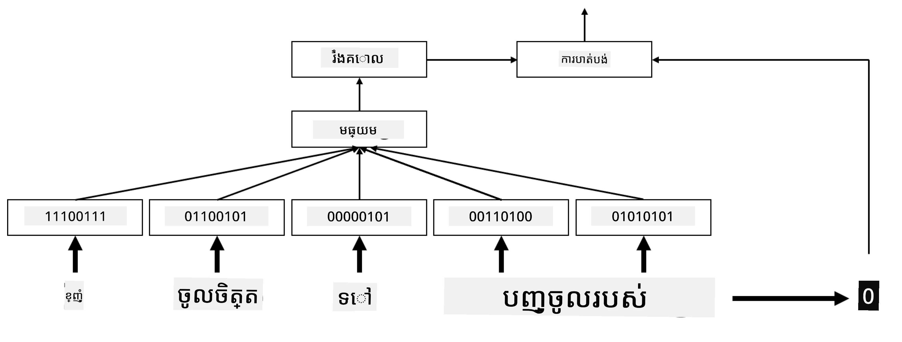

# សេចក្ដីបញ្ចូល

## [ប្រឡងមុនម៉ោងបង្រៀន](https://ff-quizzes.netlify.app/en/ai/quiz/27)

នៅពេលបណ្តុះបណ្តាលឧបករណ៍ចាត់ថ្នាក់ដោយផ្អែកលើ BoW ឬ TF/IDF យើងបានប្រតិបត្តិលើវ៉ិចទ័រក្បាល-ពុំខ្នាតខ្ពស់ `vocab_size` ហើយយើងបានបម្លែងយ៉ាងច្បាស់ពីវ៉ិចទ័រចំណាំតំណោយតិចទៅកាន់តំណាងមួយកន្លែងតែមួយពិបាកសម្គាល់។ ប៉ុន្តែនោះ តំណាងមួយកន្លែងតែមួយនេះ មិនមានប្រសិទ្ធភាពផ្នែកចងចាំទេ។ បន្ថែមពីនេះ ពាក្យនីមួយៗត្រូវបានចាត់ទុកដោយឡែកពីមួយទៅមួយទៀត, គឺវ៉ិចទ័រដែលបានបំលែងតាមរយៈមួយកន្លែងមួយមិនបង្ហាញពីស្រដៀងគ្នាផ្នែកអត្ថន័យរវាងពាក្យទេ។

គំនិត **embeddings** គឺតំណាងពាក្យដោយវ៉ិចទ័រដែលមានកម្រិតខ្ទង់តិចជាង ដែលប្រហែលជា បង្ហាញពីអត្ថន័យវេជ្ជសាស្ត្រពាក្យនោះ។ យើងនឹងពិភាក្សាពីរបៀបបង្កើត embeddings មានន័យបច្ចុប្បន្នក្នុងពេលក្រោយ ប៉ុន្តែជារបៀបដំបូង យើងសូមគិត embeddings ដូចជាវិធីសាស្រ្តបន្ថយខ្ទង់មានទំហំវ៉ិចទ័រពាក្យ។

ដូចនេះ ស្រទាប់ embedding នឹងទទួលពាក្យមួយជាចូល និងបង្កើតវ៉ិចទ័រចេញ ដែលមានទំហំ `embedding_size` ដែលបានកំណត់។ ដោយក្នុងន័យមួយ វាស្រដៀងនឹងស្រទាប់ `Linear` ជាខ្លាំង ប៉ុន្តែជំហាននេះ មិនបង្ហាញវ៉ិចទ័រតាមរយៈមួយកន្លែងតែមួយទេ វាអាចទទួលលេខពាក្យជាចូលធ្វើអោយយើងជៀសវាងការបង្កើតវ៉ិចទ័រធំៗមួយកន្លែងតែមួយបាន។

ដោយប្រើស្រទាប់ embedding ជាស្រទាប់ដំបូង ក្នុងបណ្ដាញឧបករណ៍ចាត់ថ្នាក់របស់យើង យើងអាចប្តូរពីគំរូ bag-of-words ទៅគំរូ **embedding bag**, ដែលត្រូវបានបម្លែងពាក្យនីមួយៗក្នុងអត្ថបទទៅជា embedding តាមសមាសភាព បន្ទាប់មកគណនា​រាងអង្គការណាដែលមានសារសំខាន់លើ embedding ទាំងអស់ ដូចជា `sum`, `average` ឬ `max`។  

> រូបភាពដោយអ្នកនិពន្ធ

## ✍️ ការអនុវត្ត: Embeddings

បន្តរៀនរបស់អ្នកនៅក្នុងកំណត់ត្រាគណនាគណនីដូចខាងក្រោម៖
* [Embeddings ជាមួយ PyTorch](EmbeddingsPyTorch.ipynb)
* [Embeddings ជាមួយ TensorFlow](EmbeddingsTF.ipynb)

## Semantic Embeddings: Word2Vec

ខណៈពេលស្រទាប់ embedding បានរៀនបម្លែងពាក្យទៅជា​តំណាងវ៉ិចទ័រ ប៉ុន្តែ តំណាងនេះមិនប្រាកដថាមានន័យសម្រាប់អត្ថន័យបែបសម្រង់បែបណានោះទេ។ វានឹងល្អប្រសើរជាងកាលណាបានរៀន​តំណាងវ៉ិចទ័រ ដែលពាក្យដែលស្រដៀងគ្នាន ឬពាក្យសំដែងបទស្រដៀងគ្នា មានវ៉ិចទ័រដែលនៅជិតគ្នាតាមចម្ងាយវ៉ិចទ័រមួយ (ឧ. ចម្ងាយអ៊៉ុយឡីដ)។

ដើម្បីធ្វើបានបែបនេះ យើងត្រូវផ្តល់ការបណ្តុះបណ្តាលមុនលើគំរូ embedding របស់យើង ជាមួយនឹងការប្រមូលអត្ថបទធំមួយយ៉ាងជាក់លាក់។ របៀបមួយក្នុងការបណ្តុះបណ្តាល embedding សម្រង់គឺហៅថា [Word2Vec](https://en.wikipedia.org/wiki/Word2vec)។ វាប្រើលើស្ថាបត្យកម្មសំខាន់ពីរដែលប្រើក្នុងការផលិត​តំណាងចែកចាយនៃពាក្យ៖

 - **Continuous bag-of-words** (CBoW) — ក្នុងស្ថាបត្យកម្មនេះ យើងបណ្តុះគំរូឲ្យទាយពាក្យមួយពីបរិបទជុំវិញ។ ដោយផ្តល់ ngram $(W_{-2},W_{-1},W_0,W_1,W_2)$ គោលបំណងគំរូគឺទាយ $W_0$ ពី $(W_{-2},W_{-1},W_1,W_2)$។
 - **Continuous skip-gram** ជាផ្ទុយនឹង CBoW។ គំរូប្រើច្រកបរិបទពាក្យជុំវិញ ដើម្បីទាយពាក្យបច្ចុប្បន្ន។

CBoW មានល្បឿនរហ័ស ខណៈដែល skip-gram យឺតជាង ប៉ុន្តែធ្វើការល្អជាងក្នុងការតំណាងពាក្យដែលមិនញឹកញាប់។

> រូបភាពពី [ឯកសារ​នេះ](https://arxiv.org/pdf/1301.3781.pdf)

Word2Vec pre-trained embeddings (បែបដូចគំរូទៀតច្រើន ដូចជា GloVe) ក៏អាចប្រើជំនួសស្រទាប់ embedding ក្នុងបណ្ដាញប្រព័ន្ធប្រសាទបានផងដែរ។ ប៉ុន្តែ យើងត្រូវដោះស្រាយចំពោះវាក្យសព្ទ ពីព្រោះវាក្យសព្ទដែលប្រើក្នុងការបណ្តុះបណ្តាល Word2Vec/GloVe ចម្លែកពីវាក្យសព្ទក្នុងផ្នែកអត្ថបទរបស់យើង។ សូមមើលក្នុងកំណត់ត្រាគណនាក្នុងលើដើម្បីឃើញរបៀបដោះស្រាយបញ្ហានេះ។

## Contextual Embeddings

គន្លឹះមួយនៃកំណត់ខួបនៃការតំណាង embedding ដែលបានបណ្តុះមុនដូចជា Word2Vec គឺបញ្ហាការប្រែឯកសារអត្ថន័យពាក្យ។ ខណៈពេល embedding ដែលបានបណ្តុះមុនអាចចាប់យកអត្ថន័យមួយចំនួនរបស់ពាក្យនៅក្នុងបរិបទបាន ប៉ុន្តែមានន័យគ្រប់យ៉ាងរបស់ពាក្យត្រូវបានបំលែងទៅ embedding ដូចគ្នា។ វាអាចបណ្តាលបញ្ហាលំបាកក្នុងគំរូក្រោយៗ ព្រោះពាក្យជាច្រើនដូចជា ពាក្យ 'play' មានន័យខុសគ្នាអាស្រ័យលើបរិបទដែលវាត្រូវបានប្រើ។

ឧទាហរណ៍ ពាក្យ 'play' នៅក្នុងប្រយោគទាំងពីរនេះ មានន័យខុសគ្នាខ្លាំង៖

- ខ្ញុំបានទៅទស្សនាការលេងក្នុងរឿងនៅឯទៀតឆាក។
- John ចង់ **លេង** ជាមួយមិត្តភក្តិរបស់គាត់។

embedding ដែលបានបណ្តុះមុនខាងលើ តំណាងទាំងពីរនេះនៃពាក្យ 'play' ក្នុង embedding ដូចគ្នា។ ដើម្បីដោះស្រាយកំណត់ខួបនេះ យើងត្រូវបង្កើត embeddings អាស្រ័យលើ **ម៉ូដែលភាសា** ដែលបានបណ្តុះលើឯកសារអត្ថបទធំ និង *ដឹង* របៀបដាក់ពាក្យជាប់គ្នានៅក្នុងបរិបទផ្សេងៗ។ ការពិភាក្សាពី contextual embeddings មិនមែនជាវិសាលភាពសម្រាប់មេរៀននេះទេ ប៉ុន្តែយើងនឹងត្រឡប់មកវិញនៅពេលនិយាយពីម៉ូដែលភាសានៅពេលក្រោយក្នុងវគ្គនេះ។

## សេចក្ដីសន្និដ្ឋាន

ក្នុងមេរៀននេះ អ្នកបានស្វែងយល់ពីរបៀបបង្កើត និងប្រើស្រទាប់ embedding នៅក្នុង TensorFlow និង Pytorch ដើម្បីបញ្ជូនអត្ថន័យវេជ្ជសាស្ត្រនៃពាក្យបានល្អប្រសើរជាងមុន។

## 🚀 ការប្រកួតប្រជែង

Word2Vec ត្រូវបានប្រើសម្រាប់កម្មវិធីចម្លែកមួយចំនួន រួមមានការបង្កើតបទចម្រៀង និងកាពិការសាស្ត្រា។ សូមមើល [អត្ថបទនេះ](https://www.politetype.com/blog/word2vec-color-poems) ដែលនិយាយពីរបៀបដែលអ្នកនិពន្ធប្រើ Word2Vec ដើម្បីបង្កើតកាពិការសាស្ត្រា។ និងមើលវីដេអូ [នេះដោយ Dan Shiffmann](https://www.youtube.com/watch?v=LSS_bos_TPI&ab_channel=TheCodingTrain) ដើម្បីស្គាល់ការពន្យល់ផ្សេងទៀតអំពីបច្ចេកទេសនេះ។ បន្ទាប់មកសាកល្បងអនុវត្តបច្ចេកទេសទាំងនេះទៅលើអត្ថបទផ្ទាល់ខ្លួនរបស់អ្នកប្រហែលមកពី Kaggle។

## [ប្រឡងបន្ទាប់ម៉ោងបង្រៀន](https://ff-quizzes.netlify.app/en/ai/quiz/28)

## ការពិនិត្យឡើងវិញ & សិក្សាឯកត្ត

អានឯកសារនេះអំពី Word2Vec៖ [ការប៉ាន់ប្រមាណប្រពៃណីនៃតំណាងពាក្យនៅក្នុងប្រងេះវ៉ិចទ័រ](https://arxiv.org/pdf/1301.3781.pdf)

## [ការងារ៖ កំណត់ត្រា](assignment.md)

---

<!-- CO-OP TRANSLATOR DISCLAIMER START -->
**ការបដិសេធ**៖  
ឯកសារនេះត្រូវបានបកប្រែដោយប្រើសេវាកម្មបកប្រែ AI [Co-op Translator](https://github.com/Azure/co-op-translator)។ ខណៈដែលយើងខិតខំប្រឹងប្រែងដើម្បីឱ្យបានភាពត្រឹមត្រូវ សូមចំណាំថា ការបកប្រែដោយស្វ័យប្រវត្តិអាចមានកំហុស ឬភាពមិនត្រឹមត្រូវផ្សេងៗ។ ឯកសារដើមក្នុងភាសាមូលដ្ឋានរបស់វាគួរត្រូវបានគេចាត់ទុកជាដើមទុនផ្លូវការ។ សម្រាប់ព័ត៌មានសំខាន់ៗ យើងផ្តល់អនុសាសន៍ឱ្យប្រើការបកប្រែដោយមនុស្សជំនាញវិជ្ជាជីវៈ។ យើងមិនទទួលខុសត្រូវចំពោះការយល់ច្រឡំ ឬការបកផ្សេងពីការប្រើប្រាស់ការបកប្រែនេះឡើយ។
<!-- CO-OP TRANSLATOR DISCLAIMER END -->