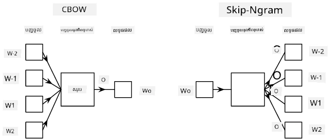

# ការគំរូភាសា

ការបញ្ចូលអត្ថន័យជា semantic embeddings ដូចជា Word2Vec និង GloVe គឺជាជំហានដំបូងទៅរក **ការគំរូភាសា** - បង្កើតមូដែលដែលយ៉ាងណាមួយអាច *យល់* (ឬ *តំណាង*) ទ្រព្យសម្បត្តិនៃភាសា។

## [សំណួរប្រលងមុនម៉ោងបង្រៀន](https://ff-quizzes.netlify.app/en/ai/quiz/29)

គំនិតសំខាន់នៅពីក្រោយការគំរូភាសាគឺការបណ្តុះបណ្តាលនៅលើទិន្នន័យមិនមានស្លាក ជារបៀបមិនគ្រប់គ្រង។ វាមានសារៈសំខាន់ព្រោះយើងមានចំនួនអត្ថបទមិនមានស្លាកច្រើន ខណៈដែលចំនួនអត្ថបទមានស្លាកតែងតែមានកំណត់ដោយកំលាំងដែលយើងអាចចំណាយដើម្បីស្លាក។ ភាគច្រើន ពួកយើងអាចបង្កើតមូដែលភាសាដែលអាច **ព្យាករណ៍ពាក្យដែលអាបាន** នៅក្នុងអត្ថបទ ព្រោះវាស្រួលក្នុងការលាក់ពាក្យចៃដន្យមួយក្នុងអត្ថបទ និងប្រើវាជាគំរូបណ្តុះបណ្តាល។

## បណ្តុះបណ្តាល Embeddings

ក្នុងឧទាហរណ៍មុនៗរបស់យើង យើងបានប្រើ semantic embeddings ដែលបានបណ្តុះបណ្តាលរួចហើយ ប៉ុន្តែវាគួរឲ្យចាប់អារម្មណ៍ក្នុងការមើលថាតើ embeddings ទាំងនោះអាចបណ្តុះបណ្តាលយ៉ាងដូចម្តេច។ មានគំនិតប៉ុន្មានដែលអាចប្រើបាន៖

* **N-Gram** ការគំរូភាសា ពេលដែលយើងព្យាករណ៍ token មួយដោយមើលទៅ N tokens មុន (N-gram)
* **Continuous Bag-of-Words** (CBoW) ពេលដែលយើងព្យាករណ៍ token កណ្តាល $W_0$ ក្នុងលំដាប់ token $W_{-N}$, ..., $W_N$។
* **Skip-gram**, ដែលយើងព្យាករណ៍ក្រុម token ជាប់ខ្នៅ {$W_{-N},\dots, W_{-1}, W_1,\dots, W_N$} ពី token កណ្តាល $W_0$។

> រូបភាពពី [អត្ថបទនេះ](https://arxiv.org/pdf/1301.3781.pdf)

## ✍️ សៀវភៅកត់ត្រាឧទាហរណ៍៖ បណ្តុះបណ្តាលម៉ូដែល CBoW

បន្តការសិក្សារបស់អ្នកនៅក្នុងសៀវភៅកត់ត្រាខាងក្រោម៖

* [បណ្តុះបណ្តាល CBoW Word2Vec ជាមួយ TensorFlow](CBoW-TF.ipynb)
* [បណ្តុះបណ្តាល CBoW Word2Vec ជាមួយ PyTorch](CBoW-PyTorch.ipynb)

## សេចក្តីសន្និដ្ឋាន

ក្នុងមេរៀនមុន យើងបានឃើញថា word embeddings ធ្វើការដូចជាមនុស្សមេដឹកនាំ! ឥឡូវនេះយើងដឹងថាការបណ្តុះបណ្តាល word embeddings មិនមែនជាការងារលំបាកណាស់ទេ ហើយយើងគួរតែអាចបណ្តុះបណ្តាល word embeddings របស់ខ្លួនសម្រាប់អត្ថបទជាក់លាក់ខ្លះ ប្រសិនបើត្រូវការជា។

## [សំណួរប្រលងបន្ទាប់ពីម៉ោងបង្រៀន](https://ff-quizzes.netlify.app/en/ai/quiz/30)

## សិក្សាស្វ័យប្រវត្តិ និងពិនិត្យឡើងវិញ

* [មេរៀន PyTorch ផ្លូវការអំពីការគំរូភាសា](https://pytorch.org/tutorials/beginner/nlp/word_embeddings_tutorial.html).
* [មេរៀន TensorFlow ផ្លូវការអំពីការបណ្តុះបណ្តាលម៉ូដែល Word2Vec](https://www.TensorFlow.org/tutorials/text/word2vec).
* ការប្រើប្រាស់ បណ្ណាល័យ **gensim** សម្រាប់បណ្តុះបណ្តាល embeddings ដែលប្រើប្រាស់គ្រប់គ្រាន់ក្នុងជួរឈរខ្លីៗ ត្រូវបានពិពណ៌នាទៅ [ក្នុងឯកសារនេះ](https://pytorch.org/tutorials/beginner/nlp/word_embeddings_tutorial.html).

## 🚀 [កិច្ចការផ្ទះ៖ បណ្តុះបណ្តាលម៉ូដែល Skip-Gram](lab/README.md)

នៅក្នុងមន្ទីរពិសោធន៍ យើងឆ្លើយបញ្ហាឱ្យអ្នកកែប្រែកូដពីមេរៀននេះដើម្បីបណ្តុះបណ្តាលម៉ូដែល skip-gram ជំនួស CBoW។ [អានព័ត៌មានលម្អិត](lab/README.md)

---

<!-- CO-OP TRANSLATOR DISCLAIMER START -->
**ការបដិសេធ**៖  
ឯកសារនេះត្រូវបានបកប្រែដោយប្រើសេវាកម្មបកប្រែ AI [Co-op Translator](https://github.com/Azure/co-op-translator)។ ខណៈពេលយើងខំប្រឹងប្រែងសម្រាប់ភាពត្រឹមត្រូវ សូមជ្រាបថាការបកប្រែដោយស្វ័យប្រវត្តិអាចមានកំហុសឬការមិនត្រឹមត្រូវខ្លះៗ។ ឯកសារដើមនៅក្នុងភាសាដើមគួរត្រូវបានគេចាត់ទុកជាដើមទុនផ្លូវការជាងគេ។ សម្រាប់ព័ត៌មានសំខាន់ៗ គួរតែប្រើការបកប្រែដោយអ្នកជំនាញមនុស្សជាការណែនាំ។ យើងមិនទទួលបន្ទុកចំពោះការយល់ច្រឡំ ឬការបកប្រែខុសអ្វីៗដែលកើតឡើងពីការប្រើប្រាស់ការបកប្រែនេះទេ។
<!-- CO-OP TRANSLATOR DISCLAIMER END -->