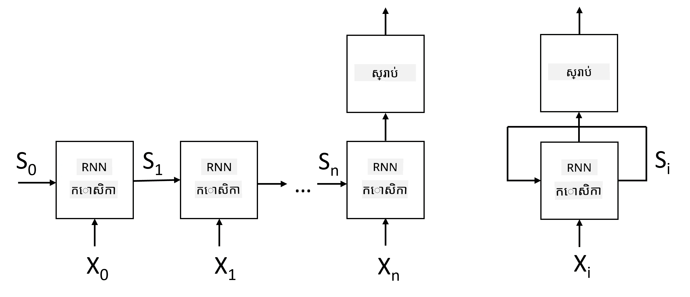
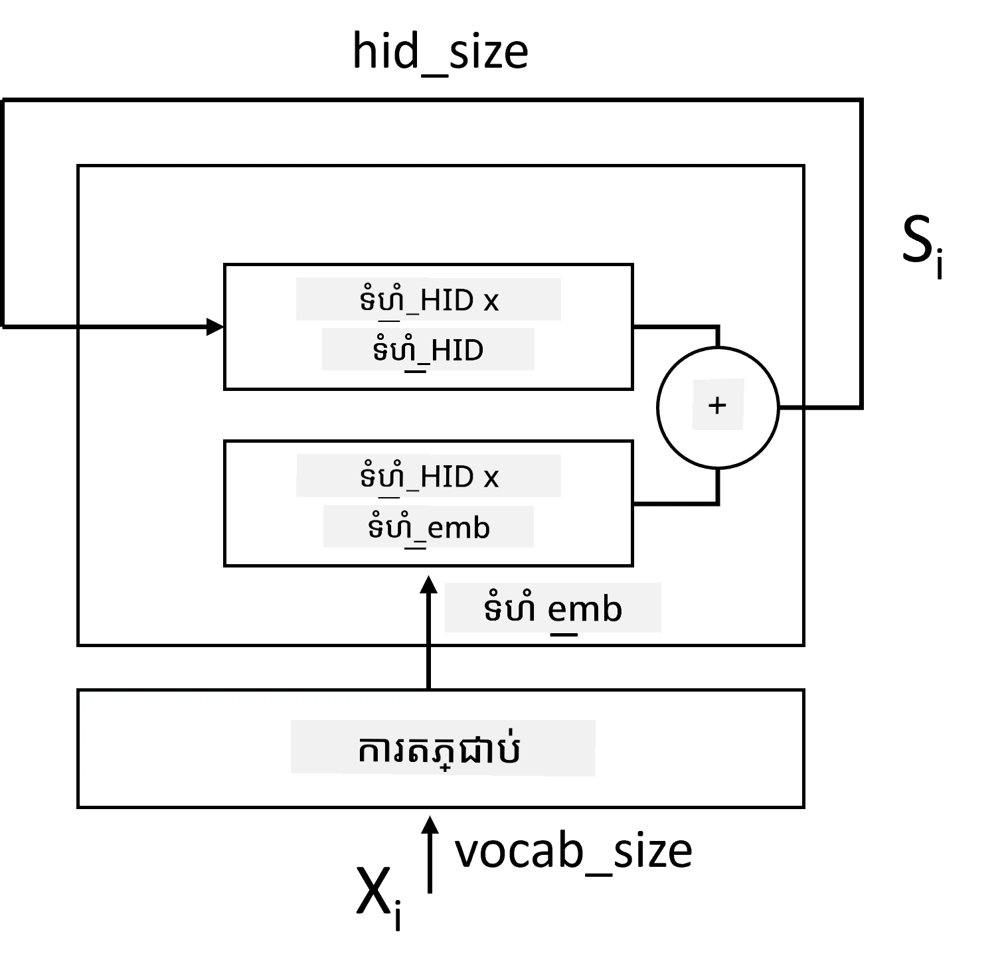
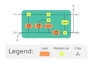
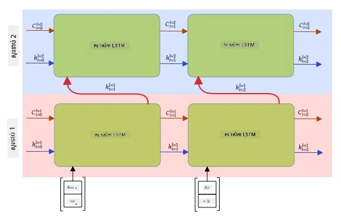

# បណ្ដាញប្រសាសន៍ផ្ទូតឆ្ពោះមុខវិញ

## [សំណួរប្រឡងមុនពេលសិក្សា](https://ff-quizzes.netlify.app/en/ai/quiz/31)

នៅក្នុងផ្នែកមុនៗ យើងបានប្រើប្រាស់តំណាងអត្ថន័យមានអត្ថន័យជាច្រើននៃអត្ថបទ និងឧបករណ៍ថ្នាក់ប៉ុណ្ណាយ្រិតមួយសាមញ្ញនៅលើអំពើបញ្ចូល។ រចនាសម្ព័ន្ធនេះធ្វើការចាប់យកន័យសរុបទាំងមូលនៃពាក្យនៅក្នុងប្រយោគ អ្វីដែលមិនបានគិតគូរពី **លំដាប់** នៃពាក្យទេ ព្រោះអនុបទបញ្ចូលមេដឹកនាំលើវាមិនទទួលបានព័ត៌មាននេះពីអត្ថបទដើមឡើយ។ ព្រោះម៉ូដែលទាំងនេះអត់អាចម៉ូដែលលំដាប់ពាក្យបាន អ្នកមិនអាចដោះស្រាយបញ្ហាស្មុគស្មាញ ឬចម្រូងចម្រាសដូចជា ការបង្កើតអត្ថបទ ឬការឆ្លើយសំណួរបាននោះទេ។

ដើម្បីចាប់យកន័យនៃរលកអត្ថបទមួយ យើងត្រូវប្រើសArchitecture បណ្ដាញប្រសាសន៍មួយផ្សេងទៀត ដែលហៅថា **បណ្ដាញប្រសាសន៍ផ្ទូតឆ្ពោះមុខវិញ** ឬ RNN។ ក្នុង RNN យើងផ្តល់ប្រយោគរបស់យើងតាមរយៈបណ្ដាញម៉ាស៊ីនមួយព្រមទាំងនិមួយៗនៃសញ្ញា ហើយបណ្ដាញបង្កើត**ស្ថានភាព**មួយ ដែលយើងនាំទៅផ្តល់បណ្ដាញម្តងទៀតជាមួយសញ្ញាបន្ទាប់។

> រូបភាពដោយអ្នកនិពន្ធ

ផ្ដល់លំដាប់បញ្ចូលនៃរ៉ូតេខ្សែ X0,...,Xn RNN បង្កើតជាសំណុំឯកត្តាបណ្ដាញប្រសាសន៍ ហើយបណ្តុះបណ្តាលសំណុំនេះពីដើមដល់ចុង ដោយប្រើវិធីត្រលប់ក្រោយ។ ឯកត្តាបណ្ដាញនីមួយៗទទួលយកគូ (Xi,Si) ជាបញ្ចូល ហើយផលិត Si+1 ជា​ផលលទ្ធផល។ ស្ថានភាពចុងក្រោយ Sn ឬ (លទ្ធផល Yn) ចូលទៅក្នុងឧបករណ៍ថ្នាក់ប៉ុណ្ណាយ្រិតដើម្បីបង្កើតលទ្ធផល។ ឯកត្តាបណ្ដាញទាំងអស់ចែករំលែកទំងន់ដដែល ហើយបានបណ្តុះបណ្តាលពីដើមដល់ចុង ដោយប្រើម្តងត្រលប់ក្រោយតែមួយ។

ដោយសារតែវ៉ិចទ័រស្ថានភាព S0,...,Sn ត្រូវបានផ្តល់ក្នុងបណ្ដាញ វាអាចរៀនអំពីភាពទាក់ទងរវាងពាក្យ។ ឧទាហរណ៍ ពេលពាក្យ *មិន* បង្ហាញនៅណាមួយក្នុងលំដាប់ វាអាចរៀនដើម្បីបដិសេធធាតុមួយចំនួនក្នុងវ៉ិចទ័រស្ថានភាព ដើម្បីបណ្តាលអោយមានការបដិសេធ។

> ✅ ព្រោះទំងន់របស់ឯកត្តាបណ្ដាញ RNNទាំងអស់លើរូបភាពខាងលើត្រូវបានចែករំលែក រូបភាពដូចគ្នាក៏អាចត្រូវបង្ហាញជា​ឯកត្តាមួយ (នៅខាងស្តាំ) ជាមួយច្រវាក់ប្រតិកម្មឡើងវិញ ដែលផ្ញើស្ថានភាពលទ្ធផលរបស់បណ្ដាញត្រឡប់ទៅការបញ្ចូលវិញ។

## រចនាសម្ព័ន្ធរបស់កោសិកា RNN

យើងមកមើលថាតើកោសិកា RNN សាមញ្ញត្រូវបានដាក់អ្វីខ្លះ។ វាទទួលយកស្ថានភាពមុន Si-1 និងសញ្ញាបច្ចុប្បន្ន Xi ជាបញ្ចូល ហើយត្រូវបង្កើតស្ថានភាពលទ្ធផល Si (ហើយពេលខ្លះយើងក៏ចាប់អារម្មណ៍លើលទ្ធផលផ្សេង Yi ដូចជា ក្នុងករណីបណ្ដាញបង្កើត)។

កោសិកា RNN សាមញ្ញមាន​ ម៉ាទ្រីចទម្ងន់ពីរ ក្នុងនោះមួយបម្លែងសញ្ញាបញ្ចូល (ហៅវា W) និងមួយផ្សេងបម្លែងស្ថានភាពបញ្ចូល (H)។ ក្នុងករណីនេះ លទ្ធផលនៃបណ្ដាញគណនាជា &sigma;(W&times;Xi+H&times;Si-1+b) ដែល &sigma; គឺជា អនុគមន៍សកម្ម និង b គឺ បាញ់បន្ថែម។

> រូបភាពដោយអ្នកនិពន្ធ

នៅករណីជាច្រើន រ៉ូតេខ្សែបញ្ចូលត្រូវបានផ្លាស់ប្តូរតាមស្រទាប់បញ្ចូលមុនពេលចូល RNN ដើម្បីកាត់បន្ថយវិមាត្រ។ ក្នុងករណីនេះ ប្រសិនបើវិមាត្រ វ៉ិចទ័របញ្ចូលគឺ *emb_size* និងវ៉ិចទ័រស្ថានភាពគឺ *hid_size* តែទំហំ W គឺ *emb_size*&times;*hid_size* ហើយទំហំ H គឺ *hid_size*&times;*hid_size*។

## អង្គចងចាំរយៈពេលខ្លី និងវែង (LSTM)

មួយក្នុងចំណោមបញ្ហាសំខាន់ៗនៃ RNN ចាស់ៗគឺបញ្ហា **សហន្សំកម្រាស់បាត់បង់**។ ព្រោះ RNN ត្រូវបានបណ្តុះបណ្តាលពីដើមដល់ចុងក្នុងមួយការត្រលប់ក្រោយទេវអាចមានកម្រិតពិបាកក្នុងការបញ្ជូនកំហុសទៅស្រទាប់ដំបូងៗ ក្នុងបណ្ដាញ ហើយដូច្នេះ បណ្ដាញមិនអាចរៀនទំនាក់ទំនងរវាងរ៉ូតេខ្សែនៅចម្ងាយបាន។ វិធីមួយដើម្បីជៀសវាងបញ្ហានេះគឺដាក់បញ្ចូល **ការគ្រប់គ្រងស្ថានភាពឲ្យច្បាស់លាស់** ដោយប្រើនូវអ្វីគេហៅថា **ច្រវាក់**។ មានរចនាសម្ព័ន្ធពីរដែលល្បីល្បាញ: **អង្គចងចាំរយៈពេលខ្លី និងវែង** (LSTM) និង **ឧបករណ៍ច្រវាក់ផ្ទេរបន្ទាត់** (GRU)។

> ប្រភពរូបភាព TBD

បណ្ដាញ LSTM ត្រូវបានរៀបចំដូច RNN សាមញ្ញ ប៉ុន្តែមានស្ថានភាពពីរត្រូវបានផ្ញើពីស្រទាប់ទៅស្រទាប់៖ ស្ថានភាពពិតប្រាកដ C និងវ៉ិចទ័រលាក់ H។ នៅក្នុងឯកត្តាណាមួយ វ៉ិចទ័រលាក់ Hi ត្រូវបានភ្ជាប់ជាមួយបញ្ចូល Xi ហើយគ្រប់គ្រងអ្វីដែលកើតឡើងទៅស្ថានភាព C តាមរយៈ **ច្រវាក់**។ ច្រវាក់នីមួយៗគឺជាបណ្ដាញប្រសាសន៍ ដែលមានអនុគមន៍ស៊ីហ្គម៉ូយ៉ោង (លទ្ធផលក្នុងជួរពី [0,1]) ដែលអាចគិតថាជាវ៉ាក់ម៉ាស់លើអថេរស្ថានភាព។ មានច្រវាក់ដូចខាងក្រោម (ពីឆ្វេងទៅស្តាំនៅក្នុងរូបភាពខាងលើ)៖

* ច្រវាក់ **ភ្លេច** ទទួលវ៉ិចទ័រលាក់ ហើយកំណត់ថាធាតុណានៃវ៉ិចទ័រ C យើងត្រូវភ្លេច ហើយធាតុណាត្រូវឲ្យផ្លាស់ដំណើរការ។
* ច្រវាក់ **បញ្ចូល** ទទួលព័ត៌មានពីវ៉ិចទ័របញ្ចូល និងវ៉ិចទ័រលាក់ ហើយបញ្ចូលព័ត៌មានទៅស្ថានភាព។
* ច្រវាក់ **លទ្ធផល** បម្លែងស្ថានភាពតាមរយៈស្រទាប់លីនេអ៊ែរ ដែលមានអនុគមន៍ *tanh* ហើយជ្រើសរើសធាតុខ្លះៗនៅក្នុងវ៉ិចទ័រលាក់ Hi ដើម្បីបង្កើតស្ថានភាពថ្មី Ci+1។

ធាតុនៃស្ថានភាព C អាចគិតថាជាគ្រឿងញៀនលើក្សណ៍ ដែលអាចបិទបើកបាន។ ឧទាហរណ៍ នៅពេលយើងប្រទះឈ្មោះ *Alice* ក្នុងលំដាប់ នោះយើងអាចកំណត់ថាវាសំដៅលើតួអក្សរមួយជាប្រភេទស្រី ហើយជំរុញប៊្លាកនៅក្នុងស្ថានភាព ដែលយើងមាននាមប្រុសម្នាក់ក្នុងប្រយោគ។ នៅពេលក្រោយប្រទះប្រយោគ * និង Tom* យើងនឹងដាក់ប៊្លាកថាមាននាមពហុ។ ដូច្នេះ ដោយការគ្រប់គ្រងស្ថានភាពយើងអាចអនុញ្ញាតឱ្យតាមដានលក្ខណៈវេយ្យាករណ៍នៃផ្នែកប្រយោគបាន។

> ✅ សម្រង់ដ៏ល្អសម្រាប់យល់ពីរចនាសម្ព័ន្ធក្នុង LSTM គឺអត្ថបទល្អនេះ [Understanding LSTM Networks](https://colah.github.io/posts/2015-08-Understanding-LSTMs/) ដោយ Christopher Olah។

## បណ្ដាញ RNN មុខ និងច្រើនស្រទាប់

យើងបានពិភាក្សាពីបណ្ដាញបញ្ចូលតែមួយទិស ពីចំណុចចាប់ផ្តើម រហូតដល់ចុង។ វាល្អសមរម្យ ព្រោះវាស្រដៀងនឹងរបៀបដែលយើងអាន និងស្តាប់សន្ទនា។ ទោះជាយ៉ាងណា ព្រោះនៅក្នុងករណីជាច្រើន យើងអាចចូលដំណើរការលំដាប់បញ្ចូលដោយចៃដន្យ យើងអាចគួរត្រពិនិត្យការគណនាបញ្ចូលនៅទិសទាំងពីរ។ បណ្ដាញបែបនេះហៅថា **បណ្ដាញ RNN មុខ និងសម្រា** (bidirectional RNNs)។ នៅពេលប្រើបណ្ដាញបែបនេះ យើងត្រូវការវ៉ិចទ័រស្ថានភាពលាក់ពីរផ្នែក សម្រាប់ទិសនីមួយៗ។

បណ្ដាញបញ្ចូល (recurrent network) មួយ មិនថាមានទិសតែមួយ ឬសម្រា ក៏មានកម្លាំងក្នុងការចាប់យកលំនាំណាមួយក្នុងលំដាប់ ហើយអាចរក្សាទុកវាទៅក្នុងវ៉ិចទ័រស្ថានភាព ឬផ្ញើវាទៅលទ្ធផល។ ដូចជាបណ្ដាញ convolutional យើងអាចបង្កើតស្រទាប់បញ្ចូលមួយទៀតលើស្រទាប់ដំបូង ដើម្បីចាប់យកលំនាំកម្រិតខ្ពស់ និងបង្កើតលំនាំពីលំនាំកម្រិតទាបដែលបានបំបែកដោយស្រទាប់ដំបូង។ វារួមបញ្ចូលយើងដល់ពាក្យថា **បណ្ដាញ RNN ច្រើនស្រទាប់** ដែលមានពីរឬច្រើនបណ្ដាញបញ្ចូល ដែលលទ្ធផលអំពីស្រទាប់មុន ត្រូវបានផ្គត់ផ្គង់ទៅស្រទាប់បន្ទាប់ជាបញ្ចូល។

*រូបភាព​ពី [អត្ថបទដ៏អស្ចារ្យនេះ](https://towardsdatascience.com/from-a-lstm-cell-to-a-multilayer-lstm-network-with-pytorch-2899eb5696f3) ដោយ Fernando López*

## ✍️ កិច្ចការអនុវត្ត៖ Embeddings

បន្តការរៀនរបស់អ្នកនៅក្នុងសៀវភៅដំណើរការខាងក្រោម៖

* [RNNs ជាមួយ PyTorch](RNNPyTorch.ipynb)
* [RNNs ជាមួយ TensorFlow](RNNTF.ipynb)

## សង្ខេប

នៅក្នុងផ្នែកនេះ យើងបានឃើញថា RNN អាចត្រូវបានប្រើសម្រាប់ចំណាត់ថ្នាក់លំដាប់ ប៉ុន្តែនៅពិតវាអាចដោះស្រាយបញ្ហាច្រើនទៀតដូចជា ការបង្កើតអត្ថបទ ការប្រែសម្រួលម៉ាស៊ីន និងផ្សេងៗទៀត។ យើងនឹងពិចារណានូវបញ្ហានោះនៅផ្នែកបន្ទាប់។

## 🚀 តេស្តសាកល្បង

អានឯកសារមួយចំនួនអំពី LSTM និងពិចារណនេះក្នុងការអនុវត្ត៖

- [Grid Long Short-Term Memory](https://arxiv.org/pdf/1507.01526v1.pdf)
- [Show, Attend and Tell: Neural Image Caption
Generation with Visual Attention](https://arxiv.org/pdf/1502.03044v2.pdf)

## [សំណួរប្រឡងបន្ទាប់ពីសិក្សា](https://ff-quizzes.netlify.app/en/ai/quiz/32)

## ការត្រួតពិនិត្យ និងរៀនដោយខ្លួនឯង

- [Understanding LSTM Networks](https://colah.github.io/posts/2015-08-Understanding-LSTMs/) ដោយ Christopher Olah។

## [កិច្ចការជាសៀវភៅ](assignment.md)

---

<!-- CO-OP TRANSLATOR DISCLAIMER START -->
**ការបញ្ជាក់**៖  
ឯកសារនេះត្រូវបានបម្លែងភាសាដោយប្រើសេវាកម្មបកប្រែ AI [Co-op Translator](https://github.com/Azure/co-op-translator)។ ខណៈពួកយើងខិតខំរកភាពត្រឹមត្រូវ សូមយល់ដឹងថា ការបកប្រែដោយស្វ័យប្រវត្តិស័ព្ទអាចមានកំហុសឬភាពមិនច្បាស់លាស់។ ឯកសារដើមក្នុងភាសាមាតុភូមិគួរត្រូវបានគិតជារឿងដ៏មានអំណាចជាឯកសារដើម។ សម្រាប់ព័ត៌មានសំខាន់ៗ សូមណែនាំឲ្យប្រើបកប្រែដោយមនុស្សជំនាញ។ ពួកយើងមិនទទួលខុសត្រូវចំពោះការយល់ច្រឡំ ឬការបកស្រាយឆ្គងណាមួយដែលផុសចេញពីការប្រើប្រាស់ការបកប្រែនេះទេ។
<!-- CO-OP TRANSLATOR DISCLAIMER END -->