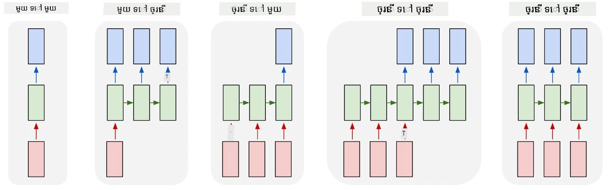
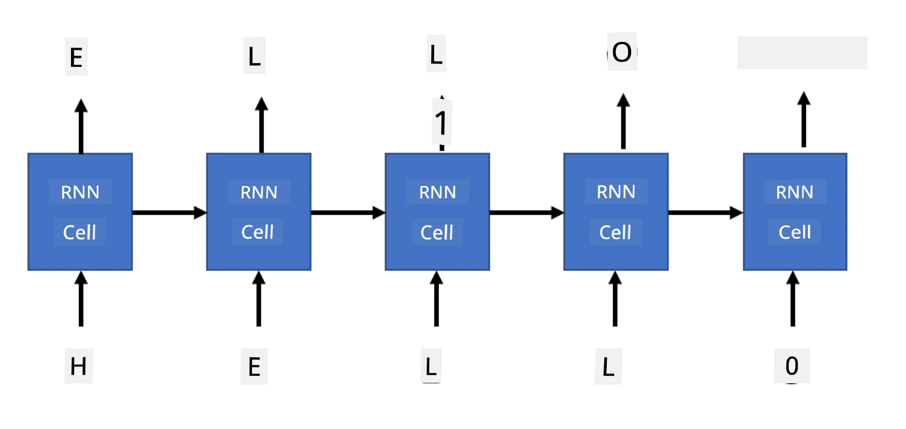
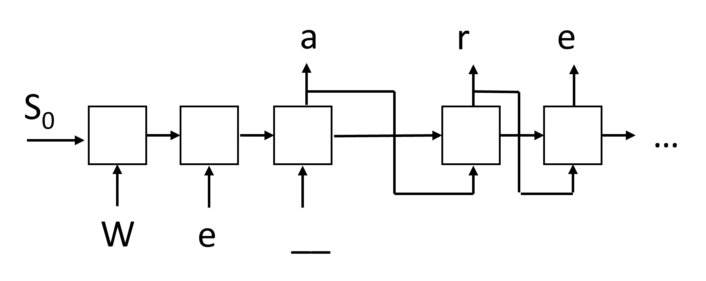

# បណ្តាហ្ស៊ីនហ្សិន

## [ការប្រលងមុនមេរៀន](https://ff-quizzes.netlify.app/en/ai/quiz/33)

បណ្តាញប្រព័ន្ធសរសេរការត្រឡប់ (RNNs) និងបែបផែនកោសិកាគ្រប់គ្រងរបស់វា ដូចជាកោសិកាចងចាំរយៈពេលវែង (LSTMs) និងឯកតាចងចាំត្រឡប់ជ្រុល (GRUs) ផ្តល់នូវយន្តការសម្រាប់ការម៉ូដែលភាសា ដែលពួកវាអាចរៀនពីការរៀបចំពាក្យ ហើយផ្តល់ការព្យាករណ៍សម្រាប់ពាក្យបន្ទាប់ក្នុងខ្សែ។ នេះអនុញ្ញាតឲ្យយើងប្រើប្រាស់ RNNs សម្រាប់ **ភារកិច្ចបង្កើត** ដូចជា ការបង្កើតអត្ថបទធម្មតា ការបកប្រែម៉ាស៊ីន ហើយត្រូវម្ដងលើការបង្កើតរូបភាពនៃការពិពណ៌នា។

> ✅ គិតអំពីពេលវេលាដែលអ្នកទទួលបានអត្ថប្រយោជន៍ពីភារកិច្ចបង្កើតដូចជាការបញ្ចប់អត្ថបទនៅពេលអ្នកវាយ។ ស្វែងយល់បន្ថែមអំពីកម្មវិធីដែលអ្នកចូលចិត្ត ដើម្បីមើលថាពួកវាប្រើប្រាស់ RNNs ឬទេ។

នៅក្នុងស្ថាបត្យកម្ម RNN ដែលយើងបានពិភាក្សាកន្លងមកក្នុងឯកត្តិមួយ មួយឯកតា RNN រៀងរាល់មួយបានបង្កើតស្ថានភាពលាក់បន្ទាប់ជាផលិតផល។ ទោះយ៉ាងណា យើងក៏អាចបន្ថែមការបញ្ចេញផ្សេងទៀតទៅឯកតាត្រឡប់មួយៗ ដែលអាចអនុញ្ញាតឱ្យយើងបញ្ចេញ **ខ្សែបន្ទាត់** (ដែលមានប្រវែងស្មើនឹងខ្សែដើម)។ លើសពីនេះ យើងអាចប្រើឯកតា RNN ដែលមិនទទួលបញ្ចូលក្នុងរៀងរាល់ជំហាន ហើយគ្រាន់តែទទួលវ៉ិចទ័រស្ថានភាពដំបូង ហើយបន្ទាប់មកបង្កើតខ្សែបញ្ចេញ។

នេះអនុញ្ញាតស្ថាបត្យកម្មប្រព័ន្ធសរសេរបុរាណផ្សេងៗដែលបង្ហាញនៅក្នុងរូបខាងក្រោម៖



> រូបភាពពីអត្ថបទប្លុក [Unreasonable Effectiveness of Recurrent Neural Networks](http://karpathy.github.io/2015/05/21/rnn-effectiveness/) ដោយ [Andrej Karpaty](http://karpathy.github.io/)

* **មួយទៅមួយ** គឺជាបណ្តាញប្រព័ន្ធប្រពៃណីមួយដែលមានបញ្ចូលមួយ និងបញ្ចេញមួយ
* **មួយទៅច្រើន** គឺជាស្ថាបត្យកម្មបង្កើត ដែលទទួលតម្លៃបញ្ចូលមួយ ហើយបង្កើតខ្សែតម្លៃបញ្ចេញច្រើន។ ឧទាហរណ៍ ប្រសិនបើយើងចង់បណ្តុះបណ្តាលបណ្តាញ **ពិពណ៌នារូបភាព** ដែលនឹងបង្កើតការពិពណ៌នាអក្សរអំពីរូបភាពមួយ យើងអាចយករូបភាពម្តងមួយជាការបញ្ចូល កាត់ចាយវាដោយ CNN ដើម្បីទទួលបានស្ថានភាពលាក់របស់វា ហើយបន្ទាប់មកឲ្យខ្សែត្រឡប់បង្កើតពាក្យពិពណ៌នាតិចតួចៗ
* **ច្រើនទៅមួយ** តំណាងឲ្យស្ថាបត្យកម្ម RNN ដែលយើងពិភាក្សាកន្លងមក ដូចជា ការកំណត់ចំណាត់ថ្នាក់អត្ថបទ
* **ច្រើនទៅច្រើន** ឬ **ខ្សែទៅខ្សែ** និយាយទៅដល់ភារកិច្ចដូចជា **ការបកប្រែម៉ាស៊ីន** ដែលនៅទីនេះការ RNN ដំបូងប្រមូលព័ត៌មានគ្រប់គ្រាន់ពីខ្សែបញ្ចូល ទៅក្នុងស្ថានភាពលាក់ ហើយខ្សែ RNN ទៀតម្ដងនឹងបំបែកស្ថានភាពនេះទៅជាខ្សែក្រុមផលិត។

នៅក្នុងឯកត្តិនេះ យើងនឹងផ្តោតលើម៉ូដែលបង្កើតសាមញ្ញ ដែលជួយយើងបង្កើតអត្ថបទ។ ដើម្បីសាមញ្ញ យើងនឹងប្រើវិធីបំបែកតួអក្សរសម្រាប់ tokenize។

យើងនឹងបណ្តុះបណ្តាល RNN នេះដើម្បីបង្កើតអត្ថបទជាជំហានៗ។ នៅរៀងរាល់ជំហាន យើងនឹងយកខ្សែអក្សរសំរាប់ប្រវែង `nchars` ហើយស្នើបណ្តាញឲ្យបង្កើតតួអក្សរបន្ទាប់សម្រាប់រាល់តួអក្សរបញ្ចូល៖



នៅពេលបង្កើតអត្ថបទ (ក្នុងនៅការព្យាករណ៍) យើងចាប់ផ្តើមជាមួយ **បញ្ហារូបមន្ដ** មួយ ដែលត្រូវបានផ្តល់ទៅតាមកោសិកា RNN ដើម្បីបង្កើតស្ថានភាពចំណុចកណ្ដាលរបស់វា ហើយបន្ទាប់មកពីស្ថានភាពនេះ ការបង្កើតនឹងចាប់ផ្តើម។ យើងបង្កើតតួអក្សរពីមួយទៅមួយ ហើយផ្ទុកស្ថានភាព និងតួអក្សរបង្កើតទៅកាន់កោសិកា RNN មួយទៀត សម្រាប់បង្កើតតួបន្ទាប់រហូតដល់បានច្រើនតួអក្សរគ្រប់គ្រាន់។



> រូបភាពដោយអ្នកនិពន្ធ

## ✍️ អនុវត្ត: បណ្តាហ្ស៊ីនហ្សិន

បន្តការសិក្សារបស់អ្នកនៅក្នុងសៀវភៅកំណត់ត្រាខាងក្រោម៖

* [បណ្តាហ្ស៊ីនហ្សិនជាមួយ PyTorch](GenerativePyTorch.ipynb)
* [បណ្តាហ្ស៊ីនហ្សិនជាមួយ TensorFlow](GenerativeTF.ipynb)

## ការបង្កើតអត្ថបទទន់ និងសីតុណ្ហភាព

លទ្ធផលមួយចំនួននៃកោសិកា RNN គឺចែកចាយប្រូបាប(probability distribution) នៃតួអក្សរ។ ប្រសិនបើយើងគ្រប់ពេលរើសតួអក្សរដែលមានប្រូបាបខ្ពស់ជាងគេជាតួបន្ទាប់ក្នុងអត្ថបទដែលបង្កើត វាអាចធ្វើឲ្យអត្ថបទកើតមានការចងក្រងតួអក្សរដូចគ្នាដងទៀតដងទៀត ប៉ុន្តែក្នុងឧទាហរណ៍នេះ៖

```
today of the second the company and a second the company ...
```

ទោះយ៉ាងណា បើយើងមើលការចែកចាយប្រូបាបសម្រាប់តួបន្ទាប់ វាអាចមានភាពខុសគ្នាគ្នាតិច ប៉ុន្តែមិនមែនធំពេញលេញដែរ តើយ៉ាងណា ឧទាហរណ៍មួយតួអក្សរអាចមានប្រូបាប 0.2 ហើយតួអក្សរមួយទៀត 0.19 ជាដើម។ ដូចគ្នានៅពេលយើងស្វែងរកតួបន្ទាប់សម្រាប់ខ្សែ '*play*' តួបន្ទាប់អាចជាសឹងតែជាផ្ទាំងទំនេរ ឬ **e** (ដូចជា *player*) ។

នេះនាំឲ្យយើងសន្និដ្ឋានថា វាមិនតម្រូវអោយយកតួអក្សរដែលមានប្រូបាបខ្ពស់ជាងគេលើកទីមួយ ព្រោះការជ្រើសរើសតួបន្ទាប់ដែលមានប្រូបាបទីពីរ អាចនៅតែបណ្តាលឯណាក្នុងអត្ថបទមានន័យ។ វាជាជម្រើសដែលប្រសើរជាងហើយគឺ **រាយកម្ម** តួអក្សរពីចែកចាយប្រូបាបដែលបណ្តាញផ្តល់។ យើងអាចប្រើប៉ារ៉ាម៉ែត្រ **សីតុណ្ហភាព** ដែលនឹងធ្វើឲ្យចែកចាយប្រូបាបត្រង់ណាស់ បើយើងចង់បន្ថែមភាពចៃដន្យ ឬធ្វើឲ្យចែកចាយនេះវែងខ្លាំង ប្រសិនបើយើងចង់ជាប់ខ្លាំងជាមួយតួអក្សរដែលមានប្រូបាបខ្ពស់បំផុត។

ធ្វើការស្រាវជ្រាវពីរបៀបបង្កើតអត្ថបទទន់នេះនៅក្នុងសៀវភៅកំណត់ត្រាដែលបានភ្ជាប់ខាងលើ។

## សេចក្តីសន្និដ្ឋាន

ខណៈពេលដែលការបង្កើតអត្ថបទអាចមានប្រយោជន៍ដោយខ្លួនឯង ការប្រយោជន៍សំខាន់គឺការអាចបង្កើតអត្ថបទប្រើប្រាស់ RNNs ពីវ៉ិចទ័រជាលក្ខណៈដំបូងមួយ។ ឧទាហរណ៍ ការបង្កើតអត្ថបទត្រូវបានប្រើក្នុងការបកប្រែម៉ាស៊ីន (sequence-to-sequence នៅទីនេះវ៉ិចទ័រស្ថានភាពពី *encoder* ត្រូវបានប្រើសម្រាប់បង្កើត ឬ *decode* សារ ប្រែប្រាស់) ឬបង្កើតការពិពណ៌នាអក្សរសម្រាប់រូបភាព (នៅទីនេះវ៉ិចទ័រត្រួតត្រានឹងមកពីឧបករណ៍ CNN)។

## 🚀 ប្រយុទ្ធ

ចូលរួមមេរៀន Microsoft Learn លើប្រធានបទនេះ

* ការបង្កើតអត្ថបទជាមួយ [PyTorch](https://docs.microsoft.com/learn/modules/intro-natural-language-processing-pytorch/6-generative-networks/?WT.mc_id=academic-77998-cacaste)/[TensorFlow](https://docs.microsoft.com/learn/modules/intro-natural-language-processing-tensorflow/5-generative-networks/?WT.mc_id=academic-77998-cacaste)

## [ការប្រលងបន្ទាប់ម៉េរៀន](https://ff-quizzes.netlify.app/en/ai/quiz/34)

## ពិនិត្យឡើងវិញ និង អប់រំខ្លួនឯង

នេះជាអត្ថបទមួយចំនួនសម្រាប់ពង្រីកចំណេះដឹងរបស់អ្នក

* វិធីសាស្រ្តផ្សេងៗសម្រាប់បង្កើតអត្ថបទជាមួយ Markov Chain, LSTM និង GPT-2: [អត្ថបទប្លុក](https://towardsdatascience.com/text-generation-gpt-2-lstm-markov-chain-9ea371820e1e)
* គំរូការបង្កើតអត្ថបទនៅក្នុង [ឯកសារ Keras](https://keras.io/examples/generative/lstm_character_level_text_generation/)

## [ការប្រឡង](lab/README.md)

យើងបានឃើញរបៀបបង្កើតអត្ថបទតាមតួអក្សរតួតាមតួ។ នៅក្នុងមន្ទីរពិសោធន៍ អ្នកនឹងស្វែងយល់ពីការបង្កើតអត្ថបទកម្រិតពាក្យ។

---

<!-- CO-OP TRANSLATOR DISCLAIMER START -->
**ការព្រមាន**៖  
ឯកសារនេះត្រូវបានបកប្រែដោយប្រើសេវាបកប្រែ AI [Co-op Translator](https://github.com/Azure/co-op-translator)។ ខណៈពេលដែលយើងព្យាយាមរកភាពត្រឹមត្រូវ សូមជ្រាបថាការបកប្រែដោយស្វ័យប្រវត្តិអាចមានកំហុស ឬមិនត្រឹមត្រូវ។ ឯកសារដើមនៅភាសាមាតុភាសាគួរត្រូវបានឲ្យខ្ទង់ជាធាតុមានសក្ដានុពលចម្បង។ សម្រាប់ព័ត៌មានសំខាន់ ការបកប្រែដោយមនុស្សជំនាញត្រូវបានណែនាំ។ យើងមិនទទួលខុសត្រូវចំពោះការយល់ច្រឡំ ឬការបកអ្រាយខុសឆ្គងដែលកើតមានពីការប្រើប្រាស់ការបកប្រែនេះឡើយ។
<!-- CO-OP TRANSLATOR DISCLAIMER END -->