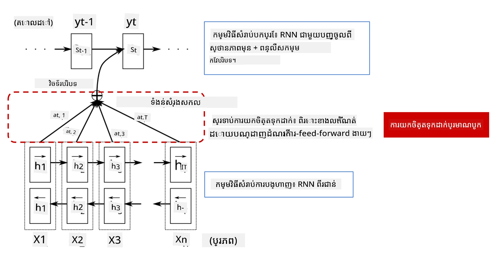
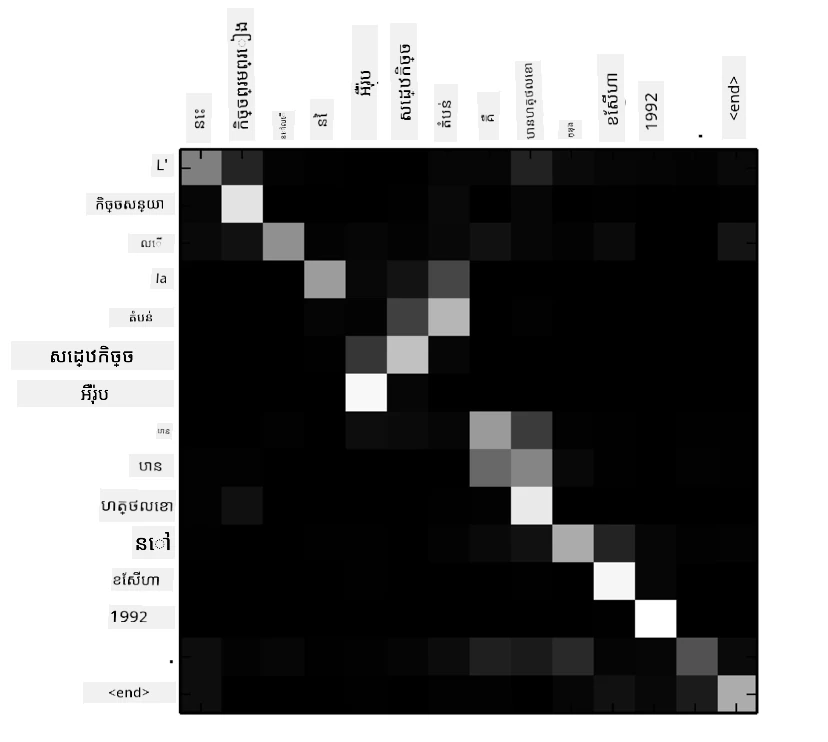
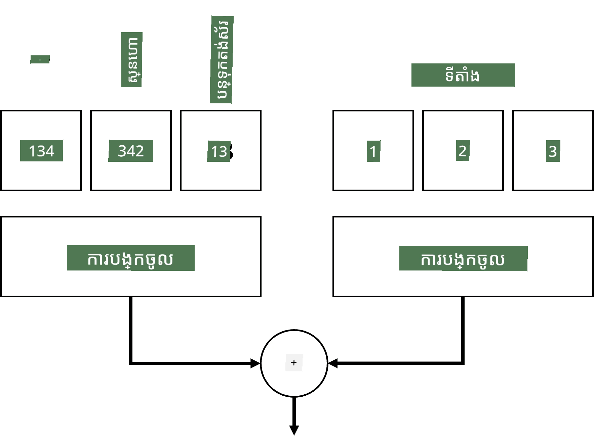
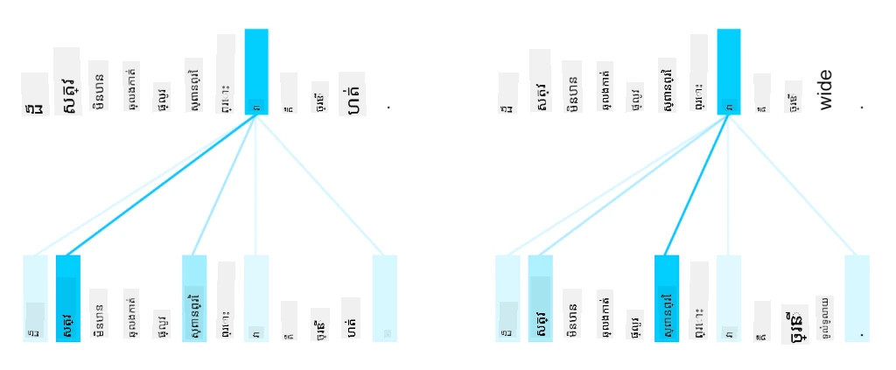
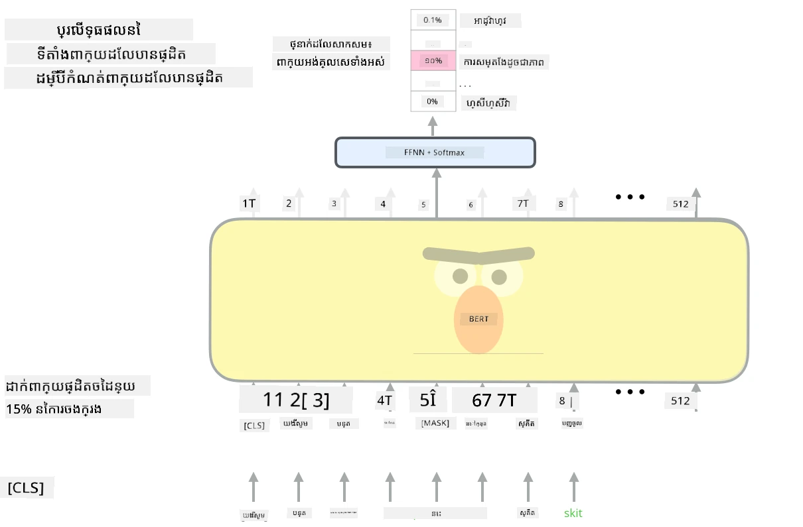

# យន្តការយកចិត្តទុកដាក់ និងម៉ាស៊ីនបំលែង

## [តេស្តមុនវគ្គសិក្សា](https://ff-quizzes.netlify.app/en/ai/quiz/35)

មួយក្នុងចំណោមបញ្ហាទំាងអស់សំខាន់បំផុតនៅក្នុងដែនកំណត់ភាសា NLP គឺ **ការបំលែងភាសាម៉ាស៊ីន** ជាបេសកកម្មសំខាន់ដែលគ្របដណ្តប់ឧបករណ៍ដូចជា Google Translate។ នៅក្នុងផ្នែកនេះ យើងនឹងផ្ដោតលើការបំលែងភាសាម៉ាស៊ីន ឬផ្ទុយទៅវិញ ទាំងមូលលើបេសកកម្ម *sequence-to-sequence* តែម្តង (ដែលត្រូវបានហៅថា **sentence transduction** ហើយ)។

ជាមួយ RNNs បេសកកម្ម sequence-to-sequence ត្រូវបានអនុវត្តដោយបណ្តាញរំលងពីរដង ដែលបណ្តាញមួយ គឺ **encoder** បូកសំណុំនៃវាលបញ្ចូលទៅជារូបភាពស្មុគស្មាញមួយ ខណៈបណ្តាញមួយទៀត គឺ **decoder** ពន្លត់ស្ថានភាពស្មុគស្មាញនេះឲ្យក្លាយជាលទ្ធផលបកប្រែ។ មានបញ្ហាមួយចំនួនជាមួយវិធីសាស្រ្តនេះ៖

* ស្ថានភាពចុងក្រោយនៃបណ្តាញ encoder ពិបាកចងចាំចំណុចចាប់ផ្តើមនៃប្រយោគ ដូច្នេះបណ្តាលឲ្យគុណភាពម៉ូឌែលសម្រាប់ប្រយោគវែងមានភាពខ្សោយ
* ពាក្យទាំងអស់ក្នុងលំដាប់មួយមានឥទ្ធិពលដូចគ្នាទៅលទ្ធផល។ តែតាមពិត ការពិតក្រៅពីនេះ ពាក្យជាក់លាក់មួយចំនួនក្នុងលំដាប់បញ្ចូល ឥទ្ធិពលច្រើនជាងទៅលទ្ធផលរៀងៗខ្លួន។

**យាន្ដការយកចិត្តទុកដាក់** ផ្តល់វិធីសាស្រ្តនៃការផ្តល់ទំងន់ជាន់ខ្ពស់នៃឥទ្ធិពលបរិបទនៃវ៉ិចទ័របញ្ចូលមួយៗលើការព្យាករណ៍លទ្ធផលនៃ RNN។ វា​អនុវត្តដោយបង្កើតផ្លូវប្រាំបញ្ចីរវាងស្ថានភាពចុងចន្លោះនៃ RNN បញ្ចូល និង RNN ផលិត។ ដូច្នេះ នៅពេលបង្កើតនិមិត្ត yt យើងនឹងពិចារណាទាំងស្ថានភាពស្មុគស្មាញទាំងអស់ hi ដែលមានទំងន់ផ្សេងៗ &alpha;t,i។

> ម៉ូឌែល encoder-decoder ជាមួយយន្តការយកចិត្តទុកដាក់បន្ថែមនៅក្នុង [Bahdanau et al., 2015](https://arxiv.org/pdf/1409.0473.pdf), យោងតាម [បទប្លុកនេះ](https://lilianweng.github.io/lil-log/2018/06/24/attention-attention.html)

លំហាត់ចំណុច {&alpha;i,j} នឹងតំណាងឲ្យកម្រិតដែលពាក្យចូលខ្លះៗលេងតួនាទីក្នុងការបង្កើតពាក្យមួយឲ្យបាននៅក្នុងលំដាប់លទ្ធផល។ ខាងក្រោមគឺជាគំរូលំហាត់ចំណុចដូចនេះ៖

> រូបភាពពី [Bahdanau et al., 2015](https://arxiv.org/pdf/1409.0473.pdf) (រូប.3)

យន្តការយកចិត្តទុកដាក់មានការទទួលខុសត្រូវច្រើនក្នុងសម័យបច្ចុប្បន្នឬជិតសម័យនៃការបង្កើតម៉ូឌែល NLP ដែលមានគុណភាពខ្ពស់។ ការបន្ថែមយកចិត្តទុកដាក់យ៉ាងខ្លាំងបង្កើតចំនួនប៉ារ៉ាម៉ែត្ររបស់ម៉ូឌែលច្រើនច្បាស់ ដែលនាំឲ្យមានបញ្ហាការពង្រីកជាមួយ RNNs។ ការកំណត់មួយសំខាន់នៃការពង្រីក RNN គឺថាបន្ទុកចម្រាស់របស់ម៉ូឌែលធ្វើឲ្យពិបាកក្នុងការបង្រួមកញ្ចប់ និងជំរុញការបង្រៀននៅជាក្រុម។ នៅក្នុង RNN ធាតុក្នុងលំដាប់ត្រូវតែប៉ាប់បញ្ចូលតាមជំហាន​តែមួយ ដែលមានន័យថាវាទាមទារប្រតិបត្តិការតាមលំដាប់មិនអាចជាជាងករណីលើកទៅប្រព័ន្ធបាន។

> រូបភាពពី [Blog របស់ Google](https://research.googleblog.com/2016/09/a-neural-network-for-machine.html)

ការទទួលយកយន្តការយកចិត្តទុកដាក់រួមជាមួយកំណត់ហេតុនេះនាំឲ្យបង្កើតម៉ូឌែលកម្មវិធីបំលែង (Transformer) ដែលជាគោលការណ៍ខាងមុខដែលពេលនេះយើងធ្លាប់ប្រើដូចជា BERT និង Open-GPT3។

## ម៉ូឌែល Transformer

មួយក្នុងចំណោមគំនិតសំខាន់ពីក្រោយម៉ូឌែល transformer គឺដើម្បីលើកលែងលក្ខណៈជាប់លំដាប់តាមដំណាក់កាលរបស់ RNN ហើយបង្កើតម៉ូឌែលដែលអាចដំណើរការជាជួរប្រតិបត្តិការ ក្នុងអំឡុងពេលបង្រៀន។ វាត្រូវបានសម្រេចដោយអនុវត្តពីគំនិតពីរដូចខាងក្រោម៖

* ការបំលែងតំណាងទីតាំង
* ការប្រើម៉ាស៊ីនយកចិត្តទុកដាក់ខ្លួនឯង (self-attention) ដើម្បីចាប់យកលំនាំជំនួស RNNs (ឬ CNNs) (ហើយហើយហេតុអ្វីបានជា អត្ថបទដែលផ្ដល់បទបង្ហាញម៉ូឌែល transformer មានឈ្មោះថា *[Attention is all you need](https://arxiv.org/abs/1706.03762)*)

### ការបំលែង/បញ្ចូលតំណាងទីតាំង

គំនិតនៃការបំលែងតំណាងទីតាំងគឺដូចតទៅ៖  
1. នៅពេលប្រើ RNNs ទីតាំងសម្គាល់ឬលំដាប់សមាសធាតុត្រូវតែត្រួតពិនិត្យដោយចំនួនជំហាន, ដូច្នេះមិនចាំបាច់ត្រូវបង្ហាញយ៉ាងច្បាស់។  
2. ប៉ុន្តែរ ពេលយើងប្ដូរទៅយកចិត្តទុកដាក់ (attention), យើងត្រូវការបង្ហាញទីតាំងសមាតិកាផ្ទាល់ក្នុងលំដាប់។  
3. ដើម្បីទទួលបានការបំលែងតំណាងទីតាំង យើងបន្ថែមលំដាប់តំណាងទីតាំងចូលទៅក្នុងលំដាប់សញ្ញាជាបញ្ចប់ (គឺលំដាប់លេខ 0,1, ...)។  
4. បន្ទាប់មកយើងលាយទីតាំងនោះជាមួយវ៉ិចទ័របញ្ចូលមួយ។ ដើម្បីបំលែងទីតាំង (គត់)ទៅជាវ៉ិចទ័រ វាអាចប្រើវិធីខុសៗគ្នាៈ

* ការបញ្ចូលដែលអាចបង្រៀនបាន (trainable embedding) ដូចជាការបញ្ចូលពាក្យ។ វា​គឺជា​វិធីសាស្រ្តដែលយើងពិចារណាទីនេះ។ យើងអនុវត្តស្រទាប់បញ្ចូលលើទាំងពាក្យនិងទីតាំងរបស់វា បង្កើតវ៉ិចទ័របញ្ចូលមានទំហំដូចគ្នា ហើយបូកវាចូលគ្នា។
* មុខងារបំលែងទីតាំងដែលកំណត់ជាលក្ខណៈថេរ ដូចបានបង្ហាញនៅក្នុងអត្ថបទដើម។

> រូបភាពដោយអ្នកនិពន្ធ

លទ្ធផលដែលយើងទទួលបានជាមួយការបញ្ចូលតំណាងទីតាំងនោះ គឺបញ្ចូលទាំងពាក្យដើម និងទីតាំងរបស់វានៅក្នុងលំដាប់។

### ការយកចិត្តទុកដាក់ខ្លួនឯងច្រើនក្បាល (Multi-Head Self-Attention)

បន្ទាប់មក យើងត្រូវចាប់យកលំនាំខ្លះៗនៅក្នុងលំដាប់។ ដើម្បីធ្វើឲ្យបាននោះ ម៉ូឌែល transformer ប្រើម៉ាស៊ីន **self-attention** ដែលជាយន្តការយកចិត្តទុកដាក់ដែលអនុវត្តលើលំដាប់ដដែលជាទិន្នន័យបញ្ចូល និងលទ្ធផល។ ការអនុវត្ត self-attention អនុញ្ញាតឲ្យយើងយកបរិបទ **context** នៅក្នុងប្រយោគសំរាប់មើលថាពាក្យណាខ្លះគឺពាក់ព័ន្ធគ្នា។ ឧទាហរណ៍ វាអាចបង្ហាញបានថា ពាក្យណាខ្លះត្រូវបានយោងដោយកំណត់ coreferences ដូចជា *it* និងនឹងយកបរិបទទៅតាងៈ

> រូបភាពពី [Blog របស់ Google](https://research.googleblog.com/2017/08/transformer-novel-neural-network.html)

នៅក្នុងម៉ូឌែល transformers យើងប្រើ **Multi-Head Attention** ដើម្បីផ្តល់អំណាចឲ្យបណ្តាញចាប់យកទំនាក់ទំនងផ្សេងៗពីគ្នាច្រើនប្រភេទ, ឧ.ទំនាក់ទំនងពាក្យរយៈពេលវែង ប្រៀបនឹងរយៈពេលខ្លី, co-reference ប្រៀបនឹងរឿងផ្សេងៗ។

[TensorFlow Notebook](TransformersTF.ipynb) មានព័ត៌មានលម្អិតបន្ថែមអំពីការអនុវត្តស្រទាប់ transformer។

### ការយកចិត្តទុកដាក់រវាង Encoder និង Decoder

នៅក្នុងម៉ូឌែល transformers, ដំណើរការយកចិត្តទុកដាក់ត្រូវបានប្រើនៅទីតាំងពីរប្រភេទ៖

* ចាប់យកលំនាំនៅក្នុងអត្ថបទបញ្ចូលដោយ self-attention
* ព្យាករណ៍បំលែងលំដាប់ - វាជាស្រទាប់យកចិត្តទុកដាក់រវាង encoder និង decoder។

ការយកចិត្តទុកដាក់រវាង encoder និង decoder ទាក់ទងយ៉ាងខ្លាំងនឹងយន្តការយកចិត្តទុកដាក់ដែលបានប្រើនៅក្នុង RNNs ដូចបានពិពណ៌នាពីដើមផ្នែកនេះ។ រូបភាពផ្ដោតអារម្មណ៍ជារូបចល័តនេះពន្យល់ពីតួនាទីរបស់ការយកចិត្តទុកដាក់ encoder-decoder។

ដោយសារតែទីតាំងបញ្ចូលនិមួយៗត្រូវបានផ្គូរផ្គងដោយឡែកទៅទីតាំងលទ្ធផលនិមួយៗ ម៉ូឌែល transformers អាចបង្រួមនិងផ្សព្វផ្សាយបានល្អជាង RNN ដែលអនុញ្ញាតឲ្យមានម៉ូឌែលភាសាធំធេង និងសកម្មភាពខ្ពស់។ ក្បាលយកចិត្តទុកដាក់នីមួយៗអាចរៀនទំនាក់ទំនងខុសៗគ្នារវាងពាក្យដែលជួយបង្កើនការងារប្រែសម្រួលភាសា NLP នៅក្រោយ។

## BERT

**BERT** (Bidirectional Encoder Representations from Transformers) គឺជា​បណ្តាញ transformer ជាច្រើនស្រទាប់ធំទូលាយ រួមមាន 12 ស្រទាប់សម្រាប់ *BERT-base* និង 24 ស្រទាប់សម្រាប់ *BERT-large*។ ម៉ូឌែលត្រូវបានបណ្ដុះបណ្ដាលដំបូងលើមណ្ឌលអត្ថបទធំមួយ (WikiPedia + សៀវភៅ) ដោយប្រើបច្ចេកទេសបណ្តុះបណ្តាលអស្រ័យថាស (unsupervised training) ដែលព្យាករណ៍ពាក្យដែលបានលាក់នៅក្នុងប្រយោគ។ ក្នុងអំឡុងពេលបណ្ដុះបណ្ដាល, ម៉ូឌែលស្រូបយកជំនាញភាសាច្រើនដែលបាច់ប្រើវាជាមួយទិន្នន័យផ្សេងទៀតដោយប្រើការតំរូវតំរូវល្អ (fine tuning)។ ដំណើរការនេះហៅថា **transfer learning**។

> រូបភាព [ប្រភព](http://jalammar.github.io/illustrated-bert/)

## ✍️ លំហាត់៖ Transformers

បន្តការសិក្សារបស់អ្នកនៅក្នុងកំណត់ត្រាព័ត៌មានដូចខាងក្រោម៖

* [Transformers in PyTorch](TransformersPyTorch.ipynb)
* [Transformers in TensorFlow](TransformersTF.ipynb)

## សេចក្ដីសន្និដ្ឋាន

នៅក្នុងមេរៀននេះ អ្នកបានរៀនអំពី ម៉ូឌែល Transformers និង យន្តការយកចិត្តទុកដាក់ ដែលជាឧបករណ៍សំខាន់ទាំងអស់នៅក្នុងប្រអប់ឧបករណ៍ NLP។ មានការប្រែប្រួលជាច្រើននៃស្ថាបត្យកម្ម Transformer រួមមាន BERT, DistilBERT, BigBird, OpenGPT3 និងផ្សេងទៀតដែលអាចតំរូវតំរូវបាន។ [កញ្ចប់ HuggingFace](https://github.com/huggingface/) ផ្ដល់ឃ្លាំងសម្រាប់បណ្តុះបណ្តាលម៉ូឌែលស្ថាបត្យកម្មទាំងនេះដោយប្រើ PyTorch និង TensorFlow។

## 🚀 បញ្ហាជម្រើស

## [តេស្តបន្ទាប់វគ្គសិក្សា](https://ff-quizzes.netlify.app/en/ai/quiz/36)

## ការត្រួតពិនិត្យ និងសិក្សាឯករាជ្យ

* [អត្ថបទប្លុក](https://mchromiak.github.io/articles/2017/Sep/12/Transformer-Attention-is-all-you-need/), ពន្យល់អំពីអត្ថបទបុរាណ [Attention is all you need](https://arxiv.org/abs/1706.03762) លើ transformers។  
* [ជួរអត្ថបទប្លុកមួយ](https://towardsdatascience.com/transformers-explained-visually-part-1-overview-of-functionality-95a6dd460452) ស្តីពី transformers ពន្យល់លំអិតពីស្ថាបត្យកម្ម។

## [ភារកិច្ច](assignment.md)

---

<!-- CO-OP TRANSLATOR DISCLAIMER START -->
**ចោលបំណុល**៖  
ឯកសារនេះត្រូវបានបំលែងភាសារដោយប្រើសេវាកម្មបំលែងភាសា AI [Co-op Translator](https://github.com/Azure/co-op-translator)។ ខណៈពេលដែលយើងខំប្រឹងប្រែងចំពោះភាពត្រឹមត្រូវ សូមជ្រាបថាការបំលែងភាសាដោយស្វ័យប្រវត្តិអាចមានកំហុស ឬអក្សរសម្រួលមិនត្រឹមត្រូវបានបង្ហាញ។ ឯកសារដើមដែលមាននៅក្នុងភាសាពិតប្រាកដគួរត្រូវបានពិចារណាថាជាត្រួតត្រាទិន្នន័យគោល។ សម្រាប់ព័ត៌មានសំខាន់ៗ សូមផ្ដល់អនុសាសន៍ឲ្យប្រើការបកប្រែដោយមនុស្សជំនាញ។ យើងមិនទទួលខុសត្រូវចំពោះការយល់ច្រឡំ ឬការបកប្រែខុសបញ្ចេញពីការប្រើប្រាស់ការបំលែងភាសានេះទេ។
<!-- CO-OP TRANSLATOR DISCLAIMER END -->