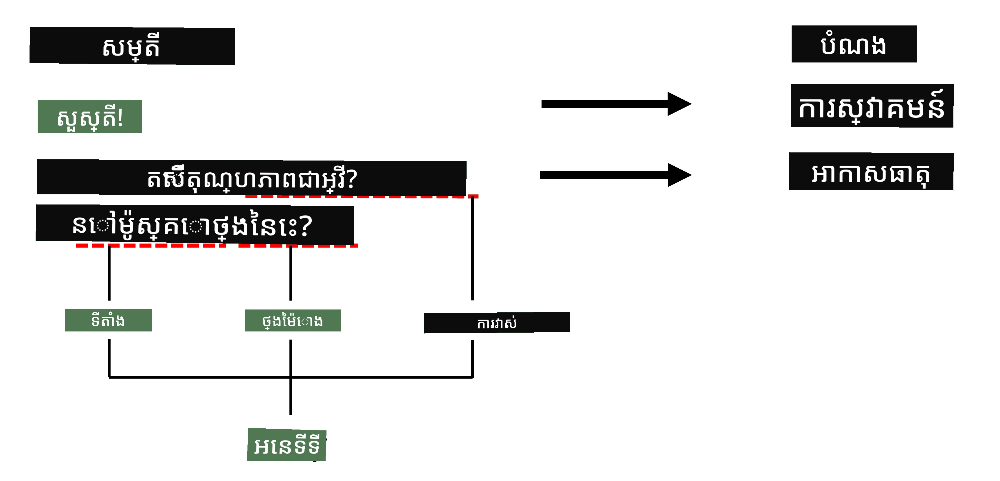

# ការទទួលស្គាល់អង្គភាពមានឈ្មោះ

រហូតមកដល់ឥឡូវនេះ យើងបានផ្ដោតសំខាន់ច្រើនលើភារកិច្ច NLP មួយគត់គ yaituការចាត់ថ្នាក់។ ទោះយ៉ាងណា ក៏មានភារកិច្ច NLP ផ្សេងទៀតដែលអាចត្រូវបានបំពេញដោយបណ្តាញប្រសាទ។ មួយក្នុងចំណោមភារកិច្ចទាំងនោះគឺ **[ការទទួលស្គាល់អង្គភាពមានឈ្មោះ](https://wikipedia.org/wiki/Named-entity_recognition)** (NER) ដែលពាក់ព័ន្ធនឹងការទទួលស្គាល់អង្គភាពជាក់លាក់នៅក្នុងអត្ថបទ ដូចជា ទីកន្លែង ឈ្មោះមនុស្ស រយៈពេលថ្ងៃ-ម៉ោង សមីការពុលរូបមន្តគីមី និងផ្សេងៗទៀត។

## [វីរុសសំណួរមុនមេរៀន](https://ff-quizzes.netlify.app/en/ai/quiz/37)

## ឧទាហរណ៍នៃការប្រើប្រាស់ NER

សន្និដ្ឋានថាអ្នកចង់អភិវឌ្ឍរកម្មវិធីជជែកភាសាធម្មជាតិដូចជា Alexa របស់ Amazon ឬ Google Assistant។ វិធីដែលកម្មវិធីជជែកឆ្លាតវៃដំណើរការពីរបៀបនេះគឺជា*យល់*ថាអ្នកប្រើប្រាស់ចង់បានអ្វី ដោយធ្វើការចាត់ថ្នាក់អត្ថបទលើប្រយោគដែលបញ្ចូល។ លទ្ធផលនៃការចាត់ថ្នាក់នេះមានឈ្មោះថា **គោលបំណង** ដែលកំណត់ថាកម្មវិធីជជែកត្រូវធ្វើអ្វី។

> រូបភាពដោយអ្នកនិពន្ធ

ទោះយ៉ាងណា អ្នកប្រើប្រាស់អាចផ្តល់ប៉ារ៉ាម៉ែត្រមួយចំនួនជា​ផ្នែកមួយនៃប្រយោគ។ ឧទាហរណ៍ ពេលសួរអំពីអាកាសធាតុ នាងអាចបញ្ជាក់ទីកន្លែង ឬកាលបរិច្ឆេទ។ បន្ទាប់មក កម្មវិធីជជែកគួរតែនឹងយល់អង្គភាពទាំងនោះ ហើយបំពេញទីកន្លែងប៉ារ៉ាម៉ែត្រឲ្យត្រឹមត្រូវ មុនពេលអនុវត្តសកម្មភាព។ នេះគឺជាកន្លែងដែល NER ពេញនិយម។

> ✅ ឧទាហរណ៍មួយទៀតនឹងជា [វិភាគអត្ថបទវេជ្ជសាស្ត្រអំពីវិទ្យាសាស្ត្រ](https://soshnikov.com/science/analyzing-medical-papers-with-azure-and-text-analytics-for-health/). អ្វីដែលយើងត្រូវតែរកមើលជាចម្បងគឺវាក្នុងពាក្យវេជ្ជសាស្ត្រជាក់លាក់ ដូចជាជម្ងឺ និងសារធាតុវេជ្ជសាស្ត្រ។ ទោះបីជាជម្ងឺតិចតួចមួយចំនួនអាចដកយកដោយការស្វែងរកស៊ួរង់ ខ្សែដែលស្មុគស្មាញជាងនេះ ដូចជា សមាសធាតុគីមី និងឈ្មោះថ្នាំ គឺត្រូវការដំណើរការសំបូរបែបជាងនេះ។

## NER ជាផ្នែកនៃការចាត់ថ្នាក់តូកិន

ម៉ូដែល NER គឺជា **ម៉ូដែលចាត់ថ្នាក់តូកិន** ដោយសារត្រូវការប្រាប់ជូនសម្រាប់តូកិននីមួយៗថា តើវាចូលក្នុងអង្គភាពមួយឬទេ ហើយបើចូល តើវា​ជាក្រុមអង្គភាពណា។

លើកយកចំណងជើងអត្ថបទជាតិដូចខាងក្រោម៖

**ការស្រែកត្រឡប់សន្ទះ៣ ត្រីវិទ្យា** និង **ថ្នាំលីទីយ៉ំខ៉ាប៉ូនាត** **ជម្ងឺពុលភាព** នៅក្នុងទារកកើតថ្មីមួយ។

អង្គភាពនៅទីនេះមានៈ

* ការស្រែកត្រឡប់សន្ទះ៣ ត្រីវិទ្យា ជាជម្ងឺ (`DIS`)
* ថ្នាំលីទីយ៉ំខ៉ាប៉ូនាត គឺជា សារធាតុខីមី (`CHEM`)
* ជម្ងឺពុលភាព គឺជាជម្ងឺផងដែរ (`DIS`)

ចំណាំថា អង្គភាពមួយអាចរំកិលបានច្រើនតូកិន។ ហើយ នៅក្នុងករណីនេះ ត្រូវការបំបែកចេញពីគ្នារវាងអង្គភាពពីរតាមលំដាប់ៗគ្នា។ ដូច្នេះ ស្គាល់ថា ត្រូវប្រើពីរប្រភេទថ្នាក់សម្រាប់អង្គភាពមួយ – មួយសំរាប់តូកិនដំបូងនៃអង្គភាព (​ជាញឹកញាប់ប្រើ `B-` សម្រាប់ **b**eginning) និងមួយទៀតសំរាប់តូកិនបន្តនៃអង្គភាព (`I-`, សំរាប់ **i**nner token)។ យើងក៏ប្រើ `O` ដើម្បីសំដែងថាតូកិននោះគឺជា តូកិន **ប**ានផ្សេងទៀត។ វិធីស្វែងរកតូកិនដូចនេះហៅថា [ការតាមដាន BIO](https://en.wikipedia.org/wiki/Inside%E2%80%93outside%E2%80%93beginning_(tagging)) (ឬ IOB)។ នៅពេលតាមដាន សៀវភៅចំណងជើងនេះនឹងមើលទៅដូចខាងក្រោម៖

Token | Tag
------|-----
Tricuspid | B-DIS
valve | I-DIS
regurgitation | I-DIS
and | O
lithium | B-CHEM
carbonate | I-CHEM
toxicity | B-DIS
in | O
a | O
newborn | O
infant | O
. | O

ដោយសារត្រូវការបង្កើតទំនាក់ទំនងមួយទៅមួយរវាងតូកិននិងថ្នាក់ យើងអាចបណ្តុះបណ្តាលម៉ូដែលប្រព័ន្ធប្រសាទ **many-to-many** នៅខាងស្ដាំដូចនៅក្នុងរូបភាពនេះ៖

> *រូបភាពពី [អត្ថបទប្លកនេះ](http://karpathy.github.io/2015/05/21/rnn-effectiveness/) ដោយ [Andrej Karpathy](http://karpathy.github.io/). ម៉ូដែលចាត់ថ្នាក់តូកិនរបស់ NER ត្រូវគ្នាជាមួយរចនាសម្ព័ន្ធបណ្តាញខាងស្ដាំបង្ហាញក្នុងរូបនេះ។*

## បណ្ដុះបណ្ដាលម៉ូដែល NER

ដោយសារថាម៉ូដែល NER ជាម៉ូដែលចាត់ថ្នាក់តូកិន យើងអាចប្រើប្រាស់ RNNs ដែលយើងស្គាល់សម្រាប់ភារកិច្ចនេះ។ ក្នុងករណីនេះ ប្លុកនីមួយៗនៃបណ្តាញប្រសាទប្រចាំនឹងបញ្ចូលលេខសម្គាល់តូកិន។ សៀវភៅកំណត់ត្រាឧទាហរណ៍ក្រោមបង្ហាញពីរបៀបបណ្តុះ LSTM សម្រាប់ចាត់ថ្នាក់តូកិន។

## ✍️ សៀវភៅកំណត់ត្រាឧទាហរណ៍៖ NER

បន្តការសិក្សារបស់អ្នកនៅក្នុងសៀវភៅកំណត់ត្រាខាងក្រោម៖

* [NER ជាមួយ TensorFlow](NER-TF.ipynb)

## សេចក្ដីសន្និដ្ឋាន

ម៉ូដែល NER គឺជាម៉ូដែល **ចាត់ថ្នាក់តូកិន** ដែលមានន័យថាវាអាចប្រើដើម្បីអនុវត្តការចាត់ថ្នាក់តូកិន។ នេះជាភារកិច្ចធម្មតាមួយក្នុង NLP ជួយឲ្យទទួលស្គាល់អង្គភាពជាក់លាក់នៅក្នុងអត្ថបទ រួមមានទីកន្លែង ឈ្មោះ កាលបរិច្ឆេទ និងផ្សេងៗទៀត។

## 🚀 ការប្រកួតប្រជែង

បញ្ចប់ការងារដែលភ្ជាប់នៅខាងក្រោមដើម្បីបណ្តុះបណ្តាលម៉ូដែលទទួលស្គាល់អង្គភាពមានឈ្មោះសម្រាប់ពាក្យវេជ្ជសាស្ត្រ បន្ទាប់មកសាកល្បងវាជាមួយឯកសារទិន្នន័យផ្សេងទៀត។

## [វីរុសសំណួរបន្ទាប់ពីមេរៀន](https://ff-quizzes.netlify.app/en/ai/quiz/38)

## សេចក្ដីពិនិត្យ និងការសិក្សាផ្ទាល់ខ្លួន

អានតាមអត្ថបទប្លក [The Unreasonable Effectiveness of Recurrent Neural Networks](http://karpathy.github.io/2015/05/21/rnn-effectiveness/) ហើយតាមដានផ្នែកសិក្សបន្ថែមក្នុងអត្ថបទនោះដើម្បីពង្រីកចំណេះដឹងរបស់អ្នក។

## [ការងារ](lab/README.md)

ក្នុងការងារសម្រាប់មេរៀននេះ អ្នកត្រូវតែបណ្តុះបណ្តាលម៉ូដែលទទួលស្គាល់អង្គភាពវេជ្ជសាស្ត្រ។ អ្នកអាចចាប់ផ្តើមពីការបណ្តុះម៉ូដែល LSTM ដដែលណែនាំក្នុងមេរៀននេះ ហើយបន្តធ្វើការប្រើម៉ូដែលបំលែង BERT ។ អាន [ការណែនាំ](lab/README.md) ដើម្បីទទួលបានព័ត៌មានលម្អិតទាំងអស់។

---

<!-- CO-OP TRANSLATOR DISCLAIMER START -->
**ការបដិសេធ**៖  
ឯកសារនេះត្រូវបានបកប្រែដោយប្រើសេវាបកប្រែ AI [Co-op Translator](https://github.com/Azure/co-op-translator) ។ ខណៈពេលដែលយើងខំប្រឹងបំផុតសម្រាប់ភាពត្រឹមត្រូវ សូមយកចិត្តទុកដាក់ថាការបកប្រែដោយស្វ័យប្រវត្តិអាចមានកំហុសឬភាពមិនត្រឹមត្រូវ។ ឯកសារដើមដោយភាសាមូលដ្ឋានគួរត្រូវបានគេចាត់ទុកជាដើមដៃគូនៅស្រទាប់បរិយាយ។ សម្រាប់ព័ត៌មានសំខាន់ៗ យើងផ្តល់អនុសាសន៍ឱ្យមានការបកប្រែក្នុងភាសាដោយអ្នកជំនាញមនុស្ស។ យើងុំទទួលខុសត្រូវចំពោះការយល់ច្រឡំ ឬការបកប្រែខុសពីការប្រើប្រាស់ការបកប្រែនេះ។
<!-- CO-OP TRANSLATOR DISCLAIMER END -->