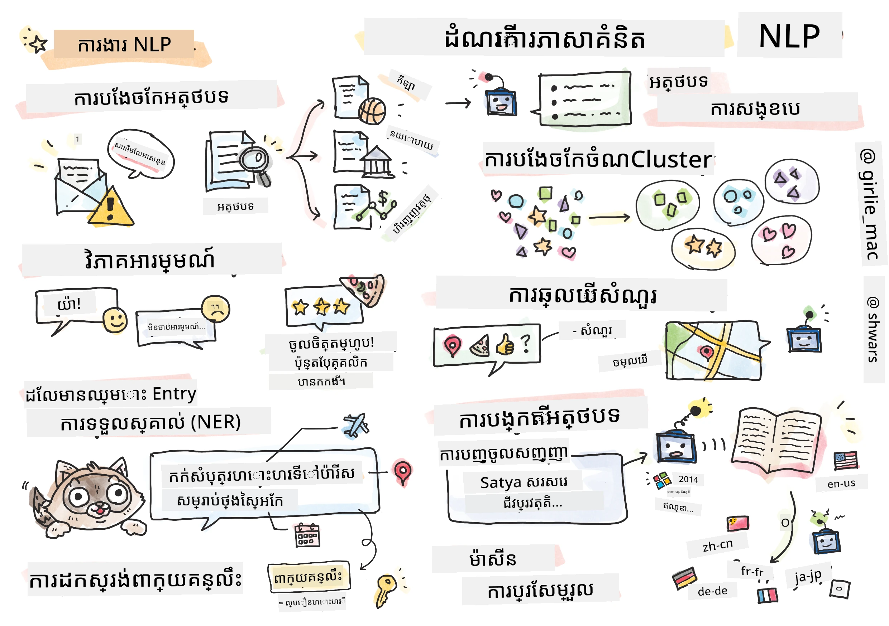

# ការគ្រប់គ្រងភាសាប្រពៃណី



នៅក្នុងផ្នែកនេះ យើងនឹងផ្តោតលើការប្រើប្រាស់បណ្តាញប្រព័ន្ធប្រសាទដើម្បីដោះស្រាយភារកិច្ចដែលទាក់ទងនឹង **ការគ្រប់គ្រងភាសាប្រពៃណី (NLP)**។ មានបញ្ហា NLP ជាច្រើនដែលយើងចង់ឲ្យកុំព្យូទ័រអាចដោះស្រាយបាន៖

* **ចាត់ថ្នាក់អត្ថបទ** គឺជាបញ្ហាចាត់ថ្នាក់ទូទៅដែលសាក់សន្ធិស្នាអត្ថបទ។ ឧទាហរណ៍រួមមានការចាត់ថ្នាក់សារអ៊ីម៉ែលថាជាអ៊ីមែលជាតសំរាម ឬមិនជាតសំរាម ឬចាត់ថ្នាក់អត្ថបទជាប្រភេទកីឡា អាជីវកម្ម នយោបាយ ល។ ក៏ដូចជាករណីបង្កើតជាមួយបច្ចេកវិទ្យាច្រើនរបស់ប៊ូតជាការយល់ដឹងអំពីអ្វីដែលអ្នកប្រើប្រាស់ចង់និយាយ -- ក្នុងករណីនេះ យើងកំពុងដោះស្រាយបញ្ហា **ចាត់ថ្នាក់ចេតនា**។ ជាញឹកញាប់ ក្នុងចំណាត់ថ្នាក់ចេតនា យើងត្រូវដោះស្រាយជាមួយកថាខណ្ឌជាច្រើន។
* **វាយតម្លៃអារម្មណ៍** គឺជាបញ្ហាកំណត់តម្លៃលើតម្លៃតំបន់ដែលយើងត្រូវផ្តល់លេខមួយ (អារម្មណ៍) ដែលបញ្ជាក់ពីភាពវិជ្ជមាន/អវិជ្ជមានន័យនៃឃ្លា។​ ជំនាន់ដែលមានកម្រិតខ្ពស់ជាងនៃវាយតម្លៃអារម្មណ៍គឺ **វាយតម្លៃអារម្មណ៍ផ្អែកលើកត្តា** (ABSA) ដែលយើងផ្តល់អារម្មណ៍នៅចំពោះមុខមិនមែនជាទ្វារសំណួរទាំងមូលទេ តែក្នុងផ្នែកផ្សេងៗរបស់វា (កត្តា) ឧ. *នៅភោជនីយដ្ឋាននេះ ខ្ញុំចូលចិត្តម្ហូបបាយ ប៉ុន្តែការតុបតែងបរិយាកាសគឺអាក្រក់*។
* **ការទទួលស្គាល់អត្តសញ្ញាណឈ្មោះ** (NER) មានន័យពីបញ្ហាការដករកសូមកន្សោមណាមួយចេញពីអត្ថបទ។ ឧទាហរណ៍ ជាថ្មី យើងអាចត្រូវយល់ថាក្នុងឃ្លា *ខ្ញុំត្រូវការហោះហើរទៅទីក្រុងប៉ារីសថ្ងៃស្អែក* ពាក្យ *ថ្ងៃស្អែក* មានន័យថាជា DATE ហើយ *ប៉ារីស* គឺ LOCATION។  
* **ការដកស្រង់ពាក្យគន្លឹះ** ស្រដៀងទៅនឹង NER ប៉ុន្តែយើងត្រូវដកពាក្យដែលមានសារៈសំខាន់ទៅន័យនៃឃ្លាដោយស្វ័យប្រវត្តិ ដោយមិនមានការបណ្តុះបណ្តាលជាមុនសម្រាប់ប្រភេទអត្តសញ្ញាណជាក់លាក់។
* **ការបែងចែកអត្ថបទជាក្រុម** អាចមានប្រយោជន៍នៅពេលដែលយើងចង់ក្រុមឃ្លាស្រដៀងគ្នាក្នុងការស្នើសុំជាក់លាក់នៅក្នុងការពិភាក្សាជំនួយបច្ចេកទេស។
* **ការឆ្លើយសំណួរ** មានន័យថាគំរូអាចឆ្លើយសំណួរជាក់លាក់មួយបាន។ គំរូទទួលបានអត្ថបទមួយនិងសំណួរជាអ៊ីនភ៊ុត ហើយវាត្រូវផ្តល់កន្លែងក្នុងអត្ថបទដែលមានចម្លើយសំណួរនោះ (ឬក្នុងករណីខ្លះ បង្កើតអត្ថបទចម្លើយ)។
* **ការបង្កើតអត្ថបទ** គឺជាការអនុញ្ញាតឲ្យគំរូបង្កើតអត្ថបទថ្មី។ វាអាចត្រូវបានពិចារណាជាការចាត់ថ្នាក់ដែលទាយលទ្ធផលអក្ខរក្រម/ពាក្យបន្ទាប់ដោយផ្អែកលើ *សំណួរអត្ថបទ*។ គំរូបង្កើតអត្ថបទកម្រិតខ្ពស់ ដូចជា GPT-3 អាចដោះស្រាយភារកិច្ច NLP ផ្សេងទៀតដូចជាចាត់ថ្នាក់ទៅលើបច្ចេកទេសដែលហៅថា [ការសរសេរបញ្ជា](https://towardsdatascience.com/software-3-0-how-prompting-will-change-the-rules-of-the-game-a982fbfe1e0) ឬ [វិស្វកម្មសរសេរបញ្ចូល](https://medium.com/swlh/openai-gpt-3-and-prompt-engineering-dcdc2c5fcd29)។
* **ការសង្ខេបអត្ថបទ** គឺជាបច្ចេកទេសនៅពេលដែលយើងចង់ឲ្យកុំព្យូទ័រប្រាប់ "អាន" អត្ថបទវែង និងសង្ខេបវា​ក្នុងឃ្លា​ចំនួនតិច។
* **ការបកប្រែម៉ាស៊ីន** អាចមើលថាជាការរួមបញ្ចូលរវាងការយល់ដឹងអត្ថបទក្នុងភាសាមួយ និងការបង្កើតអត្ថបទក្នុងភាសាមួយផ្សេងទៀត។

ដើមគេភារកិច្ច NLP ច្រើនត្រូវបានដោះស្រាយប្រើវិធីប្រពៃណីដូចជា វិញ្ញាសាកាត់តាមវេយ្យាករណ៍។ ឧទាហរណ៍ ក្នុងការបកប្រែមួយ គេបានប្រើវេយ្យាករណ៍ដើម្បីបម្លែងឃ្លាដើមទៅជារឹមសៀវភៅវេយ្យាករណ៍ បន្ទាប់មកទាញយករចនាសម្ព័ន្ធសំណួរល្អជាង ដើម្បីបង្ហាញន័យនៃឃ្លា ហើយតាមបណ្តាដើម្បីន័យនិងវេយ្យាករណ៍ភាសាគោលលទ្ធផលត្រូវបានបង្កើត។ ឥឡូវនេះ ភារកិច្ច NLP ជាច្រើនត្រូវបានដោះស្រាយមានប្រសិទ្ធភាពច្រើនជាមួយបណ្តាញប្រព័ន្ធប្រសាទ។

> វិធី NLP ចាស់ៗជាច្រើនត្រូវបានអនុវត្តក្នុងបណ្ណាល័យ Python [Natural Language Processing Toolkit (NLTK)](https://www.nltk.org)។ មានសៀវភៅ [NLTK Book](https://www.nltk.org/book/) ដែលមាននៅលើគេហទំព័រអនឡាញផងដែរ ដែលធ្វើអោយយើងយល់ពីភារកិច្ច NLP ផ្សេងៗដដែលអាចដោះស្រាយបានដោយប្រើ NLTK។

ក្នុងវគ្គនេះ យើងនឹងផ្តោតចំណុចចម្បងទៅលើការប្រើបណ្តាញប្រព័ន្ធប្រសាទសម្រាប់ NLP ហើយយើងនឹងប្រើ NLTK នៅពេលដែលត្រូវការ។

យើងបានរៀនពីការប្រើបណ្តាញប្រព័ន្ធប្រសាទសម្រាប់ទិន្នន័យតារាង និងរូបភាពរួចហើយ។ ផ្សេងគ្នាចម្បងរវាងទិន្នន័យទាំងនេះនឹងអត្ថបទគឺអត្ថបទគឺជាខ្សែវែងប្រែប្រួល ខណៈពេលដែលកម្រាតបញ្ចូលក្នុងរូបភាពត្រូវបានដឹងជាមុន។ ទោះបីបណ្តាញបរាជ័យអាចយករៀបចំប្លង់ពីទិន្នន័យបញ្ចូល ប្លង់ក្នុងអត្ថបទមានភាពស្មុគស្មាញជាង។ ឧ. យើងអាចមានការបដិសេធចេញពីប្រធានបទជាច្រើនពាក្យបាន​ដោយគ្រាន់តែជាការបដិសេធសម្រាប់ពាក្យជាច្រើន (ឧ. *ខ្ញុំមិនចូលចិត្តផ្លែទាំងអង់* ទៅវិញទៅមក *ខ្ញុំមិនចូលចិត្តផ្លែទាំងអាំងធំនិងពណ៌ស្រស់* ) ហើយនោះគួរតែត្រូវបានបកស្រាយថាជាប្លង់តែមួយ។ ដូច្នេះ ដើម្បីសម្របសម្រួលភាសាយើងត្រូវបញ្ចូលប្រភេទបណ្តាញប្រព័ន្ធប្រសាទថ្មីៗដូចជា *បណ្តាញត្រឡប់* និង *transfomers*។

## ដំឡើងបណ្ណាល័យ

បើអ្នកកំពុងប្រើការដំឡើង Python នៅលើកុំព្យូទ័រផ្ទាល់ខ្លួន ដើម្បីបើកអនុវត្តវគ្គនេះ អ្នកប្រហែលត្រូវតែដំឡើងបណ្ណាល័យទាំងអស់ដែលត្រូវការនៃ NLP ដោយប្រើពាក្យបញ្ជានិយមដូចខាងក្រោម៖

**សម្រាប់ PyTorch**
```bash
pip install -r requirements-torch.txt
```
**សម្រាប់ TensorFlow**
```bash
pip install -r requirements-tf.txt
```

> អ្នកអាចសាកល្បង NLP ជាមួយ TensorFlow នៅលើ [Microsoft Learn](https://docs.microsoft.com/learn/modules/intro-natural-language-processing-tensorflow/?WT.mc_id=academic-77998-cacaste)

## សេចក្ដីវិភាគ GPU

នៅក្នុងផ្នែកនេះ នៅខ្លះខ្លះនៃឧទាហរណ៍យើងនឹងហាត់គំរូដែលមានទំហំធំជាងមុន។
* **ប្រើកុំព្យូទ័រដែលមាន GPU**៖ ជាការណែនាំឲ្យបើកកំណត់ត្រារបស់អ្នកលើកុំព្យូទ័រដែលមាន GPU ដើម្បីកាត់បន្ថយពេលរង់ចាំពេលធ្វើការជាមួយគំរូទំហំធំ។
* **កំណត់ជំហរចងចំណង GPU**៖ ការប្រើ GPU អាចនាំឲ្យមានស្ថានភាពដែលអង្គចងចំណង GPU គាត់ប្រេងដាច់ពេលហាត់គំរូធំៗ។
* **ការប្រើប្រាស់អង្គចងចំណង GPU**៖ បរិមាណអង្គចងចំណង GPU ប្រើពេលហាត់គំរូអាស្រ័យលើប៉ារ៉ាម៉ែត្រ ផ្សេងៗ រួមមានទំហំជំពូកតូច (minibatch)។
* **កាត់បន្ថយទំហំជំពូកតូច**៖ ប្រសិនបើអ្នកប្រឈមមុខបញ្ហាអង្គចងចំណង GPU អ្នកអាចពិចារណាកាត់បន្ថយទំហំជំពូកតូចនៅក្នុងកូដរបស់អ្នកជាជម្រើសមួយ។
* **ការដោះស្រាយបញ្ហាអង្គចងចំណង GPU ក្នុង TensorFlow**៖ កំណែចាស់ៗនៃ TensorFlow អាចមិនបញ្ឈប់ការប្រើប្រាស់អង្គចងចំណង GPU យ៉ាងត្រឹមត្រូវ នៅពេលហាត់គំរូច្រើនក្នុងកឺណែល Python មួយ។ ដើម្បីគ្រប់គ្រងការប្រើប្រាស់អង្គចងចំណង GPU ជាដំណោះស្រាយ អ្នកអាចកំណត់ TensorFlow ឲ្យបន្ថែមអង្គចងចំណង GPU ពេញតែត្រូវការតែប៉ុណ្ណោះ។
* **ការបញ្ចូលកូដ**៖ ដើម្បីកំណត់ឲ្យ TensorFlow កំណត់បន្ថែមអង្គចងចំណង GPU លើកដំបូងតែពេលគាំទ្រ អ្នកអាចបញ្ចូលកូដខាងក្រោមក្នុងកំណត់ត្រារបស់អ្នក៖

```python
physical_devices = tf.config.list_physical_devices('GPU') 
if len(physical_devices)>0:
    tf.config.experimental.set_memory_growth(physical_devices[0], True) 
```

បើអ្នកចាប់អារម្មណ៍ក្នុងការសិក្សា NLP ពីទស្សនវិជ្ជា ML ចាស់ៗ សូមចូលទៅរក [ជួរមេរៀននេះ](https://github.com/microsoft/ML-For-Beginners/tree/main/6-NLP)

## នៅក្នុងផ្នែកនេះ
នៅក្នុងផ្នែកនេះ យើងនឹងរៀនអំពី៖

* [តំណាងអត្ថបទជាទិន្នន័យ tensor](13-TextRep/README.md)
* [ការដាក់ពាក្យជាតំណ](14-Emdeddings/README.md)
* [ម៉ូដែលភាសា](15-LanguageModeling/README.md)
* [បណ្តាញប្រព័ន្ធប្រសាទត្រឡប់](16-RNN/README.md)
* [បណ្តាញបង្កើត](17-GenerativeNetworks/README.md)
* [Transformers](18-Transformers/README.md)

---

<!-- CO-OP TRANSLATOR DISCLAIMER START -->
**ការបដិសេធ**៖
ឯកសារនេះត្រូវបានបកប្រែដោយប្រើសេវាកម្មបកប្រែ AI [Co-op Translator](https://github.com/Azure/co-op-translator)។ រួមទាំងយើងខិតខំប្រឹងប្រែងដើម្បីភាពត្រឹមត្រូវ ក៏សូមយល់ដឹងថាការបកប្រែដោយស្វ័យប្រវត្តិអាចមានកំហុសឬភាពមិនត្រឹមត្រូវ។ ឯកសារដើមជាភាសាដើមគួរត្រូវបានយកជាធនាគារដែលមានសិទ្ធិ។ សម្រាប់ព័ត៌មានសំខាន់ ការបកប្រែដោយអ្នកជំនាញជាថ្នាក់មនុស្សត្រូវបានណែនាំ។ យើងមិនទទួលខុសត្រូវចំពោះការយល់ច្រឡំឬការបកប្រែខុសពីការប្រើប្រាស់ការបកប្រែនេះឡើយ។
<!-- CO-OP TRANSLATOR DISCLAIMER END -->