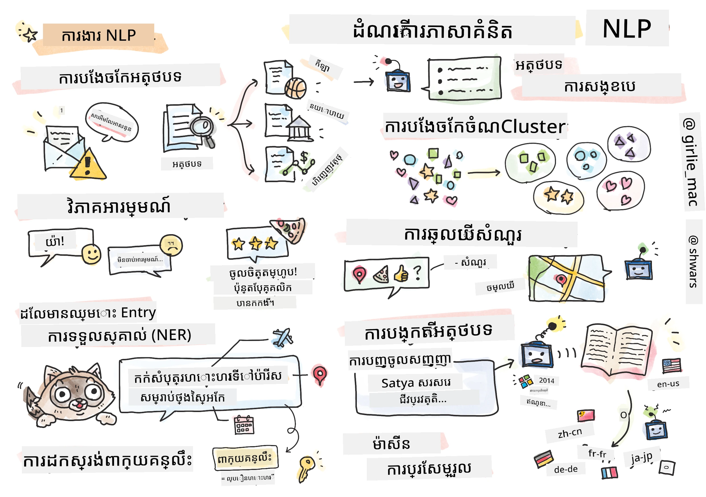

# ការកែចេញភាសាធម្មជាតិ



នៅក្នុងផ្នែកនេះ យើងនឹងផ្តោតលើការប្រើប្រាស់បណ្ដាញប្រព័ន្ធប្រតិបត្តិការជាសរសៃប្រព័ន្ធដើម្បីដោះស្រាយភារកិច្ចទាក់ទងនឹង **ការកែចេញភាសាធម្មជាតិ (NLP)**។ មានបញ្ហា NLP ជាច្រើនដែលយើងចង់ឲ្យកុំព្យូទ័រអាចដោះស្រាយបាន៖

* **កំណាត់ចំណាត់ថ្នាក់អត្ថបទ** ជាបញ្ហាកំណាត់ចំណាត់ថ្នាក់ជារឿយៗទាក់ទងទៅនឹងលំដាប់អត្ថបទ។ ឧទាហរណ៍ មានការចាត់ថ្នាក់សារអ៊ីម៉ែលជាសារស្ពាម ឬមិនមែនស្ពាម ឬចាត់ថ្នាក់អត្ថបទជា កីឡា អាជីវកម្ម នយោបាយ និងផ្សេងទៀត។ ក៏ដូចជាក្នុងការអភិវឌ្ឍប័តបច្ចេកវិទ្យាចម្លែកយើងតែងត្រូវការយល់ពីអ្វីដែលអ្នកប្រើប្រាស់ចង់និយាយ — ក្នុងករណីនេះយើងកំពុងដោះស្រាយ **ចំណាត់ថ្នាក់បំណង**។ ជាញឹកញាប់ នៅក្នុងការចាត់ថ្នាក់ទៅលើបំណងយើងត្រូវដោះស្រាយជាច្រើនប្រភេទ។
* **វិភាគអារម្មណ៍** ជាបញ្ហាឧបសម្ព័ន្ធដែលយើងត្រូវផ្ដល់លេខមួយ (មតិយោបល់) ដែលសមមូលទៅនឹងដែលមានន័យជាកំណត់ចំពោះការសំដែងអារម្មណ៍ស្របតាមចំណុចវិជ្ជមាន ឬអវិជ្ជមាននៃប្រយោគ។ កំណែប្រសើរជាងវិភាគអារម្មណ៍គឺ **វិភាគអារម្មណ៍ផ្អែកលើមុខងារ** (ABSA) ដែលយើងផ្ដល់អារម្មណ៍មិនមែនទៅវិញទៅមកសម្រាប់ប្រយោគទាំងមូលទេ ប៉ុន្ដែទៅសម្រាប់ផ្នែកផ្សេងៗរបស់វា (មុខងារ) លើករណីឧទាហរណ៍ *នៅភោជនីយដ្ឋាននេះ ខ្ញុំចូលចិត្តម្ហូប ប៉ុន្តែបរិយាកាសគឺអាក្រក់។*
* **ការទទួលសម្គាល់គុណសម្បត្តិបុគ្គល** (NER) យោងទៅលើយុទ្ធសាស្រ្តសម្រាប់ដកស្រង់អត្ថបទចេញពីអត្ថបទ។ ឧទាហរណ៍ យើងត្រូវយល់ថា ក្នុងពាក្យ *ខ្ញុំត្រូវទៅបើកយន្តហោះទៅទីក្រុងប៉ារីសថ្ងៃស្អែក* ពាក្យ *ថ្ងៃស្អែក* សំដៅទៅលើកាលបរិច្ឆេទ និង *ប៉ារីស* គឺជាទីកន្លែង។
* **ការដកស្រង់គន្លឹះ** ស្រដៀងនឹង NER ប៉ុន្តែយើងត្រូវដកពាក្យដែលសំខាន់ចំពោះន័យនៃប្រយោគដោយស្វ័យប្រវត្តិ ដោយមិនចាំបាច់ត្រូវបណ្តុះបណ្តាលជាបុព្វហេតុនៅលើប្រភេទអត្ថសម្បត្តិជាក់លាក់។
* **ក្រុមអត្ថបទ** អាចមានប្រយោជន៍នៅពេលយើងចង់ក្រុមឲ្យភាសាស្រដៀងគ្នា ដូចជាការស្នើសុំព្រមក្នុងការឆ្លើយតបបច្ចេកទេស។
* **ការឆ្លើយសំណួរ** សំដៅទៅលើសមត្ថភាពនៃគំរូក្នុងការឆ្លើយតបសំណួរមួយជាក់លាក់។ គំរូទទួលបានខែក និងសំណួរជាបញ្ចូល ហើយត្រូវផ្ដល់ទីតាំងនៅក្នុងអត្ថបទដែលមានចម្លើយសំណួរ (ឬក្នុងករណីខ្លះ បង្កើតអត្ថបទចម្លើយ)។
* **ការបង្កើតអត្ថបទ** ជាសមត្ថភាពនៃគំរូក្នុងការផលិតអត្ថបទថ្មី។ វាអាចត្រូវបានគិតថាជាភារកិច្ចចាត់ថ្នាក់ដែលប៉ាន់ស្មានអក្សរឬពាក្យបន្ទាប់ដោយផ្អែកលើ *ការជំរុញអត្ថបទ* មួយ។ គំរូបង្កើតអត្ថបទកម្រិតខ្ពស់ ដូចជា GPT-3 អាចដោះស្រាយភារកិច្ច NLP ផ្សេងទៀតដូចជា ការចាត់ថ្នាក់ ដោយប្រើបច្ចេកទេសហៅថា [កម្មវិធីជំរុញ](https://towardsdatascience.com/software-3-0-how-prompting-will-change-the-rules-of-the-game-a982fbfe1e0) ឬ [វិស្វកម្មជំរុញ](https://medium.com/swlh/openai-gpt-3-and-prompt-engineering-dcdc2c5fcd29)
* **ការសង្ខេបអត្ថបទ** ជាបច្ចេកទេសដែលយើងចង់ឲ្យកុំព្យូទ័រ "អាន" អត្ថបទវែងហើយសង្ខេបវាជាចំណុចខ្លះៗ។
* **ការបកប្រែម៉ាស៊ីន** អាចមើលឃើញជាការរួមបញ្ចូលនៃការយល់ដឹងអត្ថបទភាសាដែលមួយ និងការបង្កើតអត្ថបទភាសាមួយទៀត។

ម៉ោងដើម ភារកិច្ច NLP ជាទូទៅ ត្រូវបានដោះស្រាយដោយវិធីសាស្រ្តប្រពៃណីដូចជាក្រាមម៉ាតិច។ ឧទាហរណ៍ នៅការបកប្រែម៉ាស៊ីន គេបានប្រើការជ្រើសរើសការវិភាគនៃប្រយោគដั้งដើមទៅក្នុងតម្រែសំណុំសញ្ញាវិធីសាស្រ្តវេយ្យាករណ៍ រួចបញ្ចេញរចនាសម្ព័ន្ធសេម៉ង់ខ្ពស់ធ្វើជាតំណាងន័យនៃប្រយោគ និងផ្អែកលើន័យនិងក្រាមម៉ាតិចភាសាគោលផ្លាស់ប្តូរបានលទ្ធផល។ សព្វថ្ងៃ ភារកិច្ច NLP ច្រើនត្រូវបានដោះស្រាយប្រសើរជាមួយបណ្តាញសរសៃប្រព័ន្ធ។

> វិធីសាស្រ្ត NLP ដั้งដើមជាច្រើនត្រូវបានអនុវត្តក្នុងបណ្ណាល័យ Python [Natural Language Processing Toolkit (NLTK)](https://www.nltk.org)។ មានសៀវភៅ [NLTK Book](https://www.nltk.org/book/) សម្រាប់សិក្សាដោយប្រើបានអនឡាញ ដែលរៀបរាប់របៀបដោះស្រាយភារកិច្ច NLP ផ្សេងៗជាមួយ NLTK។

ក្នុងវគ្គនេះ យើងនឹងផ្តោតជាចម្បងលើការប្រើបណ្ដាញប្រព័ន្ធប្រតិបត្តិការសរសៃសម្រាប់ NLP ហើយយើងនឹងប្រើ NLTK នៅពេលចាំបាច់។

យើងបានរៀនរួចជាភាសាមាននៅលើការប្រើបណ្ដាញប្រព័ន្ធសម្រាប់ទិន្នន័យពុម្ព និងរូបភាព។ ខុសគ្នាចម្បងរវាងទិន្នន័យទាំងនោះនិងអត្ថបទគឺ អត្ថបទជាលំដាប់ដែលមានប្រវែងមិនទៀងទាត់ ខណៈដែលទំហំបញ្ចូលក្នុងករណីរូបភាពត្រូវបានគ្រប់គ្រងជាមុន។ ខណៈដែលបណ្ដាញអាចជ្រូកយកគំរូពីទិន្នន័យបញ្ចូល ការស្វែងរកគំរូនៅក្នុងអត្ថបទមានភាពស្មុគស្មាញជាង។ ឧទាហរណ៍ អាចមានប្រយោគបដិសេធដែលបែងចែកពីប្រធានបទដោយពាក្យជាច្រើន (ឧ. *ខ្ញុំមិនចូលចិត្តក្រូចទេ* ប្រៀបធៀបនឹង *ខ្ញុំមិនចូលចិត្តក្រូចធំៗពណ៌ស្អាតឆ្ងាញ់ទេ* ) ហើយវានឹងត្រូវបានពន្យល់ថាជាគំរូមួយ។ ដូច្នេះ ដើម្បីដោះស្រាយភាសា យើងត្រូវបានណែនាំប្រភេទបណ្ដាញប្រព័ន្ធប្រតិបត្តិការថ្មីៗ ដូចជា *បណ្ដាញជុំវិញ* និង *transformers*។

## ដំឡើងបណ្ណាល័យ

ប្រសិនបើអ្នកកំពុងប្រើការតំឡើង Python មូលដ្ឋានដើម្បីរត់វគ្គនេះ អ្នកប្រហែលជាត្រូវតែដំឡើងបណ្ណាល័យទាំងអស់ដែលត្រូវការសម្រាប់ NLP ដោយប្រើពាក្យបញ្ជាទាំងនេះ៖

**សម្រាប់ PyTorch**
```bash
pip install -r requirements-pytorch.txt
```
**សម្រាប់ TensorFlow**
```bash
pip install -r requirements-tf.txt
```

> អ្នកអាចសាកល្បង NLP ជាមួយ TensorFlow នៅលើ [Microsoft Learn](https://docs.microsoft.com/learn/modules/intro-natural-language-processing-tensorflow/?WT.mc_id=academic-77998-cacaste)

## ការព្រមាន GPU

នៅក្នុងផ្នែកនេះ នៅក្នុងឧទាហរណ៍ខ្លះៗ យើងនឹងបណ្តុះបណ្តាលគំរូដែលមានទំហំធំប៉ុន្មាន។
* **ប្រើកុំព្យូទ័រមាន GPU**៖ គួរឱ្យរត់កំណត់ត្រារបស់អ្នកលើកុំព្យូទ័រដែលមាន GPU ដើម្បីកាត់បន្ថយពេលរងចាំពេលធ្វើការជាមួយគំរូធំៗ។
* **កំហិតអង្គចងចាំ GPU**៖ ការរត់លើ GPU អាចនាំឲ្យមានករណីអ្នកប្រើអង្គចងចាំ GPU មិនគ្រប់គ្រាន់ ពិសេសពេលបណ្តុះគំរូធំ។
* **ការប្រើប្រាស់អង្គចងចាំ GPU**៖ បរិមាណអង្គចងចាំ GPU ដែលបានប្រើពេលបណ្តុះគំរូអាស្រ័យលើកត្តាច្រើន រួមមានទំហំខ្មៅ។
* **បន្ថយទំហំខ្មៅ**៖ ប្រសិនបើអ្នកប្រឈមមុខនឹងបញ្ហាអង្គចងចាំ GPU សូមពិចារណាកាត់បន្ថយទំហំខ្មៅក្នុងកូដរបស់អ្នកជាជម្រើស។
* **ការចេញវិញអង្គចងចាំ GPU នៅ TensorFlow**៖ ភាពចាស់របស់ TensorFlow អាចមិនចេញអង្គចងចាំ GPU ត្រឹមត្រូវពេលបណ្តុះគំរូជាច្រើនក្នុងធុង Python តែមួយ។ ដើម្បីគ្រប់គ្រងការប្រើប្រាស់អង្គចងចាំ GPU បានប្រសើរជាងមុន អ្នកអាចកំណត់ TensorFlow ឲ្យបែងចែកអង្គចងចាំ GPU តាមត្រូវតែប្រើ។
* **បញ្ចូលកូដ**៖ ដើម្បីកំណត់ TensorFlow ឲ្យបង្កើនការបែងចែកអង្គចងចាំ GPU តែពេលដែលត្រូវការ សូមបញ្ចូលកូដខាងក្រោមក្នុងកំណត់ត្រារបស់អ្នក៖

```python
physical_devices = tf.config.list_physical_devices('GPU') 
if len(physical_devices)>0:
    tf.config.experimental.set_memory_growth(physical_devices[0], True) 
```

ប្រសិនបើអ្នកចាប់អារម្មណ៍ក្នុងការសិក្សាអំពី NLP ពីទស្សនៈ ML ដั้งដើម សូមចូលទៅកាន់ [ឈុតមេរៀននេះ](https://github.com/microsoft/ML-For-Beginners/tree/main/6-NLP)

## នៅក្នុងផ្នែកនេះ
នៅក្នុងផ្នែកនេះ យើងនឹងរៀនពី៖

* [កំណត់តំណាងអត្ថបទជាតង់ស័រ](13-TextRep/README.md)
* [ការបញ្ចូលពាក្យ](14-Embeddings/README.md)
* [ការម៉ូដែលភាសា](15-LanguageModeling/README.md)
* [បណ្ដាញអាចប្រើឡើងវិញ](16-RNN/README.md)
* [បណ្ដាញបង្កើត](17-GenerativeNetworks/README.md)
* [Transformers](18-Transformers/README.md)

---

<!-- CO-OP TRANSLATOR DISCLAIMER START -->
**ការបដិសេធ**:
ឯកសារនេះត្រូវបានបម្លែងភាសា ដោយប្រើសេវាបម្លែងភាសា AI [Co-op Translator](https://github.com/Azure/co-op-translator)។ ទោះយើងខ្ញុំមានក្តីប្រាថ្នាឱ្យបានច្បាស់លាស់ តែសូមយល់ដឹងថាការបម្លែងដោយស្វ័យប្រវត្តិក៏អាចមានកំហុសឬភាពមិនត្រឹមត្រូវ។ ឯកសារដើមជាភាសាទីតាំងគួរត្រូវបានគេប្រើជាប្រភពច្បាស់លាស់។ សម្រាប់ព័ត៌មានសំខាន់ៗ សូមណែនាំឱ្យប្រើប្រាស់ការប្រែដោយមនុស្សជំនាញ។ យើងខ្ញុំមិនទទួលខុសត្រូវចំពោះការយល់ច្រឡំ ឬការបកស្រាយខុសបន្ទាប់ពីការប្រើប្រាស់ការបម្លែងនេះនោះទេ។
<!-- CO-OP TRANSLATOR DISCLAIMER END -->