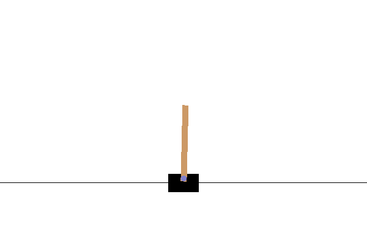

# ការសិក្សាដែលជ្រៅលើការសំរបសំរួលដោយជំនឿជាក់

ការសំរបសំរួលដោយជំនឿជាក់ (RL) ត្រូវបានគេឃើញថា ជាមួយនឹងមូលដ្ឋានមួយនៃទ្រឹស្តីការសិក្សាម៉ាស៊ីន ជាប់ជាមួយការសិក្សាដោយមានការបញ្ជាក់ និងការសិក្សាដោយមិនមានការបញ្ជាក់។ ខណៈពេលដែលនៅក្នុងការសិក្សាដោយមានការបញ្ជាក់ យើងអាស្រ័យលើសំណុំទិន្នន័យដែលមានលទ្ធផលដែលបានស្គាល់ហើយ RL មានមូលដ្ឋានលើ **ការសិក្សាតាមរយៈការធ្វើ**។ ឧទាហរណ៍ នៅពេលដែលយើងឃើញហ្គេមកុំព្យូទ័រជាលើកដំបូង យើងចាប់ផ្តើមលេង ដោយមិនចាំបាច់ស្គាល់ច្បាប់ ហើយភ្លាមៗយើងអាចធ្វើឲ្យជំនាញរបស់យើងកាន់តែប្រសើរឡើងត្រឹមតែដំណើរការលេងហើយកែលម្អអាកប្បកិរិយារបស់យើង។

## [សំណួរពីមុនវគ្គបង្រៀន](https://ff-quizzes.netlify.app/en/ai/quiz/43)

ដើម្បីអនុវត្ត RL យើងត្រូវការជាភាគី៖

* **បរិយាកាស** ឬ **កម្មវិធីសមកម្ម** ដែលកំណត់ច្បាប់នៃហ្គេម។ យើងគួរតែអាចដំណើរការជាធម្មតានៅក្នុងកម្មវិធីសមកម្មហើយមើលលទ្ធផលបាន។
* មុខងារប្រាក់រង្វាន់មួយ ដែលបង្ហាញពីកំរិតជោគជ័យនៃសាកល្បងរបស់យើង។ ក្នុងករណីនៃការសិក្សាលេងហ្គេមកុំព្យូទ័រ ប្រាក់រង្វាន់គឺជาคะแนนចុងក្រោយរបស់យើង។

ដោយផ្អែកលើមុខងារប្រាក់រង្វាន់ យើងគួរអាចកែប្រែអាកប្បកិរិយារបស់យើង និងបង្កើនជំនាញ ដើម្បីលេងបានកាន់តែល្អនៅលើជំហានក្រោយ។ ភាពខុសគ្នាចម្បងរវាងការសិក្សាម៉ាស៊ីនប្រភេទផ្សេងៗ និង RL គឺនៅក្នុង RL យើងមិនស្គាល់ថាយើងឈ្នះ ឬបរាជ័យរហូតដល់ចប់ហ្គេមទេ។ ដូច្នេះមិនអាចនិយាយបានថា ចលនាអេទែលមួយគឺល្អ ឬមិនល្អទេ — យើងទទួលបានប្រាក់រង្វាន់តែចុងក្រោយប៉ុណ្ណោះ។

នៅពេលធ្វើ RL យើងធ្វើជាច្រើនករណីសាកល្បង។ នៅក្នុងរាល់ការសាកល្បង យើងត្រូវលំអៀងចំណុចរវាងការតាមដានយុទ្ធសាស្ត្រដែលបានសិក្សារួចហើយ (**ការប្រើប្រាស់**) និងការស្វែងរកស្ថានភាពថ្មីៗ (**ការស្រាវជ្រាវ**)។

## OpenAI Gym

ឧបករណ៍ដ៏អស្ចារ្យសម្រាប់ RL គឺ [OpenAI Gym](https://gym.openai.com/) - បរិយាកាសសមកម្មមួយ ដែលអាចសមកម្មបានបរិយាកាសនានារាប់ពីហ្គេម Atari ដល់រូបវិទ្យាជំនួសហត្ថបន្ទាត់។ វា គឺជាបរិយាកាសសមកម្មដែលពេញនិយមមួយសម្រាប់បណ្ដុះបណ្ដាលអាល់ហ្គរីធម៍សំរបសំរួលដោយជំនឿជាក់ ហើយត្រូវបានគ្រប់គ្រងដោយ [OpenAI](https://openai.com/)។

> **ចំណាំ**៖ អ្នកអាចមើលបរិយាកាសទាំងអស់ដែលមាននៅក្នុង OpenAI Gym [នៅទីនេះ](https://gym.openai.com/envs/#classic_control)។

## ការសមតុល្យ CartPole

អ្នកប្រហែលជាបានឃើញឧបករណ៍សមតុល្យទំនើបដូចជា *Segway* ឬ *Gyroscooters*។ ពួកវាអាចសមតុល្យដោយស្វ័យប្រវត្តិ ដោយកែប្រែជាមួយកង់របស់ពួកវា ដើម្បីឆ្លើយតបនឹងសញ្ញាពីកម្មវិធីវាស់ល្បឿន ឬឧបករណ៍វាស់មុំ (gyroscope)។ ក្នុងផ្នែកនេះ យើងនឹងរៀនពីរបៀបដោះស្រាយបញ្ហាស្រដៀងគ្នាទៀត - គឺការសមតុល្យដល់កំពង់ស្ព័រ។ វាស្រដៀងនឹងស្ថានភាពពេលព្យួរកម្មបង្ហាញល្បែងមួយត្រូវតែសមតុល្យកំពង់ស្ព័រនៅលើដៃរបស់គេ - ប៉ុន្តែការសមតុល្យកំពង់ស្ព័រនេះមានតែម្នាក់ទីតែមួយគត់។

រូបមន្តសមតុល្យបានធ្វើឲ្យសាមញ្ញត្រូវបានគេស្គាល់ថាជាបញ្ហា **CartPole**។ នៅក្នុងពិភព cartpole យើងមានស្លាយបញ្ឈរមួយដែលអាចធ្វើចលនា ឆ្វេងឬស្តាំ ហើយគោលបំណងគឺសមតុល្យកំពង់ស្ព័រនៅផ្នែកលើស្លាយនៅពេលវាចលនា។


ដើម្បីបង្កើត និងប្រើប្រាស់បរិយាកាសនេះ យើងត្រូវការបន្ទាត់ Python ប៉ុន្មានខ្ទង់៖

```python
import gym
env = gym.make("CartPole-v1")

env.reset()
done = False
total_reward = 0
while not done:
   env.render()
   action = env.action_space.sample()
   observaton, reward, done, info = env.step(action)
   total_reward += reward

print(f"Total reward: {total_reward}")
```

បរិយាកាសមួយៗអាចចូលដំណើរការ​បាន​ដោយ​របៀបដូចគ្នា៖
* `env.reset` ចាប់ផ្តើមការសាកល្បងថ្មី
* `env.step` អនុវត្តជំហានសមកម្មមួយ។ វាទទួល **សកម្មភាព** មកពី **លំហសកម្មភាព** ហើយតបតាមការសង្កេតមួយ (ពីលំហសង្កេត), រួមមានប្រាក់រង្វាន់ និងស្លាកបញ្ចប់។

នៅក្នុងឧទាហរណ៍ខាងលើ យើងអនុវត្តសកម្មភាពចៃដន្យក្នុងរាល់ជំហាន ដូច្នេះជីវិតនៃការសាកល្បងមានរយៈពេលខ្លីណាស់៖


គោលបំណងនៃអាល់ហ្គរីធម៍ RL គឺបណ្តុះបណ្តាលគំរូមួយ ដដែលហៅថា **នីតិកម្ម** &pi; — ដែលនឹងតបសកម្មភាពមួយមកវិញនៅក្នុងស្ថានភាព។ យើងក៏អាចយកនីតិកម្មឲ្យមានលក្ខណៈប្រូបាប៊ីលីស្ទិច បាន ផងដែរ។ ឧ. សម្រាប់ស្ថានភាព *s* និងសកម្មភាព *a* វានឹងតបតាមប្រូបាប៊ីលីស្ទិច &pi;(*a*|*s*) ដែលយើងគួរតែអនុវត្ត *a* នៅស្ថានភាព *s*។

## អាល់ហ្គរីធម៍តុល្យភាពនីតិកម្ម (Policy Gradients)

វិធីតែមួយច្បាស់លាស់ក្នុងការគំរូនីតិការសិក្សាគឺបង្កើតបណ្ដាញប្រសាទច្នៃម៉ាស៊ីនដែលទទួលស្ថានភាពជាបញ្ចូល ហើយបញ្ចេញសកម្មភាពដែលសមរម្យ (ឬប្រូបាប៊ីលីតាំងនៃសកម្មភាពទាំងមូល)។ នៅក្នុងអារម្មណ៍មួយ វាស្រដៀងនឹងការដាក់ចំណាត់ថ្នាក់ធម្មតាមួយ ប៉ុន្តែភាពខុសគ្នាចម្បងគឺ យើងមិនស្គាល់ជាមុនថា តើនៅក្នុងជំហានណាមួយ យើងគួរតែចាប់ផ្តើមអ្វី។

គំនិតនៅទីនេះគឺប៉ាន់ប្រមានប្រូបាប៊ីលីតាំងនោះ។ យើងកសាងវ៉ិចទ័រនៃ **ប្រាក់រង្វាន់សរុប** ដែលបង្ហាញប្រាក់រង្វាន់សរុបរបស់យើងនៅរាល់ជំហាននៃសាកល្បង។ យើងក៏អនុវត្ត **ការបញ្ចុះតម្លៃប្រាក់រង្វាន់** ដោយគុណប្រាក់រង្វាន់មុនដោយមួយកូអឹស្យង់ &gamma;=0.99 ដើម្បីបន្ថយតួនាទីនៃប្រាក់រង្វាន់កាលពីមុន។ បន្ទាប់មក យើងបញ្ជាក់ទ្រទ្រង់ទៅលើជំហាននៅក្នុងផ្លូវសាកល្បងដែលផ្តល់ប្រាក់រង្វាន់ធំជាង។

> រៀនបន្ថែមអំពីអាល់ហ្គរីធម៍ Policy Gradient ហើយមើលវាពិតប្រាកដក្នុង [សៀវភៅជាក់លាក់](CartPole-RL-TF.ipynb)។

## អាល់ហ្គរីធម៍ Actor-Critic

ជំនាន់កែលម្អនៃវីធី Policy Gradients មានឈ្មោះថា **Actor-Critic**។ គំនិតសំខាន់នៅពីក្រោយវាគឺថាបណ្ដាញប្រសាទនឹងត្រូវបណ្តុះបណ្តាលឲ្យបញ្ចេញពីរព័ត៌មាន៖

* នីតិកម្ម ដែលកំណត់ថាតើត្រូវធ្វើសកម្មភាពអ្វី។ ផ្នែកនេះហៅថា **actor**
* ការប៉ាន់ប្រមាណប្រាក់រង្វាន់សរុបដែលយើងអាចរំពឹងទុកបាននៅស្ថានភាពនេះ — ផ្នែកនេះហៅថា **critic**។

ក្នុងអារម្មណ៍មួយ សំណង់នេះស្រដៀងនឹង [GAN](../../4-ComputerVision/10-GANs/README.md) ដែលយើងមានបណ្ដាញពីរដែលបណ្ដុះបណ្ដាលប្រឆាំងគ្នា។ ក្នុងគំរូ actor-critic, actor ផ្តល់សកម្មភាពដែលយើងត្រូវធ្វើ ហើយ critic ព្យាយាមធ្វើតម្លៃវិជ្ជមាន និងប៉ាន់ប្រមាណលទ្ធផល។ ទោះបីជាយើងមានគោលដៅបណ្តុះបណ្ដាលបណ្ដាញទាំងពីរបញ្ចូលគ្នា។

ដោយសារយើងស្គាល់ទាំងប្រាក់រង្វាន់សរុបពិតប្រាកដ និងលទ្ធផលដែលវិភាគដោយ critic ក្នុងពេលនៃសាកល្បង វាជារឿងងាយស្រួលក្នុងការបង្កើតមុខងារបាត់បង់ ដែលនឹងបន្ថយភាពខុសគ្នារវាងពួកវា។ នេះហៅថា **critic loss**។ យើងអាចគណនាបាត់បង់ **actor loss** ដោយប្រើផ្លូវដដែលដូចជាក្នុងអាល់ហ្គរីធម៍ policy gradient។

បន្ទាប់ពីរត់អាល់ហ្គរីធម៍មួយក្នុងនោះ យើងអាចរំពឹងថា CartPole នឹងមានការប្រព្រឹត្តទៅដូចនេះ៖



## ✍️ ផ្តល់ការហ្វឹកហាត់៖ Policy Gradients និង Actor-Critic RL

បន្តការសិក្សារបស់អ្នកនៅក្នុងសៀវភៅបណ្តុះបណ្តាលខាងក្រោម៖

* [RL ក្នុង TensorFlow](CartPole-RL-TF.ipynb)
* [RL ក្នុង PyTorch](CartPole-RL-PyTorch.ipynb)

## បេសកកម្ម RL ផ្សេងទៀត

ការសំរបសំរួលដោយជំនឿជាក់ (Reinforcement Learning) កំពុងរីកចម្រើនយ៉ាងឆាប់រហ័សនៅថ្ងៃនេះ។ ឧទាហរណ៍គួរឱ្យចាប់អារម្មណ៍ខ្លះៗរបស់ RL មានដូចជា៖

* បង្រៀនកុំព្យូទ័រឱ្យលេង **ហ្គេម Atari**។ ចំណុចតំបន់ពិបាកនៅក្នុងបញ្ហានេះគឺយើងមិនមានស្ថានភាពសាមញ្ញជាវ៉ិចទ័រ ប៉ុន្តែជារូបភាពផ្ទេស្រប ដែលយើងត្រូវប្រើ CNN ដើម្បីបម្លែងរូបភាពនេះទៅជាវ៉ិចទ័រពហុលក្ខណៈ ឬដកស្រង់ពត៌មានប្រាក់រង្វាន់។ ហ្គេម Atari មានឲ្យប្រើនៅក្នុង Gym។
* បង្រៀនកុំព្យូទ័រឱ្យលេងហ្គេមក្តារ ដូចជា កាសុី និង Go។ កម្មវិធីដល់កំពូល​ដូចជា **Alpha Zero** ត្រូវបានបណ្តុះបណ្តាលពីគ្មានអ្វី ដោយភាគីពីរលេងប្រកួតគ្នាខ្ទង់ជា​ស្ទើរ និងកែលម្អជាប់ជានិច្ច។
* នៅក្នុងឧស្សាហកម្ម RL ត្រូវបានប្រើដើម្បីបង្កើតប្រព័ន្ធត្រួតពិនិត្យចេញពីកម្មវិធីសមកម្ម។ សេវាកម្មមួយហៅថា [Bonsai](https://azure.microsoft.com/services/project-bonsai/?WT.mc_id=academic-77998-cacaste) ត្រូវបានរចនាពិសេសសម្រាប់កម្មវិធីនេះ។

## សេចក្ដីសន្និដ្ឋាន

ឥឡូវនេះ យើងបានរៀនពីរបៀបបណ្ដុះបណ្ដាលរត់យន្តឲ្យទទួលបានលទ្ធផលល្អ ត្រឹមតែផ្តល់ពួកគេនូវមុខងារប្រាក់រង្វាន់ដែលកំណត់ស្ថានភាពចង់បាននៃហ្គេម ហើយផ្តល់ឱកាសឲ្យពួកគេចូលចិត្តស្វែងរកចន្លោះស្វែងរកយ៉ាងមានឆ្លាត។ យើងបានប្រើសមាភាគទាំងពីរដោយជោគជ័យ ហើយទទួលបានលទ្ធផលល្អក្នុងរយៈពេលខ្លីមួយ។ ទោះជាយ៉ាងណា នេះគឺជាចាប់ផ្តើមនៃដំណើររបស់អ្នកក្នុង RL ហើយអ្នកគួរតែចូលចិត្តចូលរួមថ្នាក់បណ្តុះបណ្តាលផ្សេងទៀត ប្រសិនបើចង់ស្វែងយល់ជ្រៅទៀត។

## 🚀 thách thức

ស្វែងយល់ពីកម្មវិធីដែលបានរាយការណ៍ក្នុងផ្នែក 'បេសកកម្ម RL ផ្សេងទៀត' ហើយព្យាយាមអនុវត្តមួយ!

## [សំណួរពេលបញ្ចប់វគ្គបង្រៀន](https://ff-quizzes.netlify.app/en/ai/quiz/44)

## ពិនិត្យឡើងវិញ និងសិក្សាផ្ទាល់ខ្លួន

សូមរៀនបន្ថែមអំពីការសំរបសំរួលដោយជំនឿជាក់ classical នៅក្នុង [កម្មវិធីបណ្តុះបណ្តាល Machine Learning សម្រាប់អ្នកចាប់ផ្តើម](https://github.com/microsoft/ML-For-Beginners/blob/main/8-Reinforcement/README.md) ។

មើល [វីដេអូដ៏អស្ចារ្យនេះ](https://www.youtube.com/watch?v=qv6UVOQ0F44) ដែលពិភាក្សាអំពីរបៀបដែលកុំព្យូទ័រអាចរៀនលេង Super Mario។

## កិច្ចការផ្សាយ៖ [បណ្ដុះបណ្ដាលឡានភ្នំ](lab/README.md)

គោលបំណងរបស់អ្នកក្នុងកិច្ចការនេះគឺបណ្ដុះបណ្ដាលបរិយាកាស Gym ផ្សេងទៀត — [Mountain Car](https://www.gymlibrary.ml/environments/classic_control/mountain_car/)।

---

<!-- CO-OP TRANSLATOR DISCLAIMER START -->
**ការយោង**:  
ឯកសារនេះត្រូវបានបកប្រែដោយសេវាកម្មបកប្រែ AI [Co-op Translator](https://github.com/Azure/co-op-translator)។ ខណៈពេលយើងខិតខំរកភាពត្រឹមត្រូវ សូមដឹងថា ការបកប្រែដោយស្វ័យប្រវត្តិអាចមានកំហុសឬភាពមិនត្រឹមត្រូវ។ ឯកសារដើមដែលមានភាសាតំបន់មូលដ្ឋានគួរត្រូវបានគេពិចារណា ជា ប្រភពដែលមានអំណាច។ សម្រាប់ព័ត៌មានសំខាន់ ប្រសិនបើមាន សូមកុំភ្លេចប្រើការបកប្រែដោយអ្នកជំនាញមនុស្ស។ យើងមិនទទួលខុសត្រូវចំពោះការយល់ច្រឡំ ឬការបកស្រាយខុសព្រោះពីការប្រើប្រាស់ការបកប្រែនេះឡើយ។
<!-- CO-OP TRANSLATOR DISCLAIMER END -->