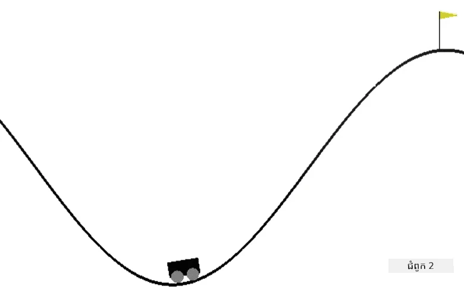

# រៀនបង្រៀនឡានភ្នំឲ្យគេចបានចេញ

ភារកិច្ចមន្ទីរ​សិក្សា​ពី [AI សម្រាប់អ្នកចាប់ផ្តើម Curriculum](https://github.com/microsoft/ai-for-beginners)។

## បំណងការ

គោលបំណងរបស់អ្នកគឺបង្រៀនភ្នាក់ងាររបៀបរៀន (RL) ដើម្បីគ្រប់គ្រង [ឡានភ្នំ](https://www.gymlibrary.ml/environments/classic_control/mountain_car/) ក្នុងបរិយាកាស OpenAI។

## បរិយាកាស

បរិយាកាសឡានភ្នំមានឡានត្រូវចងខ្សែក្នុងវាលភ្នំ។ គោលបំណងរបស់អ្នកគឺត្រូវលោតចេញពីវាលភ្នំនិងឈានដល់ទង់ជាតិក្នុងភ្នំ។ សកម្មភាពដែលអ្នកអាចធ្វើបានរួមមាន កំចាត់ឡានទៅខាងឆ្វេង ខាងស្តាំ ឬមិនធ្វើអ្វីទេ។ អ្នកអាចមើលឃើញទីតាំងឡានតាមអ័ក្ស x និងល្បឿន។

## សៀវភៅកំណត់ត្រាដំបូង

ចាប់ផ្តើមលំហាត់ដោយបើក [MountainCar.ipynb](MountainCar.ipynb)

## អ្វីដែលរៀនបាន

អ្នកគួរតែរៀននៅពេលបង្រៀននេះថា ការព្យាយាមប្រើអាល់ហ្គរីធម៌ RL ទៅបរិយាកាសថ្មី ជាការ៉ឺត្បិតងាយស្រួល ជាពិសេសដោយសារបរិយាកាស OpenAI Gym មានរបៀបធ្វើការដូចគ្នាសម្រាប់បរិយាកាសទាំងអស់ ហើយអាល់ហ្គរីធម៍ទាំងនោះមិនពឹងផ្អែកយ៉ាងខ្លាំងលើធម្មជាតិនៃបរិយាកាសទេ។ អ្នកអាចរៀបចំកូដ Python ជារបៀបដែលអាចផ្ទេរបរិយាកាសណាមួយទៅអាល់ហ្គរីធម៍ RL ជាប៉ារ៉ាម៉ែត្រ។

---

<!-- CO-OP TRANSLATOR DISCLAIMER START -->
**ការលើកចិត្តផ្សា**៖  
ឯកសារនេះត្រូវបានបកប្រែដោយប្រើសេវាកម្មបកប្រែ AI [Co-op Translator](https://github.com/Azure/co-op-translator)។ ខណៈពេលដែលយើងខិតខំផ្តល់នូវភាពត្រឹមត្រូវ សូមចំណាំថាការបកប្រែដោយស្វ័យប្រវត្តិអាចមានកំហុសឬភាពមិនត្រឹមត្រូវ។ ឯកសារដើមក្នុងភាសាមាតុភូមិរបស់វាគួរត្រូវបានគេទទួលស្គាល់ថាជាប្រភពដែលមានសិទ្ធិលើព័ត៍មាន។ សម្រាប់ព័ត៍មានមានសារៈសំខាន់ ការបកប្រែដោយមនុស្សអ្នកជំនាញត្រូវបានណែនាំ។ យើងមិនទទួលខុសត្រូវចំពោះការយល់ច្រឡំ ឬការបកស្រាយខុសពីការប្រើប្រាស់ការបកប្រែនេះឡើយ។
<!-- CO-OP TRANSLATOR DISCLAIMER END -->