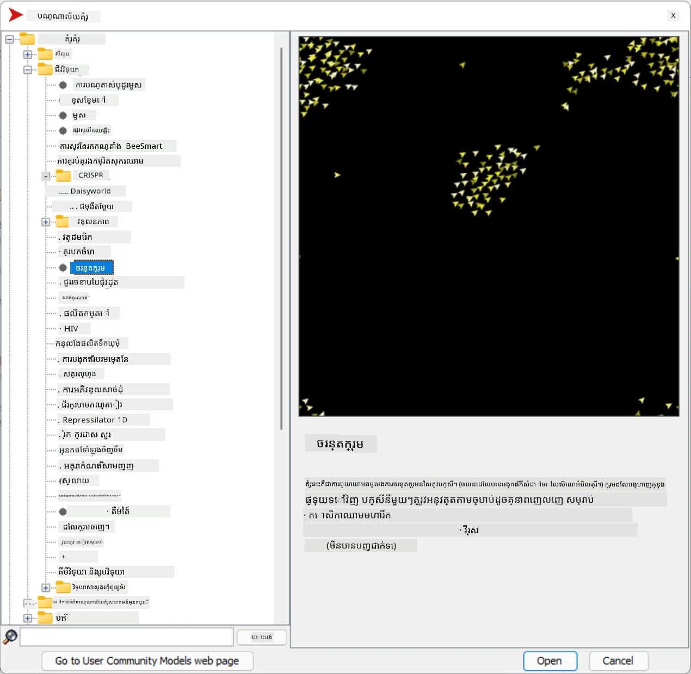
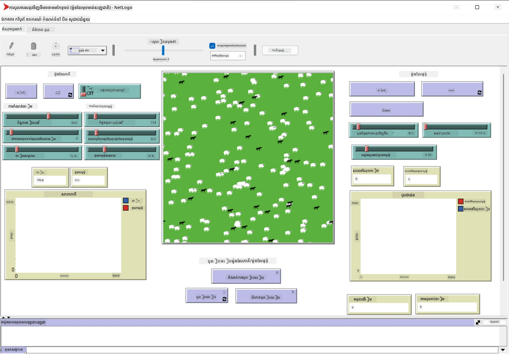

# ប្រព័ន្ធអ្នកប្រតិបត្តិការច្រើន

វិធីមួយក្នុងការសម្រេចបានលទ្ធភាពប្រសើរគឺ​វិធីសាស្រ្ត​ដែលហៅថា **emergent** (ឬ **synergetic**) ដែលផ្អែកលើភាពជាការពិតថា​ សកម្មភាពរួមគ្នារបស់អ្នកប្រតិបត្តិការច្រើនដែលមានភាពសាមញ្ញ អាចបណ្តាលឱ្យមានសកម្មភាពស្មុគស្មាញ (ឬ​មានប្រាជ្ញា) ទាំងមូលរបស់ប្រព័ន្ធ។ ជាទស្សនវិជ្ជា វាផ្អែកលើគោលការណ៍នៃ [ការបញ្ញាសមាស](https://en.wikipedia.org/wiki/Collective_intelligence), [ការកើតទំព័រ](https://en.wikipedia.org/wiki/Global_brain) និង [Evolutionary Cybernetics](https://en.wikipedia.org/wiki/Global_brain) ដែលវាសន្និដ្ឋានថាប្រព័ន្ធកម្រិតខ្ពស់ទទួលបានតម្លៃបន្ថែមមួយពីការរួមបញ្ចូលគ្នាសមរម្យពីប្រព័ន្ធកម្រិតទាប (ដែលហៅថា *គោលការណ៍ផ្លូវចិត្តរបស់ metasystem transition*)។

## [តេស្តមុនមេរៀន](https://ff-quizzes.netlify.app/en/ai/quiz/45)

ទិសដៅនៃ **ប្រព័ន្ធអ្នកប្រតិបត្តិការច្រើន** បានកើតឡើងក្នុង AI នៅឆ្នាំ 1990s ជាចម្លើយដល់ការរីកចម្រើនរបស់អ៊ីនធឺណិត និងប្រព័ន្ធចែកចាយ។ សៀវភៅសិក្សា AI ផ្លូវចាស់មួយ អត្ថបទ [Artificial Intelligence: A Modern Approach](https://en.wikipedia.org/wiki/Artificial_Intelligence:_A_Modern_Approach) ផ្តោតលើទស្សនៈនៃ AI ផ្លូវចាស់ពីមุมមองប្រព័ន្ធអ្នកប្រតិបត្តិការច្រើន។

ចំណុចដែលសំខាន់ក្នុងវិធីរបស់អ្នកប្រតិបត្តិការច្រើនគឺ​ **Agent** - អង្គភាពមួយដែលរស់នៅក្នុង **បរិយាកាស** មួយ ដែលវាអាចទទួលបានការយល់ដឹង និងអនុវត្តសកម្មភាពលើវា។ នេះជាការពិពណ៌នាធំទូលាយ ហើយអាចមានប្រភេទ និងចំណាត់ថ្នាក់នៃអាជីពជាច្រើន៖

* ដោយសមត្ថភាពក្នុងការតុល្យ:
   - អ្នកប្រតិបត្តិការ **Reactive** ជាទូទៅមានទ្រឹស្តីសំណើ-ឆ្លើយចម្លងសាមញ្ញ
   - អ្នកប្រតិបត្តិការ **Deliberative** ប្រើប្រាស់តុល្យាការ និង/ឬសមត្ថភាពផែនការ
* ដោយកន្លែងដែលអ្នកប្រតិបត្តិការ​ដំណើរការកូដរបស់ខ្លួន:
   - អ្នកប្រតិបត្តិការ **Static** ចំណីកូដនៅ Node បណ្តាញដាច់ខាតមួយ
   - អ្នកប្រតិបត្តិការ **Mobile** អាចផ្លាស់ទីកូដរបស់ខ្លួននៅក្នុង Node បណ្តាញផ្សេងៗ
* ដោយសេចក្ដីឥរិយាបថរបស់ពួកគេ:
   - អ្នកប្រតិបត្តិការ **Passive** មិនមានគោលបំណងជាក់លាក់ទេ។ អ្នកប្រតិបត្តិការ់បែបនេះអាចឆ្លើយតបទៅនឹងរំញោចខាងក្រៅ ប៉ុន្តាមិនចាប់ផ្តើមសកម្មភាពផ្ទាល់ខ្លួនឡើយ
   - អ្នកប្រតិបត្តិការ **Active** មានគោលបំណងមួយចំនួនដែលពួកគេចុះបញ្ជូល
   - អ្នកប្រតិបត្តិការ **Cognitive** បញ្ចូលផែនការ និងតុល្យស្មារតីស្មុគស្មាញ

ប្រព័ន្ធអ្នកប្រតិបត្តិការច្រើនទៅហើយត្រូវបានប្រើប្រាស់នៅក្នុងកម្មវិធីជាច្រើន៖

* ក្នុងហ្គេម ឥរិយាបថនៃតួអង្គមិនមែនជាកីឡាករម្នាក់ៗប្រើប្រាស់លទ្ធភាព AI មួយចំនួន និងអាចត្រូវបានគេឆ្លងកាត់ជាអ្នកប្រតិបត្តិការប្រកបដោយប្រាជ្ញា
* ក្នុងការផលិតវីដេអូ ការបង្ហាញសេណារី 3D ស្មុគស្មាញដែលពាក់ព័ន្ធទៅនឹងជាក្រុមធម្មតាត្រូវបានធ្វើជាទូទៅដោយប្រើការសាំញ៉ាញ់អ្នកប្រតិបត្តិការច្រើន
* ក្នុងម៉ូដែលប្រព័ន្ធវេចខ្ចប់ វិធីអ្នកប្រតិបត្តិការច្រើនត្រូវបានប្រើដើម្បីសាំញ៉ាញ់ឥរិយាបថនៃម៉ូដែលស្មុគស្មាញមួយ។ ឧទាហរណ៍ វិធីនេះត្រូវបានប្រើជោគជ័យក្នុងការព្យាករណ៍ការរីករាលដាលជម្ងឺ COVID-19 នៅជុំវិញពពកលោក។ វិធីសាស្រ្តដូចគ្នាក៏អាចត្រូវបានប្រើដើម្បីម៉ូដែលចរាចរណ៍ក្នុងទីក្រុង និងមើលថាតើវាប្ដូរយ៉ាងដូចម្តេចចំពោះការផ្លាស់ប្តូរក្បួនចរាចរណ៍។
* ក្នុងប្រព័ន្ធស្វ័យប្រវត្តស្មុគស្មាញ ឧបករណ៍នីមួយៗអាចដំណើរការជាអ្នកប្រតិបត្តិការឯករាជ្យ ដែលធ្វើឱ្យប្រព័ន្ធទាំងមូលមានភាពមិនមួយខ្លួន និងរឹងមាំជាងមុន។

យើងនឹងមិនចំណាយពេលយូរចូលជ្រៅក្នុងប្រព័ន្ធអ្នកប្រតិបត្តិការច្រើនទេ ប៉ុន្តែសូមពិចារណាឧទាហរណ៍មួយនៃ **ម៉ូដែលអ្នកប្រតិបត្តិការច្រើន**។

## NetLogo

[NetLogo](https://ccl.northwestern.edu/netlogo/) គឺជាបរិយាកាសម៉ូដែលអ្នកប្រតិបត្តិការច្រើនមួយដែលផ្អែកលើកំណែបំលែងនៃភាសាកម្មវិធី [Logo](https://en.wikipedia.org/wiki/Logo_(programming_language))។ ភាសានេះត្រូវបានអភិវឌ្ឍសម្រាប់បង្រៀនគំនិតកម្មវិធីទៅកុមារ ហើយវាអនុញ្ញាតឱ្យអ្នកគ្រប់គ្រងភ្នាក់ងារដែលហៅថា **turtle** ដែលអាចផ្លាស់ទីបាន ដាក់សតិកំណត់ពីក្រោយ។ វាអនុញ្ញាតឱ្យបង្កើតរូបរាងវិទ្យាសាស្រ្តស្មុគស្មាញ ដែលជាវិធីមើលឃើញយ៉ាងច្បាស់ក្នុងការយល់អំពីអនុវត្តិរបស់ភ្នាក់ងារ។

នៅក្នុង NetLogo យើងអាចបង្កើតពពួក turtles ជាច្រើនដោយប្រើពាក្យបញ្ជា `create-turtles`។ បន្ទាប់មក យើងអាចបញ្ជាទាំង turtles ទាំងអស់ឱ្យអនុវត្តសកម្មភាពមួយ (ក្នុងឧទាហរណ៍ខាងក្រោម - ធ្វើចំនុច 10 ខាងមុខ)៖

```
create-turtles 10
ask turtles [
  forward 10
]
```

ប្រាកដណាស់ វាមិនគួរឱ្យចាប់អារម្មណ៍ពេលដែល turtles ទាំងអស់ធ្វើអ្វីបានដូចគ្នាទេ ដូច្នេះយើងអាច `ask` ក្រុមតurtles មួយ ជាឧទាហរណ៍ អ្នកដែលនៅជិតចំណុចជាក់លាក់មួយ។ យើងអាចបង្កើត turtles មួយចំនួននៃ *ពូជ* ផ្សេងគ្នាតាមពាក្យបញ្ជា `breed [cats cat]`។ នៅទីនេះ `cat` ជាឈ្មោះពូជមួយ ហើយយើងត្រូវបញ្ជាក់ពាក្យទាំងឯកេតិយនិងពហុតួ ដោយសារតែបញ្ចា់បញ្ជាពិធីផ្សេងៗប្រើបែបផែនខុសគ្នា ដើម្បីទូលាយច្បាស់។

> ✅ យើងមិនចូលរួមសិក្សាភាសា NetLogo ដោយផ្ទាល់ទេ - អ្នកអាចទស្សនាទៅកាន់ធនធាន [វចនានុក្រមអន្តរកម្មសម្រាប់អ្នកចាប់ផ្តើម NetLogo](https://ccl.northwestern.edu/netlogo/bind/) ប្រសិនបើអ្នកចាប់អារម្មណ៍ស្វែងយល់បន្ថែម។

អ្នកអាច [ទាញយក](https://ccl.northwestern.edu/netlogo/download.shtml) និងដំឡើង NetLogo ដើម្បីសាកល្បង។

### បណ្ណាល័យម៉ូដែល

អ្វីដែលល្អនៅពីក្រោយ NetLogo គឺវាមានបណ្ណាល័យអ្នកម៉ូដែលដែលអាចសាកល្បងបាន។ ទៅកាន់ **File &rightarrow; Models Library** ហើយអ្នកមានប្រភេទម៉ូដែលជាច្រើនជ្រើសរើស។



> រូបថតផ្ទាំងបណ្ណាល័យម៉ូដែលដោយ Dmitry Soshnikov

អ្នកអាចបើកម៉ូដែលមួយ ឧទាហរណ៍ **Biology &rightarrow; Flocking**។

### គោលការណ៍សំខាន់ៗ

ក្រោយបើកម៉ូដែល អ្នកត្រូវបានយកទៅកាន់ផ្ទាំង NetLogo ប្រើប្រាស់ចម្បង។ នេះគឺជា ម៉ូដែលតំណាងថ្មីសង្ខេប ដែលពិពណ៌នាពីប្រជាជនប្រេះនិងចៀម​ ដែលមានធនធានកំណត់ (ស្មៅ)។



> រូបថតដោយ Dmitry Soshnikov

នៅលើផ្ទាំងនេះ អ្នកអាចមើលឃើញ៖

* ផ្នែក **Interface** ដែលមាន៖
  - វាលចម្បង ដែលអ្នកប្រតិបត្តិការទាំងអស់រស់នៅ
  - ការគ្រប់គ្រងផ្សេងៗ៖ ប៊ូតុង ស្លាយឌើរ ល។ អោយ
  - ក្រាហ្វដែលអាចប្រើសម្រាប់បង្ហាញប៉ារ៉ាម៉ែត្រ នៃការសាំញ៉ាញ់
* តាប **Code** ដែលមានកម្មវិធីកែសម្រួល សម្រាប់វាយបញ្ចូលកម្មវិធី NetLogo

ភាគច្រើន ផ្ទាំងនឹងមានប៊ូតុង **Setup** ដែលដំណើរការស្ថានភាពសាំញ៉ាញ់ និងប៊ូតុង **Go** ដើម្បីចាប់ផ្តើមការអនុវត្ត។ នេះត្រូវបានគ្រប់គ្រងដោយកូដដែលមានដូចខាងក្រោម៖

```
to go [
...
]
```

ពិព័រណ៍ NetLogo ប្រហែលមានវត្ថុដូចខាងក្រោម៖

* **Agents** (turtles) ដែលអាចផ្លាស់ទីនៅលើវាល ហើយអាចអនុវត្តអ្វីមួយ។ អ្នកបញ្ជាអ្នកប្រតិបត្តិការដោយប្រើ `ask turtles [...]` និងកូដក្នុងគន្លងនោះអនុវត្តដោយអ្នកប្រតិបត្តិការទាំងអស់ក្នុង *របៀប turtle mode*។
* **Patches** ជាតំបន់ជាមួយចំហៀងសម្រាប់វាល ដែលអ្នកប្រតិបត្តិការស្នាក់នៅលើវា។ អ្នកអាចយោងទាំងអស់អ្នកប្រតិបត្តិការនៅលើ patch តែមួយ ឬ អ្នកអាចផ្លាស់ប្តូរពណ៌ patch និងលក្ខណៈផ្សេងៗ។ អ្នកក៏អាច `ask patches` ឲ្យអនុវត្តអ្វីមួយ។
* **Observer** គឺជាអ្នកប្រតិបត្តិចម្រុះម្នាក់ដែលគ្រប់គ្រងពិភពលោក។ អ្នកចុចប៊ូតុងទាំងអស់អនុវត្តនៅក្នុង *ម៉ូដ observer*។

> ✅ សោភ័ណភាពនៃបរិយាកាសអ្នកប្រតិបត្តិការច្រើនគឺ​ កូដដែលដំណើរការនៅលើ turtle mode ឬ patch mode នឹងត្រូវដំណើរការប្រកបដោយសមកម្មដោយអ្នកទាំងអស់នៅពេលនាព្រហ្មទាំងស្រុង។ ដូច្នេះ ដោយសរសេរកូដតិចតួច ហើយកម្មវិធីអំពីឥរិយាបថអ្នកប្រតិបត្តិការផ្ទាល់ម្នាក់ អ្នកអាចបង្កើតឥរិយាបថស្មុគស្មាញរបស់ប្រព័ន្ធសាំញ៉ាញ់គ្រួសារទាំងមូល។

### Flocking

ជាឧទាហរណ៍នៃឥរិយាបថអ្នកប្រតិបត្តិការច្រើន នាំមក xem xét **[Flocking](https://en.wikipedia.org/wiki/Flocking_(behavior))**។ Flocking គឺជាគំរូស្មុគស្មាញដែលស្រដៀងនឹងរបៀបក្រុមមាន់បក្សជាតិក្រោម មើលពួកវាហោះហើរ អ្នកអាចគិតថាពួកវាអនុវត្តកាលកំណត់ស្គាល់មួយចំនួន រឺថាពួកវាមានប្រយោជន៍ខាងប្រាជ្ញា។ ទោះជាយ៉ាងណា អ្នកប្រតិបត្តិការផ្ទាល់ម្នាក់ (នៅទីនេះគឺ *មាន់*) ធ្វើការសង្កេតអ្នកប្រតិបត្តិការផ្សេងនៅចម្ងាយខ្លីៗ ហើយអនុវត្តតាមច្បាប់សាមញ្ញបី៖

* **Alignment** - វាផ្លាស់ទីទៅភាគរយដឹកនាំជាសាមញ្ញរបស់អ្នកជិតខាង
* **Cohesion** - វាខំប្រឹងផ្លាស់ទីទៅកាន់ទីតាំងភាគរយមធ្យមនៃអ្នកជិតខាង (*ទាក់ទាញចម្ងាយយូរ*)
* **Separation** - បើវាប្រហែលជា​ជិតខ្លាំងទៅដល់មាន់ផ្សេង វាខំប្រឹងផ្លាស់ទីឲ្យឆ្ងាយ (*ទម្លាក់ចម្ងាយខ្លី*)

អ្នកអាចដំណើរការ Flocking និងមើលឥរិយាបថ។ អ្នកក៏អាចកំណត់ប៉ារ៉ាម៉ែត្រ ដូចជា *កម្រិតបំបែក* ឬ *ជួរមើល* ដែលកំណត់ទម្ងន់ការមើលនៃមាន់ម្នាក់មួយ។ សំគាល់ថាបើអ្នកបន្ថយជួរមើលទៅសូន្យ មិនមានមាន់មួយណាអាចមើលឃើញ ទោះបីជា flocking រអស់។ បើបន្ថយការបំបែកទៅសូន្យ ផ្លូវមាន់ទាំងអស់នឹងមកជួរត្រង់។

> ✅ ផ្លាស់ទៅតាប **Code** ហើយមើលកន្លែងដែលច្បាប់បីនៃ flocking (alignment, cohesion និង separation) ត្រូវបានអនុវត្តនៅក្នុងកូដ។ សូមចំណាំថាយើងយោងតែអ្នកដែលនៅក្នុងទស្សនៈតែប៉ុណ្ណោះ។

### ម៉ូដែលផ្សេងទៀតសម្រាប់មើល

មានម៉ូដែលគួរឲ្យចាប់អារម្មណ៍ផ្សេងទៀតដែលអ្នកអាចសាកល្បងបាន៖

* **Art &rightarrow; Fireworks** បង្ហាញពីរបៀបដែល ភ្លើងលើឈើអាចត្រូវបានគេចាត់ទុកជាឥរិយាបថរួមរបស់ចរន្តភ្លើងផ្ទាល់ខ្លួន
* **Social Science &rightarrow; Traffic Basic** និង **Social Science &rightarrow; Traffic Grid** បង្ហាញម៉ូដែលចរាចរណ៍ទីក្រុងក្នុងមាត្រា 1D និង 2D Grid មានឬគ្មានសញ្ញាស្ទិប។ ឡានរាល់គ្រឿងនៅក្នុងសាំញ៉ាញ់ទាំងអស់អនុវត្តតាមច្បាប់ខាងក្រោម៖
   - ប្រសិនបើគេហៅទំហំពីមុខទំនេរ - ល្បឿនឡើង (រហូតដល់ល្បឿនអប្បបរមាមួយ)
   - ប្រសិនបើគេឃើញឧបសគ្គពីមុខ - បោះបង់ (និងអ្នកអាចកំណត់យ៉ាងហោចណាស់ថាអ្នកបើកបរ​អាចមើលឃើញឆ្ងាយប៉ុណ្ណា)
* **Social Science &rightarrow; Party** បង្ហាញរបៀបដែលមនុស្សក្រុមគ្នាជាមួយគ្នាផ្នែកពេលរាត្រីខារ៉ាអូខេមួយ។ អ្នកអាចស្វែងរករបៀបភ្ជាប់ចាប់គ្នានៃប៉ារ៉ាម៉ែត្រ ដែលនាំឲ្យមានការកើនឡើងលឿននៃក្ដីសប្បាយរីករាយនៃក្រុម។

ដូចដែលអ្នកបានឃើញពីឧទាហរណ៍ទាំងនេះ ការសាំញ៉ាញ់អ្នកប្រតិបត្តិការច្រើនអាចជាវិធីមានប្រយោជន៍សម្រាប់យល់ពីឥរិយាបថនៃប្រព័ន្ធស្មុគស្មាញដែលមានបុគ្គលជាច្រើនដែលអនុវត្តតាមគោលការណ៍ដូចគ្នា ឬស្រដៀងគ្នា។ វាក៏អាចត្រូវបានប្រើដើម្បីគ្រប់គ្រងភ្នាក់ងារឌីជីថល ដូចជា [NPCs](https://en.wikipedia.org/wiki/NPC) ក្នុងហ្គេមកុំព្យូទ័រ ឬភ្នាក់ងារនៅក្នុងពិភព 3D រូបភាព

## អ្នកប្រតិបត្តិការដែលមានការតុល្យ

អ្នកប្រតិបត្តិការដែលបានពិពណ៌នាខាងលើ គឺសាមញ្ញណាស់ អ្នកប្រតិបត្តិការเหล่านี้គឺជាអ្នកប្រតិបត្តិការ **វិភាគប្រតិកម្ម**។ ប៉ុន្តែពេលខ្លះ អ្នកប្រតិបត្តិការអាចមានសមត្ថភាពតុល្យ និងផែនការសកម្មភាព ដូច្នេះវាត្រូវបានគេហៅថា **អ្នកប្រតិបត្តិការដែលមានការតុល្យ**។

ឧទាហរណ៍ធម្មតា គឺជាភ្នាក់ងារផ្ទាល់ខ្លួនមួយ ដែលទទួលបានកំណត់ពីមនុស្សម្នាក់ ដើម្បីកក់ការធ្វើដំណើរថ្មីៗ។ សន្និដ្ឋានថា មានអ្នកប្រតិបត្តិការច្រើនក្នុងអ៊ីនធឺណិត អ្នកណាមួយអាចជួយវា។ វាគួរតែនឹងទាក់ទងអ្នកជំនួយផ្សេងៗ ដើម្បីស្ទាបើកាបានតម្លៃសំបុត្រយន្តហោះនេះសុទ្ធតែមាន អ្វីជាតម្លៃសណ្ឋាគារនៅតាមកាលបរិច្ឆេទផ្សេងៗ ហើយព្យាយាមចរចាតម្លៃល្អបំផុត។ ពេលផែនការធ្វើដំណើរនេះរួចរាល់ និងបានបញ្ជាក់ដោយម្ចាស់កម្មសិទ្ធិ វាអាចបន្តការកក់បាន។

ដើម្បីធ្វើការនេះ អ្នកប្រតិបត្តិការត្រូវការ **ទំនាក់ទំនង**។
សម្រាប់ការទំនាក់ទំនងជោគជ័យ ពួកគេត្រូវការ៖

* ភាសាទូទៅមួយចំនួនសម្រាប់ប្តូរស្រោចស្រង់ចំណេះដឹងមួយចំនួន ដូចជា [Knowledge Interchange Format](https://en.wikipedia.org/wiki/Knowledge_Interchange_Format) (KIF) និង [Knowledge Query and Manipulation Language](https://en.wikipedia.org/wiki/Knowledge_Query_and_Manipulation_Language) (KQML)។ ភាសាទាំងនេះត្រូវបានរចនាឡើងដោយផ្អែកលើ [Speech Act theory](https://en.wikipedia.org/wiki/Speech_act)។
* ភាសាទាំងនោះគួរត្រូវរួមបញ្ចូល **ប្រព័ន្ធនៃការចរចា** ដែលផ្អែកលើ ប្រភេទរបៀបលក់វិធីផ្សេងៗ។
* អត្រា **ontology ទូទៅ** ដែលប្រើសម្រាប់យោងទៅតាមគំនិតដូចគ្នា ដែលគេដឹងតែអត្ថន័យរបស់ពួកវា។
* វិធីសាស្រ្តក្នុងការស្វែងរកតើអ្នកប្រតិបត្តិការផ្សេងៗអាចធ្វើអ្វីបាន ខណៈពេលផ្អែកលើ ontology របស់ពួកវា។

អ្នកប្រតិបត្តិការដែលមានការតុល្យស្មុគស្មាញជាង reactive ពីព្រោះពួកគេមិនត្រឹមតែឆ្លើយតបដល់ការផ្លាស់ប្តូរនៅក្នុងបរិយាកាសទេ អ្នកណាគួរតែអាច *ចាប់ផ្តើម* សកម្មភាពបានផងដែរ។ ការរចនាតែមួយសម្រាប់អ្នកប្រតិបត្តិការដែលមានការតុល្យ​ហៅថា Belief-Desire-Intention (BDI) agent៖

* **Beliefs** ជាសំណុំចំណេះដឹងអំពីបរិយាកាស​របស់អ្នកប្រតិបត្តិការ។ វាអាចមានរចនាសម្ព័ន្ធជា អាគារចំណេះដឹង ឬច្បាប់មួយដែលអ្នកប្រតិបត្តិការ​អាចអនុវត្តឲ្យតស៊ូមតិបំពេញស្ថានភាពជាក់លាក់នៅក្នុងបរិយាកាស។
* **Desires** កំណត់អ្វីដែលអ្នកប្រតិបត្តិការ​ចង់ធ្វើ គឺគោលបំណងរបស់ខ្លួន។ ឧទាហរណ៍ គោលបំណងរបស់ភ្នាក់ងារជំនួយផ្ទាល់ខ្លួន ខាងលើ គឺកក់ដំណើរការ ហើយគោលបំណងរបស់ភ្នាក់ងារសណ្ឋាគារគឺបំផុតប្រាក់ចំណេញ។
* **Intentions** ជាសកម្មភាពជាក់លាក់ដែលអ្នកប្រតិបត្តិបញ្ជាំងធ្វើដើម្បីសម្រេចបានគោលបំណងរបស់ខ្លួន។ សកម្មភាពទូទៅផ្លាស់ប្ដូរបរិយាកាស និងបង្កើតការទំនាក់ទំនងជាមួយអ្នកប្រតិបត្តិការផ្សេងទៀត។

មានវេទិកាមួយចំនួនសម្រាប់កសាងប្រព័ន្ធអ្នកប្រតិបត្តិការច្រើន ដូចជា [JADE](https://jade.tilab.com/). [ក្រដាសនេះ](https://arxiv.org/ftp/arxiv/papers/2007/2007.08961.pdf) មានការពិភាក្សាអំពីវេទិកាអ្នកប្រតិបត្តិការច្រើន ជាមួយនឹងប្រវត្តិសង្ខេបនៃប្រព័ន្ធ និងរូបលក្ខណៈការប្រើប្រាស់ផ្សេងៗ។

## សេចក្តីសន្និដ្ឋាន

ប្រព័ន្ធអ្នកប្រតិបត្តិការច្រើនអាចមានទម្រង់ខុសគ្នាហើយត្រូវបានប្រើប្រាស់ក្នុងកម្មវិធីជាច្រើន។ ពួកវាទាំងអស់បុគ្គលិកលើឥរិយាបថសាមញ្ញរបស់អ្នកប្រតិបត្តិការផ្ទាល់ និងទទួលបានឥរិយាបថស្មុគស្មាញជាងមុនរបស់ប្រព័ន្ធទាំងមូល ដោយសារបទពិសោធន៍ **synergetic effect**។

## 🚀 챌린지

យកមេរៀននេះកក់ក្តៅទៅកាន់ពិភពពិត និងពិចារណាថាពីសំណុំនៃប្រព័ន្ធអ្នកប្រតិបត្តិការច្រើនមួយ ដែលអាចដោះស្រាយបញ្ហាមួយ។ ឧទាហរណ៍ ប្រព័ន្ធអ្នកប្រតិបត្តិការច្រើនត្រូវតែធ្វើអ្វី ដើម្បីបង្កើតផ្លូវរថយន្តរបស់សាលាបឋម? វាអាចដំណើរការ​យ៉ាងដូចម្តេចនៅក្នុងហាងនំ?

## [តេស្តក្រោយមេរៀន](https://ff-quizzes.netlify.app/en/ai/quiz/46)

## ការត្រួតពិនិត្យ និងការសិក្សាផ្ទាល់ខ្លួន

ពិនិត្យការប្រើប្រាស់ប្រព័ន្ធប្រភេទនេះនៅក្នុងឧស្សាហកម្ម។ ជ្រើសរើសវិស័យមួយដូចជាអាជីវកម្មផលិតកម្ម ឬវិស័យហ្គេមវិដេអូ ហើយស្វែងរកថា ប្រព័ន្ធអ្នកប្រតិបត្តិការច្រើនអាចប្រើសម្រាប់ដោះស្រាយបញ្ហាដ៏ប្លែកៗបានយ៉ាងដូចម្តេច។

## [NetLogo Assignment](assignment.md)

---

<!-- CO-OP TRANSLATOR DISCLAIMER START -->
**ការបង្ហាញការទទួលខុសត្រូវ**៖  
ឯកសារនេះត្រូវបានបកប្រែដោយប្រើសេវាកម្មបកប្រែ AI [Co-op Translator](https://github.com/Azure/co-op-translator)។ នៅពេលដែលយើងខិតខំដើម្បីឲ្យបានភាពត្រឹមត្រូវ សូមយល់ថាការបកប្រែដោយស្វ័យប្រវត្តិសមាជិកអាចមានកំហុស ឬការខុសឆ្គងបាន។ ឯកសារដើមនៅភាសាមេគួរត្រូវបានគិតថាជា ប្រភពចម្បងដែលត្រឹមត្រូវ។ សម្រាប់ព័ត៌មានសំខាន់ ជំរុញឲ្យប្រើការបកប្រែដោយអ្នកជំនាញមនុស្ស។ យើងមិនទទួលខុសត្រូវចំពោះការយល់ច្រឡំ ឬការបញ្ចេញន័យខុសដែលកើតឡើងពីការប្រើប្រាស់ការបកប្រែនេះទេ។
<!-- CO-OP TRANSLATOR DISCLAIMER END -->