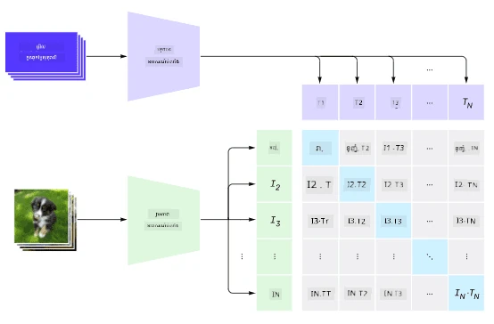
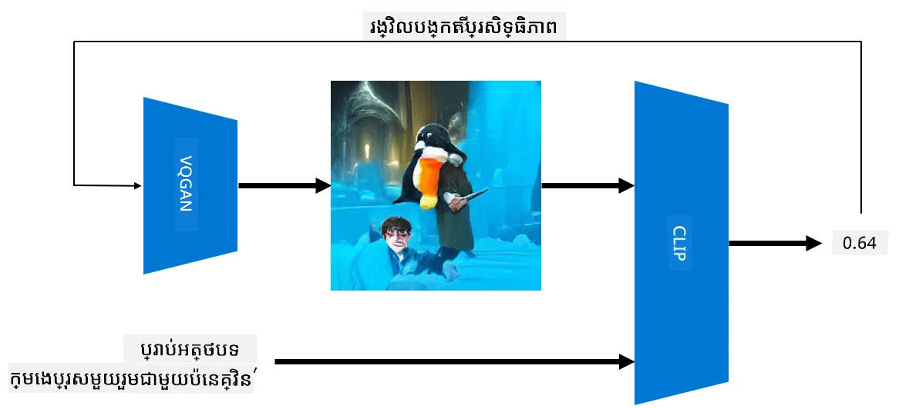
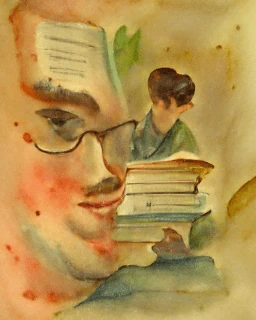
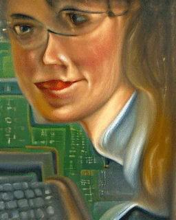
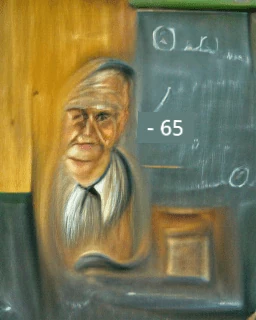

# បណ្ដាញពហុ​ម៉ូដេល

បន្ទាប់ពីការជោគជ័យនៃម៉ូដែល transformer សម្រាប់ដោះស្រាយបញ្ហា NLP កសាងរចនាសម្ព័ន្ធដូចគ្នា ឬស្រដៀងគ្នាត្រូវបានអនុវត្តលើបញ្ហាផ្សេងៗក្នុងការមើលឃើញកុំព្យូទ័រ។ មានចំណាប់អារម្មណ៍កើនឡើងក្នុងការសាងសង់ម៉ូដែលដែលនឹង *បញ្ចូល* សមត្ថភាពមើលឃើញ និងភាសាធម្មជាតិ។ មួយក្នុងចំណោមកិច្ចខិតខំប្រឹងប្រែងដូចបានធ្វើដោយ OpenAI ហើយវាត្រូវបានហៅថា CLIP និង DALL.E។

## ការបណ្តុះបណ្តាលរូបភាពប្រឆាំង (CLIP)

គំនិតសំខាន់នៃ CLIP គឺដើម្បីអាចប្រៀបធៀបការតម្រូវអត្ថបទជាមួយរូបភាព និងកំណត់ថាតើរូបភាពបានផ្គូផ្គងប៉ុណ្ណា រម្យជាមួយការតម្រូវ។

> *រូបភាពពី [អត្ថបទប្លុកនេះ](https://openai.com/blog/clip/)*

ម៉ូដែលត្រូវបានបណ្តុះបណ្តាលលើរូបភាពដែលទទួលបានពីអ៊ីនធឺណិត និងអត្ថបទពណ៌នារបស់ពួកវា។ សម្រាប់ប្រអប់នីមួយៗ យើងយកគូ N នៃ (រូបភាព, អត្ថបទ) ហើយបម្លែងពួកវាទៅជារូបភាពវ៉ិចទ័រ I1,..., IN / T1, ..., TN។ តំណាងទាំងនេះ ត្រូវបានផ្គូផ្គងគ្នា។ មុខងារបាត់បង់ត្រូវបានកំណត់ឡើងដើម្បីបង្កើនការស្រដៀង cosine រវាងវ៉ិចទ័រដែលផ្គូផ្គងគ្នា (ឧ. Ii និង Ti) ហើយកាត់បន្ថយការស្រដៀង cosine រវាងគូផ្សេងទៀតទាំងអស់។ នេះហើយជាហេតុផលដែលវិធីសាស្ត្រនេះត្រូវបានគេហៅថា **ប្រឆាំងគ្នា**។

ម៉ូដែល/បណ្ណាល័យ CLIP មានស្រាប់នៅ [OpenAI GitHub](https://github.com/openai/CLIP)។ វិធីសាស្ត្រទាំងនេះបានពិពណ៌នានៅ [អត្ថបទប្លុកនេះ](https://openai.com/blog/clip/), និងលម្អិតបន្ថែមនៅ [ឯកសារ​នេះ](https://arxiv.org/pdf/2103.00020.pdf)។

ពេលម៉ូដែលនេះត្រូវបានបណ្តុះបណ្តាលរួច អ្នកអាចផ្តល់ឲ្យវាប្រអប់រូបភាព និងប្រអប់អត្ថបទតម្រូវ ហើយវានឹងត្រឡប់មកជាតង់ស័រដែលមានប្រតិបត្តិការភាព។ CLIP អាចប្រើសម្រាប់បញ្ហាច្រើន៖

**ចាត់ថ្នាក់រូបភាព**

យើងយកគំរូយល់ថាត្រូវចាត់ថ្នាក់រូបភាពក្នុងចំណោម ឧ. ក្រុមឆ្មា, សត្វ​ឆ្កែ និងមនុស្ស។ នៅក្នុងករណីនេះ យើងអាចផ្តល់រូបភាពមួយ ដោយមានអត្ថបទតម្រូវ ច្រើនលំដាប់៖ "*រូបភាពនៃឆ្មាមួយ*", "*រូបភាពនៃឆ្កែមួយ*", "*រូបភាពនៃមនុស្សម្នាក់*។ នៅក្នុងវ៉ិចទ័រប្រតិបត្តិការភាព 3 យើងគ្រាន់តែជ្រើសរើសពណ៌សាន់​ដែលមានតម្លៃខ្ពស់បំផុត។

> *រូបភាពពី [អត្ថបទប្លុកនេះ](https://openai.com/blog/clip/)*

**ស្វែងរករូបភាពដោយផ្អែកលើអត្ថបទ**

យើងក៏អាចធ្វើ័រភាគវិញបាន។ ប្រសិនបើយើងមានកម្រងរូបភាព ក៏អាចផ្តល់កម្រងនេះទៅម៉ូដែល និងអត្ថបទតម្រូវ - វានឹងផ្តល់រូបភាពដែលស្រដៀងគ្នាម៉េចបំផុតនឹងអត្ថបទនោះ។

## ✍️ ឧទាហរណ៍: [ប្រើ CLIP សម្រាប់ចាត់ថ្នាក់រូបភាព និងស្វែងរករូបភាព](Clip.ipynb)

បើកកំណត់ត្រា [Clip.ipynb](Clip.ipynb) ដើម្បីមើល CLIP ដំណើរការ។

## ការបង្កើតរូបភាពជាមួយ VQGAN+ CLIP

CLIP ក៏អាចប្រើក្នុងការបង្កើតរូបភាពពីអត្ថបទតម្រូវបាន។ ដើម្បីធ្វើការនេះ ត្រូវការម៉ូដែល **ជាស្រ្តីមួយ** ដែលអាចបង្កើតរូបភាពទៅលើវ៉ិចទ័រប្រភេទចូលបsome។ ម៉ូដែលមួយដែលមានគឺហៅថា [VQGAN](https://compvis.github.io/taming-transformers/) (Vector-Quantized GAN)។

គំនិតសំខាន់ៗរបស់ VQGAN ដែលមានភាពខុសគ្នាពី [GAN](../../4-ComputerVision/10-GANs/README.md) ទូទៅមាន៖
* ប្រើរចនាសម្ព័ន្ធ transformer autoregressive ដើម្បីបង្កើតលំដាប់ផ្នែកវិចិត្រសរស្ត្រ context-rich ដែលបង្កើតរូបភាព។ ផ្នែកវិចិត្រសរស្ត្រខាងលើត្រូវបានរៀនជាមួយ [CNN](../../4-ComputerVision/07-ConvNets/README.md)
* ប្រើជាអ្នកគ្រប់គ្រងរូបភាពតូច (sub-image discriminator) ដែលរកឃើញថាផ្នែកនៃរូបភាពមាន "ពិត" ឬ "មិនពិត" (ខុសពីវិធីការ "ទាំងអស់ឬមិន" ក្នុង GAN ប្រពៃណី)។

សូមស្វែងយល់បន្ថែមអំពី VQGAN នៅតំបន់វេប [Taming Transformers](https://compvis.github.io/taming-transformers/)។

ភាពខុសគ្នាសំខាន់រវាង VQGAN និង GAN ប្រពៃណីគឺថា GANប្រពៃណីអាចបង្កើតរូបភាពល្អពីវ៉ិចទ័រប្រភេទចូលណាឡើយ ខណៈដែល VQGAN អាចបង្កើតរូបភាពមិនស្របតាមចំនួន ។ ដូច្នេះ យើងត្រូវដឹកនាំដំណើរការបង្កើតរូបភាពបន្ថែម ដែលអាចធ្វើបានជាមួយ CLIP។

ដើម្បីបង្កើតរូបភាពដែលត្រូវតែផ្គូផ្គងនឹងអត្ថបទចេញពីការតម្រូវ យើងចាប់ផ្តើមពីវ៉ិចទ័រទៅបណ្តុះបណ្តាល ដែលត្រូវបានបញ្ចូនតាម VQGAN ដើម្បីបង្កើតរូបភាព។ បន្ទាប់មក CLIP ត្រូវបានប្រើដើម្បីបង្កើតមុខងារបាត់បង់ដែលបង្ហាញថារូបភាពផ្គូផ្គងប៉ុណ្ណា ទៅតាមអត្ថបទតម្រូវ។ គោលបំណងត្រូវកាត់បន្ថយមុខងារបាត់បង់នេះ ដោយប្រើ back propagation ដើម្បីកែប្រែអថេរinputs vector។

បណ្ណាល័យដ៏ល្អសម្រាប់ដំណើរការ VQGAN+CLIP គឺ [Pixray](http://github.com/pixray/pixray)

 |   | 
----|----|----
រូបភាពបានបង្កើតពីអត្ថបទតម្រូវ *a closeup watercolor portrait of young male teacher of literature with a book* | រូបភាពបានបង្កើតពីអត្ថបទតម្រូវ *a closeup oil portrait of young female teacher of computer science with a computer* | រូបភាពបានបង្កើតពីអត្ថបទតម្រូវ *a closeup oil portrait of old male teacher of mathematics in front of blackboard*

> រូបភាពពីការប្រមូលផ្តុំ **Artificial Teachers** ដោយ [Dmitry Soshnikov](http://soshnikov.com)

## DALL-E
### [DALL-E 1](https://openai.com/research/dall-e)
DALL-E ជារូបមន្តនៃ GPT-3 ដែលត្រូវបានបណ្តុះបណ្តាលសម្រាប់បង្កើតរូបភាពពីអត្ថបទតម្រូវ។ វាត្រូវបានបណ្តុះបណ្តាលជាមួយប៉ារ៉ាម៉ែត្រ 12 ពាន់លាន។

ខុសពី CLIP, DALL-E ទទួលបានទាំងអត្ថបទ និងរូបភាពក្នុងចរន្តតែមួយសម្រាប់រូបភាព និងអត្ថបទទាំងអស់។ ដូច្នេះ ពីអត្ថបទតម្រូវជាច្រើន អ្នកអាចបង្កើតរូបភាពពីអត្ថបទ។

### [DALL-E 2](https://openai.com/dall-e-2)
ភាពខុសគ្នាសំខាន់រវាង DALL.E 1 និង 2 គឺថាវាបង្កើតរូបភាព និងសិល្បៈដែលមានភាពរឹងបញ្ចេញជាច្រើនជាងមុន។

ឧទាហរណ៍ការបង្កើតរូបភាពជាមួយ DALL-E:
 |   | 
----|----|----
រូបភាពបានបង្កើតពីអត្ថបទតម្រូវ *a closeup watercolor portrait of young male teacher of literature with a book* | រូបភាពបានបង្កើតពីអត្ថបទតម្រូវ *a closeup oil portrait of young female teacher of computer science with a computer* | រូបភាពបានបង្កើតពីអត្ថបទតម្រូវ *a closeup oil portrait of old male teacher of mathematics in front of blackboard*

## ឯកសារយោង

* ឯកសារ VQGAN: [Taming Transformers for High-Resolution Image Synthesis](https://compvis.github.io/taming-transformers/paper/paper.pdf)
* ឯកសារ CLIP: [Learning Transferable Visual Models From Natural Language Supervision](https://arxiv.org/pdf/2103.00020.pdf)

---

<!-- CO-OP TRANSLATOR DISCLAIMER START -->
**ការដោះលែងពីការទទួលខុសត្រូវ**:  
ឯកសារនេះត្រូវបានបកប្រែដោយប្រើសេវាកម្មបកប្រែ AI [Co-op Translator](https://github.com/Azure/co-op-translator)។ ខណៈពេលដែលយើងខិតខំប្រឹងប្រែងរកភាពត្រឹមត្រូវ សូមយល់ដឹងថាការបកប្រែដោយស្វ័យប្រវត្តិអាចមានកំហុស ឬមិនត្រឹមត្រូវខ្លះ។ ឯកសារដើមដែលមានភាសាដើមគួរត្រូវបានពិចារណាទៅជាមូលដ្ឋាននៃការទទួលស្គាល់។ សម្រាប់ព័ត៌មានសំខាន់ៗ ការបកប្រែដោយមនុស្សមើលឯកទេសគឺត្រូវបានណែនាំ។ យើងមិនទទួលខុសត្រូវចំពោះការយល់ច្រឡំ ឬការបកស្រាយខុស ដោយសារការប្រើប្រាស់ការបកប្រែនេះឡើយ។
<!-- CO-OP TRANSLATOR DISCLAIMER END -->