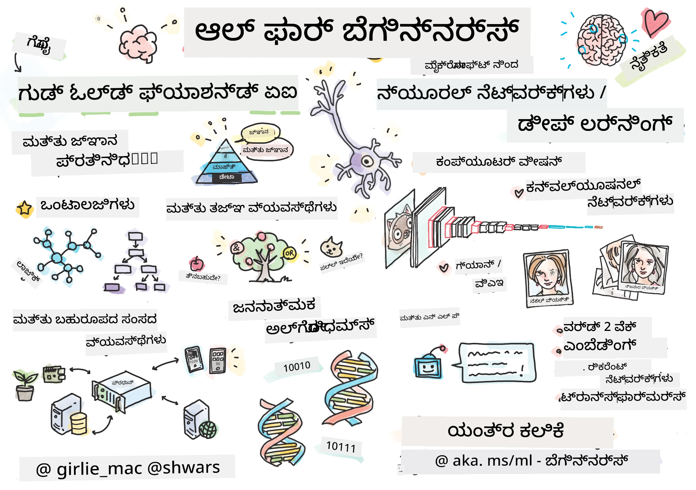

[](https://github.com/microsoft/AI-For-Beginners/blob/main/LICENSE)
[](https://GitHub.com/microsoft/AI-For-Beginners/graphs/contributors/)
[](https://GitHub.com/microsoft/AI-For-Beginners/issues/)
[](https://GitHub.com/microsoft/AI-For-Beginners/pulls/)
[](http://makeapullrequest.com)

[](https://GitHub.com/microsoft/AI-For-Beginners/watchers/)
[](https://GitHub.com/microsoft/AI-For-Beginners/network/)
[](https://GitHub.com/microsoft/AI-For-Beginners/stargazers/)
[](https://mybinder.org/v2/gh/microsoft/ai-for-beginners/HEAD)
[](https://gitter.im/Microsoft/ai-for-beginners?utm_source=badge&utm_medium=badge&utm_campaign=pr-badge)

[](https://discord.gg/nTYy5BXMWG)

# ಆರಂಭಿಕರಿಗಾಗಿ ಕೃತಕ ಬುದ್ಧಿಮತ್ತೆ - ಒಂದು ಪಾಠಕ್ರಮ

||
|:---:|
| ಆರಂಭಿಕರಿಗಾಗಿ AI - _ಸ್ಕೆಚ್ನೋಟ್ [@girlie_mac](https://twitter.com/girlie_mac) ಅವರಿಂದ_ |

ನಮ್ಮ 12 ವಾರಗಳ, 24 ಪಾಠಗಳ ಪಾಠಕ್ರಮದೊಂದಿಗೆ **ಕೃತಕ ಬುದ್ಧಿಮತ್ತೆ** (AI) ಜಗತ್ತನ್ನು ಅನ್ವೇಷಿಸಿ! ಇದು ಪ್ರಾಯೋಗಿಕ ಪಾಠಗಳು, ಪ್ರಶ್ನೋತ್ತರಗಳು ಮತ್ತು ಪ್ರಯೋಗಾಲಯಗಳನ್ನು ಒಳಗೊಂಡಿದೆ. ಪಾಠಕ್ರಮವು ಆರಂಭಿಕರಿಗೆ ಅನುಕೂಲಕರವಾಗಿದ್ದು TensorFlow ಮತ್ತು PyTorch ಸೇರಿದಂತೆ ಉಪಕರಣಗಳನ್ನು ಮತ್ತು AI ನ ನೀತಿಶಾಸ್ತ್ರವನ್ನು ಒಳಗೊಂಡಿದೆ.

### 🌐 ಬಹುಭಾಷಾ ಬೆಂಬಲ

#### GitHub Action ಮೂಲಕ ಬೆಂಬಲಿಸಲಾದ (ಸ್ವಯಂಪ್ರೇರಿತ ಮತ್ತು ಯಾವಾಗಲೂ ನವೀಕೃತ)

<!-- CO-OP TRANSLATOR LANGUAGES TABLE START -->
[Arabic](../ar/README.md) | [Bengali](../bn/README.md) | [Bulgarian](../bg/README.md) | [Burmese (Myanmar)](../my/README.md) | [Chinese (Simplified)](../zh-CN/README.md) | [Chinese (Traditional, Hong Kong)](../zh-HK/README.md) | [Chinese (Traditional, Macau)](../zh-MO/README.md) | [Chinese (Traditional, Taiwan)](../zh-TW/README.md) | [Croatian](../hr/README.md) | [Czech](../cs/README.md) | [Danish](../da/README.md) | [Dutch](../nl/README.md) | [Estonian](../et/README.md) | [Finnish](../fi/README.md) | [French](../fr/README.md) | [German](../de/README.md) | [Greek](../el/README.md) | [Hebrew](../he/README.md) | [Hindi](../hi/README.md) | [Hungarian](../hu/README.md) | [Indonesian](../id/README.md) | [Italian](../it/README.md) | [Japanese](../ja/README.md) | [Kannada](./README.md) | [Korean](../ko/README.md) | [Lithuanian](../lt/README.md) | [Malay](../ms/README.md) | [Malayalam](../ml/README.md) | [Marathi](../mr/README.md) | [Nepali](../ne/README.md) | [Nigerian Pidgin](../pcm/README.md) | [Norwegian](../no/README.md) | [Persian (Farsi)](../fa/README.md) | [Polish](../pl/README.md) | [Portuguese (Brazil)](../pt-BR/README.md) | [Portuguese (Portugal)](../pt-PT/README.md) | [Punjabi (Gurmukhi)](../pa/README.md) | [Romanian](../ro/README.md) | [Russian](../ru/README.md) | [Serbian (Cyrillic)](../sr/README.md) | [Slovak](../sk/README.md) | [Slovenian](../sl/README.md) | [Spanish](../es/README.md) | [Swahili](../sw/README.md) | [Swedish](../sv/README.md) | [Tagalog (Filipino)](../tl/README.md) | [Tamil](../ta/README.md) | [Telugu](../te/README.md) | [Thai](../th/README.md) | [Turkish](../tr/README.md) | [Ukrainian](../uk/README.md) | [Urdu](../ur/README.md) | [Vietnamese](../vi/README.md)

> **ಸ್ಥಳೀಯವಾಗಿ ಕ್ಲೋನ್ ಮಾಡಿ ಬೇಕು?**

> ಈ ಸಂಗ್ರಹಾಷಯದಲ್ಲಿ 50+ ಭಾಷೆಗಳ ಅನುವಾದಗಳನ್ನು ಒಳಗೊಂಡಿದ್ದು ಡೌನ್‌ಲೋಡ್ ಗಾತ್ರವನ್ನು ಬಹುಪಾಲಾಗಿ ಹೆಚ್ಚಿಸುತ್ತದೆ. ಅನುವಾದಗಳಿಲ್ಲದೆ ಕ್ಲೋನ್ ಮಾಡಲು, ಸ್ಪಾರ್ಸ್ ಚಾಲೆಂಜ್ ಬಳಸಿ: 
> ```bash
> git clone --filter=blob:none --sparse https://github.com/microsoft/AI-For-Beginners.git
> cd AI-For-Beginners
> git sparse-checkout set --no-cone '/*' '!translations' '!translated_images'
> ```
> ಇದರಿಂದ ನೀವು ಪಾಠಕ್ರಮವನ್ನು ಪೂರ್ಣಗೊಳಿಸಲು ಬೇಕಾದ ಎಲ್ಲವನ್ನೂ ಹೆಚ್ಚು ವೇಗವಾಗಿ ಡೌನ್‌ಲೋಡ್ ಮಾಡಬಹುದು.
<!-- CO-OP TRANSLATOR LANGUAGES TABLE END -->

**ನೀವು ಹೆಚ್ಚುವರಿ ಅನುವಾದ ಭಾಷೆಗಳ ಬೆಂಬಲವನ್ನು ಬಯಸಿದರೆ, ಅವುಗಳನ್ನು ಇಲ್ಲಿ [ನೋಡಿ](https://github.com/Azure/co-op-translator/blob/main/getting_started/supported-languages.md)**

## ಸಮುದಾಯದಲ್ಲಿ ಸೇರಿ
[](https://discord.gg/nTYy5BXMWG)

## ನೀವು ಕಲಿಯುವವು

**[ಪಾಠಕ್ರಮದ ಮೈಂಡ್‌ಮ್ಯಾಪ್](http://soshnikov.com/courses/ai-for-beginners/mindmap.html)**

ಈ ಪಾಠಕ್ರಮದಲ್ಲಿ, ನೀವು ಕಲಿಯುವುದು:

* **ಕೃತಕ ಬುದ್ಧಿಮತ್ತೆಗೆ** ವಿಭಿನ್ನ ವಿಧಾನಗಳು, "ಹಳೆ" ಚಿಹ್ನಾತ್ಮಕ ವಿಧಾನವನ್ನು ಒಳಗೊಂಡು **ಜ್ಞಾನ ಪ್ರತಿನಿಧಾನ** ಮತ್ತು ತರ್ಕ ([GOFAI](https://en.wikipedia.org/wiki/Symbolic_artificial_intelligence)).
* **ನೂತನ ಜಾಲಗಳು** ಮತ್ತು **ದೀಪ್ ಲರ್ನಿಂಗ್**, ಇವು ಆಧುನಿಕ AI ಇಂದಿರುವ ಹೃದಯಭಾಗ. ನಾವು ಈ ಪ್ರಮುಖ ವಿಷಯಗಳ ಹಿಂದೆ ಇರುವ ತತ್ವಗಳನ್ನು [TensorFlow](http://Tensorflow.org) ಮತ್ತು [PyTorch](http://pytorch.org) ಎಂಬ ಎರಡು ಜನಪ್ರಿಯ ಫ್ರೇಮ್ವർക്ക್ಸ್‌ನಲ್ಲಿ ಕೋಡ್ ಮೂಲಕ ವಿವರಿಸುತ್ತೇವೆ.
* ಚಿತ್ರಗಳು ಮತ್ತು ಪಠ್ಯಗಳೊಂದಿಗೆ ಕೆಲಸ ಮಾಡುವ **ನ್ಯೂರಲ್ ವಾಸ್ತುಶಿಲ್ಪಗಳು**. ನಾವು ಇತ್ತೀಚಿನ ಮಾದರಿಗಳನ್ನು ಒಳಗೊಂಡಿದ್ದರೂ, ಕೆಲವೊಂದು ಹಾಲಿನಲ್ಲಿರಬಹುದು.
* ಕಡಿಮೆ ಜನಪ್ರಿಯ AI ವಿಧಾನಗಳು, ಉದಾಹರಣೆಗೆ **ಜೆನೆಟಿಕ್ ಆಲ್ಗೋರಿಧಮ್‌ಗಳು** ಮತ್ತು **ಬಹು- ಏಜೆಂಟ್ ವ್ಯವಸ್ಥೆಗಳು**.

ನಮ್ಮ ಪಾಠಕ್ರಮದಲ್ಲಿ ನಾವು ಒಳಗೊಂಡಿಲ್ಲದವು:

> [ಈ ಪಾಠಕ್ರಮದ ಎಲ್ಲಾ ಹೆಚ್ಚುವರಿ ಸಂಪನ್ಮೂಲಗಳನ್ನು ನಮ್ಮ Microsoft Learn ಸಂಗ್ರಹದಲ್ಲಿ ಹುಡುಕಿ](https://learn.microsoft.com/en-us/collections/7w28iy2xrqzdj0?WT.mc_id=academic-77998-bethanycheum)

*  **ವ್ಯವಹಾರಗಳಲ್ಲಿ AI** ಉಪಯೋಗದ ವ್ಯವಹಾರ ಪ್ರಕರಣಗಳು. [AI for business users ಪರಿಚಯ](https://docs.microsoft.com/learn/paths/introduction-ai-for-business-users/?WT.mc_id=academic-77998-bethanycheum) ಪಾಠಕ್ರಮ ಅಥವಾ [AI Business School](https://www.microsoft.com/ai/ai-business-school/?WT.mc_id=academic-77998-bethanycheum), [INSEAD](https://www.insead.edu/) ಜೊತೆ ಸಹಕಾರದಿಂದ ಅಭಿವೃದ್ಧಿಪಡಿಸಲಾಗಿದೆ.
* ನಮ್ಮ [ಯಂತ್ರ ಕಲಿಕೆಯ ಆರಂಭಿಕರಿಗಾಗಿ ಪಾಠಕ್ರಮ](http://github.com/Microsoft/ML-for-Beginners) ನಲ್ಲಿ ಚೆನ್ನಾಗಿ ವಿವರಿಸಲಾದ **ಪಾರಂಪರಿಕ ಯಂತ್ರ ಕಲಿಕೆ**.
* **[ಕಾಗ್ನಿಟಿವ್ ಸರ್ವೀಸ್‌ಗಳು](https://azure.microsoft.com/services/cognitive-services/?WT.mc_id=academic-77998-bethanycheum)** ಬಳಸಿ ನಿರ್ಮಿಸಲಾದ ಪ್ರಾಯೋಗಿಕ AI ಅನ್ವಯಗಳು. ಇದಕ್ಕಾಗಿ ನಾವು Microsoft Learn ನ [ದೃಷ್ಟಿ](https://docs.microsoft.com/learn/paths/create-computer-vision-solutions-azure-cognitive-services/?WT.mc_id=academic-77998-bethanycheum), [ಸ್ವಾಭಾವಿಕ ಭಾಷಾ ಪ್ರಕ್ರಿಯೆ](https://docs.microsoft.com/learn/paths/explore-natural-language-processing/?WT.mc_id=academic-77998-bethanycheum), **[Azure OpenAI ಸೇವೆಯೊಂದಿಗೆ ಉತ್ಪಾದಕ AI](https://learn.microsoft.com/en-us/training/paths/develop-ai-solutions-azure-openai/?WT.mc_id=academic-77998-bethanycheum)** ಮತ್ತು ಇತರೆ ಮಾಂಡ್ಯುಲ್ಗಳಿಂದ ಪ್ರಾರಂಭಿಸುವುದನ್ನು ಶಿಫಾರಸು ಮಾಡುತ್ತೇವೆ.
* ನಿರ್ದಿಷ್ಟ ML **ಕ್ಲೌಡ್ ಫ್ರೇಮ್ವರ್ಕ್‌ಗಳು**, ಉದಾ: [Azure Machine Learning](https://azure.microsoft.com/services/machine-learning/?WT.mc_id=academic-77998-bethanycheum), [Microsoft Fabric](https://learn.microsoft.com/en-us/training/paths/get-started-fabric/?WT.mc_id=academic-77998-bethanycheum), ಅಥವಾ [Azure Databricks](https://docs.microsoft.com/learn/paths/data-engineer-azure-databricks?WT.mc_id=academic-77998-bethanycheum). [Build and operate machine learning solutions with Azure Machine Learning](https://docs.microsoft.com/learn/paths/build-ai-solutions-with-azure-ml-service/?WT.mc_id=academic-77998-bethanycheum) ಮತ್ತು [Build and Operate Machine Learning Solutions with Azure Databricks](https://docs.microsoft.com/learn/paths/build-operate-machine-learning-solutions-azure-databricks/?WT.mc_id=academic-77998-bethanycheum) ಪಾಠಕ್ರಮಗಳನ್ನು ಬಳಸದಿರಿ.
* **ಸಂवादಾತ್ಮಕ AI** ಮತ್ತು **ಚಾಟ್ ಬಾಟ್ಗಳು**. ಅವರುಗಳಿಗಾಗಿ ಪ್ರತ್ಯೇಕ [ಸಂವಾದಾತ್ಮಕ AI ಪರಿಹಾರಗಳನ್ನು ರಚಿಸಿ](https://docs.microsoft.com/learn/paths/create-conversational-ai-solutions/?WT.mc_id=academic-77998-bethanycheum) ಪಾಠಕ್ರಮ ಇದೆ, ಮತ್ತು ನೀವು ಹೆಚ್ಚಿನ ವಿವರಗಳಿಗೆ [ಈ ಬ್ಲಾಗ್ ಪೋಸ್ಟ್](https://soshnikov.com/azure/hello-bot-conversational-ai-on-microsoft-platform/) ಅನ್ನು ಕೂಡ ನೋಡಬಹುದು.
* ದೀಪ್ ಲರ್ನಿಂಗ್ ಹಿಂದಿರುವ **ಕಠಿಣ ಗಣಿತಶಾಸ್ತ್ರ**. ಇದಕ್ಕಾಗಿ ನಾವು Ian Goodfellow, Yoshua Bengio ಮತ್ತು Aaron Courville ರವರ [Deep Learning](https://www.amazon.com/Deep-Learning-Adaptive-Computation-Machine/dp/0262035618) ಅನ್ನು ಶಿಫಾರಸು ಮಾಡುತ್ತೇವೆ, ಇನ್ನೂ ಇದು [https://www.deeplearningbook.org/](https://www.deeplearningbook.org/) ನಲ್ಲಿ ಲಭ್ಯವಿದೆ.

_ಕ್ಲೌಡ್‌ನಲ್ಲಿ AI_ ವಿಷಯಗಳಿಗೆ ಮೃದುವಾದ ಪರಿಚಯಕ್ಕಾಗಿ ನೀವು [Get started with artificial intelligence on Azure](https://docs.microsoft.com/learn/paths/get-started-with-artificial-intelligence-on-azure/?WT.mc_id=academic-77998-bethanycheum) ಪಾಠಕ್ರಮವನ್ನು ಪರಿಗಣಿಸಬಹುದು.

# ವಿಷಯ ವಸ್ತು

|     |                                                                 ಪಾಠ ಲಿಂಕ್                                                                  |                                           PyTorch/Keras/TensorFlow                                          | ಪ್ರಯೋಗಾಲಯ                                                            |
| :-: | :------------------------------------------------------------------------------------------------------------------------------------------: | :---------------------------------------------------------------------------------------------: | ------------------------------------------------------------------------------ |
| 0  |                                 [ಪಾಠಕ್ರಮ ಹೊಂದಿಸಿ](./lessons/0-course-setup/setup.md)                                 |                      [ನಿಮ್ಮ ಅಭಿವೃದ್ಧಿ ಪರಿಸರವನ್ನು ಹೊಂದಿಸಿ](./lessons/0-course-setup/how-to-run.md)                       |   |
| I  |               [**AI ಗೆ ಪರಿಚಯ**](./lessons/1-Intro/README.md)      | | |
| 01  |       [AI ಪರಿಚಯ ಮತ್ತು ಇತಿಹಾಸ](./lessons/1-Intro/README.md)       |           -                            | -  |
| II |              **ಚಿಹ್ನಾತ್ಮಕ AI**              |
| 02  |       [ಜ್ಞಾನ ಪ್ರತಿನಿಧಾನ ಮತ್ತು ತಜ್ಞ ವ್ಯವಸ್ಥೆಗಳು](./lessons/2-Symbolic/README.md)       |            [ತಜ್ಞ ವ್ಯವಸ್ಥೆಗಳು](./lessons/2-Symbolic/Animals.ipynb) /  [ಇಡೀಕೋೇಂದ್ರ](./lessons/2-Symbolic/FamilyOntology.ipynb) /[ಅವಧಾರಣಾ ಗ್ರಾಫ್](./lessons/2-Symbolic/MSConceptGraph.ipynb)                             |  |
| III |                        [**ನ್ಯೂರಲ್ ನೆಟ್ವರ್ಕ್‌ಗಳ ಪರಿಚಯ**](./lessons/3-NeuralNetworks/README.md) |||
| 03  |                [ಪರ್ಸೆಪ್ಟ್ರಾನ್](./lessons/3-NeuralNetworks/03-Perceptron/README.md)                 |                       [ಹೊಡ್ಬುಕ್ಸ್](./lessons/3-NeuralNetworks/03-Perceptron/Perceptron.ipynb)                      | [ಪ್ರಯೋಗಾಲಯ](./lessons/3-NeuralNetworks/03-Perceptron/lab/README.md) |
| 04  |                   [ಮಲ್ಟಿ-ಲೇಯರ್‌ಡ್ ಪರ್ಸೆಪ್ಟ್ರಾನ್ ಮತ್ತು ನಮ್ಮದೇ ಫ್ರೇಮ್ವರ್ಕ್ ರಚನೆ](./lessons/3-NeuralNetworks/04-OwnFramework/README.md)                   |        [ಹೊಡ್ಬುಕ್ಸ್](./lessons/3-NeuralNetworks/04-OwnFramework/OwnFramework.ipynb)        | [ಪ್ರಯೋಗಾಲಯ](./lessons/3-NeuralNetworks/04-OwnFramework/lab/README.md) |
| 05  |            [ಫ್ರೇಮ್ವರ್ಕ್‌ಗಳ ಪರಿಚಯ (ಪೈಟಾರ್ಚ್ / ಟೆನ್ಸರ್‌ಫ್ಲೋ) ಮತ್ತು ಓವರ್ಫಿಟಿಂಗ್](./lessons/3-NeuralNetworks/05-Frameworks/README.md)             |           [ಪೈಟಾರ್ಚ್](./lessons/3-NeuralNetworks/05-Frameworks/IntroPyTorch.ipynb) / [ಕೇರಾಸ್](./lessons/3-NeuralNetworks/05-Frameworks/IntroKeras.ipynb) / [ಟೆನ್ಸರ್‌ಫ್ಲೋ](./lessons/3-NeuralNetworks/05-Frameworks/IntroKerasTF.ipynb)             | [ಪ್ರಯೋಗಾಲಯ](./lessons/3-NeuralNetworks/05-Frameworks/lab/README.md) |
| IV  |            [**ಕಂಪ್ಯೂಟರ್ ವೀಕ್ಷಣೆ**](./lessons/4-ComputerVision/README.md)             | [ಪೈಟಾರ್ಚ್](https://docs.microsoft.com/learn/modules/intro-computer-vision-pytorch/?WT.mc_id=academic-77998-cacaste) / [ಟೆನ್ಸರ್‌ಫ್ಲೋ](https://docs.microsoft.com/learn/modules/intro-computer-vision-TensorFlow/?WT.mc_id=academic-77998-cacaste)| [ಮೈಕ್ರೋಸಾಫ್ಟ್ ಅಝ್ಯೂರ್‌ನಲ್ಲಿ ಕಂಪ್ಯೂಟರ್ ವೀಕ್ಷಣೆಯನ್ನು ಅನ್ವೇಷಿಸಿ](https://learn.microsoft.com/en-us/collections/7w28iy2xrqzdj0?WT.mc_id=academic-77998-bethanycheum) |
| 06  |            [ಕಂಪ್ಯೂಟರ್ ವೀಕ್ಷಣೆಗೆ ಪರಿಚಯ. OpenCV](./lessons/4-ComputerVision/06-IntroCV/README.md)             |           [ಹೊಡ್ಬುಕ್ಸ್](./lessons/4-ComputerVision/06-IntroCV/OpenCV.ipynb)         | [ಪ್ರಯೋಗಾಲಯ](./lessons/4-ComputerVision/06-IntroCV/lab/README.md) |
| 07  |            [ಕನ್ವೊಲ್ಯೂಷನಲ್ ನ್ಯೂರಲ್ ನೆಟ್ವರ್ಕ್ಸ್](./lessons/4-ComputerVision/07-ConvNets/README.md) &  [CNN ವಿನ್ಯಾಸಗಳು](./lessons/4-ComputerVision/07-ConvNets/CNN_Architectures.md)             |           [ಪೈಟಾರ್ಚ್](./lessons/4-ComputerVision/07-ConvNets/ConvNetsPyTorch.ipynb) /[ಟೆನ್ಸರ್‌ಫ್ಲೋ](./lessons/4-ComputerVision/07-ConvNets/ConvNetsTF.ipynb)             | [ಪ್ರಯೋಗಾಲಯ](./lessons/4-ComputerVision/07-ConvNets/lab/README.md) |
| 08  |            [ಮುನ್ಮೂಲಿತ ನೇಟ್ವರ್ಕ್‌ಗಳು ಮತ್ತು ವರ್ಗಾವಣೆ ಅಧ್ಯಯನ](./lessons/4-ComputerVision/08-TransferLearning/README.md) ಮತ್ತು [ಶಿಕ್ಷಣ ತಂತ್ರಗಳು](./lessons/4-ComputerVision/08-TransferLearning/TrainingTricks.md)             |           [ಪೈಟಾರ್ಚ್](./lessons/4-ComputerVision/08-TransferLearning/TransferLearningPyTorch.ipynb) / [ಟೆನ್ಸರ್‌ಫ್ಲೋ](./lessons/3-NeuralNetworks/05-Frameworks/IntroKerasTF.ipynb)             | [ಪ್ರಯೋಗಾಲಯ](./lessons/4-ComputerVision/08-TransferLearning/lab/README.md) |
| 09  |            [ಆಟೋಎನ್‌ಕೋಡರ್‌ಗಳು ಮತ್ತು ವೇ](./lessons/4-ComputerVision/09-Autoencoders/README.md)             |           [ಪೈಟಾರ್ಚ್](./lessons/4-ComputerVision/09-Autoencoders/AutoEncodersPyTorch.ipynb) / [ಟೆನ್ಸರ್‌ಫ್ಲೋ](./lessons/4-ComputerVision/09-Autoencoders/AutoencodersTF.ipynb)             |  |
| 10  |            [ಜನರೇಟಿವ್ ಶತ್ರುತ್ವ ನೆಟ್ವರ್ಕ್ಸ್ ಮತ್ತು ಕಲೆ ಶೈಲಿ ವರ್ಗಾವಣೆ](./lessons/4-ComputerVision/10-GANs/README.md)             |           [ಪೈಟಾರ್ಚ್](./lessons/4-ComputerVision/10-GANs/GANPyTorch.ipynb) / [ಟೆನ್ಸರ್‌ಫ್ಲೋ](./lessons/4-ComputerVision/10-GANs/GANTF.ipynb)             |  |
| 11  |            [ವಸ್ತು ಪತ್ತೆ](./lessons/4-ComputerVision/11-ObjectDetection/README.md)             |         [ಟೆನ್ಸರ್‌ಫ್ಲೋ](./lessons/4-ComputerVision/11-ObjectDetection/ObjectDetection.ipynb)             | [ಪ್ರಯೋಗಾಲಯ](./lessons/4-ComputerVision/11-ObjectDetection/lab/README.md) |
| 12  |            [ಅರ್ಥಗರ್ಭಿತ ವಿಭಾಜನೆ. ಯು-ನೆಟ್](./lessons/4-ComputerVision/12-Segmentation/README.md)             |           [ಪೈಟಾರ್ಚ್](./lessons/4-ComputerVision/12-Segmentation/SemanticSegmentationPytorch.ipynb) / [ಟೆನ್ಸರ್‌ಫ್ಲೋ](./lessons/4-ComputerVision/12-Segmentation/SemanticSegmentationTF.ipynb)             |  |
| V  |            [**ಪ್ರಾಕೃತಿಕ ಭಾಷಾ ಪ್ರಕ್ರಿಯೆ**](./lessons/5-NLP/README.md)             | [ಪೈಟಾರ್ಚ್](https://docs.microsoft.com/learn/modules/intro-natural-language-processing-pytorch/?WT.mc_id=academic-77998-cacaste) /[ಟೆನ್ಸರ್‌ಫ್ಲೋ](https://docs.microsoft.com/learn/modules/intro-natural-language-processing-TensorFlow/?WT.mc_id=academic-77998-cacaste) | [ಮೈಕ್ರೋಸಾಫ್ಟ್ ಅಝ್ಯೂರ್‌ನಲ್ಲಿ ಪ್ರಾಕೃತಿಕ ಭಾಷಾ ಪ್ರಕ್ರಿಯೆಯನ್ನು ಅನ್ವೇಷಿಸಿ](https://learn.microsoft.com/en-us/collections/7w28iy2xrqzdj0?WT.mc_id=academic-77998-bethanycheum)|
| 13  |            [ಪಠ್ಯದ ಪ್ರತಿನಿಧಾನ. ಬೋ/ಟಿಎಫ್-ಐಡಿಎಫ್](./lessons/5-NLP/13-TextRep/README.md)             |           [ಪೈಟಾರ್ಚ್](https://github.com/microsoft/AI-For-Beginners/blob/main/lessons/5-NLP/13-TextRep/TextRepresentationPyTorch.ipynb) / [ಟೆನ್ಸರ್‌ಫ್ಲೋ](https://github.com/microsoft/AI-For-Beginners/blob/main/lessons/5-NLP/13-TextRep/TextRepresentationTF.ipynb)             | |
| 14  |            [ಅರ್ಥಗರ್ಭಿತ ಪದದ ಎಂಬೆಡ್ಡಿಂಗ್‌ಗಳು. ವರ್ಡ್2ವೆಕ್ ಮತ್ತು ಗ್ಲೋವ್](./lessons/5-NLP/14-Embeddings/README.md)             |           [ಪೈಟಾರ್ಚ್](https://github.com/microsoft/AI-For-Beginners/blob/main/lessons/5-NLP/14-Embeddings/EmbeddingsPyTorch.ipynb) / [ಟೆನ್ಸರ್‌ಫ್ಲೋ](https://github.com/microsoft/AI-For-Beginners/blob/main/lessons/5-NLP/14-Embeddings/EmbeddingsTF.ipynb)             |  |
| 15  |            [ಭಾಷಾ ಮಾದರಿಯ ನಿರ್ಮಾಣ. ನಿಮ್ಮದೇ ಎಂಬೆಡ್ಡಿಂಗ್‌ಗಳ ತರಬೇತಿ](./lessons/5-NLP/15-LanguageModeling/README.md)             |           [ಪೈಟಾರ್ಚ್](https://github.com/microsoft/AI-For-Beginners/blob/main/lessons/5-NLP/15-LanguageModeling/CBoW-PyTorch.ipynb) / [ಟೆನ್ಸರ್‌ಫ್ಲೋ](https://github.com/microsoft/AI-For-Beginners/blob/main/lessons/5-NLP/15-LanguageModeling/CBoW-TF.ipynb)             | [ಪ್ರಯೋಗಾಲಯ](./lessons/5-NLP/15-LanguageModeling/lab/README.md) |
| 16  |            [ಪುನರಾವರ್ತಿತ ನ್ಯೂರಲ್ ನೆಟ್ವರ್ಕ್ಸ್](./lessons/5-NLP/16-RNN/README.md)             |           [ಪೈಟಾರ್ಚ್](https://github.com/microsoft/AI-For-Beginners/blob/main/lessons/5-NLP/16-RNN/RNNPyTorch.ipynb) / [ಟೆನ್ಸರ್‌ಫ್ಲೋ](https://github.com/microsoft/AI-For-Beginners/blob/main/lessons/5-NLP/16-RNN/RNNTF.ipynb)             |  |
| 17  |            [ಜನರೇಟಿವ್ ಪುನರಾವರ್ತಿತ ನೆಟ್ವರ್ಕ್ಸ್](./lessons/5-NLP/17-GenerativeNetworks/README.md)             |           [ಪೈಟಾರ್ಚ್](https://github.com/microsoft/AI-For-Beginners/blob/main/lessons/5-NLP/17-GenerativeNetworks/GenerativePyTorch.ipynb) / [ಟೆನ್ಸರ್‌ಫ್ಲೋ](https://github.com/microsoft/AI-For-Beginners/blob/main/lessons/5-NLP/17-GenerativeNetworks/GenerativeTF.ipynb)             | [ಪ್ರಯೋಗಾಲಯ](./lessons/5-NLP/17-GenerativeNetworks/lab/README.md) |
| 18  |            [ทรಾನ್ಫರ್ಮರ್ಸ್. BERT.](./lessons/5-NLP/18-Transformers/README.md)             |           [ಪೈಟಾರ್ಚ್](https://github.com/microsoft/AI-For-Beginners/blob/main/lessons/5-NLP/18-Transformers/TransformersPyTorch.ipynb) /[ಟೆನ್ಸರ್‌ಫ್ಲೋ](https://github.com/microsoft/AI-For-Beginners/blob/main/lessons/5-NLP/18-Transformers/TransformersTF.ipynb)             |  |
| 19  |            [ನಾಮಿತ ಘಟಕ ಗುರುತಿಸುವಿಕೆ](./lessons/5-NLP/19-NER/README.md)             |           [ಟೆನ್ಸರ್‌ಫ್ಲೋ](https://microsoft.github.io/AI-For-Beginners/lessons/5-NLP/19-NER/NER-TF.ipynb)             | [ಪ್ರಯೋಗಾಲಯ](./lessons/5-NLP/19-NER/lab/README.md) |
| 20  |            [ದೊಡ್ಡ ಭಾಷಾ ಮಾದರಿಗಳು, ಪ್ರಾಂಪ್ಟ್ ಪ್ರೋಗ್ರಾಮಿಂಗ್ ಮತ್ತು ಕೆಲವು-ಶಾಟ್ ಕಾರ್ಯಗಳು](./lessons/5-NLP/20-LangModels/README.md)             |           [ಪೈಟಾರ್ಚ್](https://microsoft.github.io/AI-For-Beginners/lessons/5-NLP/20-LangModels/GPT-PyTorch.ipynb) | |
| VI |            **ಇತರ AI ತಂತ್ರಗಳು** || |
| 21  |            [ಜನಕೀಯ ಆಲ್ಗೊರಿದಂಗಳು](./lessons/6-Other/21-GeneticAlgorithms/README.md)             |           [ಹೊಡ್ಬುಕ್ಸ್](./lessons/6-Other/21-GeneticAlgorithms/Genetic.ipynb) | |
| 22  |            [ಆಳವಾದ ಬಲವರ್ಧನೆ ಅಧ್ಯಯನ](./lessons/6-Other/22-DeepRL/README.md)             |           [ಪೈಟಾರ್ಚ್](./lessons/6-Other/22-DeepRL/CartPole-RL-PyTorch.ipynb) /[ಟೆನ್ಸರ್‌ಫ್ಲೋ](./lessons/6-Other/22-DeepRL/CartPole-RL-TF.ipynb)             | [ಪ್ರಯೋಗಾಲಯ](./lessons/6-Other/22-DeepRL/lab/README.md) |
| 23  |            [ಬಹು-ಜ್ಞಾತೃ ವ್ಯವಸ್ಥೆಗಳು](./lessons/6-Other/23-MultiagentSystems/README.md)             |  | |
| VII |            **AI ನ ಕರುಣೆ** | | |
| 24  |            [AI ನ ನೈತಿಕತೆ ಮತ್ತು ಹೊಣೆಪಡುವ AI](./lessons/7-Ethics/README.md)             |           [ಮೈಕ್ರೋಸಾಫ್ಟ್ ಲರ್ನ್: ಹೊಣೆಪಡುವ AI ತತ್ವಗಳು](https://docs.microsoft.com/learn/paths/responsible-ai-business-principles/?WT.mc_id=academic-77998-cacaste) | |
| IX  |            **ಅತಿರಿಕ್ತಗಳು** | | |
| 25  |            [ಬಹು-ಮಾದರಿ ನೆಟ್ವರ್ಕ್‌ಗಳು, CLIಪ ಮತ್ತು VQGAN](./lessons/X-Extras/X1-MultiModal/README.md)             |           [ಹೊಡ್ಬುಕ್ಸ್](./lessons/X-Extras/X1-MultiModal/Clip.ipynb)    | |

## ಪ್ರತಿ ಪಾಠದಲ್ಲಿ ಇರುತ್ತದೆ

* ಪೂರ್ವಾಬಾಸಕ ವಸ್ತುಗಳು
* ನಿರ್ವಹಿಸಬಹುದಾದ ಜುಪಿಟರ್ ನೋಟ್ಬುಕ್‌ಗಳು, ಸಾಮಾನ್ಯವಾಗಿ ಫ್ರೇಮ್ವರ್ಕ್‌ಗೆ ವಿಶೇಷವಾಗಿವೆ (**ಪೈಟಾರ್ಚ್** ಅಥವಾ **ಟೆನ್ಸರ್‌ಫ್ಲೋ**). ನಿರ್ವಹಿಸಬಹುದಾದ ನೋಟ್ಬುಕ್‌ನಲ್ಲಿ ಸૈದ್ಧಾಂತಿಕ ವಿಷಯದಷ್ಟು ಕೂಡ ಇರುತ್ತದೆ, ಆದ್ದರಿಂದ ವಿಷಯವನ್ನು ಅರ್ಥಮಾಡಿಕೊಳ್ಳಲು ಕನಿಷ್ಠ ಒಂದು ನೋಟ್ಬುಕ್ ಆವೃತ್ತಿಯನ್ನು (ಪೈಟಾರ್ಚ್ ಅಥವಾ ಟೆನ್ಸರ್‌ಫ್ಲೋ) ನೀವು ಓದಬೇಕು.
* ಕೆಲವು ವಿಷಯಗಳಿಗೆ ಲ್ಯಾಬ್‌ಗಳು ಲಭ್ಯವಿವೆ, ಅವು ನಿಮಗೆ ನೀವು ಕಲಿತ ವಿಷಯವನ್ನು ನಿರ್ದಿಷ್ಟ ಸಮಸ್ಯೆಗೆ ಅನ್ವಯಿಸಲು ಅವಕಾಶ ನೀಡುತ್ತವೆ.
* ಕೆಲವು ವಿಭಾಗಗಳಲ್ಲಿ ಸಂಬಂಧಿತ ವಿಷಯಗಳನ್ನು ಒಳಗೊಂಡಿರುವ [**MS ಲರ್ನ್**](https://learn.microsoft.com/en-us/collections/7w28iy2xrqzdj0?WT.mc_id=academic-77998-bethanycheum) ಘಟಕಗಳಿಗೆ ಲಿಂಕ್‌ಗಳಿವೆ.

## ಪ್ರಾರಂಭಿಸುವುದು

### 🎯 AI ನಲ್ಲಿ ಹೊಸವರಾ? ಇಲ್ಲಿ ಪ್ರಾರಂಭಿಸಿ!

ನೀವು ಸಂಪೂರ್ಣವಾಗಿ ಹೊಸವರಾಗಿದ್ದರೆ ಮತ್ತು ವೇಗವಾಗಿ, ಕೈಯಲ್ಲಿ ಕ್ರಿಯಾಶೀಲ ಉದಾಹರಣೆಗಳನ್ನು ಬಯಸಿದ್ದರೆ, ನಮ್ಮ [**ಶುರುವಾತು-ಅನುಕೂಲ ಉದಾಹರಣೆಗಳು**](./examples/README.md) ಅನ್ನು ನೋಡಿ! ಇದರಲ್ಲಿ ಸೇರಿವೆ:

- 🌟 **ಹಲೋ AI ಜಗತ್ತು** - ನಿಮ್ಮ ಮೊದಲ AI ಪ್ರೋಗ್ರಾಮ್ (ಪ್ಯಾಟರ್ನ್ ಗುರುತಿಸುವಿಕೆ)
- 🧠 **ಸರಳ ನ್ಯೂರಲ್ ನೆಟ್ವರ್ಕ್** - ನ್ಯೂರಲ್ ನೆಟ್ವರ್ಕ್ ಅನ್ನು ಆರಂಭದಿಂದ ನಿರ್ಮಿಸಿ  

- 🖼️ **ಚಿತ್ರ ವರ್ಗೀಕರಣকারী** - ವಿವರವಾದ ಟಿಪ್ಪಣಿಗಳೊಂದಿಗೆ ಚಿತ್ರಗಳನ್ನು ವರ್ಗೀಕರಿಸಿ  
- 💬 **ಪಠ್ಯದ ಭಾವನಾತ್ಮಕತೆ** - ಸಕಾರಾತ್ಮಕ/ನಕಾರಾತ್ಮಕ ಪಠ್ಯವನ್ನು ವಿಶ್ಲೇಷಿಸಿ  

ಈ ಉದಾಹರಣೆಗಳನ್ನು ಸಂಪೂರ್ಣ ಪಾಠ್ಯಕ್ರಮಕ್ಕೆ ಮುನ್ನ ಆರ್‌ಟಿಫಿಷಿಯಲ್ ಇಂಟೆಲಿಜೆನ್ಸ್ ಕಲ್ಪನೆಗಳನ್ನು ಅರ್ಥಮಾಡಿಕೊಳ್ಳಲು ಸಹಾಯ ಮಾಡಲು ರಚಿಸಲಾಗಿದೆ.

### 📚 ಸಂಪೂರ್ಣ ಪಾಠ್ಯಕ್ರಮ ವ್ಯವಸ್ಥೆ

- ನಿಮ್ಮ ಅಭಿವೃದ್ಧಿ ವಾತಾವರಣವನ್ನು ಸ್ಥಾಪಿಸಲು ಸಹಾಯ ಮಾಡಲು ನಾವು ಒಂದು [ಸ್ಥಾಪನಾ ಪಾಠ](./lessons/0-course-setup/setup.md) ರಚಿಸಿದ್ದೇವೆ. - ಶಿಕ್ಷಕರಿಗಾಗಿ, ನಿಮ್ಮಿಗಾಗಿ ಸಹ ಒಂದು [ಪಾಠ್ಯಕ್ರಮ ಸ್ಥಾಪನಾ ಪಾಠ](./lessons/0-course-setup/for-teachers.md) ರಚಿಸಲಾಗಿದೆ!  
- VSCode ಅಥವಾ Codespace ನಲ್ಲಿ [ಕೋಡನ್ನು ಹೇಗೆ ಚಾಲನೆ ಮಾಡುವುದು](./lessons/0-course-setup/how-to-run.md)  

ಈ ಹಂತಗಳನ್ನು ಅನುಸರಿಸಿ:

ರಿಪೋ ಕ್ರಿಮಿ ಮಾಡಿ: ಈ ಪುಟದ ಮೇಲ್ಮೆನೆಯಲ್ಲಿ ಇರುವ "Fork" ಬಟನ್ ಮೇಲೆ ಕ್ಲಿಕ್ ಮಾಡಿ.

ರಿಪೋ ಕ್ಲೋನ್ ಮಾಡಿ: `git clone https://github.com/microsoft/AI-For-Beginners.git`

ನಂತರ ಈ ರಿಪೋವನ್ನು ಸುಲಭವಾಗಿ ಕಂಡುಹಿಡಿಯಲು ಸ್ಟಾರ್ (🌟) ಮಾಡಲು ಮರೆತಿರಬೇಡಿ.

## ಇತರೆ ಕಲಿಯುವವರನ್ನು ಭೇಟಿ ಮಾಡಿರಿ

ಈ ಕೋರ್ಸ್ ತೆಗೆದುಕೊಳ್ಳುತ್ತಿರುವ ಇತರ ಕಲಿಯುವವರನ್ನು ಭೇಟಿ ಮಾಡಲು ಮತ್ತು ನೆಟ್‌ವರ್ಕ್ ಮಾಡಲು ಮತ್ತು ಬೆಂಬಲ ಪಡೆಯಲು ನಮ್ಮ [ಅಧಿಕೃತ AI Discord ಸರ್ವರ್](https://aka.ms/genai-discord?WT.mc_id=academic-105485-bethanycheum) ಸೇರಿ.

ನೀವು ನಿರ್ಮಿಸುವಾಗ ಉತ್ಪನ್ನ ಪ್ರತಿಕ್ರಿಯೆ ಅಥವಾ ಪ್ರಶ್ನೆಗಳಿದ್ದಲ್ಲಿ ನಮ್ಮ [Azure AI Foundry Developer ಫೋರಂ](https://aka.ms/foundry/forum) ಭೇಟಿಮಾಡಿ.

## ಪ್ರಶ್ನೋತ್ತರಗಳು

> **ಪ್ರಶ್ನೋತ್ತರಗಳ ಬಗ್ಗೆ ಟಿಪ್ಪಣಿ**: ಎಲ್ಲಾ ಪ್ರಶ್ನೋತ್ತರಗಳು etc\quiz-app ನಲ್ಲಿ Quiz-app ಫೋಲ್ಡರ್‌ನಲ್ಲಿವೆ, ಅಥವಾ [ಇಲ್ಲಿ ಆನ್ಲೈನ್](https://ff-quizzes.netlify.app/) ಲಭ್ಯವಿವೆ. ಅವು ಪಾಠಗಳಲ್ಲಿ ಬರೆದಿರುವ ಲಿಂಕ್ ಮೂಲಕ ಸಂಪರ್ಕಿಸಲ್ಪಡುವುವು. ಪ್ರಶ್ನೋತ್ತರ ಅಪ್ಲಿಕೇಶನ್ ಸ್ಥಳೀಯವಾಗಿ ರನ್ ಮಾಡಬಹುದು ಅಥವಾ ಅಜೂರ್‌ನಲ್ಲಿ ಪ್ರಕಟಿಸಬಹುದು; `quiz-app` ಫೋಲ್ಡರ್‌ನ ಸೂಚನೆಗಳನ್ನು ಅನುಸರಿಸಿ. ಅವು ಕ್ರಮೇಣ ಸ್ಥಳೀಯೀಕರಾಗುತ್ತಿದ್ದವೆ.

## ಸಹಾಯ ಬೇಡಿಕೆ

ನೀವು ಸಲಹೆಗಳನ್ನು ಹೊಂದಿದರೆ ಅಥವಾ ಹೆರಗುಗಳು ಅಥವಾ ಕೋಡ್ ದೋಷಗಳನ್ನು ಕಂಡುಕೊಂಡಿದ್ದರೆ, ಸಮಸ್ಯೆಯನ್ನು ಎತ್ತಿ ಅಥವಾ ಪೂಲ್ ರಿಕ್ವೆಸ್ಟ್ ರಚಿಸಿ.

## ವಿಶೇಷ ಧನ್ಯವಾದಗಳು

* **✍️ ಪ್ರಧಾನ ಲೇಖಕ:** [ಡ್ಮಿಟ್ರೀ ಸೋಶ್ನಿಕೋವ್](http://soshnikov.com), PhD  
* **🔥 ಸಂಪಾದಕ:** [ಜೆನ್ ಲೂಪರ್](https://twitter.com/jenlooper), PhD  
* **🎨 ಸ್ಕೆಚ್ಚನೋಟ್ ಚಿತ್ರಕಾರ:** [ಟೊಮೊಮಿ ಇಮುರಾ](https://twitter.com/girlie_mac)  
* **✅ ಪ್ರಶ್ನೋತ್ತರ ರಚಯಕಿ:** [ಲೇತಿಫಾ ಬೆಲ್ಲೋ](https://github.com/CinnamonXI), [MLSA](https://studentambassadors.microsoft.com/)  
* **🙏 ಮೂಲ ಸಹಬಹುಪಾಲುಗಾರರು:** [ಇವ್ಗೇನೀ ಪಿಶ್ಚಿಕ್](https://github.com/Pe4enIks)  

## ಇತರ ಪಾಠ್ಯಕ್ರಮಗಳು

ನಮ್ಮ ತಂಡ ಇತರ ಪಾಠ್ಯಕ್ರಮಗಳನ್ನು ಉತ್ಪಾದಿಸುತ್ತದೆ! ಪರಿಶೀಲಿಸಿ:

<!-- CO-OP TRANSLATOR OTHER COURSES START -->
### LangChain  
[](https://aka.ms/langchain4j-for-beginners)  
[](https://aka.ms/langchainjs-for-beginners?WT.mc_id=m365-94501-dwahlin)  
[](https://github.com/microsoft/langchain-for-beginners?WT.mc_id=m365-94501-dwahlin)  
---

### Azure / Edge / MCP / Agents  
[](https://github.com/microsoft/AZD-for-beginners?WT.mc_id=academic-105485-koreyst)  
[](https://github.com/microsoft/edgeai-for-beginners?WT.mc_id=academic-105485-koreyst)  
[](https://github.com/microsoft/mcp-for-beginners?WT.mc_id=academic-105485-koreyst)  
[](https://github.com/microsoft/ai-agents-for-beginners?WT.mc_id=academic-105485-koreyst)  

---

### Generative AI Series  
[](https://github.com/microsoft/generative-ai-for-beginners?WT.mc_id=academic-105485-koreyst)  
[-9333EA?style=for-the-badge&labelColor=E5E7EB&color=9333EA)](https://github.com/microsoft/Generative-AI-for-beginners-dotnet?WT.mc_id=academic-105485-koreyst)  
[-C084FC?style=for-the-badge&labelColor=E5E7EB&color=C084FC)](https://github.com/microsoft/generative-ai-for-beginners-java?WT.mc_id=academic-105485-koreyst)  
[-E879F9?style=for-the-badge&labelColor=E5E7EB&color=E879F9)](https://github.com/microsoft/generative-ai-with-javascript?WT.mc_id=academic-105485-koreyst)  

---

### ಮೂಲ ಅಧ್ಯಯನ  
[](https://aka.ms/ml-beginners?WT.mc_id=academic-105485-koreyst)  
[](https://aka.ms/datascience-beginners?WT.mc_id=academic-105485-koreyst)  
[](https://aka.ms/ai-beginners?WT.mc_id=academic-105485-koreyst)  
[](https://github.com/microsoft/Security-101?WT.mc_id=academic-96948-sayoung)  
[](https://aka.ms/webdev-beginners?WT.mc_id=academic-105485-koreyst)  
[](https://aka.ms/iot-beginners?WT.mc_id=academic-105485-koreyst)  
[](https://github.com/microsoft/xr-development-for-beginners?WT.mc_id=academic-105485-koreyst)  

---

### ಕೋಪಿಲಾಟ್ ಸರಣಿ  
[](https://aka.ms/GitHubCopilotAI?WT.mc_id=academic-105485-koreyst)  
[](https://github.com/microsoft/mastering-github-copilot-for-dotnet-csharp-developers?WT.mc_id=academic-105485-koreyst)  
[](https://github.com/microsoft/CopilotAdventures?WT.mc_id=academic-105485-koreyst)  
<!-- CO-OP TRANSLATOR OTHER COURSES END -->

## ಸಹಾಯ ಪಡೆದುಕೊಳ್ಳುವುದು

ನೀವು ಅಡಚಣೆ ಎದುರಿಸಿದಾಗ ಅಥವಾ AI ಅಪ್ಲಿಕೇಶನ್ ನಿರ್ಮಿಸುವ ಬಗ್ಗೆ ಯಾವುದೇ ಪ್ರಶ್ನೆಗಳಿದ್ದರೆ, MCP ಕುರಿತು ಚರ್ಚೆಗಳಿಗೆ ಇತರ ಕಲಿಯುವವರ ಮತ್ತು ಅನುಭವಜ್ಞ ಡೆವಲಪರ್‌ಗಳ ಜೊತೆ ಸೇರಿ. ಇದು ಪ್ರಶ್ನೆಗಳನ್ನು ಸ್ವಾಗತಿಸುವ ಮತ್ತು ಜ್ಞಾನವನ್ನು ಮುಕ್ತವಾಗಿ ಹಂಚಿಕೊಳ್ಳುವ ಸಮ್ಮಹಿತ ಸಮುದಾಯವಾಗಿದೆ.

[](https://discord.gg/nTYy5BXMWG)

ನೀವು ನಿರ್ಮಿಸುವಾಗ ಉತ್ಪನ್ನದ ಪ್ರತಿಕ್ರಿಯೆ ಅಥವಾ ದೋಷಗಳು ಇದ್ದರೆ ಪರಿಶೀಲಿಸಿ:

[](https://aka.ms/foundry/forum)

---

<!-- CO-OP TRANSLATOR DISCLAIMER START -->
**ಅಗ್ಗುಮೆಚ್ಚು**:  
ಈ ದಾಖಲೆ AI ಅನುವಾದ ಸೇವೆಯಾದ [Co-op Translator](https://github.com/Azure/co-op-translator)ನ್ನು ಬಳಸಿ ಅನುವಾದಿಸಲಾಗಿದೆ. ನಾವು ಶುದ್ಧತೆಯ ಪರಿಗಣನೆ ಮಾಡುತ್ತಿದ್ದರೂ, ಸ್ವಯಂಚಾಲಿತ ಅನುವಾದಗಳಲ್ಲಿ ದೋಷಗಳು ಅಥವಾ ತಪ್ಪುಗಳಿರಬಹುದು ಎಂಬುದನ್ನು ಗಮನದಲ್ಲಿರಿಸಿಕೊಳ್ಳಿ. ಮೂಲ ಭಾಷೆಯಲ್ಲಿನ ದಾಖಲೆವನ್ನು ಅಧಿಕೃತ ಮತ್ತು ವಿಶ್ವಾಸಾರ್ಹ ಮೂಲವಾಗಿ ಪರಿಗಣಿಸಬೇಕು. ಮಹತ್ವಪೂರ್ಣ ಮಾಹಿತಿ కోసం ವೃತ್ತಿಪರ ಮಾನವ ಅನುವಾದವನ್ನು ಶಿಫಾರಸು ಮಾಡಲಾಗುತ್ತದೆ. ಈ ಅನುವಾದ ಬಳಕೆಯಿಂದ ಉಂಟಾಗುವ ಯಾವುದೇ ತಪ್ಪು ಅರ್ಥಮಾತುಗಳುಗಾಗಿ ನಾವು ಜವಾಬ್ದಾರಿಯಾಗಿರಲ್ಲ.
<!-- CO-OP TRANSLATOR DISCLAIMER END -->