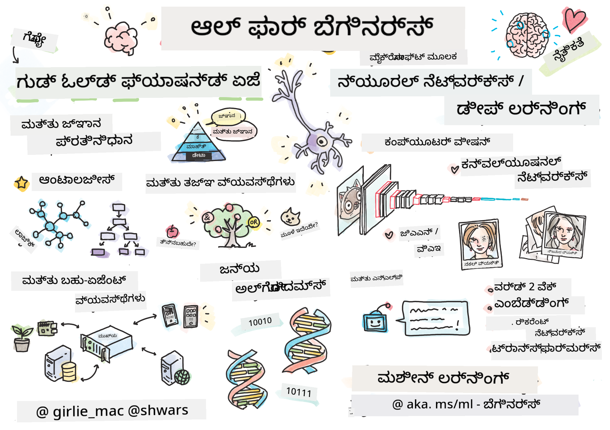

<!--
CO_OP_TRANSLATOR_METADATA:
{
  "original_hash": "14816e97d79b296c87811724f7785923",
  "translation_date": "2026-01-01T14:16:40+00:00",
  "source_file": "README.md",
  "language_code": "kn"
}
-->

# ಕೃತಕ ಬುದ್ಧಿಮತ್ತೆ ಆರಂಭಿಕರಿಗೆ - ಒಂದು ಪಠ್ಯಕ್ರಮ

||
|:---:|
| ಕೃತಕ ಬುದ್ಧಿಮತ್ತೆ ಆರಂಭಿಕರಿಗೆ - _ಸ್ಕೆಟ್ಚ್‌ನೋಟ್: [@girlie_mac](https://twitter.com/girlie_mac)_ |

ನಮ್ಮ 12-ವಾರಗಳ, 24-ಬೋಧನಾ ಒಂದು ಪಠ್ಯಕ್ರಮದ ಮೂಲಕ **ಕೃತಕ ಬುದ್ಧಿಮತ್ತೆ** (AI) ಲೋಕವನ್ನು ಅನ್ವೇಷಿಸಿ! ಇದರಲ್ಲಿ ಪ್ರಾಯೋಗಿಕ ಪಾಠಗಳು, ಪ್ರತಿಯಲ್ಲಿ ಪರೀಕ್ಷೆಗಳು ಮತ್ತು ಪ್ರಯೋಗಾಲಯಗಳು ಸೇರಿವೆ. ಪಠ್ಯಕ್ರಮವು ಆರಂಭಿಕರಿಗೆ ಸೂಕ್ತವಾಗಿದ್ದು TensorFlow ಮತ್ತು PyTorchಂತಹ ಉಪಕರಣಗಳನ್ನು ಹಾಗೂ AI ನ ನೈತಿಕತೆಯನ್ನು ಒಳಗೊಂಡಿದೆ

### 🌐 ಬಹುಭಾಷಾ ಬೆಂಬಲ

#### GitHub Action ಮೂಲಕ ಬೆಂಬಲಿಸಲಾಗಿದೆ (ಸ್ವಯಂಚಾಲಿತ ಮತ್ತು ಯಾವಾಗಲೂ ನವೀಕರಿಸಲ್ಪಟ್ಟಿದೆ)

<!-- CO-OP TRANSLATOR LANGUAGES TABLE START -->
[Arabic](../ar/README.md) | [Bengali](../bn/README.md) | [Bulgarian](../bg/README.md) | [Burmese (Myanmar)](../my/README.md) | [Chinese (Simplified)](../zh/README.md) | [Chinese (Traditional, Hong Kong)](../hk/README.md) | [Chinese (Traditional, Macau)](../mo/README.md) | [Chinese (Traditional, Taiwan)](../tw/README.md) | [Croatian](../hr/README.md) | [Czech](../cs/README.md) | [Danish](../da/README.md) | [Dutch](../nl/README.md) | [Estonian](../et/README.md) | [Finnish](../fi/README.md) | [French](../fr/README.md) | [German](../de/README.md) | [Greek](../el/README.md) | [Hebrew](../he/README.md) | [Hindi](../hi/README.md) | [Hungarian](../hu/README.md) | [Indonesian](../id/README.md) | [Italian](../it/README.md) | [Japanese](../ja/README.md) | [Kannada](./README.md) | [Korean](../ko/README.md) | [Lithuanian](../lt/README.md) | [Malay](../ms/README.md) | [Malayalam](../ml/README.md) | [Marathi](../mr/README.md) | [Nepali](../ne/README.md) | [Nigerian Pidgin](../pcm/README.md) | [Norwegian](../no/README.md) | [Persian (Farsi)](../fa/README.md) | [Polish](../pl/README.md) | [Portuguese (Brazil)](../br/README.md) | [Portuguese (Portugal)](../pt/README.md) | [Punjabi (Gurmukhi)](../pa/README.md) | [Romanian](../ro/README.md) | [Russian](../ru/README.md) | [Serbian (Cyrillic)](../sr/README.md) | [Slovak](../sk/README.md) | [Slovenian](../sl/README.md) | [Spanish](../es/README.md) | [Swahili](../sw/README.md) | [Swedish](../sv/README.md) | [Tagalog (Filipino)](../tl/README.md) | [Tamil](../ta/README.md) | [Telugu](../te/README.md) | [Thai](../th/README.md) | [Turkish](../tr/README.md) | [Ukrainian](../uk/README.md) | [Urdu](../ur/README.md) | [Vietnamese](../vi/README.md)
<!-- CO-OP TRANSLATOR LANGUAGES TABLE END -->

**If you wish to have additional translations languages supported are listed [here](https://github.com/Azure/co-op-translator/blob/main/getting_started/supported-languages.md)**

## ಸಮುದಾಯಕ್ಕೆ ಸೇರಿ

## ನೀವು ಏನು ಕಲಿಯುತ್ತೀರಿ

**[ಪಾಠ್ಯಕ್ರಮದ ಮನೋನಕ್ಷೆ](http://soshnikov.com/courses/ai-for-beginners/mindmap.html)**

ಈ ಪಠ್ಯಕ್ರಮದಲ್ಲಿ, ನೀವು ಕೆಳಗಿನವನ್ನೆಲ್ಲಾ ಕಲಿಯುತ್ತೀರಿ:

* ಕೃತಕ ಬುದ್ಧಿಮತ್ತೆಗೆ ವಿಭಿನ್ನ സമീപನೆಗಳು, "ಹಳೆಯ" ಚಿಹ್ನಾತ್ಮಕ ವಿಧಾನವನ್ನು ಒಳಗೊಂಡು, **ಜ್ಞಾನ ಪ್ರತಿನಿಧಾನ** ಮತ್ತು ತರ್ಕದೊಂದಿಗೆ ([GOFAI](https://en.wikipedia.org/wiki/Symbolic_artificial_intelligence)).
* **ನ್ಯೂರಲ್ ನೆಟ್‌ವರ್ಕ್‌ಗಳು** ಮತ್ತು **ಡೀಪ್ ಲರ್ನಿಂಗ್**, ಇವು ಆಧುನಿಕ AI ಯ ಕೋರ್. ಈ ಮಹತ್ವದ ವಿಷಯಗಳ ಹಿನ್ನೆಲೆ ತತ್ವಗಳನ್ನು ನಾವು [TensorFlow](http://Tensorflow.org) ಮತ್ತು [PyTorch](http://pytorch.org) ಎಂಬ ಅತ್ಯಂತ ಜನಪ್ರಿಯ ಫ್ರೇಮ್ವರ್ಕ್‌ಗಳಲ್ಲಿ ಕೋಡ್ ಮೂಲಕ ವಿವರಿಸುವೆವು.
* ಚಿತ್ರಗಳು ಮತ್ತು ಪಠ್ಯಗಳೊಂದಿಗೆ ಕೆಲಸ ಮಾಡಲು ಸೂಕ್ತ **ನ್ಯೂರಲ್ ಆರ್ಕಿಟೆಕ್ಚರ್ಗಳು**. ನಾವು ಇತ್ತೀಚಿನ ಮಾದರಿಗಳನ್ನು ಒಳಗೊಂಡು ವಿವರಿಸುವೆವು ಆದರೆ ಸ್ಥಿತಿಗತಿಯಲ್ಲಿ ಸಂಪೂರ್ಣ ಅತ್ಯಾಧುನಿಕವಾಗಿರುವುದರಲ್ಲಿ ಕೆಲವೊಂದು ಅಲಭ್ಯತೆ ಇರಬಹುದು.
* ಕಡಿಮೆ ಜನಪ್ರಿಯ AI ವಿಧಾನಗಳು, ಉದಾಹರಣೆಗೆ **ಜೆನೆಟಿಕ್ ಅಲ್ಗಾರಿಥಮ್‌ಗಳು** ಮತ್ತು **ಮಲ್ಟಿ-ಏಜೆಂಟ್ ಸಿಸ್ಟಮ್‌ಗಳು**.

ಈ ಪಠ್ಯಕ್ರಮದಲ್ಲಿ ನಾವು ಏನು ಒಳಗೊಳ್ಳುವುದಿಲ್ಲ:

> [Find all additional resources for this course in our Microsoft Learn collection](https://learn.microsoft.com/en-us/collections/7w28iy2xrqzdj0?WT.mc_id=academic-77998-bethanycheum)

* ವ್ಯಾಪಾರಿಕ ಸಂದರ್ಭಗಳಲ್ಲಿ **ವ್ಯಾಪಾರದೊಳಗಿನ AI** ಬಳಕೆದಾರ ಪ್ರಕರಣಗಳು. ನೀವು Microsoft Learn ನಲ್ಲಿರುವ [Introduction to AI for business users](https://docs.microsoft.com/learn/paths/introduction-ai-for-business-users/?WT.mc_id=academic-77998-bethanycheum) learning path ಅನ್ನುಗಳನ್ನು ಗಮನಿಸಬಹುದು, ಅಥವಾ [AI Business School](https://www.microsoft.com/ai/ai-business-school/?WT.mc_id=academic-77998-bethanycheum) ಅನ್ನು, ಇದು [INSEAD](https://www.insead.edu/) ನೊಂದಿಗೆ ಸಹಕರಿಸಿ ಅಭಿವೃದ್ಧಿಪಡಿಸಲಾಗಿದೆ.
* **ಶಾಸ್ತ್ರೀಯ ಮೆಷಿನ್ ಲರ್ನಿಂಗ್**, ಅದು ನಮ್ಮ [Machine Learning for Beginners Curriculum](http://github.com/Microsoft/ML-for-Beginners) ನಲ್ಲಿ ಚೆನ್ನಾಗಿ ವಿವರಿಸಲಾಗಿದೆ.
* **[Cognitive Services](https://azure.microsoft.com/services/cognitive-services/?WT.mc_id=academic-77998-bethanycheum)** ಬಳಸಿ ನಿರ್ಮಿಸಿದ ಪ್ರಾಯೋಗಿಕ AI ಅನ್ವಯಿಕೆಗಳು. ಇದರಿಗಾಗಿ, ನಾವು Microsoft Learn ನ [vision](https://docs.microsoft.com/learn/paths/create-computer-vision-solutions-azure-cognitive-services/?WT.mc_id=academic-77998-bethanycheum), [natural language processing](https://docs.microsoft.com/learn/paths/explore-natural-language-processing/?WT.mc_id=academic-77998-bethanycheum), **[Generative AI with Azure OpenAI Service](https://learn.microsoft.com/en-us/training/paths/develop-ai-solutions-azure-openai/?WT.mc_id=academic-77998-bethanycheum)** ಮತ್ತು ಇತರಗಳು ಸೇರಿದಂತೆ Modules ಕಳವಳನ್ನು ಆರಂಭಿಸಲು ಶಿಫಾರಸು ಮಾಡುತ್ತೇವೆ.
* ನಿರ್ದಿಷ್ಟ ML **ಮೇಘ ಫ್ರೇಮ್ವರ್ಕ್‌ಗಳು**, ಉದಾಹರಣೆಗೆ [Azure Machine Learning](https://azure.microsoft.com/services/machine-learning/?WT.mc_id=academic-77998-bethanycheum), [Microsoft Fabric](https://learn.microsoft.com/en-us/training/paths/get-started-fabric/?WT.mc_id=academic-77998-bethanycheum), ಅಥವಾ [Azure Databricks](https://docs.microsoft.com/learn/paths/data-engineer-azure-databricks?WT.mc_id=academic-77998-bethanycheum). [Build and operate machine learning solutions with Azure Machine Learning](https://docs.microsoft.com/learn/paths/build-ai-solutions-with-azure-ml-service/?WT.mc_id=academic-77998-bethanycheum) ಮತ್ತು [Build and Operate Machine Learning Solutions with Azure Databricks](https://docs.microsoft.com/learn/paths/build-operate-machine-learning-solutions-azure-databricks/?WT.mc_id=academic-77998-bethanycheum) learning pathಗಳನ್ನು ಪರಿಗಣಿಸಿ.
* **ಸಂವಹನಾತ್ಮಕ AI** ಮತ್ತು **ಚಾಟ್ ಬಾಟ್‌ಗಳು**. ಇದಕ್ಕೆ ಪ್ರತ್ಯೇಕ [Create conversational AI solutions](https://docs.microsoft.com/learn/paths/create-conversational-ai-solutions/?WT.mc_id=academic-77998-bethanycheum) learning path ಇದೆ, ಮತ್ತು ಹೆಚ್ಚಿನ ವಿವರಗಳಿಗೆ ನೀವು [ಈ ಬ್ಲಾಗ್ ಪೋಸ್ಟ್](https://soshnikov.com/azure/hello-bot-conversational-ai-on-microsoft-platform/) ಅನ್ನು ನೋಡಬಹುದು.
* ಡೀಪ್ ಲರ್ನಿಂಗಿನ ಹಿಂಬದಿಯ **ಗಾಢ ಗಣಿತ**. ಇದಕ್ಕೆ, ನಾವು Ian Goodfellow, Yoshua Bengio ಮತ್ತು Aaron Courville ರವರ [Deep Learning](https://www.amazon.com/Deep-Learning-Adaptive-Computation-Machine/dp/0262035618) ಅನ್ನು ಶಿಫಾರಸು ಮಾಡುತ್ತೇವೆ, ಇದು [https://www.deeplearningbook.org/](https://www.deeplearningbook.org/) ನಲ್ಲಿ ಕೂಡ ಲಭ್ಯವಿದೆ.

_ಬ್ಲಾಕ್ನಲ್ಲಿ AI_ ವಿಷಯಗಳ ಗೆಂಟಲ್ ಪರಿಚಯಕ್ಕಾಗಿ ನೀವು [Get started with artificial intelligence on Azure](https://docs.microsoft.com/learn/paths/get-started-with-artificial-intelligence-on-azure/?WT.mc_id=academic-77998-bethanycheum) Learning Path ತೆಗೆದುಕೊಳ್ಳಬಹುದು.

# Content

|     |                                                                 Lesson Link                                                                  |                                           PyTorch/Keras/TensorFlow                                          | Lab                                                            |
| :-: | :------------------------------------------------------------------------------------------------------------------------------------------: | :---------------------------------------------------------------------------------------------: | ------------------------------------------------------------------------------ |
| 0  |                                 [Course Setup](./lessons/0-course-setup/setup.md)                                 |                      [Setup Your Development Environment](./lessons/0-course-setup/how-to-run.md)                       |   |
| I  |               [**Introduction to AI**](./lessons/1-Intro/README.md)      | | |
| 01  |       [Introduction and History of AI](./lessons/1-Intro/README.md)       |           -                            | -  |
| II |              **Symbolic AI**              |
| 02  |       [Knowledge Representation and Expert Systems](./lessons/2-Symbolic/README.md)       |            [Expert Systems](./lessons/2-Symbolic/Animals.ipynb) /  [Ontology](./lessons/2-Symbolic/FamilyOntology.ipynb) /[Concept Graph](./lessons/2-Symbolic/MSConceptGraph.ipynb)                             |  |
| III |                        [**Introduction to Neural Networks**](./lessons/3-NeuralNetworks/README.md) |||
| 03  |                [ಪರ್ಸೆಪ್ಟ್ರಾನ್](./lessons/3-NeuralNetworks/03-Perceptron/README.md)                 |                       [ನೋಟ್‌ಬುಕ್](./lessons/3-NeuralNetworks/03-Perceptron/Perceptron.ipynb)                      | [ಲ್ಯಾಬ್](./lessons/3-NeuralNetworks/03-Perceptron/lab/README.md) |
| 04  |                   [ಬಹು-ಮಟ್ಟದ ಪರ್ಸೆಪ್ಟ್ರಾನ್ ಮತ್ತು ನಮ್ಮದೇ ಫ್ರೇಮ್ವರ್ಕ್ ರಚನೆ](./lessons/3-NeuralNetworks/04-OwnFramework/README.md)                   |        [ನೋಟ್‌ಬುಕ್](./lessons/3-NeuralNetworks/04-OwnFramework/OwnFramework.ipynb)        | [ಲ್ಯಾಬ್](./lessons/3-NeuralNetworks/04-OwnFramework/lab/README.md) |
| 05  |            [ಫ್ರೇಮ್ವರ್ಕ್ಗಳ ಪರಿಚಯ (PyTorch/TensorFlow) ಮತ್ತು ಓವರ್‌ಫಿಟಿಂಗ್](./lessons/3-NeuralNetworks/05-Frameworks/README.md)             |           [PyTorch](./lessons/3-NeuralNetworks/05-Frameworks/IntroPyTorch.ipynb) / [Keras](./lessons/3-NeuralNetworks/05-Frameworks/IntroKeras.ipynb) / [TensorFlow](./lessons/3-NeuralNetworks/05-Frameworks/IntroKerasTF.ipynb)             | [ಲ್ಯಾಬ್](./lessons/3-NeuralNetworks/05-Frameworks/lab/README.md) |
| IV  |            [**ಕಂಪ್ಯೂಟರ್ ದೃಶ್ಯ**](./lessons/4-ComputerVision/README.md)             | [PyTorch](https://docs.microsoft.com/learn/modules/intro-computer-vision-pytorch/?WT.mc_id=academic-77998-cacaste) / [TensorFlow](https://docs.microsoft.com/learn/modules/intro-computer-vision-TensorFlow/?WT.mc_id=academic-77998-cacaste)| [Microsoft Azure ನಲ್ಲಿ ಕಂಪ್ಯೂಟರ್ ದೃಶ್ಯ ಅನ್ವೇಷಿಸಿ](https://learn.microsoft.com/en-us/collections/7w28iy2xrqzdj0?WT.mc_id=academic-77998-bethanycheum) |
| 06  |            [ಕಂಪ್ಯೂಟರ್ ದೃಶ್ಯಕ್ಕೆ ಪರಿಚಯ. OpenCV](./lessons/4-ComputerVision/06-IntroCV/README.md)             |           [ನೋಟ್‌ಬುಕ್](./lessons/4-ComputerVision/06-IntroCV/OpenCV.ipynb)         | [ಲ್ಯಾಬ್](./lessons/4-ComputerVision/06-IntroCV/lab/README.md) |
| 07  |            [ಕನ್ವಲ್ಯೂಷನಲ್ ನ್ಯೂರಲ್ ನೆಟ್‌ವರ್ಕ್ಸ್](./lessons/4-ComputerVision/07-ConvNets/README.md) &  [CNN ವಾಸ್ತುಶಿಲ್ಪ](./lessons/4-ComputerVision/07-ConvNets/CNN_Architectures.md)             |           [PyTorch](./lessons/4-ComputerVision/07-ConvNets/ConvNetsPyTorch.ipynb) /[TensorFlow](./lessons/4-ComputerVision/07-ConvNets/ConvNetsTF.ipynb)             | [ಲ್ಯಾಬ್](./lessons/4-ComputerVision/07-ConvNets/lab/README.md) |
| 08  |            [ಪೂರ್ವ-ತರಬೇತಿ ಮಾಡಿದ ನೆಟ್‌ವರ್ಕ್ಗಳು ಮತ್ತು ಟ್ರಾನ್ಸ್‌ಫರ್ ಲರ್ನಿಂಗ್](./lessons/4-ComputerVision/08-TransferLearning/README.md) and [ತರಬೇತಿ ತಂತ್ರಗಳು](./lessons/4-ComputerVision/08-TransferLearning/TrainingTricks.md)             |           [PyTorch](./lessons/4-ComputerVision/08-TransferLearning/TransferLearningPyTorch.ipynb) / [TensorFlow](./lessons/3-NeuralNetworks/05-Frameworks/IntroKerasTF.ipynb)             | [ಲ್ಯಾಬ್](./lessons/4-ComputerVision/08-TransferLearning/lab/README.md) |
| 09  |            [ಆಟೋಎಂಕೋಡರ್‌ಗಳು ಮತ್ತು VAEಗಳು](./lessons/4-ComputerVision/09-Autoencoders/README.md)             |           [PyTorch](./lessons/4-ComputerVision/09-Autoencoders/AutoEncodersPyTorch.ipynb) / [TensorFlow](./lessons/4-ComputerVision/09-Autoencoders/AutoencodersTF.ipynb)             |  |
| 10  |            [ಜನರೇಟಿವ್ ಏಡ್ವರ್ಸೆರಿಯಲ್ ನೆಟ್‌ವರ್ಕ್‌ಗಳು ಮತ್ತು ಕಲಾತ್ಮಕ ಶೈಲಿ ವರ್ಗಾವಣೆ](./lessons/4-ComputerVision/10-GANs/README.md)             |           [PyTorch](./lessons/4-ComputerVision/10-GANs/GANPyTorch.ipynb) / [TensorFlow](./lessons/4-ComputerVision/10-GANs/GANTF.ipynb)             |  |
| 11  |            [ವಸ್ತು ಗುರುತಿಸುವಿಕೆ](./lessons/4-ComputerVision/11-ObjectDetection/README.md)             |         [TensorFlow](./lessons/4-ComputerVision/11-ObjectDetection/ObjectDetection.ipynb)             | [ಲ್ಯಾಬ್](./lessons/4-ComputerVision/11-ObjectDetection/lab/README.md) |
| 12  |            [ಸೆಮ್ಯಾಂಟಿಕ್ ಸೆಗ್ಮೆಂಟೇಶನ್. U-Net](./lessons/4-ComputerVision/12-Segmentation/README.md)             |           [PyTorch](./lessons/4-ComputerVision/12-Segmentation/SemanticSegmentationPytorch.ipynb) / [TensorFlow](./lessons/4-ComputerVision/12-Segmentation/SemanticSegmentationTF.ipynb)             |  |
| V  |            [**ಸ್ವಾಭಾವಿಕ ಭಾಷಾ ಸಂಸ್ಕರಣೆ**](./lessons/5-NLP/README.md)             | [PyTorch](https://docs.microsoft.com/learn/modules/intro-natural-language-processing-pytorch/?WT.mc_id=academic-77998-cacaste) /[TensorFlow](https://docs.microsoft.com/learn/modules/intro-natural-language-processing-TensorFlow/?WT.mc_id=academic-77998-cacaste) | [Microsoft Azure ನಲ್ಲಿ ಸ್ವಾಭಾವಿಕ ಭಾಷಾ ಸಂಸ್ಕರಣೆಯನ್ನು ಅನ್ವೇಷಿಸಿ](https://learn.microsoft.com/en-us/collections/7w28iy2xrqzdj0?WT.mc_id=academic-77998-bethanycheum)|
| 13  |            [ಪಠ್ಯ ಪ್ರತಿನಿಧಾನ. Bow/TF-IDF](./lessons/5-NLP/13-TextRep/README.md)             |           [PyTorch](https://github.com/microsoft/AI-For-Beginners/blob/main/lessons/5-NLP/13-TextRep/TextRepresentationPyTorch.ipynb) / [TensorFlow](https://github.com/microsoft/AI-For-Beginners/blob/main/lessons/5-NLP/13-TextRep/TextRepresentationTF.ipynb)             | |
| 14  |            [ಸಾಮ್ಯಾಂತಿಕ ಪದ ಏಂಬೆಡ್ಡಿಂಗ್‌ಗಳು. Word2Vec ಮತ್ತು GloVe](./lessons/5-NLP/14-Embeddings/README.md)             |           [PyTorch](https://github.com/microsoft/AI-For-Beginners/blob/main/lessons/5-NLP/14-Embeddings/EmbeddingsPyTorch.ipynb) / [TensorFlow](https://github.com/microsoft/AI-For-Beginners/blob/main/lessons/5-NLP/14-Embeddings/EmbeddingsTF.ipynb)             |  |
| 15  |            [ಭಾಷಾ ಮಾದರೀಕರಣ. ನಿಮ್ಮದೇ ಎಂಬೆಡ್ಡಿಂಗ್‌ಗಳನ್ನು ತರಬೇತಿ ಮಾಡುವುದು](./lessons/5-NLP/15-LanguageModeling/README.md)             |           [PyTorch](https://github.com/microsoft/AI-For-Beginners/blob/main/lessons/5-NLP/15-LanguageModeling/CBoW-PyTorch.ipynb) / [TensorFlow](https://github.com/microsoft/AI-For-Beginners/blob/main/lessons/5-NLP/15-LanguageModeling/CBoW-TF.ipynb)             | [ಲ್ಯಾಬ್](./lessons/5-NLP/15-LanguageModeling/lab/README.md) |
| 16  |            [ರಿಕರೆಂಟ್ ನ್ಯೂರಲ್ ನೆಟ್‌ವರ್ಕ್ಸ್](./lessons/5-NLP/16-RNN/README.md)             |           [PyTorch](https://github.com/microsoft/AI-For-Beginners/blob/main/lessons/5-NLP/16-RNN/RNNPyTorch.ipynb) / [TensorFlow](https://github.com/microsoft/AI-For-Beginners/blob/main/lessons/5-NLP/16-RNN/RNNTF.ipynb)             |  |
| 17  |            [ಜನರೇಟಿವ್ ರಿಕರೆಂಟ್ ನೆಟ್‌ವರ್ಕ್ಸ್](./lessons/5-NLP/17-GenerativeNetworks/README.md)             |           [PyTorch](https://github.com/microsoft/AI-For-Beginners/blob/main/lessons/5-NLP/17-GenerativeNetworks/GenerativePyTorch.ipynb) / [TensorFlow](https://github.com/microsoft/AI-For-Beginners/blob/main/lessons/5-NLP/17-GenerativeNetworks/GenerativeTF.ipynb)             | [ಲ್ಯಾಬ್](./lessons/5-NLP/17-GenerativeNetworks/lab/README.md) |
| 18  |            [ಟ್ರಾನ್ಸ್‌ಫಾರ್ಮರ್ಸ್. BERT.](./lessons/5-NLP/18-Transformers/README.md)             |           [PyTorch](https://github.com/microsoft/AI-For-Beginners/blob/main/lessons/5-NLP/18-Transformers/TransformersPyTorch.ipynb) /[TensorFlow](https://github.com/microsoft/AI-For-Beginners/blob/main/lessons/5-NLP/18-Transformers/TransformersTF.ipynb)             |  |
| 19  |            [ನಾಮಿತ ಎಂಟಿಟಿ ಗುರುತிப்பு](./lessons/5-NLP/19-NER/README.md)             |           [TensorFlow](https://microsoft.github.io/AI-For-Beginners/lessons/5-NLP/19-NER/NER-TF.ipynb)             | [ಲ್ಯಾಬ್](./lessons/5-NLP/19-NER/lab/README.md) |
| 20  |            [ವಿಶಾಲ ಭಾಷಾ ಮಾದರಿಗಳು, ಪ್ರಾಂಪ್ಟ್ ಪ್ರೋಗ್ರಾಮಿಂಗ್ ಮತ್ತು ಕಡಿಮೆ-ಶಾಟ್ ಕಾರ್ಯಗಳು](./lessons/5-NLP/20-LangModels/README.md)             |           [PyTorch](https://microsoft.github.io/AI-For-Beginners/lessons/5-NLP/20-LangModels/GPT-PyTorch.ipynb) | |
| VI |            **ಇತರೆ AI ತಂತ್ರಗಳು** || |
| 21  |            [ಆನುವಂಶಿಕ ಆಲ್ಗೋರಿದಮ್‌ಗಳು](./lessons/6-Other/21-GeneticAlgorithms/README.md)             |           [ನೋಟ್‌ಬುಕ್](./lessons/6-Other/21-GeneticAlgorithms/Genetic.ipynb) | |
| 22  |            [ಡೀಪ್ ರೀಇನ್ಫೋರ್ಸ್ಮೆಂಟ್ ಲರ್ನಿಂಗ್](./lessons/6-Other/22-DeepRL/README.md)             |           [PyTorch](./lessons/6-Other/22-DeepRL/CartPole-RL-PyTorch.ipynb) /[TensorFlow](./lessons/6-Other/22-DeepRL/CartPole-RL-TF.ipynb)             | [ಲ್ಯಾಬ್](./lessons/6-Other/22-DeepRL/lab/README.md) |
| 23  |            [ಬಹು-ಏಜೆಂಟ್ ವ್ಯವಸ್ಥೆಗಳು](./lessons/6-Other/23-MultiagentSystems/README.md)             |  | |
| VII |            **AI ನ ನೈತಿಕತೆ** | | |
| 24  |            [AI ನ ನೈತಿಕತೆ ಮತ್ತು ಜವಾಬ್ದಾರಿಯುತ AI](./lessons/7-Ethics/README.md)             |           [Microsoft Learn: ಜವಾಬ್ದಾರಿಯುತ AI ತತ್ವಗಳು](https://docs.microsoft.com/learn/paths/responsible-ai-business-principles/?WT.mc_id=academic-77998-cacaste) | |
| IX  |            **ಹೆಚ್ಚುವರಿ** | | |
| 25  |            [ಮಲ್ಟಿ-ಮೋಡಲ್ ನೆಟ್‌ವರ್ಕ್ಗಳು, CLIP ಮತ್ತು VQGAN](./lessons/X-Extras/X1-MultiModal/README.md)             |           [ನೋಟ್‌ಬುಕ್](./lessons/X-Extras/X1-MultiModal/Clip.ipynb)    | |

## ಪ್ರತಿ ಪಾಠದಲ್ಲಿ ಒಳಗೊಂಡಿರುವವು

* ಪೂರ್ವ ಓದಿನ ಸಾಮಗ್ರಿ
* ಕಾರ್ಯನಿರ್ವಹಿಸಬಹುದಾದ ಜುಪಿಟರ್ ನೋಟ್‌ಬುಕ್ಸ್, ಸಾಮಾನ್ಯವಾಗಿ ಫ್ರೇಮ್ವర్క್ (**PyTorch** ಅಥವಾ **TensorFlow**) ನಿರ್ದಿಷ್ಟವಾಗಿರುವವು. ಕಾರ್ಯನಿರ್ವಹಿಸಬಹುದಾದ ನೋಟ್‌ಬುಕ್‌ನಲ್ಲಿ ಕೂಡ ಬಹಳಷ್ಟು ಸಿದ್ಧಾಂತಾತ್ಮಕ ವಿಷಯವಿದೆ, ಆದ್ದರಿಂದ ವಿಷಯವನ್ನು ಅರ್ಥಮಾಡಿಕೊಳ್ಳಲು ನೀವು ಕನಿಷ್ಠ ಒಂದು ಆವೃತ್ತಿಯ ನೋಟ್‌ಬುಕ್ (ಯಾವುದೇ ಒಂದು: PyTorch ಅಥವಾ TensorFlow) ನೋಡಿ ಹೋಗಬೇಕು.
* **ಲ್ಯಾಬ್‌ಗಳು** ಕೆಲವು ವಿಷಯಗಳಿಗೆ ಲಭ್ಯವಿದ್ದು, ಅವು ನಿಮಗೆ ನೀವು ಕಲಿತ ವಿಷಯವನ್ನು ನಿರ್ದಿಷ್ಟ ಸಮಸ್ಯೆಗೆ ಅನ್ವಯಿಸುವ ಪ್ರಯತ್ನ ಮಾಡಲು ಅವಕಾಶವನ್ನು ನೀಡುತ್ತವೆ.
* ಕೆಲ ವಿಭಾಗಗಳಲ್ಲಿ ಸಂಬಂಧಿತ ವಿಷಯಗಳನ್ನು ಒಳಗೊಂಡಿರುವ [**MS Learn**](https://learn.microsoft.com/en-us/collections/7w28iy2xrqzdj0?WT.mc_id=academic-77998-bethanycheum) ಮೋಡ್ಯೂಲ್‌ಗಳಿಗೆ ಲಿಂಕ್‌ಗಳಿವೆ.

## ಪ್ರಾರಂಭಿಸಲು

### 🎯 AI ಗೆ ಹೊಸದಾಗಿದ್ದೀರಾ? ಇಲ್ಲಿ ಪ್ರಾರಂಭಿಸಿ!

ನೀವು ಸಂಪೂರ್ಣವಾಗಿ AI ಗೆ ಹೊಸವನಾಗಿದ್ದರೆ ಮತ್ತು ತ್ವರಿತ, ಪ್ರಾತ್ಯಕ್ಷಿಕ ಉದಾಹರಣೆಗಳನ್ನು ನೋಡಲು ಬಯಸಿದರೆ, ನಮ್ಮ [**ಆರಂಭಿಕ ಸ್ನೇಹಿ ಉದಾಹರಣೆಗಳು**](./examples/README.md) ನೋಡಿ! ಇವುಗಳಲ್ಲಿ ಇವೆ:

- 🌟 **ಹಲೋ AI ಜಗತ್ತು** - ನಿಮ್ಮ ಮೊದಲ AI ಪ್ರೋಗ್ರಾಮ್ (ನಮೂನಾ ಗುರುತಿಸುವಿಕೆ)
- 🧠 **ಸರಳ ನ್ಯೂರಲ್ ನೆಟ್‌ವರ್ಕ್** - ಸ್ಕ್ರ್ಯಾಚ್‌ನಿಂದ ನ್ಯೂರಲ್ ನೆಟ್‌ವರ್ಕ್ ನಿರ್ಮಿಸಿ  
- 🖼️ **ಚಿತ್ರ ವರ್ಗೀಕರಣ** - ವಿವರಣಾತ್ಮಕ ಟಿಪ್ಪಣಿಗಳೊಂದಿಗೆ ಚಿತ್ರಗಳನ್ನು ವರ್ಗೀಕರಿಸಿ
- 💬 **ಪಠ್ಯದ ಭಾವನಾತ್ಮಕತೆ** - ಧನಾತ್ಮಕ/ನಕಾರಾತ್ಮಕ ಪಠ್ಯವನ್ನು ವಿಶ್ಲೇಷಿಸಿ

These examples are designed to help you understand AI concepts before diving into the full curriculum.

### 📚 ಪೂರ್ಣ ಪಠ್ಯಕ್ರಮ ಸೆಟಪ್

- ನಾವು ನಿಮ್ಮ ಅಭಿವೃದ್ಧಿ ಪರಿಸರವನ್ನು ಹೊಂದಿಸಲು ಸಹಾಯ ಮಾಡುವಂತೆ ಒಂದು [ಸೆಟಪ್ ಪಾಠ](./lessons/0-course-setup/setup.md) ರಚಿಸಿದ್ದೇವೆ. - ಶಿಕ್ಷಕರಿಗಾಗಿ, ನಾವು ನಿಮಗಾಗಿ ಒಂದು [ಪಠ್ಯಕ್ರಮ ಸೆಟಪ್ ಪಾಠ](./lessons/0-course-setup/for-teachers.md) ಕೂಡ ರಚಿಸಿದ್ದೇವೆ!
- ಹೇಗೆ [VSCode ಅಥವಾ Codepace ನಲ್ಲಿ ಕೋಡ್ ಚಲಾಯಿಸುವುದು](./lessons/0-course-setup/how-to-run.md)

Follow these steps:

Fork the Repository: Click on the "Fork" button at the top-right corner of this page.

Clone the Repository: `git clone https://github.com/microsoft/AI-For-Beginners.git`

Don't forget to star (🌟) this repo to find it easier later.

## ಇತರ ಕಲಿಯುವವರನ್ನು ಭೇಟಿಮಾಡಿ

Join our [official AI Discord server](https://aka.ms/genai-discord?WT.mc_id=academic-105485-bethanycheum) to meet and network with other learners taking this course and get support.

If you have product feedback or questions whilst building visit our [Azure AI Foundry Developer Forum](https://aka.ms/foundry/forum)

## Quizzes 

> **ಕ್ವಿಜ್‌ಗಳ ಬಗ್ಗೆ ಒಂದು ಟಿಪ್ಪಣಿ**: All quizzes are contained in the Quiz-app folder in etc\quiz-app, or [Online Here](https://ff-quizzes.netlify.app/) They are linked from within the lessons the quiz app can be run locally or deployed to Azure; follow the instruction in the `quiz-app` folder. They are gradually being localized.

## ಸಹಾಯ ಬೇಕು

Do you have suggestions or found spelling or code errors? Raise an issue or create a pull request.

## ವಿಶೇಷ ಧನ್ಯವಾದಗಳು

* **✍️ ಪ್ರಾಥಮಿಕ ಲೇಖಕ:** [Dmitry Soshnikov](http://soshnikov.com), PhD
* **🔥 ಸಂಪಾದಕ:** [Jen Looper](https://twitter.com/jenlooper), PhD
* **🎨 ಸ್ಕೆಚ್ ನೋಟ್ ಚಿತ್ರಕಾರ:** [Tomomi Imura](https://twitter.com/girlie_mac)
* **✅ ಕ್ವಿಜ್ ಸೃಷ್ಟಿಕರ್ತರು:** [Lateefah Bello](https://github.com/CinnamonXI), [MLSA](https://studentambassadors.microsoft.com/)
* **🙏 ಮುಖ್ಯ ಕೊಡುಗೆದಾರರು:** [Evgenii Pishchik](https://github.com/Pe4enIks)

## ಇತರೆ ಪಠ್ಯಕ್ರಮಗಳು

Our team produces other curricula! Check out:

<!-- CO-OP TRANSLATOR OTHER COURSES START -->
### LangChain

---

### Azure / Edge / MCP / Agents

---
 
### Generative AI Series

[-9333EA?style=for-the-badge&labelColor=E5E7EB&color=9333EA)](https://github.com/microsoft/Generative-AI-for-beginners-dotnet?WT.mc_id=academic-105485-koreyst)
[-C084FC?style=for-the-badge&labelColor=E5E7EB&color=C084FC)](https://github.com/microsoft/generative-ai-for-beginners-java?WT.mc_id=academic-105485-koreyst)
[-E879F9?style=for-the-badge&labelColor=E5E7EB&color=E879F9)](https://github.com/microsoft/generative-ai-with-javascript?WT.mc_id=academic-105485-koreyst)

---
 
### Core Learning

---
 
### Copilot Series

<!-- CO-OP TRANSLATOR OTHER COURSES END -->

## ಸಹಾಯ ಪಡೆಯಿರಿ

If you get stuck or have any questions about building AI apps. Join fellow learners and experienced developers in discussions about MCP. It's a supportive community where questions are welcome and knowledge is shared freely.

If you have product feedback or errors while building visit:

---

<!-- CO-OP TRANSLATOR DISCLAIMER START -->
ಜವಾಬ್ದಾರಿ ನಿರಾಕರಣೆ:
ಈ ದಸ್ತಾವೇಜನ್ನು AI ಅನುವಾದ ಸೇವೆ [Co-op Translator](https://github.com/Azure/co-op-translator) ಬಳಸಿ ಅನುವಾದಿಸಲಾಗಿದೆ. ನಾವು ಶುದ್ಧತೆಯನ್ನು ಸಾಧಿಸಲು ಪ್ರಯತ್ನಿಸಿದರೂ, ದಯವಿಟ್ಟು ಗಮನಿಸಿರಿ — ಸ್ವಯಂಚಾಲಿತ ಅನುವಾದಗಳಲ್ಲಿ ತಪ್ಪುಗಳು ಅಥವಾ ಅಸತ್ಯತೆಗಳು ಇರಬಹುದಾಗಿದೆ. ಮೂಲ ದಸ್ತಾವೇಜನ್ನು ಅದರ ಮೂಲ ಭಾಷೆಯಲ್ಲಿಯೇ ಅಧಿಕೃತ ಮೂಲವೆಂದು ಪರಿಗಣಿಸಬೇಕು. ಗಂಭೀರ ಮಾಹಿತಿの場合 ವೃತ್ತಿಪರ ಮಾನವ ಅನುವಾದವನ್ನು ಬಳಸಬೇಕು ಎಂದು ಶಿಫಾರಸು ಮಾಡಲಾಗುತ್ತದೆ. ಈ ಅನುವಾದದ ಬಳಕೆಯಿಂದ ಉಂಟಾಗುವ ಯಾವುದೇ ತಪ್ಪು ಅರ್ಥಗರ್ಭಿತತೆಗಳು ಅಥವಾ ತಪ್ಪಾದ ವಿವರಣೆಗಳಿಗಾಗಿ ನಾವು ಜವಾಬ್ದಾರಿಯಾಗುವುದಿಲ್ಲ.
<!-- CO-OP TRANSLATOR DISCLAIMER END -->