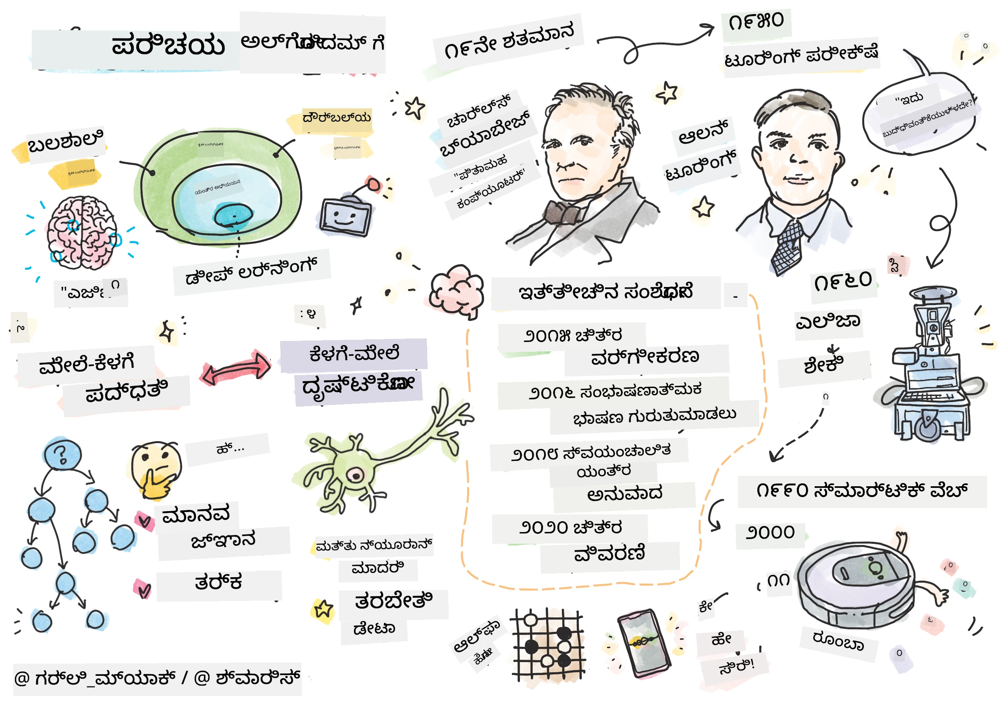
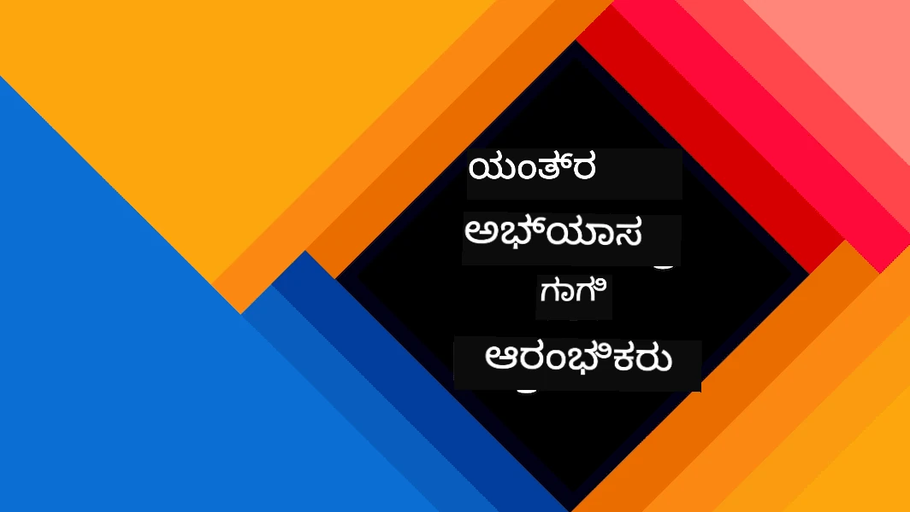
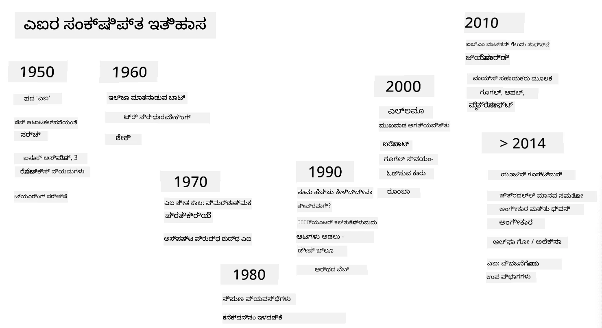

# AI ಪರಿಚಯ

> ಸ್ಕೆಚ್‌ನೋಟ್: [ಟೊಮೊಮಿ ಇಮುರು](https://twitter.com/girlie_mac)

## [ಪೂರ್ವ-ಲೇಕ್ಚರ್ ಕ್ವಿಜ್](https://ff-quizzes.netlify.app/en/ai/quiz/1)

**ಕೃತಕ ಬುದ್ಧಿಮತ್ತೆ** ಎಂಬುದು ಕಂಪ್ಯೂಟರ್‌ಗಳು ಬುದ್ಧಿವಂತಿಕೆಯ ವರ್ತನೆ ತೋರಿಸುವುದನ್ನು ಅಧ್ಯಯನ ಮಾಡುವ ರೋಚಕ ವೈಜ್ಞಾನಿಕ ಶಾಖೆ, ಉದಾಹರಣೆಗೆ, ಮಾನವರು ಚೆನ್ನಾಗಿ ಮಾಡುವ ಕಾರ್ಯಗಳನ್ನು ಕಂಪ್ಯೂಟರ್‌ಗಳು ಹೇಗೆ ಮಾಡಬಹುದು ಎಂಬುದನ್ನು ತಿಳಿಯಲು.

ಆರಂಭದಲ್ಲಿ, ಕಂಪ್ಯೂಟರ್‌ಗಳನ್ನು [ಚಾರ್ಲ್ಸ್ ಬ್ಯಾಬೇಜ್](https://en.wikipedia.org/wiki/Charles_Babbage) ಸಂಖ್ಯೆಗಳ ಮೇಲೆ ನಿರ್ದಿಷ್ಟ ಕ್ರಮವನ್ನು ಅನುಸರಿಸಿ ಕಾರ್ಯನಿರ್ವಹಿಸಲು ಕಂಡುಹಿಡಿದರು - ಅಲ್ಗೋರಿದಮ್. 19ನೇ ಶತಮಾನದಲ್ಲಿ ಪ್ರಸ್ತಾಪಿಸಲಾದ ಮೂಲ ಮಾದರಿಗಿಂತ ಬಹಳ ಮುಂದುವರೆದಿದ್ದರೂ, ಆಧುನಿಕ ಕಂಪ್ಯೂಟರ್‌ಗಳು ಇನ್ನೂ ನಿಯಂತ್ರಿತ ಗಣನೆಗಳ ಆಲೋಚನೆಯನ್ನು ಅನುಸರಿಸುತ್ತವೆ. ಆದ್ದರಿಂದ, ಗುರಿಯನ್ನು ಸಾಧಿಸಲು ಬೇಕಾದ ಕ್ರಮಗಳನ್ನು ನಾವು ತಿಳಿದಿದ್ದರೆ, ಕಂಪ್ಯೂಟರ್‌ಗೆ ಆ ಕಾರ್ಯವನ್ನು ಪ್ರೋಗ್ರಾಮ್ ಮಾಡಬಹುದು.

> ಫೋಟೋ: [ವಿಕ್ಕಿ ಸೋಶ್ನಿಕೋವಾ](http://twitter.com/vickievalerie)

> ✅ ವ್ಯಕ್ತಿಯ ಫೋಟೋದಿಂದ ಅವನ/ಅವಳ ವಯಸ್ಸನ್ನು ನಿರ್ಧರಿಸುವುದು ಸ್ಪಷ್ಟವಾಗಿ ಪ್ರೋಗ್ರಾಮ್ ಮಾಡಲಾಗದ ಕಾರ್ಯ, ಏಕೆಂದರೆ ನಾವು ಅದನ್ನು ಹೇಗೆ ಮನಸ್ಸಿನಲ್ಲಿ ಸಂಖ್ಯೆ ರೂಪದಲ್ಲಿ ತರುತ್ತೇವೆ ಎಂಬುದು ತಿಳಿದಿಲ್ಲ.

---

ಕೆಲವು ಕಾರ್ಯಗಳನ್ನು ನಾವು ಸ್ಪಷ್ಟವಾಗಿ ಹೇಗೆ ಪರಿಹರಿಸಬೇಕೆಂದು ತಿಳಿಯದು. ಉದಾಹರಣೆಗೆ, ವ್ಯಕ್ತಿಯ ಫೋಟೋದಿಂದ ವಯಸ್ಸನ್ನು ನಿರ್ಧರಿಸುವುದು. ನಾವು ಇದನ್ನು ಹೇಗೆ ಮಾಡುತ್ತೇವೆ ಎಂಬುದನ್ನು ಸ್ಪಷ್ಟವಾಗಿ ವಿವರಿಸಲು ಸಾಧ್ಯವಿಲ್ಲ, ಆದರೆ ನಾವು ವಿಭಿನ್ನ ವಯಸ್ಸಿನ ಜನರನ್ನು ನೋಡಿದ್ದರಿಂದ ಕಲಿತಿದ್ದೇವೆ. ಈ ರೀತಿಯ ಕಾರ್ಯಗಳು **ಕೃತಕ ಬುದ್ಧಿಮತ್ತೆ** (AI)ಗೆ ಸಂಬಂಧಿಸಿದವು.

✅ ನೀವು AI ಸಹಾಯದಿಂದ ಕಂಪ್ಯೂಟರ್‌ಗೆ ನೀಡಬಹುದಾದ ಕೆಲವು ಕಾರ್ಯಗಳನ್ನು ಯೋಚಿಸಿ. ಹಣಕಾಸು, ವೈದ್ಯಕೀಯ ಮತ್ತು ಕಲಾ ಕ್ಷೇತ್ರಗಳಲ್ಲಿ AI ಹೇಗೆ ಸಹಾಯ ಮಾಡುತ್ತಿದೆ ಎಂದು ಪರಿಗಣಿಸಿ.

## ದುರ್ಬಲ AI ಮತ್ತು ಶಕ್ತಿಶಾಲಿ AI

ದುರ್ಬಲ AI | ಶಕ್ತಿಶಾಲಿ AI
---------------------------------------|-------------------------------------
ದುರ್ಬಲ AI ಎಂದರೆ ನಿರ್ದಿಷ್ಟ ಕಾರ್ಯ ಅಥವಾ ಸೀಮಿತ ಕಾರ್ಯಗಳಿಗಾಗಿ ವಿನ್ಯಾಸಗೊಳಿಸಲ್ಪಟ್ಟ ಮತ್ತು ತರಬೇತಿಗೊಳಿಸಲ್ಪಟ್ಟ AI ವ್ಯವಸ್ಥೆಗಳು.|ಶಕ್ತಿಶಾಲಿ AI ಅಥವಾ ಕೃತಕ ಸಾಮಾನ್ಯ ಬುದ್ಧಿಮತ್ತೆ (AGI) ಎಂದರೆ ಮಾನವ ಮಟ್ಟದ ಬುದ್ಧಿಮತ್ತೆ ಮತ್ತು ಅರ್ಥಮಾಡಿಕೊಳ್ಳುವ ಸಾಮರ್ಥ್ಯ ಹೊಂದಿರುವ AI ವ್ಯವಸ್ಥೆಗಳು.
ಈ AI ವ್ಯವಸ್ಥೆಗಳು ಸಾಮಾನ್ಯ ಬುದ್ಧಿವಂತಿಕೆ ಹೊಂದಿಲ್ಲ; ಅವು ನಿರ್ದಿಷ್ಟ ಕಾರ್ಯದಲ್ಲಿ ಪರಿಣತಿ ಹೊಂದಿದ್ದರೂ ನಿಜವಾದ ಅರ್ಥಮಾಡಿಕೊಳ್ಳುವಿಕೆ ಅಥವಾ ಚೇತನತೆ ಇಲ್ಲ.|ಈ AI ವ್ಯವಸ್ಥೆಗಳು ಮಾನವರು ಮಾಡಬಹುದಾದ ಯಾವುದೇ ಬೌದ್ಧಿಕ ಕಾರ್ಯವನ್ನು ನಿರ್ವಹಿಸಲು, ವಿಭಿನ್ನ ಕ್ಷೇತ್ರಗಳಿಗೆ ಹೊಂದಿಕೊಳ್ಳಲು ಮತ್ತು ಸ್ವ-ಚೇತನತೆ ಹೊಂದಲು ಸಾಮರ್ಥ್ಯ ಹೊಂದಿವೆ.
ದುರ್ಬಲ AI ಉದಾಹರಣೆಗಳಿಗೆ ಸಿರಿ ಅಥವಾ ಅಲೆಕ್ಸಾ ಹೋಲುವ ವರ್ಚುವಲ್ ಸಹಾಯಕರು, ಸ್ಟ್ರೀಮಿಂಗ್ ಸೇವೆಗಳ ಶಿಫಾರಸು ಅಲ್ಗೋರಿದಮ್‌ಗಳು ಮತ್ತು ನಿರ್ದಿಷ್ಟ ಗ್ರಾಹಕ ಸೇವಾ ಕಾರ್ಯಗಳಿಗೆ ವಿನ್ಯಾಸಗೊಳಿಸಲಾದ ಚಾಟ್‌ಬಾಟ್‌ಗಳು ಸೇರಿವೆ.|ಶಕ್ತಿಶಾಲಿ AI ಸಾಧಿಸುವುದು AI ಸಂಶೋಧನೆಯ ದೀರ್ಘಕಾಲೀನ ಗುರಿ ಮತ್ತು ಇದು ವಿವೇಕ, ಕಲಿಕೆ, ಅರ್ಥಮಾಡಿಕೊಳ್ಳುವಿಕೆ ಮತ್ತು ವಿವಿಧ ಕಾರ್ಯಗಳಲ್ಲಿ ಹೊಂದಿಕೊಳ್ಳುವ ಸಾಮರ್ಥ್ಯ ಹೊಂದಿರುವ AI ವ್ಯವಸ್ಥೆಗಳ ಅಭಿವೃದ್ಧಿಯನ್ನು ಅಗತ್ಯವಿದೆ.
ದುರ್ಬಲ AI ಅತ್ಯಂತ ವಿಶೇಷೀಕೃತವಾಗಿದೆ ಮತ್ತು ಮಾನವ-ಹೋಲುವ ಬೌದ್ಧಿಕ ಸಾಮರ್ಥ್ಯಗಳು ಅಥವಾ ಸಾಮಾನ್ಯ ಸಮಸ್ಯೆ ಪರಿಹಾರ ಸಾಮರ್ಥ್ಯಗಳನ್ನು ಹೊಂದಿಲ್ಲ.|ಶಕ್ತಿಶಾಲಿ AI ಪ್ರಸ್ತುತ ಸಿದ್ಧಾಂತಾತ್ಮಕ ಕಲ್ಪನೆ ಮಾತ್ರ, ಯಾವುದೇ AI ವ್ಯವಸ್ಥೆ ಈ ಮಟ್ಟದ ಸಾಮಾನ್ಯ ಬುದ್ಧಿಮತ್ತೆಗೆ ತಲುಪಿಲ್ಲ.

ಹೆಚ್ಚಿನ ಮಾಹಿತಿಗಾಗಿ **[ಕೃತಕ ಸಾಮಾನ್ಯ ಬುದ್ಧಿಮತ್ತೆ](https://en.wikipedia.org/wiki/Artificial_general_intelligence)** (AGI) ನೋಡಿ.

## ಬುದ್ಧಿಮತ್ತೆಯ ವ್ಯಾಖ್ಯಾನ ಮತ್ತು ಟ್ಯೂರಿಂಗ್ ಪರೀಕ್ಷೆ

**[ಬುದ್ಧಿಮತ್ತೆ](https://en.wikipedia.org/wiki/Intelligence)** ಎಂಬ ಪದದ ಸ್ಪಷ್ಟ ವ್ಯಾಖ್ಯಾನ ಇಲ್ಲದಿರುವುದು ಒಂದು ಸಮಸ್ಯೆ. ಬುದ್ಧಿಮತ್ತೆ abstract thinking ಅಥವಾ self-awareness ಗೆ ಸಂಬಂಧಿಸಿದೆ ಎಂದು ಹೇಳಬಹುದು, ಆದರೆ ಸರಿಯಾಗಿ ವ್ಯಾಖ್ಯಾನಿಸಲು ಸಾಧ್ಯವಿಲ್ಲ.

> [ಫೋಟೋ](https://unsplash.com/photos/75715CVEJhI) - [ಅಂಬರ್ ಕಿಪ್](https://unsplash.com/@sadmax) ಅವರಿಂದ Unsplash

ಬುದ್ಧಿಮತ್ತೆಯ ಅಸ್ಪಷ್ಟತೆಯನ್ನು ನೋಡಲು, "ಬೆಕ್ಕು ಬುದ್ಧಿವಂತೆಯೇ?" ಎಂಬ ಪ್ರಶ್ನೆಗೆ ಉತ್ತರಿಸಿ. ವಿಭಿನ್ನ ಜನರು ವಿಭಿನ್ನ ಉತ್ತರಗಳನ್ನು ನೀಡುತ್ತಾರೆ, ಏಕೆಂದರೆ ಈ ಪ್ರಶ್ನೆಗೆ ಸರ್ವಮಾನ್ಯ ಪರೀಕ್ಷೆ ಇಲ್ಲ. ನೀವು ಇದನ್ನು ಪರೀಕ್ಷಿಸಲು ಬಯಸಿದರೆ, ನಿಮ್ಮ ಬೆಕ್ಕಿಗೆ IQ ಪರೀಕ್ಷೆ ನಡೆಸಿ ನೋಡಿ...

✅ ನೀವು ಬುದ್ಧಿಮತ್ತೆಯನ್ನು ಹೇಗೆ ವ್ಯಾಖ್ಯಾನಿಸುತ್ತೀರಿ ಎಂದು ಒಂದು ನಿಮಿಷ ಯೋಚಿಸಿ. ಒಂದು ಕಾಗೆ ಜಾಲವನ್ನು ಪರಿಹರಿಸಿ ಆಹಾರವನ್ನು ಪಡೆಯಬಲ್ಲದೆಯೇ ಬುದ್ಧಿವಂತೆಯೇ? ಒಂದು ಮಗು ಬುದ್ಧಿವಂತೆಯೇ?

---

AGI ಬಗ್ಗೆ ಮಾತನಾಡುವಾಗ, ನಾವು ನಿಜವಾದ ಬುದ್ಧಿವಂತ ವ್ಯವಸ್ಥೆಯನ್ನು ರಚಿಸಿದ್ದೇವೆ ಎಂದು ತಿಳಿಯಲು ವಿಧಾನ ಬೇಕಾಗುತ್ತದೆ. [ಆಲನ್ ಟ್ಯೂರಿಂಗ್](https://en.wikipedia.org/wiki/Alan_Turing) ಪ್ರಸ್ತಾಪಿಸಿದ **[ಟ್ಯೂರಿಂಗ್ ಪರೀಕ್ಷೆ](https://en.wikipedia.org/wiki/Turing_test)** ಬುದ್ಧಿಮತ್ತೆಯ ವ್ಯಾಖ್ಯಾನವನ್ನೂ ನೀಡುತ್ತದೆ. ಈ ಪರೀಕ್ಷೆ ಒಂದು ವ್ಯವಸ್ಥೆಯನ್ನು ನಿಜವಾದ ಮಾನವನೊಂದಿಗೆ ಹೋಲಿಸುತ್ತದೆ. ಯಾವುದೇ ಸ್ವಯಂಚಾಲಿತ ಹೋಲಿಕೆ ಕಂಪ್ಯೂಟರ್ ಪ್ರೋಗ್ರಾಮ್ ಮೂಲಕ ತಪ್ಪಿಸಬಹುದು, ಆದ್ದರಿಂದ ಮಾನವ ವಿಚಾರಕನನ್ನು ಬಳಸಲಾಗುತ್ತದೆ. ಮಾನವನು ಪಠ್ಯ ಆಧಾರಿತ ಸಂವಾದದಲ್ಲಿ ನಿಜವಾದ ವ್ಯಕ್ತಿ ಮತ್ತು ಕಂಪ್ಯೂಟರ್ ವ್ಯವಸ್ಥೆಯನ್ನು ವಿಭಿನ್ನಗೊಳಿಸಲು ಸಾಧ್ಯವಾಗದಿದ್ದರೆ, ಆ ವ್ಯವಸ್ಥೆಯನ್ನು ಬುದ್ಧಿವಂತ ಎಂದು ಪರಿಗಣಿಸಲಾಗುತ್ತದೆ.

> 2014 ರಲ್ಲಿ ಸೆಂಟ್ ಪೀಟರ್ಸ್‌ಬರ್ಗ್‌ನಲ್ಲಿ ಅಭಿವೃದ್ಧಿಪಡಿಸಲಾದ [ಯೂಜಿನ್ ಗೂಸ್ಟ್ಮನ್](https://en.wikipedia.org/wiki/Eugene_Goostman) ಎಂಬ ಚಾಟ್‌ಬಾಟ್ ಟ್ಯೂರಿಂಗ್ ಪರೀಕ್ಷೆಗೆ ಸಮೀಪವಾಯಿತು. ಇದು 13 ವರ್ಷದ ಉಕ್ರೇನಿಯನ್ ಹುಡುಗ ಎಂದು ಮುಂಚಿತವಾಗಿ ಘೋಷಿಸಿತು, ಇದರಿಂದ ತಿಳಿವಳಿಕೆ ಕೊರತೆ ಮತ್ತು ಕೆಲವು ವ್ಯತ್ಯಾಸಗಳನ್ನು ವಿವರಿಸಿತು. 5 ನಿಮಿಷ ಸಂವಾದದ ನಂತರ 30% ನ್ಯಾಯಾಧೀಶರನ್ನು ಇದು ಮಾನವನಾಗಿದ್ದಂತೆ ನಂಬಿಸಿತು, ಟ್ಯೂರಿಂಗ್ 2000 ರೊಳಗೆ ಯಂತ್ರವು ಈ ಮಟ್ಟ ತಲುಪಬಹುದು ಎಂದು ನಂಬಿದ್ದ. ಆದರೆ ಇದು ಬುದ್ಧಿವಂತ ವ್ಯವಸ್ಥೆ ರಚನೆಯ ಸೂಚನೆ ಅಲ್ಲ, ಅಥವಾ ಕಂಪ್ಯೂಟರ್ ಮಾನವನನ್ನು ಮೋಸಗೊಳಿಸಿದೆ ಎಂದು ಅರ್ಥವಲ್ಲ - ಬಾಟ್ ರಚನೆದವರು ಮಾನವರನ್ನು ಮೋಸಗೊಳಿಸಿದರು!

✅ ನೀವು ಎಂದಾದರೂ ಚಾಟ್‌ಬಾಟ್‌ನಿಂದ ಮಾನವನೊಂದಿಗೆ ಮಾತನಾಡುತ್ತಿರುವಂತೆ ಭಾವಿಸಿದ್ದೀರಾ? ಅದು ನಿಮಗೆ ಹೇಗೆ ನಂಬಿಕೆ ನೀಡಿತು?

## AIಗೆ ವಿಭಿನ್ನ ದೃಷ್ಠಿಕೋನಗಳು

ಕಂಪ್ಯೂಟರ್ ಮಾನವನಂತೆ ವರ್ತಿಸಲು, ನಾವು ನಮ್ಮ ಚಿಂತನೆಗಳನ್ನು ಕಂಪ್ಯೂಟರ್‌ನಲ್ಲಿ ಮಾದರಿಮಾಡಬೇಕು. ಆದ್ದರಿಂದ, ಮಾನವನ ಬುದ್ಧಿವಂತಿಕೆಯನ್ನು ಅರ್ಥಮಾಡಿಕೊಳ್ಳಬೇಕಾಗುತ್ತದೆ.

> ಯಂತ್ರದಲ್ಲಿ ಬುದ್ಧಿಮತ್ತೆಯನ್ನು ಪ್ರೋಗ್ರಾಮ್ ಮಾಡಲು, ನಮ್ಮ ನಿರ್ಧಾರ ಪ್ರಕ್ರಿಯೆಗಳು ಹೇಗೆ ಕೆಲಸ ಮಾಡುತ್ತವೆ ಎಂಬುದನ್ನು ಅರ್ಥಮಾಡಿಕೊಳ್ಳಬೇಕು. ಸ್ವ-ಪರಿಶೀಲನೆ ಮಾಡಿದರೆ, ಕೆಲವು ಪ್ರಕ್ರಿಯೆಗಳು ಅಚೇತನವಾಗಿವೆ - ಉದಾಹರಣೆಗೆ, ನಾವು ಬೆಕ್ಕನ್ನು ನಾಯಿ ಎಂದು ಭಾವಿಸದೆ ಬೇರ್ಪಡಿಸಬಹುದು - ಆದರೆ ಕೆಲವು ಪ್ರಕ್ರಿಯೆಗಳು ತರ್ಕವನ್ನು ಒಳಗೊಂಡಿವೆ.

ಈ ಸಮಸ್ಯೆಗೆ ಎರಡು ಸಾಧ್ಯ ದೃಷ್ಠಿಕೋನಗಳಿವೆ:

ಮೇಲ್ನೋಟ ದೃಷ್ಠಿಕೋನ (ಪ್ರತೀಕಾತ್ಮಕ ತರ್ಕ) | ಕೆಳ್ನೋಟ ದೃಷ್ಠಿಕೋನ (ನ್ಯೂರಲ್ ನೆಟ್‌ವರ್ಕ್‌ಗಳು)
---------------------------------------|-------------------------------------
ಮೇಲ್ನೋಟ ದೃಷ್ಠಿಕೋನವು ವ್ಯಕ್ತಿಯ ತರ್ಕವನ್ನು ಮಾದರಿಮಾಡುತ್ತದೆ. ಇದು ಮಾನವರಿಂದ **ಜ್ಞಾನ** ತೆಗೆದು, ಕಂಪ್ಯೂಟರ್ ಓದಲು ಸಾಧ್ಯವಾದ ರೂಪದಲ್ಲಿ ಪ್ರತಿನಿಧಿಸುವುದನ್ನು ಒಳಗೊಂಡಿದೆ. ಕಂಪ್ಯೂಟರ್‌ನಲ್ಲಿ **ತರ್ಕ** ಮಾದರಿಮಾಡುವ ವಿಧಾನವನ್ನು ಅಭಿವೃದ್ಧಿಪಡಿಸುವ ಅಗತ್ಯವಿದೆ.|ಕೆಳ್ನೋಟ ದೃಷ್ಠಿಕೋನವು ಮಾನವನ ಮೆದುಳಿನ ರಚನೆಯನ್ನು ಮಾದರಿಮಾಡುತ್ತದೆ, ಇದು ಅನೇಕ ಸರಳ ಘಟಕಗಳಾದ **ನ್ಯೂರಾನ್ಸ್** ಹೊಂದಿದೆ. ಪ್ರತಿ ನ್ಯೂರಾನ್ ತನ್ನ ಇನ್ಪುಟ್‌ಗಳ ತೂಕದ ಸರಾಸರಿಯಂತೆ ಕಾರ್ಯನಿರ್ವಹಿಸುತ್ತದೆ, ಮತ್ತು ನಾವು **ತರಬೇತಿ ಡೇಟಾ** ನೀಡುವ ಮೂಲಕ ನ್ಯೂರಾನ್‌ಗಳ ಜಾಲವನ್ನು ಉಪಯುಕ್ತ ಸಮಸ್ಯೆಗಳನ್ನು ಪರಿಹರಿಸಲು ತರಬೇತಿಗೊಳಿಸಬಹುದು.

ಇನ್ನೂ ಕೆಲವು ದೃಷ್ಠಿಕೋನಗಳಿವೆ:

* **ಉದ್ಭವ**, **ಸಂಯೋಜಕ** ಅಥವಾ **ಬಹು-ಏಜೆಂಟ್ ದೃಷ್ಠಿಕೋನ**ಗಳು ಸರಳ ಏಜೆಂಟ್‌ಗಳ ಸಂವಹನದಿಂದ ಸಂಕೀರ್ಣ ಬುದ್ಧಿವಂತಿಕೆ ಉಂಟಾಗಬಹುದು ಎಂಬುದರ ಮೇಲೆ ಆಧಾರಿತವಾಗಿವೆ. [ವಿಕಾಸಾತ್ಮಕ ಸೈಬರ್ನೆಟಿಕ್ಸ್](https://en.wikipedia.org/wiki/Global_brain#Evolutionary_cybernetics) ಪ್ರಕಾರ, ಬುದ್ಧಿವಂತಿಕೆ ಸರಳ, ಪ್ರತಿಕ್ರಿಯಾತ್ಮಕ ವರ್ತನೆಯಿಂದ *ಮೆಟಾಸಿಸ್ಟಮ್ ಪರಿವರ್ತನೆ* ಪ್ರಕ್ರಿಯೆಯಲ್ಲಿ *ಉದ್ಭವ* ಆಗಬಹುದು.

* **ವಿಕಾಸಾತ್ಮಕ ದೃಷ್ಠಿಕೋನ** ಅಥವಾ **ಜನನಲೋಚನೆ ಅಲ್ಗೋರಿದಮ್** ವಿಕಾಸದ ತತ್ವಗಳ ಆಧಾರಿತ ಸುಧಾರಣಾ ಪ್ರಕ್ರಿಯೆ.

ನಾವು ಈ ದೃಷ್ಠಿಕೋನಗಳನ್ನು ನಂತರ ಅಧ್ಯಯನ ಮಾಡುತ್ತೇವೆ, ಆದರೆ ಈಗ ನಾವು ಮುಖ್ಯವಾಗಿ ಮೇಲ್ನೋಟ ಮತ್ತು ಕೆಳ್ನೋಟ ದೃಷ್ಠಿಕೋನಗಳ ಮೇಲೆ ಗಮನಹರಿಸುತ್ತೇವೆ.

### ಮೇಲ್ನೋಟ ದೃಷ್ಠಿಕೋನ

**ಮೇಲ್ನೋಟ ದೃಷ್ಠಿಕೋನದಲ್ಲಿ**, ನಾವು ನಮ್ಮ ತರ್ಕವನ್ನು ಮಾದರಿಮಾಡಲು ಪ್ರಯತ್ನಿಸುತ್ತೇವೆ. ನಾವು ತರ್ಕಿಸುವಾಗ ನಮ್ಮ ಚಿಂತನೆಗಳನ್ನು ಅನುಸರಿಸಬಹುದು, ಆದ್ದರಿಂದ ಈ ಪ್ರಕ್ರಿಯೆಯನ್ನು ಫಾರ್ಮಲೈಸ್ ಮಾಡಿ ಕಂಪ್ಯೂಟರ್‌ನಲ್ಲಿ ಪ್ರೋಗ್ರಾಮ್ ಮಾಡಬಹುದು. ಇದನ್ನು **ಪ್ರತೀಕಾತ್ಮಕ ತರ್ಕ** ಎಂದು ಕರೆಯುತ್ತಾರೆ.

ಜನರು ನಿರ್ಧಾರ ಮಾಡುವಾಗ ತಮ್ಮ ಮನಸ್ಸಿನಲ್ಲಿ ಕೆಲವು ನಿಯಮಗಳನ್ನು ಹೊಂದಿರುತ್ತಾರೆ. ಉದಾಹರಣೆಗೆ, ವೈದ್ಯರು ರೋಗಿಯನ್ನು ಪರೀಕ್ಷಿಸುವಾಗ, ಜ್ವರವಿದೆ ಎಂದು ಕಂಡುಹಿಡಿದರೆ, ದೇಹದಲ್ಲಿ ಉರಿಯುವಿಕೆ ಇರಬಹುದು ಎಂದು ಊಹಿಸುತ್ತಾರೆ. ನಿಯಮಗಳ ದೊಡ್ಡ ಸಮೂಹವನ್ನು ಅನ್ವಯಿಸಿ ವೈದ್ಯರು ಅಂತಿಮ ರೋಗನಿರ್ಣಯವನ್ನು ಮಾಡಬಹುದು.

ಈ ದೃಷ್ಠಿಕೋನವು **ಜ್ಞಾನ ಪ್ರತಿನಿಧಾನ** ಮತ್ತು **ತರ್ಕ** ಮೇಲೆ ಬಹಳ ಅವಲಂಬಿತವಾಗಿದೆ. ಮಾನವ ತಜ್ಞರಿಂದ ಜ್ಞಾನ ತೆಗೆದುಹಾಕುವುದು ಅತ್ಯಂತ ಕಷ್ಟಕರ, ಏಕೆಂದರೆ ವೈದ್ಯರು ಕೆಲವೊಮ್ಮೆ ನಿರ್ಧಾರವನ್ನು ಸ್ಪಷ್ಟವಾಗಿ ತಿಳಿಯದೆ ತಲೆಯಲ್ಲೇ ತೀರ್ಮಾನಿಸುತ್ತಾರೆ. ಕೆಲವು ಕಾರ್ಯಗಳು, ಉದಾಹರಣೆಗೆ ಫೋಟೋದಿಂದ ವಯಸ್ಸು ನಿರ್ಧರಿಸುವುದು, ಜ್ಞಾನವನ್ನು ನಿಯಂತ್ರಿಸುವ ಮೂಲಕ ಮಾಡಲಾಗದು.

### ಕೆಳ್ನೋಟ ದೃಷ್ಠಿಕೋನ

ಮತ್ತೊಂದು ದೃಷ್ಠಿಕೋನವೆಂದರೆ, ನಮ್ಮ ಮೆದುಳಿನ ಸರಳ ಘಟಕವಾದ ನ್ಯೂರಾನ್ ಅನ್ನು ಮಾದರಿಮಾಡುವುದು. ನಾವು ಕಂಪ್ಯೂಟರ್‌ನಲ್ಲಿ **ಕೃತಕ ನ್ಯೂರಲ್ ನೆಟ್‌ವರ್ಕ್** ನಿರ್ಮಿಸಿ, ಉದಾಹರಣೆಗಳನ್ನು ನೀಡಿ ಅದನ್ನು ತರಬೇತಿಗೊಳಿಸಿ ಸಮಸ್ಯೆಗಳನ್ನು ಪರಿಹರಿಸಲು ಪ್ರಯತ್ನಿಸಬಹುದು. ಇದು ಹೊಸ ಜನ್ಮದ ಮಗುವಿನಂತೆ ತನ್ನ ಸುತ್ತಲೂ ಇರುವುದನ್ನು ಗಮನಿಸಿ ಕಲಿಯುವ ಪ್ರಕ್ರಿಯೆಯಂತೆ.

✅ ಮಕ್ಕಳ ಕಲಿಕೆಯ ಬಗ್ಗೆ ಸ್ವಲ್ಪ ಸಂಶೋಧನೆ ಮಾಡಿ. ಮಗುವಿನ ಮೆದುಳಿನ ಮೂಲಭೂತ ಘಟಕಗಳು ಯಾವುವು?

> | ML ಬಗ್ಗೆ ಏನು?         |      |
> |--------------|-----------|
> | ಕೆಲವು ಡೇಟಾ ಆಧಾರಿತ ಸಮಸ್ಯೆ ಪರಿಹಾರಕ್ಕಾಗಿ ಕಂಪ್ಯೂಟರ್ ಕಲಿಕೆಯನ್ನು ಆಧರಿಸಿದ ಕೃತಕ ಬುದ್ಧಿಮತ್ತೆಯ ಭಾಗವನ್ನು **ಮಷೀನ್ ಲರ್ನಿಂಗ್** ಎಂದು ಕರೆಯುತ್ತಾರೆ. ಈ ಕೋರ್ಸ್‌ನಲ್ಲಿ ನಾವು ಸಾಂಪ್ರದಾಯಿಕ ಮಷೀನ್ ಲರ್ನಿಂಗ್ ಅನ್ನು ಒಳಗೊಂಡಿಲ್ಲ - ನೀವು ಪ್ರತ್ಯೇಕ [ಮಷೀನ್ ಲರ್ನಿಂಗ್ ಫಾರ್ ಬಿಗಿನರ್ಸ್](http://aka.ms/ml-beginners) ಪಠ್ಯಕ್ರಮವನ್ನು ನೋಡಿ.|       |

## AI ಇತಿಹಾಸದ ಸಂಕ್ಷಿಪ್ತ ಪರಿಚಯ

ಕೃತಕ ಬುದ್ಧಿಮತ್ತೆ 20ನೇ ಶತಮಾನ ಮಧ್ಯದಲ್ಲಿ ಕ್ಷೇತ್ರವಾಗಿ ಪ್ರಾರಂಭವಾಯಿತು. ಆರಂಭದಲ್ಲಿ, ಪ್ರತೀಕಾತ್ಮಕ ತರ್ಕವು ಪ್ರಮುಖ ದೃಷ್ಠಿಕೋನವಾಗಿತ್ತು ಮತ್ತು ತಜ್ಞ ವ್ಯವಸ್ಥೆಗಳಂತಹ ಯಶಸ್ಸುಗಳನ್ನು ತಂದಿತು. ಆದರೆ ಈ ವಿಧಾನವು ವ್ಯಾಪಕವಾಗಿ ಕಾರ್ಯನಿರ್ವಹಿಸುವುದಿಲ್ಲ ಎಂದು ಸ್ಪಷ್ಟವಾಯಿತು. ತಜ್ಞರಿಂದ ಜ್ಞಾನ ತೆಗೆದು, ಅದನ್ನು ಕಂಪ್ಯೂಟರ್‌ನಲ್ಲಿ ಪ್ರತಿನಿಧಿಸಿ, ಜ್ಞಾನವನ್ನು ನಿಖರವಾಗಿರಿಸುವುದು ಬಹಳ ಸಂಕೀರ್ಣ ಮತ್ತು ದುಬಾರಿ ಕೆಲಸ. ಇದರಿಂದ 1970ರ ದಶಕದಲ್ಲಿ [AI ವಿಂಟರ್](https://en.wikipedia.org/wiki/AI_winter) ಉಂಟಾಯಿತು.

> ಚಿತ್ರ: [ಡ್ಮಿತ್ರಿ ಸೋಶ್ನಿಕೋವ್](http://soshnikov.com)

ಕಾಲಕ್ರಮೇಣ, ಗಣನೆ ಸಂಪನ್ಮೂಲಗಳು ಕಡಿಮೆ ಬೆಲೆಗೆ ಲಭ್ಯವಾಯಿತು ಮತ್ತು ಹೆಚ್ಚಿನ ಡೇಟಾ ಲಭ್ಯವಾಯಿತು, ಆದ್ದರಿಂದ ನ್ಯೂರಲ್ ನೆಟ್‌ವರ್ಕ್ ದೃಷ್ಠಿಕೋನಗಳು ಮಾನವರೊಂದಿಗೆ ಸ್ಪರ್ಧಿಸುವಲ್ಲಿ ಉತ್ತಮ ಪ್ರದರ್ಶನ ತೋರಿಸಿತು, ಉದಾಹರಣೆಗೆ ಕಂಪ್ಯೂಟರ್ ದೃಷ್ಟಿ ಮತ್ತು ಮಾತಿನ ಅರ್ಥಮಾಡಿಕೊಳ್ಳುವಿಕೆ. ಕಳೆದ ದಶಕದಲ್ಲಿ, ಕೃತಕ ಬುದ್ಧಿಮತ್ತೆ ಪದವು ನ್ಯೂರಲ್ ನೆಟ್‌ವರ್ಕ್‌ಗಳ ಪರ್ಯಾಯವಾಗಿ ಬಳಸಲ್ಪಡುತ್ತಿದೆ, ಏಕೆಂದರೆ ಬಹುತೇಕ AI ಯಶಸ್ಸುಗಳು ಅವುಗಳ ಮೇಲೆ ಆಧಾರಿತವಾಗಿವೆ.

ಚೆಸ್ ಆಡಲು ಕಂಪ್ಯೂಟರ್ ಪ್ರೋಗ್ರಾಂ ರಚಿಸುವ ವಿಧಾನ ಹೇಗೆ ಬದಲಾಗಿದೆ ಎಂಬುದನ್ನು ನೋಡಬಹುದು:

* ಪ್ರಾರಂಭಿಕ ಚೆಸ್ ಪ್ರೋಗ್ರಾಂಗಳು ಶೋಧನ ಆಧಾರಿತವಾಗಿದ್ದವು – ಪ್ರೋಗ್ರಾಂ ಎದುರಾಳಿಯ ಮುಂದಿನ ಕೆಲವು ಚಲನೆಗಳನ್ನು ಅಂದಾಜಿಸಿ, ಅತ್ಯುತ್ತಮ ಸ್ಥಾನವನ್ನು ತಲುಪಲು ಸೂಕ್ತ ಚಲನೆಯನ್ನು ಆಯ್ಕೆಮಾಡುತ್ತಿತ್ತು. ಇದರಿಂದ [ಆಲ್ಫಾ-ಬೀಟಾ ಪ್ರೂನಿಂಗ್](https://en.wikipedia.org/wiki/Alpha%E2%80%93beta_pruning) ಶೋಧ ಅಲ್ಗೋರಿದಮ್ ಅಭಿವೃದ್ಧಿಯಾಯಿತು.
* ಆಟದ ಕೊನೆಯಲ್ಲಿ ಶೋಧನ ಕಾರ್ಯಕ್ಷಮವಾಗಿದ್ದರೂ, ಆರಂಭದಲ್ಲಿ ಶೋಧನ ಸ್ಥಳವು ಬಹಳ ದೊಡ್ಡದು. ಇದನ್ನು ಮಾನವ ಆಟಗಾರರ ನಡುವಿನ ಪಂದ್ಯಗಳಿಂದ ಕಲಿಯುವ ಮೂಲಕ ಸುಧಾರಿಸಬಹುದು. ನಂತರದ ಪ್ರಯೋಗಗಳು [ಕೇಸ್ ಆಧಾರಿತ ತರ್ಕ](https://en.wikipedia.org/wiki/Case-based_reasoning) ಬಳಸಿ, ಪ್ರಸ್ತುತ ಸ್ಥಿತಿಗೆ ಸಮಾನವಾದ ಪ್ರಕರಣಗಳನ್ನು ಹುಡುಕುತ್ತವೆ.
* ಮಾನವರನ್ನು ಗೆಲ್ಲುವ ಆಧುನಿಕ ಪ್ರೋಗ್ರಾಂಗಳು ನ್ಯೂರಲ್ ನೆಟ್‌ವರ್ಕ್ ಮತ್ತು [ರೀಇನ್ಫೋರ್ಸ್ಮೆಂಟ್ ಲರ್ನಿಂಗ್](https://en.wikipedia.org/wiki/Reinforcement_learning) ಆಧಾರಿತವಾಗಿವೆ, ಇಲ್ಲಿ ಪ್ರೋಗ್ರಾಂಗಳು ಸ್ವತಃ ತಮ್ಮ ವಿರುದ್ಧ ಅನೇಕ ಪಂದ್ಯಗಳನ್ನು ಆಡುತ್ತಾ ತಪ್ಪುಗಳಿಂದ ಕಲಿಯುತ್ತವೆ – ಮಾನವರು ಚೆಸ್ ಕಲಿಯುವ ರೀತಿಯಂತೆ. ಆದರೆ ಕಂಪ್ಯೂಟರ್ ಹೆಚ್ಚು ಪಂದ್ಯಗಳನ್ನು ಕಡಿಮೆ ಸಮಯದಲ್ಲಿ ಆಡಬಹುದು, ಆದ್ದರಿಂದ ವೇಗವಾಗಿ ಕಲಿಯುತ್ತದೆ.

✅ AI ಆಡಿದ ಇತರ ಆಟಗಳ ಬಗ್ಗೆ ಸ್ವಲ್ಪ ಸಂಶೋಧನೆ ಮಾಡಿ.

ಹಾಗೆಯೇ, “ಮಾತನಾಡುವ ಪ್ರೋಗ್ರಾಂಗಳು” (ಟ್ಯೂರಿಂಗ್ ಪರೀಕ್ಷೆ ಪಾಸಾಗಬಹುದಾದ) ರಚನೆಗೆ ದೃಷ್ಠಿಕೋನ ಹೇಗೆ ಬದಲಾಗಿದೆ ಎಂಬುದನ್ನು ನೋಡಬಹುದು:

* ಪ್ರಾರಂಭಿಕ ಪ್ರೋಗ್ರಾಂಗಳು, ಉದಾಹರಣೆಗೆ [ಎಲಿಜಾ](https://en.wikipedia.org/wiki/ELIZA), ಸರಳ ವ್ಯಾಕರಣ ನಿಯಮಗಳು ಮತ್ತು ಇನ್ಪುಟ್ ವಾಕ್ಯವನ್ನು ಪ್ರಶ್ನೆಯಾಗಿ ಮರುರೂಪಿಸುವುದರ ಮೇಲೆ ಆಧಾರಿತವಾಗಿದ್ದವು.
* ಆಧುನಿಕ ಸಹಾಯಕರು, ಉದಾಹರಣೆಗೆ ಕಾರ್ಟಾನಾ, ಸಿರಿ ಅಥವಾ ಗೂಗಲ್ ಅಸಿಸ್ಟೆಂಟ್, ನ್ಯೂರಲ್ ನೆಟ್‌ವರ್ಕ್‌ಗಳನ್ನು ಬಳಸಿಕೊಂಡು ಮಾತನ್ನು ಪಠ್ಯಕ್ಕೆ ಪರಿವರ್ತಿಸಿ, ನಮ್ಮ ಉದ್ದೇಶವನ್ನು ಗುರುತಿಸಿ, ನಂತರ ತರ್ಕ ಅಥವಾ ನಿರ್ದಿಷ್ಟ ಅಲ್ಗೋರಿದಮ್‌ಗಳನ್ನು ಬಳಸಿ ಕಾರ್ಯಗಳನ್ನು ನಿರ್ವಹಿಸುತ್ತವೆ.
* ಭವಿಷ್ಯದಲ್ಲಿ, ಸಂವಾದವನ್ನು ಸ್ವತಃ ನ್ಯೂರಲ್ ಆಧಾರಿತ ಮಾದರಿಯು ನಿರ್ವಹಿಸುವ ಸಾಧ್ಯತೆ ಇದೆ. ಇತ್ತೀಚಿನ GPT ಮತ್ತು [ಟ್ಯೂರಿಂಗ್-NLG](https://www.microsoft.com/research/blog/turing-nlg-a-17-billion-parameter-language-model-by-microsoft) ನ್ಯೂರಲ್ ನೆಟ್‌ವರ್ಕ್‌ಗಳು ಅದ್ಭುತ
> ಚಿತ್ರ Dmitry Soshnikov ಅವರಿಂದ, [ಫೋಟೋ](https://unsplash.com/photos/r8LmVbUKgns) Marina Abrosimova ಅವರಿಂದ, Unsplash

## ಇತ್ತೀಚಿನ AI ಸಂಶೋಧನೆ

ನ್ಯೂರಲ್ ನೆಟ್‌ವರ್ಕ್ ಸಂಶೋಧನೆಯಲ್ಲಿ 2010 ರ ಸುತ್ತಲೂ ಭಾರೀ ಬೆಳವಣಿಗೆ ಆರಂಭವಾಯಿತು, ಆಗ ದೊಡ್ಡ ಸಾರ್ವಜನಿಕ ಡೇಟಾಸೆಟ್‌ಗಳು ಲಭ್ಯವಾಗಲು ಆರಂಭಿಸಿದವು. ಸುಮಾರು 14 ಮಿಲಿಯನ್ ಅಂಕಿತ ಚಿತ್ರಗಳನ್ನು ಹೊಂದಿರುವ [ImageNet](https://en.wikipedia.org/wiki/ImageNet) ಎಂಬ ಭಾರೀ ಚಿತ್ರ ಸಂಗ್ರಹವು [ImageNet Large Scale Visual Recognition Challenge](https://image-net.org/challenges/LSVRC/) ಗೆ ಹುಟ್ಟುಹಾಕಿತು.

> ಚಿತ್ರ [Dmitry Soshnikov](http://soshnikov.com) ಅವರಿಂದ

2012 ರಲ್ಲಿ, [Convolutional Neural Networks](../4-ComputerVision/07-ConvNets/README.md) ಅನ್ನು ಮೊದಲ ಬಾರಿಗೆ ಚಿತ್ರ ವರ್ಗೀಕರಣದಲ್ಲಿ ಬಳಸಲಾಯಿತು, ಇದರಿಂದ ವರ್ಗೀಕರಣ ದೋಷಗಳು ಬಹಳಷ್ಟು ಕಡಿಮೆಯಾದವು (ಸುಮಾರು 30% ರಿಂದ 16.4% ಗೆ). 2015 ರಲ್ಲಿ, Microsoft Research ನ ResNet ವಾಸ್ತುಶಿಲ್ಪವು [ಮಾನವ ಮಟ್ಟದ ನಿಖರತೆ ಸಾಧಿಸಿತು](https://doi.org/10.1109/ICCV.2015.123).

ಆ ಸಮಯದಿಂದ, ನ್ಯೂರಲ್ ನೆಟ್‌ವರ್ಕ್‌ಗಳು ಅನೇಕ ಕಾರ್ಯಗಳಲ್ಲಿ ಅತ್ಯುತ್ತಮ ಪ್ರದರ್ಶನ ತೋರಿಸಿವೆ:

---

ವರ್ಷ | ಮಾನವ ಸಮಾನತೆ ಸಾಧನೆ
-----|--------
2015 | [ಚಿತ್ರ ವರ್ಗೀಕರಣ](https://doi.org/10.1109/ICCV.2015.123)
2016 | [ಸಂವಾದಾತ್ಮಕ ಮಾತು ಗುರುತು](https://arxiv.org/abs/1610.05256)
2018 | [ಸ್ವಯಂಚಾಲಿತ ಯಂತ್ರ ಅನುವಾದ](https://arxiv.org/abs/1803.05567) (ಚೈನೀಸ್-ಇಂಗ್ಲಿಷ್)
2020 | [ಚಿತ್ರ ವಿವರಣೆ](https://arxiv.org/abs/2009.13682)

ಕಳೆದ ಕೆಲವು ವರ್ಷಗಳಲ್ಲಿ, BERT ಮತ್ತು GPT-3 ಮುಂತಾದ ದೊಡ್ಡ ಭಾಷಾ ಮಾದರಿಗಳೊಂದಿಗೆ ಭಾರೀ ಯಶಸ್ಸುಗಳನ್ನು ನಾವು ಕಂಡಿದ್ದೇವೆ. ಇದಕ್ಕೆ ಮುಖ್ಯ ಕಾರಣವೆಂದರೆ, ಸಾಮಾನ್ಯ ಪಠ್ಯ ಡೇಟಾ ಲಭ್ಯವಿರುವುದರಿಂದ, ನಾವು ಪಠ್ಯದ ರಚನೆ ಮತ್ತು ಅರ್ಥವನ್ನು ಹಿಡಿಯಲು ಮಾದರಿಗಳನ್ನು ತರಬೇತುಗೊಳಿಸಬಹುದು, ಸಾಮಾನ್ಯ ಪಠ್ಯ ಸಂಗ್ರಹಗಳ ಮೇಲೆ ಪೂರ್ವ-ತರಬೇತಿ ಮಾಡಬಹುದು ಮತ್ತು ನಂತರ ಆ ಮಾದರಿಗಳನ್ನು ವಿಶೇಷ ಕಾರ್ಯಗಳಿಗೆ ತಯಾರಿಸಬಹುದು. ನಾವು ಈ ಕೋರ್ಸ್‌ನಲ್ಲಿ ನಂತರ [Natural Language Processing](../5-NLP/README.md) ಬಗ್ಗೆ ಹೆಚ್ಚು ತಿಳಿದುಕೊಳ್ಳಲಿದ್ದೇವೆ.

## 🚀 ಸವಾಲು

ನಿಮ್ಮ ಅಭಿಪ್ರಾಯದಲ್ಲಿ AI ಅತ್ಯಂತ ಪರಿಣಾಮಕಾರಿಯಾಗಿ ಬಳಸಲಾಗುತ್ತಿರುವ ಸ್ಥಳವನ್ನು ಇಂಟರ್ನೆಟ್‌ನಲ್ಲಿ ಹುಡುಕಿ. ಅದು ನಕ್ಷೆ ಅಪ್ಲಿಕೇಶನ್‌ನಲ್ಲಿ ಇದೆಯೇ, ಅಥವಾ ಮಾತು-ದಿಂದ-ಪಠ್ಯ ಸೇವೆಯಲ್ಲಿ ಅಥವಾ ವಿಡಿಯೋ ಆಟದಲ್ಲಿ ಇದೆಯೇ? ಆ ವ್ಯವಸ್ಥೆಯನ್ನು ಹೇಗೆ ನಿರ್ಮಿಸಲಾಗಿದೆ ಎಂದು ಸಂಶೋಧಿಸಿ.

## [ಪಾಠದ ನಂತರದ ಪ್ರಶ್ನೋತ್ತರ](https://ff-quizzes.netlify.app/en/ai/quiz/2)

## ವಿಮರ್ಶೆ ಮತ್ತು ಸ್ವಯಂ ಅಧ್ಯಯನ

AI ಮತ್ತು ML ಇತಿಹಾಸವನ್ನು [ಈ ಪಾಠ](https://github.com/microsoft/ML-For-Beginners/tree/main/1-Introduction/2-history-of-ML) ಓದಿ ಪರಿಶೀಲಿಸಿ. ಆ ಪಾಠದ ಮೇಲ್ಭಾಗದಲ್ಲಿರುವ ಸ್ಕೆಚ್‌ನೋಟ್ನಿಂದ ಅಥವಾ ಈ ಪಾಠದಿಂದ ಒಂದು ಅಂಶವನ್ನು ತೆಗೆದುಕೊಂಡು ಅದರ ಸಾಂಸ್ಕೃತಿಕ ಹಿನ್ನೆಲೆಯನ್ನು ತಿಳಿದುಕೊಳ್ಳಲು ಆಳವಾಗಿ ಸಂಶೋಧಿಸಿ.

**ಕಾರ್ಯ**: [Game Jam](assignment.md)

---

<!-- CO-OP TRANSLATOR DISCLAIMER START -->
**ಅಸ್ವೀಕರಣ**:  
ಈ ದಸ್ತಾವೇಜು [Co-op Translator](https://github.com/Azure/co-op-translator) ಎಂಬ AI ಅನುವಾದ ಸೇವೆಯನ್ನು ಬಳಸಿ ಅನುವಾದಿಸಲಾಗಿದೆ. ನಾವು ಶುದ್ಧತೆಯತ್ತ ಪ್ರಯತ್ನಿಸುತ್ತಿದ್ದರೂ, ಸ್ವಯಂಚಾಲಿತ ಅನುವಾದಗಳಲ್ಲಿ ತಪ್ಪುಗಳು ಅಥವಾ ಅಸತ್ಯತೆಗಳು ಇರಬಹುದು ಎಂದು ದಯವಿಟ್ಟು ಗಮನಿಸಿ. ಮೂಲ ಭಾಷೆಯಲ್ಲಿರುವ ಮೂಲ ದಸ್ತಾವೇಜನ್ನು ಅಧಿಕೃತ ಮೂಲವೆಂದು ಪರಿಗಣಿಸಬೇಕು. ಮಹತ್ವದ ಮಾಹಿತಿಗಾಗಿ, ವೃತ್ತಿಪರ ಮಾನವ ಅನುವಾದವನ್ನು ಶಿಫಾರಸು ಮಾಡಲಾಗುತ್ತದೆ. ಈ ಅನುವಾದ ಬಳಕೆಯಿಂದ ಉಂಟಾಗುವ ಯಾವುದೇ ತಪ್ಪು ಅರ್ಥಮಾಡಿಕೊಳ್ಳುವಿಕೆ ಅಥವಾ ತಪ್ಪು ವಿವರಣೆಗಳಿಗೆ ನಾವು ಹೊಣೆಗಾರರಾಗುವುದಿಲ್ಲ.
<!-- CO-OP TRANSLATOR DISCLAIMER END -->