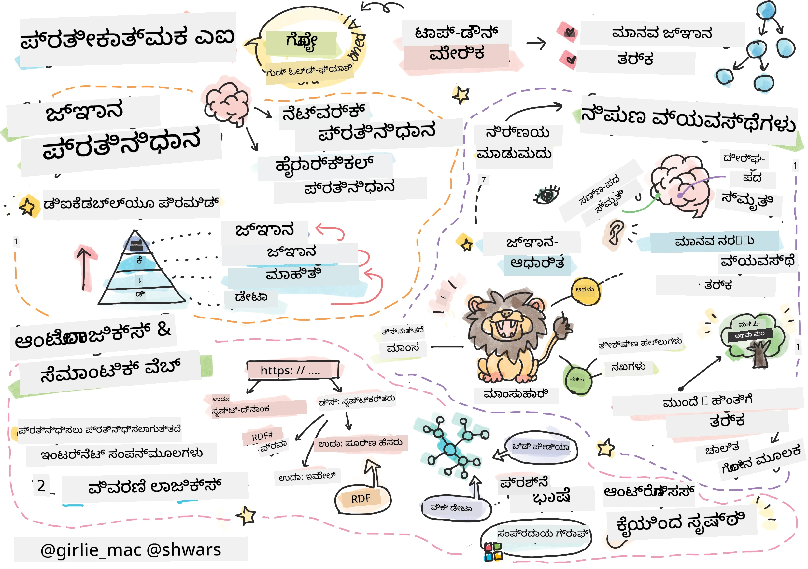
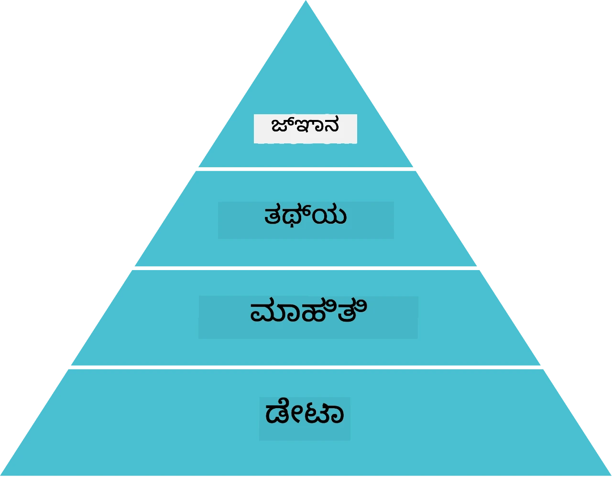
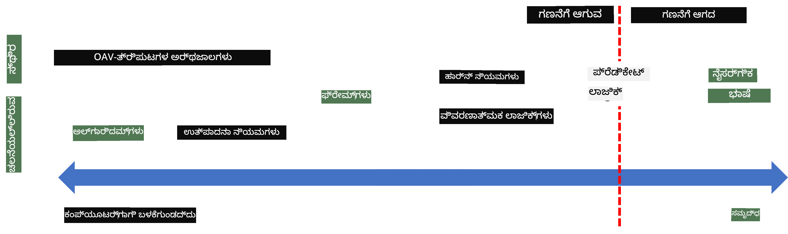
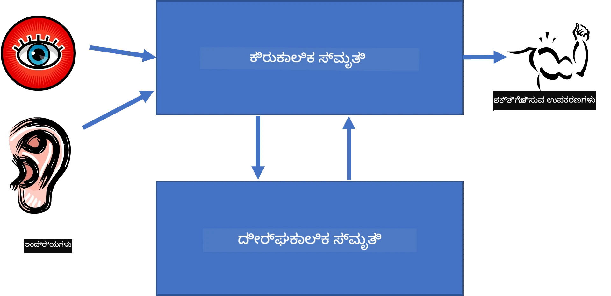
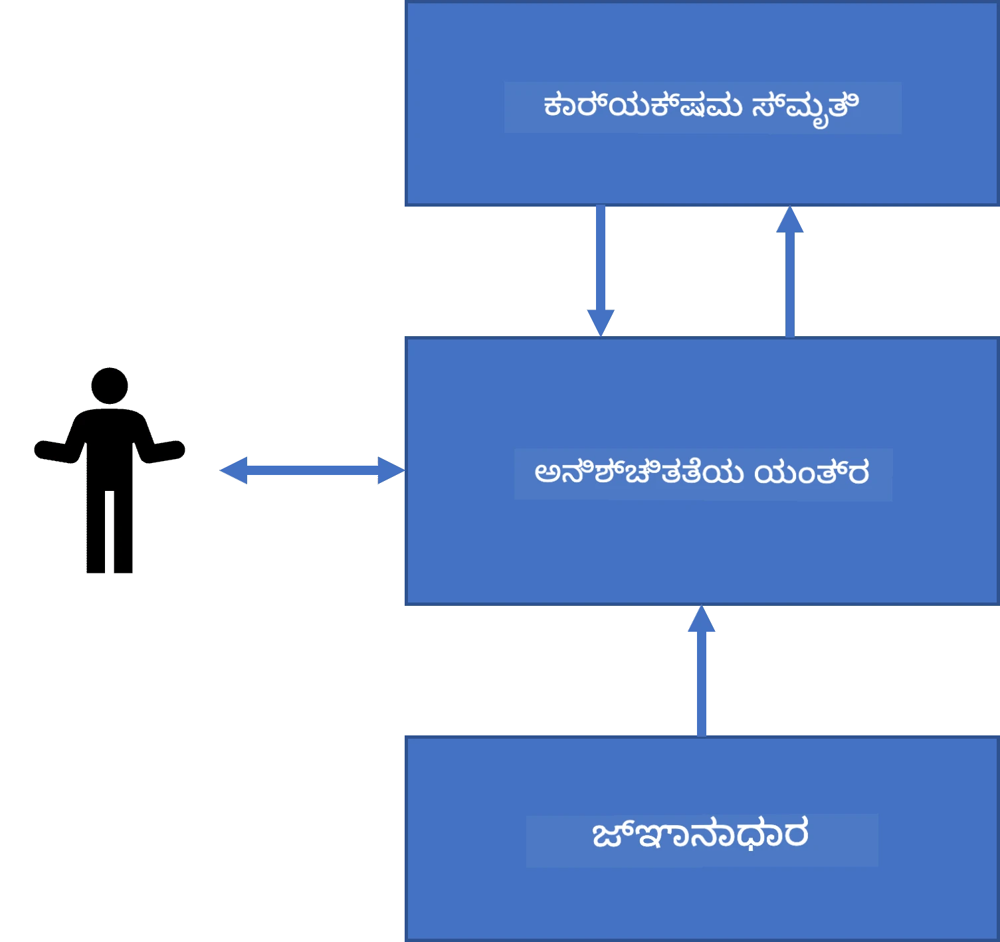
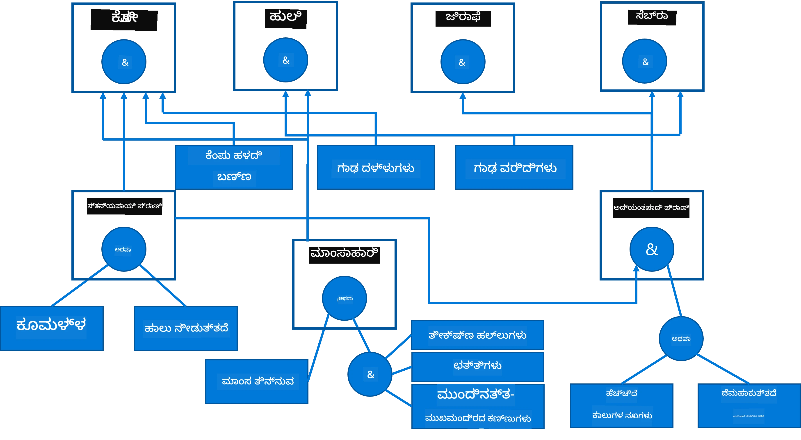
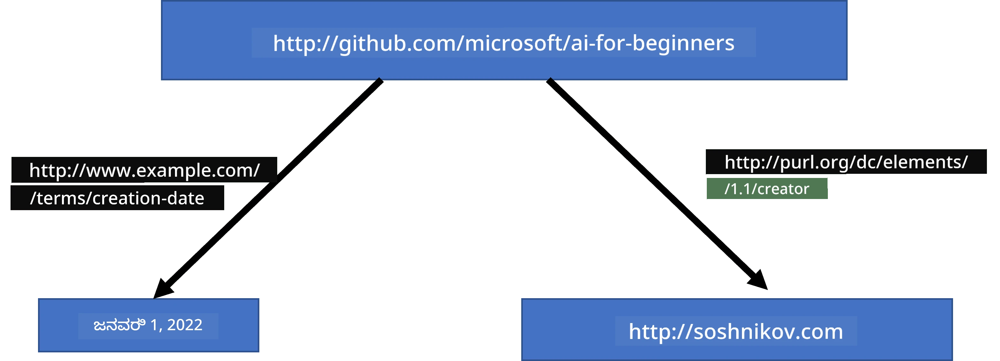
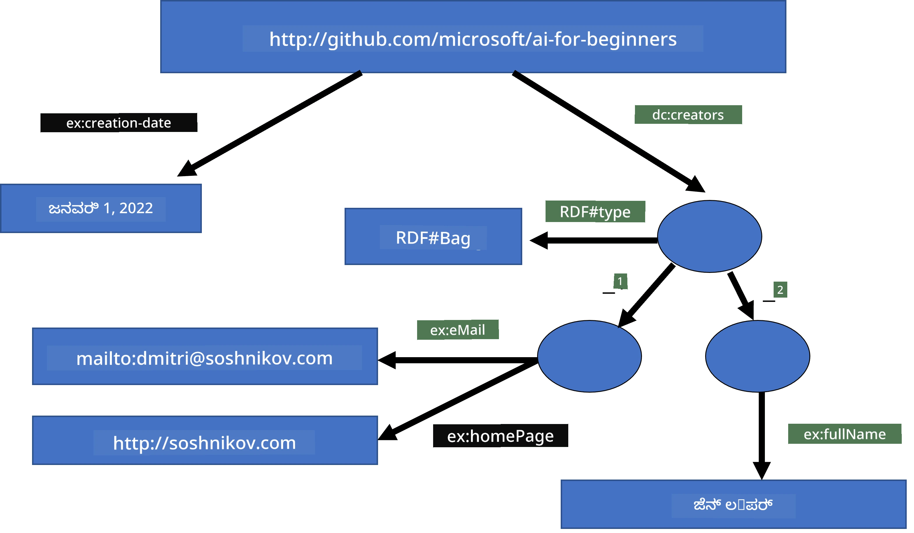
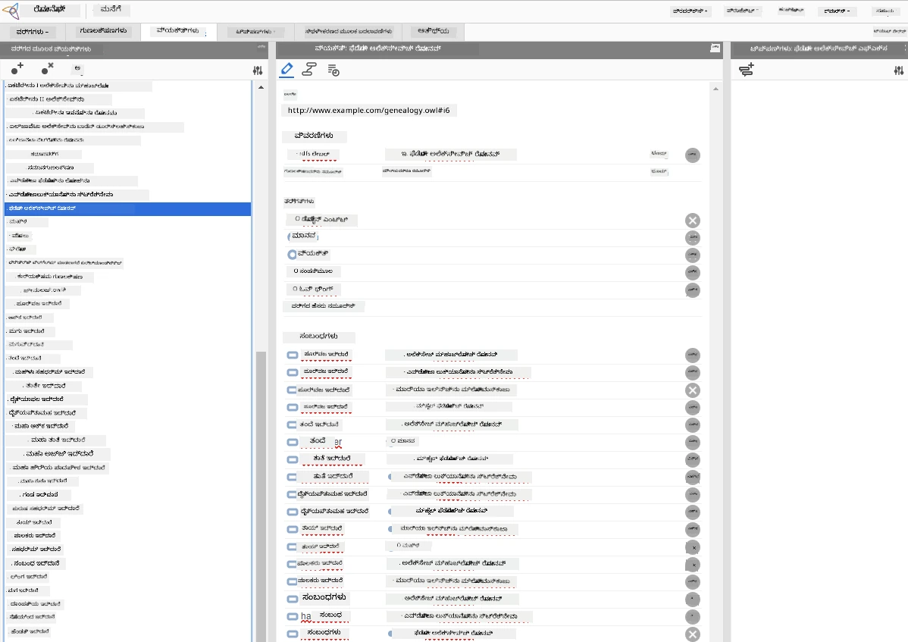

# ಜ್ಞಾನ ಪ್ರತಿನಿಧಾನ ಮತ್ತು ಪರಿಣತಿ ವ್ಯವಸ್ಥೆಗಳು



> ಸ್ಕೆಚ್ ನೋಟ್ [ಟೋಮೊಮಿ ಇಮುರಾ](https://twitter.com/girlie_mac) ಅವರಿಂದ

ಕೃತಕ ಬುದ್ಧಿಮತ್ತೆಗಾಗಿ ಪಶ್ಚಾತ್ತಾಪವು ಮಾನವರು ಹೇಗೆ ಮಾಡುತ್ತಾರೆ ಹಾಗೆ ವಿಶ್ವವನ್ನು ಅರ್ಥಮಾಡಿಕೊಳ್ಳಲು ಜ್ಞಾನವನ್ನು ಹುಡುಕುವುದರ ಮೇಲೆ ಆಧಾರಿತವಾಗಿದೆ. ಆದರೆ ನೀವು ಇದನ್ನು ಹೇಗೆ ಮಾಡಬಹುದು?

## [ಪೂರ್ವ-ವ್ಯಾಖ್ಯಾನ ಪ್ರಶ್ನೋತ್ತರ](https://ff-quizzes.netlify.app/en/ai/quiz/3)

AI ಯ ಮೊದಲ ದಿನಗಳಲ್ಲಿ, ಬುದ್ಧಿವಂತ ವ್ಯವಸ್ಥೆಗಳನ್ನು ತಯಾರಿಸಲು ಮೇಲಿನ ಹರಿವು (ಹಿಂದಿನ ಪಾಠದಲ್ಲಿ ಚರ್ಚಿಸಲಾಯಿತು) ಜನಪ್ರಿಯವಾಗಿತ್ತು. ಆಯ್ದವರು ಜ್ಞಾನವನ್ನು ಜನರಿಂದ ಯಂತ್ರಕ್ಕೆ ಪಠ್ಯರೂಪದಲ್ಲಿ ತೆಗೆದು, ನಂತರ ತಾನಾಗಿಯೇ ಸಮಸ್ಯೆಗಳನ್ನು ಪರಿಹರಿಸಲು ಬಳಸುವುದು ಎಂದು ಭಾವಿಸಿದ್ದರು. ಈ ವಿಧಾನವು ಎರಡು ಪ್ರಮುಖ ಕಲ್ಪನೆಗಳ ಮೇಲೆ ಆಧಾರಿತವಾಗಿತ್ತು:

* ಜ್ಞಾನ ಪ್ರತಿನಿಧಾನ
* ತರ್ಕವಿಮರ್ಶೆ

## ಜ್ಞಾನ ಪ್ರತಿನಿಧಾನ

ಸಾಂಗತ್ಯಾತ್ಮಕ AI ಯ ಪ್ರಮುಖ ನಿಷ್ಠೆಗಳಲ್ಲೊಂದು **ಜ್ಞಾನ**. ಜ್ಞಾನವನ್ನು *ಮಾಹಿತಿ* ಅಥವಾ *ಡೇಟಾ* ಇಂದ ವಿಭಜಿಸಬೇಕಾಗಿದೆ. ಉದಾಹರಣೆಗೆ, ಪುಸ್ತಕಗಳು ಜ್ಞಾನವನ್ನು ಹೊಂದಿವೆ ಎಂದು ಹೇಳಬಹುದು, ಏಕೆಂದರೆ ಪುಸ್ತಕಗಳನ್ನು ಅಧ್ಯಯನ ಮಾಡುವುದು ಮತ್ತು ಪರಿಣತಿಯಾಗುವುದು ಸಾಧ್ಯ. ಆದಾಗ್ಯೂ, ಪುಸ್ತಕಗಳಲ್ಲಿ ಇರುವ ವಿಷಯವನ್ನು *ಡೇಟಾ* ಎಂದು ಕರೆಯುತ್ತಾರೆ, ಮತ್ತು ಪುಸ್ತಕಗಳನ್ನು ಓದಿ ಈ ಡೇಟಾವನ್ನು ನಮ್ಮ ವಿಶ್ವ ಮಾದರಿಯಲ್ಲಿ ಸೇರ್ಪಡೆ ಮಾಡುವುದು ಮೂಲಕ ನಾವು ಡೇಟಾವನ್ನು ಜ್ಞಾನವಾಗಿ ಪರಿವರ್ತಿಸುತ್ತೇವೆ.

> ✅ **ಜ್ಞಾನ** ನಮ್ಮ ತಲೆಮೇಲೆ ಇರುತ್ತದೆ ಮತ್ತು ವಿಶ್ವದ ಮೇಲೆ ನಮ್ಮ ಅರ್ಥಮಾಡಿಕೊಳ್‌ಕುವಿಕೆಯ ಪ್ರತಿನಿಧಾನ. ಇದು ಚತುರ್ಭುಜ **ಕಲಿಕೆ** ಪ್ರಕ್ರಿಯೆಯಲ್ಲಿ ಪಡೆಯಲಾಗುತ್ತದೆ, ಅದು ನಾವು ಪಡೆದ ಮಾಹಿತಿಯ ತುಂಡುಗಳನ್ನು ನಮ್ಮ ಸಕ್ರಿಯ ಮಾದರಿಯಲ್ಲಿ ಸೇರ್ಪಡೆ ಮಾಡುತ್ತದೆ.

ಬಹುತೇಕ ಸಮಯ, ನಾವು ಜ್ಞಾನವನ್ನು ಸ್ಪಷ್ಟವಾಗಿ ವ್ಯಾಖ್ಯಾನಿಸುವುದಿಲ್ಲ, ಆದರೆ ಅದನ್ನು ಇತರ ಸಂಬಂಧಿತ ಕಲ್ಪನೆಗಳ ಜೊತೆಗೆ [DIKW ಪಿರಮಿಡ್](https://en.wikipedia.org/wiki/DIKW_pyramid) ಬಳಸಿ ಹೊಂದಾಣಿಕೆ ಮಾಡುತ್ತೇವೆ. ಇದರಲ್ಲಿ ಈ ಕೆಳಗಿನ ಕಲ್ಪನೆಗಳಿವೆ:

* **ಡೇಟಾ** ಭೌತಿಕ ಮಾಧ್ಯಮದಲ್ಲಿ ಪ್ರತಿನಿಧಿಸಲ್ಪಟ್ಟದ್ದು, ಉದಾಹರಣೆಗೆ ಬರೆಯಲಾದ ಪಠ್ಯ ಅಥವಾ ಮಾತಿನ ಪದಗಳು. ಡೇಟಾ ಮಾನವರಿಗೆ ನಿರಪೇಕ್ಷವಾಗಿ ಇರುತ್ತದೆ ಮತ್ತು ವ್ಯಕ್ತಿಗಳ ನಡುವೆ ಹಂಚಿಕೊಳ್ಳಬಹುದು.
* **ಮಾಹಿತಿ** ನಮ್ಮ ತಲೆಮೇಲೆ ಡೇಟಾ ಹೇಗೆ ಅರ್ಥಗೊಳ್ಳಲ್ಪಟ್ಟಿದೆ ಎಂಬುದಾಗಿದೆ. ಉದಾಹರಣೆಗೆ, ನಾವು *ಕಂಪ್ಯೂಟರ್* ಎಂಬ ಪದವನ್ನು ಕೇಳುವಾಗ, ಅದು ಏನೆಂದು ನಾವೇ ತಿಳಿದುಕೊಳ್ಳುತ್ತೇವೆ.
* **ಜ್ಞಾನ** ಗೊಂದು ವಿಶ್ವ ಮಾದರಿಯಲ್ಲಿ ಮಾಹಿತಿಯನ್ನು ಸೇರ್ಪಡೆ ಮಾಡುವುದು. ಉದಾಹರಣೆಗೆ, ಒಂದು ಕಂಪ್ಯೂಟರ್ ಏನೆಂದು ಕಲಿತ ನಂತರ, ನಾವು ಅದರ ಕಾರ್ಯಪದ್ಧತಿ, ಖರ್ಚು, ಮತ್ತು ಉಪಯೋಗಗಳನ್ನು ತಿಳಿಯುತ್ತದೆ. ಈ ಸಂಯೋಜಿತ ಕಲ್ಪನೆಗಳ ಜಾಲ ನಮ್ಮ ಜ್ಞಾನವನ್ನು ರೂಪಿಸುತ್ತದೆ.
* **ತತ್ಪರ್ಯಾಕ್** ನಮ್ಮ ವಿಶ್ವದ ಮೇಲಿನ ಮೇಲ್ಮಟ್ಟದ ಅರ್ಥ, ಅದು *ಮೆಟಾ-ಜ್ಞಾನ* ಅನ್ನು ಪ್ರತಿನಿಧಿಸುತ್ತದೆ, ಉದಾ: ಜ್ಞಾನವನ್ನು ಯಾವಾಗ ಹಾಗೂ ಹೇಗೆ ಬಳಸಬೇಕು ಎಂಬ ಕಲ್ಪನೆ.



*ಚಿತ್ರ [ವಿಕಿಪೀಡಿಯದಿಂದ](https://commons.wikimedia.org/w/index.php?curid=37705247), ಲಾಂಗ್ಲಿವೇಥಿಯುಕ್ಸ್ - ಸ್ವಂತ ಕೆಲಸ, CC BY-SA 4.0*

ಆದ್ದರಿಂದ, **ಜ್ಞಾನ ಪ್ರತಿನಿಧಾನದ** ಸಮಸ್ಯೆಯು ಜ್ಞಾನವನ್ನು ಡೇಟಾ ರೂಪದಲ್ಲಿ ಯಂತ್ರದಲ್ಲಿ ಪರಿಣಾಮಕಾರಿ ರೀತಿಯಲ್ಲಿ ಪ್ರತಿನಿಧಿಸುವ ಮಾರ್ಗವನ್ನು ಕಂಡುಹಿಡಿಯುವುದು, ಅದು ಸ್ವಯಂಚಾಲಿತವಾಗಿ ಬಳಸಬಹುದಾಗಿದೆ. ಇದನ್ನು ಒಂದು ಸ್ಪೆಕ್ಟ್ರಮ್ ಎಂದು ನೋಡಬಹುದು:



> ಚಿತ್ರ: [ದ್ಮಿತ್ರಿ ಸೊಶ್ನಿಕೊವ್](http://soshnikov.com)

* ಎಡ ಬದಿಯಲ್ಲಿ, ಗಣಕಗಳು ಪರಿಣಾಮಕಾರಿಯಾಗಿ ಬಳಸಬಲ್ಲ ಸುಲಭ ಜ್ಞಾನ ಪ್ರತಿನಿಧಾನಗಳಿವೆ. ಸರಳವಾದುದು ಅಲ್ಗೋರೀತ्मिक, ಅಂದರೆ ಜ್ಞಾನವನ್ನು ಕಂಪ್ಯೂಟರ್ ಪ್ರೋಗ್ರಾಮ್ ಮೂಲಕ ಪ್ರತಿನಿಧಿಸುವುದು. ಆದರೆ ಇದು ಉತ್ತಮ ಮಾರ್ಗವಲ್ಲ, ಏಕೆಂದರೆ ಇದು ಸ್ಥಿರವಾಗಿದ್ದು, ನಮ್ಮ ತಲೆಮೇಲೆ ಇರುವ ಜ್ಞಾನವು ಅಲ್ಗೋರಿಥ್ಮಿಕ ಅಲ್ಲ.
* ಬಲ ಬದಿಯಲ್ಲಿ, ಪ್ರಕೃತ ಪಠ್ಯಂತಹ ಪ್ರತಿನಿಧಾನಗಳಿವೆ. ಇದು ಶಕ್ತಿಶಾಲಿಯಾಗಿದ್ದು, ಸ್ವಯಂಚಾಲಿತ ತರ್ಕವು ಮಾಡಲು ಸಾಧ್ಯವಿಲ್ಲ.

> ✅ ನೀವು ನಿಮ್ಮ ತಲೆಮೇಲಿನ ಜ್ಞಾನವನ್ನು ಹೇಗೆ ಪ್ರತಿನಿಧಿಸುತ್ತೀರಿ ಮತ್ತು ಅದನ್ನು ಟಿಪ್ಪಣಿಗಳಾಗಿ ಪರಿವರ್ತಿಸುತ್ತೀರಿ ಎಂದು ಕೆಲವು ಕ್ಷಣ ತೊಳಲುಕೊಂಡಿ. ನಿಮ್ಮ ನೆನಪಿನ ಸಹಾಯಕ್ಕೆ ಯಾವ ವಿಶೇಷ ವಿನ್ಯಾಸವು ಉತ್ತಮವಾಗಿ ಕಾರ್ಯನಿರ್ವಹಿಸುತ್ತದೆ?

## ಕಂಪ್ಯೂಟರ್ ಜ್ಞಾನ ಪ್ರತಿನಿಧಾನಗಳನ್ನು ವರ್ಗೀಕರಿಸುವುದು

ನಾವು ಆಯಾ ಕಂಪ್ಯೂಟರ್ ಜ್ಞಾನ ಪ್ರತಿನಿಧಾನ ವಿಧಾನಗಳನ್ನು ಕೆಳಗಿನ ವಿಭಾಗಗಳಲ್ಲಿ ವರ್ಗೀಕರಿಸಬಹುದು:

* **ಜಾಲ ಪ್ರತಿನಿಧಾನಗಳು** ನಮ್ಮ ತಲೆಮೇಲಿನ ಪರಸ್ಪರ ಸಂಬಂಧ ಹೊಂದಿರುವ ಕಲ್ಪನೆಗಳ ಜಾಲವಾಗಿ ಆಧಾರಿತವಾಗಿವೆ. ನಾವು ಹೋಲಿಸಲು ಒಂದು ಗ್ರಾಫ್ ಆಕಾರದಲ್ಲಿ ಸಮಾನ ಜಾಲವನ್ನು ಕಂಪ್ಯೂಟರ್‌ಗೆ ಪ್ರತಿನಿಧಿಸಬಹುದು - ಇದನ್ನು **ಅರ್ಥಜಾಲ** ಎಂದು ಕರೆಯಲಾಗುತ್ತದೆ.

1. **ವಸ್ತು-ಗುಣ-ಮೌಲ್ಯ ತ್ರಿಪುಟ (OAV)ಗಳು** ಅಥವಾ **ಗುಣ-ಮೌಲ್ಯ ಜೋಡಿಗಳು**. ಏಕೆಂದರೆ ಗ್ರಾಫ್ ಅನ್ನು ನೋಡ್ಸ್ ಮತ್ತು ಎಡ್ಜಸ್ ಪಟ್ಟಿಯಾಗಿ ಕಂಪ್ಯೂಟರ್‌ನಲ್ಲಿ ಪ್ರತಿನಿಧಿಸಬಹುದು, ನಾವು ಜಾಲವನ್ನು ತ್ರಿಪುಟಗಳ ಪಟ್ಟಿಯಾಗಿ ಪ್ರತಿನಿಧಿಸಬಹುದು, ಇವು ವಸ್ತುಗಳು, ಗುಣಗಳು ಮತ್ತು ಮೌಲ್ಯಗಳನ್ನು ಒಳಗೊಂಡಿರುತ್ತವೆ. ಉದಾಹರಣೆಗೆ ನಾವು ಪ್ರೋಗ್ರಾಮಿಂಗ್ ಭಾಷೆಗಳ ಬಗ್ಗೆ ಕೆಳಗಿನ ತ್ರಿಪುಟಗಳನ್ನು ನಿರ್ಮಿಸುತ್ತೇವೆ:

ವಸ್ತು | ಗುಣ | ಮೌಲ್ಯ
-------|-----------|------
Python | ಆಗಿದೆ | ಅನಿರ್ದಿಷ್ಟ-ಭಾಷೆ
Python | ಕಂಡುಹಿಡಿದವರು | ಗಿಡೊ ವಾನ್ ರೋಸ್ಸಮ್
Python | ಬ್ಲಾಕ್-ಸಿಂಟ್ಯಾಕ್ಸ್ | ಇನ್‌ಡೆಂಟೇಶನ್
ಅನಿರ್ದಿಷ್ಟ-ಭಾಷೆ | ಹೊಂದಿಲ್ಲ | ಪ್ರಕಾರ ವ್ಯಾಖ್ಯಾನಗಳು

> ✅ ತ್ರಿಪುಟಗಳನ್ನು ಉಪಯೋಗಿಸಿ ಇತರ ಜ್ಞಾನಪ್ರಕಾರಗಳನ್ನು ಪ್ರತಿನಿಧಿಸುವ ಬಗ್ಗೆ ಯೋಚಿಸಿ.

2. **ಅನುಕೂಲ ಪ್ರತಿನಿಧಾನಗಳು** ನಾವು ಸಾಮಾನ್ಯವಾಗಿ ನಮ್ಮ ತಲೆಮೇಲಿನ ವಸ್ತುಗಳ ಹೈರಾರ್ಕಿಯನ್ನು ರಚಿಸುವುದನ್ನು ಉತ್ತೇಜಿಸುತ್ತವೆ. ಉದಾ: ನಾವು ತಿಳಿದುಕೊಳ್ಳುತ್ತೇವೆ ಕಾನರಿ ಹಕ್ಕಿ ಮತ್ತು ಎಲ್ಲಾ ಹಕ್ಕಿಗಳು ರೆಕ್ಕೆಗಳನ್ನು ಹೊಂದಿವೆ. ನಾವು ಇದು ಯಾವ ಬಣ್ಣ ಆಗಿರುತ್ತದೆ ಮತ್ತು ಅದರ ಹಾರಾಟ ವೇಗ ಇತ್ಯಾದಿಗಳ ಬಗ್ಗೆ ಸಿಎಂ ತಿಳಿದುಕೊಂಡಿದ್ದೇವೆ.

   - **ಫ್ರೇಮ್ ಪ್ರತಿನಿಧಾನ** ಪ್ರತಿ ವಸ್ತು ಅಥವಾ ವರ್ಗವನ್ನು ಒಂದು **ಫ್ರೇಮ್** ಆಗಿ ಪ್ರತಿನಿಧಿಸುವುದರ ಮೇಲೆ ಆಧರಿಸಿದೆ. ಇಲ್ಲಿ **ಸ್ಲಾಟ್‌ಗಳು** ಇರುತ್ತವೆ. ಸ್ಲಾಟ್‌ಗಳು ಅಂಕಿತ ಮೌಲ್ಯಗಳನ್ನೂ, ಮೌಲ್ಯ ನಿರ್ವಹಣಾ ನಿಬಂಧನೆಗಳನ್ನೂ ಅಥವಾ ಮೌಲ್ಯವನ್ನು ಪಡೆಯಲು ಕರೆಮಾಡಬಹುದಾದ ಸಂಗ್ರಹಿತ ಪ್ರೌಢ ವೋಧನೆಗಳನ್ನು ಹೊಂದಿರುತ್ತವೆ. ಎಲ್ಲಾ ಫ್ರೇಮ್ಗಳು ಒಂದು ಹೈರಾರ್ಕಿಯಲ್ಲಿರುತ್ತವೆ, ಇದು ವಸ್ತು-ಆಧಾರಿತ ಪ್ರೋಗ್ರಾಮಿಂಗ್ ಭಾಷೆಗಳ ವಸ್ತು ಹೈರಾರ್ಕಿಯನ್ನು ಅನುಸರಿಸುತ್ತದೆ.
   - **ಘಟನೆಯ ಸ್ಥಿತಿಗಳು (ಸ್ಕೆನಾರಿಯೋಗಳು)** ಕಾಲಕ್ರಮವಾಗಿ ಅನಾವರಣಗೊಳ್ಳುವ ಸಂಕೀರ್ಣ ಸ್ಥಿತಿಗಳನ್ನು ಪ್ರತಿನಿಧಿಸುವ ವಿಶೇಷ ಫ್ರೇಮ್ಗಳು.

**Python**

ಸ್ಲಾಟ್ | ಮೌಲ್ಯ | ಡೀಫಾಲ್ಟ್ ಮೌಲ್ಯ | ಅವಧಿ |
-----|-------|---------------|----------|
ಹೆಸರು | Python | | |
ಹಾಗೆಯಿತ್ತಾಗಿದೆ (Is-A) | ಅನಿರ್ದಿಷ್ಟ-ಭಾಷೆ | | |
ತ್ಯಾದಿ ಸ್ಥಿತಿ | | ಕ್ಯಾಮೆಲ್‌ಕೇಸ್ | |
ಕಾರ್ಯಕ್ರಮ ದೈರ್ಘ್ಯ | | | 5-5000 ಸಾಲುಗಳು |
ಬ್ಲಾಕ್ ಸಿಂಟ್ಯಾಕ್ಸ್ | ಇನ್‌ಡೆಂಟ್ | | |

3. **ಪ್ರಕ್ರಿಯಾತ್ಮಕ ಪ್ರತಿನಿಧಾನಗಳು** ಕೆಲವು ಶರತ್ತು ಎದುರಾದಾಗ ಕಾರ್ಯಗಳ ಪಟ್ಟಿಯಿಂದ ಜ್ಞಾನವನ್ನು ಪ್ರತಿನಿಧಿಸುವುದರ ಮೇಲೆ ಆಧರಿಸಿ.
   - ಉತ್ಪಾದನೆ ನಿಯಮಗಳು, ಹೌದು-ಆದರೆ(If-then) ಹೇಳಿಕೆಗಳು, ನಿರ್ಣಯಗಳನ್ನು ಬಿಡಿಸಲು ಅನುಮತಿಸುತ್ತವೆ. ಉದಾಹರಣೆಗೆ, ವೈದ್ಯನು ನಿಯಮ ಇರುತ್ತದೆ: **ಹಾಗಾದರೆ** ರೋಗಿಯು ಉಷ್ಣತೆ ಅಥವಾ ರಕ್ತ ಪರೀಕ್ಷೆಯಲ್ಲಿ C-ರಿಯ್ಯಾಕ್ಟಿವ್ ಪ್ರೋಟೀನ್ ಹೆಚ್ಚು ಇದ್ದರೆ **ಆಗ** ಅವನಿಗೆ ಉರಿಸು ಕಾಡಾಗಬಹುದು. ಒಂದು ಶರತ್ತು ಕಾಣಿಸಿದಂತೆ, ಉರಿಸು ಪಟ್ಟಿಯೋ ಎಂಬುದನ್ನು ನಿರ್ಧರಿಸಬಹುದು ನಂತರ ಅದನ್ನು ತರ್ಕದಲ್ಲಿ ಬಳಸಬಹುದು.
   - ಅಲ್ಗೋರಿಥಮ್‌ಗಳು ಮತ್ತೊಂದು ಪ್ರಕ್ರಿಯಾತ್ಮಕ ಪ್ರತಿನಿಧಾನದ ರೂಪವಾಗಿ ಪರಿಗಣಿಸಬಹುದು, ಆದರೆ ಅವುಗಳನ್ನು ಜ್ಞಾನ ಆಧಾರಿತ ವ್ಯವಸ್ಥೆಗಳಲ್ಲಿ ನೇರವಾಗಿ ಬಳಸದಿರುತ್ತಾರೆ.

4. **ತರ್ಕ** ಮೂಲತಃ ಅರಿಸ್ಟೋಟಲ್ ಜಾಗತಿಕ ಮಾನವ ಜ್ಞಾನವನ್ನು ಪ್ರತಿನಿಧಿಸುವ ಮಾರ್ಗವಾಗಿ ಪ್ರಸ್ತಾಪಿಸಿದರು.
   - ಪ್ರೇಡಿಕೇಟ್ ಲಾಜಿಕ್ ಗಣಿತ ಶಾಸ್ತ್ರವಾಗಿ ತುಂಬಾ ಸಮೃದ್ಧವಾಗಿದೆ, ಅದನ್ನು ಕ್ರಮಿತವಾಗಿ ಗಣಕಗೊಳಿಸುವುದು ಸಾಧ್ಯವಿಲ್ಲ, ಆದ್ದರಿಂದ ಇದರ ಉಪಸಮೂಹಗಳನ್ನು ಬಳಕೆ ಮಾಡುತ್ತಾರೆ, ಉದಾ: ಪ್ರೊಲಾಗ್‌ನ ಹಾರ್ನ್ ಕ್ಲಾಜುಗಳು.
   - ವರ್ಣನಾತ್ಮಕ ತರ್ಕವು ವಸ್ತುಗಳ ಹೈರಾರ್ಕಿಗಳನ್ನು ಪ್ರತಿನಿಧಿಸಲು ಮತ್ತು ತರ್ಕಮಾಡಲು ಉಪಯುಕ್ತ ವಾಸ್ತುಶಿಲ್ಪಗಳ ಕುಟುಂಬವಲ್ಲದೆ, ಹಾಗೂ ವಿಭಾಗಿತ ಜ್ಞಾನ ಪ್ರತಿನಿಧಾನಗಳಿಗೆ, ಉದಾ: *ಅರ್ಥಜಾಲ* ಗೆ ಉಪಯೋಗ.

## ಪರಿಣತಿ ವ್ಯವಸ್ಥೆಗಳು

ಸಾಂಗತ್ಯಾತ್ಮಕ AI ಯ ಮೊದಲ ಯಶಸ್ಸುಗಳಲ್ಲಿ ಒಂದಾಗಿದ್ದವು **ಪರಿಣತಿ ವ್ಯವಸ್ಥೆಗಳು** - ಕೆಲವು పరಿಮಿತ ಸಮಸ್ಯಾ ಕ್ಷೇತ್ರದಲ್ಲಿ ಪರಿಣತಿ ಹಿಡಿದಿರುವಂತೆ ತೋರಿಸಲು ರೂಪಿಸಲಾದ ಕಂಪ್ಯೂಟರ್ ವ್ಯವಸ್ಥೆಗಳು. ಅವು ಮಾನವ ನಿರ್ಮಿತ **ಜ್ಞಾನ ಭಂಡಾರ** ಆಧರಿತವಾಗಿದ್ದು, ಮೇಲೆ ಕೆಲವು ತರ್ಕವನ್ನು ಮಾಡುತ್ತಿದ್ದ **ನಿರ್ಣಯ இயಂತ್ರ** ಅನ್ನು ಒಳಗೊಂಡಿದ್ದವು.

 | 
---------------------------------------------|------------------------------------------------
ಮಾನವ ನ್ಯೂರಲ್ ಸಿಸ್ಟಮ್ ಸರಳ ರಚನೆ | ಜ್ಞಾನ ಆಧಾರಿತ ವ್ಯವಸ್ಥೆಯ ಶೃಂಗ

ಪರಿಣತಿ ವ್ಯವಸ್ಥೆಗಳು ಮಾನವ ತರ್ಕ ವ್ಯವಸ್ಥೆಯಂತೆ ನಿರ್ಮಿಸಲಾಗಿದೆ, ಅದು **ಅಲ್ಪಾವಧಿ ಸ್ಮರಣೆ** ಮತ್ತು **ದೀರ್ಘಕಾಲ ಸ್ಮರಣೆ** ಹೊಂದಿದೆ. ಹಾಗೆಯೇ, ಜ್ಞಾನ ಆಧಾರಿತ ವ್ಯವಸ್ಥೆಗಳಲ್ಲಿ ನಾವು ಕೆಳಗಿನ ಭಾಗಗಳನ್ನು ವಿಭಜಿಸುತ್ತೇವೆ:

* **ಸಮಸ್ಯೆ ಸ್ಮರಣೆ**: ಪ್ರಸ್ತುತ ಪರಿಹರಿಸಲಾಗುತ್ತಿರುವ ಸಮಸ್ಯೆ ಬಗ್ಗೆ ಜ್ಞಾನದ ಸಂಗ್ರಹ, ಉದಾ: ತಾಪಮಾನ ಅಥವಾ ರಕ್ತದ ಒತ್ತಡ, ಉರಿತದ ಅಸ್ತಿತ್ವ ಇತ್ಯಾದಿ. ಈ ಜ್ಞಾನವನ್ನು **ಸ್ಥಿರ ಜ್ಞಾನ** ಎಂದು ಕರೆಯಲಾಗುತ್ತದೆ, ಏಕೆಂದರೆ ಇದು ಪ್ರಸ್ತುತ ಸಮಸ್ಯೆಯ ಸ್ಥಿತಿಯನ್ನು ಸೂಚಿಸುತ್ತದೆ - *ಸಮಸ್ಯಾ ಸ್ಥಿತಿ*.
* **ಜ್ಞಾನ ಭಂಡಾರ**: ಸಮಸ್ಯಾ ಕ್ಷೇತ್ರದ ದೀರ್ಘಕಾಲ ಜ್ಞಾನವನ್ನು ಪ್ರತಿನಿಧಿಸುತ್ತದೆ. ಇದು ಮಾನವ ಪರಿಣತರಿಂದ ಕೈಯಿಂದ ತೆಗೆದುಕೊಳ್ಳಲ್ಪಟ್ಟು, ಸಲಹೆಯಿಂದ ಸಲಹೆಗೆ ಬದಲಾಗುವುದಿಲ್ಲ. ಒಂದು ಸಮಸ್ಯಾ ಸ್ಥಿತಿಯಿಂದ ಇನ್ನೊಂದು ಸ್ಥಿತಿಗೆ ಸಾಗಲು ಅನುಮತಿಸುವುದರಿಂದ **ಚಲನೆಯ ಜ್ಞಾನ** ಎಂದು ಕರೆಯಲ್ಪಡುತ್ತದೆ.
* **ನಿರ್ಣಯ ಯಂತ್ರ**: ಸಂಶೋಧನೆಯ ಸಮಗ್ರ ಪ್ರಕ್ರಿಯೆಯನ್ನು ನಿರ್ವಹಿಸುತ್ತದೆ, ಬಳಕೆದಾರನ ನಡವಳಿಕೆಗೆ ಪ್ರಾಸಕ್ತ ಪ್ರಶ್ನೆಗಳನ್ನು ಕೇಳುತ್ತದೆ. ಪ್ರತಿ ಸ್ಥಿತಿಗೆ ಅನ್ವಯಿಸುವ ಸರಿಯಾದ ನಿಯಮಗಳನ್ನು ಹುಡುಕಲು ಹೊಣೆಗಾರ.

ಉದಾಹರಣೆಗೆ, ಪ್ರಾಣಿ ಲಕ್ಷಣಗಳಿಂದ ಪ್ರಾಣಿಯನ್ನು ನಿರ್ಣಯಿಸುವ ಈ ತಜ್ಞವ್ಯವಸ್ಥೆಯನ್ನು ಪರಿಗಣಿಸೋಣ:



> ಚಿತ್ರ: [ದ್ಮಿತ್ರಿ ಸೊಶ್ನಿಕೊವ್](http://soshnikov.com)

ಈ ಚಿತ್ರವನ್ನು **AND-OR ಮರ** ಎಂದು ಕರೆಯುತ್ತಾರೆ, ಇದು ಉತ್ಪಾದನಾ ನಿಯಮಗಳ ಸೆಟ್‌ನ ದೃಶ್ಯ ಪ್ರತಿನಿಧಾನ. ತಜ್ಞರಿಂದ ಜ್ಞಾನ ಪಡೆಯುವ ಪ್ರಾರಂಭದಲ್ಲಿ ಮರವನ್ನು ಬರೆದು ನೋಡಿಕೊಳ್ಳುವುದು ಉಪಯುಕ್ತ. ಕಂಪ್ಯೂಟರ್ ಒಳಗೆ ಜ್ಞಾನವನ್ನು ಪ್ರತಿನಿಧಿಸಲು ನಿಯಮಗಳನ್ನು ಬಳಸುವುದು ಸೂಕ್ತ:

```
IF the animal eats meat
OR (animal has sharp teeth
    AND animal has claws
    AND animal has forward-looking eyes
) 
THEN the animal is a carnivore
```

ನೀವು ಗಮನಿಸುವಿರಿ, ನಿಯಮದ ಎಡಬದಿ ಶರತ್ತು ಮತ್ತು ಕ್ರಿಯೆಯು ವಸ್ತು-ಗುಣ-ಮೌಲ್ಯ (OAV) ತ್ರಿಪುಟಗಳಾಗಿವೆ. **ಕಾರ್ಯ ಸ್ಮರಣೆ** ಪ್ರಸ್ತುತ ಪರಿಹಾರವಾಗುತ್ತಿರುವ ಸಮಸ್ಯೆಗೆ ಸಂಬಂಧಿಸಿದ OAV ತ್ರಿಪುಟಗಳ ಸંગ્રಹವಾಗಿದೆ. **ನಿಯಮಗಳ ಯಂತ್ರ** ಶರತ್ತು ಪೂರೈಸಿದ ನಿಯಮಗಳನ್ನು ಹುಡುಕಿ, ಅವನ್ನು ಅನ್ವಯಿಸಿ, ಕಾರ್ಯ ಸ್ಮರಣೆಗೆ ಮತ್ತೊಂದು ತ್ರಿಪುಟವನ್ನು ಸೇರಿಸುತ್ತದೆ.

> ✅ ನೀವು ಇಷ್ಟಪಡುವ ವಿಷಯದ ಮೇಲೆ ನಿಮ್ಮಂತೆ AND-OR ಮರವನ್ನು ಬರೆಯಿರಿ!

### ಮುಂಭಾಗ ಮತ್ತು ಹಿಂಬಾಗ ನಿರ್ಣಯ

ಮೇಲೇಳಿಸಿದ ಪ್ರಕ್ರಿಯೆಯನ್ನು **ಮುಂಭಾಗ ನಿರ್ಣಯ** ಎಂದು ಕರೆಯುತ್ತಾರೆ. ಇದು ಪ್ರಾರಂಭಿಕ ಡೇಟಾವಿನಿಂದ ಪ್ರಾರಂಭಿಸಿ, ಕೆಳಗಿನ ತರ್ಕಮಯ ಲೂಪ್ ನಡೆಸುತ್ತದೆ:

1. ಗುರಿ ಗುಣ ಕಾರ್ಯ ಸ್ಮರಣೆಯಲ್ಲಿ ಇದ್ದರೆ - ನಿಲ್ಲಿಸಿ ಫಲಿತಾಂಶ ನೀಡಿ.
2. ಪ್ರಸ್ತುತ ಶರತ್ತು ಪೂರೈಸುವ ಎಲ್ಲಾ ನಿಯಮಗಳನ್ನು ಹುಡುಕಿ - **ವಿರೋಧ ಸಂಕಲನ** ಪಡೆಯಿರಿ.
3. **ವಿರೋಧ ಪರಿಹಾರ** ಉಪಕ್ರಮಗಳನ್ನು ಅಪ್ಲೈ ಮಾಡಿ - ಈ ಹಂತದಲ್ಲಿ ನಿರ್ವಹಿಸಲು ಒಂದು ನಿಯಮ ಆಯ್ಕೆಮಾಡಿ. ಹಲವಾರು ವಿಧಾನಗಳಿರಬಹುದು:
   - ಜ್ಞಾನ ಭಂಡಾರದ ಮೊದಲ ಅನ್ವಯಿಸಬಹುದಾದ ನಿಯಮವನ್ನು ಆರಿಸು
   - ಯಾದೃಚ್ಛಿಕ ನಿಯಮ ಆರಿಸು
   - *ವಿಶೇಷ ಆಯ್ಕೆ* ನಿಯಮ ಆರಿಸು, ಅಂದರೆ ಎಲ್‌ಎಚ್‌ಎಸ್‌ನ ಹೆಚ್ಚು ಶರತ್ತುಗಳನ್ನು ಪೂರ್ಣಗೊಳಿಸುವ ನಿಯಮ.
4. ಆಯ್ಕೆಮಾಡಿದ ನಿಯಮವನ್ನು ಅನುಷ್ಠಾನ ಮಾಡಿ, ಸಮಸ್ಯಾ ಸ್ಥಿತಿಯಲ್ಲಿ ಹೊಸ ಜ್ಞಾನ ಸೇರಿಸಿ.
5. ಹಂತ 1 ರಿಂದ ಪುನರಾವರ್ತಿಸಿ.

ಹಾಗಾದರೂ, ಕೆಲವೊಂದು ಸಂದರ್ಭಗಳಲ್ಲಿ ನಾವು ಸಮಸ್ಯೆಯ ಬಗ್ಗೆ ಖಾಲಿ ಜ್ಞಾನದಿಂದ ಪ್ರಾರಂಭಿಸಿ, ಪ್ರಶ್ನೆಗಳನ್ನು ಕೇಳಿ ನಿರ್ಣಯ ತಲುಪಲು ಬಯಸಬಹುದು. ಉದಾಹರಣೆಗೆ, ವೈದ್ಯಕೀಯ ವೈದ್ಯಕೀಯ ಪರೀಕ್ಷೆಗಳನ್ನು ಮುಂಚಿತವಾಗಿ ಮಾಡದೆ ರೋಗಿಯನ್ನು ಪರಿಶೀಲಿಸಲಾಗುತ್ತದೆ. ಅಗತ್ಯವಿದ್ದಾಗಲೇ ವಿಶ್ಲೇಷಣೆ ಮಾಡಬೇಕು.

ಈ ಪ್ರಕ್ರಿಯೆಯನ್ನು **ಹಿಂಬಾಗ ನಿರ್ಣಯ** ಎನ್ನಲ್ಪಡುವುದು. ಇದು **ಗುರಿ** (ಹಿಂದಿನ ಬದಿಯ ಮೌಲ್ಯ) ಚಾಲಿತವಾಗಿರುತ್ತದೆ:

1. ಗುರಿಯ ಮೌಲ್ಯವನ್ನು ನೀಡಬಹುದಾದ ನಿಯಮಗಳನ್ನು (ಪರಭಾಷೆ RHS ನಲ್ಲಿ ಗುರಿಯು ಇರುವವು) ಎಲ್ಲಾ ಆಯ್ಕೆಮಾಡಿ - ವಿರೋಧ ಸಂಕಲನ
2. ನಿಯಮಗಳಿಲ್ಲದಿದ್ದರೆ ಅಥವಾ ಬಳಕೆದಾರರಿಂದ ಮೌಲ್ಯ ಕೇಳಬೇಕೆಂದು ನಿಯಮ ಇದ್ದರೆ - ಕೇಳಿ, ಇಲ್ಲವಾದರೆ:
3. ವಿರೋಧ ಪರಿಹಾರ ವಿಧಾನವು ಒಂದು ನಿಯಮವನ್ನು ನಮೂದಿಸಿಕೊಂಡು *ಪರಿಕಲ್ಪನೆ* ಎಂದು ಉಪಯೋಗಿಸಿ - ನಾವು ಯೋಜಿಸುತ್ತೇವೆ ಅದನ್ನು ಸಾಬೀತುಮಾಡಲು
4. ನಿಯಮದ ಎಲ್‌ಎಚ್‌ಎಸ್‌ನ ಎಲ್ಲಾ ಗುಣಗಳನ್ನು ಗುರಿಗಳಾಗಿ ಸಾಬೀತುಪಡಿಸಲು ಪ್ರಕ್ರಿಯೆಯನ್ನು ನಿತ್ಯಪುನರಾವರ್ತನೆ ಮಾಡಿ
5. ಯಾವುದಾದರೂ ಹಂತದಲ್ಲಿ ವಿಫಲವಾದರೆ - ಹಂತ 3 ರಲ್ಲಿ ಮತ್ತೊಬ್ಬ ನಿಯಮವನ್ನು ಬಳಸಿರಿ.

> ✅ ಯಾವ ಸಂದರ್ಭಗಳಲ್ಲಿ ಮುಂಭಾಗ ನಿರ್ಣಯ ಉತ್ತಮ? ಹಿಂಬಾಗ ನಿರ್ಣಯ ಯಾವಾಗ ಸೂಕ್ತ?

### ಪರಿಣತಿ ವ್ಯವಸ್ಥೆಗಳ ಅನ್ವಯ

ಪರಿಣತಿ ವ್ಯವಸ್ಥೆಗಳನ್ನು ವಿವಿಧ ಉಪಕರಣಗಳಿಂದ ಅಳವಡಿಸಲಾಗುತ್ತದೆ:

* ಕೆಲವು ಮೇಲ್ಮಟ್ಟದ ಭಾಷೆಯಲ್ಲಿ ನೇರವಾಗಿ ಪ್ರೋಗ್ರಾಮ್ ಮಾಡುವುದು. ಇದು ಉತ್ತಮ ಆಯ್ಕೆಯಾಗದು, ಏಕೆಂದರೆ ಜ್ಞಾನ ಆಧಾರಿತ ವ್ಯವಸ್ಥೆಯಲ್ಲಿ ಜ್ಞಾನ ಮತ್ತು ನಿರ್ಣಯ ಪ್ರಕ್ರಿಯೆ ವಿಭಿನ್ನ, ಮತ್ತು ಸಮಸ್ಯಾ ಕ್ಷೇತ್ರ ತಜ್ಞರು ನಿಯಮಗಳನ್ನು ಬರೆಯಬಹುದಾಗಿರಬೇಕು ನಿರ್ಣಯ ಪ್ರಕ್ರಿಯೆಯ ತಂತ್ರಜ್ಞಾನ ತಿಳಿಯದೆ.
* **ಪರಿಣತಿ ವ್ಯವಸ್ಥೆಯ ಶೆಲ್** ಬಳಸಿ, ಇದು ವಿಶೇಷವಾಗಿ ಜ್ಞಾನವನ್ನು ಭರ್ತಿಪಡಿಸಲು ವಿನ್ಯಾಸಗೊಳಿಸಲಾದ ವ್ಯವಸ್ಥೆ.

## ✍️ ವ್ಯಾಯಾಮ: ಪ್ರಾಣಿ ನಿರ್ಣಯ

ಮುಂದಿನ ಉದಾಹರಣೆಗೆ [Animals.ipynb](https://github.com/microsoft/AI-For-Beginners/blob/main/lessons/2-Symbolic/Animals.ipynb) ನೋಡಿ, ಮುಂಭಾಗ ಮತ್ತು ಹಿಂಬಾಗ ನಿರ್ಣಯ ತಜ್ಞ ವ್ಯವಸ್ಥೆಯ ರೂಪರೇಷೆಯನ್ನು ನೋಡಿ.

> **ಗಮನಿಸಿ**: ಈ ಉದಾಹರಣೆಯು ಸರಳ ಮತ್ತು ತಜ್ಞ ವ್ಯವಸ್ಥೆಯ ಮೂಲ ಕಲ್ಪನೆಯನ್ನು ಮಾತ್ರ ನೀಡುತ್ತದೆ. ನೀವು ಇಂತಹ ವ್ಯವಸ್ಥೆ ರಚಿಸುವಾಗ, ನಿಯಮಗಳು ಸಾಂಖ್ಯಿಕವಾಗಿ 200+ ತಲುಪಿದಾಗ ಮಾತ್ರ *ಬುದ್ಧಿವಂತಿಕೆಯ* ನಡವಳಿಕೆಯನ್ನು ಗಮನಿಸುತ್ತೀರಿ. ಕೆಲವು ಹಾದಿಯಲ್ಲಿ ನಿಯಮಗಳು ತುಂಬಾ ಸಂಕೀರ್ಣವಾಗುತ್ತವೆ, ಮತ್ತು ಅವುಗಳ ನಿರ್ಧಾರಗಳ ಹಿಮ್ಮುಖಕ್ಕೆ ನೀವು ವಿವರಣೆಗಾಗಿ ಯೋಚಿಸುವಿರಿ. ಆದರೆ ಜ್ಞಾನ ಆಧಾರಿತ ವ್ಯವಸ್ಥೆಗಳ ಪ್ರಮುಖ ಲಕ್ಷಣ ಎಂದರೆ ನಿರ್ಧಾರಗಳು ಹೇಗೆತ್ತಾಗಿವೆ ಎಂಬುದನ್ನು ಸ್ಪಷ್ಟವಾಗಿ *ವಿವರಿಸಬಹುದಾಗಿದೆ*.

## ಅಂಶಶಾಸ್ತ್ರಗಳು ಮತ್ತು ಅರ್ಥಜಾಲ

20ನೇ ಶತಮಾನ ಅಂತ್ಯದಲ್ಲಿ ಜ್ಞಾನ ಪ್ರತಿನಿಧಾನ ಬಳಸುವ ಅಭಿಯಾನ ಇಂಟರ್ನೆಟ್ ಸಂಪನ್ಮೂಲಗಳನ್ನು ಟ್ಯಾಗ್ ಮಾಡಲು ಪ್ರಾರಂಭವಾಯಿತು, ಇದು ಅತ್ಯಂತ ಸ್ಪಷ್ಟ ಕೇಳಾಟಗಳಿಗೆ ಸರಿಯಾದ ಸಂಪನ್ಮೂಲಗಳನ್ನು ಕಂಡುಹಿಡಿಯಲು ಸಾಧ್ಯವಾಗಿತ್ತು. ಇದನ್ನು **ಅರ್ಥಜಾಲ (Semantic Web)** ಎಂದು ಕರೆಯಲಾಗುತ್ತದೆ, ಮತ್ತು ಇದು ಕೆಲವು ಕಲ್ಪನೆಗಳ ಮೇಲೆ ಆಧಾರಿತವಾಗಿದೆ:

- **[ವಿವರಣಾತ್ಮಕ ತರ್ಕಗಳು](https://en.wikipedia.org/wiki/Description_logic)** (DL) ಆಧಾರಿತ ವಿಶೇಷ ಜ್ಞಾನ ಪ್ರತಿನಿಧಾನ. ಇದು ಫ್ರೇಮ್ ಜ್ಞಾನ ಪ್ರತಿನಿಧಾನದಂತೆ, ವಸ್ತುಗಳ ಹೈರಾರ್ಕಿಯನ್ನು ಗುಣಗಳೊಂದಿಗೆ ನಿರ್ಮಿಸುತ್ತದೆ, ಆದರೆ ಅಧಿಕೃತ ತರ್ಕ ಸಾಮರ್ಥ್ಯ ಮತ್ತು ನಿರ್ಣಯ ಹೊಂದಿದೆ. DL ಗಳ ಕುಟುಂಬವು ಅಭಿವ್ಯಕ್ತಿಶೀಲತೆ ಮತ್ತು ನಿರ್ಣಯ ಅದೃಷ್ಟತೆಯ ನಡುವೆ ಸಮತೋಲನ ಮಾಡುತ್ತದೆ.
- ಕಡೆಯಿಲ್ಲದ ಜ್ಞಾನ ಪ್ರತಿನಿಧಾನ, ಎಲ್ಲ ಕಲ್ಪನೆಗಳು ಜಾಗತಿಕ URI ಗುರುತಿನ ಮೂಲಕ ಪ್ರತಿನಿಧಿತವಾಗಿದ್ದು, ಇಂಟರ್ನೆಟ್ ವ್ಯಾಪ್ತಿಯಲ್ಲಿ ಜ್ಞಾನ ಹೈರಾರ್ಕಿಗಳನ್ನು ನಿರ್ಮಿಸುವುದಕ್ಕೆ ಅನುವು ಮಾಡಿಕೊಡುತ್ತದೆ.
- ಜ್ಞಾನ ವರ್ಣನೆಗಾಗಿ XML ಆಧಾರಿತ ಭಾಷೆಗಳ ಕುಟುಂಬ: RDF (Resource Description Framework), RDFS (RDF Schema), OWL (Ontology Web Language).

ಸೆಮಾಂಟಿಕ್ ವೆಬ್‌ನ ಪ್ರಮುಖ ಧಾರಣೆ **ಒಂಟಾಲಜಿ** ಎಂಬ ಧಾರಣೆ. ಇದು ಕೆಲವೊಂದು ಅಗತ್ಯ ಜ್ಞಾನ ಪ್ರತಿನಿಧಾನ ಬಳಸಿ ಸಮಸ್ಯದ ವಲಯವನ್ನು ಸ್ಪಷ್ಟವಾಗಿ ಸೂಚಿಸುವುದಕ್ಕೆ ಉಲ್ಲೇಖಿಸುತ್ತದೆ. ಸರಳ ಒಂಟಾಲಜಿ ಅಂದ್ರೆ ಸಮಸ್ಯದ ವಲಯದಲ್ಲಿ ವಸ್ತುಗಳ ಹೈರಾರ್ಕಿ ಆಗಿರಬಹುದು, ಆದರೆ ತುಖ್ಯ ಒಂಟಾಲಜಿಗಳು ನಿರ್ಣಯ ಮಾಡಲು ಬಳಸಬಹುದಾದ ನಿಯಮಗಳನ್ನು ಒಳಗೊಂಡಿರುತ್ತವೆ.

ಸೆಮಾಂಟಿಕ್ ವೆಬ್‌ನಲ್ಲಿ ಎಲ್ಲ ಪ್ರತಿನಿಧಾನಗಳೂ ಮೂರು-ಭಾಗ ಆದ ಇಟ್ಟುಕೊಂಡಿವೆ. ಪ್ರತಿಯೊಂದು ವಸ್ತು ಮತ್ತು ಪ್ರತಿಯೊಂದು ಸಂಬಂಧವೂ ಯಾರಿಗೂ ಅಂಕಿತಗೊಂಡ URI ಮೂಲಕ ಗುರುತಿಸಲಾಗುತ್ತದೆ. ಉದಾಹರಣೆಗೆ, ಈ AI ಪಠ್ಯಕ್ರಮವನ್ನು ಡಿಮಿಟ್ರಿ ಸೋಶ್ನಿಕೊವ್ ಜನವರಿ 1, 2022 ರಂದು ಅಭಿವೃದ್ಧಿಪಡಿಸಿದ್ದ ಎಂಬ ಮಾಹಿತಿಯನ್ನು ಹೇಳಬೇಕಾದರೆ — ನಾವು ಬಳಸಬಹುದಾದ ಮೂರು-ಭಾಗಗಳು ಇವೆ:



```
http://github.com/microsoft/ai-for-beginners http://www.example.com/terms/creation-date “Jan 1, 2022”
http://github.com/microsoft/ai-for-beginners http://purl.org/dc/elements/1.1/creator http://soshnikov.com
```

> ✅ ಇಲ್ಲಿ `http://www.example.com/terms/creation-date` ಮತ್ತು `http://purl.org/dc/elements/1.1/creator` ಎಂಬವು *ರಚನೆದಾರ* ಮತ್ತು *ರಚನೆಯ ದಿನಾಂಕ* ಎಂಬ ಕಲ್ಪನೆಗಳನ್ನು ವ್ಯಕ್ತಪಡಿಸಲು ಸುಪ್ರಸಿದ್ಧ ಹಾಗೂ ವಿಶ್ವಪ್ರತಿಷ್ಠಿತ URIಗಳು.

ಸುಧಾರಿತ ಪ್ರಕರಣದಲ್ಲಿ, ನಾವು ರಚನೆದಾರರ ಪಟ್ಟಿಯನ್ನು นิರುಪಿಸಲು ಬಯಸಿದರೆ, RDF ನಲ್ಲಿ ನಿರ್ದಿಷ್ಟವಾಗಿರುವ ಕೆಲವು ಡೇಟಾ ರಚನೆಗಳನ್ನು ಬಳಸಬಹುದು.



> ಮೇಲಿನ ಆಕೃತಿಗಳನ್ನು [ಡಿಮಿಟ್ರಿ ಸೋಶ್ನಿಕೊವ್](http://soshnikov.com) ರವರು ರಚಿಸಿದ್ದಾರೆ

ಸೆಮಾಂಟಿಕ್ ವೆಬ್ ನಿರ್ಮಾಣದ ಪ್ರಗತಿ, ಹುಡುಕಾಟ ಯಂತ್ರಗಳ ಯಶಸ್ಸಿನಿಂದ ಮತ್ತು ಸ್ವಾಭಾವಿಕ ಭಾಷಾ ಪ್ರಕ್ರಿಯೆ ತಂತ್ರಗಳಿಂದ ಎಂಬ ಜಟಿಲ ಗಠನೆಯನ್ನು ಹೊರತೆಗೆಯಬಹುದಾಗಿದೆ, ಇದು ಪಠ್ಯದಿಂದ ಸಂರಚಿತ ಡೇಟಾವನ್ನು ತೆಗೆದುಕೊಳ್ಳುತ್ತವೆ. ಆದಾಗ್ಯೂ, ಕೆಲವು ಕ್ಷೇತ್ರಗಳಲ್ಲಿ ಇನ್ನೂ ಒಂಟಾಲಜಿಗಳು ಮತ್ತು ಜ್ಞಾನ ಆಧಾರಗಳನ್ನು ನಿರ್ವಹಿಸಲು ಪ್ರಯತ್ನಗಳು ನಡೆಯುತ್ತಿವೆ. ಕೆಲವು ಗಮನಾರ್ಹ ಯೋಜನೆಗಳು:

* [WikiData](https://wikidata.org/) ವಿಕಿಪೀಡಿಯೊಂದಿಗೆ ಸಂಯೋಜಿತ ಯಂತ್ರ ಓದಲು ಅನುಕೂಲಕರ ಜ್ಞಾನ ಆಧಾರಗಳ ಸಂಗ್ರಹ. ಅನೇಕ ಡೇಟಾ ವಿಕಿಪೀಡಿಯ *InfoBoxes* ನಿಂದ ಕೊಯ್ಯಲ್ಪಟ್ಟಿದೆ, ಅವು ವಿಕಿಪೀಡಿಯ ಪುಟಗಳಲ್ಲಿ ಸಂರಚಿತ ವಿಷಯಗಳ ತುಂಡುಗಳು. ನೀವು [ಕೋರೆದಿಕೊಳ್ಳಬಹುದು](https://query.wikidata.org/) ವರ್ಧಿತ ವ್ಯಾಖ್ಯಾನದ ಭಾಷೆ SPARQL ನೊಂದಿಗೆ ವಿಕಿಡೇಟಾವನ್ನು. ಇಲ್ಲಿ ಮಾನವರಲ್ಲಿ ಅತ್ಯಂತ ಜನಪ್ರಿಯ ಕಣ್ಣು ಬಣ್ಣಗಳನ್ನು ಪ್ರದರ್ಶಿಸುವ ಮಾದರಿ ಪ್ರಶ್ನೆ ಇದೆ:

```sparql
#defaultView:BubbleChart
SELECT ?eyeColorLabel (COUNT(?human) AS ?count)
WHERE
{
  ?human wdt:P31 wd:Q5.       # human instance-of homo sapiens
  ?human wdt:P1340 ?eyeColor. # human eye-color ?eyeColor
  SERVICE wikibase:label { bd:serviceParam wikibase:language "en". }
}
GROUP BY ?eyeColorLabel
```

* [DBpedia](https://www.dbpedia.org/) ಇನ್ನೊಂದು ವೈಕೆಂದ್ರೀಕೃತ WikiData ಮಾದರಿಯ ಪ್ರಯತ್ನ.

> ✅ ನೀವು ನಿಮ್ಮ ಸ್ವಂತ ಒಂಟಾಲಜಿಗಳನ್ನು ನಿರ್ಮಿಸಲು ಅಥವಾ ಹಳೆಯವುಗಳನ್ನು ತೆರೆಯಲು ಆಸಕ್ತರಾಗಿದ್ದರೆ, ಅತ್ಯುತ್ತಮ ದೃಶ್ಯ ಒಂಟಾಲಜಿ ಸಂಪಾದಕವಿರುವುದಿದೆ [Protégé](https://protege.stanford.edu/). ಅದವನ್ನು ಡೌನ್ಲೋಡ್ ಮಾಡಿ ಅಥವಾ ಆನ್ಲೈನಿನಲ್ಲಿ ಬಳಸಿ.



*ವೆಬ್ ಪ್ರೋಟೆಜೆ ಸಂಪಾದಕ, ರೋಮಾನೋವ್ ಕುಟುಂಬ ಒಂಟಾಲಜಿಯೊಂದಿಗೆ ತೆರೆಯಲಾಗಿದೆ. ಚಿತ್ರಣ ಡಿಮಿಟ್ರಿ ಸೋಶ್ನಿಕೊವ್ ಅವರದು*

## ✍️ ಅಭ್ಯಾಸ: ಕುಟುಂಬ ಒಂಟಾಲಜಿ

[kumbaOntology.ipynb](https://github.com/Ezana135/AI-For-Beginners/blob/main/lessons/2-Symbolic/FamilyOntology.ipynb) ನೋಡಿ, ಕುಟುಂಬ ಸಂಬಂಧಗಳ ಬಗ್ಗೆ ಸೆಮಾಂಟಿಕ್ ವೆಬ್ ತಂತ್ರಗಳನ್ನು ಉಪಯೋಗಿಸುವ ಉದಾಹರಣೆಗಾಗಿ. ನಾವು ಸಾಮಾನ್ಯ GEDCOM ರೂಪದಲ್ಲಿ ಪ್ರತಿನಿಧಿಸಲಾದ ಕುಟುಂಬ ಮರೆಯನ್ನು ತೆಗೆದುಕೊಂಡು ಕುಟುಂಬ ಸಂಬಂಧಗಳ ಒಂಟಾಲಜಿಯನ್ನು ಬಳಸಿ ಒಂದು ಗ್ರಾಫ್ ನಿರ್ಮಿಸುತ್ತೇವೆ.

## ಮೈಕ್ರೋಸಾಫ್ಟ್ ಕನ್ಸೆಪ್ಟ್ ಗ್ರಾಫ್

ಬಹುತೇಕ ಸಂದರ್ಭಗಳಲ್ಲಿ, ಒಂಟಾಲಜಿಗಳು ಕೈಯಿಂದ ಜಾಗರೂಕತೆಯಿಂದ ಸೃಷ್ಟಿ ಮಾಡಲಾಗುತ್ತವೆ. ಆದರೆ, ಒಳಚರಂಡಿಯಾಗದ ಡೇಟಾವಿನಿಂದ ಒಂಟಾಲಜಿಗಳನ್ನು **ಮೈನಿಂಗ್** ಮಾಡುವೂ ಸಾಧ್ಯ, ಉದಾಹರಣೆಗೆ ಸ್ವाभಾವಿಕ ಭಾಷಾ ಪಠ್ಯಗಳಿಂದ.

ಅಂತಹ ಪ್ರಯತ್ನವನ್ನು ಮೈಕ್ರೋಸಾಫ್ಟ್ ಸಂಶೋಧನಾ ಸಂಸ್ಥೆ ನಡೆಸಿತು, ಮತ್ತು ಫಲವಾಗಿ [Microsoft Concept Graph](https://blogs.microsoft.com/ai/microsoft-researchers-release-graph-that-helps-machines-conceptualize/?WT.mc_id=academic-77998-cacaste) ಸೃಷ್ಟಿ ಮಾಡಲಾಯಿತು.

ಇದು ವಿವಿಧ ಘಟಕಗಳನ್ನು “is-a” ವಂಶವೃಕ್ಷ ಸಂಬಂಧದಿಂದ ಗುಂಪುಬದ್ಧಗೊಳಿಸಿದ ದೊಡ್ಡ ಸಂಗ್ರಹ. ಇದು "ಮೈಕ್ರೋಸಾಫ್ಟ್ ಎಂದರೆ ಏನು?" ಎಂಬ ಪ್ರಶ್ನೆಗೆ ಉತ್ತರಿಸಲು ಸಾಧ್ಯವಾಗುತ್ತದೆ — ಉತ್ತರವಾಗಿ "ಒಂದು ಕಂಪೆನಿ ಬಿಲಾಸ 0.87, ಮತ್ತು ಒಂದು ಬ್ರಾಂಂಡ್ ಬಿಲಾಸ 0.75."

ಗ್ರಾಫ್ REST API ಆಗಿ ಲಭ್ಯವಿದೆ ಅಥವಾ ಎಲ್ಲಾ ಘಟಕ ಜೋಡಿಗಳ ಪಟ್ಟಿಯನ್ನು ಹೊಂದಿರುವ ಡೌನ್ಲೋಡ್ ಮಾಡಬಹುದಾದ ದೊಡ್ಡ ಪಠ್ಯ ಕಡತವಾಗಿ ಲಭ್ಯವಿದೆ.

## ✍️ ಅಭ್ಯಾಸ: ಕನ್ಸೆಪ್ಟ್ ಗ್ರಾಫ್

[MSConceptGraph.ipynb](https://github.com/microsoft/AI-For-Beginners/blob/main/lessons/2-Symbolic/MSConceptGraph.ipynb) ನೋಟ್‌ಬುಕ್ ಪ್ರಯೋಗಿಸಿರಿ, ಮೈಕ್ರೋಸಾಫ್ಟ್ ಕನ್ಸೆಪ್ಟ್ ಗ್ರಾಫ್ ಉಪಯೋಗಿಸಿ ಸುದ್ದಿವARTICLE ಗಳನ್ನು ಹಲವು ವರ್ಗಗಳಲ್ಲಿ ಗುಂಪು ಮಾಡಲು ಹೇಗೆ ಸಾಧ್ಯವಿದೆ ಎಂದು ನೋಡಲು.

## ತೀರ್ಮಾನ

ಈ ಕಾಲದಲ್ಲಿ, AI ಅನ್ನು Machine Learning ಅಥವಾ Neural Networks ನ ಸಮಾನಾರ್ಥಕ ಎಂದು ಪರಿಗಣಿಸಲಾಗುತ್ತದೆ. ಆದಾಗ್ಯೂ, ಮಾನವಿಕೆ ಸ್ಪಷ್ಟವಾದ ಯುಕ್ತಿವಾದವನ್ನು ತೋರಿಸುತ್ತದೆ, ಇದು ಸದ್ಯಕ್ಕೆ ನ್ಯೂರಲ್ ನೆಟ್ವರ್ಕ್ ಸಾಗಿ ಮಾಡದದ್ದು. ವಾಸ್ತವಿಕ ಜಗತ್ತಿನ ಯೋಜನೆಗಳಲ್ಲಿ, ಸ್ಪಷ್ಟ ಯುಕ್ತಿವಾದವನ್ನು ಮೂಲಕ ವಿವರಣೆಗೊಳ್ಳುವ ಕಾರ್ಯಗಳಿಗಾಗಿ, ಅಥವಾ ಯಂತ್ರದ ವರ್ತನೆಯನ್ನು ನಿಯಂತ್ರಿತವಾಗಿ ಬದಲಾಯಿಸಲು ಬಳಸಲಾಗುತ್ತದೆ.

## 🚀 ಸವಾಲು

ಈ ಪಾಠದ ಸಂಬಂಧಿಸಿರುವ ಕುಟುಂಬ ಒಂಟಾಲಜಿ ನೋಟ್‌ಬುಕ್‌ನಲ್ಲಿ, ಇತರ ಕುಟುಂಬ ಸಂಬಂಧಗಳೊಂದಿಗೆ ಪ್ರಯೋಗದ ಅವಕಾಶವಿದೆ. ಕುಟುಂಬ ಮರೆಯಲ್ಲಿನ ಜನರ ಮಧ್ಯೆ ಹೊಸ ಸಂಪರ್ಕಗಳನ್ನು ಕಂಡುಹಿಡಿಯಲು ಪ್ರಯತ್ನಿಸಿ.

## [ಪಾಠಬದಲ್ ಪ್ರಶ್ನೋತ್ತರ](https://ff-quizzes.netlify.app/en/ai/quiz/4)

## ವಿಮರ್ಶೆ ಮತ್ತು ಸ್ವಯಂ ಅಧ್ಯಯನ

ಜ್ಞಾನವನ್ನು ಪ್ರಮಾಣೀಕರಿಸಲು ಮತ್ತು ಸಂಹರಿಸಲು ಮಾನವರು ಪ್ರಯತ್ನಿಸಿದ ಕ್ಷೇತ್ರಗಳನ್ನು ಇಂಟರ್ನೆಟ್‌ನಲ್ಲಿ ಸಂಶೋಧಿಸಿ. ಬ್ಲೂಮ್‌ಗಳ ತೆರಗೇರಿ (Bloom's Taxonomy) ಕುರಿತು ತಿಳಿದುಕೊಳ್ಳಿ, ಮತ್ತು ಇತಿಹಾಸದಲ್ಲಿ ಮಾನವರು ತಮ್ಮ ಜಗತ್ತನ್ನು ಅರ್ಥಮಾಡಿಕೊಳ್ಳಲು ಹೇಗೆ ಯತ್ನಿಸಿದ್ದರು ಎಂಬುದನ್ನು ತಿಳಿದುಕೊಳ್ಳಿ. ಲಿನಿಯಸ್ ಅವರ ಕಾರ್ಮಿಕ Taxonomy ರಚನೆಯ ಕಾರ್ಯವನ್ನು ವೀಕ್ಷಿಸಿ, ಮತ್ತು ರಾಸಾಯನಿಕ ಅಂಶಗಳನ್ನು ವರ್ಗೀಕರಿಸಲು ಡಿಮಿಟ್ರೀ ಮೆಂಡಲೀವ್ ಅವರ ವಿಧಾನವನ್ನು ಗಮನಿಸಿ. ಇನ್ನಷ್ಟು ಆಸಕ್ತಿದಾಯಕ ಉದಾಹರಣೆಗಳು ನಿಮಗಾಗಿ ಯಾವುವು?

**ಹೊಂದಿಕೆ**: [ಒಂಟಾಲಜಿ ನಿರ್ಮಿಸಿ](assignment.md)

---

<!-- CO-OP TRANSLATOR DISCLAIMER START -->
**ತಪ್ಪು ನಿರೋಧಕ**:  
ಈ ದಾಖಲೆಯನ್ನು AI ಅನುವಾದ ಸೇವೆ [Co-op Translator](https://github.com/Azure/co-op-translator) ಬಳಸಿ ಅನುವಾದಿಸಲಾಗಿದೆ. ನಾವು ನಿಖರತೆಗಾಗಿ ಪ್ರಯತ್ನಿಸಿದರೂ, ಸ್ವಯಂಚಾಲಿತ ಅನುವಾದಗಳಲ್ಲಿ ತಪ್ಪುಗಳು ಅಥವಾ ಅಸತ್ಯತೆಯುಂಟಾಗಬಹುದೇಂದು ದಯವಿಟ್ಟು ಗಮನದಲ್ಲಿರಿಸಿಕೊಳ್ಳಿ. ಮೂಲ ಭಾಷೆಯಲ್ಲಿರುವ ಮೂಲ ದಾಖಲೆಯೇ ಅಧಿಕೃತ ಮೂಲವಾಗಬಹುದು ಎಂದು ಪರಿಗಣಿಸಬೇಕು. ಅತ್ಯಾವಶ್ಯಕ ಮಾಹಿತಿಗಾಗಿ, ವೃತ್ತಿಪರ ಮಾನವ ಅನುವಾದವನ್ನು ಶಿಫಾರಸು ಮಾಡಲಾಗುತ್ತದೆ. ಈ ಅನುವಾದ ಬಳಕೆಯಿಂದ ಉಂಟಾಗುವ ಯಾವುದೇ misunderstanding ಅಥವಾ தவறಾದ ಅರ್ಥಮಾಡಿಕೊಳ್ಲಿಕೆಗಳಿಗೆ ನಾವು ಹೊಣೆಗಾರರಲ್ಲ.
<!-- CO-OP TRANSLATOR DISCLAIMER END -->