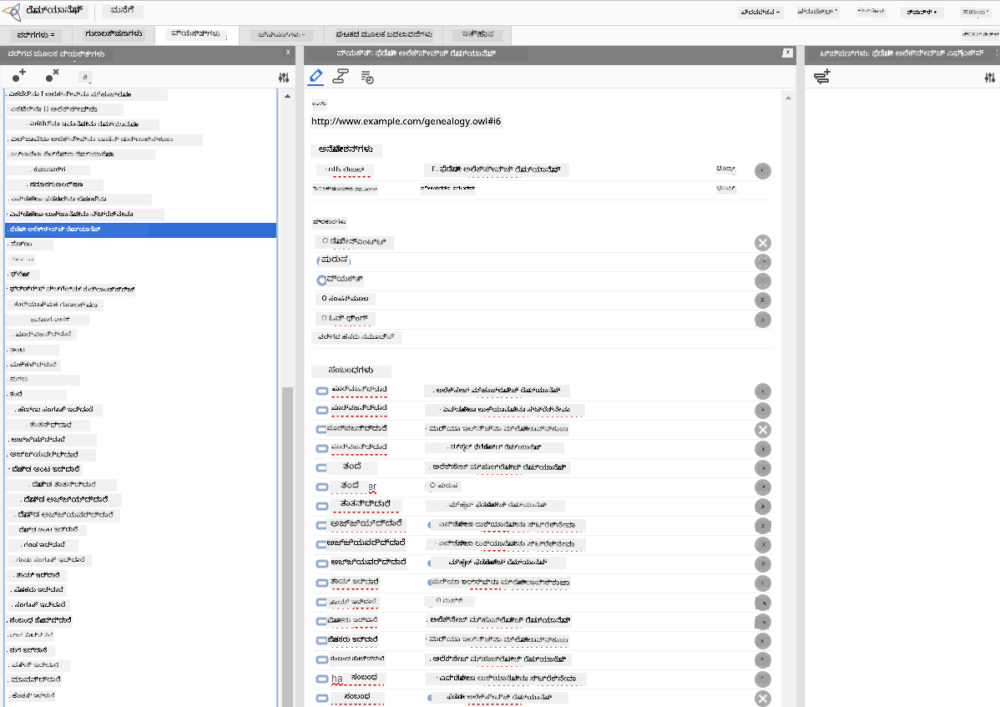

<!--
CO_OP_TRANSLATOR_METADATA:
{
  "original_hash": "7d097f7fda9166ead615e4c34552381b",
  "translation_date": "2025-11-25T21:03:31+00:00",
  "source_file": "lessons/2-Symbolic/README.md",
  "language_code": "kn"
}
-->
# ಜ್ಞಾನ ಪ್ರತಿನಿಧಾನ ಮತ್ತು ತಜ್ಞ ವ್ಯವಸ್ಥೆಗಳು


> ಸ್ಕೆಚ್‌ನೋಟ್ [ಟೊಮೊಮಿ ಇಮುರು](https://twitter.com/girlie_mac) ಅವರಿಂದ

ಕೃತಕ ಬುದ್ಧಿಮತ್ತೆಯ ಹುಡುಕಾಟವು ಜ್ಞಾನಕ್ಕಾಗಿ ಹುಡುಕಾಟದ ಮೇಲೆ ಆಧಾರಿತವಾಗಿದೆ, ಮಾನವರಂತೆ ಜಗತ್ತನ್ನು ಅರ್ಥಮಾಡಿಕೊಳ್ಳಲು. ಆದರೆ ನೀವು ಇದನ್ನು ಹೇಗೆ ಮಾಡಬಹುದು?

## [ಪೂರ್ವ-ವ್ಯಾಖ್ಯಾನ ಪ್ರಶ್ನೋತ್ತರ](https://ff-quizzes.netlify.app/en/ai/quiz/3)

AI ಆರಂಭಿಕ ದಿನಗಳಲ್ಲಿ, ಬುದ್ಧಿವಂತ ವ್ಯವಸ್ಥೆಗಳನ್ನು ರಚಿಸುವ ಟಾಪ್-ಡೌನ್ ವಿಧಾನ (ಹಿಂದಿನ ಪಾಠದಲ್ಲಿ ಚರ್ಚಿಸಲಾಯಿತು) ಜನಪ್ರಿಯವಾಗಿತ್ತು. ಆ ಕಲ್ಪನೆ ಜನರಿಂದ ಜ್ಞಾನವನ್ನು ಯಂತ್ರ ಓದಲು ಸಾಧ್ಯವಾದ ರೂಪದಲ್ಲಿ ತೆಗೆದು, ಅದನ್ನು ಸ್ವಯಂಚಾಲಿತವಾಗಿ ಸಮಸ್ಯೆಗಳನ್ನು ಪರಿಹರಿಸಲು ಬಳಸುವುದು. ಈ ವಿಧಾನ ಎರಡು ದೊಡ್ಡ ಕಲ್ಪನೆಗಳ ಮೇಲೆ ಆಧಾರಿತವಾಗಿತ್ತು:

* ಜ್ಞಾನ ಪ್ರತಿನಿಧಾನ
* ತರ್ಕ

## ಜ್ಞಾನ ಪ್ರತಿನಿಧಾನ

ಸಾಂಕೆತಿಕ AIಯಲ್ಲಿ ಪ್ರಮುಖ ಕಲ್ಪನೆಗಳಲ್ಲಿ ಒಂದಾಗಿದೆ **ಜ್ಞಾನ**. ಜ್ಞಾನವನ್ನು *ಮಾಹಿತಿ* ಅಥವಾ *ಡೇಟಾ*ಯಿಂದ ವಿಭಿನ್ನವಾಗಿ ಪರಿಗಣಿಸುವುದು ಮುಖ್ಯ. ಉದಾಹರಣೆಗೆ, ಪುಸ್ತಕಗಳು ಜ್ಞಾನವನ್ನು ಹೊಂದಿವೆ ಎಂದು ಹೇಳಬಹುದು, ಏಕೆಂದರೆ ಪುಸ್ತಕಗಳನ್ನು ಅಧ್ಯಯನ ಮಾಡಿ ತಜ್ಞರಾಗಬಹುದು. ಆದರೆ, ಪುಸ್ತಕಗಳಲ್ಲಿ ಇರುವುದನ್ನು ನಿಜವಾಗಿಯೂ *ಡೇಟಾ* ಎಂದು ಕರೆಯುತ್ತಾರೆ, ಮತ್ತು ಪುಸ್ತಕಗಳನ್ನು ಓದಿ ಈ ಡೇಟಾವನ್ನು ನಮ್ಮ ಜಗತ್ತಿನ ಮಾದರಿಯಲ್ಲಿ ಸಂಯೋಜಿಸುವ ಮೂಲಕ ನಾವು ಡೇಟಾವನ್ನು ಜ್ಞಾನಕ್ಕೆ ಪರಿವರ್ತಿಸುತ್ತೇವೆ.

> ✅ **ಜ್ಞಾನ** ಎಂದರೆ ನಮ್ಮ ತಲೆಯೊಳಗೆ ಇರುವದು ಮತ್ತು ಜಗತ್ತಿನ ನಮ್ಮ ಅರ್ಥವನ್ನು ಪ್ರತಿನಿಧಿಸುವದು. ಇದು ಸಕ್ರಿಯ **ಅಧ್ಯಯನ** ಪ್ರಕ್ರಿಯೆಯಿಂದ ಪಡೆಯಲ್ಪಡುವದು, ನಾವು ಪಡೆದ ಮಾಹಿತಿಯ ತುಂಡುಗಳನ್ನು ನಮ್ಮ ಸಕ್ರಿಯ ಜಗತ್ತಿನ ಮಾದರಿಯಲ್ಲಿ ಸಂಯೋಜಿಸುವದು.

ಬಹುಮಾನವಾಗಿ, ನಾವು ಜ್ಞಾನವನ್ನು ಕಟ್ಟುನಿಟ್ಟಾಗಿ ವ್ಯಾಖ್ಯಾನಿಸುವುದಿಲ್ಲ, ಆದರೆ ಅದನ್ನು ಸಂಬಂಧಿತ ಕಲ್ಪನೆಗಳೊಂದಿಗೆ [DIKW ಪಿರಮಿಡ್](https://en.wikipedia.org/wiki/DIKW_pyramid) ಬಳಸಿ ಹೊಂದಾಣಿಕೆ ಮಾಡುತ್ತೇವೆ. ಇದರಲ್ಲಿ ಈ ಕೆಳಗಿನ ಕಲ್ಪನೆಗಳಿವೆ:

* **ಡೇಟಾ** ಎಂದರೆ ಭೌತಿಕ ಮಾಧ್ಯಮದಲ್ಲಿ ಪ್ರತಿನಿಧಿಸಲ್ಪಟ್ಟಿರುವುದು, ಉದಾಹರಣೆಗೆ ಬರೆಯಲಾದ ಪಠ್ಯ ಅಥವಾ ಮಾತಿನ ಪದಗಳು. ಡೇಟಾ ಮಾನವರಿಂದ ಸ್ವತಂತ್ರವಾಗಿ ಅಸ್ತಿತ್ವದಲ್ಲಿದೆ ಮತ್ತು ಜನರ ನಡುವೆ ಹಂಚಿಕೊಳ್ಳಬಹುದು.
* **ಮಾಹಿತಿ** ಎಂದರೆ ನಾವು ನಮ್ಮ ತಲೆಯೊಳಗೆ ಡೇಟಾವನ್ನು ಹೇಗೆ ಅರ್ಥಮಾಡಿಕೊಳ್ಳುತ್ತೇವೆ. ಉದಾಹರಣೆಗೆ, *ಕಂಪ್ಯೂಟರ್* ಎಂಬ ಪದವನ್ನು ಕೇಳಿದಾಗ, ಅದೇನು ಎಂಬುದರ ಬಗ್ಗೆ ನಮಗೆ ಕೆಲವು ಅರ್ಥಗಳಿರುತ್ತವೆ.
* **ಜ್ಞಾನ** ಎಂದರೆ ಮಾಹಿತಿಯನ್ನು ನಮ್ಮ ಜಗತ್ತಿನ ಮಾದರಿಯಲ್ಲಿ ಸಂಯೋಜಿಸುವುದು. ಉದಾಹರಣೆಗೆ, ಕಂಪ್ಯೂಟರ್ ಎಂದರೇನು ಎಂದು ಕಲಿತ ಮೇಲೆ, ಅದು ಹೇಗೆ ಕೆಲಸ ಮಾಡುತ್ತದೆ, ಅದರ ಬೆಲೆ ಎಷ್ಟು, ಮತ್ತು ಅದನ್ನು ಏಕೆ ಬಳಸಬಹುದು ಎಂಬುದರ ಬಗ್ಗೆ ನಮಗೆ ಕೆಲವು ಕಲ್ಪನೆಗಳು ಬರುತ್ತವೆ. ಈ ಪರಸ್ಪರ ಸಂಬಂಧಿತ ಕಲ್ಪನೆಗಳ ಜಾಲವೇ ನಮ್ಮ ಜ್ಞಾನ.
* **ಜ್ಞಾನತೆ** ಎಂದರೆ ಜಗತ್ತಿನ ನಮ್ಮ ಇನ್ನೊಂದು ಮಟ್ಟದ ಅರ್ಥ, ಮತ್ತು ಇದು *ಮೆಟಾ-ಜ್ಞಾನ* ಅನ್ನು ಪ್ರತಿನಿಧಿಸುತ್ತದೆ, ಉದಾ. ಜ್ಞಾನವನ್ನು ಯಾವಾಗ ಮತ್ತು ಹೇಗೆ ಬಳಸಬೇಕು ಎಂಬ ಕಲ್ಪನೆ.


*ಚಿತ್ರ [ವಿಕಿಪೀಡಿಯದಿಂದ](https://commons.wikimedia.org/w/index.php?curid=37705247), ಲಾಂಗ್ಲಿವಥಿಯುಕ್ಸ್ ಅವರ ಸ್ವಂತ ಕೆಲಸ, CC BY-SA 4.0*

ಹೀಗಾಗಿ, **ಜ್ಞಾನ ಪ್ರತಿನಿಧಾನದ** ಸಮಸ್ಯೆ ಎಂದರೆ ಜ್ಞಾನವನ್ನು ಡೇಟಾ ರೂಪದಲ್ಲಿ ಕಂಪ್ಯೂಟರ್ ಒಳಗೆ ಪರಿಣಾಮಕಾರಿಯಾಗಿ ಪ್ರತಿನಿಧಿಸುವ ವಿಧಾನವನ್ನು ಕಂಡುಹಿಡಿಯುವುದು, ಅದನ್ನು ಸ್ವಯಂಚಾಲಿತವಾಗಿ ಬಳಸಲು ಸಾಧ್ಯವಾಗುವಂತೆ ಮಾಡುವುದು. ಇದನ್ನು ಒಂದು ಸ್ಪೆಕ್ಟ್ರಮ್ ಆಗಿ ನೋಡಬಹುದು:


> ಚಿತ್ರ [ಡ್ಮಿತ್ರಿ ಸೋಶ್ನಿಕೋವ್](http://soshnikov.com) ಅವರಿಂದ

* ಎಡಭಾಗದಲ್ಲಿ, ಕಂಪ್ಯೂಟರ್‌ಗಳು ಪರಿಣಾಮಕಾರಿಯಾಗಿ ಬಳಸಬಹುದಾದ ಅತ್ಯಂತ ಸರಳ ಜ್ಞಾನ ಪ್ರತಿನಿಧಾನಗಳಿವೆ. ಸರಳವಾದುದು ಅಲ್ಗೋರಿದಮಿಕ್ ಆಗಿದ್ದು, ಜ್ಞಾನವನ್ನು ಕಂಪ್ಯೂಟರ್ ಪ್ರೋಗ್ರಾಮ್ ಮೂಲಕ ಪ್ರತಿನಿಧಿಸುವುದು. ಆದರೆ ಇದು ಉತ್ತಮ ವಿಧಾನವಲ್ಲ, ಏಕೆಂದರೆ ಇದು ಲವಚಿಕವಾಗಿಲ್ಲ. ನಮ್ಮ ತಲೆಯೊಳಗಿನ ಜ್ಞಾನ ಬಹುಶಃ ಅಲ್ಗೋರಿದಮಿಕ್ ಅಲ್ಲ.
* ಬಲಭಾಗದಲ್ಲಿ, ನೈಸರ್ಗಿಕ ಪಠ್ಯದಂತಹ ಪ್ರತಿನಿಧಾನಗಳಿವೆ. ಇದು ಅತ್ಯಂತ ಶಕ್ತಿಶಾಲಿ ಆದರೆ ಸ್ವಯಂಚಾಲಿತ ತರ್ಕಕ್ಕೆ ಬಳಸಲಾಗುವುದಿಲ್ಲ.

> ✅ ನಿಮಗೆ ನಿಮ್ಮ ತಲೆಯೊಳಗಿನ ಜ್ಞಾನವನ್ನು ನೀವು ಹೇಗೆ ಪ್ರತಿನಿಧಿಸುತ್ತೀರಿ ಮತ್ತು ಅದನ್ನು ಟಿಪ್ಪಣಿಗಳಾಗಿ ಪರಿವರ್ತಿಸುತ್ತೀರಿ ಎಂದು ಒಂದು ನಿಮಿಷ ಯೋಚಿಸಿ. ನಿಮ್ಮ ನೆನಪಿನ ಸಹಾಯಕ್ಕೆ ಯಾವ ರೀತಿಯ ಫಾರ್ಮ್ಯಾಟ್ ಉತ್ತಮವಾಗಿ ಕೆಲಸ ಮಾಡುತ್ತದೆ?

## ಕಂಪ್ಯೂಟರ್ ಜ್ಞಾನ ಪ್ರತಿನಿಧಾನಗಳನ್ನು ವರ್ಗೀಕರಿಸುವುದು

ನಾವು ವಿವಿಧ ಕಂಪ್ಯೂಟರ್ ಜ್ಞಾನ ಪ್ರತಿನಿಧಾನ ವಿಧಾನಗಳನ್ನು ಕೆಳಗಿನ ವರ್ಗಗಳಲ್ಲಿ ವರ್ಗೀಕರಿಸಬಹುದು:

* **ನೆಟ್‌ವರ್ಕ್ ಪ್ರತಿನಿಧಾನಗಳು** ನಮ್ಮ ತಲೆಯೊಳಗಿನ ಪರಸ್ಪರ ಸಂಬಂಧಿತ ಕಲ್ಪನೆಗಳ ಜಾಲವನ್ನು ಆಧರಿಸುತ್ತವೆ. ನಾವು ಅದೇ ಜಾಲವನ್ನು ಕಂಪ್ಯೂಟರ್ ಒಳಗೆ ಗ್ರಾಫ್ ರೂಪದಲ್ಲಿ ಪುನರಾವರ್ತಿಸಬಹುದು - ಇದನ್ನು **ಸಾಮಾಂತಿಕ ನೆಟ್‌ವರ್ಕ್** ಎಂದು ಕರೆಯುತ್ತಾರೆ.

1. **ವಸ್ತು-ಗುಣ-ಮೌಲ್ಯ ತ್ರಿಪುಟಗಳು** ಅಥವಾ **ಗುಣ-ಮೌಲ್ಯ ಜೋಡಿಗಳು**. ಗ್ರಾಫ್ ಅನ್ನು ಕಂಪ್ಯೂಟರ್ ಒಳಗೆ ನೋಡ್‌ಗಳು ಮತ್ತು ಎಡ್ಜ್‌ಗಳ ಪಟ್ಟಿಯಾಗಿ ಪ್ರತಿನಿಧಿಸಬಹುದು, ಆದ್ದರಿಂದ ಸಾಮಾಂತಿಕ ನೆಟ್‌ವರ್ಕ್ ಅನ್ನು ವಸ್ತುಗಳು, ಗುಣಗಳು ಮತ್ತು ಮೌಲ್ಯಗಳನ್ನು ಒಳಗೊಂಡ ತ್ರಿಪುಟಗಳ ಪಟ್ಟಿಯಾಗಿ ಪ್ರತಿನಿಧಿಸಬಹುದು. ಉದಾಹರಣೆಗೆ, ನಾವು ಪ್ರೋಗ್ರಾಮಿಂಗ್ ಭಾಷೆಗಳ ಬಗ್ಗೆ ಕೆಳಗಿನ ತ್ರಿಪುಟಗಳನ್ನು ರಚಿಸಬಹುದು:

ವಸ್ತು | ಗುಣ | ಮೌಲ್ಯ
-------|-----------|------
Python | ಆಗಿದೆ | ಅಟೈಪ್ಡ್-ಭಾಷೆ
Python | ಕಂಡುಹಿಡಿದವರು | ಗಿಡೋ ವಾನ್ ರಾಸ್ಸಮ್
Python | ಬ್ಲಾಕ್-ಸಿಂಟ್ಯಾಕ್ಸ್ | ಇನ್‌ಡೆಂಟೇಶನ್
ಅಟೈಪ್ಡ್-ಭಾಷೆ | ಇಲ್ಲ | ಪ್ರಕಾರ ವ್ಯಾಖ್ಯಾನಗಳು

> ✅ ತ್ರಿಪುಟಗಳನ್ನು ಇತರ ಜ್ಞಾನ ಪ್ರಕಾರಗಳನ್ನು ಪ್ರತಿನಿಧಿಸಲು ಹೇಗೆ ಬಳಸಬಹುದು ಎಂದು ಯೋಚಿಸಿ.

2. **ಹೈರಾರ್ಕಿಕಲ್ ಪ್ರತಿನಿಧಾನಗಳು** ನಮ್ಮ ತಲೆಯೊಳಗೆ ವಸ್ತುಗಳ ಹೈರಾರ್ಕಿಯನ್ನು ನಾವು ಸೃಷ್ಟಿಸುವುದನ್ನು ಒತ್ತಿ ಹೇಳುತ್ತವೆ. ಉದಾಹರಣೆಗೆ, ನಾವು ತಿಳಿದುಕೊಂಡಿದ್ದೇವೆ ಕಾನರಿ ಒಂದು ಹಕ್ಕಿ, ಮತ್ತು ಎಲ್ಲಾ ಹಕ್ಕಿಗಳಿಗೆ ರೆಕ್ಕೆಗಳಿವೆ. ನಾವು ಕಾನರಿಯ ಸಾಮಾನ್ಯ ಬಣ್ಣ ಮತ್ತು ಅದರ ಹಾರಾಟದ ವೇಗದ ಬಗ್ಗೆ ಕೆಲವು ಕಲ್ಪನೆಗಳನ್ನೂ ಹೊಂದಿದ್ದೇವೆ.

   - **ಫ್ರೇಮ್ ಪ್ರತಿನಿಧಾನ** ಪ್ರತಿ ವಸ್ತು ಅಥವಾ ವಸ್ತು ವರ್ಗವನ್ನು **ಫ್ರೇಮ್** ಆಗಿ ಪ್ರತಿನಿಧಿಸುವುದರ ಮೇಲೆ ಆಧಾರಿತವಾಗಿದೆ, ಇದರಲ್ಲಿ **ಸ್ಲಾಟ್‌ಗಳು** ಇರುತ್ತವೆ. ಸ್ಲಾಟ್‌ಗಳಿಗೆ ಸಾಧ್ಯವಿರುವ ಡೀಫಾಲ್ಟ್ ಮೌಲ್ಯಗಳು, ಮೌಲ್ಯ ನಿರ್ಬಂಧಗಳು ಅಥವಾ ಮೌಲ್ಯ ಪಡೆಯಲು ಕರೆಮಾಡಬಹುದಾದ ಸಂಗ್ರಹಿತ ಪ್ರಕ್ರಿಯೆಗಳಿರಬಹುದು. ಎಲ್ಲಾ ಫ್ರೇಮ್‌ಗಳು ವಸ್ತು-ಆಧಾರಿತ ಪ್ರೋಗ್ರಾಮಿಂಗ್ ಭಾಷೆಗಳ ವಸ್ತು ಹೈರಾರ್ಕಿಯಂತೆ ಹೈರಾರ್ಕಿಯನ್ನು ರೂಪಿಸುತ್ತವೆ.
   - **ದೃಶ್ಯಾವಳಿಗಳು** ಸಮಯದಲ್ಲಿ ಬೆಳೆಯಬಹುದಾದ ಸಂಕೀರ್ಣ ಪರಿಸ್ಥಿತಿಗಳನ್ನು ಪ್ರತಿನಿಧಿಸುವ ವಿಶೇಷ ಫ್ರೇಮ್‌ಗಳಾಗಿವೆ.

**Python**

ಸ್ಲಾಟ್ | ಮೌಲ್ಯ | ಡೀಫಾಲ್ಟ್ ಮೌಲ್ಯ | ಅಂತರ |
-----|-------|---------------|----------|
ಹೆಸರು | Python | | |
ಆಗಿದೆ | ಅಟೈಪ್ಡ್-ಭಾಷೆ | | |
ಚರ ವ್ಯತ್ಯಾಸ | | ಕ್ಯಾಮೆಲ್‌ಕೇಸ್ | |
ಕಾರ್ಯಕ್ರಮದ ಉದ್ದ | | | 5-5000 ಸಾಲುಗಳು |
ಬ್ಲಾಕ್ ಸಿಂಟ್ಯಾಕ್ಸ್ | ಇನ್‌ಡೆಂಟ್ | | |

3. **ಪ್ರಕ್ರಿಯಾತ್ಮಕ ಪ್ರತಿನಿಧಾನಗಳು** ನಿರ್ದಿಷ್ಟ ಶರತ್ತು ಸಂಭವಿಸಿದಾಗ ಕಾರ್ಯಗಳನ್ನು ಅನುಷ್ಠಾನಗೊಳಿಸುವ ಕ್ರಮಗಳ ಪಟ್ಟಿಯಾಗಿ ಜ್ಞಾನವನ್ನು ಪ್ರತಿನಿಧಿಸುವುದರ ಮೇಲೆ ಆಧಾರಿತವಾಗಿವೆ.
   - ಉತ್ಪಾದನಾ ನಿಯಮಗಳು if-then ಹೇಳಿಕೆಗಳು, ಅವುಗಳಿಂದ ನಾವು ತೀರ್ಮಾನಗಳನ್ನು ತೆಗೆದುಕೊಳ್ಳಬಹುದು. ಉದಾಹರಣೆಗೆ, ವೈದ್ಯರಿಗೆ ಒಂದು ನಿಯಮ ಇರಬಹುದು: **IF** ರೋಗಿಗೆ ಉಷ್ಣತೆ ಹೆಚ್ಚಿದ್ದರೆ **OR** ರಕ್ತ ಪರೀಕ್ಷೆಯಲ್ಲಿ C-ರಿಯಾಕ್ಟಿವ್ ಪ್ರೋಟೀನ್ ಮಟ್ಟ ಹೆಚ್ಚಿದ್ದರೆ **THEN** ಅವನಿಗೆ ಉರಿಯುವಿಕೆ ಇದೆ. ಈ ಶರತ್ತುಗಳಲ್ಲಿ ಒಂದನ್ನು ಕಂಡುಹಿಡಿದಾಗ, ಉರಿಯುವಿಕೆ ಬಗ್ಗೆ ತೀರ್ಮಾನ ಮಾಡಬಹುದು ಮತ್ತು ಮುಂದಿನ ತರ್ಕದಲ್ಲಿ ಅದನ್ನು ಬಳಸಬಹುದು.
   - ಅಲ್ಗೋರಿದಮ್ಗಳು ಮತ್ತೊಂದು ಪ್ರಕ್ರಿಯಾತ್ಮಕ ಪ್ರತಿನಿಧಾನದ ರೂಪವೆಂದು ಪರಿಗಣಿಸಬಹುದು, ಆದರೆ ಅವು ಜ್ಞಾನ ಆಧಾರಿತ ವ್ಯವಸ್ಥೆಗಳಲ್ಲಿ ನೇರವಾಗಿ ಬಳಸಲಾಗುವುದಿಲ್ಲ.

4. **ತರ್ಕ** ಮೂಲತಃ ಅರಿಸ್ಟೋಟಲ್ ಪ್ರಸ್ತಾಪಿಸಿದ ಮಾನವ ಜ್ಞಾನವನ್ನು ಪ್ರತಿನಿಧಿಸುವ ವಿಧಾನ.
   - ಪ್ರಿಡಿಕೇಟ್ ಲಾಜಿಕ್ ಗಣಿತೀಯ ಸಿದ್ಧಾಂತವಾಗಿ ತುಂಬಾ ಸಮೃದ್ಧವಾಗಿದೆ, ಆದ್ದರಿಂದ ಅದರ ಕೆಲವು ಉಪಸಮೂಹಗಳನ್ನು ಸಾಮಾನ್ಯವಾಗಿ ಬಳಸಲಾಗುತ್ತದೆ, ಉದಾ. ಪ್ರೊಲೋಗ್‌ನಲ್ಲಿ ಬಳಸುವ ಹಾರ್ನ್ ಕ್ಲಾಜುಗಳು.
   - ವರ್ಣನಾತ್ಮಕ ತರ್ಕವು ವಸ್ತುಗಳ ಹೈರಾರ್ಕಿಗಳನ್ನು ಪ್ರತಿನಿಧಿಸಲು ಮತ್ತು ತರ್ಕ ಮಾಡಲು ಬಳಸುವ ತರ್ಕ ವ್ಯವಸ್ಥೆಗಳ ಕುಟುಂಬ, ಮತ್ತು ವಿತರಿತ ಜ್ಞಾನ ಪ್ರತಿನಿಧಾನಗಳಾದ *ಸಾಮಾಂತಿಕ ವೆಬ್* ನಲ್ಲಿ ಬಳಸಲಾಗುತ್ತದೆ.

## ತಜ್ಞ ವ್ಯವಸ್ಥೆಗಳು

ಸಾಂಕೆತಿಕ AIಯ ಮೊದಲ ಯಶಸ್ಸುಗಳಲ್ಲಿ ಒಂದಾಗಿದ್ದವು **ತಜ್ಞ ವ್ಯವಸ್ಥೆಗಳು** - ಕೆಲವು ನಿರ್ದಿಷ್ಟ ಸಮಸ್ಯಾ ಕ್ಷೇತ್ರದಲ್ಲಿ ತಜ್ಞರಂತೆ ಕಾರ್ಯನಿರ್ವಹಿಸಲು ವಿನ್ಯಾಸಗೊಳಿಸಿದ ಕಂಪ್ಯೂಟರ್ ವ್ಯವಸ್ಥೆಗಳು. ಅವು ಮಾನವ ತಜ್ಞರಿಂದ ತೆಗೆದುಕೊಂಡ **ಜ್ಞಾನ ಭಂಡಾರ** ಮತ್ತು ಅದರಲ್ಲಿ ತರ್ಕ ನಡೆಸುವ **ನಿರ್ಣಯ ಯಂತ್ರ** ಹೊಂದಿದ್ದವು.

 | 
---------------------------------------------|------------------------------------------------
ಮಾನವ ನ್ಯೂರಲ್ ವ್ಯವಸ್ಥೆಯ ಸರಳೀಕೃತ ರಚನೆ | ಜ್ಞಾನ ಆಧಾರಿತ ವ್ಯವಸ್ಥೆಯ ವಾಸ್ತುಶಿಲ್ಪ

ತಜ್ಞ ವ್ಯವಸ್ಥೆಗಳು ಮಾನವ ತರ್ಕ ವ್ಯವಸ್ಥೆಯಂತೆ ನಿರ್ಮಿಸಲ್ಪಟ್ಟಿವೆ, ಇದರಲ್ಲಿ **ಕಾಲಿಕ ಸ್ಮೃತಿ** ಮತ್ತು **ದೀರ್ಘಕಾಲಿಕ ಸ್ಮೃತಿ** ಇರುತ್ತವೆ. ಹಾಗೆಯೇ, ಜ್ಞಾನ ಆಧಾರಿತ ವ್ಯವಸ್ಥೆಗಳಲ್ಲಿ ಕೆಳಗಿನ ಘಟಕಗಳನ್ನು ವಿಭಜಿಸುತ್ತೇವೆ:

* **ಸಮಸ್ಯಾ ಸ್ಮೃತಿ**: ಪ್ರಸ್ತುತ ಪರಿಹರಿಸಲಾಗುತ್ತಿರುವ ಸಮಸ್ಯೆಯ ಬಗ್ಗೆ ಜ್ಞಾನವನ್ನು ಹೊಂದಿದೆ, ಉದಾ. ರೋಗಿಯ ತಾಪಮಾನ ಅಥವಾ ರಕ್ತದ ಒತ್ತಡ, ಅವನಿಗೆ ಉರಿಯುವಿಕೆ ಇದೆಯೇ ಇಲ್ಲವೇ ಇತ್ಯಾದಿ. ಈ ಜ್ಞಾನವನ್ನು **ಸ್ಥಿರ ಜ್ಞಾನ** ಎಂದು ಕರೆಯುತ್ತಾರೆ, ಏಕೆಂದರೆ ಇದು ಸಮಸ್ಯೆಯ ಪ್ರಸ್ತುತ ಸ್ಥಿತಿಯ ಸ্নಾಪ್‌ಶಾಟ್ ಅನ್ನು ಹೊಂದಿದೆ.
* **ಜ್ಞಾನ ಭಂಡಾರ**: ಸಮಸ್ಯಾ ಕ್ಷೇತ್ರದ ದೀರ್ಘಕಾಲಿಕ ಜ್ಞಾನವನ್ನು ಪ್ರತಿನಿಧಿಸುತ್ತದೆ. ಇದು ಮಾನವ ತಜ್ಞರಿಂದ ಕೈಯಿಂದ ತೆಗೆದುಕೊಳ್ಳಲ್ಪಟ್ಟಿದ್ದು, ಸಲಹೆಗಿಂತ ಸಲಹೆಗೆ ಬದಲಾಗುವುದಿಲ್ಲ. ಇದು ಸಮಸ್ಯೆಯ ಸ್ಥಿತಿಗಳ ನಡುವೆ ನಾವಿಗೇಟ್ ಮಾಡಲು ಸಹಾಯ ಮಾಡುತ್ತದೆ, ಆದ್ದರಿಂದ ಇದನ್ನು **ಚಲನೆಯ ಜ್ಞಾನ** ಎಂದು ಕರೆಯುತ್ತಾರೆ.
* **ನಿರ್ಣಯ ಯಂತ್ರ**: ಸಮಸ್ಯೆಯ ಸ್ಥಿತಿ ಜಾಗದಲ್ಲಿ ಹುಡುಕಾಟದ ಪ್ರಕ್ರಿಯೆಯನ್ನು ಸಂಯೋಜಿಸುತ್ತದೆ, ಅಗತ್ಯವಿದ್ದಾಗ ಬಳಕೆದಾರನಿಗೆ ಪ್ರಶ್ನೆಗಳನ್ನು ಕೇಳುತ್ತದೆ. ಪ್ರತಿ ಸ್ಥಿತಿಗೆ ಅನ್ವಯಿಸುವ ಸರಿಯಾದ ನಿಯಮಗಳನ್ನು ಕಂಡುಹಿಡಿಯುವುದಕ್ಕೂ ಇದು ಹೊಣೆಗಾರ.

ಉದಾಹರಣೆಗೆ, ಪ್ರಾಣಿಯನ್ನು ಅದರ ಭೌತಿಕ ಲಕ್ಷಣಗಳ ಆಧಾರದ ಮೇಲೆ ಗುರುತಿಸುವ ತಜ್ಞ ವ್ಯವಸ್ಥೆಯನ್ನು ಪರಿಗಣಿಸೋಣ:


> ಚಿತ್ರ [ಡ್ಮಿತ್ರಿ ಸೋಶ್ನಿಕೋವ್](http://soshnikov.com) ಅವರಿಂದ

ಈ ಚಿತ್ರವನ್ನು **AND-OR ಮರ** ಎಂದು ಕರೆಯುತ್ತಾರೆ, ಮತ್ತು ಇದು ಉತ್ಪಾದನಾ ನಿಯಮಗಳ ಗುಚ್ಛದ ಗ್ರಾಫಿಕಲ್ ಪ್ರತಿನಿಧಾನ. ತಜ್ಞರಿಂದ ಜ್ಞಾನ ತೆಗೆದುಕೊಳ್ಳುವ ಪ್ರಾರಂಭದಲ್ಲಿ ಮರವನ್ನು ರಚಿಸುವುದು ಉಪಯುಕ್ತ. ಕಂಪ್ಯೂಟರ್ ಒಳಗೆ ಜ್ಞಾನವನ್ನು ಪ್ರತಿನಿಧಿಸಲು ನಿಯಮಗಳನ್ನು ಬಳಸುವುದು ಹೆಚ್ಚು ಅನುಕೂಲಕರ.

```
IF the animal eats meat
OR (animal has sharp teeth
    AND animal has claws
    AND animal has forward-looking eyes
) 
THEN the animal is a carnivore
```

ನೀವು ಗಮನಿಸಬಹುದು, ನಿಯಮದ ಎಡಭಾಗದ ಪ್ರತಿಯೊಂದು ಶರತ್ತು ಮತ್ತು ಕ್ರಿಯೆಯು ಮೂಲತಃ ವಸ್ತು-ಗುಣ-ಮೌಲ್ಯ (OAV) ತ್ರಿಪುಟಗಳಾಗಿವೆ. **ಕಾರ್ಯ ಸ್ಮೃತಿ** ಪ್ರಸ್ತುತ ಪರಿಹರಿಸಲಾಗುತ್ತಿರುವ ಸಮಸ್ಯೆಗೆ ಹೊಂದಿಕೆಯಾಗುವ OAV ತ್ರಿಪುಟಗಳ ಸಮೂಹವನ್ನು ಹೊಂದಿದೆ. **ನಿಯಮ ಯಂತ್ರ** ಶರತ್ತು ಪೂರೈಸುವ ನಿಯಮಗಳನ್ನು ಹುಡುಕಿ ಅವುಗಳನ್ನು ಅನ್ವಯಿಸಿ, ಕಾರ್ಯ ಸ್ಮೃತಿಗೆ ಮತ್ತೊಂದು ತ್ರಿಪುಟವನ್ನು ಸೇರಿಸುತ್ತದೆ.

> ✅ ನೀವು ಇಷ್ಟಪಡುವ ವಿಷಯದ ಮೇಲೆ ನಿಮ್ಮದೇ AND-OR ಮರವನ್ನು ಬರೆಯಿರಿ!

### ಮುಂಭಾಗ ಮತ್ತು ಹಿಂಭಾಗ ನಿರ್ಣಯ

ಮೇಲಿನ ಪ್ರಕ್ರಿಯೆಯನ್ನು **ಮುಂಭಾಗ ನಿರ್ಣಯ** ಎಂದು ಕರೆಯುತ್ತಾರೆ. ಇದು ಕಾರ್ಯ ಸ್ಮೃತಿಯಲ್ಲಿ ಲಭ್ಯವಿರುವ ಪ್ರಾಥಮಿಕ ಡೇಟಾದಿಂದ ಪ್ರಾರಂಭಿಸಿ, ಕೆಳಗಿನ ತರ್ಕ ಲೂಪ್ ಅನ್ನು ಅನುಷ್ಠಾನಗೊಳಿಸುತ್ತದೆ:

1. ಗುರಿ ಗುಣ ಕಾರ್ಯ ಸ್ಮೃತಿಯಲ್ಲಿ ಇದ್ದರೆ - ನಿಲ್ಲಿಸಿ ಫಲಿತಾಂಶ ನೀಡಿ
2. ಪ್ರಸ್ತುತ ಪೂರೈಸಲ್ಪಟ್ಟ ಶರತ್ತು ಹೊಂದಿರುವ ಎಲ್ಲಾ ನಿಯಮಗಳನ್ನು ಹುಡುಕಿ - **ಸಂಘರ್ಷ ಸಮೂಹ** ಪಡೆಯಿರಿ
3. **ಸಂಘರ್ಷ ಪರಿಹಾರ** ಮಾಡಿ - ಈ ಹಂತದಲ್ಲಿ ಅನುಷ್ಠಾನಗೊಳ್ಳುವ ಒಂದು ನಿಯಮವನ್ನು ಆಯ್ಕೆಮಾಡಿ. ವಿವಿಧ ಸಂಘರ್ಷ ಪರಿಹಾರ ತಂತ್ರಗಳು ಇರಬಹುದು:
   - ಜ್ಞಾನ ಭಂಡಾರದಲ್ಲಿ ಮೊದಲ ಅನ್ವಯಿಸುವ ನಿಯಮವನ್ನು ಆಯ್ಕೆಮಾಡಿ
   - ಯಾದೃಚ್ಛಿಕ ನಿಯಮವನ್ನು ಆಯ್ಕೆಮಾಡಿ
   - *ಹೆಚ್ಚು ವಿಶೇಷ* ನಿಯಮವನ್ನು ಆಯ್ಕೆಮಾಡಿ, ಅಂದರೆ ಎಲ್ಎಚ್‌ಎಸ್‌ನಲ್ಲಿ ಹೆಚ್ಚು ಶರತ್ತುಗಳನ್ನು ಪೂರೈಸುವ ನಿಯಮ
4. ಆಯ್ಕೆಮಾಡಿದ ನಿಯಮವನ್ನು ಅನ್ವಯಿಸಿ ಮತ್ತು ಸಮಸ್ಯಾ ಸ್ಥಿತಿಗೆ ಹೊಸ ಜ್ಞಾನ ಸೇರಿಸಿ
5. ಹಂತ 1ರಿಂದ ಪುನರಾವರ್ತಿಸಿ

ಆದರೆ, ಕೆಲವು ಸಂದರ್ಭಗಳಲ್ಲಿ ನಾವು ಸಮಸ್ಯೆಯ ಬಗ್ಗೆ ಖಾಲಿ ಜ್ಞಾನದಿಂದ ಪ್ರಾರಂಭಿಸಿ, ತೀರ್ಮಾನಕ್ಕೆ ತಲುಪಲು ಸಹಾಯ ಮಾಡುವ ಪ್ರಶ್ನೆಗಳನ್ನು ಕೇಳಬಹುದು. ಉದಾಹರಣೆಗೆ, ವೈದ್ಯಕೀಯ ನಿರ್ಣಯ ಮಾಡುವಾಗ, ನಾವು ರೋಗಿಯನ್ನು ಪರೀಕ್ಷಿಸುವ ಮೊದಲು ಎಲ್ಲಾ ವೈದ್ಯಕೀಯ ವಿಶ್ಲೇಷಣೆಗಳನ್ನು ಮಾಡುತ್ತಿಲ್ಲ. ನಿರ್ಣಯ ಬೇಕಾದಾಗ ಮಾತ್ರ ವಿಶ್ಲೇಷಣೆ ಮಾಡುತ್ತೇವೆ.

ಈ ಪ್ರಕ್ರಿಯೆಯನ್ನು **ಹಿಂಭಾಗ ನಿರ್ಣಯ** ಬಳಸಿ ಮಾದರೀಕರಿಸಬಹುದು. ಇದು **ಗುರಿ** - ನಾವು ಹುಡುಕುತ್ತಿರುವ ಗುಣ ಮೌಲ್ಯದಿಂದ ಚಾಲಿತವಾಗುತ್ತದೆ:

1. ಗುರಿಯ ಮೌಲ್ಯವನ್ನು ನೀಡಬಹುದಾದ ಎಲ್ಲಾ ನಿಯಮಗಳನ್ನು ಆಯ್ಕೆಮಾಡಿ (ಅಂದರೆ, ಗುರಿ ನಿಯಮದ ಬಲಭಾಗದಲ್ಲಿ ಇರುತ್ತದೆ) - ಸಂಘರ್ಷ ಸಮೂಹ
2. ಈ ಗುಣಕ್ಕೆ ಯಾವುದೇ ನಿಯಮಗಳಿಲ್ಲದಿದ್ದರೆ, ಅಥವಾ ಬಳಕೆದಾರರಿಂದ ಮೌಲ್ಯ ಕೇಳಬೇಕೆಂದು ಹೇಳುವ ನಿಯಮ ಇದ್ದರೆ - ಅದನ್ನು ಕೇಳಿ, ಇಲ್ಲದಿದ್ದರೆ:
3. ಸಂಘರ್ಷ ಪರಿಹಾರ ತಂತ್ರವನ್ನು ಬಳಸಿ ಒಂದು ನಿಯಮವನ್ನು *ಹಿಪೋಥೆಸಿಸ್* ಆಗಿ ಆಯ್ಕೆಮಾಡಿ - ಅದನ್ನು ಸಾಬೀತುಪಡಿಸಲು ಪ್ರಯತ್ನಿಸೋಣ
4. ನಿಯಮದ ಎಲ್ಎಚ್‌ಎಸ್‌ನ ಎಲ್ಲಾ ಗುಣಗಳಿಗೆ ಈ ಪ್ರಕ್ರಿಯೆಯನ್ನು ಪುನರಾವರ್ತಿಸಿ, ಅವುಗಳನ್ನು ಗುರಿಗಳಾಗಿ ಸಾಬೀತುಪಡಿಸಲು ಪ್ರಯತ್ನಿಸಿ
5. ಪ್ರಕ್ರಿಯೆ ವಿಫಲವಾದರೆ - ಹಂತ 3ರಲ್ಲಿ ಮತ್ತೊಂದು ನಿಯಮವನ್ನು ಬಳಸಿ

> ✅ ಯಾವ ಸಂದರ್ಭಗಳಲ್ಲಿ ಮುಂಭಾಗ ನಿರ್ಣಯ ಸೂಕ್ತ? ಹಿಂಭಾಗ ನಿರ್ಣಯ ಯಾವಾಗ?

### ತಜ್ಞ ವ್ಯವಸ್ಥೆಗಳ ಅನುಷ್ಠಾನ

ತಜ್ಞ ವ್ಯವಸ್ಥೆಗಳನ್ನು ವಿವಿಧ ಸಾಧನಗಳನ್ನು ಬಳಸಿ ಅನುಷ್ಠಾನಗೊಳಿಸಬಹುದು:

* ಕೆಲವು ಉನ್ನತ ಮಟ್ಟದ ಪ್ರೋಗ್ರಾಮಿಂಗ್ ಭಾಷೆಯಲ್ಲಿ ನೇರವಾಗಿ ಪ್ರೋಗ್ರಾಮ್ ಮಾಡುವುದು. ಇದು ಉತ್ತಮ ಆಯ್ಕೆ ಅಲ್ಲ, ಏಕೆಂದರೆ ಜ್ಞಾನ ಆಧಾರಿತ ವ್ಯವಸ್ಥೆಯ ಮುಖ್ಯ ಲಾಭವೆಂದರೆ ಜ್ಞಾನ ಮತ್ತು ನಿರ್ಣಯ ಪ್ರಕ್ರಿಯೆಯನ್ನು ವಿಭಜಿಸುವುದು, ಮತ್ತು ಸಮಸ್ಯಾ ಕ್ಷೇತ್ರದ ತಜ್ಞರು ನಿರ್ಣಯದ ವಿವರಗಳನ್ನು ತಿಳಿಯದೆ ನಿಯಮಗಳನ್ನು ಬರೆಯಲು ಸಾಧ್ಯವಾಗಬೇಕು.
* **ತಜ್ಞ ವ್ಯವಸ್ಥೆ ಶೆಲ್** ಬಳಸಿ, ಅಂದರೆ ಜ್ಞಾನ ಪ್ರತಿನಿಧಾನ ಭಾಷೆಯನ್ನು ಬಳಸಿ ಜ್ಞಾನವನ್ನು ತುಂಬಲು ವಿನ್ಯಾಸಗೊಳಿಸಿದ ವ್ಯವಸ್ಥೆ.

## ✍️ ಅಭ್ಯಾಸ: ಪ್ರಾಣಿ ನಿರ್ಣಯ

ಮುಂಭಾಗ ಮತ್ತು
- ಜ್ಞಾನ ವರ್ಣನೆಗಾಗಿ XML ಆಧಾರಿತ ಭಾಷೆಗಳ ಕುಟುಂಬ: RDF (Resource Description Framework), RDFS (RDF Schema), OWL (Ontology Web Language).

ಸೆಮ್ಯಾಂಟಿಕ್ ವೆಬ್‌ನ ಪ್ರಮುಖ ಕಲ್ಪನೆ **ಒಂಟಾಲಜಿ** ಎಂಬುದು. ಇದು ಕೆಲವು ಫಾರ್ಮಲ್ ಜ್ಞಾನ ಪ್ರತಿನಿಧಾನವನ್ನು ಬಳಸಿ ಸಮಸ್ಯಾ ಕ್ಷೇತ್ರದ ಸ್ಪಷ್ಟ ನಿರ್ದಿಷ್ಟೀಕರಣವನ್ನು ಸೂಚಿಸುತ್ತದೆ. ಸರಳ ಒಂಟಾಲಜಿ ಎಂದರೆ ಸಮಸ್ಯಾ ಕ್ಷೇತ್ರದ ವಸ್ತುಗಳ ಹೈರಾರ್ಕಿ ಆಗಿರಬಹುದು, ಆದರೆ ಹೆಚ್ಚು ಸಂಕೀರ್ಣ ಒಂಟಾಲಜಿಗಳು ನಿರ್ಣಯಕ್ಕಾಗಿ ಬಳಸಬಹುದಾದ ನಿಯಮಗಳನ್ನು ಒಳಗೊಂಡಿರುತ್ತವೆ.

ಸೆಮ್ಯಾಂಟಿಕ್ ವೆಬ್‌ನಲ್ಲಿ ಎಲ್ಲಾ ಪ್ರತಿನಿಧಾನಗಳು ತ್ರಿಪುಟಗಳ ಮೇಲೆ ಆಧಾರಿತವಾಗಿವೆ. ಪ್ರತಿ ವಸ್ತು ಮತ್ತು ಪ್ರತಿ ಸಂಬಂಧವನ್ನು ಯುಆರ್‌ಐ ಮೂಲಕ ವಿಶಿಷ್ಟವಾಗಿ ಗುರುತಿಸಲಾಗುತ್ತದೆ. ಉದಾಹರಣೆಗೆ, ಈ AI ಪಠ್ಯಕ್ರಮವನ್ನು ಡಿಮಿಟ್ರಿ ಸೋಶ್ನಿಕೋವ್ ಜನವರಿ 1, 2022 ರಂದು ಅಭಿವೃದ್ಧಿಪಡಿಸಿದ್ದೆಂದು ಹೇಳಬೇಕಾದರೆ, ನಾವು ಬಳಸಬಹುದಾದ ತ್ರಿಪುಟಗಳು ಇವು:


```
http://github.com/microsoft/ai-for-beginners http://www.example.com/terms/creation-date “Jan 13, 2007”
http://github.com/microsoft/ai-for-beginners http://purl.org/dc/elements/1.1/creator http://soshnikov.com
```

> ✅ ಇಲ್ಲಿ `http://www.example.com/terms/creation-date` ಮತ್ತು `http://purl.org/dc/elements/1.1/creator` ಎಂಬವು *ರಚನೆ ದಿನಾಂಕ* ಮತ್ತು *ರಚಯಿತೃ* ಎಂಬ ಕಲ್ಪನೆಗಳನ್ನು ವ್ಯಕ್ತಪಡಿಸಲು ಪ್ರಸಿದ್ಧ ಮತ್ತು ವಿಶ್ವವ್ಯಾಪಿ ಯುಆರ್‌ಐಗಳು.

ಹೆಚ್ಚು ಸಂಕೀರ್ಣ ಪ್ರಕರಣದಲ್ಲಿ, ರಚಯಿತೃಗಳ ಪಟ್ಟಿಯನ್ನು ನಿರ್ಧರಿಸಲು RDF ನಲ್ಲಿ ನಿರ್ದಿಷ್ಟಪಡಿಸಿದ ಡೇಟಾ ರಚನೆಗಳನ್ನು ಬಳಸಬಹುದು.


> ಮೇಲಿನ ಚಿತ್ರಗಳು [ಡಿಮಿಟ್ರಿ ಸೋಶ್ನಿಕೋವ್](http://soshnikov.com) ಅವರವರು ರಚಿಸಿದ್ದಾರೆ

ಸೆಮ್ಯಾಂಟಿಕ್ ವೆಬ್ ನಿರ್ಮಾಣದ ಪ್ರಗತಿ ಹುಡುಕಾಟ ಎಂಜಿನ್‌ಗಳು ಮತ್ತು ನೈಸರ್ಗಿಕ ಭಾಷಾ ಪ್ರಕ್ರಿಯೆ ತಂತ್ರಜ್ಞಾನಗಳ ಯಶಸ್ಸಿನಿಂದ ಸ್ವಲ್ಪ ನಿಧಾನವಾಯಿತು, ಏಕೆಂದರೆ ಅವು ಪಠ್ಯದಿಂದ ರಚನಾತ್ಮಕ ಡೇಟಾವನ್ನು ಹೊರತೆಗೆಯಲು ಸಹಾಯ ಮಾಡುತ್ತವೆ. ಆದಾಗ್ಯೂ, ಕೆಲವು ಕ್ಷೇತ್ರಗಳಲ್ಲಿ ಒಂಟಾಲಜಿಗಳು ಮತ್ತು ಜ್ಞಾನ ಆಧಾರಗಳನ್ನು ನಿರ್ವಹಿಸಲು ಮಹತ್ವದ ಪ್ರಯತ್ನಗಳು ಇನ್ನೂ ನಡೆಯುತ್ತಿವೆ. ಗಮನಾರ್ಹ ಕೆಲವು ಯೋಜನೆಗಳು:

* [WikiData](https://wikidata.org/) ವಿಕಿಪೀಡಿಯಾ ಜೊತೆಗೆ ಸಂಯೋಜಿತ ಯಂತ್ರ ಓದಲು ಸಾಧ್ಯವಾದ ಜ್ಞಾನ ಆಧಾರಗಳ ಸಂಗ್ರಹವಾಗಿದೆ. ಹೆಚ್ಚಿನ ಡೇಟಾ ವಿಕಿಪೀಡಿಯಾ *ಇನ್ಫೋಬಾಕ್ಸ್* ಗಳಿಂದ ಸಂಗ್ರಹಿಸಲಾಗಿದೆ, ಅವು ವಿಕಿಪೀಡಿಯಾ ಪುಟಗಳ ಒಳಗಿನ ರಚನಾತ್ಮಕ ವಿಷಯಗಳ ತುಂಡುಗಳು. ನೀವು [SPARQL](https://query.wikidata.org/) ಎಂಬ ವಿಶೇಷ ಪ್ರಶ್ನಾ ಭಾಷೆಯಲ್ಲಿ ವಿಕಿಡೇಟಾವನ್ನು ಪ್ರಶ್ನಿಸಬಹುದು. ಇಲ್ಲಿ ಮಾನವರಲ್ಲಿ ಅತ್ಯಂತ ಜನಪ್ರಿಯ ಕಣ್ಣು ಬಣ್ಣಗಳನ್ನು ತೋರಿಸುವ ಉದಾಹರಣೆಯ ಪ್ರಶ್ನೆ ಇದೆ:

```sparql
#defaultView:BubbleChart
SELECT ?eyeColorLabel (COUNT(?human) AS ?count)
WHERE
{
  ?human wdt:P31 wd:Q5.       # human instance-of homo sapiens
  ?human wdt:P1340 ?eyeColor. # human eye-color ?eyeColor
  SERVICE wikibase:label { bd:serviceParam wikibase:language "en". }
}
GROUP BY ?eyeColorLabel
```

* [DBpedia](https://www.dbpedia.org/) ಮತ್ತೊಂದು WikiData ಗೆ ಸಮಾನ ಪ್ರಯತ್ನ.

> ✅ ನಿಮ್ಮದೇ ಒಂಟಾಲಜಿಗಳನ್ನು ನಿರ್ಮಿಸಲು ಅಥವಾ ಇತ್ತೀಚಿನ ಒಂಟಾಲಜಿಗಳನ್ನು ತೆರೆಯಲು ಆಸಕ್ತಿ ಇದ್ದರೆ, [Protégé](https://protege.stanford.edu/) ಎಂಬ ಅದ್ಭುತ ದೃಶ್ಯ ಒಂಟಾಲಜಿ ಸಂಪಾದಕವನ್ನು ಬಳಸಬಹುದು. ಅದನ್ನು ಡೌನ್‌ಲೋಡ್ ಮಾಡಿ ಅಥವಾ ಆನ್‌ಲೈನ್‌ನಲ್ಲಿ ಬಳಸಿ.



*Web Protégé ಸಂಪಾದಕ ರೋಮ್ಯಾನೋವ್ ಕುಟುಂಬ ಒಂಟಾಲಜಿಯೊಂದಿಗೆ ತೆರೆಯಲಾಗಿದೆ. ಚಿತ್ರ ಡಿಮಿಟ್ರಿ ಸೋಶ್ನಿಕೋವ್ ಅವರವರು ತೆಗೆದಿದ್ದಾರೆ*

## ✍️ ಅಭ್ಯಾಸ: ಕುಟುಂಬ ಒಂಟಾಲಜಿ

ಕುಟುಂಬ ಸಂಬಂಧಗಳ ಬಗ್ಗೆ ತರ್ಕ ಮಾಡಲು ಸೆಮ್ಯಾಂಟಿಕ್ ವೆಬ್ ತಂತ್ರಗಳನ್ನು ಬಳಸುವ ಉದಾಹರಣೆಗೆ [FamilyOntology.ipynb](https://github.com/Ezana135/AI-For-Beginners/blob/main/lessons/2-Symbolic/FamilyOntology.ipynb) ನೋಡಿ. ಸಾಮಾನ್ಯ GEDCOM ಫಾರ್ಮ್ಯಾಟ್‌ನಲ್ಲಿ ಪ್ರತಿನಿಧಿಸಲಾದ ಕುಟುಂಬ ವೃಕ್ಷ ಮತ್ತು ಕುಟುಂಬ ಸಂಬಂಧಗಳ ಒಂಟಾಲಜಿಯನ್ನು ತೆಗೆದು ಕೊಟ್ಟ ವ್ಯಕ್ತಿಗಳಿಗಾಗಿ ಎಲ್ಲಾ ಕುಟುಂಬ ಸಂಬಂಧಗಳ ಗ್ರಾಫ್ ನಿರ್ಮಿಸುವುದು.

## Microsoft Concept Graph

ಬಹುತೇಕ ಸಂದರ್ಭಗಳಲ್ಲಿ, ಒಂಟಾಲಜಿಗಳನ್ನು ಕೈಯಿಂದ ಜಾಗರೂಕವಾಗಿ ರಚಿಸಲಾಗುತ್ತದೆ. ಆದರೆ, ನೈಸರ್ಗಿಕ ಭಾಷಾ ಪಠ್ಯಗಳಿಂದ ಅಸಂರಚಿತ ಡೇಟಾವನ್ನು **ಖನನ** ಮಾಡುವ ಮೂಲಕ ಒಂಟಾಲಜಿಗಳನ್ನು ಪಡೆಯುವುದು ಸಹ ಸಾಧ್ಯ.

ಇಂತಹ ಪ್ರಯತ್ನವನ್ನು Microsoft Research ಮಾಡಿದ್ದು, [Microsoft Concept Graph](https://blogs.microsoft.com/ai/microsoft-researchers-release-graph-that-helps-machines-conceptualize/?WT.mc_id=academic-77998-cacaste) ಎಂಬ ಫಲಿತಾಂಶವನ್ನು ನೀಡಿತು.

ಇದು `is-a` ವಂಶಪಾರಂಪರ್ಯ ಸಂಬಂಧವನ್ನು ಬಳಸಿ ಗುಂಪುಮಾಡಲಾದ ಎಂಟಿಟಿಗಳ ದೊಡ್ಡ ಸಂಗ್ರಹವಾಗಿದೆ. "Microsoft ಎಂದರೆ ಏನು?" ಎಂಬ ಪ್ರಶ್ನೆಗೆ "0.87 ಸಾಧ್ಯತೆಯೊಂದಿಗೆ ಕಂಪನಿ ಮತ್ತು 0.75 ಸಾಧ್ಯತೆಯೊಂದಿಗೆ ಬ್ರ್ಯಾಂಡ್" ಎಂಬ ಉತ್ತರ ನೀಡಲು ಇದು ಸಹಾಯ ಮಾಡುತ್ತದೆ.

ಗ್ರಾಫ್ REST API ಆಗಿ ಅಥವಾ ಎಲ್ಲಾ ಎಂಟಿಟಿ ಜೋಡಿಗಳನ್ನು ಪಟ್ಟಿ ಮಾಡಿರುವ ದೊಡ್ಡ ಡೌನ್‌ಲೋಡಬಲ್ ಪಠ್ಯ ಕಡತವಾಗಿ ಲಭ್ಯವಿದೆ.

## ✍️ ಅಭ್ಯಾಸ: ಕನ್ಸೆಪ್ಟ್ ಗ್ರಾಫ್

Microsoft Concept Graph ಬಳಸಿ ಸುದ್ದಿಪತ್ರಿಕೆಗಳನ್ನು ವಿವಿಧ ವರ್ಗಗಳಲ್ಲಿ ಗುಂಪುಮಾಡುವ ವಿಧಾನವನ್ನು ನೋಡಲು [MSConceptGraph.ipynb](https://github.com/microsoft/AI-For-Beginners/blob/main/lessons/2-Symbolic/MSConceptGraph.ipynb) ನೋಟ್‌ಬುಕ್ ಪ್ರಯತ್ನಿಸಿ.

## ಸಮಾರೋಪ

ಇತ್ತೀಚೆಗೆ, AI ಅನ್ನು ಸಾಮಾನ್ಯವಾಗಿ *ಮಷೀನ್ ಲರ್ನಿಂಗ್* ಅಥವಾ *ನ್ಯೂರಲ್ ನೆಟ್‌ವರ್ಕ್‌ಗಳು* ಎಂಬ ಸಮಾನಾರ್ಥಕವಾಗಿ ಪರಿಗಣಿಸಲಾಗುತ್ತದೆ. ಆದರೆ, ಮಾನವನು ಸ್ಪಷ್ಟ ತರ್ಕವನ್ನು ಕೂಡ ಪ್ರದರ್ಶಿಸುತ್ತಾನೆ, ಇದು ಪ್ರಸ್ತುತ ನ್ಯೂರಲ್ ನೆಟ್‌ವರ್ಕ್‌ಗಳಿಂದ ನಿರ್ವಹಿಸಲಾಗುತ್ತಿಲ್ಲ. ನೈಜ ಜಗತ್ತಿನ ಯೋಜನೆಗಳಲ್ಲಿ, ಸ್ಪಷ್ಟ ತರ್ಕವನ್ನು ವಿವರಣೆಗಳನ್ನು ನೀಡಬೇಕಾದ ಕಾರ್ಯಗಳಿಗೆ ಅಥವಾ ವ್ಯವಸ್ಥೆಯ ವರ್ತನೆಯನ್ನು ನಿಯಂತ್ರಿತ ರೀತಿಯಲ್ಲಿ ಬದಲಾಯಿಸಲು ಬಳಸಲಾಗುತ್ತದೆ.

## 🚀 ಸವಾಲು

ಈ ಪಾಠಕ್ಕೆ ಸಂಬಂಧಿಸಿದ ಕುಟುಂಬ ಒಂಟಾಲಜಿ ನೋಟ್‌ಬುಕ್‌ನಲ್ಲಿ, ಇತರ ಕುಟುಂಬ ಸಂಬಂಧಗಳೊಂದಿಗೆ ಪ್ರಯೋಗ ಮಾಡಲು ಅವಕಾಶವಿದೆ. ಕುಟುಂಬ ವೃಕ್ಷದಲ್ಲಿ ಜನರ ನಡುವೆ ಹೊಸ ಸಂಪರ್ಕಗಳನ್ನು ಕಂಡುಹಿಡಿಯಲು ಪ್ರಯತ್ನಿಸಿ.

## [ಪಾಠೋತ್ತರ ಪ್ರಶ್ನೋತ್ತರ](https://ff-quizzes.netlify.app/en/ai/quiz/4)

## ವಿಮರ್ಶೆ ಮತ್ತು ಸ್ವಯಂ ಅಧ್ಯಯನ

ಮಾನವರು ಜ್ಞಾನವನ್ನು ಪ್ರಮಾಣೀಕರಿಸಲು ಮತ್ತು ಸಂಹರಿಸಲು ಪ್ರಯತ್ನಿಸಿದ ಕ್ಷೇತ್ರಗಳನ್ನು ಇಂಟರ್ನೆಟ್‌ನಲ್ಲಿ ಸಂಶೋಧಿಸಿ. ಬ್ಲೂಮ್ ಟ್ಯಾಕ್ಸೋನಮಿ ನೋಡಿ, ಮತ್ತು ಇತಿಹಾಸದಲ್ಲಿ ಮಾನವರು ತಮ್ಮ ಜಗತ್ತನ್ನು ಹೇಗೆ ಅರ್ಥಮಾಡಿಕೊಂಡರು ಎಂಬುದನ್ನು ತಿಳಿದುಕೊಳ್ಳಿ. ಲಿನಿಯಸ್ ಅವರ ಜೀವಿಗಳ ವರ್ಗೀಕರಣದ ಕೆಲಸವನ್ನು ಅನ್ವೇಷಿಸಿ, ಮತ್ತು ಡಿಮಿಟ್ರಿ ಮೆಂಡೆಲೀವ್ ರಾಸಾಯನಿಕ ಮೂಲಧಾತುಗಳನ್ನು ವರ್ಗೀಕರಿಸಲು ಮತ್ತು ವರ್ಗೀಕರಿಸಲು ಹೇಗೆ ವಿಧಾನವನ್ನು ರಚಿಸಿದನು ಎಂಬುದನ್ನು ಗಮನಿಸಿ. ಇನ್ನೇನು ರೋಚಕ ಉದಾಹರಣೆಗಳನ್ನು ನೀವು ಕಂಡುಹಿಡಿಯಬಹುದು?

**ಕಾರ್ಯ**: [ಒಂಟಾಲಜಿ ನಿರ್ಮಿಸಿ](assignment.md)

---

<!-- CO-OP TRANSLATOR DISCLAIMER START -->
**ಅಸ್ವೀಕರಣ**:  
ಈ ದಸ್ತಾವೇಜು [Co-op Translator](https://github.com/Azure/co-op-translator) ಎಂಬ AI ಅನುವಾದ ಸೇವೆಯನ್ನು ಬಳಸಿ ಅನುವಾದಿಸಲಾಗಿದೆ. ನಾವು ಶುದ್ಧತೆಯತ್ತ ಪ್ರಯತ್ನಿಸುತ್ತಿದ್ದರೂ, ಸ್ವಯಂಚಾಲಿತ ಅನುವಾದಗಳಲ್ಲಿ ತಪ್ಪುಗಳು ಅಥವಾ ಅಸತ್ಯತೆಗಳು ಇರಬಹುದು ಎಂದು ದಯವಿಟ್ಟು ಗಮನಿಸಿ. ಮೂಲ ಭಾಷೆಯಲ್ಲಿರುವ ಮೂಲ ದಸ್ತಾವೇಜನ್ನು ಅಧಿಕೃತ ಮೂಲವೆಂದು ಪರಿಗಣಿಸಬೇಕು. ಮಹತ್ವದ ಮಾಹಿತಿಗಾಗಿ, ವೃತ್ತಿಪರ ಮಾನವ ಅನುವಾದವನ್ನು ಶಿಫಾರಸು ಮಾಡಲಾಗುತ್ತದೆ. ಈ ಅನುವಾದ ಬಳಕೆಯಿಂದ ಉಂಟಾಗುವ ಯಾವುದೇ ತಪ್ಪು ಅರ್ಥಮಾಡಿಕೊಳ್ಳುವಿಕೆ ಅಥವಾ ತಪ್ಪು ವಿವರಣೆಗಳಿಗೆ ನಾವು ಹೊಣೆಗಾರರಾಗುವುದಿಲ್ಲ.
<!-- CO-OP TRANSLATOR DISCLAIMER END -->