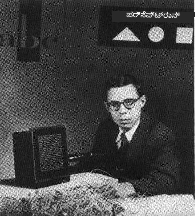
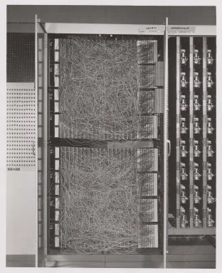
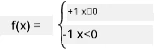

# ನ್ಯೂರಲ್ ನೆಟ್‌ವರ್ಕ್‌ಗಳಿಗೆ ಪರಿಚಯ: ಪರ್ಸೆಪ್ಟ್ರಾನ್

## [ಪೂರ್ವ-ಲೇಕ್ಚರ್ ಕ್ವಿಜ್](https://ff-quizzes.netlify.app/en/ai/quiz/5)

ಆಧುನಿಕ ನ್ಯೂರಲ್ ನೆಟ್‌ವರ್ಕ್‌ಗೆ ಸಮಾನವಾದುದನ್ನು ಅನುಷ್ಠಾನಗೊಳಿಸುವ ಮೊದಲ ಪ್ರಯತ್ನಗಳಲ್ಲಿ ಒಂದನ್ನು 1957 ರಲ್ಲಿ ಕಾರ್ನೆಲ್ ಏರೋನಾಟಿಕಲ್ ಲ್ಯಾಬೊರೇಟರಿಯ ಫ್ರಾಂಕ್ ರೋಸೆನ್‌ಬ್ಲಾಟ್ ಮಾಡಿದ್ದಾರೆ. ಇದನ್ನು "ಮಾರ್ಕ್-1" ಎಂದು ಕರೆಯುವ ಹಾರ್ಡ್‌ವೇರ್ ಅನುಷ್ಠಾನವಾಗಿದ್ದು, ತ್ರಿಭುಜಗಳು, ಚತುರ್ಭುಜಗಳು ಮತ್ತು ವೃತ್ತಗಳಂತಹ ಮೂಲಭೂತ ಜ್ಯಾಮಿತೀಯ ಆಕಾರಗಳನ್ನು ಗುರುತಿಸಲು ವಿನ್ಯಾಸಗೊಳಿಸಲಾಗಿದೆ.

|      |      |
|--------------|-----------|
| | |

> ಚಿತ್ರಗಳು [ವಿಕಿಪೀಡಿಯದಿಂದ](https://en.wikipedia.org/wiki/Perceptron)

ಒಂದು ಇನ್ಪುಟ್ ಚಿತ್ರವನ್ನು 20x20 ಫೋಟೋಸೆಲ್ ಅರೆ ಮೂಲಕ ಪ್ರತಿನಿಧಿಸಲಾಗಿತ್ತು, ಆದ್ದರಿಂದ ನ್ಯೂರಲ್ ನೆಟ್‌ವರ್ಕ್‌ಗೆ 400 ಇನ್ಪುಟ್‌ಗಳು ಮತ್ತು ಒಂದು ದ್ವಿಮೂಲ್ಯ ಔಟ್‌ಪುಟ್ ಇತ್ತು. ಸರಳ ನೆಟ್‌ವರ್ಕ್ ಒಂದು ನ್ಯೂರಾನ್ ಹೊಂದಿತ್ತು, ಇದನ್ನು **ಥ್ರೆಶೋಲ್ಡ್ ಲಾಜಿಕ್ ಯೂನಿಟ್** ಎಂದೂ ಕರೆಯುತ್ತಾರೆ. ನ್ಯೂರಲ್ ನೆಟ್‌ವರ್ಕ್ ತೂಕಗಳು ತರಬೇತಿ ಹಂತದಲ್ಲಿ ಕೈಯಿಂದ ಸರಿಹೊಂದಿಸುವ ಅಗತ್ಯವಿರುವ ಪೊಟೆನ್ಷಿಯೋಮೀಟರ್‌ಗಳಂತೆ ಕಾರ್ಯನಿರ್ವಹಿಸುತ್ತಿದ್ದವು.

> ✅ ಪೊಟೆನ್ಷಿಯೋಮೀಟರ್ ಎಂದರೆ ಬಳಕೆದಾರನು ವಲಯದ ಪ್ರತಿರೋಧವನ್ನು ಸರಿಹೊಂದಿಸಲು ಅನುಮತಿಸುವ ಸಾಧನ.

> ಆ ಸಮಯದಲ್ಲಿ ನ್ಯೂಯಾರ್ಕ್ ಟೈಮ್ಸ್ ಪರ್ಸೆಪ್ಟ್ರಾನ್ ಬಗ್ಗೆ ಬರೆದಿದ್ದು: *ನೇವಿ ನಿರೀಕ್ಷಿಸುವ ಎಲೆಕ್ಟ್ರಾನಿಕ್ ಕಂಪ್ಯೂಟರ್‌ನ ಭ್ರೂಣ, ಅದು ನಡೆಯಲು, ಮಾತನಾಡಲು, ನೋಡಲು, ಬರೆಯಲು, ಸ್ವಯಂ ಪ್ರಜ್ಞೆ ಹೊಂದಲು ಸಾಧ್ಯವಾಗುತ್ತದೆ.*

## ಪರ್ಸೆಪ್ಟ್ರಾನ್ ಮಾದರಿ

ನಮ್ಮ ಮಾದರಿಯಲ್ಲಿ N ವೈಶಿಷ್ಟ್ಯಗಳಿದ್ದರೆ, ಇನ್ಪುಟ್ ವೆಕ್ಟರ್ N ಗಾತ್ರದ ವೆಕ್ಟರ್ ಆಗಿರುತ್ತದೆ. ಪರ್ಸೆಪ್ಟ್ರಾನ್ ಒಂದು **ದ್ವಿಮೂಲ್ಯ ವರ್ಗೀಕರಣ** ಮಾದರಿ, ಅಂದರೆ ಇದು ಇನ್ಪುಟ್ ಡೇಟಾದ ಎರಡು ವರ್ಗಗಳನ್ನು ವಿಭಜಿಸಬಹುದು. ಪ್ರತಿಯೊಂದು ಇನ್ಪುಟ್ ವೆಕ್ಟರ್ x ಗೆ, ನಮ್ಮ ಪರ್ಸೆಪ್ಟ್ರಾನ್ ಔಟ್‌ಪುಟ್ +1 ಅಥವಾ -1 ಆಗಿರುತ್ತದೆ, ವರ್ಗದ ಮೇಲೆ ಅವಲಂಬಿತವಾಗಿರುತ್ತದೆ. ಔಟ್‌ಪುಟ್ ಕೆಳಗಿನ ಸೂತ್ರದಿಂದ ಲೆಕ್ಕಿಸಲಾಗುತ್ತದೆ:

y(x) = f(w<sup>T</sup>x)

ಇಲ್ಲಿ f ಒಂದು ಸ್ಟೆಪ್ ಸಕ್ರಿಯತೆ ಕಾರ್ಯವಾಗಿದೆ

<!-- img src="http://www.sciweavers.org/tex2img.php?eq=f%28x%29%20%3D%20%5Cbegin%7Bcases%7D%0A%20%20%20%20%20%20%20%20%20%2B1%20%26%20x%20%5Cgeq%200%20%5C%5C%0A%20%20%20%20%20%20%20%20%20-1%20%26%20x%20%3C%200%0A%20%20%20%20%20%20%20%5Cend%7Bcases%7D%20%5C%5C%0A&bc=White&fc=Black&im=jpg&fs=12&ff=arev&edit=0" align="center" border="0" alt="f(x) = \begin{cases} +1 & x \geq 0 \\ -1 & x < 0 \end{cases} \\" width="154" height="50" / -->


## ಪರ್ಸೆಪ್ಟ್ರಾನ್ ತರಬೇತಿ

ಪರ್ಸೆಪ್ಟ್ರಾನ್ ತರಬೇತಿಗೆ, ಬಹುಮಾನವಾಗಿ ಸರಿಯಾದ ವರ್ಗೀಕರಣ ನೀಡುವ ತೂಕಗಳ ವೆಕ್ಟರ್ w ಅನ್ನು ಕಂಡುಹಿಡಿಯಬೇಕು, ಅಂದರೆ ಕನಿಷ್ಠ **ದೋಷ** ಹೊಂದಿರಬೇಕು. ಈ ದೋಷ E ಅನ್ನು ಕೆಳಗಿನಂತೆ **ಪರ್ಸೆಪ್ಟ್ರಾನ್ ಮಾನದಂಡ** ಮೂಲಕ ವ್ಯಾಖ್ಯಾನಿಸಲಾಗಿದೆ:

E(w) = -&sum;w<sup>T</sup>x<sub>i</sub>t<sub>i</sub>

ಇಲ್ಲಿ:

* ಮೊತ್ತವು ತಪ್ಪು ವರ್ಗೀಕರಣ ನೀಡುವ ತರಬೇತಿ ಡೇಟಾ ಪಾಯಿಂಟ್‌ಗಳ i ಮೇಲೆ ತೆಗೆದುಕೊಳ್ಳಲಾಗಿದೆ
* x<sub>i</sub> ಇನ್ಪುಟ್ ಡೇಟಾ, ಮತ್ತು t<sub>i</sub> ನೆಗೆಟಿವ್ ಮತ್ತು ಪಾಸಿಟಿವ್ ಉದಾಹರಣೆಗಳಿಗೆ ಕ್ರಮವಾಗಿ -1 ಅಥವಾ +1 ಆಗಿರುತ್ತದೆ.

ಈ ಮಾನದಂಡವನ್ನು ತೂಕಗಳ w ಕಾರ್ಯವಾಗಿ ಪರಿಗಣಿಸಲಾಗುತ್ತದೆ ಮತ್ತು ಅದನ್ನು ಕನಿಷ್ಠಗೊಳಿಸಬೇಕಾಗುತ್ತದೆ. ಸಾಮಾನ್ಯವಾಗಿ, **ಗ್ರೇಡಿಯಂಟ್ ಡಿಸೆಂಟ್** ಎಂಬ ವಿಧಾನವನ್ನು ಬಳಸಲಾಗುತ್ತದೆ, ಇದರಲ್ಲಿ ನಾವು ಪ್ರಾರಂಭಿಕ ತೂಕಗಳು w<sup>(0)</sup> ಇಂದ ಪ್ರಾರಂಭಿಸಿ, ಪ್ರತಿ ಹಂತದಲ್ಲಿ ತೂಕಗಳನ್ನು ಕೆಳಗಿನ ಸೂತ್ರದಂತೆ ನವೀಕರಿಸುತ್ತೇವೆ:

w<sup>(t+1)</sup> = w<sup>(t)</sup> - &eta;&nabla;E(w)

ಇಲ್ಲಿ &eta; ಅನ್ನು **ಕಲಿಕೆ ದರ** ಎಂದು ಕರೆಯುತ್ತಾರೆ ಮತ್ತು &nabla;E(w) E ಯ **ಗ್ರೇಡಿಯಂಟ್** ಅನ್ನು ಸೂಚಿಸುತ್ತದೆ. ಗ್ರೇಡಿಯಂಟ್ ಲೆಕ್ಕಿಸಿದ ನಂತರ, ನಮಗೆ ಸಿಗುತ್ತದೆ:

w<sup>(t+1)</sup> = w<sup>(t)</sup> + &sum;&eta;x<sub>i</sub>t<sub>i</sub>

ಪೈಥಾನ್‌ನಲ್ಲಿ ಆಲ್ಗಾರಿಥಮ್ ಹೀಗೆ ಕಾಣುತ್ತದೆ:

```python
def train(positive_examples, negative_examples, num_iterations = 100, eta = 1):

    weights = [0,0,0] # ತೂಕಗಳನ್ನು ಪ್ರಾರಂಭಿಸಿ (ಸುಮಾರು ಯಾದೃಚ್ಛಿಕವಾಗಿ :)
        
    for i in range(num_iterations):
        pos = random.choice(positive_examples)
        neg = random.choice(negative_examples)

        z = np.dot(pos, weights) # ಪರ್ಸೆಪ್ಟ್ರಾನ್ ಔಟ್‌ಪುಟ್ ಅನ್ನು ಲೆಕ್ಕಹಾಕಿ
        if z < 0: # ಧನಾತ್ಮಕ ಉದಾಹರಣೆಯನ್ನು ನಕಾರಾತ್ಮಕವಾಗಿ ವರ್ಗೀಕರಿಸಲಾಗಿದೆ
            weights = weights + eta*weights.shape

        z  = np.dot(neg, weights)
        if z >= 0: # ನಕಾರಾತ್ಮಕ ಉದಾಹರಣೆಯನ್ನು ಧನಾತ್ಮಕವಾಗಿ ವರ್ಗೀಕರಿಸಲಾಗಿದೆ
            weights = weights - eta*weights.shape

    return weights
```

## ಸಾರಾಂಶ

ಈ ಪಾಠದಲ್ಲಿ, ನೀವು ಪರ್ಸೆಪ್ಟ್ರಾನ್ ಬಗ್ಗೆ ತಿಳಿದುಕೊಂಡಿರಿ, ಇದು ಒಂದು ದ್ವಿಮೂಲ್ಯ ವರ್ಗೀಕರಣ ಮಾದರಿ ಮತ್ತು ತೂಕಗಳ ವೆಕ್ಟರ್ ಬಳಸಿ ಅದನ್ನು ತರಬೇತಿಗೊಳಿಸುವ ವಿಧಾನವನ್ನು ಕಲಿತಿರಿ.

## 🚀 ಸವಾಲು

ನೀವು ನಿಮ್ಮದೇ ಪರ್ಸೆಪ್ಟ್ರಾನ್ ನಿರ್ಮಿಸಲು ಇಚ್ಛಿಸಿದರೆ, [ಮೈಕ್ರೋಸಾಫ್ಟ್ ಲರ್ನ್‌ನಲ್ಲಿ ಈ ಪ್ರಯೋಗಶಾಲೆಯನ್ನು](https://docs.microsoft.com/en-us/azure/machine-learning/component-reference/two-class-averaged-perceptron?WT.mc_id=academic-77998-cacaste) ಪ್ರಯತ್ನಿಸಿ, ಇದು [ಆಜೂರ್ ಎಂಎಲ್ ಡಿಸೈನರ್](https://docs.microsoft.com/en-us/azure/machine-learning/concept-designer?WT.mc_id=academic-77998-cacaste) ಅನ್ನು ಬಳಸುತ್ತದೆ.

## [ಪೋಸ್ಟ್-ಲೇಕ್ಚರ್ ಕ್ವಿಜ್](https://ff-quizzes.netlify.app/en/ai/quiz/6)

## ವಿಮರ್ಶೆ ಮತ್ತು ಸ್ವಯಂ ಅಧ್ಯಯನ

ಪರ್ಸೆಪ್ಟ್ರಾನ್ ಅನ್ನು ಆಟದ ಸಮಸ್ಯೆ ಮತ್ತು ನೈಜ ಜೀವನದ ಸಮಸ್ಯೆಗಳನ್ನು ಹೇಗೆ ಪರಿಹರಿಸಲು ಬಳಸಬಹುದು ಎಂಬುದನ್ನು ನೋಡಲು ಮತ್ತು ಅಧ್ಯಯನ ಮುಂದುವರಿಸಲು - [ಪರ್ಸೆಪ್ಟ್ರಾನ್](Perceptron.ipynb) ನೋಟ್ಬುಕ್‌ಗೆ ಹೋಗಿ.

ಇದೀಗ ಒಂದು ಆಸಕ್ತಿದಾಯಕ [ಪರ್ಸೆಪ್ಟ್ರಾನ್ ಬಗ್ಗೆ ಲೇಖನ](https://towardsdatascience.com/what-is-a-perceptron-basics-of-neural-networks-c4cfea20c590) ಕೂಡ ಇದೆ.

## [ಅಸೈನ್‌ಮೆಂಟ್](lab/README.md)

ಈ ಪಾಠದಲ್ಲಿ, ನಾವು ದ್ವಿಮೂಲ್ಯ ವರ್ಗೀಕರಣ ಕಾರ್ಯಕ್ಕಾಗಿ ಪರ್ಸೆಪ್ಟ್ರಾನ್ ಅನ್ನು ಅನುಷ್ಠಾನಗೊಳಿಸಿದ್ದೇವೆ ಮತ್ತು ಎರಡು ಕೈಯಿಂದ ಬರೆದ ಅಂಕಿಗಳನ್ನು ವರ್ಗೀಕರಿಸಲು ಬಳಸಿದ್ದೇವೆ. ಈ ಪ್ರಯೋಗಶಾಲೆಯಲ್ಲಿ, ನೀವು ಪೂರ್ಣವಾಗಿ ಅಂಕಿ ವರ್ಗೀಕರಣ ಸಮಸ್ಯೆಯನ್ನು ಪರಿಹರಿಸುವಂತೆ ಕೇಳಲಾಗುತ್ತದೆ, ಅಂದರೆ ನೀಡಲಾದ ಚಿತ್ರಕ್ಕೆ ಯಾವ ಅಂಕಿ ಹೆಚ್ಚು ಹೊಂದಿಕೆಯಾಗುತ್ತದೆ ಎಂದು ನಿರ್ಧರಿಸುವುದು.

* [ಸೂಚನೆಗಳು](lab/README.md)
* [ನೋಟ್ಬುಕ್](lab/PerceptronMultiClass.ipynb)

---

<!-- CO-OP TRANSLATOR DISCLAIMER START -->
**ಅಸ್ವೀಕರಣ**:  
ಈ ದಸ್ತಾವೇಜು [Co-op Translator](https://github.com/Azure/co-op-translator) ಎಂಬ AI ಅನುವಾದ ಸೇವೆಯನ್ನು ಬಳಸಿ ಅನುವಾದಿಸಲಾಗಿದೆ. ನಾವು ಶುದ್ಧತೆಯತ್ತ ಪ್ರಯತ್ನಿಸುತ್ತಿದ್ದರೂ, ಸ್ವಯಂಚಾಲಿತ ಅನುವಾದಗಳಲ್ಲಿ ತಪ್ಪುಗಳು ಅಥವಾ ಅಸತ್ಯತೆಗಳು ಇರಬಹುದು ಎಂದು ದಯವಿಟ್ಟು ಗಮನಿಸಿ. ಮೂಲ ಭಾಷೆಯಲ್ಲಿರುವ ಮೂಲ ದಸ್ತಾವೇಜನ್ನು ಅಧಿಕೃತ ಮೂಲವೆಂದು ಪರಿಗಣಿಸಬೇಕು. ಮಹತ್ವದ ಮಾಹಿತಿಗಾಗಿ, ವೃತ್ತಿಪರ ಮಾನವ ಅನುವಾದವನ್ನು ಶಿಫಾರಸು ಮಾಡಲಾಗುತ್ತದೆ. ಈ ಅನುವಾದ ಬಳಕೆಯಿಂದ ಉಂಟಾಗುವ ಯಾವುದೇ ತಪ್ಪು ಅರ್ಥಮಾಡಿಕೊಳ್ಳುವಿಕೆ ಅಥವಾ ತಪ್ಪು ವಿವರಣೆಗಳಿಗೆ ನಾವು ಹೊಣೆಗಾರರಾಗುವುದಿಲ್ಲ.
<!-- CO-OP TRANSLATOR DISCLAIMER END -->