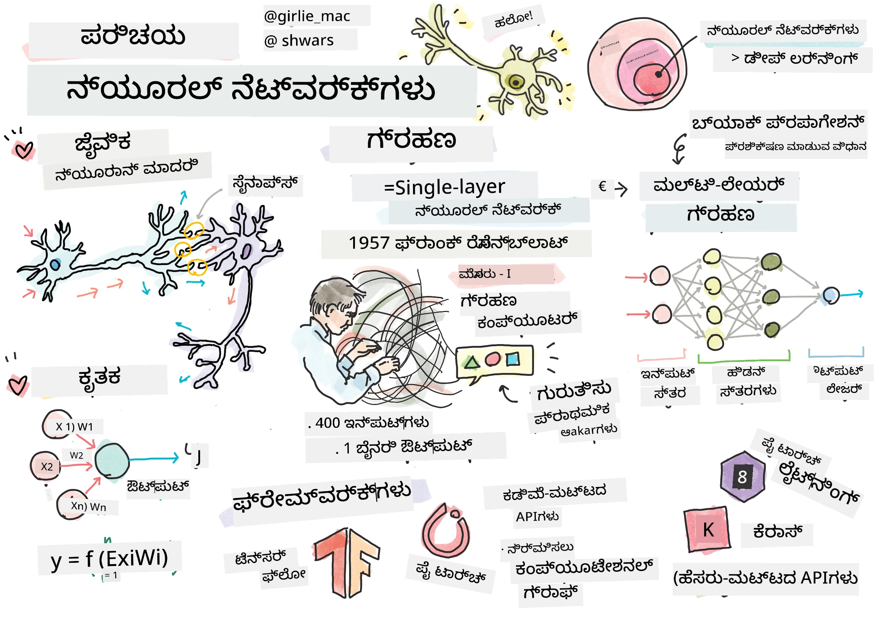
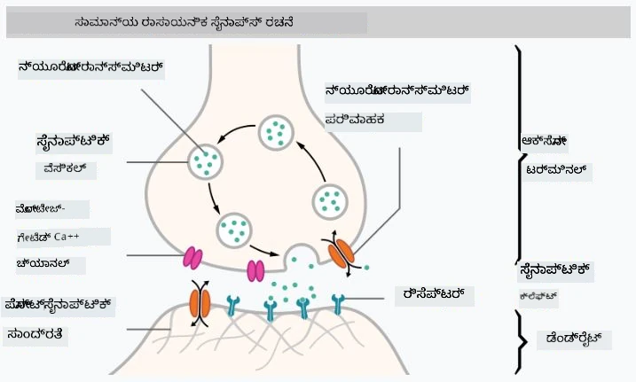
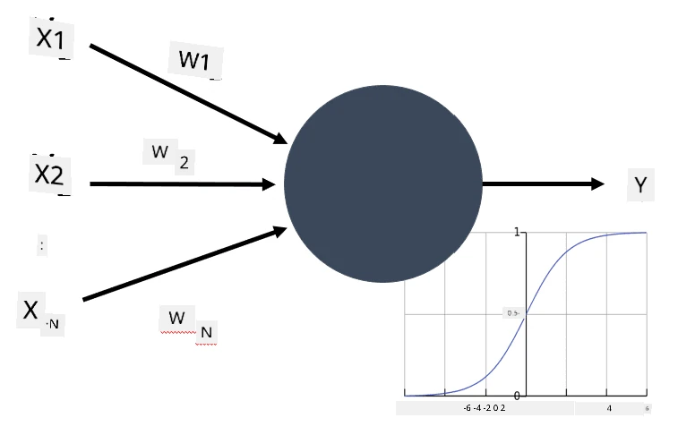

# ನ್ಯೂರಲ್ ನೆಟ್‌ವರ್ಕ್‌ಗಳಿಗೆ ಪರಿಚಯ

ನಾವು ಪರಿಚಯದಲ್ಲಿ ಚರ್ಚಿಸಿದಂತೆ, ಬುದ್ಧಿಮತ್ತೆಯನ್ನು ಸಾಧಿಸುವ ಒಂದು ಮಾರ್ಗವೆಂದರೆ **ಕಂಪ್ಯೂಟರ್ ಮಾದರಿ** ಅಥವಾ **ಕೃತಕ ಮೆದುಳು** ಅನ್ನು ತರಬೇತುಗೊಳಿಸುವುದು. 20ನೇ ಶತಮಾನ ಮಧ್ಯಭಾಗದಿಂದ, ಸಂಶೋಧಕರು ವಿವಿಧ ಗಣಿತ ಮಾದರಿಗಳನ್ನು ಪ್ರಯತ್ನಿಸಿದರು, ಇತ್ತೀಚಿನ ವರ್ಷಗಳಲ್ಲಿ ಈ ದಿಕ್ಕು ಬಹುಮಟ್ಟಿಗೆ ಯಶಸ್ವಿಯಾಗಿದೆ. ಮೆದುಳಿನ ಇಂತಹ ಗಣಿತ ಮಾದರಿಗಳನ್ನು **ನ್ಯೂರಲ್ ನೆಟ್‌ವರ್ಕ್‌ಗಳು** ಎಂದು ಕರೆಯುತ್ತಾರೆ.

> ಕೆಲವೊಮ್ಮೆ ನ್ಯೂರಲ್ ನೆಟ್‌ವರ್ಕ್‌ಗಳನ್ನು *ಕೃತಕ ನ್ಯೂರಲ್ ನೆಟ್‌ವರ್ಕ್‌ಗಳು* ಅಥವಾ ANNs ಎಂದು ಕರೆಯುತ್ತಾರೆ, ಇದರಿಂದ ನಾವು ನ್ಯೂರಾನ್‌ಗಳ ನಿಜವಾದ ಜಾಲಗಳ ಬಗ್ಗೆ ಅಲ್ಲ, ಮಾದರಿಗಳ ಬಗ್ಗೆ ಮಾತನಾಡುತ್ತಿದ್ದೇವೆ ಎಂದು ಸೂಚಿಸಲು.

## ಯಂತ್ರ ಅಧ್ಯಯನ

ನ್ಯೂರಲ್ ನೆಟ್‌ವರ್ಕ್‌ಗಳು **ಯಂತ್ರ ಅಧ್ಯಯನ** ಎಂಬ ದೊಡ್ಡ ಶಾಖೆಯ ಭಾಗವಾಗಿವೆ, ಇದರ ಗುರಿ ಡೇಟಾವನ್ನು ಉಪಯೋಗಿಸಿ ಸಮಸ್ಯೆಗಳನ್ನು ಪರಿಹರಿಸಲು ಸಾಧ್ಯವಾಗುವ ಕಂಪ್ಯೂಟರ್ ಮಾದರಿಗಳನ್ನು ತರಬೇತುಗೊಳಿಸುವುದು. ಯಂತ್ರ ಅಧ್ಯಯನವು ಕೃತಕ ಬುದ್ಧಿಮತ್ತೆಯ ದೊಡ್ಡ ಭಾಗವಾಗಿದೆ, ಆದರೆ ನಾವು ಈ ಪಠ್ಯಕ್ರಮದಲ್ಲಿ ಸಾಂಪ್ರದಾಯಿಕ ಯಂತ್ರ ಅಧ್ಯಯನವನ್ನು ಒಳಗೊಂಡಿಲ್ಲ.

> ಸಾಂಪ್ರದಾಯಿಕ ಯಂತ್ರ ಅಧ್ಯಯನವನ್ನು ತಿಳಿದುಕೊಳ್ಳಲು ನಮ್ಮ ಪ್ರತ್ಯೇಕ **[ಯಂತ್ರ ಅಧ್ಯಯನ ಆರಂಭಿಕರಿಗಾಗಿ](http://github.com/microsoft/ml-for-beginners)** ಪಠ್ಯಕ್ರಮವನ್ನು ಭೇಟಿ ಮಾಡಿ.

ಯಂತ್ರ ಅಧ್ಯಯನದಲ್ಲಿ, ನಮಗೆ ಕೆಲವು ಉದಾಹರಣೆಗಳ ಡೇಟಾಸೆಟ್ **X** ಮತ್ತು ಸಂಬಂಧಿಸಿದ ಔಟ್‌ಪುಟ್ ಮೌಲ್ಯಗಳು **Y** ಇವೆ ಎಂದು ಊಹಿಸಲಾಗುತ್ತದೆ. ಉದಾಹರಣೆಗಳು ಸಾಮಾನ್ಯವಾಗಿ N-ಮಾನದ ವೆಕ್ಟರ್‌ಗಳು ಆಗಿದ್ದು, ಅವು **ಲಕ್ಷಣಗಳು** ಹೊಂದಿರುತ್ತವೆ, ಮತ್ತು ಔಟ್‌ಪುಟ್‌ಗಳನ್ನು **ಲೇಬಲ್‌ಗಳು** ಎಂದು ಕರೆಯುತ್ತಾರೆ.

ನಾವು ಎರಡು ಸಾಮಾನ್ಯ ಯಂತ್ರ ಅಧ್ಯಯನ ಸಮಸ್ಯೆಗಳನ್ನು ಪರಿಗಣಿಸುವೆವು:

* **ವರ್ಗೀಕರಣ**, ಇಲ್ಲಿ ನಮಗೆ ಇನ್‌ಪುಟ್ ವಸ್ತುವನ್ನು ಎರಡು ಅಥವಾ ಹೆಚ್ಚು ವರ್ಗಗಳಲ್ಲಿ ವರ್ಗೀಕರಿಸುವ ಅಗತ್ಯವಿದೆ.
* **ರಿಗ್ರೆಷನ್**, ಇಲ್ಲಿ ನಮಗೆ ಪ್ರತಿ ಇನ್‌ಪುಟ್ ಮಾದರಿಗಾಗಿ ಸಂಖ್ಯಾತ್ಮಕ ಮೌಲ್ಯವನ್ನು ಭವಿಷ್ಯವಾಣಿ ಮಾಡಬೇಕಾಗುತ್ತದೆ.

> ಇನ್‌ಪುಟ್ ಮತ್ತು ಔಟ್‌ಪುಟ್‌ಗಳನ್ನು ಟೆನ್ಸರ್‌ಗಳಾಗಿ ಪ್ರತಿನಿಧಿಸುವಾಗ, ಇನ್‌ಪುಟ್ ಡೇಟಾಸೆಟ್ M×N ಗಾತ್ರದ ಮ್ಯಾಟ್ರಿಕ್ಸ್ ಆಗಿದ್ದು, ಇಲ್ಲಿ M ಮಾದರಿಗಳ ಸಂಖ್ಯೆ ಮತ್ತು N ಲಕ್ಷಣಗಳ ಸಂಖ್ಯೆ. ಔಟ್‌ಪುಟ್ Y ಎಂಬುದು M ಗಾತ್ರದ ವೆಕ್ಟರ್ ಆಗಿದೆ.

ಈ ಪಠ್ಯಕ್ರಮದಲ್ಲಿ, ನಾವು ನ್ಯೂರಲ್ ನೆಟ್‌ವರ್ಕ್ ಮಾದರಿಗಳ ಮೇಲೆ ಮಾತ್ರ ಗಮನಹರಿಸುವೆವು.

## ನ್ಯೂರಾನ್ ಮಾದರಿ

ಜೈವಶಾಸ್ತ್ರದಿಂದ, ನಮ್ಮ ಮೆದುಳು ನ್ಯೂರಲ್ ಸೆಲ್‌ಗಳು (ನ್ಯೂರಾನ್‌ಗಳು) ಹೊಂದಿದೆ ಎಂದು ತಿಳಿದಿದೆ, ಪ್ರತಿಯೊಂದು ನ್ಯೂರಾನ್‌ಗೂ ಹಲವಾರು "ಇನ್‌ಪುಟ್‌ಗಳು" (ಡೆಂಡ್ರೈಟ್‌ಗಳು) ಮತ್ತು ಒಂದು "ಔಟ್‌ಪುಟ್" (ಆಕ್ಸಾನ್) ಇರುತ್ತದೆ. ಡೆಂಡ್ರೈಟ್‌ಗಳು ಮತ್ತು ಆಕ್ಸಾನ್‌ಗಳು ವಿದ್ಯುತ್ ಸಂಕೆತಗಳನ್ನು ಸಾಗಿಸಬಹುದು, ಮತ್ತು ಅವುಗಳ ನಡುವಿನ ಸಂಪರ್ಕಗಳು — ಸೈನಾಪ್ಸ್ ಎಂದು ಕರೆಯಲ್ಪಡುವವು — ವಿವಿಧ ಮಟ್ಟದ ಚಾಲಕತೆಯನ್ನು ತೋರಬಹುದು, ಅವು ನ್ಯೂರೋ ಟ್ರಾನ್ಸ್‌ಮಿಟರ್‌ಗಳ ಮೂಲಕ ನಿಯಂತ್ರಿಸಲ್ಪಡುತ್ತವೆ.

 | 
----|----
ನಿಜವಾದ ನ್ಯೂರಾನ್ *([ಚಿತ್ರ](https://en.wikipedia.org/wiki/Synapse#/media/File:SynapseSchematic_lines.svg) ವಿಕಿಪೀಡಿಯದಿಂದ)* | ಕೃತಕ ನ್ಯೂರಾನ್ *(ಲೇಖಕರ ಚಿತ್ರ)*

ಹೀಗಾಗಿ, ನ್ಯೂರಾನ್‌ನ ಸರಳ ಗಣಿತ ಮಾದರಿಯಲ್ಲಿ ಹಲವಾರು ಇನ್‌ಪುಟ್‌ಗಳು X1, ..., XN ಮತ್ತು ಒಂದು ಔಟ್‌ಪುಟ್ Y, ಮತ್ತು ಸರಣಿಯಾದ ತೂಕಗಳು W1, ..., WN ಇರುತ್ತವೆ. ಔಟ್‌ಪುಟ್ ಅನ್ನು ಹೀಗೆ ಲೆಕ್ಕಹಾಕಲಾಗುತ್ತದೆ:

ಇಲ್ಲಿ f ಎಂಬುದು ಕೆಲವು ರೇಖೀಯವಲ್ಲದ **ಸಕ್ರಿಯ ಕಾರ್ಯ**.

> ನ್ಯೂರಾನ್‌ಗಳ ಪ್ರಾರಂಭಿಕ ಮಾದರಿಗಳನ್ನು 1943 ರಲ್ಲಿ ವಾರನ್ ಮ್ಯಾಕ್ಕಲ್ಲಾಕ್ ಮತ್ತು ವಾಲ್ಟರ್ ಪಿಟ್ಸ್ ರಚಿಸಿದ [A logical calculus of the ideas immanent in nervous activity](https://www.cs.cmu.edu/~./epxing/Class/10715/reading/McCulloch.and.Pitts.pdf) ಎಂಬ ಶ್ರೇಷ್ಟ ಲೇಖನದಲ್ಲಿ ವಿವರಿಸಲಾಗಿದೆ. ಡೊನಾಲ್ಡ್ ಹೆಬ್ ಅವರ "[The Organization of Behavior: A Neuropsychological Theory](https://books.google.com/books?id=VNetYrB8EBoC)" ಪುಸ್ತಕದಲ್ಲಿ ಆ ಜಾಲಗಳನ್ನು ತರಬೇತುಗೊಳಿಸುವ ವಿಧಾನವನ್ನು ಪ್ರಸ್ತಾಪಿಸಿದ್ದಾರೆ.

## ಈ ವಿಭಾಗದಲ್ಲಿ

ಈ ವಿಭಾಗದಲ್ಲಿ ನಾವು ತಿಳಿದುಕೊಳ್ಳಲಿದ್ದೇವೆ:
* [ಪರ್ಸೆಪ್ಟ್ರಾನ್](03-Perceptron/README.md), ಎರಡು ವರ್ಗಗಳ ವರ್ಗೀಕರಣಕ್ಕಾಗಿ ಮೊದಲ ನ್ಯೂರಲ್ ನೆಟ್‌ವರ್ಕ್ ಮಾದರಿಗಳಲ್ಲಿ ಒಂದಾಗಿದೆ
* [ಬಹು-ಮಟ್ಟದ ಜಾಲಗಳು](04-OwnFramework/README.md) ಜೊತೆಗೆ [ನಮ್ಮದೇ ಫ್ರೇಮ್ವರ್ಕ್ ನಿರ್ಮಿಸುವ ವಿಧಾನ](04-OwnFramework/OwnFramework.ipynb) ಎಂಬ ಜೋಡಣೆಯ ನೋಟ್ಬುಕ್
* [ನ್ಯೂರಲ್ ನೆಟ್‌ವರ್ಕ್ ಫ್ರೇಮ್ವರ್ಕ್‌ಗಳು](05-Frameworks/README.md), ಈ ನೋಟ್ಬುಕ್‌ಗಳೊಂದಿಗೆ: [PyTorch](05-Frameworks/IntroPyTorch.ipynb) ಮತ್ತು [Keras/Tensorflow](05-Frameworks/IntroKerasTF.ipynb)
* [ಅತಿರೇಕ ತರಬೇತಿ](../../../../lessons/3-NeuralNetworks/05-Frameworks)

---

<!-- CO-OP TRANSLATOR DISCLAIMER START -->
**ಅಸ್ವೀಕರಣ**:  
ಈ ದಸ್ತಾವೇಜು AI ಅನುವಾದ ಸೇವೆ [Co-op Translator](https://github.com/Azure/co-op-translator) ಬಳಸಿ ಅನುವಾದಿಸಲಾಗಿದೆ. ನಾವು ನಿಖರತೆಯಿಗಾಗಿ ಪ್ರಯತ್ನಿಸುತ್ತಿದ್ದರೂ, ಸ್ವಯಂಚಾಲಿತ ಅನುವಾದಗಳಲ್ಲಿ ದೋಷಗಳು ಅಥವಾ ತಪ್ಪುಗಳು ಇರಬಹುದು ಎಂದು ದಯವಿಟ್ಟು ಗಮನಿಸಿ. ಮೂಲ ಭಾಷೆಯಲ್ಲಿರುವ ಮೂಲ ದಸ್ತಾವೇಜನ್ನು ಅಧಿಕೃತ ಮೂಲವೆಂದು ಪರಿಗಣಿಸಬೇಕು. ಮಹತ್ವದ ಮಾಹಿತಿಗಾಗಿ, ವೃತ್ತಿಪರ ಮಾನವ ಅನುವಾದವನ್ನು ಶಿಫಾರಸು ಮಾಡಲಾಗುತ್ತದೆ. ಈ ಅನುವಾದ ಬಳಕೆಯಿಂದ ಉಂಟಾಗುವ ಯಾವುದೇ ತಪ್ಪು ಅರ್ಥಮಾಡಿಕೊಳ್ಳುವಿಕೆ ಅಥವಾ ತಪ್ಪು ವಿವರಣೆಗಳಿಗೆ ನಾವು ಹೊಣೆಗಾರರಾಗುವುದಿಲ್ಲ.
<!-- CO-OP TRANSLATOR DISCLAIMER END -->