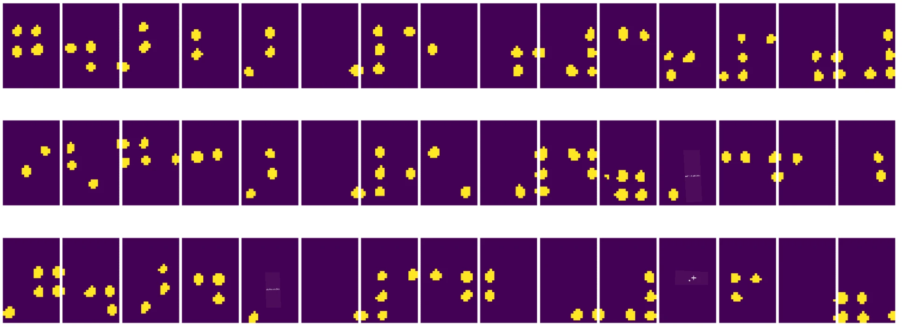
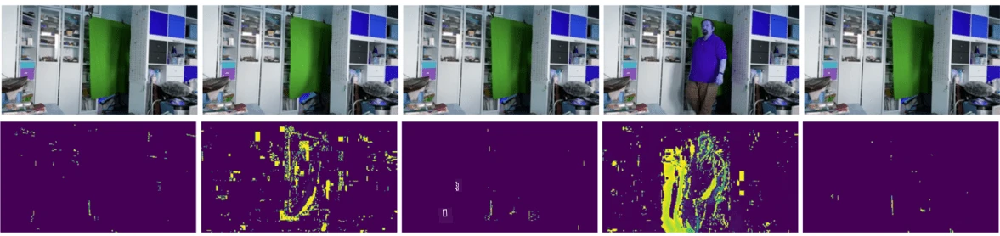

# ಕಂಪ್ಯೂಟರ್ ವೀಕ್ಷಣೆಗೆ ಪರಿಚಯ

[ಕಂಪ್ಯೂಟರ್ ವೀಕ್ಷಣೆ](https://wikipedia.org/wiki/Computer_vision) ಎಂಬುದು ಕಂಪ್ಯೂಟರ್‌ಗಳಿಗೆ ಡಿಜಿಟಲ್ ಚಿತ್ರಗಳ ಉನ್ನತ ಮಟ್ಟದ ಅರ್ಥಮಾಡಿಕೊಳ್ಳುವಿಕೆಯನ್ನು ನೀಡುವ ಉದ್ದೇಶ ಹೊಂದಿರುವ ಶಾಖೆ. ಇದು ತುಂಬಾ ವ್ಯಾಪಕ ವ್ಯಾಖ್ಯಾನ, ಏಕೆಂದರೆ *ಅರ್ಥಮಾಡಿಕೊಳ್ಳುವುದು* ಎಂದರೆ ಹಲವಾರು ಅರ್ಥಗಳನ್ನು ಹೊಂದಬಹುದು, ಉದಾಹರಣೆಗೆ ಚಿತ್ರದಲ್ಲಿ ವಸ್ತುವನ್ನು ಕಂಡುಹಿಡಿಯುವುದು (**ವಸ್ತು ಪತ್ತೆಹಚ್ಚುವುದು**), ಏನಾಗುತ್ತಿದೆ ಎಂಬುದನ್ನು ಅರ್ಥಮಾಡಿಕೊಳ್ಳುವುದು (**ಘಟನೆ ಪತ್ತೆಹಚ್ಚುವುದು**), ಚಿತ್ರವನ್ನು ಪಠ್ಯದಲ್ಲಿ ವರ್ಣಿಸುವುದು, ಅಥವಾ ದೃಶ್ಯವನ್ನು 3D ನಲ್ಲಿ ಪುನರ್ ನಿರ್ಮಿಸುವುದು. ಮಾನವ ಚಿತ್ರಗಳಿಗೆ ಸಂಬಂಧಿಸಿದ ವಿಶೇಷ ಕಾರ್ಯಗಳೂ ಇವೆ: ವಯಸ್ಸು ಮತ್ತು ಭಾವನೆ ಅಂದಾಜು, ಮುಖ ಪತ್ತೆ ಮತ್ತು ಗುರುತಿಸುವಿಕೆ, ಮತ್ತು 3D ಸ್ಥಿತಿ ಅಂದಾಜು, ಇತ್ಯಾದಿ.

## [ಪೂರ್ವ-ವ್ಯಾಖ್ಯಾನ ಪ್ರಶ್ನೋತ್ತರ](https://ff-quizzes.netlify.app/en/ai/quiz/11)

ಕಂಪ್ಯೂಟರ್ ವೀಕ್ಷಣೆಯ ಸರಳ ಕಾರ್ಯಗಳಲ್ಲಿ ಒಂದಾಗಿದೆ **ಚಿತ್ರ ವರ್ಗೀಕರಣ**.

ಕಂಪ್ಯೂಟರ್ ವೀಕ್ಷಣೆಯನ್ನು ಸಾಮಾನ್ಯವಾಗಿ AI ಶಾಖೆಯಾಗಿ ಪರಿಗಣಿಸಲಾಗುತ್ತದೆ. ಇತ್ತೀಚೆಗೆ, ಹೆಚ್ಚಿನ ಕಂಪ್ಯೂಟರ್ ವೀಕ್ಷಣೆ ಕಾರ್ಯಗಳನ್ನು ನ್ಯೂರಲ್ ನೆಟ್‌ವರ್ಕ್‌ಗಳ ಮೂಲಕ ಪರಿಹರಿಸಲಾಗುತ್ತಿದೆ. ನಾವು ಈ ವಿಭಾಗದಲ್ಲಿ ಕಂಪ್ಯೂಟರ್ ವೀಕ್ಷಣೆಗೆ ಬಳಸುವ ವಿಶೇಷ ನ್ಯೂರಲ್ ನೆಟ್‌ವರ್ಕ್ ಪ್ರಕಾರವಾದ [ಕನ್ವಲ್ಯೂಷನಲ್ ನ್ಯೂರಲ್ ನೆಟ್‌ವರ್ಕ್‌ಗಳು](../07-ConvNets/README.md) ಬಗ್ಗೆ ಹೆಚ್ಚು ತಿಳಿಯಲಿದ್ದೇವೆ.

ಆದರೆ, ಚಿತ್ರವನ್ನು ನ್ಯೂರಲ್ ನೆಟ್‌ವರ್ಕ್‌ಗೆ ನೀಡುವ ಮೊದಲು, ಹಲವಾರು ಸಂದರ್ಭಗಳಲ್ಲಿ ಚಿತ್ರವನ್ನು ಸುಧಾರಿಸಲು ಕೆಲವು ಅಲ್ಗಾರಿಥಮಿಕ್ ತಂತ್ರಗಳನ್ನು ಬಳಸುವುದು ಸೂಕ್ತ.

ಚಿತ್ರ ಸಂಸ್ಕರಣೆಗೆ ಹಲವಾರು Python ಗ್ರಂಥಾಲಯಗಳು ಲಭ್ಯವಿವೆ:

* **[imageio](https://imageio.readthedocs.io/en/stable/)** ವಿವಿಧ ಚಿತ್ರ ಫಾರ್ಮ್ಯಾಟ್‌ಗಳನ್ನು ಓದಲು/ಬರೆಯಲು ಬಳಸಬಹುದು. ಇದು ffmpeg ಅನ್ನು ಸಹ ಬೆಂಬಲಿಸುತ್ತದೆ, ಇದು ವಿಡಿಯೋ ಫ್ರೇಮ್‌ಗಳನ್ನು ಚಿತ್ರಗಳಿಗೆ ಪರಿವರ್ತಿಸಲು ಉಪಯುಕ್ತ ಸಾಧನ.
* **[Pillow](https://pillow.readthedocs.io/en/stable/index.html)** (PIL ಎಂದೂ ಕರೆಯಲ್ಪಡುವುದು) ಸ್ವಲ್ಪ ಹೆಚ್ಚು ಶಕ್ತಿಶಾಲಿ, ಮತ್ತು ಚಿತ್ರ ಮಾರುಕಟ್ಟೆ, ಪ್ಯಾಲೆಟ್ ಸರಿಹೊಂದಿಸುವಿಕೆ ಮತ್ತು ಇನ್ನಷ್ಟು ಚಿತ್ರ ಸಂಸ್ಕರಣೆಯನ್ನು ಬೆಂಬಲಿಸುತ್ತದೆ.
* **[OpenCV](https://opencv.org/)** C++ ನಲ್ಲಿ ಬರೆಯಲ್ಪಟ್ಟ ಶಕ್ತಿಶಾಲಿ ಚಿತ್ರ ಸಂಸ್ಕರಣಾ ಗ್ರಂಥಾಲಯ, ಇದು ಚಿತ್ರ ಸಂಸ್ಕರಣೆಗೆ *de facto* ಮಾನದಂಡವಾಗಿದೆ. ಇದಕ್ಕೆ ಅನುಕೂಲಕರ Python ಇಂಟರ್ಫೇಸ್ ಇದೆ.
* **[dlib](http://dlib.net/)** C++ ಗ್ರಂಥಾಲಯವಾಗಿದ್ದು, ಹಲವಾರು ಯಂತ್ರ ಅಧ್ಯಯನ ಅಲ್ಗಾರಿಥಮ್‌ಗಳನ್ನು ಅನುಷ್ಠಾನಗೊಳಿಸುತ್ತದೆ, ಕಂಪ್ಯೂಟರ್ ವೀಕ್ಷಣೆಯ ಕೆಲವು ಅಲ್ಗಾರಿಥಮ್‌ಗಳನ್ನೂ ಒಳಗೊಂಡಂತೆ. ಇದಕ್ಕೂ Python ಇಂಟರ್ಫೇಸ್ ಇದೆ ಮತ್ತು ಮುಖ ಮತ್ತು ಮುಖದ ಲಕ್ಷಣ ಪತ್ತೆಹಚ್ಚುವಂತಹ ಸವಾಲಿನ ಕಾರ್ಯಗಳಿಗೆ ಬಳಸಬಹುದು.

## OpenCV

[OpenCV](https://opencv.org/) ಚಿತ್ರ ಸಂಸ್ಕರಣೆಗೆ *de facto* ಮಾನದಂಡವೆಂದು ಪರಿಗಣಿಸಲಾಗಿದೆ. ಇದು C++ ನಲ್ಲಿ ಅನೇಕ ಉಪಯುಕ್ತ ಅಲ್ಗಾರಿಥಮ್‌ಗಳನ್ನು ಒಳಗೊಂಡಿದೆ. Python ನಿಂದ ಕೂಡ OpenCV ಅನ್ನು ಕರೆಸಬಹುದು.

OpenCV ಕಲಿಯಲು ಉತ್ತಮ ಸ್ಥಳ [ಈ Learn OpenCV ಕೋರ್ಸ್](https://learnopencv.com/getting-started-with-opencv/) ಆಗಿದೆ. ನಮ್ಮ ಪಠ್ಯಕ್ರಮದಲ್ಲಿ, OpenCV ಕಲಿಯುವುದು ಗುರಿಯಲ್ಲ, ಆದರೆ ಅದನ್ನು ಯಾವಾಗ ಮತ್ತು ಹೇಗೆ ಬಳಸಬಹುದು ಎಂಬುದರ ಉದಾಹರಣೆಗಳನ್ನು ತೋರಿಸುವುದು ಗುರಿಯಾಗಿದೆ.

### ಚಿತ್ರಗಳನ್ನು ಲೋಡ್ ಮಾಡುವುದು

Python ನಲ್ಲಿ ಚಿತ್ರಗಳನ್ನು ಸುಲಭವಾಗಿ NumPy ಅರೆಗಳ ಮೂಲಕ ಪ್ರತಿನಿಧಿಸಬಹುದು. ಉದಾಹರಣೆಗೆ, 320x200 ಪಿಕ್ಸೆಲ್ ಗಾತ್ರದ ಗ್ರೇಸ್ಕೇಲ್ ಚಿತ್ರವನ್ನು 200x320 ಅರೆಗಳಲ್ಲಿ ಸಂಗ್ರಹಿಸಲಾಗುತ್ತದೆ, ಮತ್ತು ಅದೇ ಗಾತ್ರದ ಬಣ್ಣದ ಚಿತ್ರವು 200x320x3 (3 ಬಣ್ಣ ಚಾನೆಲ್‌ಗಳಿಗಾಗಿ) ಆಕಾರ ಹೊಂದಿರುತ್ತದೆ. ಚಿತ್ರವನ್ನು ಲೋಡ್ ಮಾಡಲು, ಕೆಳಗಿನ ಕೋಡ್ ಬಳಸಬಹುದು:

```python
import cv2
import matplotlib.pyplot as plt

im = cv2.imread('image.jpeg')
plt.imshow(im)
```

ಸಾಂಪ್ರದಾಯಿಕವಾಗಿ, OpenCV ಬಣ್ಣದ ಚಿತ್ರಗಳಿಗೆ BGR (ನೀಲಿ-ಹಸಿರು-ಕೆಂಪು) ಎನ್‌ಕೋಡಿಂಗ್ ಬಳಸುತ್ತದೆ, Python ಇತರೆ ಸಾಧನಗಳು ಹೆಚ್ಚು ಸಾಂಪ್ರದಾಯಿಕ RGB (ಕೆಂಪು-ಹಸಿರು-ನೀಲಿ) ಬಳಸುತ್ತವೆ. ಚಿತ್ರ ಸರಿಯಾಗಿ ಕಾಣಲು, ಅದನ್ನು RGB ಬಣ್ಣ ಸ್ಥಳಕ್ಕೆ ಪರಿವರ್ತಿಸಬೇಕು, ಅಥವಾ NumPy ಅರೆಗಳಲ್ಲಿ ಆಯಾಮಗಳನ್ನು ಬದಲಾಯಿಸುವ ಮೂಲಕ, ಅಥವಾ OpenCV ಫಂಕ್ಷನ್ ಅನ್ನು ಕರೆಸುವ ಮೂಲಕ:

```python
im = cv2.cvtColor(im,cv2.COLOR_BGR2RGB)
```

ಅದೇ `cvtColor` ಫಂಕ್ಷನ್ ಅನ್ನು ಚಿತ್ರವನ್ನು ಗ್ರೇಸ್ಕೇಲ್ ಅಥವಾ HSV (ಹ್ಯೂ-ಸ್ಯಾಚುರೇಶನ್-ವ್ಯಾಲ್ಯೂ) ಬಣ್ಣ ಸ್ಥಳಕ್ಕೆ ಪರಿವರ್ತಿಸಲು ಬಳಸಬಹುದು.

OpenCV ಬಳಸಿ ವಿಡಿಯೋವನ್ನು ಫ್ರೇಮ್-ಬೈ-ಫ್ರೇಮ್ ಲೋಡ್ ಮಾಡಬಹುದು - ಉದಾಹರಣೆ [OpenCV Notebook](OpenCV.ipynb) ವ್ಯಾಯಾಮದಲ್ಲಿ ನೀಡಲಾಗಿದೆ.

### ಚಿತ್ರ ಸಂಸ್ಕರಣೆ

ಚಿತ್ರವನ್ನು ನ್ಯೂರಲ್ ನೆಟ್‌ವರ್ಕ್‌ಗೆ ನೀಡುವ ಮೊದಲು, ನೀವು ಕೆಲವು ಪೂರ್ವ-ಸಂಸ್ಕರಣಾ ಹಂತಗಳನ್ನು ಅನ್ವಯಿಸಬಹುದು. OpenCV ಹಲವಾರು ಕಾರ್ಯಗಳನ್ನು ಮಾಡಬಹುದು, ಉದಾಹರಣೆಗೆ:

* `im = cv2.resize(im, (320,200),interpolation=cv2.INTER_LANCZOS)` ಬಳಸಿ ಚಿತ್ರವನ್ನು **ಮರುಗಾತ್ರಗೊಳಿಸುವುದು**
* `im = cv2.medianBlur(im,3)` ಅಥವಾ `im = cv2.GaussianBlur(im, (3,3), 0)` ಬಳಸಿ ಚಿತ್ರವನ್ನು **ಬ್ಲರ್ ಮಾಡುವುದು**
* ಚಿತ್ರದ **ಬ್ರೈಟ್ನೆಸ್ ಮತ್ತು ಕಾಂಟ್ರಾಸ್ಟ್** ಅನ್ನು NumPy ಅರೆ ಮ್ಯಾನಿಪ್ಯುಲೇಶನ್ ಮೂಲಕ ಬದಲಾಯಿಸಬಹುದು, [ಈ Stackoverflow ಟಿಪ್ಪಣಿಯಲ್ಲಿ](https://stackoverflow.com/questions/39308030/how-do-i-increase-the-contrast-of-an-image-in-python-opencv) ವಿವರಿಸಲಾಗಿದೆ.
* `cv2.threshold`/`cv2.adaptiveThreshold` ಫಂಕ್ಷನ್‌ಗಳನ್ನು ಕರೆಸಿ [ಥ್ರೆಶೋಲ್ಡಿಂಗ್](https://docs.opencv.org/4.x/d7/d4d/tutorial_py_thresholding.html) ಬಳಸಬಹುದು, ಇದು ಬ್ರೈಟ್ನೆಸ್ ಅಥವಾ ಕಾಂಟ್ರಾಸ್ಟ್ ಸರಿಹೊಂದಿಸುವುದಕ್ಕಿಂತ ಹೆಚ್ಚು ಪ್ರಾಮುಖ್ಯತೆ ಹೊಂದಿದೆ.
* ಚಿತ್ರಕ್ಕೆ ವಿವಿಧ [ಪರಿವರ್ತನೆಗಳನ್ನು](https://docs.opencv.org/4.5.5/da/d6e/tutorial_py_geometric_transformations.html) ಅನ್ವಯಿಸಬಹುದು:
    - **[ಅಫೈನ್ ಪರಿವರ್ತನೆಗಳು](https://docs.opencv.org/4.5.5/d4/d61/tutorial_warp_affine.html)** ಚಿತ್ರದಲ್ಲಿ ತಿರುಗಿಸುವಿಕೆ, ಮರುಗಾತ್ರಗೊಳಿಸುವಿಕೆ ಮತ್ತು ಸ್ಕ್ಯೂಯಿಂಗ್ ಅನ್ನು ಸಂಯೋಜಿಸಲು ಮತ್ತು ಚಿತ್ರದಲ್ಲಿ ಮೂರು ಬಿಂದುಗಳ ಮೂಲ ಮತ್ತು ಗಮ್ಯಸ್ಥಾನವನ್ನು ತಿಳಿದಿದ್ದರೆ ಉಪಯುಕ್ತ. ಅಫೈನ್ ಪರಿವರ್ತನೆಗಳು ಸಮಾಂತರ ರೇಖೆಗಳನ್ನು ಸಮಾಂತರವಾಗಿರಿಸುತ್ತವೆ.
    - **[ಪರ್ಸ್ಪೆಕ್ಟಿವ್ ಪರಿವರ್ತನೆಗಳು](https://medium.com/analytics-vidhya/opencv-perspective-transformation-9edffefb2143)** ಚಿತ್ರದಲ್ಲಿ ನಾಲ್ಕು ಬಿಂದುಗಳ ಮೂಲ ಮತ್ತು ಗಮ್ಯಸ್ಥಾನವನ್ನು ತಿಳಿದಿದ್ದರೆ ಉಪಯುಕ್ತ. ಉದಾಹರಣೆಗೆ, ಸ್ಮಾರ್ಟ್‌ಫೋನ್ ಕ್ಯಾಮೆರಾ ಮೂಲಕ ಕೆಲವು ಕೋನದಿಂದ ಆಯತಾಕಾರದ ಡಾಕ್ಯುಮೆಂಟ್‌ನ ಚಿತ್ರ ತೆಗೆದುಕೊಂಡಾಗ, ಡಾಕ್ಯುಮೆಂಟ್‌ನ ಆಯತಾಕಾರದ ಚಿತ್ರವನ್ನು ಮಾಡಲು.
* ಚಿತ್ರದಲ್ಲಿ ಚಲನವಲನವನ್ನು ಅರ್ಥಮಾಡಿಕೊಳ್ಳಲು **[ಆಪ್ಟಿಕಲ್ ಫ್ಲೋ](https://docs.opencv.org/4.5.5/d4/dee/tutorial_optical_flow.html)** ಬಳಸಿ.

## ಕಂಪ್ಯೂಟರ್ ವೀಕ್ಷಣೆಯ ಬಳಕೆಯ ಉದಾಹರಣೆಗಳು

ನಮ್ಮ [OpenCV Notebook](OpenCV.ipynb) ನಲ್ಲಿ, ಕಂಪ್ಯೂಟರ್ ವೀಕ್ಷಣೆಯನ್ನು ನಿರ್ದಿಷ್ಟ ಕಾರ್ಯಗಳನ್ನು ಮಾಡಲು ಬಳಸಬಹುದಾದ ಕೆಲವು ಉದಾಹರಣೆಗಳನ್ನು ನೀಡಿದ್ದೇವೆ:

* **ಬ್ರೈಲ್ ಪುಸ್ತಕದ ಫೋಟೋವನ್ನು ಪೂರ್ವ-ಸಂಸ್ಕರಿಸುವುದು**. ನಾವು ಥ್ರೆಶೋಲ್ಡಿಂಗ್, ವೈಶಿಷ್ಟ್ಯ ಪತ್ತೆ, ಪರ್ಸ್ಪೆಕ್ಟಿವ್ ಪರಿವರ್ತನೆ ಮತ್ತು NumPy ಮ್ಯಾನಿಪ್ಯುಲೇಶನ್‌ಗಳನ್ನು ಬಳಸಿಕೊಂಡು ಪ್ರತ್ಯೇಕ ಬ್ರೈಲ್ ಚಿಹ್ನೆಗಳನ್ನು neural network ಮೂಲಕ ವರ್ಗೀಕರಿಸಲು ಹೇಗೆ ಪ್ರಕ್ರಿಯೆ ಮಾಡಬಹುದು ಎಂಬುದರ ಮೇಲೆ ಗಮನಹರಿಸುತ್ತೇವೆ.

 |  | 
----|-----|-----

> ಚಿತ್ರ [OpenCV.ipynb](OpenCV.ipynb) ನಿಂದ

* **ವೀಡಿಯೋದಲ್ಲಿ ಚಲನವಲನ ಪತ್ತೆಹಚ್ಚುವುದು ಫ್ರೇಮ್ ವ್ಯತ್ಯಾಸ ಬಳಸಿ**. ಕ್ಯಾಮೆರಾ ಸ್ಥಿರವಾಗಿದ್ದರೆ, ಕ್ಯಾಮೆರಾ ಫೀಡ್‌ನ ಫ್ರೇಮ್‌ಗಳು ಪರಸ್ಪರ ಬಹಳ ಸಮಾನವಾಗಿರುತ್ತವೆ. ಫ್ರೇಮ್‌ಗಳು ಅರೆಗಳಾಗಿ ಪ್ರತಿನಿಧಿಸಲ್ಪಟ್ಟಿರುವುದರಿಂದ, ಎರಡು ಕ್ರಮಬದ್ಧ ಫ್ರೇಮ್‌ಗಳ ಅರೆಗಳನ್ನು ವಜಾ ಮಾಡಿದರೆ ಪಿಕ್ಸೆಲ್ ವ್ಯತ್ಯಾಸ ಸಿಗುತ್ತದೆ, ಇದು ಸ್ಥಿರ ಫ್ರೇಮ್‌ಗಳಿಗೆ ಕಡಿಮೆ ಮತ್ತು ಚಲನೆಯಾಗಿರುವ ಚಿತ್ರಗಳಿಗೆ ಹೆಚ್ಚು ಆಗುತ್ತದೆ.



> ಚಿತ್ರ [OpenCV.ipynb](OpenCV.ipynb) ನಿಂದ

* **ಆಪ್ಟಿಕಲ್ ಫ್ಲೋ ಬಳಸಿ ಚಲನವಲನ ಪತ್ತೆಹಚ್ಚುವುದು**. [ಆಪ್ಟಿಕಲ್ ಫ್ಲೋ](https://docs.opencv.org/3.4/d4/dee/tutorial_optical_flow.html) ನಮಗೆ ವೀಡಿಯೋ ಫ್ರೇಮ್‌ಗಳಲ್ಲಿನ ಪ್ರತಿ ಪಿಕ್ಸೆಲ್ ಹೇಗೆ ಚಲಿಸುತ್ತಿದೆ ಎಂಬುದನ್ನು ಅರ್ಥಮಾಡಿಕೊಳ್ಳಲು ಸಹಾಯ ಮಾಡುತ್ತದೆ. ಆಪ್ಟಿಕಲ್ ಫ್ಲೋ ಎರಡು ವಿಧಗಳಿವೆ:

   - **Dense Optical Flow** ಪ್ರತಿ ಪಿಕ್ಸೆಲ್ ಯಾವ ಕಡೆಗೆ ಚಲಿಸುತ್ತಿದೆ ಎಂಬುದನ್ನು ತೋರಿಸುವ ವೆಕ್ಟರ್ ಕ್ಷೇತ್ರವನ್ನು ಲೆಕ್ಕಹಾಕುತ್ತದೆ
   - **Sparse Optical Flow** ಚಿತ್ರದಲ್ಲಿ ಕೆಲವು ವಿಶಿಷ್ಟ ಲಕ್ಷಣಗಳನ್ನು (ಉದಾ: ಅಂಚುಗಳು) ತೆಗೆದು, ಅವುಗಳ ಪಥವನ್ನು ಫ್ರೇಮ್‌ಗಳಿಂದ ಫ್ರೇಮ್‌ಗೆ ನಿರ್ಮಿಸುತ್ತದೆ.


> ಚಿತ್ರ [OpenCV.ipynb](OpenCV.ipynb) ನಿಂದ

## ✍️ ಉದಾಹರಣೆ ನೋಟ್ಬುಕ್‌ಗಳು: OpenCV [OpenCV ಅನ್ನು ಕ್ರಿಯೆಯಲ್ಲಿ ಪ್ರಯತ್ನಿಸಿ](OpenCV.ipynb)

[OpenCV Notebook](OpenCV.ipynb) ಅನ್ನು ಅನ್ವೇಷಿಸಿ OpenCV ಜೊತೆ ಕೆಲವು ಪ್ರಯೋಗಗಳನ್ನು ಮಾಡೋಣ

## ಸಮಾರೋಪ

ಕೆಲವೊಮ್ಮೆ, ಚಲನವಲನ ಪತ್ತೆ ಅಥವಾ ಬೆರಳು ಮುಚ್ಚು ಪತ್ತೆಹಚ್ಚುವಂತಹ ಸಾಪೇಕ್ಷವಾಗಿ ಸಂಕೀರ್ಣ ಕಾರ್ಯಗಳನ್ನು ಸಂಪೂರ್ಣವಾಗಿ ಕಂಪ್ಯೂಟರ್ ವೀಕ್ಷಣೆಯಿಂದ ಪರಿಹರಿಸಬಹುದು. ಆದ್ದರಿಂದ, ಕಂಪ್ಯೂಟರ್ ವೀಕ್ಷಣೆಯ ಮೂಲ ತಂತ್ರಗಳನ್ನು ಮತ್ತು OpenCV ಮುಂತಾದ ಗ್ರಂಥಾಲಯಗಳು ಏನು ಮಾಡಬಹುದು ಎಂಬುದನ್ನು ತಿಳಿದುಕೊಳ್ಳುವುದು ಬಹಳ ಸಹಾಯಕ.

## 🚀 ಸವಾಲು

AI ಶೋದಿಂದ [ಈ ವೀಡಿಯೋವನ್ನು](https://docs.microsoft.com/shows/ai-show/ai-show--2021-opencv-ai-competition--grand-prize-winners--cortic-tigers--episode-32?WT.mc_id=academic-77998-cacaste) ನೋಡಿ Cortic Tigers ಯೋಜನೆಯ ಬಗ್ಗೆ ತಿಳಿದುಕೊಳ್ಳಿ ಮತ್ತು ಅವರು ರೋಬೋಟ್ ಮೂಲಕ ಕಂಪ್ಯೂಟರ್ ವೀಕ್ಷಣೆ ಕಾರ್ಯಗಳನ್ನು ಜನಸಾಮಾನ್ಯರಿಗೆ ತಲುಪಿಸುವ ಬ್ಲಾಕ್ ಆಧಾರಿತ ಪರಿಹಾರವನ್ನು ಹೇಗೆ ನಿರ್ಮಿಸಿದ್ದಾರೆ ಎಂಬುದನ್ನು ತಿಳಿದುಕೊಳ್ಳಿ. ಈ ಕ್ಷೇತ್ರಕ್ಕೆ ಹೊಸ ಕಲಿಯುವವರನ್ನು ಸೇರಿಸಲು ಸಹಾಯ ಮಾಡುವ ಇತರ ಯೋಜನೆಗಳ ಬಗ್ಗೆ ಸಂಶೋಧನೆ ಮಾಡಿ.

## [ಪೋಸ್ಟ್-ವ್ಯಾಖ್ಯಾನ ಪ್ರಶ್ನೋತ್ತರ](https://ff-quizzes.netlify.app/en/ai/quiz/12)

## ವಿಮರ್ಶೆ ಮತ್ತು ಸ್ವಯಂ ಅಧ್ಯಯನ

ಆಪ್ಟಿಕಲ್ ಫ್ಲೋ ಬಗ್ಗೆ ಇನ್ನಷ್ಟು ಓದಿ [ಈ ಅದ್ಭುತ ಟ್ಯುಟೋರಿಯಲ್‌ನಲ್ಲಿ](https://learnopencv.com/optical-flow-in-opencv/).

## [ಅಸೈನ್‌ಮೆಂಟ್](lab/README.md)

ಈ ಪ್ರಯೋಗಶಾಲೆಯಲ್ಲಿ, ನೀವು ಸರಳ ಸಂಕೆತಗಳೊಂದಿಗೆ ಒಂದು ವೀಡಿಯೋ ತೆಗೆದುಕೊಳ್ಳುತ್ತೀರಿ, ಮತ್ತು ನಿಮ್ಮ ಗುರಿ ಆಪ್ಟಿಕಲ್ ಫ್ಲೋ ಬಳಸಿ ಮೇಲಕ್ಕೆ/ಕೆಳಗೆ/ಎಡಕ್ಕೆ/ಬಲಕ್ಕೆ ಚಲನೆಗಳನ್ನು ಹೊರತೆಗೆಯುವುದು.


---

<!-- CO-OP TRANSLATOR DISCLAIMER START -->
**ಅಸ್ವೀಕರಣ**:  
ಈ ದಸ್ತಾವೇಜು AI ಅನುವಾದ ಸೇವೆ [Co-op Translator](https://github.com/Azure/co-op-translator) ಬಳಸಿ ಅನುವಾದಿಸಲಾಗಿದೆ. ನಾವು ನಿಖರತೆಯಿಗಾಗಿ ಪ್ರಯತ್ನಿಸುತ್ತಿದ್ದರೂ, ಸ್ವಯಂಚಾಲಿತ ಅನುವಾದಗಳಲ್ಲಿ ದೋಷಗಳು ಅಥವಾ ಅಸತ್ಯತೆಗಳು ಇರಬಹುದು ಎಂದು ದಯವಿಟ್ಟು ಗಮನಿಸಿ. ಮೂಲ ಭಾಷೆಯಲ್ಲಿರುವ ಮೂಲ ದಸ್ತಾವೇಜನ್ನು ಅಧಿಕೃತ ಮೂಲವೆಂದು ಪರಿಗಣಿಸಬೇಕು. ಮಹತ್ವದ ಮಾಹಿತಿಗಾಗಿ, ವೃತ್ತಿಪರ ಮಾನವ ಅನುವಾದವನ್ನು ಶಿಫಾರಸು ಮಾಡಲಾಗುತ್ತದೆ. ಈ ಅನುವಾದ ಬಳಕೆಯಿಂದ ಉಂಟಾಗುವ ಯಾವುದೇ ತಪ್ಪು ಅರ್ಥಮಾಡಿಕೊಳ್ಳುವಿಕೆ ಅಥವಾ ತಪ್ಪು ವಿವರಣೆಗಳಿಗೆ ನಾವು ಹೊಣೆಗಾರರಾಗುವುದಿಲ್ಲ.
<!-- CO-OP TRANSLATOR DISCLAIMER END -->