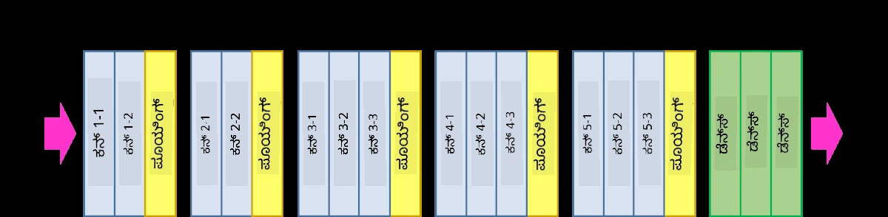
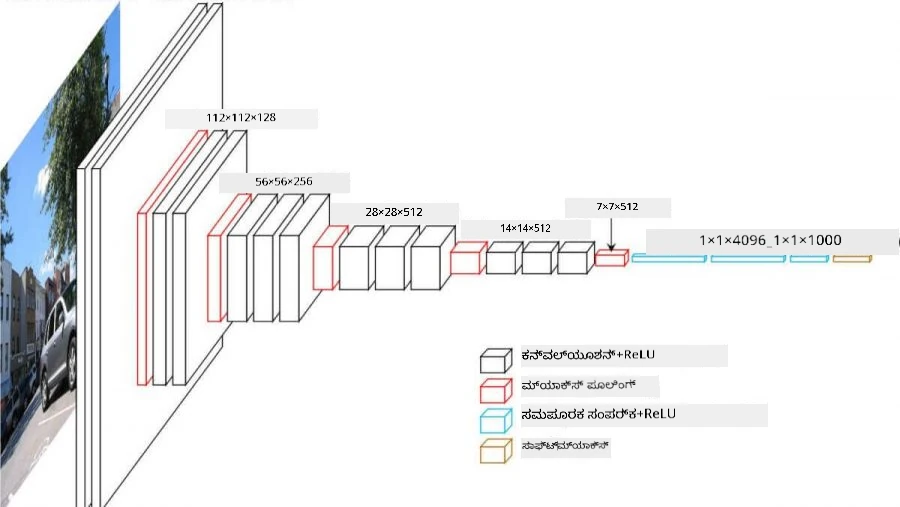
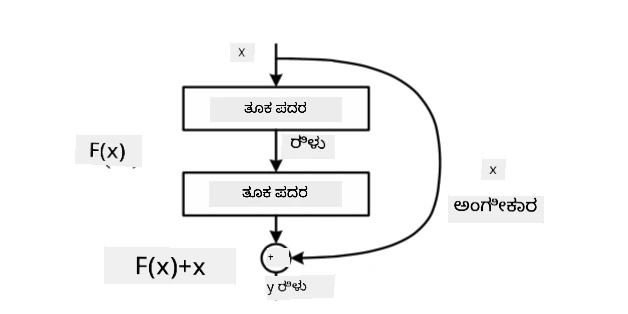
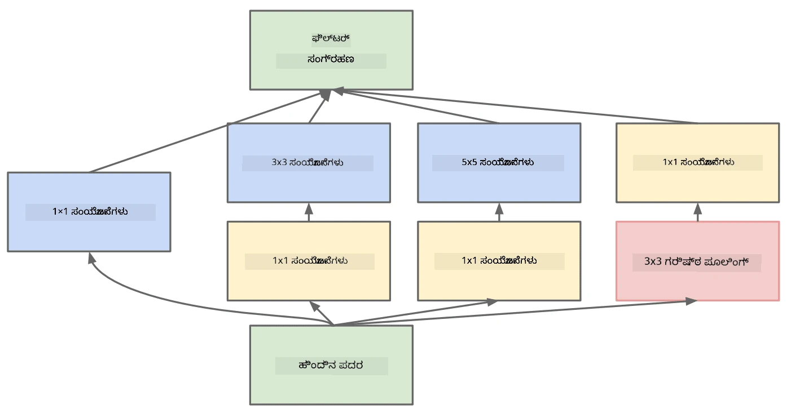

# ಪ್ರಸಿದ್ಧ CNN ವಾಸ್ತುಶಿಲ್ಪಗಳು

### VGG-16

VGG-16 2014 ರಲ್ಲಿ ImageNet ಟಾಪ್-5 ವರ್ಗೀಕರಣದಲ್ಲಿ 92.7% ನಿಖರತೆಯನ್ನು ಸಾಧಿಸಿದ ನೆಟ್‌ವರ್ಕ್ ಆಗಿದೆ. ಇದರ ಲೇಯರ್ ರಚನೆ ಹೀಗಿದೆ:

ನೀವು ನೋಡಬಹುದು, VGG ಪರಂಪರাগত ಪಿರಮಿಡ್ ವಾಸ್ತುಶಿಲ್ಪವನ್ನು ಅನುಸರಿಸುತ್ತದೆ, ಇದು ಸಂಯೋಜನೆ-ಪೂಲಿಂಗ್ ಲೇಯರ್‌ಗಳ ಸರಣಿಯಾಗಿದೆ.

> ಚಿತ್ರ [Researchgate](https://www.researchgate.net/figure/Vgg16-model-structure-To-get-the-VGG-NIN-model-we-replace-the-2-nd-4-th-6-th-7-th_fig2_335194493) ನಿಂದ

### ResNet

ResNet 2015 ರಲ್ಲಿ Microsoft Research ಪ್ರಸ್ತಾಪಿಸಿದ ಮಾದರಿಗಳ ಕುಟುಂಬವಾಗಿದೆ. ResNet ನ ಮುಖ್ಯ ಆಲೋಚನೆ **residual blocks** ಬಳಕೆ:

> ಚಿತ್ರ [ಈ ಪೇಪರ್](https://arxiv.org/pdf/1512.03385.pdf) ನಿಂದ

ಐಡೆಂಟಿಟಿ ಪಾಸ್-ತ್ರೂ ಬಳಕೆಯ ಕಾರಣವೆಂದರೆ ನಮ್ಮ ಲೇಯರ್ ಹಿಂದಿನ ಲೇಯರ್ ಫಲಿತಾಂಶ ಮತ್ತು ರೆಸಿಡ್ಯುಯಲ್ ಬ್ಲಾಕ್ ಔಟ್‌ಪುಟ್ ನಡುವಿನ **ಭೇದವನ್ನು** ಭವಿಷ್ಯವಾಣಿ ಮಾಡಬೇಕು - ಆದ್ದರಿಂದ *residual* ಎಂಬ ಹೆಸರು. ಆ ಬ್ಲಾಕ್‌ಗಳನ್ನು ತರಬೇತುಗೊಳಿಸುವುದು ಸುಲಭ, ಮತ್ತು ನೂರಾರು ಬ್ಲಾಕ್‌ಗಳೊಂದಿಗೆ ನೆಟ್‌ವರ್ಕ್‌ಗಳನ್ನು ರಚಿಸಬಹುದು (ಸಾಮಾನ್ಯ ರೂಪಾಂತರಗಳು ResNet-52, ResNet-101 ಮತ್ತು ResNet-152).

ನೀವು ಈ ನೆಟ್‌ವರ್ಕ್ ಅನ್ನು ಡೇಟಾಸೆಟ್‌ಗೆ ತಕ್ಕಂತೆ ತನ್ನ ಸಂಕೀರ್ಣತೆಯನ್ನು ಹೊಂದಿಕೊಳ್ಳುವಂತೆ ಭಾವಿಸಬಹುದು. ಆರಂಭದಲ್ಲಿ, ತರಬೇತಿ ಪ್ರಾರಂಭಿಸಿದಾಗ, ತೂಕಗಳ ಮೌಲ್ಯಗಳು ಸಣ್ಣವಾಗಿರುತ್ತವೆ ಮತ್ತು ಹೆಚ್ಚಿನ ಸಿಗ್ನಲ್ ಐಡೆಂಟಿಟಿ ಲೇಯರ್‌ಗಳ ಮೂಲಕ ಹೋಗುತ್ತದೆ. ತರಬೇತಿ ಮುಂದುವರಿದಂತೆ ತೂಕಗಳು ಹೆಚ್ಚಾಗುತ್ತವೆ, ನೆಟ್‌ವರ್ಕ್ ಪ್ಯಾರಾಮೀಟರ್‌ಗಳ ಮಹತ್ವ ಹೆಚ್ಚುತ್ತದೆ ಮತ್ತು ಸರಿಯಾದ ವರ್ಗೀಕರಣಕ್ಕಾಗಿ ಅಗತ್ಯವಾದ ವ್ಯಕ್ತಪಡಿಸುವ ಶಕ್ತಿಯನ್ನು ಹೊಂದಿಕೊಳ್ಳುತ್ತದೆ.

### Google Inception

Google Inception ವಾಸ್ತುಶಿಲ್ಪ ಈ ಆಲೋಚನೆಯನ್ನು ಇನ್ನೊಂದು ಹಂತಕ್ಕೆ ತೆಗೆದುಕೊಂಡು ಹೋಗುತ್ತದೆ ಮತ್ತು ಪ್ರತಿ ನೆಟ್‌ವರ್ಕ್ ಲೇಯರ್ ಅನ್ನು ಹಲವು ವಿಭಿನ್ನ ಮಾರ್ಗಗಳ ಸಂಯೋಜನೆಯಾಗಿ ನಿರ್ಮಿಸುತ್ತದೆ:

> ಚಿತ್ರ [Researchgate](https://www.researchgate.net/figure/Inception-module-with-dimension-reductions-left-and-schema-for-Inception-ResNet-v1_fig2_355547454) ನಿಂದ

ಇಲ್ಲಿ, 1x1 ಸಂಯೋಜನೆಗಳ ಪಾತ್ರವನ್ನು ವಿಶೇಷವಾಗಿ ಗಮನಿಸಬೇಕು, ಏಕೆಂದರೆ ಮೊದಲಿಗೆ ಅವು ಅರ್ಥವಾಗುವುದಿಲ್ಲ. 1x1 ಫಿಲ್ಟರ್ ಮೂಲಕ ಚಿತ್ರವನ್ನು ಸಂಸ್ಕರಿಸುವುದು ಏಕೆ ಬೇಕು? ಆದರೆ, ಸಂಯೋಜನೆ ಫಿಲ್ಟರ್‌ಗಳು ಹಲವಾರು ಆಳ ಚಾನೆಲ್‌ಗಳೊಂದಿಗೆ ಕೆಲಸ ಮಾಡುತ್ತವೆ (ಮೂಲತಃ - RGB ಬಣ್ಣಗಳು, ನಂತರದ ಲೇಯರ್‌ಗಳಲ್ಲಿ - ವಿಭಿನ್ನ ಫಿಲ್ಟರ್‌ಗಳ ಚಾನೆಲ್‌ಗಳು), ಮತ್ತು 1x1 ಸಂಯೋಜನೆ ಆ ಇನ್‌ಪುಟ್ ಚಾನೆಲ್‌ಗಳನ್ನು ವಿಭಿನ್ನ ತರಬೇತಿಗೊಳಿಸಿದ ತೂಕಗಳೊಂದಿಗೆ ಮಿಶ್ರಣ ಮಾಡಲು ಬಳಸಲಾಗುತ್ತದೆ. ಇದನ್ನು ಚಾನೆಲ್ ಆಯಾಮದ ಮೇಲೆ ಡೌನ್‌ಸ್ಯಾಂಪ್ಲಿಂಗ್ (ಪೂಲಿಂಗ್) ಎಂದು ಕೂಡ ನೋಡಬಹುದು.

ಈ ವಿಷಯದ ಬಗ್ಗೆ [ಒಂದು ಉತ್ತಮ ಬ್ಲಾಗ್ ಪೋಸ್ಟ್](https://medium.com/analytics-vidhya/talented-mr-1x1-comprehensive-look-at-1x1-convolution-in-deep-learning-f6b355825578) ಮತ್ತು [ಮೂಲ ಪೇಪರ್](https://arxiv.org/pdf/1312.4400.pdf) ಇಲ್ಲಿದೆ.

### MobileNet

MobileNet ಕಡಿಮೆ ಗಾತ್ರದ, ಮೊಬೈಲ್ ಸಾಧನಗಳಿಗೆ ಸೂಕ್ತವಾದ ಮಾದರಿಗಳ ಕುಟುಂಬವಾಗಿದೆ. ಸಂಪನ್ಮೂಲಗಳು ಕಡಿಮೆ ಇದ್ದಾಗ ಮತ್ತು ಸ್ವಲ್ಪ ನಿಖರತೆಯನ್ನು ಬಲಿದಾನ ಮಾಡಬಹುದಾದಾಗ ಅವುಗಳನ್ನು ಬಳಸಿ. ಇದರ ಹಿಂದಿನ ಮುಖ್ಯ ಆಲೋಚನೆ **depthwise separable convolution**, ಇದು ಸಂಯೋಜನೆ ಫಿಲ್ಟರ್‌ಗಳನ್ನು ಸ್ಥಳೀಯ ಸಂಯೋಜನೆಗಳು ಮತ್ತು ಆಳ ಚಾನೆಲ್‌ಗಳ ಮೇಲೆ 1x1 ಸಂಯೋಜನೆಯ ಸಂಯೋಜನೆಯಾಗಿ ಪ್ರತಿನಿಧಿಸಲು ಅನುಮತಿಸುತ್ತದೆ. ಇದರಿಂದ ಪ್ಯಾರಾಮೀಟರ್‌ಗಳ ಸಂಖ್ಯೆ ಬಹಳ ಕಡಿಮೆಯಾಗುತ್ತದೆ, ನೆಟ್‌ವರ್ಕ್ ಗಾತ್ರದಲ್ಲಿ ಸಣ್ಣದು ಆಗುತ್ತದೆ ಮತ್ತು ಕಡಿಮೆ ಡೇಟಾ ಬಳಸಿ ತರಬೇತಿಗೊಳಿಸುವುದು ಸುಲಭವಾಗುತ್ತದೆ.

MobileNet ಬಗ್ಗೆ [ಒಂದು ಉತ್ತಮ ಬ್ಲಾಗ್ ಪೋಸ್ಟ್](https://medium.com/analytics-vidhya/image-classification-with-mobilenet-cc6fbb2cd470) ಇಲ್ಲಿದೆ.

## ಸಾರಾಂಶ

ಈ ಘಟಕದಲ್ಲಿ, ನೀವು ಕಂಪ್ಯೂಟರ್ ವೀಷನ್ ನ್ಯೂರಲ್ ನೆಟ್‌ವರ್ಕ್‌ಗಳ ಹಿಂದಿನ ಮುಖ್ಯ ಆಲೋಚನೆ - ಸಂಯೋಜನಾ ನೆಟ್‌ವರ್ಕ್‌ಗಳನ್ನು ಕಲಿತಿದ್ದೀರಿ. ಚಿತ್ರ ವರ್ಗೀಕರಣ, ವಸ್ತು ಪತ್ತೆ, ಮತ್ತು ಚಿತ್ರ ರಚನೆ ನೆಟ್‌ವರ್ಕ್‌ಗಳು ಎಲ್ಲವೂ CNN ಗಳ ಮೇಲೆ ಆಧಾರಿತವಾಗಿವೆ, ಕೇವಲ ಹೆಚ್ಚು ಲೇಯರ್‌ಗಳು ಮತ್ತು ಕೆಲವು ಹೆಚ್ಚುವರಿ ತರಬೇತಿ ತಂತ್ರಗಳೊಂದಿಗೆ.

## 🚀 ಸವಾಲು

ಸಹಾಯಕ ನೋಟ್ಬುಕ್‌ಗಳಲ್ಲಿ, ಹೆಚ್ಚಿನ ನಿಖರತೆಯನ್ನು ಪಡೆಯಲು ಕೆಳಭಾಗದಲ್ಲಿ ಟಿಪ್ಪಣಿಗಳು ಇವೆ. ನೀವು ಹೆಚ್ಚಿನ ನಿಖರತೆಯನ್ನು ಸಾಧಿಸಬಹುದೇ ಎಂದು ಪ್ರಯೋಗ ಮಾಡಿ ನೋಡಿ.

## [ಪೋಸ್ಟ್-ಲೆಕ್ಚರ್ ಕ್ವಿಜ್](https://ff-quizzes.netlify.app/en/ai/quiz/14)

## ವಿಮರ್ಶೆ ಮತ್ತು ಸ್ವಯಂ ಅಧ್ಯಯನ

CNN ಗಳು ಸಾಮಾನ್ಯವಾಗಿ ಕಂಪ್ಯೂಟರ್ ವೀಷನ್ ಕಾರ್ಯಗಳಿಗೆ ಬಳಸಲಾಗುತ್ತವೆ, ಆದರೆ ಅವು ಸ್ಥಿರ ಗಾತ್ರದ ಮಾದರಿಗಳನ್ನು ಹೊರತೆಗೆಯಲು ಉತ್ತಮವಾಗಿವೆ. ಉದಾಹರಣೆಗೆ, ಧ್ವನಿಗಳೊಂದಿಗೆ ಕೆಲಸ ಮಾಡುತ್ತಿದ್ದರೆ, ನಾವು ಧ್ವನಿ ಸಂಕೇತದಲ್ಲಿ ಕೆಲವು ನಿರ್ದಿಷ್ಟ ಮಾದರಿಗಳನ್ನು ಹುಡುಕಲು CNN ಗಳನ್ನು ಬಳಸಬಹುದು - ಈ ಸಂದರ್ಭದಲ್ಲಿ ಫಿಲ್ಟರ್‌ಗಳು 1-ಮಾನದ (1D) ಆಗಿರುತ್ತವೆ (ಈ CNN ಅನ್ನು 1D-CNN ಎಂದು ಕರೆಯುತ್ತಾರೆ). ಕೆಲವೊಮ್ಮೆ 3D-CNN ಅನ್ನು ಬಹು-ಮಾನದ ಸ್ಥಳದಲ್ಲಿ ಲಕ್ಷಣಗಳನ್ನು ಹೊರತೆಗೆಯಲು ಬಳಸಲಾಗುತ್ತದೆ, ಉದಾಹರಣೆಗೆ ವಿಡಿಯೋದಲ್ಲಿ ಸಂಭವಿಸುವ ಕೆಲವು ಘಟನೆಗಳು - CNN ಸಮಯದೊಂದಿಗೆ ಲಕ್ಷಣ ಬದಲಾವಣೆಯ ಕೆಲವು ಮಾದರಿಗಳನ್ನು ಹಿಡಿಯಬಹುದು. CNN ಗಳೊಂದಿಗೆ ಮಾಡಬಹುದಾದ ಇತರ ಕಾರ್ಯಗಳ ಬಗ್ಗೆ ವಿಮರ್ಶೆ ಮತ್ತು ಸ್ವಯಂ ಅಧ್ಯಯನ ಮಾಡಿ.

## [ಅಸೈನ್‌ಮೆಂಟ್](lab/README.md)

ಈ ಪ್ರಯೋಗಶಾಲೆಯಲ್ಲಿ, ನೀವು ವಿಭಿನ್ನ ಬೆಕ್ಕು ಮತ್ತು ನಾಯಿ ಜಾತಿಗಳನ್ನು ವರ್ಗೀಕರಿಸುವ ಕಾರ್ಯವನ್ನು ಹೊಂದಿದ್ದೀರಿ. ಈ ಚಿತ್ರಗಳು MNIST ಡೇಟಾಸೆಟ್‌ಗಿಂತ ಹೆಚ್ಚು ಸಂಕೀರ್ಣ ಮತ್ತು ಹೆಚ್ಚಿನ ಆಯಾಮಗಳಿವೆ, ಮತ್ತು 10 ಕ್ಕಿಂತ ಹೆಚ್ಚು ವರ್ಗಗಳಿವೆ.

---

<!-- CO-OP TRANSLATOR DISCLAIMER START -->
**ಅಸ್ವೀಕರಣ**:  
ಈ ದಸ್ತಾವೇಜು [Co-op Translator](https://github.com/Azure/co-op-translator) ಎಂಬ AI ಅನುವಾದ ಸೇವೆಯನ್ನು ಬಳಸಿ ಅನುವಾದಿಸಲಾಗಿದೆ. ನಾವು ಶುದ್ಧತೆಯತ್ತ ಪ್ರಯತ್ನಿಸುತ್ತಿದ್ದರೂ, ಸ್ವಯಂಚಾಲಿತ ಅನುವಾದಗಳಲ್ಲಿ ತಪ್ಪುಗಳು ಅಥವಾ ಅಸತ್ಯತೆಗಳು ಇರಬಹುದು ಎಂಬುದನ್ನು ದಯವಿಟ್ಟು ಗಮನಿಸಿ. ಮೂಲ ಭಾಷೆಯಲ್ಲಿರುವ ಮೂಲ ದಸ್ತಾವೇಜನ್ನು ಅಧಿಕೃತ ಮೂಲವೆಂದು ಪರಿಗಣಿಸಬೇಕು. ಮಹತ್ವದ ಮಾಹಿತಿಗಾಗಿ, ವೃತ್ತಿಪರ ಮಾನವ ಅನುವಾದವನ್ನು ಶಿಫಾರಸು ಮಾಡಲಾಗುತ್ತದೆ. ಈ ಅನುವಾದ ಬಳಕೆಯಿಂದ ಉಂಟಾಗುವ ಯಾವುದೇ ತಪ್ಪು ಅರ್ಥಮಾಡಿಕೊಳ್ಳುವಿಕೆ ಅಥವಾ ತಪ್ಪು ವಿವರಣೆಗಳಿಗೆ ನಾವು ಹೊಣೆಗಾರರಾಗುವುದಿಲ್ಲ.
<!-- CO-OP TRANSLATOR DISCLAIMER END -->