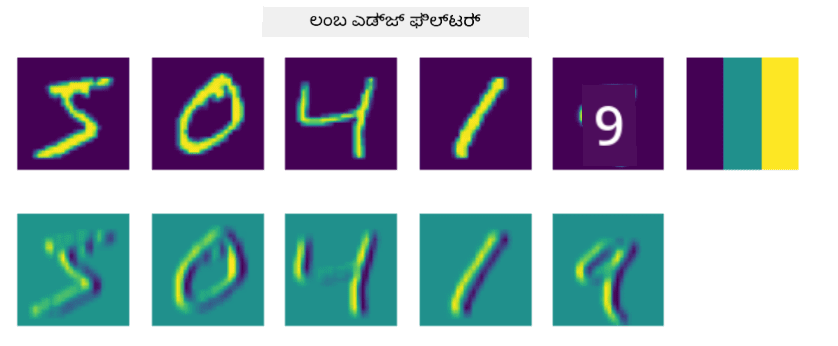
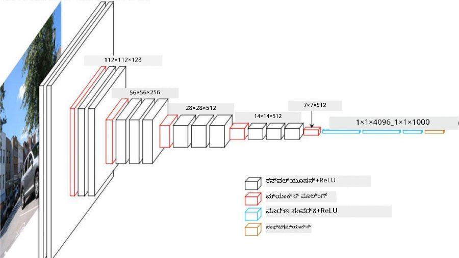

<!--
CO_OP_TRANSLATOR_METADATA:
{
  "original_hash": "a560d5b845962cf33dc102266e409568",
  "translation_date": "2025-11-25T22:06:56+00:00",
  "source_file": "lessons/4-ComputerVision/07-ConvNets/README.md",
  "language_code": "kn"
}
-->
# ಕನ್ವಲ್ಯೂಷನಲ್ ನ್ಯೂರಲ್ ನೆಟ್‌ವರ್ಕ್‌ಗಳು

ನಾವು ಮೊದಲು ನೋಡಿದ್ದೇವೆ, ನ್ಯೂರಲ್ ನೆಟ್‌ವರ್ಕ್‌ಗಳು ಚಿತ್ರಗಳನ್ನು ಸಂಸ್ಕರಿಸುವಲ್ಲಿ ತುಂಬಾ ಉತ್ತಮವಾಗಿವೆ, ಮತ್ತು ಒಂದೇ ಲೇಯರ್ ಪರ್ಸೆಪ್ಟ್ರಾನ್ ಕೂಡ MNIST ಡೇಟಾಸೆಟ್‌ನಿಂದ ಕೈಯಿಂದ ಬರೆದ ಅಂಕಿಗಳನ್ನು ಯುಕ್ತಿಯುತ ನಿಖರತೆಯಿಂದ ಗುರುತಿಸಬಹುದು. ಆದರೆ, MNIST ಡೇಟಾಸೆಟ್ ಬಹಳ ವಿಶೇಷವಾಗಿದೆ, ಮತ್ತು ಎಲ್ಲಾ ಅಂಕಿಗಳು ಚಿತ್ರದ ಮಧ್ಯಭಾಗದಲ್ಲಿ ಇರುತ್ತವೆ, ಇದು ಕಾರ್ಯವನ್ನು ಸುಲಭಗೊಳಿಸುತ್ತದೆ.

## [ಪೂರ್ವ-ಲೆಕ್ಚರ್ ಕ್ವಿಜ್](https://ff-quizzes.netlify.app/en/ai/quiz/13)

ವಾಸ್ತವಿಕ ಜೀವನದಲ್ಲಿ, ನಾವು ಚಿತ್ರದಲ್ಲಿ ವಸ್ತುಗಳ ನಿಖರ ಸ್ಥಾನದಿಂದ ಬೇರ್ಪಟ್ಟಂತೆ ಗುರುತಿಸಲು ಬಯಸುತ್ತೇವೆ. ಕಂಪ್ಯೂಟರ್ ವೀಷನ್ ಸಾಮಾನ್ಯ ವರ್ಗೀಕರಣದಿಂದ ಭಿನ್ನವಾಗಿದೆ, ಏಕೆಂದರೆ ನಾವು ಚಿತ್ರದಲ್ಲಿ ನಿರ್ದಿಷ್ಟ ವಸ್ತುವನ್ನು ಹುಡುಕುತ್ತಿರುವಾಗ, ನಾವು ಕೆಲವು ನಿರ್ದಿಷ್ಟ **ನಮೂನೆಗಳು** ಮತ್ತು ಅವುಗಳ ಸಂಯೋಜನೆಗಳನ್ನು ಹುಡುಕುತ್ತೇವೆ. ಉದಾಹರಣೆಗೆ, ಬೆಕ್ಕನ್ನು ಹುಡುಕುತ್ತಿರುವಾಗ, ಮೊದಲು ನಾವು ಆಡುವ ರೇಖೆಗಳನ್ನು ನೋಡಬಹುದು, ಅವು ಮೂಗುಮೂಳೆಗಳಾಗಿ ರೂಪುಗೊಳ್ಳಬಹುದು, ಮತ್ತು ನಂತರ ಕೆಲವು ಮೂಗುಮೂಳೆಗಳ ಸಂಯೋಜನೆ ನಮಗೆ ಅದು ನಿಜವಾಗಿಯೂ ಬೆಕ್ಕಿನ ಚಿತ್ರ ಎಂದು ಹೇಳಬಹುದು. ಸಂಬಂಧಿತ ಸ್ಥಾನ ಮತ್ತು ಕೆಲವು ನಿರ್ದಿಷ್ಟ ನಮೂನೆಗಳ ಹಾಜರಾತಿ ಮುಖ್ಯ, ಮತ್ತು ಅವುಗಳ ನಿಖರ ಸ್ಥಾನ ಚಿತ್ರದಲ್ಲಿ ಮುಖ್ಯವಲ್ಲ.

ನಮೂನೆಗಳನ್ನು ಹೊರತೆಗೆಯಲು, ನಾವು **ಕನ್ವಲ್ಯೂಷನಲ್ ಫಿಲ್ಟರ್‌ಗಳು** ಎಂಬ ಕಲ್ಪನೆಯನ್ನು ಬಳಸುತ್ತೇವೆ. ನೀವು ತಿಳಿದಿರುವಂತೆ, ಚಿತ್ರವನ್ನು 2D-ಮ್ಯಾಟ್ರಿಕ್ಸ್ ಅಥವಾ ಬಣ್ಣ ಆಳದ 3D-ಟೆನ್ಸರ್ ಮೂಲಕ ಪ್ರತಿನಿಧಿಸಲಾಗುತ್ತದೆ. ಫಿಲ್ಟರ್ ಅನ್ವಯಿಸುವುದು ಎಂದರೆ, ನಾವು ಸಾಪೇಕ್ಷವಾಗಿ ಸಣ್ಣ **ಫಿಲ್ಟರ್ ಕರ್ಣಲ್** ಮ್ಯಾಟ್ರಿಕ್ಸ್ ತೆಗೆದುಕೊಳ್ಳುತ್ತೇವೆ, ಮತ್ತು ಮೂಲ ಚಿತ್ರದಲ್ಲಿನ ಪ್ರತಿ ಪಿಕ್ಸೆಲ್‌ಗೆ ಸಮೀಪದ ಬಿಂದುಗಳೊಂದಿಗೆ ತೂಕಿತ ಸರಾಸರಿಯನ್ನು ಲೆಕ್ಕಿಸುತ್ತೇವೆ. ಇದನ್ನು ನಾವು ಒಂದು ಸಣ್ಣ ಕಿಟಕಿ ಚಿತ್ರದ ಮೇಲೆ ಸ್ಲೈಡ್ ಆಗುತ್ತಾ, ಫಿಲ್ಟರ್ ಕರ್ಣಲ್ ಮ್ಯಾಟ್ರಿಕ್ಸ್‌ನ ತೂಕಗಳ ಪ್ರಕಾರ ಎಲ್ಲಾ ಪಿಕ್ಸೆಲ್‌ಗಳನ್ನು ಸರಾಸರಿಗೊಳಿಸುವಂತೆ ನೋಡಬಹುದು.

 | 
----|----

> ಚಿತ್ರ: Dmitry Soshnikov

ಉದಾಹರಣೆಗೆ, ನಾವು 3x3 ಲಂಬ ಮತ್ತು ಆಡುವ ಎಡ್ಜ್ ಫಿಲ್ಟರ್‌ಗಳನ್ನು MNIST ಅಂಕಿಗಳ ಮೇಲೆ ಅನ್ವಯಿಸಿದರೆ, ಮೂಲ ಚಿತ್ರದಲ್ಲಿ ಲಂಬ ಮತ್ತು ಆಡುವ ಎಡ್ಜ್‌ಗಳಿರುವ ಸ್ಥಳಗಳಲ್ಲಿ ಹೈಲೈಟ್ಸ್ (ಹೆಚ್ಚಿನ ಮೌಲ್ಯಗಳು) ಸಿಗುತ್ತವೆ. ಆದ್ದರಿಂದ ಆ ಎರಡು ಫಿಲ್ಟರ್‌ಗಳನ್ನು ಎಡ್ಜ್‌ಗಳನ್ನು "ಹುಡುಕಲು" ಬಳಸಬಹುದು. ಹಾಗೆಯೇ, ನಾವು ಬೇರೆ ಕಡಿಮೆ ಮಟ್ಟದ ನಮೂನೆಗಳನ್ನು ಹುಡುಕಲು ವಿಭಿನ್ನ ಫಿಲ್ಟರ್‌ಗಳನ್ನು ವಿನ್ಯಾಸಗೊಳಿಸಬಹುದು:

> [Leung-Malik ಫಿಲ್ಟರ್ ಬ್ಯಾಂಕ್](https://www.robots.ox.ac.uk/~vgg/research/texclass/filters.html) ಚಿತ್ರ

ಆದರೆ, ನಾವು ಕೆಲವು ನಮೂನೆಗಳನ್ನು ಕೈಯಿಂದ ಹೊರತೆಗೆಯಲು ಫಿಲ್ಟರ್‌ಗಳನ್ನು ವಿನ್ಯಾಸಗೊಳಿಸಬಹುದು, ಹಾಗೆಯೇ ನಾವು ನೆಟ್‌ವರ್ಕ್ ಅನ್ನು ಇಂತಹ ರೀತಿಯಲ್ಲಿ ವಿನ್ಯಾಸಗೊಳಿಸಬಹುದು, ಅದು ಸ್ವಯಂಚಾಲಿತವಾಗಿ ನಮೂನೆಗಳನ್ನು ಕಲಿಯುತ್ತದೆ. ಇದು CNN ಹಿಂದೆ ಇರುವ ಪ್ರಮುಖ ಕಲ್ಪನೆಗಳಲ್ಲಿ ಒಂದಾಗಿದೆ.

## CNN ಹಿಂದೆ ಇರುವ ಮುಖ್ಯ ಕಲ್ಪನೆಗಳು

CNNಗಳು ಕಾರ್ಯನಿರ್ವಹಿಸುವ ವಿಧಾನವು ಕೆಳಗಿನ ಪ್ರಮುಖ ಕಲ್ಪನೆಗಳ ಮೇಲೆ ಆಧಾರಿತವಾಗಿದೆ:

* ಕನ್ವಲ್ಯೂಷನಲ್ ಫಿಲ್ಟರ್‌ಗಳು ನಮೂನೆಗಳನ್ನು ಹೊರತೆಗೆಯಬಹುದು
* ಫಿಲ್ಟರ್‌ಗಳನ್ನು ಸ್ವಯಂಚಾಲಿತವಾಗಿ ತರಬೇತುಗೊಳಿಸುವಂತೆ ನೆಟ್‌ವರ್ಕ್ ವಿನ್ಯಾಸಗೊಳಿಸಬಹುದು
* ನಾವು ಮೂಲ ಚಿತ್ರದಲ್ಲಿನ ಮಾತ್ರವಲ್ಲ, ಹೆಚ್ಚಿನ ಮಟ್ಟದ ವೈಶಿಷ್ಟ್ಯಗಳಲ್ಲಿ ನಮೂನೆಗಳನ್ನು ಹುಡುಕಲು ಇದೇ ವಿಧಾನವನ್ನು ಬಳಸಬಹುದು. ಆದ್ದರಿಂದ CNN ವೈಶಿಷ್ಟ್ಯ ಹೊರತೆಗೆಯುವಿಕೆ ಕಡಿಮೆ ಮಟ್ಟದ ಪಿಕ್ಸೆಲ್ ಸಂಯೋಜನೆಗಳಿಂದ ಪ್ರಾರಂಭಿಸಿ, ಚಿತ್ರ ಭಾಗಗಳ ಹೆಚ್ಚಿನ ಮಟ್ಟದ ಸಂಯೋಜನೆಗಳವರೆಗೆ ವೈಶಿಷ್ಟ್ಯಗಳ ಹಿರarchy ಮೇಲೆ ಕಾರ್ಯನಿರ್ವಹಿಸುತ್ತದೆ.

> [Hislop-Lynch ಅವರ ಪೇಪರ್](https://www.semanticscholar.org/paper/Computer-vision-based-pedestrian-trajectory-Hislop-Lynch/26e6f74853fc9bbb7487b06dc2cf095d36c9021d) ನಿಂದ ಚಿತ್ರ, ಅವರ [ಶೋಧನೆ](https://dl.acm.org/doi/abs/10.1145/1553374.1553453) ಆಧಾರಿತ

## ✍️ ಅಭ್ಯಾಸಗಳು: ಕನ್ವಲ್ಯೂಷನಲ್ ನ್ಯೂರಲ್ ನೆಟ್‌ವರ್ಕ್‌ಗಳು

ಕನ್ವಲ್ಯೂಷನಲ್ ನ್ಯೂರಲ್ ನೆಟ್‌ವರ್ಕ್‌ಗಳು ಹೇಗೆ ಕಾರ್ಯನಿರ್ವಹಿಸುತ್ತವೆ ಮತ್ತು ತರಬೇತುಗೊಳ್ಳುವ ಫಿಲ್ಟರ್‌ಗಳನ್ನು ಹೇಗೆ ಸಾಧಿಸಬಹುದು ಎಂಬುದನ್ನು ಮುಂದುವರೆಸಿ ಅನ್ವೇಷಿಸೋಣ, ಸಂಬಂಧಿತ ನೋಟ್ಬುಕ್‌ಗಳ ಮೂಲಕ:

* [ಕನ್ವಲ್ಯೂಷನಲ್ ನ್ಯೂರಲ್ ನೆಟ್‌ವರ್ಕ್‌ಗಳು - PyTorch](ConvNetsPyTorch.ipynb)
* [ಕನ್ವಲ್ಯೂಷನಲ್ ನ್ಯೂರಲ್ ನೆಟ್‌ವರ್ಕ್‌ಗಳು - TensorFlow](ConvNetsTF.ipynb)

## ಪಿರಮಿಡ್ ವಾಸ್ತುಶಿಲ್ಪ

ಚಿತ್ರ ಸಂಸ್ಕರಣೆಗೆ ಬಳಸುವ ಹೆಚ್ಚಿನ CNNಗಳು ಪಿರಮಿಡ್ ವಾಸ್ತುಶಿಲ್ಪವನ್ನು ಅನುಸರಿಸುತ್ತವೆ. ಮೂಲ ಚಿತ್ರಗಳಿಗೆ ಅನ್ವಯಿಸುವ ಮೊದಲ ಕನ್ವಲ್ಯೂಷನಲ್ ಲೇಯರ್ ಸಾಮಾನ್ಯವಾಗಿ ಕಡಿಮೆ ಸಂಖ್ಯೆಯ ಫಿಲ್ಟರ್‌ಗಳನ್ನು (8-16) ಹೊಂದಿರುತ್ತದೆ, ಅವು ವಿಭಿನ್ನ ಪಿಕ್ಸೆಲ್ ಸಂಯೋಜನೆಗಳಿಗೆ ಹೊಂದಿಕೆಯಾಗುತ್ತವೆ, ಉದಾಹರಣೆಗೆ ಆಡುವ/ಲಂಬ ರೇಖೆಗಳಂತೆ. ಮುಂದಿನ ಹಂತದಲ್ಲಿ, ನಾವು ನೆಟ್‌ವರ್ಕ್‌ನ ಸ್ಥಳೀಯ ಆಯಾಮವನ್ನು ಕಡಿಮೆ ಮಾಡುತ್ತೇವೆ ಮತ್ತು ಫಿಲ್ಟರ್‌ಗಳ ಸಂಖ್ಯೆಯನ್ನು ಹೆಚ್ಚಿಸುತ್ತೇವೆ, ಇದು ಸರಳ ವೈಶಿಷ್ಟ್ಯಗಳ ಹೆಚ್ಚಿನ ಸಂಯೋಜನೆಗಳಿಗೆ ಹೊಂದಿಕೆಯಾಗುತ್ತದೆ. ಪ್ರತಿಯೊಂದು ಲೇಯರ್‌ನಲ್ಲಿ, ಅಂತಿಮ ವರ್ಗೀಕರಣದ ಕಡೆಗೆ ಸಾಗುವಂತೆ, ಚಿತ್ರದ ಸ್ಥಳೀಯ ಆಯಾಮಗಳು ಕಡಿಮೆಯಾಗುತ್ತವೆ ಮತ್ತು ಫಿಲ್ಟರ್‌ಗಳ ಸಂಖ್ಯೆ ಹೆಚ್ಚಾಗುತ್ತದೆ.

ಉದಾಹರಣೆಗೆ, 2014 ರಲ್ಲಿ ImageNet ಟಾಪ್-5 ವರ್ಗೀಕರಣದಲ್ಲಿ 92.7% ನಿಖರತೆಯನ್ನು ಸಾಧಿಸಿದ VGG-16 ನೆಟ್‌ವರ್ಕ್‌ನ ವಾಸ್ತುಶಿಲ್ಪವನ್ನು ನೋಡೋಣ:

> [Researchgate](https://www.researchgate.net/figure/Vgg16-model-structure-To-get-the-VGG-NIN-model-we-replace-the-2-nd-4-th-6-th-7-th_fig2_335194493) ನಿಂದ ಚಿತ್ರ

## ಅತ್ಯಂತ ಪ್ರಸಿದ್ಧ CNN ವಾಸ್ತುಶಿಲ್ಪಗಳು

[ಅತ್ಯಂತ ಪ್ರಸಿದ್ಧ CNN ವಾಸ್ತುಶಿಲ್ಪಗಳ ಬಗ್ಗೆ ನಿಮ್ಮ ಅಧ್ಯಯನವನ್ನು ಮುಂದುವರೆಸಿ](CNN_Architectures.md)

---

<!-- CO-OP TRANSLATOR DISCLAIMER START -->
**ಅಸ್ವೀಕರಣ**:  
ಈ ದಸ್ತಾವೇಜು AI ಅನುವಾದ ಸೇವೆ [Co-op Translator](https://github.com/Azure/co-op-translator) ಬಳಸಿ ಅನುವಾದಿಸಲಾಗಿದೆ. ನಾವು ನಿಖರತೆಯಿಗಾಗಿ ಪ್ರಯತ್ನಿಸುತ್ತಿದ್ದರೂ, ಸ್ವಯಂಚಾಲಿತ ಅನುವಾದಗಳಲ್ಲಿ ದೋಷಗಳು ಅಥವಾ ತಪ್ಪುಗಳು ಇರಬಹುದು ಎಂದು ದಯವಿಟ್ಟು ಗಮನಿಸಿ. ಮೂಲ ಭಾಷೆಯಲ್ಲಿರುವ ಮೂಲ ದಸ್ತಾವೇಜನ್ನು ಅಧಿಕೃತ ಮೂಲವಾಗಿ ಪರಿಗಣಿಸಬೇಕು. ಮಹತ್ವದ ಮಾಹಿತಿಗಾಗಿ ವೃತ್ತಿಪರ ಮಾನವ ಅನುವಾದವನ್ನು ಶಿಫಾರಸು ಮಾಡಲಾಗುತ್ತದೆ. ಈ ಅನುವಾದ ಬಳಕೆಯಿಂದ ಉಂಟಾಗುವ ಯಾವುದೇ ತಪ್ಪು ಅರ್ಥಮಾಡಿಕೊಳ್ಳುವಿಕೆ ಅಥವಾ ತಪ್ಪು ವಿವರಣೆಗಳಿಗೆ ನಾವು ಹೊಣೆಗಾರರಾಗುವುದಿಲ್ಲ.
<!-- CO-OP TRANSLATOR DISCLAIMER END -->