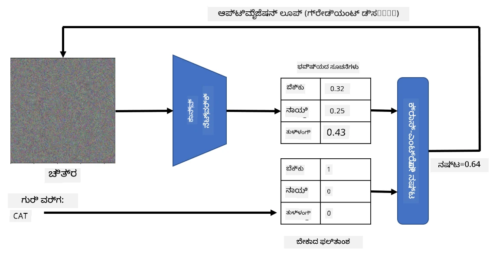
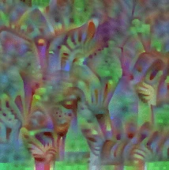

# ಪೂರ್ವ-ಪ್ರಶಿಕ್ಷಿತ ನೆಟ್‌ವರ್ಕ್‌ಗಳು ಮತ್ತು ವರ್ಗಾವಣೆ ಅಧ್ಯಯನ

CNNಗಳನ್ನು ತರಬೇತಿಗೊಳಿಸಲು ಬಹಳ ಸಮಯ ಬೇಕಾಗುತ್ತದೆ ಮತ್ತು ಅದಕ್ಕೆ ಸಾಕಷ್ಟು ಡೇಟಾ ಅಗತ್ಯವಿದೆ. ಆದರೆ, ಹೆಚ್ಚಿನ ಸಮಯವನ್ನು ನೆಟ್‌ವರ್ಕ್ ಚಿತ್ರಗಳಿಂದ ಮಾದರಿಗಳನ್ನು ಹೊರತೆಗೆಯಲು ಬಳಸಬಹುದಾದ ಉತ್ತಮ ಕಡಿಮೆ-ಮಟ್ಟದ ಫಿಲ್ಟರ್‌ಗಳನ್ನು ಕಲಿಯಲು ವ್ಯಯಿಸಲಾಗುತ್ತದೆ. ಒಂದು ಸಹಜ ಪ್ರಶ್ನೆ ಉದ್ಭವಿಸುತ್ತದೆ - ನಾವು ಒಂದು ಡೇಟಾಸೆಟ್‌ನಲ್ಲಿ ತರಬೇತಿಗೊಳಿಸಿದ ನ್ಯೂರಲ್ ನೆಟ್‌ವರ್ಕ್ ಅನ್ನು ಬಳಸಿಕೊಂಡು, ಪೂರ್ಣ ತರಬೇತಿ ಪ್ರಕ್ರಿಯೆಯ ಅಗತ್ಯವಿಲ್ಲದೆ ವಿಭಿನ್ನ ಚಿತ್ರಗಳನ್ನು ವರ್ಗೀಕರಿಸಲು ಅದನ್ನು ಹೊಂದಿಸಬಹುದೇ?

## [ಪೂರ್ವ-ವ್ಯಾಖ್ಯಾನ ಕ್ವಿಜ್](https://ff-quizzes.netlify.app/en/ai/quiz/15)

ಈ ವಿಧಾನವನ್ನು **ವರ್ಗಾವಣೆ ಅಧ್ಯಯನ** ಎಂದು ಕರೆಯುತ್ತಾರೆ, ಏಕೆಂದರೆ ನಾವು ಒಂದು ನ್ಯೂರಲ್ ನೆಟ್‌ವರ್ಕ್ ಮಾದರಿಯಿಂದ ಇನ್ನೊಂದು ಮಾದರಿಗೆ ಕೆಲವು ಜ್ಞಾನವನ್ನು ವರ್ಗಾಯಿಸುತ್ತೇವೆ. ವರ್ಗಾವಣೆ ಅಧ್ಯಯನದಲ್ಲಿ, ಸಾಮಾನ್ಯವಾಗಿ ನಾವು ಪೂರ್ವ-ಪ್ರಶಿಕ್ಷಿತ ಮಾದರಿಯಿಂದ ಪ್ರಾರಂಭಿಸುತ್ತೇವೆ, ಅದು ಕೆಲವು ದೊಡ್ಡ ಚಿತ್ರ ಡೇಟಾಸೆಟ್ ಮೇಲೆ ತರಬೇತಿಗೊಳಿಸಲಾಗಿದೆ, ಉದಾಹರಣೆಗೆ **ImageNet**. ಆ ಮಾದರಿಗಳು ಸಾಮಾನ್ಯ ಚಿತ್ರಗಳಿಂದ ವಿಭಿನ್ನ ಲಕ್ಷಣಗಳನ್ನು ಹೊರತೆಗೆಯಲು ಈಗಾಗಲೇ ಉತ್ತಮ ಕೆಲಸ ಮಾಡಬಹುದು, ಮತ್ತು ಬಹುತೇಕ ಸಂದರ್ಭಗಳಲ್ಲಿ ಆ ಹೊರತೆಗೆಯಲಾದ ಲಕ್ಷಣಗಳ ಮೇಲೆ ವರ್ಗೀಕರಿಸುವ ಯಂತ್ರವನ್ನು ನಿರ್ಮಿಸುವುದರಿಂದ ಉತ್ತಮ ಫಲಿತಾಂಶ ಸಿಗಬಹುದು.

> ✅ ವರ್ಗಾವಣೆ ಅಧ್ಯಯನ ಎಂಬ ಪದವನ್ನು ಶಿಕ್ಷಣದಂತಹ ಇತರ ಶೈಕ್ಷಣಿಕ ಕ್ಷೇತ್ರಗಳಲ್ಲಿಯೂ ಕಾಣಬಹುದು. ಇದು ಒಂದು ಕ್ಷೇತ್ರದಿಂದ ಜ್ಞಾನವನ್ನು ತೆಗೆದು ಮತ್ತೊಂದು ಕ್ಷೇತ್ರದಲ್ಲಿ ಅನ್ವಯಿಸುವ ಪ್ರಕ್ರಿಯೆಯನ್ನು ಸೂಚಿಸುತ್ತದೆ.

## ಪೂರ್ವ-ಪ್ರಶಿಕ್ಷಿತ ಮಾದರಿಗಳನ್ನು ಲಕ್ಷಣ ಹೊರತೆಗೆಯುವ ಸಾಧನಗಳಾಗಿ ಬಳಸುವುದು

ನಾವು ಹಿಂದಿನ ವಿಭಾಗದಲ್ಲಿ ಚರ್ಚಿಸಿದ ಸಂಯೋಜಿತ ನೆಟ್‌ವರ್ಕ್‌ಗಳು ಹಲವಾರು ಪದರಗಳನ್ನು ಹೊಂದಿವೆ, ಪ್ರತಿಯೊಂದು ಪದರವು ಚಿತ್ರದಿಂದ ಕೆಲವು ಲಕ್ಷಣಗಳನ್ನು ಹೊರತೆಗೆಯಲು ಉದ್ದೇಶಿಸಲಾಗಿದೆ, ಕಡಿಮೆ-ಮಟ್ಟದ ಪಿಕ್ಸೆಲ್ ಸಂಯೋಜನೆಗಳಿಂದ (ಹೋರಿಜಾಂಟಲ್/ವೆರ್ಟಿಕಲ್ ರೇಖೆ ಅಥವಾ ಹಾದಿ) ಪ್ರಾರಂಭಿಸಿ, ಉನ್ನತ ಮಟ್ಟದ ಲಕ್ಷಣಗಳ ಸಂಯೋಜನೆಗಳವರೆಗೆ, ಉದಾಹರಣೆಗೆ ಬೆಂಕಿಯ ಕಣ್ಣು. ನಾವು ಸಾಕಷ್ಟು ದೊಡ್ಡ ಮತ್ತು ವೈವಿಧ್ಯಮಯ ಸಾಮಾನ್ಯ ಚಿತ್ರಗಳ ಡೇಟಾಸೆಟ್‌ನಲ್ಲಿ CNN ಅನ್ನು ತರಬೇತಿಗೊಳಿಸಿದರೆ, ನೆಟ್‌ವರ್ಕ್ ಆ ಸಾಮಾನ್ಯ ಲಕ್ಷಣಗಳನ್ನು ಹೊರತೆಗೆಯಲು ಕಲಿಯುತ್ತದೆ.

ಕೆರೆಸ್ ಮತ್ತು ಪೈಟಾರ್ಚ್ ಎರಡೂ ಸಾಮಾನ್ಯ ವಾಸ್ತುಶಿಲ್ಪಗಳ ಪೂರ್ವ-ಪ್ರಶಿಕ್ಷಿತ ನ್ಯೂರಲ್ ನೆಟ್‌ವರ್ಕ್ ತೂಕಗಳನ್ನು ಸುಲಭವಾಗಿ ಲೋಡ್ ಮಾಡಲು ಫಂಕ್ಷನ್‌ಗಳನ್ನು ಹೊಂದಿವೆ, ಅವುಗಳಲ್ಲಿ ಬಹುತೇಕವು ImageNet ಚಿತ್ರಗಳ ಮೇಲೆ ತರಬೇತಿಗೊಳಿಸಲ್ಪಟ್ಟಿವೆ. ಹಿಂದಿನ ಪಾಠದ [CNN ವಾಸ್ತುಶಿಲ್ಪಗಳು](../07-ConvNets/CNN_Architectures.md) ಪುಟದಲ್ಲಿ ಸಾಮಾನ್ಯವಾಗಿ ಬಳಸುವ ಮಾದರಿಗಳನ್ನು ವಿವರಿಸಲಾಗಿದೆ. ವಿಶೇಷವಾಗಿ, ನೀವು ಕೆಳಗಿನವುಗಳಲ್ಲಿ ಒಂದನ್ನು ಬಳಸಲು ಪರಿಗಣಿಸಬಹುದು:

* **VGG-16/VGG-19** - ಸರಳ ಮಾದರಿಗಳು ಆದರೆ ಉತ್ತಮ ನಿಖರತೆಯನ್ನು ನೀಡುತ್ತವೆ. ವರ್ಗಾವಣೆ ಅಧ್ಯಯನ ಹೇಗೆ ಕಾರ್ಯನಿರ್ವಹಿಸುತ್ತದೆ ಎಂದು ನೋಡಲು ಮೊದಲ ಪ್ರಯತ್ನವಾಗಿ VGG ಬಳಸುವುದು ಉತ್ತಮ ಆಯ್ಕೆ.
* **ResNet** - 2015 ರಲ್ಲಿ Microsoft Research ಪ್ರಸ್ತಾಪಿಸಿದ ಮಾದರಿಗಳ ಕುಟುಂಬ. ಇವು ಹೆಚ್ಚು ಪದರಗಳನ್ನು ಹೊಂದಿದ್ದು, ಹೆಚ್ಚಿನ ಸಂಪನ್ಮೂಲಗಳನ್ನು ತೆಗೆದುಕೊಳ್ಳುತ್ತವೆ.
* **MobileNet** - ಕಡಿಮೆ ಗಾತ್ರದ ಮಾದರಿಗಳ ಕುಟುಂಬ, ಮೊಬೈಲ್ ಸಾಧನಗಳಿಗೆ ಸೂಕ್ತ. ಸಂಪನ್ಮೂಲಗಳು ಕಡಿಮೆ ಇದ್ದರೆ ಮತ್ತು ಸ್ವಲ್ಪ ನಿಖರತೆಯನ್ನು ತ್ಯಜಿಸಲು ಸಿದ್ಧರಾಗಿದ್ದರೆ ಇವುಗಳನ್ನು ಬಳಸಿ.

ಇಲ್ಲಿ VGG-16 ನೆಟ್‌ವರ್ಕ್ ಮೂಲಕ ಬೆಕ್ಕಿನ ಚಿತ್ರದಿಂದ ಹೊರತೆಗೆಯಲಾದ ಕೆಲವು ಲಕ್ಷಣಗಳ ಉದಾಹರಣೆ ಇದೆ:

## ಬೆಕ್ಕು ಮತ್ತು ನಾಯಿ ಡೇಟಾಸೆಟ್

ಈ ಉದಾಹರಣೆಯಲ್ಲಿ, ನಾವು [ಬೆಕ್ಕು ಮತ್ತು ನಾಯಿಗಳು](https://www.microsoft.com/download/details.aspx?id=54765&WT.mc_id=academic-77998-cacaste) ಡೇಟಾಸೆಟ್ ಅನ್ನು ಬಳಸುತ್ತೇವೆ, ಇದು ನೈಜ ಜೀವನದ ಚಿತ್ರ ವರ್ಗೀಕರಣ ಪರಿಸ್ಥಿತಿಗೆ ಬಹಳ ಹತ್ತಿರವಾಗಿದೆ.

## ✍️ ಅಭ್ಯಾಸ: ವರ್ಗಾವಣೆ ಅಧ್ಯಯನ

ಸಂಬಂಧಿತ ನೋಟ್ಬುಕ್‌ಗಳಲ್ಲಿ ವರ್ಗಾವಣೆ ಅಧ್ಯಯನವನ್ನು ನೇರವಾಗಿ ನೋಡೋಣ:

* [ವರ್ಗಾವಣೆ ಅಧ್ಯಯನ - PyTorch](TransferLearningPyTorch.ipynb)
* [ವರ್ಗಾವಣೆ ಅಧ್ಯಯನ - TensorFlow](TransferLearningTF.ipynb)

## ವಿರೋಧಾತ್ಮಕ ಬೆಕ್ಕಿನ ದೃಶ್ಯೀಕರಣ

ಪೂರ್ವ-ಪ್ರಶಿಕ್ಷಿತ ನ್ಯೂರಲ್ ನೆಟ್‌ವರ್ಕ್ ತನ್ನ *ಮಗಜಿನಲ್ಲಿ* ವಿಭಿನ್ನ ಮಾದರಿಗಳನ್ನು ಹೊಂದಿದೆ, ಅದರಲ್ಲಿ **ಆದರ್ಶ ಬೆಕ್ಕಿನ** (ಹಾಗೂ ಆದರ್ಶ ನಾಯಿ, ಆದರ್ಶ ಜೆಬ್ರಾ ಇತ್ಯಾದಿ) ಕಲ್ಪನೆಗಳೂ ಸೇರಿವೆ. ಈ ಚಿತ್ರವನ್ನು ಹೇಗೆ **ದೃಶ್ಯೀಕರಿಸಬಹುದು** ಎಂಬುದು ಆಸಕ್ತಿದಾಯಕ. ಆದರೆ ಇದು ಸರಳವಲ್ಲ, ಏಕೆಂದರೆ ಮಾದರಿಗಳು ನೆಟ್‌ವರ್ಕ್ ತೂಕಗಳಾದ್ಯಂತ ಹರಡಿವೆ ಮತ್ತು ಹೈರಾರ್ಕಿಕಲ್ ರಚನೆಯಲ್ಲಿ ಸಂಘಟಿತವಾಗಿವೆ.

ನಾವು ತೆಗೆದುಕೊಳ್ಳಬಹುದಾದ ಒಂದು ವಿಧಾನವೆಂದರೆ, ಯಾದೃಚ್ಛಿಕ ಚಿತ್ರದಿಂದ ಪ್ರಾರಂಭಿಸಿ, ನಂತರ ಆ ಚಿತ್ರವನ್ನು **ಗ್ರೇಡಿಯಂಟ್ ಡಿಸೆಂಟ್ ಆಪ್ಟಿಮೈಜೆಷನ್** ತಂತ್ರವನ್ನು ಬಳಸಿ ಸರಿಹೊಂದಿಸುವುದು, ಹೀಗೆ ನೆಟ್‌ವರ್ಕ್ ಅದನ್ನು ಬೆಕ್ಕಾಗಿ ಭಾವಿಸಲು ಪ್ರಾರಂಭಿಸುತ್ತದೆ.

ಆದರೆ, ನಾವು ಇದನ್ನು ಮಾಡಿದರೆ, ಯಾದೃಚ್ಛಿಕ ಶಬ್ದದಂತೆ ಕಾಣುವ ಏನನ್ನಾದರೂ ಪಡೆಯುತ್ತೇವೆ. ಇದಕ್ಕೆ ಕಾರಣವೆಂದರೆ *ನೆಟ್‌ವರ್ಕ್ ಇನ್ಪುಟ್ ಚಿತ್ರವನ್ನು ಬೆಕ್ಕಾಗಿ ಭಾವಿಸಲು ಅನೇಕ ಮಾರ್ಗಗಳಿವೆ*, ಅವುಗಳಲ್ಲಿ ಕೆಲವು ದೃಶ್ಯವಾಗಿ ಅರ್ಥವಿಲ್ಲದವುಗಳೂ ಇರುತ್ತವೆ. ಆ ಚಿತ್ರಗಳಲ್ಲಿ ಬೆಕ್ಕಿಗೆ ಸಾಮಾನ್ಯವಾದ ಹಲವಾರು ಮಾದರಿಗಳು ಇದ್ದರೂ, ಅವು ದೃಶ್ಯವಾಗಿ ವಿಭಿನ್ನವಾಗಿರಬೇಕೆಂದು ಯಾವುದೇ ನಿಯಂತ್ರಣವಿಲ್ಲ.

ಫಲಿತಾಂಶವನ್ನು ಸುಧಾರಿಸಲು, ನಾವು ನಷ್ಟ ಕಾರ್ಯದಲ್ಲಿ ಮತ್ತೊಂದು ಪದವನ್ನು ಸೇರಿಸಬಹುದು, ಅದನ್ನು **ವೈವಿಧ್ಯ ನಷ್ಟ** ಎಂದು ಕರೆಯುತ್ತಾರೆ. ಇದು ಚಿತ್ರದಲ್ಲಿನ ಹತ್ತಿರದ ಪಿಕ್ಸೆಲ್‌ಗಳು ಎಷ್ಟು ಸಮಾನವಾಗಿವೆ ಎಂಬುದನ್ನು ತೋರಿಸುವ ಮಾನದಂಡ. ವೈವಿಧ್ಯ ನಷ್ಟವನ್ನು ಕಡಿಮೆ ಮಾಡುವುದು ಚಿತ್ರವನ್ನು ಮೃದುಗೊಳಿಸುತ್ತದೆ ಮತ್ತು ಶಬ್ದವನ್ನು ದೂರ ಮಾಡುತ್ತದೆ - ಹೀಗಾಗಿ ದೃಶ್ಯವಾಗಿ ಆಕರ್ಷಕ ಮಾದರಿಗಳನ್ನು ಬಹಿರಂಗಪಡಿಸುತ್ತದೆ. ಇಲ್ಲಿ "ಆದರ್ಶ" ಚಿತ್ರಗಳ ಉದಾಹರಣೆ ಇದೆ, ಅವು ಬೆಕ್ಕಾಗಿ ಮತ್ತು ಜೆಬ್ರಾ ಆಗಿ ಹೆಚ್ಚಿನ ಸಾಧ್ಯತೆಯಿಂದ ವರ್ಗೀಕರಿಸಲ್ಪಟ್ಟಿವೆ:

 | 
-----|-----
 *ಆದರ್ಶ ಬೆಕ್ಕು* | *ಆದರ್ಶ ಜೆಬ್ರಾ*

ಇದೇ ವಿಧಾನವನ್ನು ನ್ಯೂರಲ್ ನೆಟ್‌ವರ್ಕ್ ಮೇಲೆ **ವಿರೋಧಾತ್ಮಕ ದಾಳಿಗಳು** ನಡೆಸಲು ಬಳಸಬಹುದು. ನಾವು ನ್ಯೂರಲ್ ನೆಟ್‌ವರ್ಕ್ ಅನ್ನು ಮೋಸಗೊಳಿಸಿ ನಾಯಿಯನ್ನು ಬೆಕ್ಕಾಗಿ ತೋರಿಸಲು ಬಯಸಿದರೆ, ನೆಟ್‌ವರ್ಕ್ ನಾಯಿಯಾಗಿ ಗುರುತಿಸಿದ ನಾಯಿಯ ಚಿತ್ರವನ್ನು ತೆಗೆದುಕೊಂಡು, ಗ್ರೇಡಿಯಂಟ್ ಡಿಸೆಂಟ್ ಆಪ್ಟಿಮೈಜೆಷನ್ ಬಳಸಿ ಸ್ವಲ್ಪ ತಿದ್ದುಪಡಿ ಮಾಡಬಹುದು, ಹೀಗೆ ನೆಟ್‌ವರ್ಕ್ ಅದನ್ನು ಬೆಕ್ಕಾಗಿ ವರ್ಗೀಕರಿಸಲು ಪ್ರಾರಂಭಿಸುತ್ತದೆ:

 | 
-----|-----
*ನಾಯಿಯ ಮೂಲ ಚಿತ್ರ* | *ಬೆಕ್ಕಾಗಿ ವರ್ಗೀಕರಿಸಲ್ಪಟ್ಟ ನಾಯಿಯ ಚಿತ್ರ*

ಮೇಲಿನ ಫಲಿತಾಂಶಗಳನ್ನು ಪುನರಾವರ್ತಿಸಲು ಕೆಳಗಿನ ನೋಟ್ಬುಕ್‌ನ ಕೋಡ್ ನೋಡಿ:

* [ಆದರ್ಶ ಮತ್ತು ವಿರೋಧಾತ್ಮಕ ಬೆಕ್ಕು - TensorFlow](AdversarialCat_TF.ipynb)

## ಸಾರಾಂಶ

ವರ್ಗಾವಣೆ ಅಧ್ಯಯನವನ್ನು ಬಳಸಿಕೊಂಡು, ನೀವು ಕಸ್ಟಮ್ ವಸ್ತು ವರ್ಗೀಕರಣ ಕಾರ್ಯಕ್ಕಾಗಿ ಶೀಘ್ರವಾಗಿ ವರ್ಗೀಕರಿಸುವ ಯಂತ್ರವನ್ನು ರಚಿಸಿ ಉತ್ತಮ ನಿಖರತೆಯನ್ನು ಸಾಧಿಸಬಹುದು. ಈಗ ನಾವು ಪರಿಹರಿಸುತ್ತಿರುವ ಹೆಚ್ಚು ಸಂಕೀರ್ಣ ಕಾರ್ಯಗಳಿಗೆ ಹೆಚ್ಚಿನ ಗಣನ ಶಕ್ತಿಯ ಅಗತ್ಯವಿದೆ ಮತ್ತು ಅವು CPU ಮೇಲೆ ಸುಲಭವಾಗಿ ಪರಿಹರಿಸಲಾಗುವುದಿಲ್ಲ. ಮುಂದಿನ ಘಟಕದಲ್ಲಿ, ನಾವು ಕಡಿಮೆ ಗಣನ ಸಂಪನ್ಮೂಲಗಳನ್ನು ಬಳಸಿಕೊಂಡು ಅದೇ ಮಾದರಿಯನ್ನು ತರಬೇತಿಗೊಳಿಸಲು ಹೆಚ್ಚು ಲಘು ತಂತ್ರಾಂಶವನ್ನು ಪ್ರಯತ್ನಿಸುವೆವು, ಇದರಿಂದ ಸ್ವಲ್ಪ ಕಡಿಮೆ ನಿಖರತೆ ಮಾತ್ರ ಬರುತ್ತದೆ.

## 🚀 ಸವಾಲು

ಸಂಬಂಧಿತ ನೋಟ್ಬುಕ್‌ಗಳಲ್ಲಿ, ವರ್ಗಾವಣೆ ಜ್ಞಾನವು ಸ್ವಲ್ಪ ಸಮಾನ ತರಬೇತಿ ಡೇಟಾ (ಹೊಸ ಪ್ರಾಣಿ ಪ್ರಕಾರ) ಜೊತೆಗೆ ಉತ್ತಮವಾಗಿ ಕಾರ್ಯನಿರ್ವಹಿಸುವುದಾಗಿ ಕೆಳಭಾಗದಲ್ಲಿ ಟಿಪ್ಪಣಿಗಳು ಇವೆ. ಸಂಪೂರ್ಣ ಹೊಸ ರೀತಿಯ ಚಿತ್ರಗಳೊಂದಿಗೆ ಪ್ರಯೋಗ ಮಾಡಿ ನಿಮ್ಮ ವರ್ಗಾವಣೆ ಜ್ಞಾನ ಮಾದರಿಗಳು ಎಷ್ಟು ಚೆನ್ನಾಗಿ ಅಥವಾ ಕೆಟ್ಟದಾಗಿ ಕಾರ್ಯನಿರ್ವಹಿಸುತ್ತವೆ ಎಂದು ನೋಡಿ.

## [ಪೋಸ್ಟ್-ವ್ಯಾಖ್ಯಾನ ಕ್ವಿಜ್](https://ff-quizzes.netlify.app/en/ai/quiz/16)

## ವಿಮರ್ಶೆ ಮತ್ತು ಸ್ವಯಂ ಅಧ್ಯಯನ

ನಿಮ್ಮ ಮಾದರಿಗಳನ್ನು ತರಬೇತಿಗೊಳಿಸುವ ಇನ್ನೊಂದು ವಿಧಾನವನ್ನು ಆಳವಾಗಿ ತಿಳಿದುಕೊಳ್ಳಲು [TrainingTricks.md](TrainingTricks.md) ಓದಿ.

## [ಅಸೈನ್‌ಮೆಂಟ್](lab/README.md)

ಈ ಪ್ರಯೋಗಶಾಲೆಯಲ್ಲಿ, ನಾವು ನೈಜ ಜೀವನದ [Oxford-IIIT](https://www.robots.ox.ac.uk/~vgg/data/pets/) ಪಶುಪಕ್ಷಿ ಡೇಟಾಸೆಟ್ ಅನ್ನು 35 ಬಗೆಯ ಬೆಕ್ಕು ಮತ್ತು ನಾಯಿಗಳೊಂದಿಗೆ ಬಳಸುತ್ತೇವೆ ಮತ್ತು ವರ್ಗಾವಣೆ ಅಧ್ಯಯನ ವರ್ಗೀಕರಿಸುವ ಯಂತ್ರವನ್ನು ನಿರ್ಮಿಸುವೆವು.

---

<!-- CO-OP TRANSLATOR DISCLAIMER START -->
**ಅಸ್ವೀಕರಣ**:  
ಈ ದಸ್ತಾವೇಜು AI ಅನುವಾದ ಸೇವೆ [Co-op Translator](https://github.com/Azure/co-op-translator) ಬಳಸಿ ಅನುವಾದಿಸಲಾಗಿದೆ. ನಾವು ನಿಖರತೆಯಿಗಾಗಿ ಪ್ರಯತ್ನಿಸುತ್ತಿದ್ದರೂ, ಸ್ವಯಂಚಾಲಿತ ಅನುವಾದಗಳಲ್ಲಿ ತಪ್ಪುಗಳು ಅಥವಾ ಅಸತ್ಯತೆಗಳು ಇರಬಹುದು ಎಂದು ದಯವಿಟ್ಟು ಗಮನಿಸಿ. ಮೂಲ ಭಾಷೆಯಲ್ಲಿರುವ ಮೂಲ ದಸ್ತಾವೇಜನ್ನು ಅಧಿಕೃತ ಮೂಲವಾಗಿ ಪರಿಗಣಿಸಬೇಕು. ಮಹತ್ವದ ಮಾಹಿತಿಗಾಗಿ, ವೃತ್ತಿಪರ ಮಾನವ ಅನುವಾದವನ್ನು ಶಿಫಾರಸು ಮಾಡಲಾಗುತ್ತದೆ. ಈ ಅನುವಾದ ಬಳಕೆಯಿಂದ ಉಂಟಾಗುವ ಯಾವುದೇ ತಪ್ಪು ಅರ್ಥಮಾಡಿಕೊಳ್ಳುವಿಕೆ ಅಥವಾ ತಪ್ಪು ವಿವರಣೆಗಳಿಗೆ ನಾವು ಹೊಣೆಗಾರರಾಗುವುದಿಲ್ಲ.
<!-- CO-OP TRANSLATOR DISCLAIMER END -->