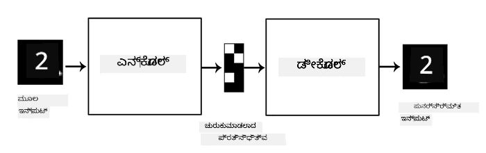
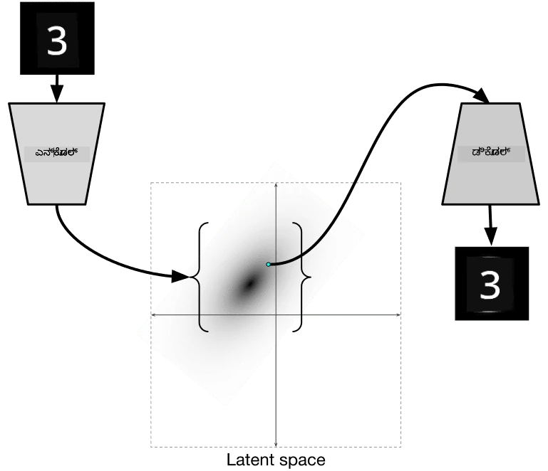

# ಆಟೋಎನ್‌ಕೋಡರ್‌ಗಳು

CNNಗಳನ್ನು ತರಬೇತುಗೊಳಿಸುವಾಗ, ಒಂದು ಸಮಸ್ಯೆ ಎಂದರೆ ನಮಗೆ ಬಹಳಷ್ಟು ಲೇಬಲ್ ಮಾಡಲಾದ ಡೇಟಾ ಬೇಕಾಗುತ್ತದೆ. ಚಿತ್ರ ವರ್ಗೀಕರಣದ ಸಂದರ್ಭದಲ್ಲಿ, ಚಿತ್ರಗಳನ್ನು ವಿಭಿನ್ನ ವರ್ಗಗಳಲ್ಲಿ ವಿಭಜಿಸುವುದು ಕೈಯಿಂದ ಮಾಡಬೇಕಾಗುತ್ತದೆ.

## [ಪೂರ್ವ-ವ್ಯಾಖ್ಯಾನ ಕ್ವಿಜ್](https://ff-quizzes.netlify.app/en/ai/quiz/17)

ಆದರೆ, ನಾವು ಕಚ್ಚಾ (ಲೇಬಲ್ ಮಾಡದ) ಡೇಟಾವನ್ನು CNN ವೈಶಿಷ್ಟ್ಯಗಳನ್ನು ಹೊರತೆಗೆಯಲು ತರಬೇತಿಗೆ ಬಳಸಬಹುದು, ಇದನ್ನು **ಸ್ವಯಂ-ನಿರೀಕ್ಷಿತ ಅಧ್ಯಯನ** ಎಂದು ಕರೆಯುತ್ತಾರೆ. ಲೇಬಲ್‌ಗಳ ಬದಲು, ತರಬೇತಿ ಚಿತ್ರಗಳನ್ನು ನೆಟ್‌ವರ್ಕ್ ಇನ್‌ಪುಟ್ ಮತ್ತು ಔಟ್‌ಪುಟ್ ಎರಡಾಗಿ ಬಳಸುತ್ತೇವೆ. **ಆಟೋಎನ್‌ಕೋಡರ್**ನ ಮುಖ್ಯ ಕಲ್ಪನೆ ಎಂದರೆ, ನಮಗೆ ಒಂದು **ಎನ್‌ಕೋಡರ್ ನೆಟ್‌ವರ್ಕ್** ಇರುತ್ತದೆ, ಅದು ಇನ್‌ಪುಟ್ ಚಿತ್ರವನ್ನು ಕೆಲವು **ಲ್ಯಾಟೆಂಟ್ ಸ್ಪೇಸ್**ಗೆ (ಸಾಮಾನ್ಯವಾಗಿ ಇದು ಸಣ್ಣ ಗಾತ್ರದ ವೆಕ್ಟರ್ ಆಗಿರುತ್ತದೆ) ಪರಿವರ್ತಿಸುತ್ತದೆ, ನಂತರ **ಡಿಕೋಡರ್ ನೆಟ್‌ವರ್ಕ್** ಮೂಲ ಚಿತ್ರವನ್ನು ಮರುನಿರ್ಮಿಸಲು ಪ್ರಯತ್ನಿಸುತ್ತದೆ.

> ✅ [ಆಟೋಎನ್‌ಕೋಡರ್](https://wikipedia.org/wiki/Autoencoder) ಎಂದರೆ "ಲೇಬಲ್ ಮಾಡದ ಡೇಟಾದ ಪರಿಣಾಮಕಾರಿ ಕೋಡಿಂಗ್ ಕಲಿಯಲು ಬಳಸುವ ಕೃತಕ ನ್ಯೂರಲ್ ನೆಟ್‌ವರ್ಕ್‌ಗಳ ಒಂದು ಪ್ರಕಾರ."

ನಾವು ಮೂಲ ಚಿತ್ರದಿಂದ ಸಾಧ್ಯವಾದಷ್ಟು ಮಾಹಿತಿ ಹಿಡಿಯಲು ಆಟೋಎನ್‌ಕೋಡರ್ ತರಬೇತುಗೊಳಿಸುತ್ತಿದ್ದೇವೆ, ಆದ್ದರಿಂದ ನೆಟ್‌ವರ್ಕ್ ಇನ್‌ಪುಟ್ ಚಿತ್ರಗಳ ಅರ್ಥವನ್ನು ಹಿಡಿಯಲು ಉತ್ತಮ **ಎಂಬೆಡ್ಡಿಂಗ್** ಅನ್ನು ಹುಡುಕಲು ಪ್ರಯತ್ನಿಸುತ್ತದೆ.

> ಚಿತ್ರ [Keras ಬ್ಲಾಗ್](https://blog.keras.io/building-autoencoders-in-keras.html) ನಿಂದ

## ಆಟೋಎನ್‌ಕೋಡರ್‌ಗಳನ್ನು ಬಳಸುವ ಸಂದರ್ಭಗಳು

ಮೂಲ ಚಿತ್ರಗಳನ್ನು ಮರುನಿರ್ಮಿಸುವುದು ತಾನೇ ಉಪಯುಕ್ತವಾಗದಿದ್ದರೂ, ಕೆಲವು ಸಂದರ್ಭಗಳಲ್ಲಿ ಆಟೋಎನ್‌ಕೋಡರ್‌ಗಳು ವಿಶೇಷವಾಗಿ ಉಪಯುಕ್ತವಾಗುತ್ತವೆ:

* **ಚಿತ್ರಗಳ ಆಯಾಮವನ್ನು ಕಡಿಮೆ ಮಾಡುವುದು ದೃಶ್ಯೀಕರಣಕ್ಕಾಗಿ** ಅಥವಾ **ಚಿತ್ರಗಳ ಎಂಬೆಡ್ಡಿಂಗ್‌ಗಳನ್ನು ತರಬೇತಿಗೊಳಿಸುವುದು**. ಸಾಮಾನ್ಯವಾಗಿ PCAಗಿಂತ ಆಟೋಎನ್‌ಕೋಡರ್‌ಗಳು ಉತ್ತಮ ಫಲಿತಾಂಶ ನೀಡುತ್ತವೆ, ಏಕೆಂದರೆ ಅದು ಚಿತ್ರಗಳ ಸ್ಥಳೀಯ ಸ್ವಭಾವ ಮತ್ತು ಹೈರಾರ್ಕಿಕ ವೈಶಿಷ್ಟ್ಯಗಳನ್ನು ಪರಿಗಣಿಸುತ್ತದೆ.
* **ಶಬ್ದ ನಿವಾರಣೆ (Denoising)**, ಅಂದರೆ ಚಿತ್ರದಿಂದ ಶಬ್ದವನ್ನು ತೆಗೆದುಹಾಕುವುದು. ಶಬ್ದವು ಅನಗತ್ಯ ಮಾಹಿತಿಯನ್ನು ಹೊಂದುತ್ತದೆ, ಆದ್ದರಿಂದ ಆಟೋಎನ್‌ಕೋಡರ್ ಅದನ್ನು ಸಣ್ಣ ಲ್ಯಾಟೆಂಟ್ ಸ್ಪೇಸ್‌ಗೆ ಹೊಂದಿಸಲು ಸಾಧ್ಯವಿಲ್ಲ, ಮತ್ತು ಆದ್ದರಿಂದ ಅದು ಚಿತ್ರದ ಮುಖ್ಯ ಭಾಗವನ್ನು ಮಾತ್ರ ಹಿಡಿಯುತ್ತದೆ. ಶಬ್ದ ನಿವಾರಣೆಯ ತರಬೇತಿಯಲ್ಲಿ, ನಾವು ಮೂಲ ಚಿತ್ರಗಳಿಂದ ಪ್ರಾರಂಭಿಸಿ, ಕೃತಕವಾಗಿ ಶಬ್ದ ಸೇರಿಸಿದ ಚಿತ್ರಗಳನ್ನು ಇನ್‌ಪುಟ್ ಆಗಿ ಬಳಸುತ್ತೇವೆ.
* **ಸುಪರ್-ರೆಸಲ್ಯೂಶನ್**, ಅಂದರೆ ಚಿತ್ರ ರೆಸಲ್ಯೂಶನ್ ಹೆಚ್ಚಿಸುವುದು. ನಾವು ಉನ್ನತ ರೆಸಲ್ಯೂಶನ್ ಚಿತ್ರಗಳಿಂದ ಪ್ರಾರಂಭಿಸಿ, ಕಡಿಮೆ ರೆಸಲ್ಯೂಶನ್ ಚಿತ್ರವನ್ನು ಆಟೋಎನ್‌ಕೋಡರ್ ಇನ್‌ಪುಟ್ ಆಗಿ ಬಳಸುತ್ತೇವೆ.
* **ಜನರೇಟಿವ್ ಮಾದರಿಗಳು**. ಆಟೋಎನ್‌ಕೋಡರ್ ತರಬೇತಿಯಾದ ನಂತರ, ಡಿಕೋಡರ್ ಭಾಗವನ್ನು ಯಾದೃಚ್ಛಿಕ ಲ್ಯಾಟೆಂಟ್ ವೆಕ್ಟರ್‌ಗಳಿಂದ ಹೊಸ ವಸ್ತುಗಳನ್ನು ರಚಿಸಲು ಬಳಸಬಹುದು.

## ವ್ಯಾರಿಯೇಷನಲ್ ಆಟೋಎನ್‌ಕೋಡರ್‌ಗಳು (VAE)

ಸಾಂಪ್ರದಾಯಿಕ ಆಟೋಎನ್‌ಕೋಡರ್‌ಗಳು ಇನ್‌ಪುಟ್ ಡೇಟಾದ ಆಯಾಮವನ್ನು ಕಡಿಮೆ ಮಾಡುತ್ತವೆ, ಇನ್‌ಪುಟ್ ಚಿತ್ರಗಳ ಮುಖ್ಯ ವೈಶಿಷ್ಟ್ಯಗಳನ್ನು ಕಂಡುಹಿಡಿಯುತ್ತವೆ. ಆದರೆ, ಲ್ಯಾಟೆಂಟ್ ವೆಕ್ಟರ್‌ಗಳು ಸಾಮಾನ್ಯವಾಗಿ ಅರ್ಥವಿಲ್ಲದಿರುತ್ತವೆ. ಉದಾಹರಣೆಗೆ, MNIST ಡೇಟಾಸೆಟ್‌ನ ಉದಾಹರಣೆಯಲ್ಲಿ, ವಿಭಿನ್ನ ಲ್ಯಾಟೆಂಟ್ ವೆಕ್ಟರ್‌ಗಳಿಗೆ ಯಾವ ಅಂಕಿಗಳು ಹೊಂದಿವೆ ಎಂದು ತಿಳಿದುಕೊಳ್ಳುವುದು ಸುಲಭವಲ್ಲ, ಏಕೆಂದರೆ ಸಮೀಪದ ಲ್ಯಾಟೆಂಟ್ ವೆಕ್ಟರ್‌ಗಳು ಒಂದೇ ಅಂಕಿಗೆ ಹೊಂದಿರಬೇಕಾಗಿಲ್ಲ.

ಮತ್ತೊಂದೆಡೆ, *ಜನರೇಟಿವ್* ಮಾದರಿಗಳನ್ನು ತರಬೇತಿಗೊಳಿಸಲು ಲ್ಯಾಟೆಂಟ್ ಸ್ಪೇಸ್ ಬಗ್ಗೆ ಕೆಲವು ಅರ್ಥ ತಿಳಿದಿರುವುದು ಉತ್ತಮ. ಈ ಕಲ್ಪನೆ ನಮಗೆ **ವ್ಯಾರಿಯೇಷನಲ್ ಆಟೋಎನ್‌ಕೋಡರ್** (VAE) ಗೆ ದಾರಿ ತೋರಿಸುತ್ತದೆ.

VAE ಒಂದು ಆಟೋಎನ್‌ಕೋಡರ್ ಆಗಿದ್ದು, ಲ್ಯಾಟೆಂಟ್ ಪರಿಮಾಣಗಳ *ಸಾಂಖ್ಯಿಕ ವಿತರಣೆಯನ್ನು* (latent distribution) ಊಹಿಸಲು ಕಲಿಯುತ್ತದೆ. ಉದಾಹರಣೆಗೆ, ನಾವು ಲ್ಯಾಟೆಂಟ್ ವೆಕ್ಟರ್‌ಗಳು ಸಾಮಾನ್ಯ ವಿತರಣೆಯಲ್ಲಿ ವಿತರಿತವಾಗಿರಬೇಕು ಎಂದು ಬಯಸಬಹುದು, ಕೆಲವು ಸರಾಸರಿ zmean ಮತ್ತು ಮಾನಕ ವ್ಯತ್ಯಾಸ zsigma (ಇವು ಎರಡೂ d ಆಯಾಮದ ವೆಕ್ಟರ್‌ಗಳು). VAEಯಲ್ಲಿ ಎನ್‌ಕೋಡರ್ ಆ ಪರಿಮಾಣಗಳನ್ನು ಊಹಿಸಲು ಕಲಿಯುತ್ತದೆ, ನಂತರ ಡಿಕೋಡರ್ ಆ ವಿತರಣೆಯಿಂದ ಯಾದೃಚ್ಛಿಕ ವೆಕ್ಟರ್ ತೆಗೆದುಕೊಂಡು ವಸ್ತುವನ್ನು ಮರುನಿರ್ಮಿಸುತ್ತದೆ.

ಸಾರಾಂಶವಾಗಿ:

 * ಇನ್‌ಪುಟ್ ವೆಕ್ಟರ್‌ನಿಂದ, ನಾವು `z_mean` ಮತ್ತು `z_log_sigma` ಅನ್ನು ಊಹಿಸುತ್ತೇವೆ (ಮಾನಕ ವ್ಯತ್ಯಾಸವನ್ನು ನೇರವಾಗಿ ಊಹಿಸುವ ಬದಲು ಅದರ ಲಾಗರಿಥಮ್ ಅನ್ನು ಊಹಿಸುತ್ತೇವೆ)
 * ನಾವು ವಿತರಣೆಯಿಂದ `sample` ಎಂಬ ವೆಕ್ಟರ್ ಅನ್ನು ಆಯ್ಕೆ ಮಾಡುತ್ತೇವೆ N(zmean,exp(zlog_sigma))
 * ಡಿಕೋಡರ್ `sample` ಅನ್ನು ಇನ್‌ಪುಟ್ ವೆಕ್ಟರ್ ಆಗಿ ಬಳಸಿಕೊಂಡು ಮೂಲ ಚಿತ್ರವನ್ನು ಮರುನಿರ್ಮಿಸಲು ಪ್ರಯತ್ನಿಸುತ್ತದೆ

 

> ಚಿತ್ರ [ಈ ಬ್ಲಾಗ್ ಪೋಸ್ಟ್](https://ijdykeman.github.io/ml/2016/12/21/cvae.html) ನಿಂದ, ಇಸಾಕ್ ಡೈಕೆಮನ್ ರಚನೆ

ವ್ಯಾರಿಯೇಷನಲ್ ಆಟೋಎನ್‌ಕೋಡರ್‌ಗಳು ಎರಡು ಭಾಗಗಳಿರುವ ಸಂಕೀರ್ಣ ನಷ್ಟ ಕಾರ್ಯವನ್ನು ಬಳಸುತ್ತವೆ:

* **ಮರುನಿರ್ಮಾಣ ನಷ್ಟ** (Reconstruction loss) - ಮರುನಿರ್ಮಿತ ಚಿತ್ರ ಗುರಿ ಚಿತ್ರಕ್ಕೆ ಎಷ್ಟು ಸಮೀಪವಿದೆ ಎಂಬುದನ್ನು ತೋರಿಸುವ ನಷ್ಟ ಕಾರ್ಯ (ಇದು ಸರಾಸರಿ ಚದರ ದೋಷ, MSE ಆಗಿರಬಹುದು). ಇದು ಸಾಮಾನ್ಯ ಆಟೋಎನ್‌ಕೋಡರ್‌ಗಳಲ್ಲಿನ ನಷ್ಟ ಕಾರ್ಯದಂತೆ.
* **KL ನಷ್ಟ** - ಲ್ಯಾಟೆಂಟ್ ವ್ಯತ್ಯಾಸ ವಿತರಣೆ ಸಾಮಾನ್ಯ ವಿತರಣೆಗೆ ಸಮೀಪವಾಗಿರಲು ಖಚಿತಪಡಿಸುತ್ತದೆ. ಇದು [ಕುಲ್ಲ್ಬ್ಯಾಕ್-ಲೈಬ್ಲರ್ ವ್ಯತ್ಯಾಸ](https://www.countbayesie.com/blog/2017/5/9/kullback-leibler-divergence-explained) ಎಂಬ ಪರಿಕಲ್ಪನೆಯ ಮೇಲೆ ಆಧಾರಿತವಾಗಿದೆ - ಎರಡು ಸಾಂಖ್ಯಿಕ ವಿತರಣೆಗಳ ಸಮಾನತೆಯನ್ನು ಅಂದಾಜಿಸುವ ಮಾಪಕ.

VAEಗಳ ಪ್ರಮುಖ ಲಾಭವೆಂದರೆ, ನಾವು ಲ್ಯಾಟೆಂಟ್ ವೆಕ್ಟರ್‌ಗಳನ್ನು ಯಾವ ವಿತರಣೆಯಿಂದ ಆಯ್ಕೆ ಮಾಡಬೇಕೆಂದು ತಿಳಿದಿರುವುದರಿಂದ, ಹೊಸ ಚಿತ್ರಗಳನ್ನು ಸುಲಭವಾಗಿ ರಚಿಸಬಹುದು. ಉದಾಹರಣೆಗೆ, 2D ಲ್ಯಾಟೆಂಟ್ ವೆಕ್ಟರ್‌ನೊಂದಿಗೆ MNIST ಮೇಲೆ VAE ತರಬೇತಿಗೊಳಿಸಿದರೆ, ಲ್ಯಾಟೆಂಟ್ ವೆಕ್ಟರ್‌ನ ಅಂಶಗಳನ್ನು ಬದಲಾಯಿಸಿ ವಿಭಿನ್ನ ಅಂಕಿಗಳನ್ನು ಪಡೆಯಬಹುದು:

> ಚಿತ್ರ [ಡ್ಮಿತ್ರಿ ಸೋಶ್ನಿಕೋವ್](http://soshnikov.com) ರಚನೆ

ಲ್ಯಾಟೆಂಟ್ ಪರಿಮಾಣ ಸ್ಥಳದ ವಿಭಿನ್ನ ಭಾಗಗಳಿಂದ ಲ್ಯಾಟೆಂಟ್ ವೆಕ್ಟರ್‌ಗಳನ್ನು ಪಡೆಯಲು ಪ್ರಾರಂಭಿಸಿದಂತೆ ಚಿತ್ರಗಳು ಪರಸ್ಪರ ಮಿಶ್ರಣವಾಗುತ್ತಿರುವುದನ್ನು ಗಮನಿಸಿ. ನಾವು ಈ ಸ್ಥಳವನ್ನು 2Dಯಲ್ಲಿ ದೃಶ್ಯೀಕರಿಸಬಹುದು:

 

> ಚಿತ್ರ [ಡ್ಮಿತ್ರಿ ಸೋಶ್ನಿಕೋವ್](http://soshnikov.com) ರಚನೆ

## ✍️ ಅಭ್ಯಾಸಗಳು: ಆಟೋಎನ್‌ಕೋಡರ್‌ಗಳು

ಈ ಸಂಬಂಧಿತ ನೋಟ್ಬುಕ್‌ಗಳಲ್ಲಿ ಆಟೋಎನ್‌ಕೋಡರ್‌ಗಳ ಬಗ್ಗೆ ಹೆಚ್ಚು ತಿಳಿಯಿರಿ:

* [ಟೆನ್ಸರ್‌ಫ್ಲೋದಲ್ಲಿ ಆಟೋಎನ್‌ಕೋಡರ್‌ಗಳು](AutoencodersTF.ipynb)
* [ಪೈಟಾರ್ಚ್‌ನಲ್ಲಿ ಆಟೋಎನ್‌ಕೋಡರ್‌ಗಳು](AutoEncodersPyTorch.ipynb)

## ಆಟೋಎನ್‌ಕೋಡರ್‌ಗಳ ಗುಣಲಕ್ಷಣಗಳು

* **ಡೇಟಾ ನಿರ್ದಿಷ್ಟ** - ಅವು ತರಬೇತಿಗೊಳಿಸಿದ ಚಿತ್ರಗಳ ಪ್ರಕಾರ ಮಾತ್ರ ಚೆನ್ನಾಗಿ ಕೆಲಸ ಮಾಡುತ್ತವೆ. ಉದಾಹರಣೆಗೆ, ನಾವು ಹೂವುಗಳ ಮೇಲೆ ಸುಪರ್-ರೆಸಲ್ಯೂಶನ್ ನೆಟ್‌ವರ್ಕ್ ತರಬೇತಿಗೊಳಿಸಿದರೆ, ಅದು ಪೋರ್ಟ್ರೆಟ್‌ಗಳಲ್ಲಿ ಚೆನ್ನಾಗಿ ಕೆಲಸ ಮಾಡುವುದಿಲ್ಲ. ಏಕೆಂದರೆ ನೆಟ್‌ವರ್ಕ್ ತರಬೇತಿ ಡೇಟಾಸೆಟ್‌ನ ವೈಶಿಷ್ಟ್ಯಗಳಿಂದ ಸೂಕ್ಷ್ಮ ವಿವರಗಳನ್ನು ತೆಗೆದುಕೊಂಡು ಹೆಚ್ಚಿನ ರೆಸಲ್ಯೂಶನ್ ಚಿತ್ರವನ್ನು ಉತ್ಪಾದಿಸುತ್ತದೆ.
* **ನಷ್ಟಕಾರಿ** - ಮರುನಿರ್ಮಿತ ಚಿತ್ರ ಮೂಲ ಚಿತ್ರಕ್ಕೆ ಸಮಾನವಲ್ಲ. ನಷ್ಟದ ಸ್ವಭಾವವನ್ನು ತರಬೇತಿಯಲ್ಲಿ ಬಳಸಿದ *ನಷ್ಟ ಕಾರ್ಯ* ನಿರ್ಧರಿಸುತ್ತದೆ.
* **ಲೇಬಲ್ ಮಾಡದ ಡೇಟಾ ಮೇಲೆ ಕೆಲಸ ಮಾಡುತ್ತದೆ**

## [ಪೋಸ್ಟ್-ವ್ಯಾಖ್ಯಾನ ಕ್ವಿಜ್](https://ff-quizzes.netlify.app/en/ai/quiz/18)

## ಸಾರಾಂಶ

ಈ ಪಾಠದಲ್ಲಿ, ನೀವು AI ವಿಜ್ಞಾನಿಗೆ ಲಭ್ಯವಿರುವ ವಿವಿಧ ರೀತಿಯ ಆಟೋಎನ್‌ಕೋಡರ್‌ಗಳ ಬಗ್ಗೆ ತಿಳಿದುಕೊಂಡಿರಿ. ಅವುಗಳನ್ನು ಹೇಗೆ ನಿರ್ಮಿಸುವುದು ಮತ್ತು ಚಿತ್ರಗಳನ್ನು ಮರುನಿರ್ಮಿಸಲು ಅವುಗಳನ್ನು ಹೇಗೆ ಬಳಸುವುದು ಎಂಬುದನ್ನು ಕಲಿತಿರಿ. ನೀವು VAE ಬಗ್ಗೆ ಮತ್ತು ಅದನ್ನು ಹೊಸ ಚಿತ್ರಗಳನ್ನು ರಚಿಸಲು ಹೇಗೆ ಬಳಸುವುದು ಎಂಬುದನ್ನು ಸಹ ಕಲಿತಿರಿ.

## 🚀 ಸವಾಲು

ಈ ಪಾಠದಲ್ಲಿ, ನೀವು ಚಿತ್ರಗಳಿಗೆ ಆಟೋಎನ್‌ಕೋಡರ್‌ಗಳನ್ನು ಬಳಸುವುದನ್ನು ಕಲಿತಿರಿ. ಆದರೆ ಅವು ಸಂಗೀತಕ್ಕೂ ಬಳಸಬಹುದು! Magenta ಯೋಜನೆಯ [MusicVAE](https://magenta.tensorflow.org/music-vae) ಯೋಜನೆಯನ್ನು ನೋಡಿ, ಇದು ಆಟೋಎನ್‌ಕೋಡರ್‌ಗಳನ್ನು ಬಳಸಿ ಸಂಗೀತವನ್ನು ಮರುನಿರ್ಮಿಸಲು ಕಲಿಯುತ್ತದೆ. ಈ ಲೈಬ್ರರಿಯೊಂದಿಗೆ ಕೆಲವು [ಪ್ರಯೋಗಗಳನ್ನು](https://colab.research.google.com/github/magenta/magenta-demos/blob/master/colab-notebooks/Multitrack_MusicVAE.ipynb) ಮಾಡಿ ನೀವು ಏನು ರಚಿಸಬಹುದು ಎಂದು ನೋಡಿ.

## [ಪೋಸ್ಟ್-ವ್ಯಾಖ್ಯಾನ ಕ್ವಿಜ್](https://ff-quizzes.netlify.app/en/ai/quiz/16)

## ವಿಮರ್ಶೆ ಮತ್ತು ಸ್ವಯಂ ಅಧ್ಯಯನ

ಉಲ್ಲೇಖಕ್ಕಾಗಿ, ಈ ಸಂಪನ್ಮೂಲಗಳಲ್ಲಿ ಆಟೋಎನ್‌ಕೋಡರ್‌ಗಳ ಬಗ್ಗೆ ಹೆಚ್ಚು ಓದಿ:

* [Keras ನಲ್ಲಿ ಆಟೋಎನ್‌ಕೋಡರ್‌ಗಳನ್ನು ನಿರ್ಮಿಸುವುದು](https://blog.keras.io/building-autoencoders-in-keras.html)
* [NeuroHive ಬ್ಲಾಗ್ ಪೋಸ್ಟ್](https://neurohive.io/ru/osnovy-data-science/variacionnyj-avtojenkoder-vae/)
* [ವ್ಯಾರಿಯೇಷನಲ್ ಆಟೋಎನ್‌ಕೋಡರ್‌ಗಳ ವಿವರಣೆ](https://kvfrans.com/variational-autoencoders-explained/)
* [ಶರತ್ಕೃತ ವ್ಯಾರಿಯೇಷನಲ್ ಆಟೋಎನ್‌ಕೋಡರ್‌ಗಳು](https://ijdykeman.github.io/ml/2016/12/21/cvae.html)

## ಹುದ್ದೆ

[ಈ TensorFlow ನೋಟ್ಬುಕ್](AutoencodersTF.ipynb) ಕೊನೆಯಲ್ಲಿ, ನೀವು 'ಕಾರ್ಯ'ವನ್ನು ಕಾಣುತ್ತೀರಿ - ಇದನ್ನು ನಿಮ್ಮ ಹುದ್ದೆಯಾಗಿ ಬಳಸಿ.

---

<!-- CO-OP TRANSLATOR DISCLAIMER START -->
**ಅಸ್ವೀಕರಣ**:  
ಈ ದಸ್ತಾವೇಜು [Co-op Translator](https://github.com/Azure/co-op-translator) ಎಂಬ AI ಅನುವಾದ ಸೇವೆಯನ್ನು ಬಳಸಿ ಅನುವಾದಿಸಲಾಗಿದೆ. ನಾವು ಶುದ್ಧತೆಯತ್ತ ಪ್ರಯತ್ನಿಸುತ್ತಿದ್ದರೂ, ಸ್ವಯಂಚಾಲಿತ ಅನುವಾದಗಳಲ್ಲಿ ತಪ್ಪುಗಳು ಅಥವಾ ಅಸತ್ಯತೆಗಳು ಇರಬಹುದು ಎಂದು ದಯವಿಟ್ಟು ಗಮನಿಸಿ. ಮೂಲ ಭಾಷೆಯಲ್ಲಿರುವ ಮೂಲ ದಸ್ತಾವೇಜನ್ನು ಅಧಿಕೃತ ಮೂಲವೆಂದು ಪರಿಗಣಿಸಬೇಕು. ಮಹತ್ವದ ಮಾಹಿತಿಗಾಗಿ, ವೃತ್ತಿಪರ ಮಾನವ ಅನುವಾದವನ್ನು ಶಿಫಾರಸು ಮಾಡಲಾಗುತ್ತದೆ. ಈ ಅನುವಾದ ಬಳಕೆಯಿಂದ ಉಂಟಾಗುವ ಯಾವುದೇ ತಪ್ಪು ಅರ್ಥಮಾಡಿಕೊಳ್ಳುವಿಕೆ ಅಥವಾ ತಪ್ಪು ವಿವರಣೆಗಳಿಗೆ ನಾವು ಹೊಣೆಗಾರರಾಗುವುದಿಲ್ಲ.
<!-- CO-OP TRANSLATOR DISCLAIMER END -->