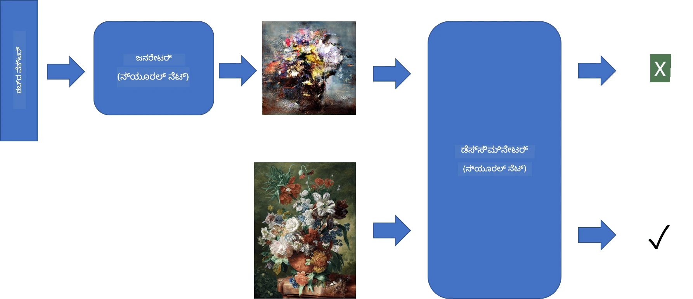
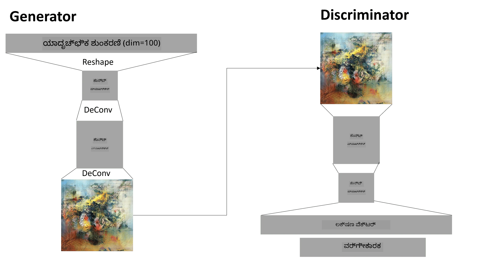

# ಜನರೇಟಿವ್ ಅಡ್ವರ್ಸರಿಯಲ್ ನೆಟ್‌ವರ್ಕ್‌ಗಳು

ಹಿಂದಿನ ವಿಭಾಗದಲ್ಲಿ, ನಾವು **ಜನರೇಟಿವ್ ಮಾದರಿಗಳು** ಬಗ್ಗೆ ಕಲಿತಿದ್ದೇವೆ: ತರಬೇತಿ ಡೇಟಾಸೆಟ್‌ನಲ್ಲಿರುವ ಚಿತ್ರಗಳಿಗೆ ಸಮಾನವಾದ ಹೊಸ ಚಿತ್ರಗಳನ್ನು ರಚಿಸಬಲ್ಲ ಮಾದರಿಗಳು. VAE ಒಂದು ಉತ್ತಮ ಉದಾಹರಣೆಯಾಗಿದೆ ಜನರೇಟಿವ್ ಮಾದರಿಯ.

## [ಪೂರ್ವ-ವ್ಯಾಖ್ಯಾನ ಕ್ವಿಜ್](https://ff-quizzes.netlify.app/en/ai/quiz/19)

ಆದರೆ, ನಾವು VAE ಬಳಸಿ ಅರ್ಥಪೂರ್ಣವಾದ, ಯುಕ್ತಿಯುತ ರೆಸಲ್ಯೂಶನ್‌ನಲ್ಲಿರುವ ಚಿತ್ರವನ್ನು ರಚಿಸಲು ಪ್ರಯತ್ನಿಸಿದರೆ, ತರಬೇತಿ ಚೆನ್ನಾಗಿ ಸಮ್ಮಿಲನವಾಗುವುದಿಲ್ಲ. ಈ ಬಳಕೆಗೆ, ನಾವು ವಿಶೇಷವಾಗಿ ಜನರೇಟಿವ್ ಮಾದರಿಗಳಿಗೆ ಗುರಿಯಾಗಿರುವ ಮತ್ತೊಂದು ವಾಸ್ತುಶಿಲ್ಪವನ್ನು ಕಲಿಯಬೇಕು - **ಜನರೇಟಿವ್ ಅಡ್ವರ್ಸರಿಯಲ್ ನೆಟ್‌ವರ್ಕ್‌ಗಳು**, ಅಥವಾ GANಗಳು.

GANನ ಮುಖ್ಯ ಕಲ್ಪನೆ ಎರಡು ನ್ಯೂರಲ್ ನೆಟ್‌ವರ್ಕ್‌ಗಳನ್ನು ಪರಸ್ಪರ ಎದುರಾಗಿ ತರಬೇತಿಗೊಳಿಸುವುದು:

> ಚಿತ್ರ: [Dmitry Soshnikov](http://soshnikov.com)

> ✅ ಕೆಲವು ಪದಕೋಶ:
> * **ಜನರೇಟರ್** ಎಂದರೆ ಕೆಲವು ಯಾದೃಚ್ಛಿಕ ವೆಕ್ಟರ್ ತೆಗೆದುಕೊಂಡು, ಚಿತ್ರವನ್ನು ಉತ್ಪಾದಿಸುವ ನೆಟ್‌ವರ್ಕ್
> * **ಡಿಸ್ಕ್ರಿಮಿನೇಟರ್** ಎಂದರೆ ಒಂದು ಚಿತ್ರವನ್ನು ತೆಗೆದುಕೊಂಡು, ಅದು ನಿಜವಾದ ಚಿತ್ರವೇ (ತರಬೇತಿ ಡೇಟಾಸೆಟ್‌ನಿಂದ) ಅಥವಾ ಜನರೇಟರ್ ರಚಿಸಿದದು ಎಂದು ಹೇಳುವ ನೆಟ್‌ವರ್ಕ್. ಇದು ಮೂಲತಃ ಚಿತ್ರ ವರ್ಗೀಕರಣಕಾರ.

### ಡಿಸ್ಕ್ರಿಮಿನೇಟರ್

ಡಿಸ್ಕ್ರಿಮಿನೇಟರ್‌ನ ವಾಸ್ತುಶಿಲ್ಪವು ಸಾಮಾನ್ಯ ಚಿತ್ರ ವರ್ಗೀಕರಣ ನೆಟ್‌ವರ್ಕ್‌ನಿಂದ ಭಿನ್ನವಾಗುವುದಿಲ್ಲ. ಸರಳವಾಗಿ ಹೇಳುವುದಾದರೆ, ಇದು ಸಂಪೂರ್ಣ ಸಂಪರ್ಕಿತ ವರ್ಗೀಕರಣಕಾರವಾಗಿರಬಹುದು, ಆದರೆ ಬಹುಶಃ ಇದು [ಕನ್ವಲ್ಯೂಷನಲ್ ನೆಟ್‌ವರ್ಕ್](../07-ConvNets/README.md) ಆಗಿರುತ್ತದೆ.

> ✅ ಕನ್ವಲ್ಯೂಷನಲ್ ನೆಟ್‌ವರ್ಕ್ ಆಧಾರಿತ GAN ಅನ್ನು [DCGAN](https://arxiv.org/pdf/1511.06434.pdf) ಎಂದು ಕರೆಯುತ್ತಾರೆ

CNN ಡಿಸ್ಕ್ರಿಮಿನೇಟರ್‌ನಲ್ಲಿ ಹಲವಾರು ಕನ್ವಲ್ಯೂಷನ್ಗಳು ಮತ್ತು ಪೂಲಿಂಗ್‌ಗಳು (ಸ್ಥಳೀಯ ಗಾತ್ರ ಕಡಿಮೆಯಾಗುವಂತೆ) ಮತ್ತು ಒಂದು ಅಥವಾ ಹೆಚ್ಚು ಸಂಪೂರ್ಣ ಸಂಪರ್ಕಿತ ಪದರಗಳು "ಫೀಚರ್ ವೆಕ್ಟರ್" ಪಡೆಯಲು, ಅಂತಿಮ ದ್ವಿಮೂಲಕ ವರ್ಗೀಕರಣಕಾರ ಇರುತ್ತದೆ.

> ✅ ಈ ಸಂದರ್ಭದಲ್ಲಿ 'ಪೂಲಿಂಗ್' ಎಂದರೆ ಚಿತ್ರ ಗಾತ್ರವನ್ನು ಕಡಿಮೆ ಮಾಡುವ ತಂತ್ರ. "ಪೂಲಿಂಗ್ ಪದರಗಳು ಒಂದು ಪದರದಲ್ಲಿನ ನ್ಯೂರಾನ್ ಗುಂಪಿನ ಔಟ್‌ಪುಟ್‌ಗಳನ್ನು ಮುಂದಿನ ಪದರದ ಒಂದೇ ನ್ಯೂರಾನ್‌ಗೆ ಸಂಯೋಜಿಸುವ ಮೂಲಕ ಡೇಟಾದ ಆಯಾಮಗಳನ್ನು ಕಡಿಮೆ ಮಾಡುತ್ತವೆ." - [ಮೂಲ](https://wikipedia.org/wiki/Convolutional_neural_network#Pooling_layers)

### ಜನರೇಟರ್

ಜನರೇಟರ್ ಸ್ವಲ್ಪ ಹೆಚ್ಚು ಸಂಕೀರ್ಣ. ಇದನ್ನು ಡಿಸ್ಕ್ರಿಮಿನೇಟರ್‌ನ ತಿರುಗಿದ ರೂಪವೆಂದು ಪರಿಗಣಿಸಬಹುದು. ಲ್ಯಾಟೆಂಟ್ ವೆಕ್ಟರ್ (ಫೀಚರ್ ವೆಕ್ಟರ್ ಬದಲು) ನಿಂದ ಪ್ರಾರಂಭಿಸಿ, ಅಗತ್ಯ ಗಾತ್ರ/ಆಕಾರಕ್ಕೆ ಪರಿವರ್ತಿಸಲು ಸಂಪೂರ್ಣ ಸಂಪರ್ಕಿತ ಪದರವಿದೆ, ನಂತರ ಡಿಕನ್ವಲ್ಯೂಷನ್ಗಳು ಮತ್ತು ಅಪ್‌ಸ್ಕೇಲಿಂಗ್. ಇದು [ಆಟೋಎನ್‌ಕೋಡರ್](../09-Autoencoders/README.md)ನ ಡಿಕೋಡರ್ ಭಾಗದಂತೆ.

> ✅ ಕನ್ವಲ್ಯೂಷನ್ ಪದರವು ಚಿತ್ರವನ್ನು ತಲುಪುವ ರೇಖೀಯ ಫಿಲ್ಟರ್ ಆಗಿರುವುದರಿಂದ, ಡಿಕನ್ವಲ್ಯೂಷನ್ ಮೂಲತಃ ಕನ್ವಲ್ಯೂಷನ್‌ಗೆ ಸಮಾನವಾಗಿದ್ದು, ಅದೇ ಪದರ ಲಾಜಿಕ್ ಬಳಸಿ ಅನುಷ್ಠಾನಗೊಳ್ಳಬಹುದು.

> ಚಿತ್ರ: [Dmitry Soshnikov](http://soshnikov.com)

### GAN ತರಬೇತಿ

GANಗಳು **ಅಡ್ವರ್ಸರಿಯಲ್** ಎಂದು ಕರೆಯಲ್ಪಡುವುದು ಜನರೇಟರ್ ಮತ್ತು ಡಿಸ್ಕ್ರಿಮಿನೇಟರ್ ನಡುವೆ ನಿರಂತರ ಸ್ಪರ್ಧೆ ಇರುವುದರಿಂದ. ಈ ಸ್ಪರ್ಧೆಯ ಸಮಯದಲ್ಲಿ, ಇಬ್ಬರೂ ಉತ್ತಮಗೊಳ್ಳುತ್ತಾರೆ, ಹೀಗಾಗಿ ನೆಟ್‌ವರ್ಕ್ ಉತ್ತಮ ಚಿತ್ರಗಳನ್ನು ಉತ್ಪಾದಿಸಲು ಕಲಿಯುತ್ತದೆ.

ತರಬೇತಿ ಎರಡು ಹಂತಗಳಲ್ಲಿ ನಡೆಯುತ್ತದೆ:

* **ಡಿಸ್ಕ್ರಿಮಿನೇಟರ್ ತರಬೇತಿ**: ಇದು ಸರಳ ಕಾರ್ಯ. ಜನರೇಟರ್ ಮೂಲಕ ಚಿತ್ರಗಳ ಬ್ಯಾಚ್ ರಚಿಸಿ, ಅವುಗಳನ್ನು 0 (ನಕಲಿ ಚಿತ್ರ) ಎಂದು ಲೇಬಲ್ ಮಾಡಿ, ಮತ್ತು ಇನ್‌ಪುಟ್ ಡೇಟಾಸೆಟ್‌ನಿಂದ ನಿಜವಾದ ಚಿತ್ರಗಳ ಬ್ಯಾಚ್ (ಲೇಬಲ್ 1) ತೆಗೆದುಕೊಳ್ಳಿ. *ಡಿಸ್ಕ್ರಿಮಿನೇಟರ್ ನಷ್ಟ* ಪಡೆಯುತ್ತೇವೆ ಮತ್ತು ಬ್ಯಾಕ್ಪ್ರೋಪ್ ಮಾಡುತ್ತೇವೆ.
* **ಜನರೇಟರ್ ತರಬೇತಿ**: ಇದು ಸ್ವಲ್ಪ ಕಷ್ಟ. ಜನರೇಟರ್‌ಗೆ ನಿರೀಕ್ಷಿತ ಔಟ್‌ಪುಟ್ ನೇರವಾಗಿ ತಿಳಿದಿಲ್ಲ. GAN ಸಂಪೂರ್ಣ ನೆಟ್‌ವರ್ಕ್ (ಜನರೇಟರ್ ನಂತರ ಡಿಸ್ಕ್ರಿಮಿನೇಟರ್) ತೆಗೆದು, ಯಾದೃಚ್ಛಿಕ ವೆಕ್ಟರ್‌ಗಳನ್ನು ನೀಡುತ್ತೇವೆ ಮತ್ತು ಫಲಿತಾಂಶ 1 (ನಿಜವಾದ ಚಿತ್ರ) ಆಗಿರಬೇಕೆಂದು ನಿರೀಕ್ಷಿಸುತ್ತೇವೆ. ನಂತರ ಡಿಸ್ಕ್ರಿಮಿನೇಟರ್‌ನ ಪರಿಮಾಣಗಳನ್ನು ಸ್ಥಗಿತಗೊಳಿಸಿ (ಈ ಹಂತದಲ್ಲಿ ಅದನ್ನು ತರಬೇತಿಗೊಳಿಸಲು ಬಯಸುವುದಿಲ್ಲ), ಬ್ಯಾಕ್ಪ್ರೋಪ್ ಮಾಡುತ್ತೇವೆ.

ಈ ಪ್ರಕ್ರಿಯೆಯಲ್ಲಿ, ಜನರೇಟರ್ ಮತ್ತು ಡಿಸ್ಕ್ರಿಮಿನೇಟರ್ ನಷ್ಟಗಳು ಬಹಳ ಕಡಿಮೆಯಾಗುವುದಿಲ್ಲ. ಆದರ್ಶ ಪರಿಸ್ಥಿತಿಯಲ್ಲಿ, ಅವು ಅಲ್ಟರ್ನೇಟ್ ಆಗಿ ಏರಿಳಿತವಾಗುತ್ತವೆ, ಎರಡೂ ನೆಟ್‌ವರ್ಕ್‌ಗಳು ತಮ್ಮ ಕಾರ್ಯಕ್ಷಮತೆಯನ್ನು ಸುಧಾರಿಸುತ್ತವೆ.

## ✍️ ಅಭ್ಯಾಸಗಳು: GANಗಳು

* [TensorFlow/Keras ನಲ್ಲಿ GAN ನೋಟ್ಬುಕ್](GANTF.ipynb)
* [PyTorch ನಲ್ಲಿ GAN ನೋಟ್ಬುಕ್](GANPyTorch.ipynb)

### GAN ತರಬೇತಿಯಲ್ಲಿ ಸಮಸ್ಯೆಗಳು

GANಗಳನ್ನು ತರಬೇತಿಗೊಳಿಸುವುದು ವಿಶೇಷವಾಗಿ ಕಷ್ಟಕರವೆಂದು ತಿಳಿದುಬಂದಿದೆ. ಕೆಲವು ಸಮಸ್ಯೆಗಳು:

* **ಮೋಡ್ ಕಾಲಾಪ್ಸ್**: ಜನರೇಟರ್ ಒಂದು ಯಶಸ್ವಿ ಚಿತ್ರವನ್ನು ಮಾತ್ರ ರಚಿಸಲು ಕಲಿಯುತ್ತದೆ, ಅದು ಡಿಸ್ಕ್ರಿಮಿನೇಟರ್ ಅನ್ನು ಮೋಸಗೊಳಿಸುತ್ತದೆ, ಆದರೆ ವಿಭಿನ್ನ ಚಿತ್ರಗಳ ವೈವಿಧ್ಯವನ್ನು ರಚಿಸುವುದಿಲ್ಲ.
* **ಹೈಪರ್‌ಪ್ಯಾರಾಮೀಟರ್‌ಗಳಿಗೆ ಸಂವೇದನಾಶೀಲತೆ**: GANಗಳು ಕೆಲವೊಮ್ಮೆ ಸಮ್ಮಿಲನವಾಗುವುದಿಲ್ಲ, ನಂತರ ಅಚಾನಕ್ ಲರ್ನಿಂಗ್ ರೇಟ್ ಕಡಿಮೆಯಾಗುತ್ತದೆ ಮತ್ತು ಸಮ್ಮಿಲನವಾಗುತ್ತದೆ.
* ಜನರೇಟರ್ ಮತ್ತು ಡಿಸ್ಕ್ರಿಮಿನೇಟರ್ ನಡುವೆ **ಸಮತೋಲನ** ಕಾಯ್ದುಕೊಳ್ಳುವುದು. ಬಹುಶಃ ಡಿಸ್ಕ್ರಿಮಿನೇಟರ್ ನಷ್ಟವು ಶೀಘ್ರವೇ ಶೂನ್ಯಕ್ಕೆ ಇಳಿಯಬಹುದು, ಇದರಿಂದ ಜನರೇಟರ್ ಮುಂದುವರೆಯಲು ಸಾಧ್ಯವಾಗುವುದಿಲ್ಲ. ಇದನ್ನು ತಡೆಯಲು, ಜನರೇಟರ್ ಮತ್ತು ಡಿಸ್ಕ್ರಿಮಿನೇಟರ್‌ಗೆ ವಿಭಿನ್ನ ಲರ್ನಿಂಗ್ ರೇಟ್‌ಗಳನ್ನು ನಿಗದಿಪಡಿಸಬಹುದು ಅಥವಾ ಡಿಸ್ಕ್ರಿಮಿನೇಟರ್ ತರಬೇತಿಯನ್ನು ನಷ್ಟ ತುಂಬಾ ಕಡಿಮೆ ಇದ್ದರೆ ಬಿಟ್ಟುಬಿಡಬಹುದು.
* **ಹೆಚ್ಚು ರೆಸಲ್ಯೂಶನ್ ತರಬೇತಿ**: ಆಟೋಎನ್‌ಕೋಡರ್‌ಗಳಂತೆ, ಬಹಳಷ್ಟು ಕನ್ವಲ್ಯೂಷನಲ್ ಪದರಗಳನ್ನು ಪುನರ್ ನಿರ್ಮಿಸುವುದರಿಂದ ಕಲಾಕೃತಿಗಳು ಉಂಟಾಗುತ್ತವೆ. ಇದನ್ನು ಸಾಮಾನ್ಯವಾಗಿ **ಪ್ರೋಗ್ರೆಸಿವ್ ಗ್ರೋಯಿಂಗ್** ಮೂಲಕ ಪರಿಹರಿಸಲಾಗುತ್ತದೆ, ಮೊದಲಿಗೆ ಕಡಿಮೆ ರೆಸಲ್ಯೂಶನ್ ಚಿತ್ರಗಳ ಮೇಲೆ ಕೆಲವು ಪದರಗಳನ್ನು ತರಬೇತಿಗೊಳಿಸಿ, ನಂತರ ಪದರಗಳನ್ನು "ಅನ್ಲಾಕ್" ಅಥವಾ ಸೇರಿಸಲಾಗುತ್ತದೆ. ಮತ್ತೊಂದು ಪರಿಹಾರವೆಂದರೆ ಪದರಗಳ ನಡುವೆ ಹೆಚ್ಚುವರಿ ಸಂಪರ್ಕಗಳನ್ನು ಸೇರಿಸಿ, ಒಂದೇ ಸಮಯದಲ್ಲಿ ಹಲವಾರು ರೆಸಲ್ಯೂಶನ್‌ಗಳನ್ನು ತರಬೇತಿಗೊಳಿಸುವುದು - ವಿವರಗಳಿಗೆ ಈ [ಮಲ್ಟಿ-ಸ್ಕೇಲ್ ಗ್ರೇಡಿಯಂಟ್ GANs ಪೇಪರ್](https://arxiv.org/abs/1903.06048) ನೋಡಿ.

## ಶೈಲಿ ವರ್ಗಾವಣೆ

GANಗಳು ಕಲಾತ್ಮಕ ಚಿತ್ರಗಳನ್ನು ರಚಿಸಲು ಅತ್ಯುತ್ತಮ ಮಾರ್ಗ. ಇನ್ನೊಂದು ಆಸಕ್ತಿದಾಯಕ ತಂತ್ರವೆಂದರೆ **ಶೈಲಿ ವರ್ಗಾವಣೆ**, ಇದು ಒಂದು **ವಿಷಯ ಚಿತ್ರ** ತೆಗೆದುಕೊಂಡು, ಅದನ್ನು ಬೇರೆ ಶೈಲಿಯಲ್ಲಿ ಪುನಃ ಚಿತ್ರಿಸುವುದು, **ಶೈಲಿ ಚಿತ್ರ**ನ ಫಿಲ್ಟರ್‌ಗಳನ್ನು ಅನ್ವಯಿಸುವುದು.

ಇದು ಹೀಗೆ ಕಾರ್ಯನಿರ್ವಹಿಸುತ್ತದೆ:
* ನಾವು ಯಾದೃಚ್ಛಿಕ ಶಬ್ದಚಿತ್ರದಿಂದ (ಅಥವಾ ವಿಷಯ ಚಿತ್ರದಿಂದ, ಆದರೆ ಅರ್ಥಮಾಡಿಕೊಳ್ಳಲು ಯಾದೃಚ್ಛಿಕ ಶಬ್ದಚಿತ್ರದಿಂದ ಪ್ರಾರಂಭಿಸುವುದು ಸುಲಭ) ಪ್ರಾರಂಭಿಸುತ್ತೇವೆ
* ನಮ್ಮ ಗುರಿ ಇಂತಹ ಚಿತ್ರವನ್ನು ರಚಿಸುವುದು, ಅದು ವಿಷಯ ಚಿತ್ರ ಮತ್ತು ಶೈಲಿ ಚಿತ್ರ ಎರಡರಿಗೂ ಸಮೀಪವಾಗಿರಬೇಕು. ಇದನ್ನು ಎರಡು ನಷ್ಟ ಕಾರ್ಯಗಳಿಂದ ನಿರ್ಧರಿಸಲಾಗುತ್ತದೆ:
   - **ವಿಷಯ ನಷ್ಟ** ಅನ್ನು CNNನ ಕೆಲವು ಪದರಗಳಿಂದ ಪ್ರಸ್ತುತ ಚಿತ್ರ ಮತ್ತು ವಿಷಯ ಚಿತ್ರದಿಂದ ಪಡೆದ ಫೀಚರ್‌ಗಳ ಆಧಾರದ ಮೇಲೆ ಲೆಕ್ಕಹಾಕಲಾಗುತ್ತದೆ
   - **ಶೈಲಿ ನಷ್ಟ** ಅನ್ನು ಪ್ರಸ್ತುತ ಚಿತ್ರ ಮತ್ತು ಶೈಲಿ ಚಿತ್ರ ನಡುವೆ ಗ್ರಾಮ್ ಮ್ಯಾಟ್ರಿಕ್ಸ್ ಬಳಸಿ ಚತುರವಾಗಿ ಲೆಕ್ಕಹಾಕಲಾಗುತ್ತದೆ (ಹೆಚ್ಚಿನ ವಿವರಗಳು [ಉದಾಹರಣೆ ನೋಟ್ಬುಕ್](StyleTransfer.ipynb) ನಲ್ಲಿ)
* ಚಿತ್ರವನ್ನು ಮೃದುಗೊಳಿಸಲು ಮತ್ತು ಶಬ್ದವನ್ನು ತೆಗೆದುಹಾಕಲು, ನಾವು **ವ್ಯಾರಿಯೇಷನ್ ನಷ್ಟ** ಅನ್ನು ಪರಿಚಯಿಸುತ್ತೇವೆ, ಇದು ಹತ್ತಿರದ ಪಿಕ್ಸೆಲ್‌ಗಳ ಸರಾಸರಿ ದೂರವನ್ನು ಲೆಕ್ಕಹಾಕುತ್ತದೆ
* ಮುಖ್ಯ ಆಪ್ಟಿಮೈಜೆಷನ್ ಲೂಪ್ ಪ್ರಸ್ತುತ ಚಿತ್ರವನ್ನು ಗ್ರೇಡಿಯಂಟ್ ಡಿಸೆಂಟ್ (ಅಥವಾ ಇತರ ಆಪ್ಟಿಮೈಜೆಷನ್ ಆಲ್ಗಾರಿಥಮ್) ಬಳಸಿ ಎಲ್ಲಾ ಮೂರು ನಷ್ಟಗಳ ತೂಕಿತ ಮೊತ್ತವನ್ನು ಕಡಿಮೆ ಮಾಡಲು ಹೊಂದಿಸುತ್ತದೆ.

## ✍️ ಉದಾಹರಣೆ: [ಶೈಲಿ ವರ್ಗಾವಣೆ](StyleTransfer.ipynb)

## [ಪೋಸ್ಟ್-ವ್ಯಾಖ್ಯಾನ ಕ್ವಿಜ್](https://ff-quizzes.netlify.app/en/ai/quiz/20)

## ಸಾರಾಂಶ

ಈ ಪಾಠದಲ್ಲಿ, ನೀವು GANಗಳ ಬಗ್ಗೆ ಮತ್ತು ಅವುಗಳನ್ನು ಹೇಗೆ ತರಬೇತಿಗೊಳಿಸುವುದು ಎಂಬುದನ್ನು ಕಲಿತಿರಿ. ಈ ರೀತಿಯ ನ್ಯೂರಲ್ ನೆಟ್‌ವರ್ಕ್ ಎದುರಿಸಬಹುದಾದ ವಿಶೇಷ ಸವಾಲುಗಳು ಮತ್ತು ಅವುಗಳನ್ನು ದಾಟಲು ಕೆಲವು ತಂತ್ರಗಳನ್ನು ತಿಳಿದುಕೊಂಡಿರಿ.

## 🚀 ಸವಾಲು

ನಿಮ್ಮ ಸ್ವಂತ ಚಿತ್ರಗಳನ್ನು ಬಳಸಿ [ಶೈಲಿ ವರ್ಗಾವಣೆ ನೋಟ್ಬುಕ್](StyleTransfer.ipynb) ಅನ್ನು ಚಾಲನೆ ಮಾಡಿ.

## ವಿಮರ್ಶೆ ಮತ್ತು ಸ್ವಯಂ ಅಧ್ಯಯನ

GANಗಳ ಬಗ್ಗೆ ಹೆಚ್ಚಿನ ಮಾಹಿತಿಗಾಗಿ ಈ ಸಂಪನ್ಮೂಲಗಳನ್ನು ಓದಿ:

* ಮಾರ್ಕೋ ಪಾಸಿನಿ, [ಒಂದು ವರ್ಷ GAN ತರಬೇತಿಯಲ್ಲಿ ಕಲಿತ 10 ಪಾಠಗಳು](https://towardsdatascience.com/10-lessons-i-learned-training-generative-adversarial-networks-gans-for-a-year-c9071159628)
* [StyleGAN](https://en.wikipedia.org/wiki/StyleGAN), ಪರಿಗಣಿಸಲು ಒಂದು *de facto* GAN ವಾಸ್ತುಶಿಲ್ಪ
* [Azure ML ನಲ್ಲಿ GAN ಬಳಸಿ ಜನರೇಟಿವ್ ಕಲೆಯನ್ನು ರಚಿಸುವುದು](https://soshnikov.com/scienceart/creating-generative-art-using-gan-on-azureml/)

## ಹೋಮ್ವರ್ಕ್

ಈ ಪಾಠಕ್ಕೆ ಸಂಬಂಧಿಸಿದ ಎರಡು ನೋಟ್ಬುಕ್‌ಗಳಲ್ಲಿ ಒಂದನ್ನು ಮರುಸಂದರ್ಶಿಸಿ ಮತ್ತು ನಿಮ್ಮ ಸ್ವಂತ ಚಿತ್ರಗಳ ಮೇಲೆ GAN ಅನ್ನು ಮರುತರಬೇತಿಗೊಳಿಸಿ. ನೀವು ಏನು ರಚಿಸಬಹುದು?

---

<!-- CO-OP TRANSLATOR DISCLAIMER START -->
**ಅಸ್ವೀಕರಣ**:  
ಈ ದಸ್ತಾವೇಜು AI ಅನುವಾದ ಸೇವೆ [Co-op Translator](https://github.com/Azure/co-op-translator) ಬಳಸಿ ಅನುವಾದಿಸಲಾಗಿದೆ. ನಾವು ನಿಖರತೆಯಿಗಾಗಿ ಪ್ರಯತ್ನಿಸುತ್ತಿದ್ದರೂ, ಸ್ವಯಂಚಾಲಿತ ಅನುವಾದಗಳಲ್ಲಿ ದೋಷಗಳು ಅಥವಾ ಅಸತ್ಯತೆಗಳು ಇರಬಹುದು ಎಂದು ದಯವಿಟ್ಟು ಗಮನಿಸಿ. ಮೂಲ ಭಾಷೆಯಲ್ಲಿರುವ ಮೂಲ ದಸ್ತಾವೇಜನ್ನು ಅಧಿಕೃತ ಮೂಲವೆಂದು ಪರಿಗಣಿಸಬೇಕು. ಮಹತ್ವದ ಮಾಹಿತಿಗಾಗಿ, ವೃತ್ತಿಪರ ಮಾನವ ಅನುವಾದವನ್ನು ಶಿಫಾರಸು ಮಾಡಲಾಗುತ್ತದೆ. ಈ ಅನುವಾದ ಬಳಕೆಯಿಂದ ಉಂಟಾಗುವ ಯಾವುದೇ ತಪ್ಪು ಅರ್ಥಮಾಡಿಕೊಳ್ಳುವಿಕೆ ಅಥವಾ ತಪ್ಪು ವಿವರಣೆಗಳಿಗೆ ನಾವು ಹೊಣೆಗಾರರಾಗುವುದಿಲ್ಲ.
<!-- CO-OP TRANSLATOR DISCLAIMER END -->