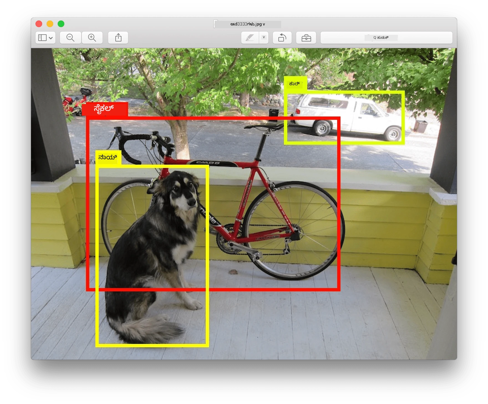
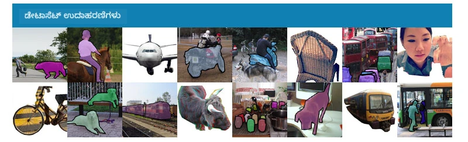
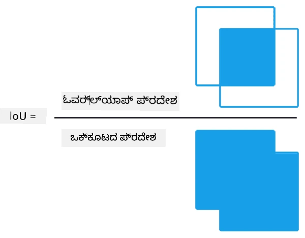
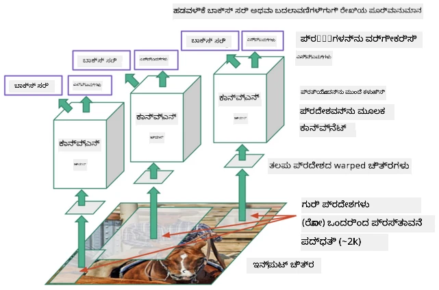
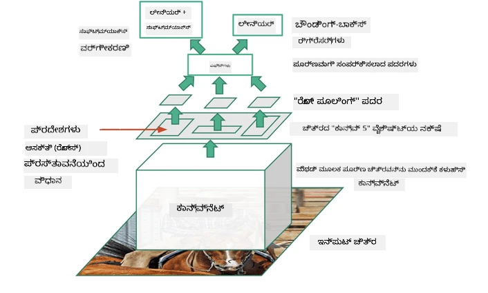
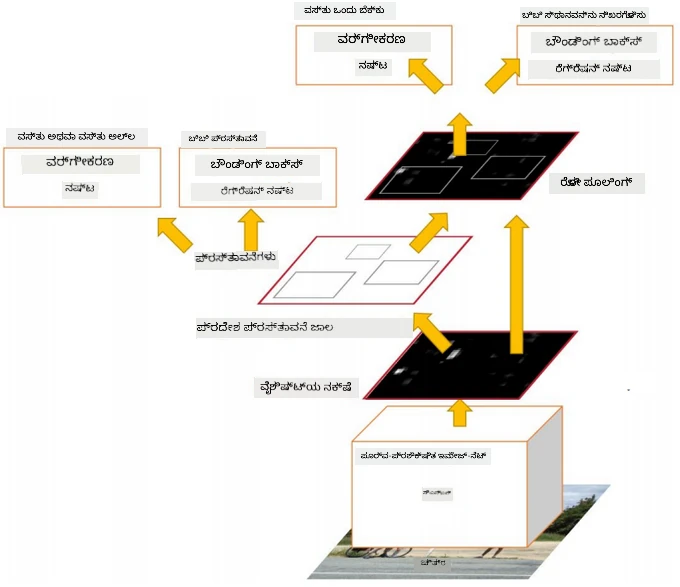
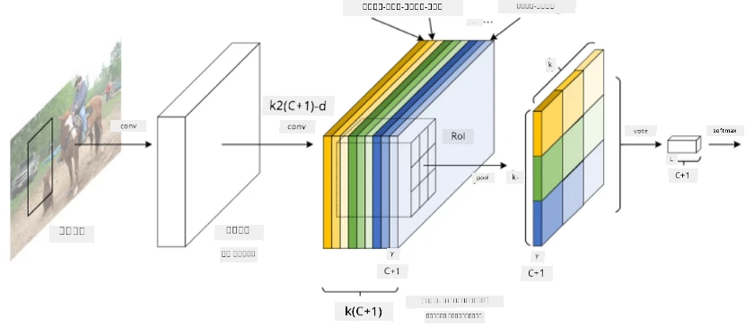
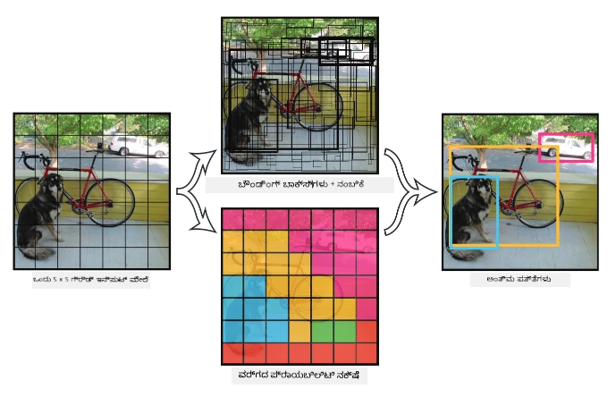

# ವಸ್ತು ಪತ್ತೆ

ನಾವು ಇದುವರೆಗೆ ನೋಡಿದ ಚಿತ್ರ ವರ್ಗೀಕರಣ ಮಾದರಿಗಳು ಒಂದು ಚಿತ್ರವನ್ನು ತೆಗೆದುಕೊಂಡು ವರ್ಗೀಕೃತ ಫಲಿತಾಂಶವನ್ನು ನೀಡುತ್ತವೆ, ಉದಾಹರಣೆಗೆ MNIST ಸಮಸ್ಯೆಯಲ್ಲಿ 'ಸಂಖ್ಯೆ' ವರ್ಗ. ಆದರೆ, ಅನೇಕ ಸಂದರ್ಭಗಳಲ್ಲಿ ನಾವು ಕೇವಲ ಚಿತ್ರದಲ್ಲಿ ವಸ್ತುಗಳಿರುವುದನ್ನು ತಿಳಿದುಕೊಳ್ಳುವುದಲ್ಲ, ಅವುಗಳ ನಿಖರ ಸ್ಥಳವನ್ನು ಕಂಡುಹಿಡಿಯಬೇಕಾಗುತ್ತದೆ. ಇದೇ ನಿಖರವಾಗಿ **ವಸ್ತು ಪತ್ತೆ**ಯ ಉದ್ದೇಶ.

## [ಪೂರ್ವ-ಪಾಠ ಪ್ರಶ್ನೋತ್ತರ](https://ff-quizzes.netlify.app/en/ai/quiz/21)

> ಚಿತ್ರ [YOLO v2 ವೆಬ್ ಸೈಟ್](https://pjreddie.com/darknet/yolov2/) ನಿಂದ

## ವಸ್ತು ಪತ್ತೆಗೆ ಸರಳ ವಿಧಾನ

ನಾವು ಒಂದು ಚಿತ್ರದಲ್ಲಿ ಬೆಕ್ಕನ್ನು ಹುಡುಕಬೇಕೆಂದು فرضಿಸಿದರೆ, ವಸ್ತು ಪತ್ತೆಗೆ ಅತ್ಯಂತ ಸರಳ ವಿಧಾನ ಹೀಗಿರಬಹುದು:

1. ಚಿತ್ರವನ್ನು ಹಲವಾರು ಟೈಲ್ಗಳಾಗಿ ವಿಭಜಿಸಿ
2. ಪ್ರತಿ ಟೈಲ್ನಲ್ಲಿ ಚಿತ್ರ ವರ್ಗೀಕರಣವನ್ನು ನಡೆಸಿ.
3. ಸಾಕಷ್ಟು ಉತ್ಸಾಹದೊಂದಿಗೆ ಫಲಿತಾಂಶ ನೀಡುವ ಟೈಲ್ಗಳನ್ನು ಆ ವಸ್ತು ಹೊಂದಿದೆ ಎಂದು ಪರಿಗಣಿಸಬಹುದು.

> *ಚಿತ್ರ [ಅಭ್ಯಾಸ ನೋಟ್ಬುಕ್](ObjectDetection-TF.ipynb) ನಿಂದ*

ಆದರೆ, ಈ ವಿಧಾನ ಅತ್ಯಂತ ಸೂಕ್ತವಲ್ಲ, ಏಕೆಂದರೆ ಇದು ವಸ್ತುವಿನ ಸುತ್ತುವರೆದ ಬಾಕ್ಸ್ ಅನ್ನು ಅತೀ ಅಸ್ಪಷ್ಟವಾಗಿ ಮಾತ್ರ ಗುರುತಿಸಲು ಸಾಧ್ಯವಾಗುತ್ತದೆ. ನಿಖರ ಸ್ಥಳವನ್ನು ಕಂಡುಹಿಡಿಯಲು, ನಾವು ಬಾಕ್ಸ್ ಗಳ ಸಂಯೋಜನೆಗಳನ್ನು ಊಹಿಸಲು **ರಿಗ್ರೆಷನ್** ಅನ್ನು ಬಳಸಬೇಕಾಗುತ್ತದೆ - ಮತ್ತು ಅದಕ್ಕಾಗಿ ವಿಶೇಷ ಡೇಟಾಸೆಟ್‌ಗಳು ಬೇಕಾಗುತ್ತವೆ.

## ವಸ್ತು ಪತ್ತೆಗೆ ರಿಗ್ರೆಷನ್

[ಈ ಬ್ಲಾಗ್ ಪೋಸ್ಟ್](https://towardsdatascience.com/object-detection-with-neural-networks-a4e2c46b4491) ಆಕಾರಗಳನ್ನು ಪತ್ತೆಮಾಡುವ ಬಗ್ಗೆ ಸುಲಭ ಪರಿಚಯ ನೀಡುತ್ತದೆ.

## ವಸ್ತು ಪತ್ತೆಗೆ ಡೇಟಾಸೆಟ್‌ಗಳು

ಈ ಕಾರ್ಯಕ್ಕಾಗಿ ನೀವು ಕೆಳಗಿನ ಡೇಟಾಸೆಟ್‌ಗಳನ್ನು ಕಾಣಬಹುದು:

* [PASCAL VOC](http://host.robots.ox.ac.uk/pascal/VOC/) - 20 ವರ್ಗಗಳು
* [COCO](http://cocodataset.org/#home) - ಸಾಮಾನ್ಯ ವಸ್ತುಗಳು ಸನ್ನಿವೇಶದಲ್ಲಿ. 80 ವರ್ಗಗಳು, ಸುತ್ತುವರೆದ ಬಾಕ್ಸ್‌ಗಳು ಮತ್ತು ವಿಭಾಗ ಚಿಹ್ನೆಗಳು

## ವಸ್ತು ಪತ್ತೆ ಮೌಲ್ಯಮಾಪನ

### ಸಂಧಿ ಮೇಲೆ ಏಕತೆ (Intersection over Union)

ಚಿತ್ರ ವರ್ಗೀಕರಣದಲ್ಲಿ ಆಲ್ಗಾರಿದಮ್ ಎಷ್ಟು ಚೆನ್ನಾಗಿ ಕಾರ್ಯನಿರ್ವಹಿಸುತ್ತದೆ ಎಂದು ಅಳೆಯುವುದು ಸುಲಭ, ಆದರೆ ವಸ್ತು ಪತ್ತೆಯಲ್ಲಿ ವರ್ಗದ ಸರಿಯಾದತೆ ಮತ್ತು ಸುತ್ತುವರೆದ ಬಾಕ್ಸ್ ನಿಖರತೆಯನ್ನು ಎರಡನ್ನೂ ಅಳೆಯಬೇಕಾಗುತ್ತದೆ. ನಂತರದದಕ್ಕಾಗಿ ನಾವು **Intersection over Union** (IoU) ಅನ್ನು ಬಳಸುತ್ತೇವೆ, ಇದು ಎರಡು ಬಾಕ್ಸ್‌ಗಳು (ಅಥವಾ ಎರಡು ಯಾವುದೇ ಪ್ರದೇಶಗಳು) ಎಷ್ಟು ಒಟ್ಟಿಗೆ ಬರುತ್ತವೆ ಎಂದು ಅಳೆಯುತ್ತದೆ.

> *ಚಿತ್ರ 2 [ಈ ಅದ್ಭುತ ಬ್ಲಾಗ್ ಪೋಸ್ಟ್](https://pyimagesearch.com/2016/11/07/intersection-over-union-iou-for-object-detection/) ನಿಂದ*

ಯೋಚನೆ ಸರಳ - ಎರಡು ಆಕಾರಗಳ ನಡುವಿನ ಸಂಧಿ ಪ್ರದೇಶವನ್ನು ಅವುಗಳ ಒಕ್ಕೂಟ ಪ್ರದೇಶದಿಂದ ಭಾಗಿಸಿ. ಎರಡು ಸಮಾನ ಪ್ರದೇಶಗಳಿಗೆ IoU 1 ಆಗಿರುತ್ತದೆ, ಸಂಪೂರ್ಣ ವಿಭಿನ್ನ ಪ್ರದೇಶಗಳಿಗೆ 0 ಆಗಿರುತ್ತದೆ. ಇತರ ಸಂದರ್ಭಗಳಲ್ಲಿ 0 ರಿಂದ 1 ರವರೆಗೆ ಬದಲಾಗುತ್ತದೆ. ಸಾಮಾನ್ಯವಾಗಿ ನಾವು IoU ಒಂದು ನಿರ್ದಿಷ್ಟ ಮೌಲ್ಯಕ್ಕಿಂತ ಮೇಲು ಇರುವ ಬಾಕ್ಸ್‌ಗಳನ್ನು ಮಾತ್ರ ಪರಿಗಣಿಸುತ್ತೇವೆ.

### ಸರಾಸರಿ ನಿಖರತೆ (Average Precision)

ನಾವು ಒಂದು ನಿರ್ದಿಷ್ಟ ವರ್ಗ $C$ ಅನ್ನು ಎಷ್ಟು ಚೆನ್ನಾಗಿ ಗುರುತಿಸಲಾಗಿದೆ ಎಂದು ಅಳೆಯಲು ಬಯಸಿದರೆ, ನಾವು **ಸರಾಸರಿ ನಿಖರತೆ** ಮೌಲ್ಯವನ್ನು ಬಳಸುತ್ತೇವೆ, ಇದು ಹೀಗಾಗಿ ಲೆಕ್ಕಿಸಲಾಗುತ್ತದೆ:

1. ಪೃಥ್ವಿ-ಪುನಃಪರಿಶೀಲನೆ (Precision-Recall) ವಕ್ರವು ಪತ್ತೆ ಮಿತಿ ಮೌಲ್ಯ (0 ರಿಂದ 1) ಆಧಾರಿತ ನಿಖರತೆಯನ್ನು ತೋರಿಸುತ್ತದೆ.
2. ಮಿತಿಯ ಆಧಾರದಲ್ಲಿ, ಚಿತ್ರದಲ್ಲಿ ಹೆಚ್ಚು ಅಥವಾ ಕಡಿಮೆ ವಸ್ತುಗಳು ಪತ್ತೆಯಾಗುತ್ತವೆ ಮತ್ತು ನಿಖರತೆ ಮತ್ತು ಪುನಃಪರಿಶೀಲನೆ ಮೌಲ್ಯಗಳು ಬದಲಾಗುತ್ತವೆ.
3. ವಕ್ರವು ಹೀಗೆ ಕಾಣುತ್ತದೆ:

> *ಚಿತ್ರ [NeuroWorkshop](http://github.com/shwars/NeuroWorkshop) ನಿಂದ*

ನಿರ್ದಿಷ್ಟ ವರ್ಗ $C$ ಗೆ ಸರಾಸರಿ ನಿಖರತೆ ಈ ವಕ್ರದ ಕೆಳಗಿನ ಪ್ರದೇಶ. ಹೆಚ್ಚು ನಿಖರವಾಗಿ, ಪುನಃಪರಿಶೀಲನೆ ಅಕ್ಷವನ್ನು ಸಾಮಾನ್ಯವಾಗಿ 10 ಭಾಗಗಳಾಗಿ ವಿಭಜಿಸಲಾಗುತ್ತದೆ ಮತ್ತು ನಿಖರತೆಯನ್ನು ಆ ಎಲ್ಲಾ ಬಿಂದುಗಳ ಮೇಲೆ ಸರಾಸರಿ ಮಾಡಲಾಗುತ್ತದೆ:

$$
AP = {1\over11}\sum_{i=0}^{10}\mbox{Precision}(\mbox{Recall}={i\over10})
$$

### AP ಮತ್ತು IoU

ನಾವು IoU ನಿರ್ದಿಷ್ಟ ಮೌಲ್ಯಕ್ಕಿಂತ ಮೇಲು ಇರುವ ಪತ್ತೆಗಳನ್ನು ಮಾತ್ರ ಪರಿಗಣಿಸುತ್ತೇವೆ. ಉದಾಹರಣೆಗೆ, PASCAL VOC ಡೇಟಾಸೆಟ್‌ನಲ್ಲಿ ಸಾಮಾನ್ಯವಾಗಿ $\mbox{IoU Threshold} = 0.5$ ಅನ್ನು ಬಳಸಲಾಗುತ್ತದೆ, ಆದರೆ COCO ನಲ್ಲಿ AP ವಿವಿಧ $\mbox{IoU Threshold}$ ಮೌಲ್ಯಗಳಿಗೆ ಅಳೆಯಲಾಗುತ್ತದೆ.

> *ಚಿತ್ರ [NeuroWorkshop](http://github.com/shwars/NeuroWorkshop) ನಿಂದ*

### ಸರಾಸರಿ ಸರಾಸರಿ ನಿಖರತೆ - mAP

ವಸ್ತು ಪತ್ತೆಗೆ ಮುಖ್ಯ ಮೌಲ್ಯಮಾಪನವನ್ನು **ಸರಾಸರಿ ಸರಾಸರಿ ನಿಖರತೆ** ಅಥವಾ **mAP** ಎಂದು ಕರೆಯುತ್ತಾರೆ. ಇದು ಎಲ್ಲಾ ವಸ್ತು ವರ್ಗಗಳ ಸರಾಸರಿ ನಿಖರತೆಯ ಸರಾಸರಿ ಮೌಲ್ಯ, ಮತ್ತು ಕೆಲವೊಮ್ಮೆ $\mbox{IoU Threshold}$ ಮೇಲೆ ಸಹ ಸರಾಸರಿ ಮಾಡಲಾಗುತ್ತದೆ. ಹೆಚ್ಚಿನ ವಿವರಗಳಿಗೆ, **mAP** ಲೆಕ್ಕಾಚಾರದ ಪ್ರಕ್ರಿಯೆಯನ್ನು [ಈ ಬ್ಲಾಗ್ ಪೋಸ್ಟ್](https://medium.com/@timothycarlen/understanding-the-map-evaluation-metric-for-object-detection-a07fe6962cf3)) ಮತ್ತು [ಇಲ್ಲಿ ಕೋಡ್ ಉದಾಹರಣೆಗಳೊಂದಿಗೆ](https://gist.github.com/tarlen5/008809c3decf19313de216b9208f3734) ನೋಡಬಹುದು.

## ವಿಭಿನ್ನ ವಸ್ತು ಪತ್ತೆ ವಿಧಾನಗಳು

ವಸ್ತು ಪತ್ತೆ ಆಲ್ಗಾರಿದಮ್‌ಗಳು ಎರಡು ಪ್ರಮುಖ ವರ್ಗಗಳಿವೆ:

* **ಪ್ರದೇಶ ಪ್ರಸ್ತಾವನೆ ಜಾಲಗಳು** (R-CNN, ಫಾಸ್ಟ್ R-CNN, ಫಾಸ್ಟರ್ R-CNN). ಮುಖ್ಯ ಯೋಚನೆ **ಪ್ರದೇಶ ಆಸಕ್ತಿಗಳು** (ROI) ರಚಿಸಿ ಅವುಗಳ ಮೇಲೆ CNN ಅನ್ನು ಚಲಾಯಿಸಿ, ಗರಿಷ್ಠ ಉತ್ಸಾಹವನ್ನು ಹುಡುಕುವುದು. ಇದು ಸರಳ ವಿಧಾನಕ್ಕೆ ಹೋಲುವದು, ಆದರೆ ROI ಗಳು ಹೆಚ್ಚು ಬುದ್ಧಿವಂತಿಕೆಯಿಂದ ರಚಿಸಲಾಗುತ್ತದೆ. ಈ ವಿಧಾನಗಳ ಪ್ರಮುಖ ದೋಷವೆಂದರೆ ಅವು ನಿಧಾನವಾಗಿವೆ, ಏಕೆಂದರೆ ಚಿತ್ರದಲ್ಲಿ CNN ವರ್ಗೀಕರಣವನ್ನು ಹಲವಾರು ಬಾರಿ ನಡೆಸಬೇಕಾಗುತ್ತದೆ.
* **ಒಂದು-ಪಾಸ್** (YOLO, SSD, RetinaNet) ವಿಧಾನಗಳು. ಈ ವಾಸ್ತುಶಿಲ್ಪಗಳಲ್ಲಿ ನಾವು ಜಾಲವನ್ನು ಒಂದು ಪಾಸ್‌ನಲ್ಲಿ ವರ್ಗಗಳು ಮತ್ತು ROI ಗಳನ್ನು ಊಹಿಸಲು ವಿನ್ಯಾಸಗೊಳಿಸುತ್ತೇವೆ.

### R-CNN: ಪ್ರದೇಶ ಆಧಾರಿತ CNN

[R-CNN](http://islab.ulsan.ac.kr/files/announcement/513/rcnn_pami.pdf) [Selective Search](http://www.huppelen.nl/publications/selectiveSearchDraft.pdf) ಬಳಸಿ ROI ಪ್ರದೇಶಗಳ ಹೈರಾರ್ಕಿಕ ರಚನೆಯನ್ನು ರಚಿಸುತ್ತದೆ, ಅವುಗಳನ್ನು ನಂತರ CNN ವೈಶಿಷ್ಟ್ಯ ಸಂಗ್ರಾಹಕ ಮತ್ತು SVM ವರ್ಗೀಕರಣಕಾರರ ಮೂಲಕ ವಸ್ತು ವರ್ಗವನ್ನು ನಿರ್ಧರಿಸಲು ಮತ್ತು ರೇಖೀಯ ರಿಗ್ರೆಷನ್ ಮೂಲಕ *ಸುತ್ತುವರೆದ ಬಾಕ್ಸ್* ಸಂಯೋಜನೆಗಳನ್ನು ಊಹಿಸಲು ಬಳಸಲಾಗುತ್ತದೆ. [ಅಧಿಕೃತ ಪೇಪರ್](https://arxiv.org/pdf/1506.01497v1.pdf)

> *ಚಿತ್ರ van de Sande et al. ICCV’11 ನಿಂದ*

> *ಚಿತ್ರಗಳು [ಈ ಬ್ಲಾಗ್](https://towardsdatascience.com/r-cnn-fast-r-cnn-faster-r-cnn-yolo-object-detection-algorithms-36d53571365e) ನಿಂದ*

### F-RCNN - ಫಾಸ್ಟ್ R-CNN

ಈ ವಿಧಾನ R-CNN ಗೆ ಸಮಾನ, ಆದರೆ ಪ್ರದೇಶಗಳನ್ನು ಕನ್ವಲ್ಯೂಷನ್ ಲೇಯರ್‌ಗಳ ನಂತರ ನಿರ್ಧರಿಸಲಾಗುತ್ತದೆ.

> ಚಿತ್ರ [ಅಧಿಕೃತ ಪೇಪರ್](https://www.cv-foundation.org/openaccess/content_iccv_2015/papers/Girshick_Fast_R-CNN_ICCV_2015_paper.pdf), [arXiv](https://arxiv.org/pdf/1504.08083.pdf), 2015 ನಿಂದ

### ಫಾಸ್ಟರ್ R-CNN

ಈ ವಿಧಾನದಲ್ಲಿ ಮುಖ್ಯ ಯೋಚನೆ ROI ಗಳನ್ನು ಊಹಿಸಲು ನ್ಯೂರಲ್ ನೆಟ್‌ವರ್ಕ್ ಬಳಸುವುದು - ಇದನ್ನು *ಪ್ರದೇಶ ಪ್ರಸ್ತಾವನೆ ಜಾಲ* ಎಂದು ಕರೆಯುತ್ತಾರೆ. [ಪೇಪರ್](https://arxiv.org/pdf/1506.01497.pdf), 2016

> ಚಿತ್ರ [ಅಧಿಕೃತ ಪೇಪರ್](https://arxiv.org/pdf/1506.01497.pdf) ನಿಂದ

### R-FCN: ಪ್ರದೇಶ ಆಧಾರಿತ ಸಂಪೂರ್ಣ ಕನ್ವಲ್ಯೂಷನಲ್ ಜಾಲ

ಈ ಆಲ್ಗಾರಿದಮ್ ಫಾಸ್ಟರ್ R-CNN ಗಿಂತಲೂ ವೇಗವಾಗಿದೆ. ಮುಖ್ಯ ಯೋಚನೆ ಹೀಗಿದೆ:

1. ResNet-101 ಬಳಸಿ ವೈಶಿಷ್ಟ್ಯಗಳನ್ನು ಸಂಗ್ರಹಿಸುವುದು
2. ವೈಶಿಷ್ಟ್ಯಗಳನ್ನು **ಸ್ಥಾನ-ಸಂವೇದನಾತ್ಮಕ ಸ್ಕೋರ್ ನಕ್ಷೆ** ಮೂಲಕ ಪ್ರಕ್ರಿಯೆಗೊಳಿಸುವುದು. $C$ ವರ್ಗಗಳ ಪ್ರತಿಯೊಂದು ವಸ್ತುವನ್ನು $k\times k$ ಪ್ರದೇಶಗಳಾಗಿ ವಿಭಜಿಸಿ, ವಸ್ತುಗಳ ಭಾಗಗಳನ್ನು ಊಹಿಸಲು ತರಬೇತಿ ನೀಡಲಾಗುತ್ತದೆ.
3. $k\times k$ ಪ್ರದೇಶಗಳ ಪ್ರತಿಯೊಂದು ಭಾಗಕ್ಕೆ ಎಲ್ಲಾ ಜಾಲಗಳು ವಸ್ತು ವರ್ಗಗಳಿಗೆ ಮತದಾನ ಮಾಡುತ್ತವೆ, ಗರಿಷ್ಠ ಮತ ಪಡೆದ ವಸ್ತು ವರ್ಗ ಆಯ್ಕೆಮಾಡಲಾಗುತ್ತದೆ.

> ಚಿತ್ರ [ಅಧಿಕೃತ ಪೇಪರ್](https://arxiv.org/abs/1605.06409) ನಿಂದ

### YOLO - You Only Look Once

YOLO ಒಂದು ರಿಯಲ್-ಟೈಮ್ ಒಂದು-ಪಾಸ್ ಆಲ್ಗಾರಿದಮ್. ಮುಖ್ಯ ಯೋಚನೆ ಹೀಗಿದೆ:

 * ಚಿತ್ರವನ್ನು $S\times S$ ಪ್ರದೇಶಗಳಾಗಿ ವಿಭಜಿಸುವುದು
 * ಪ್ರತಿ ಪ್ರದೇಶಕ್ಕೆ, **CNN** $n$ ಸಾಧ್ಯವಿರುವ ವಸ್ತುಗಳನ್ನು, *ಸುತ್ತುವರೆದ ಬಾಕ್ಸ್* ಸಂಯೋಜನೆಗಳನ್ನು ಮತ್ತು *ನಂಬಿಕೆ* = *ಸಂಭಾವ್ಯತೆ* * IoU ಅನ್ನು ಊಹಿಸುವುದು.

 

> ಚಿತ್ರ [ಅಧಿಕೃತ ಪೇಪರ್](https://arxiv.org/abs/1506.02640) ನಿಂದ

### ಇತರೆ ಆಲ್ಗಾರಿದಮ್‌ಗಳು

* RetinaNet: [ಅಧಿಕೃತ ಪೇಪರ್](https://arxiv.org/abs/1708.02002)
   - [PyTorch ಅನುಷ್ಠಾನ Torchvision ನಲ್ಲಿ](https://pytorch.org/vision/stable/_modules/torchvision/models/detection/retinanet.html)
   - [Keras ಅನುಷ್ಠಾನ](https://github.com/fizyr/keras-retinanet)
   - [RetinaNet ನೊಂದಿಗೆ ವಸ್ತು ಪತ್ತೆ](https://keras.io/examples/vision/retinanet/) Keras ಉದಾಹರಣೆಗಳಲ್ಲಿ
* SSD (Single Shot Detector): [ಅಧಿಕೃತ ಪೇಪರ್](https://arxiv.org/abs/1512.02325)

## ✍️ ಅಭ್ಯಾಸಗಳು: ವಸ್ತು ಪತ್ತೆ

ನಿಮ್ಮ ಅಧ್ಯಯನವನ್ನು ಈ ನೋಟ್ಬುಕ್‌ನಲ್ಲಿ ಮುಂದುವರಿಸಿ:

[ObjectDetection.ipynb](ObjectDetection.ipynb)

## ಸಾರಾಂಶ

ಈ ಪಾಠದಲ್ಲಿ ನೀವು ವಸ್ತು ಪತ್ತೆ ಸಾಧಿಸಲು ವಿವಿಧ ವಿಧಾನಗಳನ್ನು ಸಂಕ್ಷಿಪ್ತವಾಗಿ ಪರಿಚಯಿಸಿಕೊಂಡಿದ್ದೀರಿ!

## 🚀 ಸವಾಲು

YOLO ಬಗ್ಗೆ ಈ ಲೇಖನಗಳು ಮತ್ತು ನೋಟ್ಬುಕ್‌ಗಳನ್ನು ಓದಿ ಮತ್ತು ಸ್ವತಃ ಪ್ರಯತ್ನಿಸಿ

* [ಉತ್ತಮ ಬ್ಲಾಗ್ ಪೋಸ್ಟ್](https://www.analyticsvidhya.com/blog/2018/12/practical-guide-object-detection-yolo-framewor-python/) YOLO ಕುರಿತು ವಿವರಿಸುವುದು
 * [ಅಧಿಕೃತ ಸೈಟ್](https://pjreddie.com/darknet/yolo/)
 * Yolo: [Keras ಅನುಷ್ಠಾನ](https://github.com/experiencor/keras-yolo2), [ಹಂತ-ಹಂತ ನೋಟ್ಬುಕ್](https://github.com/experiencor/basic-yolo-keras/blob/master/Yolo%20Step-by-Step.ipynb)
 * Yolo v2: [Keras ಅನುಷ್ಠಾನ](https://github.com/experiencor/keras-yolo2), [ಹಂತ-ಹಂತ ನೋಟ್ಬುಕ್](https://github.com/experiencor/keras-yolo2/blob/master/Yolo%20Step-by-Step.ipynb)

## [ಪೋಸ್ಟ್-ಪಾಠ ಪ್ರಶ್ನೋತ್ತರ](https://ff-quizzes.netlify.app/en/ai/quiz/22)

## ವಿಮರ್ಶೆ ಮತ್ತು ಸ್ವಯಂ ಅಧ್ಯಯನ

* [ವಸ್ತು ಪತ್ತೆ](https://tjmachinelearning.com/lectures/1718/obj/) - ನಿಖಿಲ್ ಸರ್ಡಾನಾ
* [ವಸ್ತು ಪತ್ತೆ ಆಲ್ಗಾರಿದಮ್‌ಗಳ ಉತ್ತಮ ಹೋಲಿಕೆ](https://lilianweng.github.io/lil-log/2018/12/27/object-detection-part-4.html)
* [ವಸ್ತು ಪತ್ತೆಗೆ ಡೀಪ್ ಲರ್ನಿಂಗ್ ಆಲ್ಗಾರಿದಮ್‌ಗಳ ವಿಮರ್ಶೆ](https://medium.com/comet-app/review-of-deep-learning-algorithms-for-object-detection-c1f3d437b852)
* [ಮೂಲ ವಸ್ತು ಪತ್ತೆ ಆಲ್ಗಾರಿದಮ್‌ಗಳಿಗೆ ಹಂತ-ಹಂತ ಪರಿಚಯ](https://www.analyticsvidhya.com/blog/2018/10/a-step-by-step-introduction-to-the-basic-object-detection-algorithms-part-1/)
* [Python ನಲ್ಲಿ ಫಾಸ್ಟರ್ R-CNN ಅನುಷ್ಠಾನ](https://www.analyticsvidhya.com/blog/2018/11/implementation-faster-r-cnn-python-object-detection/)

## [ಕಾರ್ಯ: ವಸ್ತು ಪತ್ತೆ](lab/README.md)

---

<!-- CO-OP TRANSLATOR DISCLAIMER START -->
**ಅಸ್ವೀಕರಣ**:  
ಈ ದಸ್ತಾವೇಜು AI ಅನುವಾದ ಸೇವೆ [Co-op Translator](https://github.com/Azure/co-op-translator) ಬಳಸಿ ಅನುವಾದಿಸಲಾಗಿದೆ. ನಾವು ನಿಖರತೆಯಿಗಾಗಿ ಪ್ರಯತ್ನಿಸುತ್ತಿದ್ದರೂ, ಸ್ವಯಂಚಾಲಿತ ಅನುವಾದಗಳಲ್ಲಿ ತಪ್ಪುಗಳು ಅಥವಾ ಅಸತ್ಯತೆಗಳು ಇರಬಹುದು ಎಂದು ದಯವಿಟ್ಟು ಗಮನಿಸಿ. ಮೂಲ ಭಾಷೆಯಲ್ಲಿರುವ ಮೂಲ ದಸ್ತಾವೇಜನ್ನು ಅಧಿಕೃತ ಮೂಲವೆಂದು ಪರಿಗಣಿಸಬೇಕು. ಪ್ರಮುಖ ಮಾಹಿತಿಗಾಗಿ, ವೃತ್ತಿಪರ ಮಾನವ ಅನುವಾದವನ್ನು ಶಿಫಾರಸು ಮಾಡಲಾಗುತ್ತದೆ. ಈ ಅನುವಾದ ಬಳಕೆಯಿಂದ ಉಂಟಾಗುವ ಯಾವುದೇ ತಪ್ಪು ಅರ್ಥಮಾಡಿಕೊಳ್ಳುವಿಕೆ ಅಥವಾ ತಪ್ಪು ವಿವರಣೆಗಳಿಗೆ ನಾವು ಹೊಣೆಗಾರರಾಗುವುದಿಲ್ಲ.
<!-- CO-OP TRANSLATOR DISCLAIMER END -->