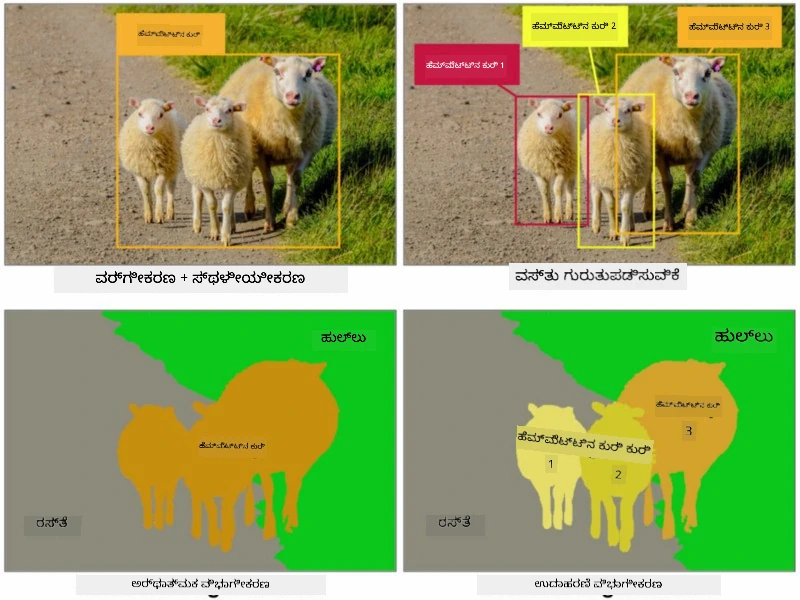
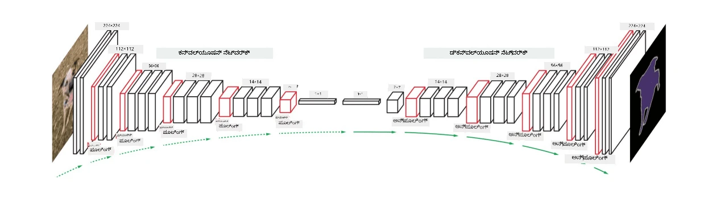
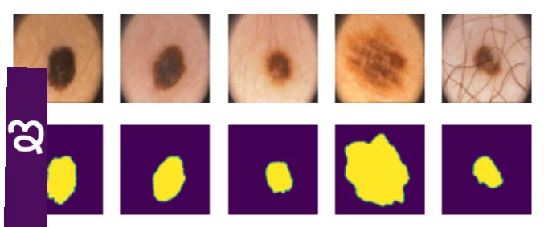

# ವಿಭಾಗೀಕರಣ

ನಾವು ಹಿಂದಿನ ಅಧ್ಯಾಯದಲ್ಲಿ ವಸ್ತು ಪತ್ತೆಮಾಡುವಿಕೆ (Object Detection) ಬಗ್ಗೆ ಕಲಿತಿದ್ದೇವೆ, ಇದು ಚಿತ್ರದಲ್ಲಿ ವಸ್ತುಗಳ *ಬೌಂಡಿಂಗ್ ಬಾಕ್ಸ್*ಗಳನ್ನು ಊಹಿಸುವ ಮೂಲಕ ಅವುಗಳ ಸ್ಥಳವನ್ನು ಕಂಡುಹಿಡಿಯಲು ಸಹಾಯ ಮಾಡುತ್ತದೆ. ಆದರೆ, ಕೆಲವು ಕಾರ್ಯಗಳಿಗೆ ನಮಗೆ ಬೌಂಡಿಂಗ್ ಬಾಕ್ಸ್‌ಗಳಷ್ಟೇ ಅಲ್ಲ, ಹೆಚ್ಚು ನಿಖರವಾದ ವಸ್ತು ಸ್ಥಳೀಕರಣವೂ ಬೇಕಾಗುತ್ತದೆ. ಈ ಕಾರ್ಯವನ್ನು **ವಿಭಾಗೀಕರಣ** ಎಂದು ಕರೆಯುತ್ತಾರೆ.

## [ಪೂರ್ವ-ಪಾಠ ಪ್ರಶ್ನೋತ್ತರ](https://ff-quizzes.netlify.app/en/ai/quiz/23)

ವಿಭಾಗೀಕರಣವನ್ನು **ಪಿಕ್ಸೆಲ್ ವರ್ಗೀಕರಣ** ಎಂದು ನೋಡಬಹುದು, ಅಂದರೆ ಚಿತ್ರದಲ್ಲಿನ **ಪ್ರತಿ** ಪಿಕ್ಸೆಲ್‌ನ ವರ್ಗವನ್ನು ಊಹಿಸಬೇಕು (*ಹಿನ್ನೆಲೆ* ಒಂದು ವರ್ಗವಾಗಿರುತ್ತದೆ). ವಿಭಾಗೀಕರಣಕ್ಕೆ ಎರಡು ಪ್ರಮುಖ ಅಲ್ಗಾರಿದಮ್ಗಳು ಇವೆ:

* **ಸಾಮಾನ್ಯ ವಿಭಾಗೀಕರಣ** ಪಿಕ್ಸೆಲ್‌ನ ವರ್ಗವನ್ನು ಮಾತ್ರ ಹೇಳುತ್ತದೆ, ಮತ್ತು ಒಂದೇ ವರ್ಗದ ವಿಭಿನ್ನ ವಸ್ತುಗಳನ್ನು ವಿಭಿನ್ನವಾಗಿ ಗುರುತಿಸುವುದಿಲ್ಲ
* **ಘಟಕ ವಿಭಾಗೀಕರಣ** ವರ್ಗಗಳನ್ನು ವಿಭಿನ್ನ ಘಟಕಗಳಾಗಿ ವಿಭಜಿಸುತ್ತದೆ.

ಘಟಕ ವಿಭಾಗೀಕರಣದಲ್ಲಿ, ಈ ಕುರಿಗಳು ವಿಭಿನ್ನ ವಸ್ತುಗಳಾಗಿವೆ, ಆದರೆ ಸಾಮಾನ್ಯ ವಿಭಾಗೀಕರಣದಲ್ಲಿ ಎಲ್ಲಾ ಕುರಿಗಳು ಒಂದೇ ವರ್ಗದಿಂದ ಪ್ರತಿನಿಧಿಸಲಾಗುತ್ತವೆ.

> ಚಿತ್ರ [ಈ ಬ್ಲಾಗ್ ಪೋಸ್ಟ್](https://nirmalamurali.medium.com/image-classification-vs-semantic-segmentation-vs-instance-segmentation-625c33a08d50) ನಿಂದ

ವಿಭಾಗೀಕರಣಕ್ಕೆ ವಿಭಿನ್ನ ನ್ಯೂರಲ್ ವಾಸ್ತುಶಿಲ್ಪಗಳು ಇವೆ, ಆದರೆ ಅವುಗಳ ರಚನೆ ಒಂದೇ ರೀತಿಯದ್ದಾಗಿರುತ್ತದೆ. ಒಂದು ರೀತಿಯಲ್ಲಿ, ಇದು ನೀವು ಹಿಂದಿನ ಅಧ್ಯಾಯದಲ್ಲಿ ಕಲಿತ ಆ್ಯಟೋಎನ್‌ಕೋಡರ್‌ಗೆ ಹೋಲುತ್ತದೆ, ಆದರೆ ಮೂಲ ಚಿತ್ರವನ್ನು ವಿಭಜಿಸುವ ಬದಲು, ನಮ್ಮ ಗುರಿ **ಮಾಸ್ಕ್** ಅನ್ನು ವಿಭಜಿಸುವುದು. ಆದ್ದರಿಂದ, ವಿಭಾಗೀಕರಣ ಜಾಲಕದಲ್ಲಿ ಕೆಳಗಿನ ಭಾಗಗಳಿರುತ್ತವೆ:

* **ಎನ್‌ಕೋಡರ್** ಇನ್‌ಪುಟ್ ಚಿತ್ರದಿಂದ ಲಕ್ಷಣಗಳನ್ನು ತೆಗೆದುಕೊಳ್ಳುತ್ತದೆ
* **ಡಿಕೋಡರ್** ಆ ಲಕ್ಷಣಗಳನ್ನು **ಮಾಸ್ಕ್ ಚಿತ್ರ** ಆಗಿ ಪರಿವರ್ತಿಸುತ್ತದೆ, ಅದೇ ಗಾತ್ರ ಮತ್ತು ವರ್ಗಗಳ ಸಂಖ್ಯೆಗೆ ಹೊಂದಿಕೊಂಡ ಚಾನೆಲ್‌ಗಳೊಂದಿಗೆ.

> ಚಿತ್ರ [ಈ ಪ್ರಕಟಣೆಯಿಂದ](https://arxiv.org/pdf/2001.05566.pdf)

ವಿಭಾಗೀಕರಣಕ್ಕೆ ಬಳಸುವ ನಷ್ಟ ಕಾರ್ಯವನ್ನು ವಿಶೇಷವಾಗಿ ಉಲ್ಲೇಖಿಸಬೇಕು. ಸಾಂಪ್ರದಾಯಿಕ ಆ್ಯಟೋಎನ್‌ಕೋಡರ್‌ಗಳನ್ನು ಬಳಸುವಾಗ, ಎರಡು ಚಿತ್ರಗಳ ನಡುವಿನ ಸಾದೃಶ್ಯವನ್ನು ಅಳೆಯಬೇಕಾಗುತ್ತದೆ, ಮತ್ತು ಅದಕ್ಕೆ ಸರಾಸರಿ ಚದರ ದೋಷ (MSE) ಬಳಸಬಹುದು. ವಿಭಾಗೀಕರಣದಲ್ಲಿ, ಗುರಿ ಮಾಸ್ಕ್ ಚಿತ್ರದಲ್ಲಿನ ಪ್ರತಿ ಪಿಕ್ಸೆಲ್ ವರ್ಗ ಸಂಖ್ಯೆಯನ್ನು ಪ್ರತಿನಿಧಿಸುತ್ತದೆ (ಮೂರುನೇ ಆಯಾಮದಲ್ಲಿ ಒನ್-ಹಾಟ್ ಎನ್‌ಕೋಡಿಂಗ್ ಆಗಿದೆ), ಆದ್ದರಿಂದ ವರ್ಗೀಕರಣಕ್ಕೆ ವಿಶೇಷ ನಷ್ಟ ಕಾರ್ಯಗಳನ್ನು ಬಳಸಬೇಕು - ಕ್ರಾಸ್-ಎಂಟ್ರೋಪಿ ನಷ್ಟ, ಎಲ್ಲಾ ಪಿಕ್ಸೆಲ್‌ಗಳ ಮೇಲೆ ಸರಾಸರಿ. ಮಾಸ್ಕ್ ಬೈನರಿ ಆಗಿದ್ದರೆ - **ಬೈನರಿ ಕ್ರಾಸ್-ಎಂಟ್ರೋಪಿ ನಷ್ಟ** (BCE) ಬಳಸಲಾಗುತ್ತದೆ.

> ✅ ಒನ್-ಹಾಟ್ ಎನ್‌ಕೋಡಿಂಗ್ ಎಂದರೆ ವರ್ಗ ಲೇಬಲ್ ಅನ್ನು ವರ್ಗಗಳ ಸಂಖ್ಯೆಗೆ ಸಮಾನವಾದ ದೈರ್ಘ್ಯದ ವೆಕ್ಟರ್ ಆಗಿ ಎನ್‌ಕೋಡ್ ಮಾಡುವ ವಿಧಾನ. ಈ ತಂತ್ರಜ್ಞಾನ ಕುರಿತು [ಈ ಲೇಖನ](https://datagy.io/sklearn-one-hot-encode/) ನೋಡಿ.

## ವೈದ್ಯಕೀಯ ಚಿತ್ರಣಕ್ಕಾಗಿ ವಿಭಾಗೀಕರಣ

ಈ ಪಾಠದಲ್ಲಿ, ನಾವು ಮಾನವ ನೇವಿ (ಮೋಲೆಗಳು ಎಂದು ಸಹ ಕರೆಯಲ್ಪಡುವ)ಗಳನ್ನು ವೈದ್ಯಕೀಯ ಚಿತ್ರಗಳಲ್ಲಿ ಗುರುತಿಸಲು ಜಾಲಕವನ್ನು ತರಬೇತುಗೊಳಿಸುವ ಮೂಲಕ ವಿಭಾಗೀಕರಣವನ್ನು ಪ್ರಾಯೋಗಿಕವಾಗಿ ನೋಡೋಣ. ನಾವು <a href="https://www.fc.up.pt/addi/ph2%20database.html">PH2 ಡೇಟಾಬೇಸ್</a> ಅನ್ನು ಡರ್ಮೋಸ್ಕೋಪಿ ಚಿತ್ರಗಳ ಮೂಲವಾಗಿ ಬಳಸಲಿದ್ದೇವೆ. ಈ ಡೇಟಾಸೆಟ್‌ನಲ್ಲಿ ಮೂರು ವರ್ಗಗಳ 200 ಚಿತ್ರಗಳಿವೆ: ಸಾಮಾನ್ಯ ನೇವಿ, ಅಸಾಮಾನ್ಯ ನೇವಿ, ಮತ್ತು ಮೆಲಾನೋಮಾ. ಎಲ್ಲಾ ಚಿತ್ರಗಳಿಗೂ ನೇವಿಯನ್ನು ಸುತ್ತುವರಿದ **ಮಾಸ್ಕ್** ಕೂಡ ಇದೆ.

> ✅ ಈ ತಂತ್ರಜ್ಞಾನ ವೈದ್ಯಕೀಯ ಚಿತ್ರಣಕ್ಕೆ ವಿಶೇಷವಾಗಿ ಸೂಕ್ತವಾಗಿದೆ, ಆದರೆ ನೀವು ಇನ್ನೇನು ನೈಜ ಜಗತ್ತಿನ ಅನ್ವಯಗಳನ್ನು ಊಹಿಸಬಹುದು?

> ಚಿತ್ರ PH2 ಡೇಟಾಬೇಸ್‌ನಿಂದ

ನಾವು ಯಾವುದೇ ನೇವಿಯನ್ನು ಅದರ ಹಿನ್ನೆಲೆಯಿಂದ ವಿಭಜಿಸಲು ಮಾದರಿಯನ್ನು ತರಬೇತುಗೊಳಿಸುವೆವು.

## ✍️ ಅಭ್ಯಾಸಗಳು: ಸಾಮಾನ್ಯ ವಿಭಾಗೀಕರಣ

ಕೆಳಗಿನ ನೋಟ್ಬುಕ್‌ಗಳನ್ನು ತೆರೆಯಿರಿ ಮತ್ತು ವಿಭಿನ್ನ ಸಾಮಾನ್ಯ ವಿಭಾಗೀಕರಣ ವಾಸ್ತುಶಿಲ್ಪಗಳ ಬಗ್ಗೆ ಹೆಚ್ಚು ತಿಳಿದುಕೊಳ್ಳಿ, ಅವುಗಳೊಂದಿಗೆ ಅಭ್ಯಾಸ ಮಾಡಿ, ಮತ್ತು ಅವುಗಳನ್ನು ಕಾರ್ಯನಿರ್ವಹಿಸುತ್ತಿರುವುದನ್ನು ನೋಡಿ.

* [ಸಾಮಾನ್ಯ ವಿಭಾಗೀಕರಣ ಪೈಟಾರ್ಚ್](SemanticSegmentationPytorch.ipynb)
* [ಸಾಮಾನ್ಯ ವಿಭಾಗೀಕರಣ ಟೆನ್ಸರ್‌ಫ್ಲೋ](SemanticSegmentationTF.ipynb)

## [ಪೋಸ್ಟ್-ಪಾಠ ಪ್ರಶ್ನೋತ್ತರ](https://ff-quizzes.netlify.app/en/ai/quiz/24)

## ಸಾರಾಂಶ

ವಿಭಾಗೀಕರಣವು ಚಿತ್ರ ವರ್ಗೀಕರಣಕ್ಕೆ ಅತ್ಯಂತ ಶಕ್ತಿಶಾಲಿ ತಂತ್ರವಾಗಿದೆ, ಬೌಂಡಿಂಗ್ ಬಾಕ್ಸ್‌ಗಳಿಗಿಂತ ಮುಂದೆ ಹೋಗಿ ಪಿಕ್ಸೆಲ್ ಮಟ್ಟದ ವರ್ಗೀಕರಣವನ್ನು ಮಾಡುತ್ತದೆ. ಇದು ವೈದ್ಯಕೀಯ ಚಿತ್ರಣ ಸೇರಿದಂತೆ ಅನೇಕ ಅನ್ವಯಗಳಲ್ಲಿ ಬಳಸಲಾಗುತ್ತದೆ.

## 🚀 ಸವಾಲು

ದೇಹ ವಿಭಾಗೀಕರಣವು ಜನರ ಚಿತ್ರಗಳೊಂದಿಗೆ ಮಾಡಬಹುದಾದ ಸಾಮಾನ್ಯ ಕಾರ್ಯಗಳಲ್ಲಿ ಒಂದಾಗಿದೆ. ಇನ್ನೊಂದು ಪ್ರಮುಖ ಕಾರ್ಯಗಳು **ಎಲುಬು ರಚನೆ ಪತ್ತೆಮಾಡುವುದು** ಮತ್ತು **ಸ್ಥಿತಿ ಪತ್ತೆಮಾಡುವುದು**. ಸ್ಥಿತಿ ಪತ್ತೆಮಾಡುವಿಕೆಯನ್ನು ಹೇಗೆ ಬಳಸಬಹುದು ಎಂದು ನೋಡಲು [OpenPose](https://github.com/CMU-Perceptual-Computing-Lab/openpose) ಗ್ರಂಥಾಲಯವನ್ನು ಪ್ರಯತ್ನಿಸಿ.

## ವಿಮರ್ಶೆ ಮತ್ತು ಸ್ವಯಂ ಅಧ್ಯಯನ

ಈ [ವಿಕಿಪೀಡಿಯ ಲೇಖನ](https://wikipedia.org/wiki/Image_segmentation) ಈ ತಂತ್ರಜ್ಞಾನದ ವಿವಿಧ ಅನ್ವಯಗಳ ಒಳ್ಳೆಯ ಅವಲೋಕನವನ್ನು ನೀಡುತ್ತದೆ. ಈ ಕ್ಷೇತ್ರದಲ್ಲಿ ಘಟಕ ವಿಭಾಗೀಕರಣ ಮತ್ತು ಪ್ಯಾನೋಪ್ಟಿಕ್ ವಿಭಾಗೀಕರಣದ ಉಪವಿಭಾಗಗಳ ಬಗ್ಗೆ ಸ್ವತಃ ಹೆಚ್ಚು ತಿಳಿದುಕೊಳ್ಳಿ.

## [ಕಾರ್ಯ](lab/README.md)

ಈ ಪ್ರಯೋಗಶಾಲೆಯಲ್ಲಿ, [Segmentation Full Body MADS Dataset](https://www.kaggle.com/datasets/tapakah68/segmentation-full-body-mads-dataset) ಅನ್ನು ಬಳಸಿಕೊಂಡು **ಮಾನವ ದೇಹ ವಿಭಾಗೀಕರಣ** ಪ್ರಯತ್ನಿಸಿ.

---

<!-- CO-OP TRANSLATOR DISCLAIMER START -->
**ಅಸ್ವೀಕರಣ**:  
ಈ ದಸ್ತಾವೇಜು AI ಅನುವಾದ ಸೇವೆ [Co-op Translator](https://github.com/Azure/co-op-translator) ಬಳಸಿ ಅನುವಾದಿಸಲಾಗಿದೆ. ನಾವು ನಿಖರತೆಯಿಗಾಗಿ ಪ್ರಯತ್ನಿಸುತ್ತಿದ್ದರೂ, ಸ್ವಯಂಚಾಲಿತ ಅನುವಾದಗಳಲ್ಲಿ ತಪ್ಪುಗಳು ಅಥವಾ ಅಸತ್ಯತೆಗಳು ಇರಬಹುದು ಎಂದು ದಯವಿಟ್ಟು ಗಮನಿಸಿ. ಮೂಲ ಭಾಷೆಯಲ್ಲಿರುವ ಮೂಲ ದಸ್ತಾವೇಜನ್ನು ಅಧಿಕೃತ ಮೂಲವಾಗಿ ಪರಿಗಣಿಸಬೇಕು. ಪ್ರಮುಖ ಮಾಹಿತಿಗಾಗಿ, ವೃತ್ತಿಪರ ಮಾನವ ಅನುವಾದವನ್ನು ಶಿಫಾರಸು ಮಾಡಲಾಗುತ್ತದೆ. ಈ ಅನುವಾದ ಬಳಕೆಯಿಂದ ಉಂಟಾಗುವ ಯಾವುದೇ ತಪ್ಪು ಅರ್ಥಮಾಡಿಕೊಳ್ಳುವಿಕೆ ಅಥವಾ ತಪ್ಪು ವಿವರಣೆಗಳಿಗೆ ನಾವು ಹೊಣೆಗಾರರಾಗುವುದಿಲ್ಲ.
<!-- CO-OP TRANSLATOR DISCLAIMER END -->