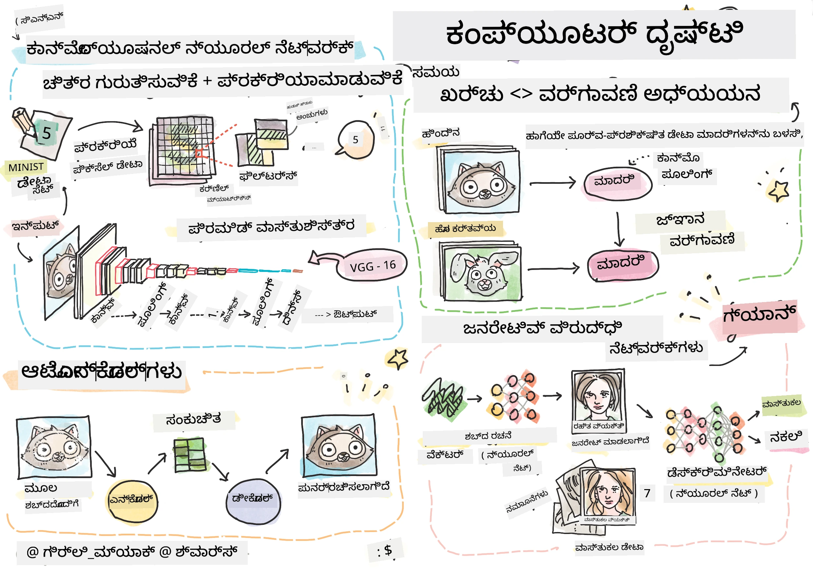

# ಕಂಪ್ಯೂಟರ್ ವೀಕ್ಷಣೆ

ಈ ವಿಭಾಗದಲ್ಲಿ ನಾವು ಕಲಿಯಲಿದ್ದೇವೆ:

* [ಕಂಪ್ಯೂಟರ್ ವೀಕ್ಷಣೆ ಮತ್ತು OpenCV ಪರಿಚಯ](06-IntroCV/README.md)
* [ಕನ್ವಲ್ಯೂಷನಲ್ ನ್ಯೂರಲ್ ನೆಟ್‌ವರ್ಕ್‌ಗಳು](07-ConvNets/README.md)
* [ಪೂರ್ವ-ಪ್ರಶಿಕ್ಷಿತ ನೆಟ್‌ವರ್ಕ್‌ಗಳು ಮತ್ತು ಟ್ರಾನ್ಸ್‌ಫರ್ ಲರ್ನಿಂಗ್](08-TransferLearning/README.md) 
* [ಆಟೋಎನ್‌ಕೋಡರ್‌ಗಳು](09-Autoencoders/README.md)
* [ಜನರೇಟಿವ್ ಅಡ್ವರ್ಸರಿಯಲ್ ನೆಟ್‌ವರ್ಕ್‌ಗಳು](10-GANs/README.md)
* [ವಸ್ತು ಪತ್ತೆ](11-ObjectDetection/README.md)
* [ಅರ್ಥಪೂರ್ಣ ವಿಭಾಗೀಕರಣ](12-Segmentation/README.md)

---

<!-- CO-OP TRANSLATOR DISCLAIMER START -->
**ಅಸ್ವೀಕರಣ**:  
ಈ ದಸ್ತಾವೇಜು [Co-op Translator](https://github.com/Azure/co-op-translator) ಎಂಬ AI ಅನುವಾದ ಸೇವೆಯನ್ನು ಬಳಸಿ ಅನುವಾದಿಸಲಾಗಿದೆ. ನಾವು ಶುದ್ಧತೆಯತ್ತ ಪ್ರಯತ್ನಿಸುತ್ತಿದ್ದರೂ, ಸ್ವಯಂಚಾಲಿತ ಅನುವಾದಗಳಲ್ಲಿ ತಪ್ಪುಗಳು ಅಥವಾ ಅಸತ್ಯತೆಗಳು ಇರಬಹುದು ಎಂದು ದಯವಿಟ್ಟು ಗಮನಿಸಿ. ಮೂಲ ಭಾಷೆಯಲ್ಲಿರುವ ಮೂಲ ದಸ್ತಾವೇಜನ್ನು ಅಧಿಕೃತ ಮೂಲವೆಂದು ಪರಿಗಣಿಸಬೇಕು. ಮಹತ್ವದ ಮಾಹಿತಿಗಾಗಿ, ವೃತ್ತಿಪರ ಮಾನವ ಅನುವಾದವನ್ನು ಶಿಫಾರಸು ಮಾಡಲಾಗುತ್ತದೆ. ಈ ಅನುವಾದ ಬಳಕೆಯಿಂದ ಉಂಟಾಗುವ ಯಾವುದೇ ತಪ್ಪು ಅರ್ಥಮಾಡಿಕೊಳ್ಳುವಿಕೆ ಅಥವಾ ತಪ್ಪು ವಿವರಣೆಗಳಿಗೆ ನಾವು ಹೊಣೆಗಾರರಾಗುವುದಿಲ್ಲ.
<!-- CO-OP TRANSLATOR DISCLAIMER END -->