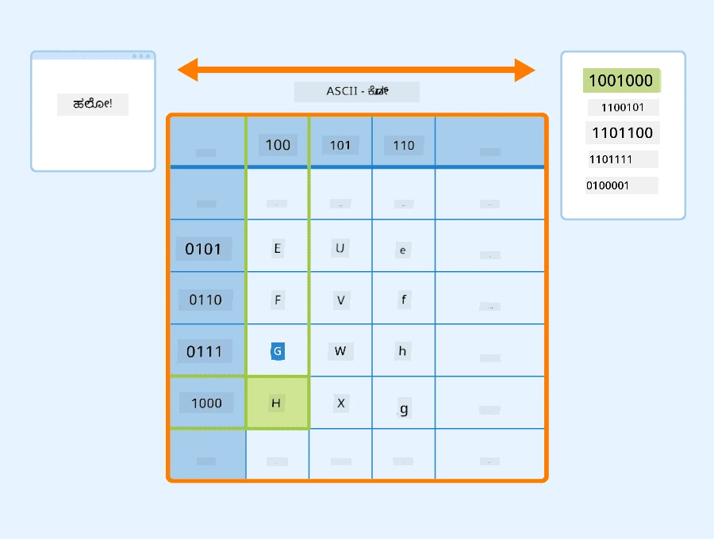
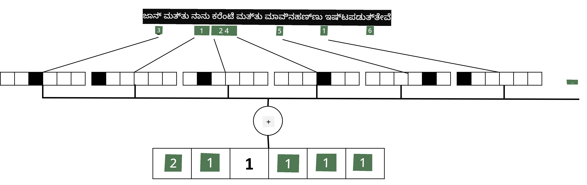

# ಪಠ್ಯವನ್ನು ಟೆನ್ಸರ್‌ಗಳಾಗಿ ಪ್ರತಿನಿಧಿಸುವುದು

## [ಪೂರ್ವ-ವ್ಯಾಖ್ಯಾನ ಕ್ವಿಜ್](https://ff-quizzes.netlify.app/en/ai/quiz/25)

## ಪಠ್ಯ ವರ್ಗೀಕರಣ

ಈ ವಿಭಾಗದ ಮೊದಲ ಭಾಗದಲ್ಲಿ, ನಾವು **ಪಠ್ಯ ವರ್ಗೀಕರಣ** ಕಾರ್ಯದ ಮೇಲೆ ಗಮನಹರಿಸುವೆವು. ನಾವು [AG News](https://www.kaggle.com/amananandrai/ag-news-classification-dataset) ಡೇಟಾಸೆಟ್ ಅನ್ನು ಬಳಸಲಿದ್ದೇವೆ, ಇದರಲ್ಲಿ ಕೆಳಗಿನಂತಿರುವ ಸುದ್ದಿಪತ್ರಿಕೆ ಲೇಖನಗಳಿವೆ:

* ವರ್ಗ: ವಿಜ್ಞಾನ/ತಂತ್ರಜ್ಞಾನ
* ಶೀರ್ಷಿಕೆ: Ky. ಕಂಪನಿ ಪೆಪ್ಟೈಡ್ಗಳ ಅಧ್ಯಯನಕ್ಕೆ ಅನುದಾನ ಗೆದ್ದಿದೆ (AP)
* ವಿಷಯ: AP - ಲೂಯಿಸ್ವಿಲ್ ವಿಶ್ವವಿದ್ಯಾಲಯದ ರಸಾಯನಶಾಸ್ತ್ರ ಸಂಶೋಧಕನಿಂದ ಸ್ಥಾಪಿತವಾದ ಕಂಪನಿಯು ಅಭಿವೃದ್ಧಿಗೆ ಅನುದಾನ ಗೆದ್ದಿದೆ...

ನಮ್ಮ ಗುರಿ ಪಠ್ಯದ ಆಧಾರದ ಮೇಲೆ ಸುದ್ದಿಯನ್ನು ಒಂದು ವರ್ಗಕ್ಕೆ ವರ್ಗೀಕರಿಸುವುದು.

## ಪಠ್ಯವನ್ನು ಪ್ರತಿನಿಧಿಸುವುದು

ನಾವು ನ್ಯೂರಲ್ ನೆಟ್‌ವರ್ಕ್‌ಗಳೊಂದಿಗೆ ನೈಸರ್ಗಿಕ ಭಾಷಾ ಪ್ರಕ್ರಿಯೆ (NLP) ಕಾರ್ಯಗಳನ್ನು ಪರಿಹರಿಸಲು ಬಯಸಿದರೆ, ಪಠ್ಯವನ್ನು ಟೆನ್ಸರ್‌ಗಳಾಗಿ ಪ್ರತಿನಿಧಿಸುವ ವಿಧಾನ ಬೇಕಾಗುತ್ತದೆ. ಕಂಪ್ಯೂಟರ್‌ಗಳು ಈಗಾಗಲೇ ASCII ಅಥವಾ UTF-8 ಎಂಬ ಎನ್ಕೋಡಿಂಗ್‌ಗಳನ್ನು ಬಳಸಿ ನಿಮ್ಮ ಪರದೆ上的 ಫಾಂಟ್‌ಗಳಿಗೆ ನಕ್ಷೆ ಮಾಡಲಾದ ಸಂಖ್ಯೆಗಳಾಗಿ ಪಠ್ಯ ಅಕ್ಷರಗಳನ್ನು ಪ್ರತಿನಿಧಿಸುತ್ತವೆ.

> [ಚಿತ್ರ ಮೂಲ](https://www.seobility.net/en/wiki/ASCII)

ಮಾನವರಾಗಿ, ನಾವು ಪ್ರತಿ ಅಕ್ಷರವು ಏನು **ಪ್ರತಿನಿಧಿಸುತ್ತದೆ** ಮತ್ತು ಎಲ್ಲಾ ಅಕ್ಷರಗಳು ಸೇರಿ ವಾಕ್ಯದ ಪದಗಳನ್ನು ಹೇಗೆ ರೂಪಿಸುತ್ತವೆ ಎಂಬುದನ್ನು ಅರ್ಥಮಾಡಿಕೊಳ್ಳುತ್ತೇವೆ. ಆದರೆ, ಕಂಪ್ಯೂಟರ್‌ಗಳಿಗೆ ಸ್ವತಃ ಇಂತಹ ಅರ್ಥ ತಿಳಿದಿಲ್ಲ, ಮತ್ತು ನ್ಯೂರಲ್ ನೆಟ್‌ವರ್ಕ್ ತರಬೇತಿಯ ಸಮಯದಲ್ಲಿ ಅರ್ಥವನ್ನು ಕಲಿಯಬೇಕು.

ಆದ್ದರಿಂದ, ಪಠ್ಯವನ್ನು ಪ್ರತಿನಿಧಿಸುವಾಗ ನಾವು ವಿಭಿನ್ನ ವಿಧಾನಗಳನ್ನು ಬಳಸಬಹುದು:

* **ಅಕ್ಷರ-ಮಟ್ಟದ ಪ್ರತಿನಿಧನೆ**, ಇಲ್ಲಿ ನಾವು ಪ್ರತಿ ಅಕ್ಷರವನ್ನು ಸಂಖ್ಯೆಯಾಗಿ ಪರಿಗಣಿಸಿ ಪಠ್ಯವನ್ನು ಪ್ರತಿನಿಧಿಸುತ್ತೇವೆ. ನಮ್ಮ ಪಠ್ಯ ಸಂಗ್ರಹದಲ್ಲಿ *C* ವಿಭಿನ್ನ ಅಕ್ಷರಗಳಿದ್ದರೆ, *Hello* ಪದವು 5x*C* ಟೆನ್ಸರ್ ಆಗಿ ಪ್ರತಿನಿಧಿಸಲಾಗುತ್ತದೆ. ಪ್ರತಿ ಅಕ್ಷರವು ಒನ್-ಹಾಟ್ ಎನ್ಕೋಡಿಂಗ್‌ನಲ್ಲಿ ಟೆನ್ಸರ್ ಕಾಲಮ್‌ಗೆ ಹೊಂದಿಕೆಯಾಗುತ್ತದೆ.
* **ಪದ-ಮಟ್ಟದ ಪ್ರತಿನಿಧನೆ**, ಇದರಲ್ಲಿ ನಾವು ಪಠ್ಯದ ಎಲ್ಲಾ ಪದಗಳ **ಶಬ್ದಕೋಶ** ರಚಿಸಿ, ನಂತರ ಪದಗಳನ್ನು ಒನ್-ಹಾಟ್ ಎನ್ಕೋಡಿಂಗ್ ಬಳಸಿ ಪ್ರತಿನಿಧಿಸುತ್ತೇವೆ. ಈ ವಿಧಾನ ಸ್ವಲ್ಪ ಉತ್ತಮ, ಏಕೆಂದರೆ ಪ್ರತಿ ಅಕ್ಷರಕ್ಕೆ ಸ್ವತಃ ಹೆಚ್ಚು ಅರ್ಥವಿಲ್ಲ, ಆದ್ದರಿಂದ ಪದಗಳಂತಹ ಉನ್ನತ ಮಟ್ಟದ ಅರ್ಥಪೂರ್ಣ ಸಂಪ್ರದಾಯಗಳನ್ನು ಬಳಸುವುದರಿಂದ ನ್ಯೂರಲ್ ನೆಟ್‌ವರ್ಕ್‌ಗೆ ಕಾರ್ಯ ಸುಲಭವಾಗುತ್ತದೆ. ಆದರೆ, ದೊಡ್ಡ ಶಬ್ದಕೋಶದ ಗಾತ್ರದಿಂದ, ನಾವು ಹೆಚ್ಚಿನ ಆಯಾಮದ ವಿರಳ ಟೆನ್ಸರ್‌ಗಳನ್ನು ನಿರ್ವಹಿಸಬೇಕಾಗುತ್ತದೆ.

ಪ್ರತಿನಿಧನೆಯ ಯಾವ ವಿಧಾನವನ್ನಾದರೂ ಬಳಸಿದರೂ, ಮೊದಲು ಪಠ್ಯವನ್ನು **ಟೋಕನ್‌ಗಳ** ಸರಣಿಯಾಗಿ ಪರಿವರ್ತಿಸಬೇಕು, ಒಂದು ಟೋಕನ್ ಅಕ್ಷರ, ಪದ ಅಥವಾ ಕೆಲವೊಮ್ಮೆ ಪದದ ಭಾಗವಾಗಿರಬಹುದು. ನಂತರ, ಟೋಕನ್ ಅನ್ನು ಸಾಮಾನ್ಯವಾಗಿ **ಶಬ್ದಕೋಶ** ಬಳಸಿ ಸಂಖ್ಯೆಯಾಗಿ ಪರಿವರ್ತಿಸಿ, ಈ ಸಂಖ್ಯೆಯನ್ನು ಒನ್-ಹಾಟ್ ಎನ್ಕೋಡಿಂಗ್ ಮೂಲಕ ನ್ಯೂರಲ್ ನೆಟ್‌ವರ್ಕ್‌ಗೆ ನೀಡಬಹುದು.

## ಎನ್-ಗ್ರಾಮ್‌ಗಳು

ನೈಸರ್ಗಿಕ ಭಾಷೆಯಲ್ಲಿ, ಪದಗಳ ನಿಖರ ಅರ್ಥವನ್ನು ಕೇವಲ ಸಂದರ್ಭದಲ್ಲಿ ಮಾತ್ರ ನಿರ್ಧರಿಸಬಹುದು. ಉದಾಹರಣೆಗೆ, *ನ್ಯೂರಲ್ ನೆಟ್‌ವರ್ಕ್* ಮತ್ತು *ಮೀನು ಹಿಡಿಯುವ ನೆಟ್‌ವರ್ಕ್* ಎಂಬ ಪದಗಳ ಅರ್ಥ ಸಂಪೂರ್ಣ ವಿಭಿನ್ನ. ಇದನ್ನು ಗಮನದಲ್ಲಿಟ್ಟುಕೊಳ್ಳಲು, ನಾವು ನಮ್ಮ ಮಾದರಿಯನ್ನು ಪದಗಳ ಜೋಡಿಗಳ ಮೇಲೆ ನಿರ್ಮಿಸಿ, ಪದ ಜೋಡಿಗಳನ್ನು ಪ್ರತ್ಯೇಕ ಶಬ್ದಕೋಶ ಟೋಕನ್‌ಗಳಾಗಿ ಪರಿಗಣಿಸಬಹುದು. ಈ ರೀತಿಯಲ್ಲಿ, *ನಾನು ಮೀನು ಹಿಡಿಯಲು ಹೋಗಲು ಇಷ್ಟಪಡುತ್ತೇನೆ* ಎಂಬ ವಾಕ್ಯವನ್ನು ಕೆಳಗಿನ ಟೋಕನ್ ಸರಣಿಯಾಗಿ ಪ್ರತಿನಿಧಿಸಲಾಗುತ್ತದೆ: *ನಾನು ಇಷ್ಟಪಡುತ್ತೇನೆ*, *ಇಷ್ಟಪಡುತ್ತೇನೆ ಹೋಗಲು*, *ಹೋಗಲು ಮೀನು ಹಿಡಿಯಲು*. ಈ ವಿಧಾನದಲ್ಲಿ ಸಮಸ್ಯೆ ಎಂದರೆ ಶಬ್ದಕೋಶದ ಗಾತ್ರ ಬಹಳ ಹೆಚ್ಚಾಗುತ್ತದೆ ಮತ್ತು *ಹೋಗಲು ಮೀನು ಹಿಡಿಯಲು* ಮತ್ತು *ಹೋಗಲು ಶಾಪಿಂಗ್* ಎಂಬ ಸಂಯೋಜನೆಗಳು ವಿಭಿನ್ನ ಟೋಕನ್‌ಗಳಾಗಿ ಪ್ರತಿನಿಧಿಸಲಾಗುತ್ತವೆ, ಅವುಗಳ ಅರ್ಥಪೂರ್ಣ ಸಮಾನತೆ ಇಲ್ಲದಿದ್ದರೂ ಸಹ.

ಕೆಲವೊಮ್ಮೆ, ನಾವು ಮೂರು ಪದಗಳ ಸಂಯೋಜನೆಗಳಾದ ಟ್ರೈ-ಗ್ರಾಮ್‌ಗಳನ್ನು ಕೂಡ ಪರಿಗಣಿಸಬಹುದು. ಈ ವಿಧಾನವನ್ನು ಸಾಮಾನ್ಯವಾಗಿ **ಎನ್-ಗ್ರಾಮ್‌ಗಳು** ಎಂದು ಕರೆಯುತ್ತಾರೆ. ಅಕ್ಷರ-ಮಟ್ಟದ ಪ್ರತಿನಿಧನೆಗೆ ಎನ್-ಗ್ರಾಮ್‌ಗಳನ್ನು ಬಳಸುವುದು ಸಹ ಅರ್ಥಪೂರ್ಣ, ಇದರಲ್ಲಿ ಎನ್-ಗ್ರಾಮ್‌ಗಳು ವಿಭಿನ್ನ ಅಕ್ಷರಮಾತ್ರೆಗಳಂತೆ ಕಾಣಬಹುದು.

## ಬ್ಯಾಗ್-ಆಫ್-ವರ್ಡ್ಸ್ ಮತ್ತು TF/IDF

ಪಠ್ಯ ವರ್ಗೀಕರಣದಂತಹ ಕಾರ್ಯಗಳನ್ನು ಪರಿಹರಿಸುವಾಗ, ನಾವು ಪಠ್ಯವನ್ನು ಒಂದು ನಿಶ್ಚಿತ ಗಾತ್ರದ ವೆಕ್ಟರ್ ಮೂಲಕ ಪ್ರತಿನಿಧಿಸಬೇಕಾಗುತ್ತದೆ, ಇದನ್ನು ಅಂತಿಮ ಡೆನ್ಸ್ ವರ್ಗೀಕರಣಕ್ಕೆ ಇನ್ಪುಟ್ ಆಗಿ ಬಳಸುತ್ತೇವೆ. ಇದಕ್ಕೆ ಸರಳ ವಿಧಾನಗಳಲ್ಲಿ ಒಂದಾಗಿದೆ ಎಲ್ಲಾ ಪದಗಳ ಪ್ರತಿನಿಧನೆಗಳನ್ನು ಸೇರಿಸುವುದು. ಪ್ರತಿಯೊಂದು ಪದದ ಒನ್-ಹಾಟ್ ಎನ್ಕೋಡಿಂಗ್‌ಗಳನ್ನು ಸೇರಿಸಿದರೆ, ನಾವು ಪದಗಳ ಆವರ್ತನೆಗಳ ವೆಕ್ಟರ್ ಅನ್ನು ಪಡೆಯುತ್ತೇವೆ, ಇದು ಪಠ್ಯದಲ್ಲಿ ಪ್ರತಿ ಪದ ಎಷ್ಟು ಬಾರಿ ಬರುತ್ತದೆ ಎಂಬುದನ್ನು ತೋರಿಸುತ್ತದೆ. ಈ ರೀತಿಯ ಪಠ್ಯ ಪ್ರತಿನಿಧನೆಯನ್ನು **ಬ್ಯಾಗ್ ಆಫ್ ವರ್ಡ್ಸ್** (BoW) ಎಂದು ಕರೆಯುತ್ತಾರೆ.

> ಚಿತ್ರ ಲೇಖಕರಿಂದ

BoW ಮೂಲತಃ ಪಠ್ಯದಲ್ಲಿ ಯಾವ ಪದಗಳು ಮತ್ತು ಎಷ್ಟು ಪ್ರಮಾಣದಲ್ಲಿ ಬರುತ್ತವೆ ಎಂಬುದನ್ನು ಪ್ರತಿನಿಧಿಸುತ್ತದೆ, ಇದು ಪಠ್ಯದ ವಿಷಯವನ್ನು ತಿಳಿಸುವ ಉತ್ತಮ ಸೂಚಕವಾಗಬಹುದು. ಉದಾಹರಣೆಗೆ, ರಾಜಕೀಯದ ಸುದ್ದಿಪತ್ರಿಕೆಗಳಲ್ಲಿ *ರಾಷ್ಟ್ರಪತಿ* ಮತ್ತು *ದೇಶ* ಎಂಬ ಪದಗಳು ಹೆಚ್ಚಾಗಿ ಕಾಣಬಹುದು, ವಿಜ್ಞಾನ ಸಂಬಂಧಿತ ಪ್ರಕಟಣೆಯಲ್ಲಿ *ಕೊಲೈಡರ್*, *ಹುಡುಕಲಾಗಿದೆ* ಮುಂತಾದವುಗಳಿರಬಹುದು. ಆದ್ದರಿಂದ, ಪದಗಳ ಆವರ್ತನೆಗಳು ಬಹುಶಃ ಪಠ್ಯದ ವಿಷಯದ ಉತ್ತಮ ಸೂಚಕವಾಗಿರಬಹುದು.

BoW ಯ ಸಮಸ್ಯೆ ಎಂದರೆ ಕೆಲವು ಸಾಮಾನ್ಯ ಪದಗಳು, ಉದಾಹರಣೆಗೆ *ಮತ್ತು*, *ಇದು* ಮುಂತಾದವು ಬಹುತೇಕ ಪಠ್ಯಗಳಲ್ಲಿ ಬರುತ್ತವೆ ಮತ್ತು ಅವುಗಳ ಆವರ್ತನೆ ಹೆಚ್ಚು ಇರುತ್ತದೆ, ಇದರಿಂದ ನಿಜವಾಗಿಯೂ ಮುಖ್ಯವಾದ ಪದಗಳು ಮರೆತುಹೋಗುತ್ತವೆ. ನಾವು ಈ ಪದಗಳ ಮಹತ್ವವನ್ನು ಕಡಿಮೆ ಮಾಡಲು, ಪದಗಳು ಸಂಪೂರ್ಣ ಡಾಕ್ಯುಮೆಂಟ್ ಸಂಗ್ರಹದಲ್ಲಿ ಎಷ್ಟು ಬಾರಿ ಬರುತ್ತವೆ ಎಂಬುದನ್ನು ಪರಿಗಣಿಸಬಹುದು. ಇದೇ TF/IDF ವಿಧಾನದ ಮೂಲಭೂತ ಕಲ್ಪನೆ, ಇದು ಈ ಪಾಠದ ಜೊತೆಗೆ ಲಗತ್ತಿಸಲಾದ ನೋಟ್ಬುಕ್‌ಗಳಲ್ಲಿ ವಿವರವಾಗಿ ಚರ್ಚಿಸಲಾಗಿದೆ.

ಆದರೆ, ಈ ವಿಧಾನಗಳು ಪಠ್ಯದ **ಅರ್ಥ** ಅಥವಾ **ಸಂದರ್ಭ** ಅನ್ನು ಸಂಪೂರ್ಣವಾಗಿ ಹಿಡಿಯಲು ಸಾಧ್ಯವಿಲ್ಲ. ಇದಕ್ಕಾಗಿ ನಾವು ಹೆಚ್ಚು ಶಕ್ತಿಶಾಲಿ ನ್ಯೂರಲ್ ನೆಟ್‌ವರ್ಕ್ ಮಾದರಿಗಳನ್ನು ಬಳಸಬೇಕಾಗುತ್ತದೆ, ಅವುಗಳನ್ನು ಈ ವಿಭಾಗದಲ್ಲಿ ನಂತರ ಚರ್ಚಿಸುವೆವು.

## ✍️ ಅಭ್ಯಾಸಗಳು: ಪಠ್ಯ ಪ್ರತಿನಿಧನೆ

ಕೆಳಗಿನ ನೋಟ್ಬುಕ್‌ಗಳಲ್ಲಿ ನಿಮ್ಮ ಅಧ್ಯಯನವನ್ನು ಮುಂದುವರಿಸಿ:

* [PyTorch ಬಳಸಿ ಪಠ್ಯ ಪ್ರತಿನಿಧನೆ](TextRepresentationPyTorch.ipynb)
* [TensorFlow ಬಳಸಿ ಪಠ್ಯ ಪ್ರತಿನಿಧನೆ](TextRepresentationTF.ipynb)

## ಸಾರಾಂಶ

ಈವರೆಗೆ, ನಾವು ವಿಭಿನ್ನ ಪದಗಳಿಗೆ ಆವರ್ತನೆ ತೂಕವನ್ನು ಸೇರಿಸುವ ತಂತ್ರಗಳನ್ನು ಅಧ್ಯಯನ ಮಾಡಿದ್ದೇವೆ. ಆದರೆ ಅವು ಅರ್ಥ ಅಥವಾ ಕ್ರಮವನ್ನು ಪ್ರತಿನಿಧಿಸಲು ಅಸಮರ್ಥ. ಪ್ರಸಿದ್ಧ ಭಾಷಾಶಾಸ್ತ್ರಜ್ಞ J. R. Firth 1935 ರಲ್ಲಿ ಹೇಳಿದಂತೆ, "ಪದದ ಸಂಪೂರ್ಣ ಅರ್ಥವು ಯಾವಾಗಲೂ ಸಂದರ್ಭಾತ್ಮಕವಾಗಿರುತ್ತದೆ, ಮತ್ತು ಸಂದರ್ಭವಿಲ್ಲದೆ ಅರ್ಥದ ಅಧ್ಯಯನವನ್ನು ಗಂಭೀರವಾಗಿ ತೆಗೆದುಕೊಳ್ಳಲಾಗದು." ನಾವು ಈ ಕೋರ್ಸ್‌ನಲ್ಲಿ ನಂತರ ಪಠ್ಯದಿಂದ ಸಂದರ್ಭಾತ್ಮಕ ಮಾಹಿತಿಯನ್ನು ಹಿಡಿಯುವ ಭಾಷಾ ಮಾದರಿಕರಣವನ್ನು ಕಲಿಯುತ್ತೇವೆ.

## 🚀 ಸವಾಲು

ಬ್ಯಾಗ್-ಆಫ್-ವರ್ಡ್ಸ್ ಮತ್ತು ವಿಭಿನ್ನ ಡೇಟಾ ಮಾದರಿಗಳನ್ನು ಬಳಸಿ ಇನ್ನಷ್ಟು ಅಭ್ಯಾಸಗಳನ್ನು ಪ್ರಯತ್ನಿಸಿ. ನೀವು ಈ [ಕಾಗಲ್ ಸ್ಪರ್ಧೆಯಿಂದ](https://www.kaggle.com/competitions/word2vec-nlp-tutorial/overview/part-1-for-beginners-bag-of-words) ಪ್ರೇರಣೆಯನ್ನು ಪಡೆಯಬಹುದು.

## [ಪೋಸ್ಟ್-ವ್ಯಾಖ್ಯಾನ ಕ್ವಿಜ್](https://ff-quizzes.netlify.app/en/ai/quiz/26)

## ವಿಮರ್ಶೆ ಮತ್ತು ಸ್ವಯಂ ಅಧ್ಯಯನ

ಪಠ್ಯ ಎम्बೆಡ್ಡಿಂಗ್‌ಗಳು ಮತ್ತು ಬ್ಯಾಗ್-ಆಫ್-ವರ್ಡ್ಸ್ ತಂತ್ರಗಳನ್ನು [Microsoft Learn](https://docs.microsoft.com/learn/modules/intro-natural-language-processing-pytorch/?WT.mc_id=academic-77998-cacaste) ನಲ್ಲಿ ಅಭ್ಯಾಸ ಮಾಡಿ.

## [ಕಾರ್ಯ: ನೋಟ್ಬುಕ್‌ಗಳು](assignment.md)

---

<!-- CO-OP TRANSLATOR DISCLAIMER START -->
**ಅಸ್ವೀಕರಣ**:  
ಈ ದಸ್ತಾವೇಜು AI ಅನುವಾದ ಸೇವೆ [Co-op Translator](https://github.com/Azure/co-op-translator) ಬಳಸಿ ಅನುವಾದಿಸಲಾಗಿದೆ. ನಾವು ನಿಖರತೆಯಿಗಾಗಿ ಪ್ರಯತ್ನಿಸುತ್ತಿದ್ದರೂ, ಸ್ವಯಂಚಾಲಿತ ಅನುವಾದಗಳಲ್ಲಿ ದೋಷಗಳು ಅಥವಾ ಅಸತ್ಯತೆಗಳು ಇರಬಹುದು ಎಂದು ದಯವಿಟ್ಟು ಗಮನಿಸಿ. ಮೂಲ ಭಾಷೆಯಲ್ಲಿರುವ ಮೂಲ ದಸ್ತಾವೇಜನ್ನು ಅಧಿಕೃತ ಮೂಲವೆಂದು ಪರಿಗಣಿಸಬೇಕು. ಮಹತ್ವದ ಮಾಹಿತಿಗಾಗಿ, ವೃತ್ತಿಪರ ಮಾನವ ಅನುವಾದವನ್ನು ಶಿಫಾರಸು ಮಾಡಲಾಗುತ್ತದೆ. ಈ ಅನುವಾದ ಬಳಕೆಯಿಂದ ಉಂಟಾಗುವ ಯಾವುದೇ ತಪ್ಪು ಅರ್ಥಮಾಡಿಕೊಳ್ಳುವಿಕೆ ಅಥವಾ ತಪ್ಪು ವಿವರಣೆಗಳಿಗೆ ನಾವು ಹೊಣೆಗಾರರಾಗುವುದಿಲ್ಲ.
<!-- CO-OP TRANSLATOR DISCLAIMER END -->