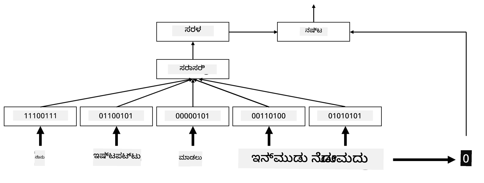

# ಎम्बೆಡ್ಡಿಂಗ್ಸ್

## [ಪೂರ್ವ-ವ್ಯಾಖ್ಯಾನ ಕ್ವಿಜ್](https://ff-quizzes.netlify.app/en/ai/quiz/27)

BoW ಅಥವಾ TF/IDF ಆಧಾರಿತ ವರ್ಗೀಕರಣಗಳನ್ನು ತರಬೇತುಗೊಳಿಸುವಾಗ, ನಾವು `vocab_size` ಉದ್ದದ ಉನ್ನತ-ಆಯಾಮದ ಬ್ಯಾಗ್-ಆಫ್-ವರ್ಡ್ಸ್ ವೆಕ್ಟರ್‌ಗಳ ಮೇಲೆ ಕಾರ್ಯನಿರ್ವಹಿಸುತ್ತಿದ್ದೆವು ಮತ್ತು ನಾವು ಕಡಿಮೆ-ಆಯಾಮದ ಸ್ಥಾನಿಕ ಪ್ರತಿನಿಧಾನ ವೆಕ್ಟರ್‌ಗಳನ್ನು ಸ್ಪಾರ್ಸ್ ಒನ್-ಹಾಟ್ ಪ್ರತಿನಿಧಾನಕ್ಕೆ ಸ್ಪಷ್ಟವಾಗಿ ಪರಿವರ್ತಿಸುತ್ತಿದ್ದೆವು. ಆದರೆ ಈ ಒನ್-ಹಾಟ್ ಪ್ರತಿನಿಧಾನ ಸ್ಮೃತಿ-ಕಾರ್ಯಕ್ಷಮವಲ್ಲ. ಜೊತೆಗೆ, ಪ್ರತಿ ಪದವನ್ನು ಪರಸ್ಪರ ಸ್ವತಂತ್ರವಾಗಿ ಪರಿಗಣಿಸಲಾಗುತ್ತದೆ, ಅಂದರೆ ಒನ್-ಹಾಟ್ ಎನ್‌ಕೋಡ್ ಮಾಡಿದ ವೆಕ್ಟರ್‌ಗಳು ಪದಗಳ ನಡುವಿನ ಅರ್ಥಾತ್ಮಕ ಸಮಾನತೆಯನ್ನು ವ್ಯಕ್ತಪಡಿಸುವುದಿಲ್ಲ.

**ಎಂಬೆಡ್ಡಿಂಗ್** ಎಂಬ ಕಲ್ಪನೆ ಪದಗಳನ್ನು ಕಡಿಮೆ-ಆಯಾಮದ ಸಾಂದ್ರ ವೆಕ್ಟರ್‌ಗಳ ಮೂಲಕ ಪ್ರತಿನಿಧಿಸುವುದು, ಇದು ಪದದ ಅರ್ಥಾತ್ಮಕ ಅರ್ಥವನ್ನು ಪ್ರತಿಬಿಂಬಿಸುತ್ತದೆ. ನಾವು ನಂತರ ಅರ್ಥಪೂರ್ಣ ಪದ ಎम्बೆಡ್ಡಿಂಗ್‌ಗಳನ್ನು ಹೇಗೆ ನಿರ್ಮಿಸುವುದನ್ನು ಚರ್ಚಿಸುವೆವು, ಆದರೆ ಈಗಿಗೆ ಎम्बೆಡ್ಡಿಂಗ್‌ಗಳನ್ನು ಪದ ವೆಕ್ಟರ್‌ನ ಆಯಾಮವನ್ನು ಕಡಿಮೆ ಮಾಡುವ ವಿಧಾನವೆಂದು ಮಾತ್ರ ಪರಿಗಣಿಸೋಣ.

ಹೀಗಾಗಿ, ಎम्बೆಡ್ಡಿಂಗ್ ಲೇಯರ್ ಒಂದು ಪದವನ್ನು ಇನ್‌ಪುಟ್ ಆಗಿ ತೆಗೆದುಕೊಂಡು, ನಿರ್ದಿಷ್ಟ `embedding_size` ಉದ್ದದ ಔಟ್‌ಪುಟ್ ವೆಕ್ಟರ್ ಅನ್ನು ಉತ್ಪಾದಿಸುತ್ತದೆ. ಇದು ಒಂದು ರೀತಿಯಲ್ಲಿ `Linear` ಲೇಯರ್‌ಗೆ ಹೋಲುತ್ತದೆ, ಆದರೆ ಒನ್-ಹಾಟ್ ಎನ್‌ಕೋಡ್ ಮಾಡಿದ ವೆಕ್ಟರ್ ತೆಗೆದುಕೊಳ್ಳುವುದರ ಬದಲು, ಪದ ಸಂಖ್ಯೆಯನ್ನು ಇನ್‌ಪುಟ್ ಆಗಿ ತೆಗೆದುಕೊಳ್ಳಬಹುದು, ಇದರಿಂದ ದೊಡ್ಡ ಒನ್-ಹಾಟ್ ಎನ್‌ಕೋಡ್ ಮಾಡಿದ ವೆಕ್ಟರ್‌ಗಳನ್ನು ಸೃಷ್ಟಿಸುವ ಅಗತ್ಯವಿಲ್ಲ.

ನಮ್ಮ ವರ್ಗೀಕರಣ ಜಾಲದಲ್ಲಿ ಮೊದಲ ಲೇಯರ್ ಆಗಿ ಎम्बೆಡ್ಡಿಂಗ್ ಲೇಯರ್ ಬಳಸಿ, ನಾವು ಬ್ಯಾಗ್-ಆಫ್-ವರ್ಡ್ಸ್‌ನಿಂದ **ಎಂಬೆಡ್ಡಿಂಗ್ ಬ್ಯಾಗ್** ಮಾದರಿಗೆ ಬದಲಾಗಬಹುದು, ಅಲ್ಲಿ ಮೊದಲಿಗೆ ನಮ್ಮ ಪಠ್ಯದಲ್ಲಿನ ಪ್ರತಿ ಪದವನ್ನು ಸಂಬಂಧಿತ ಎम्बೆಡ್ಡಿಂಗ್‌ಗೆ ಪರಿವರ್ತಿಸಿ, ನಂತರ ಆ ಎಲ್ಲ ಎम्बೆಡ್ಡಿಂಗ್‌ಗಳ ಮೇಲೆ `sum`, `average` ಅಥವಾ `max` ಮುಂತಾದ ಸಂಗ್ರಹ ಕಾರ್ಯವನ್ನು ಲೆಕ್ಕಹಾಕುತ್ತೇವೆ.

> ಚಿತ್ರ ಲೇಖಕರಿಂದ

## ✍️ ಅಭ್ಯಾಸಗಳು: ಎम्बೆಡ್ಡಿಂಗ್ಸ್

ಕೆಳಗಿನ ನೋಟ್ಬುಕ್‌ಗಳಲ್ಲಿ ನಿಮ್ಮ ಅಧ್ಯಯನವನ್ನು ಮುಂದುವರಿಸಿ:
* [PyTorch ನೊಂದಿಗೆ ಎम्बೆಡ್ಡಿಂಗ್ಸ್](EmbeddingsPyTorch.ipynb)
* [TensorFlow ಎम्बೆಡ್ಡಿಂಗ್ಸ್](EmbeddingsTF.ipynb)

## ಅರ್ಥಾತ್ಮಕ ಎम्बೆಡ್ಡಿಂಗ್ಸ್: Word2Vec

ಎಂಬೆಡ್ಡಿಂಗ್ ಲೇಯರ್ ಪದಗಳನ್ನು ವೆಕ್ಟರ್ ಪ್ರತಿನಿಧಾನಕ್ಕೆ ನಕ್ಷೆ ಮಾಡುವುದು ಕಲಿತಿದ್ದರೂ, ಈ ಪ್ರತಿನಿಧಾನವು ಅನಿವಾರ್ಯವಾಗಿ ಅರ್ಥಾತ್ಮಕ ಅರ್ಥವನ್ನು ಹೊಂದಿರಲಿಲ್ಲ. ಸಮಾನಾರ್ಥಕ ಪದಗಳು ಅಥವಾ ಸಮಾನಾರ್ಥಕ ಪದಗಳು ಕೆಲವು ವೆಕ್ಟರ್ ದೂರ (ಉದಾ. ಯೂಕ್ಲಿಡಿಯನ್ ದೂರ) ಅರ್ಥದಲ್ಲಿ ಪರಸ್ಪರ ಹತ್ತಿರ ಇರುವಂತೆ ವೆಕ್ಟರ್ ಪ್ರತಿನಿಧಾನವನ್ನು ಕಲಿಯುವುದು ಒಳ್ಳೆಯದು.

ಅದಕ್ಕಾಗಿ, ನಾವು ನಮ್ಮ ಎम्बೆಡ್ಡಿಂಗ್ ಮಾದರಿಯನ್ನು ದೊಡ್ಡ ಪಠ್ಯ ಸಂಗ್ರಹದಲ್ಲಿ ವಿಶೇಷ ರೀತಿಯಲ್ಲಿ ಪೂರ್ವ-ತರಬೇತಿ ಮಾಡಬೇಕಾಗುತ್ತದೆ. ಅರ್ಥಾತ್ಮಕ ಎम्बೆಡ್ಡಿಂಗ್‌ಗಳನ್ನು ತರಬೇತುಗೊಳಿಸುವ ಒಂದು ವಿಧಾನವನ್ನು [Word2Vec](https://en.wikipedia.org/wiki/Word2vec) ಎಂದು ಕರೆಯುತ್ತಾರೆ. ಇದು ಪದಗಳ ವಿತರಿತ ಪ್ರತಿನಿಧಾನವನ್ನು ಉತ್ಪಾದಿಸಲು ಬಳಸುವ ಎರಡು ಪ್ರಮುಖ ವಾಸ್ತುಶಿಲ್ಪಗಳ ಮೇಲೆ ಆಧಾರಿತವಾಗಿದೆ:

 - **ನಿರಂತರ ಬ್ಯಾಗ್-ಆಫ್-ವರ್ಡ್ಸ್** (CBoW) — ಈ ವಾಸ್ತುಶಿಲ್ಪದಲ್ಲಿ, ನಾವು ಮಾದರಿಯನ್ನು ಸುತ್ತಲೂ ಇರುವ ಸನ್ನಿವೇಶದಿಂದ ಒಂದು ಪದವನ್ನು ಊಹಿಸಲು ತರಬೇತುಗೊಳಿಸುತ್ತೇವೆ. n-ಗ್ರಾಮ್ $(W_{-2},W_{-1},W_0,W_1,W_2)$ ನೀಡಿದಾಗ, ಮಾದರಿಯ ಗುರಿ $W_0$ ಅನ್ನು $(W_{-2},W_{-1},W_1,W_2)$ ನಿಂದ ಊಹಿಸುವುದು.
 - **ನಿರಂತರ ಸ್ಕಿಪ್-ಗ್ರಾಮ್** CBoW ಗೆ ವಿರುದ್ಧವಾಗಿದೆ. ಮಾದರಿ ಸುತ್ತಲೂ ಇರುವ ಸನ್ನಿವೇಶ ಪದಗಳ ವಿಂಡೋವನ್ನು ಬಳಸಿಕೊಂಡು ಪ್ರಸ್ತುತ ಪದವನ್ನು ಊಹಿಸುತ್ತದೆ.

CBoW ವೇಗವಾಗಿ ಕಾರ್ಯನಿರ್ವಹಿಸುತ್ತದೆ, ಆದರೆ ಸ್ಕಿಪ್-ಗ್ರಾಮ್ ನಿಧಾನವಾಗಿದ್ದು, ಅಪರೂಪದ ಪದಗಳನ್ನು ಉತ್ತಮವಾಗಿ ಪ್ರತಿನಿಧಿಸುತ್ತದೆ.

> ಚಿತ್ರ [ಈ ಪೇಪರ್](https://arxiv.org/pdf/1301.3781.pdf) ನಿಂದ

Word2Vec ಪೂರ್ವ-ತರಬೇತುಗೊಂಡ ಎम्बೆಡ್ಡಿಂಗ್‌ಗಳು (ಮತ್ತು GloVe ಮುಂತಾದ ಇತರ ಸಮಾನ ಮಾದರಿಗಳು) ನ್ಯೂರಲ್ ನೆಟ್‌ವರ್ಕ್‌ಗಳಲ್ಲಿ ಎम्बೆಡ್ಡಿಂಗ್ ಲೇಯರ್ ಬದಲಾಗಿ ಬಳಸಬಹುದು. ಆದರೆ, ನಾವು ಶಬ್ದಕೋಶಗಳೊಂದಿಗೆ ವ್ಯವಹರಿಸಬೇಕಾಗುತ್ತದೆ, ಏಕೆಂದರೆ Word2Vec/GloVe ಪೂರ್ವ-ತರಬೇತಿ ಮಾಡಿದ ಶಬ್ದಕೋಶವು ನಮ್ಮ ಪಠ್ಯ ಸಂಗ್ರಹದ ಶಬ್ದಕೋಶದಿಂದ ಭಿನ್ನವಾಗಿರಬಹುದು. ಈ ಸಮಸ್ಯೆಯನ್ನು ಹೇಗೆ ಪರಿಹರಿಸಬಹುದು ಎಂಬುದನ್ನು ಮೇಲಿನ ನೋಟ್ಬುಕ್‌ಗಳಲ್ಲಿ ನೋಡಿ.

## ಸಾಂದರ್ಭಿಕ ಎಂಬೆಡ್ಡಿಂಗ್ಸ್

ಪಾರಂಪರಿಕ ಪೂರ್ವ-ತರಬೇತುಗೊಂಡ ಎಂಬೆಡ್ಡಿಂಗ್ ಪ್ರತಿನಿಧಾನಗಳ ಪ್ರಮುಖ ಮಿತಿ Word2Vec ಮುಂತಾದವುಗಳಲ್ಲಿ ಪದ ಅರ್ಥ ಸ್ಪಷ್ಟೀಕರಣದ ಸಮಸ್ಯೆಯಾಗಿದೆ. ಪೂರ್ವ-ತರಬೇತುಗೊಂಡ ಎಂಬೆಡ್ಡಿಂಗ್‌ಗಳು ಸನ್ನಿವೇಶದಲ್ಲಿ ಪದಗಳ ಅರ್ಥವನ್ನು ಕೆಲವು ಮಟ್ಟಿಗೆ ಹಿಡಿದಿಡಬಹುದು, ಆದರೆ ಪದದ ಎಲ್ಲಾ ಸಾಧ್ಯ ಅರ್ಥಗಳನ್ನು ಒಂದೇ ಎम्बೆಡ್ಡಿಂಗ್‌ನಲ್ಲಿ ಎನ್‌ಕೋಡ್ ಮಾಡಲಾಗುತ್ತದೆ. ಇದರಿಂದ ಕೆಳಗಿನ ಮಾದರಿಗಳಲ್ಲಿ ಸಮಸ್ಯೆಗಳು ಉಂಟಾಗಬಹುದು, ಏಕೆಂದರೆ 'play' ಎಂಬ ಪದವು ಬಳಸುವ ಸನ್ನಿವೇಶದ ಮೇಲೆ ಅವಲಂಬಿಸಿ ವಿಭಿನ್ನ ಅರ್ಥಗಳನ್ನು ಹೊಂದಿರುತ್ತದೆ.

ಉದಾಹರಣೆಗೆ, 'play' ಪದವು ಈ ಎರಡು ವಿಭಿನ್ನ ವಾಕ್ಯಗಳಲ್ಲಿ ವಿಭಿನ್ನ ಅರ್ಥ ಹೊಂದಿದೆ:

- ನಾನು ನಾಟಕಕ್ಕೆ ಹೋದೆನು.
- ಜಾನ್ ತನ್ನ ಸ್ನೇಹಿತರೊಂದಿಗೆ ಆಟವಾಡಲು ಬಯಸುತ್ತಾನೆ.

ಮೇಲಿನ ಪೂರ್ವ-ತರಬೇತುಗೊಂಡ ಎಂಬೆಡ್ಡಿಂಗ್‌ಗಳು 'play' ಪದದ ಎರಡೂ ಅರ್ಥಗಳನ್ನು ಒಂದೇ ಎम्बೆಡ್ಡಿಂಗ್‌ನಲ್ಲಿ ಪ್ರತಿನಿಧಿಸುತ್ತವೆ. ಈ ಮಿತಿಯನ್ನು ಮೀರಿ ಹೋಗಲು, ನಾವು **ಭಾಷಾ ಮಾದರಿ** ಆಧಾರಿತ ಎಂಬೆಡ್ಡಿಂಗ್‌ಗಳನ್ನು ನಿರ್ಮಿಸಬೇಕಾಗುತ್ತದೆ, ಇದು ದೊಡ್ಡ ಪಠ್ಯ ಸಂಗ್ರಹದಲ್ಲಿ ತರಬೇತುಗೊಂಡಿದ್ದು, ಪದಗಳನ್ನು ವಿಭಿನ್ನ ಸನ್ನಿವೇಶಗಳಲ್ಲಿ ಹೇಗೆ ಸೇರಿಸಬಹುದು ಎಂಬುದನ್ನು *ಬಲ್ಲದು*. ಸಾಂದರ್ಭಿಕ ಎಂಬೆಡ್ಡಿಂಗ್‌ಗಳ ಚರ್ಚೆ ಈ ಪಾಠದ ವ್ಯಾಪ್ತಿಗೆ ಸೇರಿಲ್ಲ, ಆದರೆ ನಾವು ಭಾಷಾ ಮಾದರಿಗಳ ಬಗ್ಗೆ ಮುಂದಿನ ಪಾಠಗಳಲ್ಲಿ ಇದನ್ನು ಮತ್ತೆ ನೋಡಿಕೊಳ್ಳುತ್ತೇವೆ.

## ಸಾರಾಂಶ

ಈ ಪಾಠದಲ್ಲಿ, ನೀವು TensorFlow ಮತ್ತು Pytorch ನಲ್ಲಿ ಎम्बೆಡ್ಡಿಂಗ್ ಲೇಯರ್‌ಗಳನ್ನು ನಿರ್ಮಿಸಿ ಬಳಸುವ ಮೂಲಕ ಪದಗಳ ಅರ್ಥಾತ್ಮಕ ಅರ್ಥಗಳನ್ನು ಉತ್ತಮವಾಗಿ ಪ್ರತಿಬಿಂಬಿಸುವುದನ್ನು ಕಂಡುಬಂದಿದ್ದೀರಿ.

## 🚀 ಸವಾಲು

Word2Vec ಅನ್ನು ಕೆಲವು ರೋಚಕ ಅನ್ವಯಿಕೆಗಳಲ್ಲಿ ಬಳಸಲಾಗಿದೆ, ಉದಾಹರಣೆಗೆ ಹಾಡುಗಳ ಸಾಹಿತ್ಯ ಮತ್ತು ಕವಿತೆ ರಚನೆ. ಲೇಖಕರು Word2Vec ಬಳಸಿ ಕವಿತೆ ರಚಿಸುವ ವಿಧಾನವನ್ನು ವಿವರಿಸುವ [ಈ ಲೇಖನ](https://www.politetype.com/blog/word2vec-color-poems) ನೋಡಿ. ಈ ತಂತ್ರಜ್ಞಾನವನ್ನು ವಿಭಿನ್ನ ರೀತಿಯಲ್ಲಿ ವಿವರಿಸುವ [ಡ್ಯಾನ್ ಶಿಫ್ಮ್ಯಾನ್ ಅವರ ವೀಡಿಯೋ](https://www.youtube.com/watch?v=LSS_bos_TPI&ab_channel=TheCodingTrain) ಕೂಡ ನೋಡಿ. ನಂತರ ಈ ತಂತ್ರಗಳನ್ನು ನಿಮ್ಮದೇ ಪಠ್ಯ ಸಂಗ್ರಹದಲ್ಲಿ, ಉದಾಹರಣೆಗೆ Kaggle ನಿಂದ ಪಡೆದ ಪಠ್ಯದಲ್ಲಿ ಅನ್ವಯಿಸಲು ಪ್ರಯತ್ನಿಸಿ.

## [ಪೋಸ್ಟ್-ವ್ಯಾಖ್ಯಾನ ಕ್ವಿಜ್](https://ff-quizzes.netlify.app/en/ai/quiz/28)

## ವಿಮರ್ಶೆ ಮತ್ತು ಸ್ವಯಂ ಅಧ್ಯಯನ

Word2Vec ಕುರಿತು ಈ ಪೇಪರ್ ಓದಿ: [Efficient Estimation of Word Representations in Vector Space](https://arxiv.org/pdf/1301.3781.pdf)

## [ಕಾರ್ಯ: ನೋಟ್ಬುಕ್‌ಗಳು](assignment.md)

---

<!-- CO-OP TRANSLATOR DISCLAIMER START -->
**ಅಸ್ವೀಕರಣ**:  
ಈ ದಸ್ತಾವೇಜು AI ಅನುವಾದ ಸೇವೆ [Co-op Translator](https://github.com/Azure/co-op-translator) ಬಳಸಿ ಅನುವಾದಿಸಲಾಗಿದೆ. ನಾವು ನಿಖರತೆಯಿಗಾಗಿ ಪ್ರಯತ್ನಿಸುತ್ತಿದ್ದರೂ, ಸ್ವಯಂಚಾಲಿತ ಅನುವಾದಗಳಲ್ಲಿ ದೋಷಗಳು ಅಥವಾ ಅಸತ್ಯತೆಗಳು ಇರಬಹುದು ಎಂದು ದಯವಿಟ್ಟು ಗಮನಿಸಿ. ಮೂಲ ಭಾಷೆಯಲ್ಲಿರುವ ಮೂಲ ದಸ್ತಾವೇಜನ್ನು ಅಧಿಕೃತ ಮೂಲವಾಗಿ ಪರಿಗಣಿಸಬೇಕು. ಮಹತ್ವದ ಮಾಹಿತಿಗಾಗಿ, ವೃತ್ತಿಪರ ಮಾನವ ಅನುವಾದವನ್ನು ಶಿಫಾರಸು ಮಾಡಲಾಗುತ್ತದೆ. ಈ ಅನುವಾದ ಬಳಕೆಯಿಂದ ಉಂಟಾಗುವ ಯಾವುದೇ ತಪ್ಪು ಅರ್ಥಮಾಡಿಕೊಳ್ಳುವಿಕೆ ಅಥವಾ ತಪ್ಪು ವಿವರಣೆಗಳಿಗೆ ನಾವು ಹೊಣೆಗಾರರಾಗುವುದಿಲ್ಲ.
<!-- CO-OP TRANSLATOR DISCLAIMER END -->